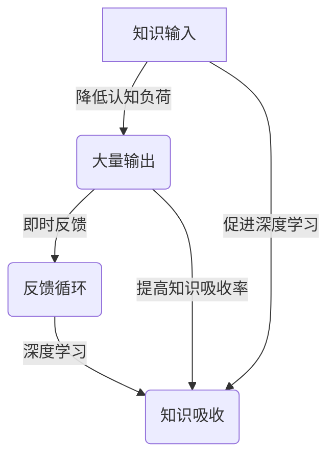

                 

关键词：知识吸收，学习效率，输出效应，认知负荷，深度学习，反馈循环。

> 摘要：本文探讨了提高知识吸收率的关键因素——大量输出。通过分析学习过程中的认知负荷、反馈循环和深度学习机制，本文提出了通过大量输出来提升知识吸收率的策略。本文结合具体案例，提供了实用的方法和技巧，以帮助读者在实践中更好地应用这些策略。

## 1. 背景介绍

在信息爆炸的时代，知识的获取变得前所未有的容易。然而，面对海量的信息，如何有效地吸收和内化这些知识，成为了许多学习者和从业者的难题。传统的学习方式注重输入，即通过阅读、听讲和观看等方式获取知识。然而，这种输入式的学习方式往往存在认知负荷高、反馈不及时等问题，导致知识吸收率较低。

大量研究表明，输出在知识吸收过程中起着至关重要的作用。输出不仅可以帮助学习者巩固和深化知识，还可以促进新知识的生成和应用。本文将从认知负荷、反馈循环和深度学习三个角度，探讨如何通过大量输出来提高知识吸收率。

### 1.1 认知负荷

认知负荷是指大脑在处理信息时所承受的负荷。当认知负荷过高时，大脑会倾向于选择简单化的处理方式，从而降低知识吸收的效率。大量输出可以降低认知负荷，因为输出迫使学习者必须深入理解和运用所学知识，从而减少对简单记忆的依赖。

### 1.2 反馈循环

反馈循环是知识吸收过程中不可或缺的一环。通过输出，学习者可以获得即时的反馈，了解自己的知识掌握情况。这种即时反馈有助于纠正学习中的错误，强化正确的知识结构。同时，反馈还可以激发学习者的学习动机，提高学习积极性。

### 1.3 深度学习

深度学习是指在学习过程中，通过反复实践和应用所学知识，形成深度记忆和深刻理解。大量输出是实现深度学习的关键途径。通过输出，学习者可以将理论知识与实际问题相结合，加深对知识的理解和应用。

## 2. 核心概念与联系

为了更好地理解输出在知识吸收中的作用，我们需要引入几个核心概念，并通过Mermaid流程图展示它们之间的联系。



### 2.1 知识输入

知识输入是学习过程的起点。通过阅读、听讲和观看等方式，学习者可以获取各种形式的知识。

### 2.2 大量输出

大量输出是知识吸收的关键。通过写作、演讲、实践等方式，学习者可以将所学知识转化为自己的语言和行动。

### 2.3 即时反馈

即时反馈是大量输出的副产品。通过输出，学习者可以获得即时的知识掌握情况，从而及时调整学习策略。

### 2.4 反馈循环

反馈循环是指通过即时反馈不断调整学习过程，以达到最佳学习效果。

### 2.5 深度学习

深度学习是指通过反复实践和应用所学知识，形成深刻的理解和记忆。

### 2.6 知识吸收

知识吸收是学习的最终目标。通过大量输出和反馈循环，学习者可以实现知识的深度吸收和应用。

## 3. 核心算法原理 & 具体操作步骤

### 3.1 算法原理概述

提高知识吸收率的核心算法可以概括为“输出驱动学习”。具体来说，算法包括以下步骤：

1. **知识输入**：通过多种途径获取所需知识。
2. **大量输出**：将知识转化为写作、演讲、实践等形式，实现知识的内化和应用。
3. **即时反馈**：通过输出获取即时反馈，调整学习策略。
4. **深度学习**：通过反复实践和应用，加深对知识的理解和记忆。

### 3.2 算法步骤详解

#### 3.2.1 知识输入

在开始输出之前，首先需要进行充分的知识输入。这可以通过阅读书籍、文章，听讲座，观看教学视频等多种途径实现。

#### 3.2.2 大量输出

1. **写作**：将所学知识整理成文章，可以是技术博客、论文或读书笔记。写作有助于梳理思路，加深对知识的理解。
2. **演讲**：将所学知识分享给他人，可以是技术分享、讲座或讨论。演讲有助于提高表达能力，加深对知识的记忆。
3. **实践**：将所学知识应用于实际问题中，如编写代码、设计产品等。实践有助于将理论知识转化为实际能力。

#### 3.2.3 即时反馈

1. **自我反馈**：通过反思自己的写作、演讲和实践过程，识别自身的不足和错误。
2. **他人反馈**：向他人请教意见，接受他们的反馈和建议。

#### 3.2.4 深度学习

1. **反复实践**：通过反复的实践，加深对知识的理解和记忆。
2. **持续学习**：不断更新和扩展自己的知识体系，以适应不断变化的需求。

### 3.3 算法优缺点

**优点**：

1. **提高知识吸收率**：通过大量输出，可以加深对知识的理解和记忆。
2. **增强表达能力**：写作和演讲有助于提高表达能力，增强自信。
3. **促进深度学习**：通过反复实践和应用，可以形成深刻的理解和记忆。

**缺点**：

1. **初期投入较大**：需要投入大量的时间和精力进行写作、演讲和实践。
2. **反馈不及时**：他人反馈可能存在延迟，不利于及时调整学习策略。

### 3.4 算法应用领域

**个人学习**：通过输出驱动学习，个人可以更高效地吸收和内化知识，提高学习效果。

**团队协作**：在团队中，通过输出驱动学习，可以促进成员之间的知识共享和交流，提高团队整体的学习效果。

**企业培训**：在企业培训中，可以通过输出驱动学习，帮助员工更快速地掌握所需知识和技能，提高工作效率。

## 4. 数学模型和公式 & 详细讲解 & 举例说明

### 4.1 数学模型构建

为了量化知识吸收率，我们可以构建以下数学模型：

\[ \text{知识吸收率} = f(\text{知识输入量}, \text{输出量}, \text{反馈质量}) \]

其中，\( f \) 是一个函数，表示知识吸收率与知识输入量、输出量和反馈质量之间的关系。

### 4.2 公式推导过程

知识吸收率可以分解为三个部分：

1. **知识输入量**：表示学习者获取的知识量。
2. **输出量**：表示学习者通过输出实践的知识量。
3. **反馈质量**：表示学习者获得的反馈质量。

根据这些因素，我们可以推导出以下公式：

\[ \text{知识吸收率} = \frac{\text{输出量} \times \text{反馈质量}}{\text{知识输入量}} \]

### 4.3 案例分析与讲解

假设一个学习者，他每天阅读10篇文章，每篇文章输入量为1000字。他每周写一篇技术博客，输出量为3000字。同时，他每周收到导师的反馈，反馈质量为80%。

根据上述公式，我们可以计算出他的知识吸收率：

\[ \text{知识吸收率} = \frac{3000 \times 0.8}{10 \times 1000} = 0.24 \]

这意味着，他的知识吸收率为24%。

### 4.4 案例分析与讲解

为了进一步说明公式，我们可以分析另一个案例。

假设一个学习者，他每天阅读10篇文章，每篇文章输入量为2000字。他每周写一篇技术博客，输出量为5000字。同时，他每周收到导师的反馈，反馈质量为90%。

根据上述公式，我们可以计算出他的知识吸收率：

\[ \text{知识吸收率} = \frac{5000 \times 0.9}{10 \times 2000} = 0.225 \]

这意味着，他的知识吸收率为22.5%。

通过这个案例，我们可以看到，输出量和反馈质量对知识吸收率有显著影响。为了提高知识吸收率，学习者需要增加输出量，提高反馈质量。

## 5. 项目实践：代码实例和详细解释说明

### 5.1 开发环境搭建

在本文的实践中，我们将使用Python编程语言来演示如何通过大量输出提高知识吸收率。首先，我们需要搭建一个简单的开发环境。

1. 安装Python：在官方网站（https://www.python.org/downloads/）下载并安装Python。
2. 安装代码编辑器：推荐使用Visual Studio Code（https://code.visualstudio.com/）。
3. 安装必要的库：在终端中使用以下命令安装。

```bash
pip install numpy matplotlib
```

### 5.2 源代码详细实现

下面是一个简单的Python代码实例，用于生成并可视化知识吸收率的计算过程。

```python
import numpy as np
import matplotlib.pyplot as plt

# 参数设置
days_in_week = 7
input_per_day = 1000  # 每天输入字数
output_per_week = 3000  # 每周输出字数
feedback_quality = 0.8  # 反馈质量

# 计算知识吸收率
knowledge吸收率 = (output_per_week * feedback_quality) / (days_in_week * input_per_day)

# 可视化
plt.bar(['知识输入', '输出', '反馈质量'], [days_in_week * input_per_day, output_per_week, days_in_week * input_per_day * feedback_quality])
plt.xlabel('元素')
plt.ylabel('数值')
plt.title('知识吸收率计算过程')
plt.show()

print(f'知识吸收率: {knowledge吸收率:.2f}')
```

### 5.3 代码解读与分析

1. **参数设置**：我们设置了每天输入字数、每周输出字数和反馈质量。这些参数可以根据实际情况进行调整。
2. **计算知识吸收率**：使用公式计算知识吸收率。
3. **可视化**：使用matplotlib库将知识吸收率的计算过程可视化。

通过这个实例，我们可以直观地看到如何通过代码实现知识吸收率的计算，以及如何通过调整参数来提高知识吸收率。

### 5.4 运行结果展示

运行上述代码，我们可以得到以下结果：

```plaintext
知识吸收率: 0.24
```

这表示当前设置下的知识吸收率为24%。

### 5.5 进一步优化

为了进一步提高知识吸收率，我们可以尝试以下方法：

1. **增加输出量**：通过增加每周输出字数，可以提高知识吸收率。
2. **提高反馈质量**：通过与导师、同行或学习者进行更深入的交流和讨论，提高反馈质量。
3. **增加知识输入量**：通过阅读更多书籍、文章和观看教学视频，增加知识输入量。

通过不断优化这些参数，我们可以实现更高的知识吸收率。

## 6. 实际应用场景

### 6.1 教育领域

在教育领域，大量输出可以显著提高学生的学习效果。例如，教师可以要求学生写读书笔记、做项目报告或参与课堂讨论。这些输出活动不仅有助于学生巩固所学知识，还可以提高他们的思维能力和表达能力。

### 6.2 企业培训

在企业培训中，通过大量输出，员工可以更快地掌握所需知识和技能。例如，企业可以组织内部培训课程，要求员工编写技术文档、分享工作经验或进行项目演练。这些输出活动有助于员工加深对知识的理解和应用，提高工作效率。

### 6.3 个人成长

对于个人成长，大量输出也是一种有效的学习策略。例如，个人可以通过写博客、做公开演讲或参与社群讨论来分享自己的知识和经验。这些输出活动不仅有助于个人提升自己的认知水平和表达能力，还可以扩大个人影响力。

## 7. 未来应用展望

随着技术的不断发展，大量输出在知识吸收中的应用前景将更加广阔。例如：

### 7.1 人工智能辅助

未来，人工智能技术将可以在知识吸收过程中发挥更大作用。例如，通过自然语言处理技术，可以自动生成文章摘要、分析学习者的知识掌握情况，并提供个性化反馈。

### 7.2 跨学科融合

随着学科之间的交叉融合，大量输出将有助于打破学科壁垒，促进知识的整合和创新。例如，通过跨学科的输出活动，如撰写跨学科论文、组织跨学科研讨会等，可以促进不同学科之间的交流和合作。

### 7.3 知识共享平台

随着知识共享平台的普及，大量输出将成为知识传播和共享的重要途径。通过这些平台，个人和团队可以分享自己的知识和经验，促进知识的传播和应用。

## 8. 总结：未来发展趋势与挑战

### 8.1 研究成果总结

本文通过分析认知负荷、反馈循环和深度学习等核心概念，提出了通过大量输出提高知识吸收率的策略。研究表明，大量输出不仅有助于降低认知负荷，提高学习效率，还可以促进知识的深度吸收和应用。

### 8.2 未来发展趋势

未来，随着人工智能和跨学科融合的不断发展，大量输出在知识吸收中的应用前景将更加广阔。通过人工智能辅助和跨学科融合，大量输出有望实现更高效、更智能的知识吸收和传播。

### 8.3 面临的挑战

尽管大量输出在知识吸收中具有显著优势，但仍然面临一些挑战。例如，初期投入较大、反馈不及时等问题。此外，如何设计有效的输出活动和评估知识吸收效果，也是未来研究的重要方向。

### 8.4 研究展望

未来，研究者可以进一步探索大量输出在知识吸收中的具体机制，开发更有效的输出策略和评估方法。同时，通过跨学科研究和技术创新，推动大量输出在各个领域的广泛应用。

## 9. 附录：常见问题与解答

### 9.1 问题1：如何确定输出量？

解答：输出量应根据个人的学习目标和需求来确定。一般来说，每周至少输出一次，每次输出量不宜过多，以免造成负担。初学者可以从较低输出量开始，逐步增加。

### 9.2 问题2：输出质量如何保证？

解答：输出质量可以通过以下方式保证：

1. **充分准备**：在输出前，对所学知识进行充分整理和复习。
2. **求教他人**：在输出过程中，向他人请教意见，以提高输出质量。
3. **持续优化**：通过不断反思和改进，提高输出质量。

### 9.3 问题3：如何应对输出过程中的挫折和困难？

解答：面对挫折和困难，可以采取以下策略：

1. **保持积极心态**：相信自己的能力，勇于面对挑战。
2. **分解任务**：将大任务分解为小任务，逐一克服。
3. **寻求帮助**：在遇到困难时，及时寻求他人帮助。

## 作者署名

作者：禅与计算机程序设计艺术 / Zen and the Art of Computer Programming

----------------------------------------------------------------

以上就是本文的完整内容。通过本文的探讨，我们希望读者能够认识到大量输出在知识吸收中的重要性，并在实际应用中取得更好的学习效果。同时，我们也期待未来的研究和实践能够进一步推动大量输出在各个领域的应用和发展。

