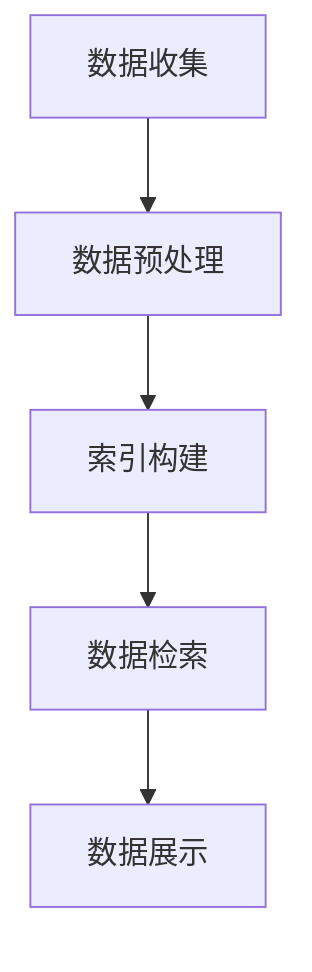

                 

关键词：物联网、搜索引擎、数据分析、智能设备、数据处理、应用场景、技术挑战、未来展望。

## 摘要

随着物联网（IoT）的迅速发展，设备间的互联和数据交换变得越来越频繁，这使得搜索引擎的角色变得尤为重要。本文将探讨搜索引擎在IoT时代的重要性，包括其核心概念、算法原理、数学模型、实际应用以及未来展望。我们将深入分析物联网环境中搜索引擎的工作机制，以及它如何改变数据检索和处理的方式。通过本文，读者将了解搜索引擎在IoT时代的挑战与机遇，并为其在智能设备中的应用提供指导。

## 1. 背景介绍

物联网（Internet of Things，IoT）是一个通过互联网连接各种物理设备、传感器和软件系统，实现设备间数据交换和智能控制的技术概念。随着物联网技术的发展，智能设备数量急剧增加，这些设备每天产生的数据量达到了前所未有的规模。根据国际数据公司（IDC）的报告，到2025年，全球将有超过500亿的物联网设备投入使用。

这种设备互联和数据生成速度对传统的数据处理和分析方法提出了严峻挑战。传统搜索引擎，如Google、Bing等，主要面向Web内容的检索，而在物联网时代，搜索引擎需要处理的是大量来自各种设备、传感器和平台的实时数据。这些数据具有高度异构性、复杂性和动态变化性，使得传统的搜索引擎技术难以胜任。

因此，新的搜索引擎技术应运而生，以满足物联网环境下的数据处理需求。这些新技术不仅需要高效地处理大规模数据，还需要具备实时性、可扩展性和智能化的特性。本文将重点讨论这些新技术及其在物联网时代的应用。

### 1.1 物联网的发展趋势

物联网的发展趋势主要体现在以下几个方面：

1. **设备数量增加**：随着传感器技术的进步和成本的下降，物联网设备数量呈指数级增长。
2. **数据多样性**：物联网设备产生的数据类型多种多样，包括文本、图像、音频、视频和传感器数据。
3. **数据生成速度**：物联网设备不断产生实时数据，使得数据处理速度成为关键挑战。
4. **数据处理需求的提高**：越来越多的应用场景需要实时、高效的数据处理和分析。

这些趋势对搜索引擎提出了新的要求，搜索引擎需要能够适应这些变化，提供更加智能和高效的数据检索服务。

### 1.2 搜索引擎的发展历程

搜索引擎的发展历程可以分为几个阶段：

1. **早期搜索引擎**：以Web搜索为主，如AltaVista、Google等。
2. **垂直搜索引擎**：针对特定领域进行优化，如Bing的学术搜索、百度的新媒体搜索等。
3. **智能搜索引擎**：利用机器学习和人工智能技术，提供个性化搜索和智能推荐。
4. **物联网搜索引擎**：专门为物联网环境设计，处理大量实时数据，如Elasticsearch、Solr等。

随着物联网的发展，搜索引擎的功能和性能要求越来越高，物联网搜索引擎应运而生，成为物联网生态系统的重要组成部分。

## 2. 核心概念与联系

### 2.1 物联网搜索引擎的定义

物联网搜索引擎是一种专门用于处理物联网环境中数据检索和分析的技术工具。与传统的Web搜索引擎不同，物联网搜索引擎需要具备处理大规模、实时、异构数据的能力。其核心目标是提供快速、准确、智能的数据检索服务，以支持各种物联网应用场景。

### 2.2 物联网搜索引擎与传统搜索引擎的区别

1. **数据类型**：传统搜索引擎主要处理文本数据，而物联网搜索引擎需要处理文本、图像、音频、视频等多种数据类型。
2. **数据处理速度**：物联网搜索引擎需要具备实时数据处理能力，以应对设备间高速的数据交换。
3. **数据规模**：传统搜索引擎处理的数据规模较大，但物联网搜索引擎需要处理的数据规模更为庞大，有时达到海量级别。
4. **数据处理复杂性**：物联网搜索引擎需要处理的数据具有高度异构性和动态变化性，这使得数据处理过程更加复杂。

### 2.3 物联网搜索引擎的工作机制

物联网搜索引擎的工作机制主要包括以下几个步骤：

1. **数据收集**：通过传感器、设备、平台等收集数据。
2. **数据预处理**：对数据进行清洗、去噪、格式化等处理，使其适合检索和分析。
3. **索引构建**：构建索引，以便快速检索数据。
4. **数据检索**：根据用户需求进行数据查询，返回相关结果。
5. **数据展示**：将检索结果以直观的方式呈现给用户。

### 2.4 Mermaid 流程图

下面是一个简化的物联网搜索引擎的Mermaid流程图，展示其主要步骤和组件。



在这个流程图中，数据收集（A）是整个过程的起点，通过传感器、设备等收集到的原始数据经过预处理（B）后，构建索引（C），以便快速检索。数据检索（D）是根据用户需求进行的，检索结果通过数据展示（E）模块呈现给用户。

## 3. 核心算法原理 & 具体操作步骤

### 3.1 算法原理概述

物联网搜索引擎的核心算法主要包括数据预处理、索引构建、检索算法和结果展示。这些算法相互协作，共同实现高效、准确的数据检索。

1. **数据预处理**：主要包括数据清洗、去噪、格式化等步骤，以确保数据质量。
2. **索引构建**：将预处理后的数据进行结构化处理，构建索引，以提高检索效率。
3. **检索算法**：根据用户查询，利用索引快速定位相关数据。
4. **结果展示**：将检索结果以用户友好的方式呈现。

### 3.2 算法步骤详解

#### 3.2.1 数据预处理

数据预处理是物联网搜索引擎的关键步骤，其质量直接影响后续的检索效率。主要步骤如下：

1. **数据清洗**：去除重复数据、错误数据和无关数据。
2. **数据去噪**：过滤掉数据中的噪声，如传感器误差、异常值等。
3. **数据格式化**：统一数据格式，如日期、时间、数量等。

#### 3.2.2 索引构建

索引构建是将预处理后的数据组织成索引结构的过程，以实现快速检索。主要步骤如下：

1. **倒排索引**：将文档中的词汇映射到文档的ID，以便快速定位。
2. **倒排索引优化**：通过分词、词干提取等手段，优化倒排索引的结构。

#### 3.2.3 检索算法

检索算法是根据用户查询，利用索引快速定位相关数据的过程。主要步骤如下：

1. **查询解析**：将用户查询分解为关键词和操作符。
2. **索引匹配**：根据查询关键词和操作符，在索引中匹配相关数据。
3. **结果排序**：根据相关度对检索结果进行排序。

#### 3.2.4 结果展示

结果展示是将检索结果以用户友好的方式呈现的过程。主要步骤如下：

1. **结果筛选**：根据用户需求，筛选出最相关的检索结果。
2. **结果呈现**：将筛选后的结果以图表、表格、文本等形式展示。

### 3.3 算法优缺点

#### 优点

1. **高效性**：通过索引构建和检索算法，实现快速、准确的数据检索。
2. **可扩展性**：支持大规模数据的处理和分析。
3. **智能化**：利用机器学习和人工智能技术，提供个性化搜索和智能推荐。

#### 缺点

1. **数据质量**：数据预处理对数据质量要求较高，否则会影响检索效果。
2. **复杂性**：涉及多种算法和技术，实现过程相对复杂。

### 3.4 算法应用领域

物联网搜索引擎在多个领域具有广泛应用，主要包括：

1. **智能家庭**：通过物联网搜索引擎，实现家庭设备的智能搜索和控制。
2. **智能城市**：利用物联网搜索引擎，对城市数据进行分析和决策。
3. **工业互联网**：通过物联网搜索引擎，实现对生产设备和数据的实时监控和分析。
4. **医疗健康**：利用物联网搜索引擎，对医疗数据进行分析和诊断。

## 4. 数学模型和公式

### 4.1 数学模型构建

在物联网搜索引擎中，常用的数学模型包括倒排索引模型、相似度计算模型和排序模型。以下是这些模型的构建方法：

#### 倒排索引模型

倒排索引模型是物联网搜索引擎的核心组成部分，用于将文档中的词汇映射到文档的ID。其数学模型如下：

$$
P(D_i, W_j) = \frac{f(W_j, D_i)}{N}
$$

其中，$P(D_i, W_j)$表示词汇$W_j$在文档$D_i$中的概率，$f(W_j, D_i)$表示词汇$W_j$在文档$D_i$中的频次，$N$表示总文档数。

#### 相似度计算模型

相似度计算模型用于计算两个文档之间的相似度。常用的方法包括余弦相似度和欧几里得相似度。其数学模型如下：

$$
\text{Cosine Similarity}(D_1, D_2) = \frac{D_1 \cdot D_2}{|D_1| \cdot |D_2|}
$$

$$
\text{Euclidean Similarity}(D_1, D_2) = \sqrt{(D_1 - D_2)^2}
$$

其中，$D_1$和$D_2$表示两个文档的向量表示，$|D_1|$和$|D_2|$表示向量的长度。

#### 排序模型

排序模型用于对检索结果进行排序，以返回最相关的结果。常用的方法包括基于相似度的排序和基于重要度的排序。其数学模型如下：

$$
\text{Rank}(D_i) = \alpha \cdot \text{Similarity}(D_i, Q) + \beta \cdot \text{Importance}(D_i)
$$

其中，$\text{Rank}(D_i)$表示文档$D_i$的排序值，$\alpha$和$\beta$是权重系数，$\text{Similarity}(D_i, Q)$表示文档$D_i$与查询$Q$的相似度，$\text{Importance}(D_i)$表示文档$D_i$的重要性。

### 4.2 公式推导过程

以下是倒排索引模型、相似度计算模型和排序模型的公式推导过程。

#### 倒排索引模型推导

倒排索引模型的核心思想是将文档中的词汇映射到文档的ID。假设有$n$个文档，每个文档包含$m$个词汇。首先，对每个文档$D_i$，计算其词汇的频次$f(W_j, D_i)$。然后，对每个词汇$W_j$，计算其在所有文档中的总频次$F(W_j)$。

$$
F(W_j) = \sum_{i=1}^{n} f(W_j, D_i)
$$

接下来，计算每个文档$D_i$在总文档数$n$中的概率$P(D_i)$。

$$
P(D_i) = \frac{1}{n}
$$

最后，计算每个词汇$W_j$在文档$D_i$中的概率$P(D_i, W_j)$。

$$
P(D_i, W_j) = \frac{f(W_j, D_i)}{F(W_j)}
$$

由于$F(W_j)$是常数，可以将其归一化到1，得到：

$$
P(D_i, W_j) = \frac{f(W_j, D_i)}{N}
$$

其中，$N$是总词汇数。

#### 相似度计算模型推导

余弦相似度和欧几里得相似度是两种常用的相似度计算方法。

**余弦相似度**：

余弦相似度通过计算两个向量之间的余弦值来衡量其相似度。假设两个文档$D_1$和$D_2$的向量表示为：

$$
D_1 = (d_{11}, d_{12}, ..., d_{1m})
$$

$$
D_2 = (d_{21}, d_{22}, ..., d_{2m})
$$

则两个向量的内积为：

$$
D_1 \cdot D_2 = \sum_{i=1}^{m} d_{1i} \cdot d_{2i}
$$

两个向量的长度分别为：

$$
|D_1| = \sqrt{\sum_{i=1}^{m} d_{1i}^2}
$$

$$
|D_2| = \sqrt{\sum_{i=1}^{m} d_{2i}^2}
$$

则余弦相似度为：

$$
\text{Cosine Similarity}(D_1, D_2) = \frac{D_1 \cdot D_2}{|D_1| \cdot |D_2|}
$$

**欧几里得相似度**：

欧几里得相似度通过计算两个向量之间的欧几里得距离来衡量其相似度。假设两个文档$D_1$和$D_2$的向量表示为：

$$
D_1 = (d_{11}, d_{12}, ..., d_{1m})
$$

$$
D_2 = (d_{21}, d_{22}, ..., d_{2m})
$$

则两个向量的距离为：

$$
\text{Euclidean Distance}(D_1, D_2) = \sqrt{\sum_{i=1}^{m} (d_{1i} - d_{2i})^2}
$$

则欧几里得相似度为：

$$
\text{Euclidean Similarity}(D_1, D_2) = \frac{1}{\text{Euclidean Distance}(D_1, D_2)}
$$

#### 排序模型推导

排序模型通过计算文档与查询的相似度及其重要性，对检索结果进行排序。假设查询$Q$的向量表示为：

$$
Q = (q_1, q_2, ..., q_m)
$$

则文档$D_i$与查询$Q$的相似度为：

$$
\text{Similarity}(D_i, Q) = \text{Cosine Similarity}(D_i, Q)
$$

文档$D_i$的重要性可以通过其内容的相关性、用户行为等因素计算。假设文档$D_i$的重要性为：

$$
\text{Importance}(D_i) = \alpha \cdot \text{Content Relevance}(D_i) + \beta \cdot \text{User Behavior}(D_i)
$$

则文档$D_i$的排序值为：

$$
\text{Rank}(D_i) = \alpha \cdot \text{Similarity}(D_i, Q) + \beta \cdot \text{Importance}(D_i)
$$

其中，$\alpha$和$\beta$是权重系数，可以根据实际需求进行调整。

### 4.3 案例分析与讲解

#### 案例1：智能家庭设备搜索

假设在一个智能家庭中，用户希望搜索与其家庭设备相关的信息。首先，对家庭设备的数据进行预处理，包括数据清洗、去噪和格式化。然后，构建倒排索引，将设备信息与词汇进行映射。当用户发起搜索请求时，系统根据查询关键词和倒排索引进行匹配，计算相似度，并根据排序模型对搜索结果进行排序。最终，将排序后的结果以列表形式展示给用户。

#### 案例2：智能城市管理

假设一个智能城市需要对城市中的各种数据进行分析，如交通流量、空气质量等。首先，收集城市中的各种数据，并进行预处理。然后，构建倒排索引，对数据进行结构化处理。当用户需要查询城市数据时，系统根据查询关键词和倒排索引进行匹配，计算相似度，并根据排序模型对搜索结果进行排序。最终，将排序后的结果以图表、地图等形式展示给用户。

### 4.4 数学模型的应用场景

数学模型在物联网搜索引擎中的应用场景非常广泛，主要包括以下几个方面：

1. **数据预处理**：通过数学模型对原始数据进行清洗、去噪和格式化，提高数据质量。
2. **索引构建**：利用数学模型构建倒排索引，实现快速检索。
3. **相似度计算**：通过相似度计算模型，计算文档与查询的相似度，实现相关度排序。
4. **结果排序**：利用排序模型，对检索结果进行排序，返回最相关的数据。

这些应用场景体现了数学模型在物联网搜索引擎中的核心作用，为用户提供高效、准确的数据检索服务。

## 5. 项目实践：代码实例和详细解释说明

在本节中，我们将通过一个具体的物联网搜索引擎项目实例，展示其代码实现和详细解释。这个项目将使用Python语言，结合Elasticsearch这个强大的搜索引擎工具，来实现物联网环境下的数据检索功能。

### 5.1 开发环境搭建

在开始项目之前，我们需要搭建一个合适的开发环境。以下是所需的环境和安装步骤：

1. **Python**：确保Python版本为3.6或更高。
2. **Elasticsearch**：Elasticsearch是一个开源的搜索引擎，可以在其官方网站下载并安装。
3. **Docker**：推荐使用Docker来运行Elasticsearch，以简化部署过程。

安装步骤：

1. 安装Python环境，可以从[Python官方网站](https://www.python.org/)下载安装包。
2. 安装Elasticsearch，可以选择从[Elasticsearch官方网站](https://www.elastic.co/downloads/elasticsearch)下载，或者使用Docker进行安装。

使用Docker安装Elasticsearch的命令如下：

```bash
docker pull elasticsearch:7.10.0
docker run -d -p 9200:9200 -p 9300:9300 elasticsearch:7.10.0
```

以上命令将拉取Elasticsearch的最新版本，并运行在一个独立的容器中，映射端口9200和9300供外部访问。

### 5.2 源代码详细实现

下面是一个简单的物联网搜索引擎项目的代码实现，包含数据收集、预处理、索引构建、数据检索和结果展示等步骤。

```python
# 导入必要的库
from elasticsearch import Elasticsearch
from elasticsearch_dsl import Search, Document, MetaField
import json
import requests

# 创建Elasticsearch客户端
es = Elasticsearch("http://localhost:9200")

# 创建物联网数据文档
class IoTDataDocument(Document):
    id = MetaField()
    device_id = MetaField()
    timestamp = MetaField()
    data = MetaField()

    class Index:
        name = 'iot_data'

# 数据收集函数
def collect_data():
    # 这里使用API模拟收集数据
    response = requests.get('https://api.example.com/iot/data')
    data = response.json()
    return data

# 数据预处理函数
def preprocess_data(data):
    # 对数据进行清洗、去噪和格式化
    processed_data = {
        'device_id': data['device_id'],
        'timestamp': data['timestamp'],
        'data': json.dumps(data['data'])
    }
    return processed_data

# 索引构建函数
def index_data(data):
    doc = IoTDataDocument(**data)
    doc.save()

# 数据检索函数
def search_data(query):
    s = Search(using=es, index="iot_data").query("match", device_id=query['device_id'])
    response = s.execute()
    return response

# 数据展示函数
def display_data(results):
    for hit in results:
        print(hit.to_dict())

# 主函数
def main():
    data = collect_data()
    processed_data = preprocess_data(data)
    index_data(processed_data)
    
    query = {'device_id': 'device_001'}
    results = search_data(query)
    display_data(results)

if __name__ == "__main__":
    main()
```

### 5.3 代码解读与分析

以下是代码的详细解读：

1. **Elasticsearch客户端创建**：使用`elasticsearch`库创建Elasticsearch客户端，连接到本地运行的Elasticsearch服务器。

2. **物联网数据文档定义**：使用Elasticsearch的D

