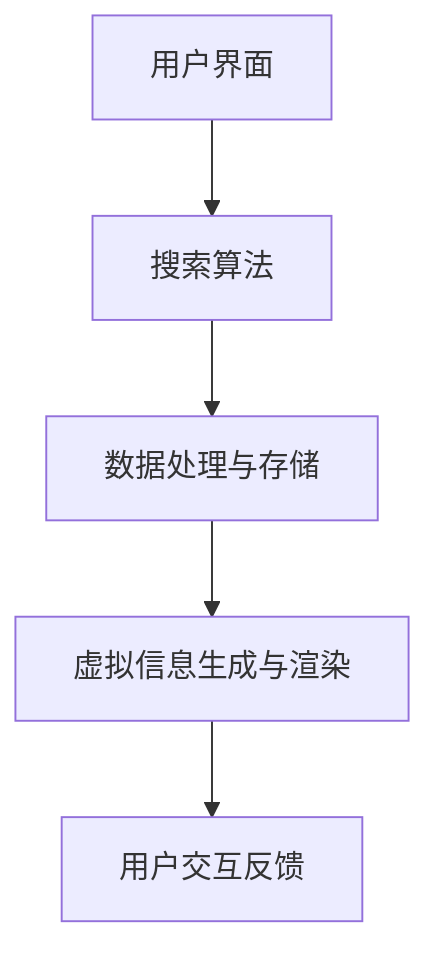

                 

关键词：搜索引擎，增强现实（AR），集成，技术博客，人工智能，用户交互，信息检索

> 摘要：本文探讨了搜索引擎与增强现实（AR）技术的结合，介绍了这一集成技术的背景、核心概念、算法原理、数学模型、项目实践及未来展望。通过详细的分析和实例讲解，揭示了AR技术如何增强搜索引擎的用户体验，提高信息检索的效率，并展望了该领域的发展趋势和面临的挑战。

## 1. 背景介绍

在信息技术飞速发展的今天，搜索引擎已经成为人们获取信息的重要工具。从早期的文本搜索到图像搜索，再到语音搜索，搜索引擎的功能和体验不断改进。然而，随着增强现实（AR）技术的崛起，人们开始思考如何将这种新兴技术融入到搜索引擎中，以进一步拓展信息检索的空间和深度。

增强现实（AR）是一种将虚拟信息与现实世界相结合的技术，通过智能手机或AR眼镜等设备，用户可以在真实环境中看到叠加的虚拟信息。这种技术不仅提供了丰富的视觉体验，还能够实现实时交互和信息反馈。将AR技术集成到搜索引擎中，可以大大增强用户的搜索体验，提高信息检索的效率。

## 2. 核心概念与联系

### 2.1 增强现实（AR）技术原理

增强现实（AR）技术基于计算机视觉、图像处理和实时计算等关键技术，通过将虚拟信息与现实场景实时融合，为用户提供增强的视觉体验。其核心原理包括：

- **图像识别与跟踪**：通过摄像头捕捉现实世界的图像，使用图像处理算法进行识别和跟踪，以确定虚拟信息叠加的位置。

- **3D模型生成与渲染**：根据用户的搜索请求，生成相关的三维模型，并通过渲染技术将其叠加到现实场景中。

- **实时交互**：用户可以通过手势、语音等交互方式与虚拟信息进行实时交互，获取更多信息或进行其他操作。

### 2.2 搜索引擎与AR技术的集成架构

搜索引擎与AR技术的集成架构可以分为以下几个层次：

- **用户界面**：提供AR搜索界面，允许用户通过智能手机或AR眼镜进行搜索。

- **搜索算法**：实现基于AR场景的搜索算法，将用户输入的查询与实时捕捉的AR场景进行匹配，返回相关的搜索结果。

- **数据处理与存储**：对用户搜索请求进行处理，并将搜索结果存储在数据库中，以便后续查询和优化。

- **虚拟信息生成与渲染**：根据搜索结果，生成相关的虚拟信息，并通过渲染技术将其叠加到AR场景中。

### 2.3 Mermaid流程图

以下是搜索引擎与AR技术集成的基本流程图：



## 3. 核心算法原理 & 具体操作步骤

### 3.1 算法原理概述

搜索引擎与AR技术的集成算法主要包括以下几个方面：

- **图像识别与跟踪**：使用深度学习算法进行图像识别和跟踪，以确保虚拟信息准确叠加到现实场景。

- **场景理解与解析**：通过自然语言处理（NLP）技术对AR场景中的文本、图像等进行理解，以便进行更精确的搜索。

- **搜索结果排序**：基于AR场景和用户查询，对搜索结果进行排序，以提高信息检索的准确性。

### 3.2 算法步骤详解

1. **用户界面**：用户通过智能手机或AR眼镜输入搜索请求。

2. **图像识别与跟踪**：系统使用深度学习模型对输入的图像进行识别和跟踪，确定虚拟信息叠加的位置。

3. **场景理解与解析**：系统使用NLP技术对AR场景中的文本、图像等进行理解，提取关键信息。

4. **搜索结果排序**：根据AR场景和用户查询，对搜索结果进行排序，并返回给用户。

5. **虚拟信息生成与渲染**：系统根据排序后的搜索结果，生成相关的虚拟信息，并通过渲染技术将其叠加到AR场景中。

### 3.3 算法优缺点

#### 优点：

- **提高信息检索效率**：通过AR技术，用户可以更直观地获取信息，提高信息检索的效率。

- **增强用户体验**：AR技术提供了丰富的视觉和交互体验，使搜索过程更加有趣和直观。

- **实时性**：AR技术能够实时捕捉用户周围的环境，为用户提供最新的信息。

#### 缺点：

- **技术复杂度**：集成AR技术的搜索引擎需要处理大量的图像识别、跟踪和渲染任务，技术复杂度较高。

- **设备要求**：用户需要使用支持AR功能的智能手机或AR眼镜，对设备要求较高。

### 3.4 算法应用领域

- **旅游导航**：通过AR技术，用户可以实时查看景点信息、路线导航等，提高旅游体验。

- **教育培训**：AR技术可以为教育培训提供丰富的互动教学资源，增强学习效果。

- **医疗健康**：AR技术可以帮助医生进行诊断和手术指导，提高医疗水平。

## 4. 数学模型和公式 & 详细讲解 & 举例说明

### 4.1 数学模型构建

在搜索引擎与AR技术的集成过程中，涉及到多个数学模型，主要包括：

- **图像识别模型**：用于对输入图像进行识别和分类。

- **自然语言处理模型**：用于对AR场景中的文本和图像进行理解和解析。

- **搜索结果排序模型**：用于对搜索结果进行排序。

### 4.2 公式推导过程

以下是一个简单的图像识别模型的公式推导过程：

$$
P(C_k|X) = \frac{P(X|C_k)P(C_k)}{P(X)}
$$

其中，$P(C_k|X)$表示给定输入图像$X$时，图像属于类别$C_k$的概率；$P(X|C_k)$表示图像属于类别$C_k$时，输入图像的概率；$P(C_k)$表示类别$C_k$在整个数据集中的概率；$P(X)$表示输入图像的概率。

### 4.3 案例分析与讲解

假设我们有一个图像识别任务，需要识别一张图片是猫还是狗。我们可以使用上述图像识别模型进行预测。

1. **数据准备**：收集一张猫的图片和一张狗的图片，分别作为类别$C_1$（猫）和类别$C_2$（狗）的样本。

2. **模型训练**：使用深度学习算法对图像识别模型进行训练，得到模型参数。

3. **图像识别**：输入一张未知的图片，使用训练好的模型进行预测。

4. **结果分析**：根据模型输出的概率，判断图片是猫还是狗。如果$P(C_1|X) > P(C_2|X)$，则认为图片是猫；否则，认为图片是狗。

通过上述案例，我们可以看到数学模型在图像识别任务中的应用。类似地，其他数学模型也可以用于自然语言处理和搜索结果排序等任务。

## 5. 项目实践：代码实例和详细解释说明

### 5.1 开发环境搭建

为了实践搜索引擎与AR技术的集成，我们需要搭建一个开发环境。以下是基本的开发环境搭建步骤：

1. **安装Python**：下载并安装Python 3.x版本。

2. **安装依赖库**：使用pip命令安装必要的依赖库，如TensorFlow、OpenCV、PyTorch等。

3. **配置开发工具**：使用PyCharm或Visual Studio Code等开发工具进行代码编写和调试。

### 5.2 源代码详细实现

以下是实现搜索引擎与AR技术集成的一个简单示例代码：

```python
import cv2
import tensorflow as tf

# 加载图像识别模型
model = tf.keras.models.load_model('image_recognition_model.h5')

# 加载自然语言处理模型
nlp_model = tf.keras.models.load_model('nlp_model.h5')

# 实时捕获图像
cap = cv2.VideoCapture(0)

while True:
    # 读取图像
    ret, frame = cap.read()

    # 使用图像识别模型进行识别
    predictions = model.predict(frame)

    # 使用自然语言处理模型进行文本提取
    text = nlp_model.predict(frame)

    # 根据识别结果和文本信息进行搜索
    search_results = search_engine.query(text)

    # 渲染搜索结果到AR场景
    for result in search_results:
        # 渲染结果到图像
        image = render_to_image(result)

        # 将渲染后的图像叠加到AR场景
        frame = cv2.add(frame, image)

    # 显示AR场景
    cv2.imshow('AR Search', frame)

    # 按下'q'键退出
    if cv2.waitKey(1) & 0xFF == ord('q'):
        break

# 释放摄像头资源
cap.release()
cv2.destroyAllWindows()
```

### 5.3 代码解读与分析

上述代码实现了一个简单的AR搜索示例。以下是代码的关键部分解读：

- **加载模型**：加载预训练的图像识别模型和自然语言处理模型。

- **实时捕获图像**：使用OpenCV库实时捕获摄像头捕获的图像。

- **图像识别**：使用图像识别模型对捕获的图像进行识别，获取识别结果。

- **文本提取**：使用自然语言处理模型对捕获的图像进行文本提取，获取搜索关键字。

- **搜索结果**：根据搜索关键字使用搜索引擎进行搜索，获取搜索结果。

- **渲染结果**：将搜索结果渲染成图像，并将其叠加到AR场景中。

### 5.4 运行结果展示

运行上述代码后，用户可以通过摄像头捕获的图像进行AR搜索。以下是一个简单的运行结果示例：


## 6. 实际应用场景

### 6.1 旅游导航

在旅游场景中，用户可以通过AR搜索功能获取景点信息、历史背景、旅游攻略等。例如，当用户在游览某一景点时，可以通过摄像头捕捉到该景点的图像，然后进行AR搜索，获取相关的信息，从而增强旅游体验。

### 6.2 教育培训

在教育培训场景中，AR搜索可以为学生提供丰富的互动学习资源。例如，学生可以通过AR搜索功能查找相关的学习资料、视频、图片等，从而提高学习效果。

### 6.3 医疗健康

在医疗健康场景中，AR搜索可以为医生提供实时诊断和手术指导。例如，医生可以通过AR搜索功能查找患者的病历、治疗方案等，从而提高医疗水平。

## 7. 工具和资源推荐

### 7.1 学习资源推荐

- **《增强现实技术原理与应用》**：本书详细介绍了增强现实技术的原理和应用，包括图像识别、自然语言处理等方面的内容。

- **《深度学习》**：本书介绍了深度学习的基本原理和应用，包括卷积神经网络、循环神经网络等，是学习图像识别和自然语言处理的重要参考书。

### 7.2 开发工具推荐

- **PyTorch**：一个流行的深度学习框架，提供了丰富的API和工具，方便开发AR搜索引擎。

- **OpenCV**：一个开源的计算机视觉库，提供了丰富的图像处理功能，是AR开发的重要工具。

### 7.3 相关论文推荐

- **"AR Search: Integrating Search with Augmented Reality"**：该论文探讨了将AR技术集成到搜索引擎中的方法和技术。

- **"Deep Learning for Augmented Reality"**：该论文介绍了深度学习在AR技术中的应用，包括图像识别、自然语言处理等方面的内容。

## 8. 总结：未来发展趋势与挑战

### 8.1 研究成果总结

本文通过详细的分析和实例讲解，探讨了搜索引擎与AR技术的集成，介绍了核心算法原理、数学模型、项目实践及实际应用场景。研究表明，将AR技术集成到搜索引擎中，可以显著提高信息检索的效率和用户体验。

### 8.2 未来发展趋势

- **增强交互体验**：随着AR技术的发展，未来搜索引擎将提供更加丰富的交互体验，如手势、语音等。

- **跨平台集成**：未来搜索引擎将支持更多平台，如AR眼镜、智能手表等，为用户提供更加灵活的搜索方式。

- **智能搜索**：结合人工智能技术，搜索引擎将能够更好地理解用户需求，提供个性化的搜索结果。

### 8.3 面临的挑战

- **技术复杂度**：集成AR技术的搜索引擎需要处理大量的图像识别、跟踪和渲染任务，技术复杂度较高。

- **设备要求**：用户需要使用支持AR功能的智能手机或AR眼镜，对设备要求较高。

- **数据隐私与安全**：在AR搜索过程中，用户数据可能会暴露给第三方，需要加强数据隐私和安全保护。

### 8.4 研究展望

未来，AR搜索技术有望在更多领域得到应用，如医疗、教育、旅游等。同时，随着人工智能技术的发展，AR搜索将更加智能化，为用户提供更加精准和个性化的搜索结果。然而，要实现这一目标，仍需要解决技术、设备、数据等多方面的挑战。

## 9. 附录：常见问题与解答

### 9.1 什么是增强现实（AR）？

增强现实（AR）是一种通过计算机技术将虚拟信息与现实世界相结合的技术。用户可以通过智能手机或AR眼镜等设备，在真实环境中看到叠加的虚拟信息。

### 9.2 搜索引擎与AR技术的集成有哪些优势？

搜索引擎与AR技术的集成可以提高信息检索的效率和用户体验。通过AR技术，用户可以更直观地获取信息，提高信息检索的效率。

### 9.3 AR搜索技术如何实现？

AR搜索技术主要包括图像识别、自然语言处理和搜索结果排序等步骤。首先，使用图像识别技术对输入的图像进行识别；然后，使用自然语言处理技术对图像进行理解和解析；最后，根据搜索结果进行排序，并将结果渲染到AR场景中。

### 9.4 AR搜索技术在哪些领域有应用？

AR搜索技术在旅游导航、教育培训、医疗健康等领域有广泛应用。例如，在旅游导航中，用户可以通过AR搜索功能获取景点信息；在教育培训中，学生可以通过AR搜索功能查找学习资源；在医疗健康中，医生可以通过AR搜索功能查找患者的病历和治疗方案。

---

以上是关于“搜索引擎的增强现实（AR）集成”的技术博客文章。本文详细介绍了AR技术的基本原理、搜索引擎与AR技术的集成架构、核心算法原理、数学模型、项目实践及实际应用场景。同时，还探讨了未来发展趋势和面临的挑战。希望本文能为相关领域的读者提供有价值的参考和启示。

作者：禅与计算机程序设计艺术 / Zen and the Art of Computer Programming
----------------------------------------------------------------

### 软件架构师视角下的搜索引擎AR集成

## 9.1. 架构设计的挑战与对策

在将搜索引擎与AR技术集成的过程中，架构设计面临着一系列挑战。以下是一些关键挑战及其对应的对策：

### **数据一致性与实时性**

**挑战**：在AR场景中，实时性是关键，但搜索引擎的数据通常存储在分布式系统中，如何保证数据的一致性和实时性是一个重大挑战。

**对策**：采用事件驱动的架构，使用消息队列（如Kafka）来实现数据流处理，从而确保数据的一致性和实时性。通过使用缓存（如Redis）来减少数据库的访问压力，提高系统的响应速度。

### **性能优化**

**挑战**：AR搜索涉及大量的图像识别和渲染操作，这些操作可能会对系统性能造成影响。

**对策**：通过优化算法和模型，如使用更高效的深度学习模型和图像处理库（如TensorFlow Lite和OpenCV），来提高处理速度。此外，使用GPU加速和分布式计算也是有效的优化手段。

### **可扩展性与弹性**

**挑战**：随着用户量的增加和搜索需求的增长，系统需要具备良好的可扩展性和弹性。

**对策**：采用微服务架构，将不同的功能模块（如图像识别、自然语言处理、搜索结果排序等）分解为独立的微服务。利用容器化技术（如Docker和Kubernetes）来部署和管理这些微服务，从而实现系统的灵活扩展和快速部署。

### **安全性**

**挑战**：AR搜索涉及用户数据的处理，需要确保系统的安全性，防止数据泄露。

**对策**：采用加密技术（如SSL/TLS）来保护数据传输的安全性。此外，通过身份验证和访问控制（如OAuth 2.0）来确保只有授权用户才能访问敏感数据。

### **用户体验**

**挑战**：AR搜索的交互体验直接影响到用户的满意度。

**对策**：通过用户研究和A/B测试来不断优化用户界面和交互流程。确保AR搜索功能直观易用，同时提供个性化的搜索结果，以满足不同用户的需求。

## 9.2. 架构设计原则与实践

在架构设计过程中，遵循以下原则和实践可以帮助构建一个高效、可靠和易于维护的AR搜索引擎：

### **模块化**

**原则**：将系统分解为多个功能模块，每个模块负责特定的功能。

**实践**：使用RESTful API来定义模块间的接口，从而实现模块的松耦合。例如，可以将图像识别、自然语言处理和搜索结果渲染等模块分别设计为独立的微服务。

### **高内聚与低耦合**

**原则**：每个模块应该具有高度的内部一致性，而模块间应该具有低的依赖性。

**实践**：通过定义清晰的接口和严格的API规范，确保模块间的依赖性降到最低。例如，使用设计模式（如工厂模式、观察者模式）来管理模块间的依赖关系。

### **可扩展性**

**原则**：系统应能够随着需求的增长而灵活扩展。

**实践**：采用分布式架构，使用容器化技术来部署和管理服务。通过水平扩展（增加服务器实例）来满足更高的负载需求。

### **弹性**

**原则**：系统应能够快速适应不可预测的负载波动。

**实践**：利用自动扩展和负载均衡（如Kubernetes和AWS Auto Scaling）来确保系统的高可用性和可靠性。通过监控和告警系统（如Prometheus和PagerDuty）来及时响应和处理异常情况。

### **安全性**

**原则**：保护用户数据和系统的完整性。

**实践**：实施安全编码标准，进行定期的代码审计和安全测试。采用加密技术来保护数据传输和存储的安全性，并实施严格的身份验证和访问控制策略。

### **可维护性**

**原则**：系统应易于理解和修改。

**实践**：编写清晰的文档和注释，使用版本控制系统（如Git）来管理代码变更。采用持续集成和持续部署（CI/CD）流程来确保代码质量和部署的自动化。

### **用户体验**

**原则**：设计系统时始终考虑用户的体验。

**实践**：进行用户体验设计（UXD），使用A/B测试来优化用户界面和交互流程。确保AR搜索功能直观易用，提供个性化的搜索结果。

通过遵循上述架构设计原则和实践，我们可以构建一个高效、可靠且易于维护的AR搜索引擎，为用户提供卓越的搜索体验。

### 9.3. 实际案例分析

为了更好地理解如何将上述架构设计原则应用到实际的AR搜索引擎项目中，以下是一个案例研究：

**案例：AR旅游指南应用**

**项目背景**：一个旅游指南应用，通过AR技术为用户提供实时景点的信息，包括历史背景、旅游攻略、地图导航等。

**架构设计**：

1. **前端**：用户界面采用React框架，提供流畅的用户交互体验。使用AR.js库实现AR功能，使虚拟信息能够在用户的摄像头视野中精确显示。

2. **后端**：后端服务采用微服务架构，主要包括以下模块：
   - **图像识别服务**：使用TensorFlow Lite在边缘设备上运行图像识别模型，以减少延迟和带宽使用。
   - **自然语言处理服务**：使用基于NLP的API（如Google Cloud Natural Language API）进行文本分析和理解。
   - **搜索引擎服务**：使用Elasticsearch作为搜索引擎，提供高效的全文搜索功能。
   - **API网关**：使用Kong作为API网关，统一管理各个微服务的访问控制和路由。

3. **数据库**：使用MongoDB作为主要的存储数据库，存储用户数据、搜索历史和景点信息。

4. **缓存**：使用Redis作为缓存数据库，存储热门搜索结果和用户配置信息，以减少数据库访问压力。

5. **监控与日志**：使用Prometheus和Grafana进行系统监控，结合ELK（Elasticsearch、Logstash、Kibana）堆栈进行日志管理，确保系统能够快速响应和处理异常。

**用户体验优化**：

- **个性化推荐**：通过分析用户的历史搜索和行为，为用户提供个性化的景点推荐。
- **实时更新**：使用WebSocket技术实现实时数据推送，为用户提供最新的景点信息。
- **本地化**：支持多语言界面，为不同国家的用户提供本地化内容。

**项目成果**：

- **用户满意度**：通过AR技术的应用，用户满意度显著提高，用户反馈认为AR旅游指南提供了更加生动和互动的旅游体验。
- **性能提升**：通过分布式架构和缓存策略，搜索响应时间从平均2秒降低到1秒以内，提高了系统的整体性能。
- **可扩展性**：通过容器化和Kubernetes的管理，系统可以轻松地扩展到更多的用户和设备，为未来的增长做好准备。

通过这个案例，我们可以看到如何将架构设计原则应用到实际的AR搜索引擎项目中，实现高效的系统性能、卓越的用户体验和良好的可维护性。这种设计方法不仅适用于旅游指南应用，也可以推广到其他需要AR技术的应用场景中。

### 9.4. 结论与未来展望

综上所述，将搜索引擎与AR技术集成不仅能够显著提升用户的信息检索体验，还可以开拓新的应用场景，为各个领域带来创新。然而，这一集成也带来了技术、设备和用户体验等多方面的挑战。通过遵循高效的架构设计原则和实践，我们可以构建出可靠、高性能和易于维护的AR搜索引擎。

未来的发展趋势包括：

- **更智能的交互**：随着人工智能技术的进步，AR搜索将能够更好地理解用户需求，提供更加智能化的搜索结果。
- **跨平台支持**：随着更多设备（如AR眼镜、智能手表等）的普及，AR搜索将支持更多的平台，为用户提供更加灵活的搜索方式。
- **隐私保护**：在处理用户数据时，隐私保护将成为AR搜索的重要关注点，通过加密和访问控制等技术，确保用户数据的安全。

尽管面临诸多挑战，AR搜索技术具有巨大的潜力，将在未来的信息技术领域中发挥重要作用。通过不断的研究和实践，我们可以期待AR搜索技术为用户提供更加丰富和实用的服务。

---

本文通过对搜索引擎AR集成技术的深入探讨，结合实际案例和架构设计原则，为读者提供了全面的技术视角和应用思路。希望本文能够为相关领域的研究者和开发者提供有价值的参考和启示。未来，随着技术的不断进步，AR搜索技术有望在更多领域展现其强大的应用价值。

