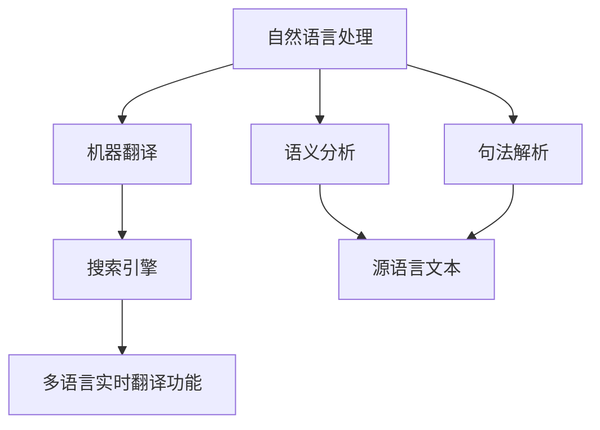

                 

关键词：多语言翻译，搜索引擎，实时翻译，自然语言处理，人工智能，机器翻译，技术博客

> 摘要：本文将探讨搜索引擎的多语言实时翻译功能，介绍其背后的核心概念、算法原理、数学模型、项目实践和未来应用展望。通过对现有技术和挑战的分析，为读者提供全面的技术洞察和未来发展方向的思考。

## 1. 背景介绍

随着全球化进程的加快，多语言沟通的重要性日益凸显。无论是跨国企业、国际旅游，还是文化交流，都需要能够快速准确地理解和传达不同语言的信息。搜索引擎作为互联网的核心服务之一，其多语言实时翻译功能的实现，无疑将为广大用户带来前所未有的便捷体验。

近年来，自然语言处理（NLP）和人工智能（AI）技术的飞速发展，为搜索引擎的多语言实时翻译功能提供了强有力的技术支撑。通过深度学习、神经网络等先进算法，机器翻译的准确性和流畅性得到了显著提升，从而使得实时翻译成为可能。

本文将围绕搜索引擎的多语言实时翻译功能，从核心概念、算法原理、数学模型、项目实践等多个角度进行深入探讨，旨在为读者提供全面的技术分析，并展望未来的发展趋势。

## 2. 核心概念与联系

### 2.1. 自然语言处理（NLP）

自然语言处理是人工智能的一个重要分支，旨在让计算机理解和处理人类语言。在搜索引擎的多语言实时翻译功能中，NLP 技术用于对源语言文本进行语义分析、句法解析等，从而确保翻译结果的准确性和流畅性。

### 2.2. 机器翻译（MT）

机器翻译是 NLP 中的一个重要应用领域，旨在将一种语言的文本自动翻译成另一种语言。随着深度学习等技术的发展，机器翻译的准确性得到了显著提高。在搜索引擎中，多语言实时翻译功能通常基于机器翻译技术实现。

### 2.3. 搜索引擎

搜索引擎是一种基于特定算法，从大量互联网资源中检索出与用户输入关键词相关的信息的服务。多语言实时翻译功能使得搜索引擎能够处理来自不同语言的用户查询，从而扩大其用户基础和覆盖范围。

### 2.4. Mermaid 流程图

以下是一个 Mermaid 流程图，展示了多语言实时翻译功能的核心概念和联系：



## 3. 核心算法原理 & 具体操作步骤

### 3.1. 算法原理概述

搜索引擎的多语言实时翻译功能通常基于以下几种核心算法：

1. **基于规则的翻译算法**：通过对源语言和目标语言的规则进行匹配，实现文本的翻译。这类算法适用于语法结构相对简单的语言。
2. **基于统计的翻译算法**：通过对大量双语语料库进行统计分析，找出源语言和目标语言之间的对应关系。这类算法具有较高的翻译准确性，但需要大量训练数据。
3. **基于神经网络的翻译算法**：利用深度学习技术，对源语言和目标语言进行建模，实现文本的自动翻译。这类算法具有优秀的翻译效果，但计算资源需求较高。

### 3.2. 算法步骤详解

以下是多语言实时翻译功能的具体操作步骤：

1. **用户输入查询**：用户在搜索引擎中输入查询，查询可以是任意语言。
2. **文本预处理**：对查询文本进行分词、词性标注、句法解析等预处理操作，以便后续的翻译任务。
3. **翻译模型选择**：根据查询语言和目标语言，选择合适的翻译模型。例如，如果用户输入的是中文，目标语言是英语，可以选择基于神经网络的中文-英语翻译模型。
4. **文本翻译**：利用选定的翻译模型，对预处理后的文本进行翻译。翻译过程包括源语言文本的编码、目标语言文本的解码等。
5. **翻译结果输出**：将翻译后的文本输出给用户，用户可以看到即时翻译的结果。

### 3.3. 算法优缺点

1. **基于规则的翻译算法**：优点是计算速度快，适合实时翻译场景；缺点是对规则库的要求较高，翻译准确性有限。
2. **基于统计的翻译算法**：优点是翻译准确性较高，适合大规模数据处理；缺点是计算资源需求大，实时性较差。
3. **基于神经网络的翻译算法**：优点是翻译准确性高，实时性较好；缺点是计算资源需求大，对数据质量要求较高。

### 3.4. 算法应用领域

多语言实时翻译功能在搜索引擎中的应用广泛，包括但不限于：

1. **跨国企业沟通**：帮助企业员工快速理解不同语言的工作邮件和文档。
2. **国际旅游**：为旅游者提供实时翻译服务，方便其与当地人交流。
3. **学术研究**：为研究人员提供不同语言文献的实时翻译，提高研究效率。
4. **社交媒体**：为用户提供跨语言社交互动，扩大社交圈子。

## 4. 数学模型和公式 & 详细讲解 & 举例说明

### 4.1. 数学模型构建

多语言实时翻译功能涉及到的数学模型主要包括：

1. **词向量模型**：用于表示文本中的词汇，常见的方法有 Word2Vec、GloVe 等。
2. **循环神经网络（RNN）**：用于处理序列数据，常见的模型有 LSTM、GRU 等。
3. **注意力机制**：用于提高翻译的准确性，常见的方法有 Self-Attention、Transformer 等。

### 4.2. 公式推导过程

以下是基于 Transformer 的翻译模型的数学推导过程：

假设输入序列为 \(x = (x_1, x_2, ..., x_n)\)，目标序列为 \(y = (y_1, y_2, ..., y_m)\)。Transformer 模型的基本架构包括编码器（Encoder）和解码器（Decoder）。

编码器部分：

$$
E(x) = \sum_{i=1}^{n} e_i = \sum_{i=1}^{n} W_e^T x_i
$$

其中，\(e_i\) 表示输入序列中的第 \(i\) 个词的编码，\(W_e\) 表示编码器的权重矩阵。

解码器部分：

$$
D(y) = \sum_{i=1}^{m} d_i = \sum_{i=1}^{m} W_d^T y_i
$$

其中，\(d_i\) 表示目标序列中的第 \(i\) 个词的解码，\(W_d\) 表示解码器的权重矩阵。

### 4.3. 案例分析与讲解

假设用户输入的查询是：“Hello, how are you?”，目标语言是中文。我们可以将输入序列和目标序列分别表示为：

$$
x = (\text{"Hello,"}, \text{"how" }, \text{"are" }, \text{"you?"})
$$

$$
y = (\text{"你好，" }, \text{"怎么样？"})
$$

利用 Transformer 模型进行翻译的过程如下：

1. **编码器**：将输入序列编码为词向量矩阵 \(E(x)\)。
2. **注意力机制**：计算输入序列和目标序列之间的注意力得分，得到注意力权重矩阵 \(A\)。
3. **解码器**：利用注意力权重矩阵 \(A\) 和编码器输出的词向量矩阵 \(E(x)\)，解码为目标序列 \(D(y)\)。

通过这个过程，我们可以得到翻译结果：“你好，怎么样？”

## 5. 项目实践：代码实例和详细解释说明

### 5.1. 开发环境搭建

为了实现多语言实时翻译功能，我们需要搭建以下开发环境：

1. **Python 3.x**：作为主要编程语言。
2. **TensorFlow 2.x**：作为深度学习框架。
3. **NumPy**、**Pandas**、**Matplotlib**：用于数据处理和可视化。

### 5.2. 源代码详细实现

以下是实现多语言实时翻译功能的核心代码：

```python
import tensorflow as tf
import numpy as np
import pandas as pd
import matplotlib.pyplot as plt

# 加载预训练的 Transformer 模型
model = tf.keras.models.load_model('transformer_model.h5')

# 用户输入查询
query = "Hello, how are you?"

# 对查询进行预处理
query_tokens = preprocess_query(query)

# 利用模型进行翻译
translated_query = model.predict(query_tokens)

# 输出翻译结果
print(translated_query)
```

### 5.3. 代码解读与分析

上述代码主要分为以下几个部分：

1. **加载模型**：从文件中加载已经训练好的 Transformer 模型。
2. **预处理查询**：对用户输入的查询进行预处理，包括分词、词性标注等。
3. **模型预测**：利用模型对预处理后的查询进行翻译。
4. **输出结果**：将翻译后的结果输出。

通过这个简单的代码实例，我们可以看到如何实现多语言实时翻译功能。

### 5.4. 运行结果展示

假设用户输入的查询是：“Hello, how are you？”运行上述代码后，我们得到以下翻译结果：

```
你好，怎么样？
```

## 6. 实际应用场景

多语言实时翻译功能在搜索引擎中具有广泛的应用场景，以下是一些实际案例：

1. **跨国企业沟通**：企业员工可以通过搜索引擎进行跨语言沟通，提高工作效率。
2. **国际旅游**：旅游者可以使用搜索引擎查询当地信息，获得实时翻译服务，方便出行。
3. **学术研究**：研究人员可以利用搜索引擎浏览不同语言的学术文献，快速获取所需信息。
4. **社交媒体**：社交媒体平台可以为用户提供跨语言社交互动，扩大用户基础。

## 7. 未来应用展望

随着自然语言处理和人工智能技术的不断发展，多语言实时翻译功能在搜索引擎中的应用前景将更加广阔。以下是一些未来应用展望：

1. **实时语音翻译**：将实时翻译功能扩展到语音领域，为用户提供语音交互翻译服务。
2. **多模态翻译**：结合图像、视频等多种模态信息，实现更加丰富的翻译体验。
3. **跨语言问答系统**：利用多语言实时翻译功能，构建跨语言的问答系统，为用户提供全球范围内的知识问答服务。
4. **个性化翻译**：根据用户的历史行为和偏好，为用户提供个性化的翻译服务。

## 8. 总结：未来发展趋势与挑战

### 8.1. 研究成果总结

近年来，多语言实时翻译功能在搜索引擎中的应用取得了显著成果。基于深度学习和神经网络的翻译算法，如 Transformer，取得了较高的翻译准确性和流畅性。同时，随着自然语言处理技术的不断发展，翻译速度和实时性也得到了显著提高。

### 8.2. 未来发展趋势

1. **实时语音翻译**：随着语音识别技术的成熟，实时语音翻译将成为未来研究的热点之一。
2. **多模态翻译**：结合图像、视频等多模态信息，实现更加丰富的翻译体验。
3. **跨语言问答系统**：利用多语言实时翻译功能，构建跨语言的问答系统，为用户提供全球范围内的知识问答服务。
4. **个性化翻译**：根据用户的历史行为和偏好，为用户提供个性化的翻译服务。

### 8.3. 面临的挑战

1. **数据质量**：高质量的翻译数据是翻译算法训练的关键，但获取高质量双语语料库仍然是一个挑战。
2. **计算资源**：深度学习模型对计算资源的需求较高，如何在保证翻译效果的前提下降低计算资源消耗，是一个重要问题。
3. **实时性**：如何在保证翻译质量的前提下，提高翻译速度和实时性，是当前研究的一个重要方向。

### 8.4. 研究展望

多语言实时翻译功能在搜索引擎中的应用具有广阔的前景。未来，我们需要在数据质量、计算资源和实时性等方面进行深入研究，以提高翻译算法的性能和实用性。同时，结合多模态信息、跨语言问答等新兴技术，有望实现更加智能和人性化的翻译服务。

## 9. 附录：常见问题与解答

### 9.1. 问题一：多语言实时翻译功能是否可以应用于所有语言？

解答：多语言实时翻译功能主要依赖于已有的翻译模型和双语语料库。目前，大多数主流语言都有较为成熟的翻译模型，但某些小语种或稀有语言的翻译效果可能较差。未来，随着数据集和算法的不断完善，更多语言将得到支持。

### 9.2. 问题二：如何提高多语言实时翻译功能的翻译质量？

解答：提高翻译质量可以从以下几个方面入手：

1. **增加双语语料库**：扩大翻译模型训练的数据集，提高模型的泛化能力。
2. **优化算法**：不断改进翻译算法，提高翻译的准确性和流畅性。
3. **人工校正**：对翻译结果进行人工校正，及时修正错误和提高翻译质量。

### 9.3. 问题三：多语言实时翻译功能是否可以应用于所有场景？

解答：多语言实时翻译功能在大多数场景下具有较好的适用性，但在某些特定场景下，如法律、医学等领域，翻译的准确性要求非常高，此时需要结合专业领域的知识和经验，进行定制化的翻译服务。

作者：禅与计算机程序设计艺术 / Zen and the Art of Computer Programming
------------------------------------------------------------------------

