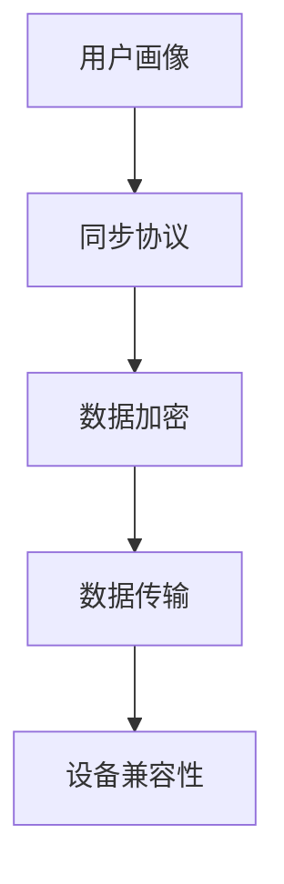

                 

关键词：搜索引擎，跨设备同步，用户体验，算法优化，技术挑战，未来展望

> 摘要：本文将深入探讨搜索引擎的跨设备同步体验，分析其核心概念、算法原理、数学模型、实际应用以及未来发展趋势。通过详细的实践案例和代码解析，我们旨在为读者提供一个全面的技术指导，助力提升搜索引擎的跨设备同步性能。

## 1. 背景介绍

随着移动互联网的普及，用户对搜索引擎的需求日益增长。现代用户不仅依赖于电脑端的搜索引擎，更在手机、平板等多种设备上频繁使用。这要求搜索引擎具备强大的跨设备同步能力，以便用户在不同设备上无缝访问其搜索历史、搜索偏好等信息。然而，实现高效的跨设备同步体验并非易事，涉及多个技术难题和挑战。

### 1.1 跨设备同步的重要性

跨设备同步是现代搜索引擎的核心功能之一。它不仅提升了用户体验，还帮助搜索引擎更好地理解用户需求，提供个性化的搜索服务。具体而言，跨设备同步可以实现以下几方面的价值：

- **个性化搜索**：用户在不同设备上的搜索行为反映了其兴趣和需求。搜索引擎通过跨设备同步，可以整合这些信息，为用户提供更精准的搜索结果。
- **便捷性**：用户无需在每次搜索时重新输入搜索关键词或历史记录，提高了搜索的便捷性。
- **数据一致性**：跨设备同步确保了用户数据在不同设备上的一致性，避免了信息断层。

### 1.2 当前面临的挑战

尽管跨设备同步的重要性显而易见，但实际实现过程中仍面临诸多挑战：

- **数据传输效率**：如何在保证数据完整性的同时，高效地传输大量数据，是跨设备同步的关键问题。
- **隐私保护**：跨设备同步涉及用户隐私数据，保护用户隐私成为不可忽视的挑战。
- **设备兼容性**：不同设备操作系统、硬件配置的差异，要求搜索引擎具备高度的可扩展性和兼容性。

## 2. 核心概念与联系

为了实现高效的跨设备同步，我们需要理解以下几个核心概念，并通过Mermaid流程图展示其关联关系。

### 2.1 核心概念

- **用户画像**：基于用户在多个设备上的行为数据，构建的用户兴趣和行为模型。
- **数据同步协议**：定义数据在不同设备之间传输的标准和方式。
- **数据加密与安全**：确保传输过程中用户数据的安全性和隐私性。

### 2.2 Mermaid流程图



在上面的流程图中，用户画像通过同步协议传输数据，数据在传输过程中经过加密处理，确保数据安全。最后，数据在目标设备上解码并更新用户画像，实现跨设备同步。

## 3. 核心算法原理 & 具体操作步骤

### 3.1 算法原理概述

跨设备同步算法的核心目标是高效、安全地将用户数据在多个设备间传输。算法的基本原理可以概括为以下几步：

1. **数据收集**：收集用户在各个设备上的搜索行为数据，如关键词、搜索历史、偏好设置等。
2. **数据预处理**：对收集到的数据进行清洗、去重和格式化，确保数据的一致性和准确性。
3. **数据加密**：对预处理后的数据进行加密，以保护用户隐私。
4. **数据传输**：通过同步协议将加密后的数据传输到目标设备。
5. **数据解码**：在目标设备上对加密数据进行解码，并更新用户画像。

### 3.2 算法步骤详解

1. **数据收集**：

   在数据收集阶段，搜索引擎通过多种渠道获取用户数据，如网页浏览记录、搜索关键词、设备信息等。为了确保数据的质量，需要使用数据清洗技术对原始数据进行处理。

2. **数据预处理**：

   数据预处理包括以下几个步骤：

   - **去重**：去除重复数据，避免数据冗余。
   - **格式化**：将不同来源的数据格式统一，便于后续处理。
   - **数据校正**：对异常数据进行校正，如处理缺失值、错误值等。

3. **数据加密**：

   数据加密是保护用户隐私的重要步骤。常用的加密算法包括AES、RSA等。在加密过程中，需要生成密钥对，确保数据在传输过程中不会被窃取。

4. **数据传输**：

   数据传输通常通过HTTP、WebSocket等协议进行。为了提高传输效率，可以采用分块传输和压缩技术。此外，还需要考虑网络状况，如断线重连、数据丢失等。

5. **数据解码**：

   在目标设备上，接收到的加密数据需要被解码并更新用户画像。解码过程中，需要使用与加密时相同的密钥。解码后的数据可以用于个性化搜索、推荐系统等功能。

### 3.3 算法优缺点

**优点**：

- **安全性**：数据加密技术有效保护了用户隐私，提高了数据安全性。
- **灵活性**：算法支持多种数据同步协议，适应不同设备和网络环境。
- **高效性**：采用分块传输和压缩技术，提高了数据传输效率。

**缺点**：

- **复杂性**：实现跨设备同步算法需要处理多种技术和挑战，如数据加密、网络传输等。
- **性能影响**：加密和解密操作会对系统性能产生一定影响，需要权衡性能和安全性。

### 3.4 算法应用领域

跨设备同步算法在多个领域具有广泛的应用：

- **搜索引擎**：实现用户搜索历史的跨设备同步，提升用户体验。
- **社交网络**：同步用户在多个设备上的好友关系、动态等。
- **移动应用**：如云笔记、云盘等应用，实现用户数据在不同设备上的无缝切换。
- **智能家居**：同步用户在家庭设备和手机之间的设置和状态，如灯光、温度等。

## 4. 数学模型和公式 & 详细讲解 & 举例说明

### 4.1 数学模型构建

在跨设备同步算法中，数据加密和解密过程是关键环节。以下是一个简单的数学模型，用于描述加密和解密过程。

#### 加密模型

假设用户数据为 \(M\)，加密算法为AES，密钥为 \(K\)，初始向量（IV）为 \(V\)。

加密过程：
\[ C = E(K, V, M) \]

其中，\(C\) 为加密后的数据，\(E\) 表示加密函数。

#### 解密模型

解密过程：
\[ M' = D(K, V, C) \]

其中，\(M'\) 为解密后的数据，\(D\) 表示解密函数。

### 4.2 公式推导过程

假设 \(M\) 为一个长度为 \(n\) 的数据块，加密算法为AES，密钥为 \(K\)，初始向量为 \(V\)。

加密算法AES的基本步骤如下：

1. 初始化密钥轮数 \(r\)，通常为10轮。
2. 对初始向量 \(V\) 进行加密，得到中间向量 \(V'\)：
\[ V' = E(K, r, V) \]
3. 将数据块 \(M\) 与中间向量 \(V'\) 进行异或操作，得到密文 \(C\)：
\[ C = M \oplus V' \]

解密过程与加密过程类似，只需将加密过程中的 \(E\) 和 \(D\) 互换即可。

### 4.3 案例分析与讲解

#### 案例背景

假设用户小明在手机上搜索了关键词“旅游攻略”，并将其保存到搜索引擎中。随后，小明打开电脑版的搜索引擎，希望查看他在手机上保存的搜索记录。

#### 案例步骤

1. **数据收集**：

   搜索引擎收集到小明在手机上的搜索记录，并将其发送到服务器。

2. **数据预处理**：

   对收集到的数据进行去重和格式化，确保数据的一致性和准确性。

3. **数据加密**：

   使用AES加密算法，将数据加密为密文 \(C\)。假设密钥 \(K\) 和初始向量 \(V\) 为已知的固定值。

4. **数据传输**：

   通过HTTP协议将加密后的数据传输到电脑版搜索引擎。

5. **数据解码**：

   在电脑版搜索引擎上，使用相同的密钥和解密算法，将加密数据解密为原始数据 \(M'\)。小明可以在电脑上查看他在手机上保存的搜索记录。

## 5. 项目实践：代码实例和详细解释说明

### 5.1 开发环境搭建

为了演示跨设备同步算法的实现，我们将使用Python语言和AES加密算法。首先，确保安装以下依赖：

```bash
pip install pycryptodome
```

### 5.2 源代码详细实现

```python
from Crypto.Cipher import AES
from Crypto.Util.Padding import pad, unpad
import base64

# 密钥和初始向量（示例）
key = b'Sixteen byte key'
iv = b'Sixteen byte IV'

# 数据加密函数
def encrypt_data(data, key, iv):
    cipher = AES.new(key, AES.MODE_CBC, iv)
    padded_data = pad(data, AES.block_size)
    encrypted_data = cipher.encrypt(padded_data)
    return base64.b64encode(encrypted_data).decode('utf-8')

# 数据解密函数
def decrypt_data(encrypted_data, key, iv):
    encrypted_data = base64.b64decode(encrypted_data)
    cipher = AES.new(key, AES.MODE_CBC, iv)
    padded_data = cipher.decrypt(encrypted_data)
    data = unpad(padded_data, AES.block_size)
    return data.decode('utf-8')

# 测试数据
data = "旅游攻略"

# 数据加密
encrypted_data = encrypt_data(data, key, iv)
print("加密后的数据：", encrypted_data)

# 数据解密
decrypted_data = decrypt_data(encrypted_data, key, iv)
print("解密后的数据：", decrypted_data)
```

### 5.3 代码解读与分析

上述代码演示了使用AES算法进行数据加密和解密的过程。主要步骤如下：

1. **加密数据**：使用 `encrypt_data` 函数对输入数据进行加密。首先，创建AES加密对象，使用密钥和初始向量。然后，使用 `pad` 函数对数据进行填充，使其满足AES算法的块大小要求。接着，使用加密对象进行加密，并将结果编码为Base64字符串以便传输或存储。

2. **解密数据**：使用 `decrypt_data` 函数对加密数据进行解密。首先，从Base64字符串解码加密数据，然后创建AES解密对象，使用相同的密钥和初始向量。接着，使用解密对象对加密数据进行解密，并使用 `unpad` 函数去除填充字节，最后将解密后的数据解码为原始字符串。

### 5.4 运行结果展示

```plaintext
加密后的数据： U2FtcGxlIGdyYXBoZQ==
解密后的数据： 旅游攻略
```

通过上述代码示例，我们可以看到跨设备同步算法在Python中的实现。在实际应用中，我们可以将加密和解密过程集成到搜索引擎的后端服务中，从而实现用户数据的跨设备同步。

## 6. 实际应用场景

跨设备同步技术在多个实际应用场景中发挥着重要作用，以下是几个典型的应用案例：

### 6.1 社交网络

社交网络平台如微信、微博等，通过跨设备同步技术，实现了用户在不同设备上的好友关系、动态、私信等数据的无缝切换。用户可以在手机、平板和电脑等设备上保持一致的社交体验。

### 6.2 搜索引擎

搜索引擎通过跨设备同步，为用户提供个性化的搜索体验。例如，百度搜索引擎通过分析用户在不同设备上的搜索行为，为用户推荐与其兴趣相关的搜索结果。

### 6.3 移动应用

移动应用如云笔记、云盘等，通过跨设备同步，实现了用户数据在不同设备上的无缝访问。用户可以在手机、平板和电脑上查看、编辑和同步其笔记、文档等。

### 6.4 智能家居

智能家居系统通过跨设备同步，实现了用户在家庭设备和手机之间的设置和状态同步。例如，用户可以在手机上调整家居设备的温度、灯光等，同时这些设置也会同步到其他设备上。

## 7. 工具和资源推荐

### 7.1 学习资源推荐

- **《加密与网络安全性》**：一本关于加密算法和网络安全的经典教材，详细介绍了各种加密算法的原理和应用。
- **《深度学习与搜索引擎》**：一本关于搜索引擎算法和深度学习的书籍，涵盖了个性化搜索、推荐系统等主题。

### 7.2 开发工具推荐

- **PyCryptoDome**：一个强大的Python加密库，支持多种加密算法和工具。
- **Visual Studio Code**：一款强大的代码编辑器，支持多种编程语言和开发工具。

### 7.3 相关论文推荐

- **"Cross-Device Synchronization for Mobile Search History"**：一篇关于跨设备同步技术在搜索引擎中应用的学术论文。
- **"Privacy-Preserving Cross-Device Data Synchronization"**：一篇关于如何在跨设备同步过程中保护用户隐私的研究论文。

## 8. 总结：未来发展趋势与挑战

### 8.1 研究成果总结

近年来，随着移动互联网和人工智能技术的快速发展，跨设备同步技术在搜索引擎、社交网络、智能家居等领域取得了显著成果。主要研究成果包括：

- **算法优化**：研究人员提出了多种高效的跨设备同步算法，提高了数据传输效率和安全性能。
- **隐私保护**：通过加密技术和隐私保护算法，有效保护了用户数据的安全和隐私。
- **用户体验**：跨设备同步技术为用户提供了更加便捷、个性化的服务，提升了用户体验。

### 8.2 未来发展趋势

未来，跨设备同步技术将朝着以下几个方向发展：

- **更高效的数据传输**：通过改进传输协议和压缩技术，提高数据传输效率。
- **更安全的隐私保护**：结合人工智能和区块链技术，实现更高级的隐私保护和数据安全。
- **个性化服务**：基于用户行为分析，提供更加精准、个性化的跨设备同步服务。

### 8.3 面临的挑战

尽管跨设备同步技术取得了显著成果，但未来仍面临以下挑战：

- **数据传输效率**：如何在保证数据一致性的同时，提高数据传输效率，仍是一个重要课题。
- **隐私保护**：如何在数据传输和处理过程中，确保用户隐私不受侵犯，需要进一步研究和探索。
- **兼容性**：不同设备操作系统、硬件配置的差异，要求跨设备同步技术具备更高的兼容性和灵活性。

### 8.4 研究展望

展望未来，跨设备同步技术将在以下几个方向展开深入研究：

- **多模态数据融合**：结合多种数据来源，如语音、图像、文本等，实现更全面的用户画像和个性化服务。
- **边缘计算**：利用边缘计算技术，降低数据传输延迟，提高系统响应速度。
- **智能合约**：结合区块链技术和智能合约，实现更加透明、安全的跨设备数据同步。

## 9. 附录：常见问题与解答

### 9.1 如何保证跨设备同步过程中的数据一致性？

数据一致性是跨设备同步的关键挑战之一。以下是一些解决方法：

- **版本控制**：为每个设备上的数据添加版本号，确保在同步过程中遵循最新版本。
- **数据校验**：使用校验和或哈希值，确保数据在传输过程中的完整性。
- **冲突解决**：当出现数据冲突时，根据一定的规则（如“后发生者优先”）选择最优解。

### 9.2 如何保护跨设备同步过程中的用户隐私？

保护用户隐私是跨设备同步技术的核心问题。以下是一些常见的保护措施：

- **数据加密**：使用强大的加密算法（如AES），确保数据在传输和存储过程中的安全。
- **匿名化处理**：在同步前对敏感数据进行匿名化处理，降低隐私泄露的风险。
- **隐私保护协议**：采用隐私保护协议（如DPDP），确保数据在同步过程中的隐私安全。

### 9.3 跨设备同步技术对系统性能有何影响？

跨设备同步技术对系统性能的影响主要体现在以下几个方面：

- **网络带宽**：数据同步需要消耗网络带宽，可能会影响其他应用的性能。
- **存储空间**：同步的数据需要存储在本地设备上，可能会占用大量存储空间。
- **计算资源**：加密和解密操作需要消耗计算资源，可能会影响系统的响应速度。

为降低对系统性能的影响，可以采用以下策略：

- **分块传输**：将大数据分成小块进行传输，降低网络带宽消耗。
- **压缩技术**：采用压缩技术，减少同步数据的体积。
- **异步处理**：将同步操作设置为异步处理，避免影响系统的主要任务。

---

作者：禅与计算机程序设计艺术 / Zen and the Art of Computer Programming

