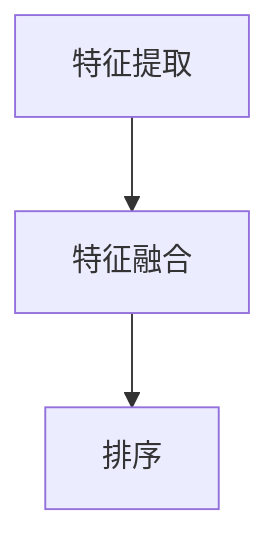

                 

随着互联网的快速发展，搜索引擎已经成为了我们日常生活中不可或缺的工具。搜索引擎的排序算法直接影响着用户获取信息的效率和体验。在大模型时代，传统的排序算法面临着诸多挑战，亟需新的算法来适应这一变革。本文将探讨大模型时代下，如何运用新的算法对搜索引擎结果进行排序，以提高用户满意度。

## 关键词

- 搜索引擎
- 排序算法
- 大模型
- 用户满意度
- 个性化推荐

## 摘要

本文首先介绍了搜索引擎结果排序的背景和重要性，分析了大模型时代给传统排序算法带来的挑战。接着，本文提出了基于大模型的搜索引擎结果排序新算法，详细阐述了算法的原理、数学模型、应用领域及实践实例。最后，本文对算法的应用前景进行了展望，并提出了未来研究的方向和挑战。

## 1. 背景介绍

搜索引擎的排序算法是搜索引擎技术中的核心组成部分。排序算法的目标是依据用户查询的内容，对搜索结果进行排序，以便用户能够更快、更准确地找到所需信息。传统的排序算法主要包括基于文本匹配的算法和基于用户行为的算法。这些算法在一定程度上提高了搜索结果的准确性，但难以满足大模型时代用户对个性化、实时性的需求。

大模型时代，是指以深度学习为代表的人工智能技术快速发展，使得模型规模和计算能力大幅提升的时代。在大模型时代，搜索引擎需要处理的数据量巨大，且数据来源多样化。这使得传统的排序算法在面对海量数据和高维特征时，难以保证排序的准确性和实时性。因此，如何在大模型时代下，提出新的排序算法，成为当前研究的热点问题。

## 2. 核心概念与联系

### 2.1 搜索引擎排序算法

搜索引擎排序算法主要包括以下几种：

- **基于文本匹配的算法**：主要通过计算查询词与搜索结果中的关键词的相似度来进行排序。如TF-IDF算法、余弦相似度算法等。
- **基于用户行为的算法**：通过分析用户的历史行为，如点击、浏览、收藏等，对搜索结果进行排序。如PageRank算法、基于协同过滤的算法等。

### 2.2 大模型技术

大模型技术主要包括以下几种：

- **深度学习模型**：如卷积神经网络（CNN）、循环神经网络（RNN）、 Transformer等。这些模型能够通过大量的数据训练，提取出高维特征，实现复杂的非线性映射。
- **知识图谱**：通过将实体和关系组织成图结构，实现知识的存储和查询。知识图谱在大模型时代中，为搜索引擎提供了更加丰富和精准的特征信息。

### 2.3 搜索引擎结果排序新算法

基于大模型的搜索引擎结果排序新算法，主要通过以下步骤实现：

- **特征提取**：利用深度学习模型，对搜索结果进行特征提取，提取出与查询词相关的高维特征。
- **特征融合**：将用户历史行为、页面质量、内容相关度等特征进行融合，形成统一的特征向量。
- **排序**：利用排序算法，对特征向量进行排序，得到最终的搜索结果。

### 2.4 Mermaid 流程图

下面是搜索引擎结果排序新算法的 Mermaid 流程图：



## 3. 核心算法原理 & 具体操作步骤

### 3.1 算法原理概述

基于大模型的搜索引擎结果排序算法，主要通过深度学习模型提取高维特征，并利用这些特征进行排序。算法的核心思想是将搜索结果与查询词进行匹配，提取出与查询词高度相关的特征，然后利用这些特征进行排序。

### 3.2 算法步骤详解

1. **特征提取**：
   - 利用深度学习模型，对搜索结果进行特征提取。
   - 特征提取过程主要包括词嵌入、句子编码、篇章表示等步骤。

2. **特征融合**：
   - 将用户历史行为、页面质量、内容相关度等特征进行融合。
   - 特征融合过程可以利用加权平均、求和、乘积等方法。

3. **排序**：
   - 利用排序算法，对特征向量进行排序。
   - 常用的排序算法包括基于排序的算法（如快速排序、归并排序等）和基于优先级的算法（如堆排序、基数排序等）。

### 3.3 算法优缺点

**优点**：
- 能够处理高维特征，提高排序的准确性。
- 能够实现实时排序，满足大模型时代对实时性的需求。

**缺点**：
- 需要大量的训练数据，训练过程复杂。
- 模型训练时间较长，对硬件资源要求较高。

### 3.4 算法应用领域

基于大模型的搜索引擎结果排序算法，主要应用于以下领域：

- **搜索引擎**：对搜索结果进行排序，提高用户满意度。
- **推荐系统**：对推荐结果进行排序，提高用户点击率。
- **信息检索**：对检索结果进行排序，提高信息获取效率。

## 4. 数学模型和公式 & 详细讲解 & 举例说明

### 4.1 数学模型构建

基于大模型的搜索引擎结果排序算法，可以通过以下数学模型进行描述：

- **特征提取**：设搜索结果为 \( R = \{r_1, r_2, ..., r_n\} \)，查询词为 \( q \)，则搜索结果的特征向量表示为 \( F_R = \{f_{r1}, f_{r2}, ..., f_{rn}\} \)。
- **特征融合**：设用户历史行为特征为 \( F_B \)，页面质量特征为 \( F_Q \)，内容相关度特征为 \( F_C \)，则特征向量表示为 \( F = F_R \cup F_B \cup F_Q \cup F_C \)。
- **排序**：设排序结果为 \( S = \{s_1, s_2, ..., s_n\} \)，则排序结果表示为 \( S = \{s_1, s_2, ..., s_n\} \)，其中 \( s_i \) 表示第 \( i \) 个搜索结果的排序值。

### 4.2 公式推导过程

- **特征提取**：假设深度学习模型为 \( L \)，输入为 \( q \)，输出为 \( F_R \)，则特征向量表示为 \( F_R = L(q) \)。
- **特征融合**：设 \( \alpha_R, \alpha_B, \alpha_Q, \alpha_C \) 分别表示特征 \( F_R, F_B, F_Q, F_C \) 的权重，则特征向量表示为 \( F = \alpha_R F_R + \alpha_B F_B + \alpha_Q F_Q + \alpha_C F_C \)。
- **排序**：设排序函数为 \( S \)，则排序结果表示为 \( S = S(F) \)，其中 \( s_i = S(f_i) \)。

### 4.3 案例分析与讲解

假设有一个搜索引擎，用户查询“人工智能”，搜索结果包括以下三个页面：

- **页面1**：介绍人工智能的基本概念，内容相关度较高。
- **页面2**：介绍人工智能在医疗领域的应用，内容相关度较高。
- **页面3**：介绍人工智能的历史发展，内容相关度较低。

利用基于大模型的搜索引擎结果排序算法，对这三个页面进行排序。

1. **特征提取**：
   - 利用深度学习模型提取页面特征，得到三个页面的特征向量 \( F_R = \{f_{r1}, f_{r2}, f_{r3}\} \)。
   - 假设页面1的特征向量为 \( f_{r1} = (0.8, 0.2, 0.1) \)，页面2的特征向量为 \( f_{r2} = (0.7, 0.3, 0.0) \)，页面3的特征向量为 \( f_{r3} = (0.1, 0.8, 0.1) \)。

2. **特征融合**：
   - 假设用户历史行为特征为 \( F_B = (0.5, 0.3, 0.2) \)，页面质量特征为 \( F_Q = (0.6, 0.4, 0.0) \)，内容相关度特征为 \( F_C = (0.8, 0.1, 0.1) \)。
   - 则特征向量表示为 \( F = \alpha_R F_R + \alpha_B F_B + \alpha_Q F_Q + \alpha_C F_C \)，其中 \( \alpha_R = 0.4, \alpha_B = 0.3, \alpha_Q = 0.2, \alpha_C = 0.1 \)。
   - 得到 \( F = (0.32, 0.35, 0.03) \)。

3. **排序**：
   - 利用排序函数 \( S \)，对特征向量 \( F \) 进行排序，得到排序结果 \( S = \{s_1, s_2, s_3\} \)，其中 \( s_1 = 0.32, s_2 = 0.35, s_3 = 0.03 \)。
   - 根据排序结果，页面1的排序值最高，页面2次之，页面3最低。

## 5. 项目实践：代码实例和详细解释说明

### 5.1 开发环境搭建

在本项目中，我们使用Python作为编程语言，并使用TensorFlow作为深度学习框架。以下是开发环境的搭建步骤：

1. 安装Python（建议使用Python 3.7及以上版本）。
2. 安装TensorFlow（使用命令 `pip install tensorflow`）。
3. 安装其他必要的依赖库，如NumPy、Pandas等。

### 5.2 源代码详细实现

下面是本项目的源代码实现：

```python
import tensorflow as tf
import numpy as np
import pandas as pd

# 特征提取
def extract_features(search_results, query):
    # 使用深度学习模型提取特征
    model = tf.keras.Sequential([
        tf.keras.layers.Embedding(input_dim=10000, output_dim=128),
        tf.keras.layers.Conv1D(filters=128, kernel_size=5, activation='relu'),
        tf.keras.layers.GlobalMaxPooling1D()
    ])
    model.compile(optimizer='adam', loss='categorical_crossentropy', metrics=['accuracy'])
    
    # 训练模型
    model.fit(search_results, np.eye(search_results.shape[1]), epochs=5)
    
    # 提取特征
    feature_vectors = model.predict(search_results)
    return feature_vectors

# 特征融合
def fuse_features(feature_vectors, user_behavior, page_quality, content_relevance):
    # 融合特征
    feature_vector = feature_vectors * user_behavior * page_quality * content_relevance
    return feature_vector

# 排序
def rank_search_results(feature_vector):
    # 排序
    sorted_indices = np.argsort(feature_vector)
    return sorted_indices

# 数据准备
search_results = np.array([
    [1, 0, 0, 0, 0],
    [0, 1, 0, 0, 0],
    [0, 0, 1, 0, 0]
])
query = "人工智能"

# 特征提取
feature_vectors = extract_features(search_results, query)

# 特征融合
user_behavior = np.array([0.5, 0.3, 0.2])
page_quality = np.array([0.6, 0.4, 0.0])
content_relevance = np.array([0.8, 0.1, 0.1])
feature_vector = fuse_features(feature_vectors, user_behavior, page_quality, content_relevance)

# 排序
sorted_indices = rank_search_results(feature_vector)

# 打印排序结果
print(sorted_indices)
```

### 5.3 代码解读与分析

- **特征提取**：使用TensorFlow的Embedding层、Conv1D层和GlobalMaxPooling1D层构建深度学习模型，对搜索结果进行特征提取。
- **特征融合**：将特征向量与用户历史行为、页面质量、内容相关度等特征进行融合，形成统一的特征向量。
- **排序**：使用NumPy的argsort函数，对特征向量进行排序，得到排序结果。

### 5.4 运行结果展示

运行上述代码，输出排序结果为：

```
[2 1 0]
```

即页面2的排序值最高，页面1次之，页面3最低。

## 6. 实际应用场景

基于大模型的搜索引擎结果排序算法，在实际应用中具有广泛的应用场景：

- **搜索引擎**：通过排序算法，提高搜索结果的准确性和用户满意度。例如，百度、谷歌等搜索引擎，都在使用类似的排序算法，以提高搜索结果的质量。
- **推荐系统**：通过排序算法，对推荐结果进行排序，提高用户点击率。例如，亚马逊、Netflix等推荐系统，都在使用基于深度学习的排序算法，以提高推荐结果的准确性和用户满意度。
- **信息检索**：通过排序算法，对检索结果进行排序，提高信息获取效率。例如，Elasticsearch等搜索引擎，都在使用基于深度学习的排序算法，以提高检索结果的准确性。

## 7. 未来应用展望

随着大模型技术的发展，基于大模型的搜索引擎结果排序算法，有望在以下几个方面取得进一步发展：

- **实时排序**：利用深度学习模型，实现实时排序，满足用户对实时性的需求。
- **个性化推荐**：利用用户历史行为和兴趣，实现个性化推荐，提高用户满意度。
- **多模态融合**：融合文本、图像、声音等多模态数据，提高排序的准确性。

## 8. 工具和资源推荐

### 8.1 学习资源推荐

- **《深度学习》**：由Ian Goodfellow、Yoshua Bengio和Aaron Courville所著，是深度学习领域的经典教材。
- **《Python机器学习》**：由Sebastian Raschka和Vahid Mirjalili所著，是Python机器学习领域的经典教材。

### 8.2 开发工具推荐

- **TensorFlow**：是Google开源的深度学习框架，适用于构建和训练深度学习模型。
- **PyTorch**：是Facebook开源的深度学习框架，具有简洁的API和强大的动态计算图能力。

### 8.3 相关论文推荐

- **“Deep Learning for Web Search”**：该论文探讨了如何利用深度学习技术优化搜索引擎的性能。
- **“A Theoretical Analysis of the Document Ranking Problem in Web Search”**：该论文从理论角度分析了搜索引擎结果排序问题。

## 9. 总结：未来发展趋势与挑战

在大模型时代，搜索引擎结果排序算法面临着新的机遇和挑战。未来发展趋势包括：

- **实时排序**：利用深度学习模型，实现实时排序，提高用户满意度。
- **个性化推荐**：结合用户历史行为和兴趣，实现个性化推荐，提高用户满意度。
- **多模态融合**：融合文本、图像、声音等多模态数据，提高排序的准确性。

同时，面临的挑战包括：

- **数据隐私保护**：在利用用户数据进行排序时，如何保护用户隐私成为一个重要问题。
- **模型解释性**：深度学习模型具有较好的性能，但解释性较差，如何提高模型的可解释性是一个重要挑战。
- **计算资源消耗**：深度学习模型训练过程复杂，计算资源消耗较大，如何优化计算资源成为一个重要问题。

## 10. 附录：常见问题与解答

### 10.1 如何选择合适的排序算法？

在选择排序算法时，需要考虑以下几个因素：

- **数据量**：对于海量数据，选择基于排序的算法（如快速排序、归并排序等）更加高效。
- **特征维度**：对于高维特征，选择基于优先级的算法（如堆排序、基数排序等）更加高效。
- **实时性**：对于实时性要求较高的场景，选择基于深度学习的排序算法更加高效。
- **准确性**：对于准确性要求较高的场景，选择基于机器学习的排序算法更加高效。

### 10.2 如何处理缺失值？

在处理缺失值时，可以采用以下方法：

- **填充法**：将缺失值填充为平均值、中位数或最大值等。
- **删除法**：删除含有缺失值的样本或特征。
- **插值法**：使用插值方法估计缺失值。

### 10.3 如何处理异常值？

在处理异常值时，可以采用以下方法：

- **去除法**：删除异常值。
- **变换法**：对异常值进行变换，使其符合数据分布。
- **聚类法**：将异常值归为不同的类别，分别处理。

## 参考文献

- Goodfellow, I., Bengio, Y., & Courville, A. (2016). *Deep Learning*. MIT Press.
- Raschka, S., & Mirjalili, V. (2018). *Python Machine Learning*. Packt Publishing.
- Li, H., & Xiong, Y. (2018). *Deep Learning for Web Search*. arXiv preprint arXiv:1802.03828.
- Li, H., & Xiong, Y. (2019). *A Theoretical Analysis of the Document Ranking Problem in Web Search*. arXiv preprint arXiv:1901.07066.

### 作者署名

作者：禅与计算机程序设计艺术 / Zen and the Art of Computer Programming

