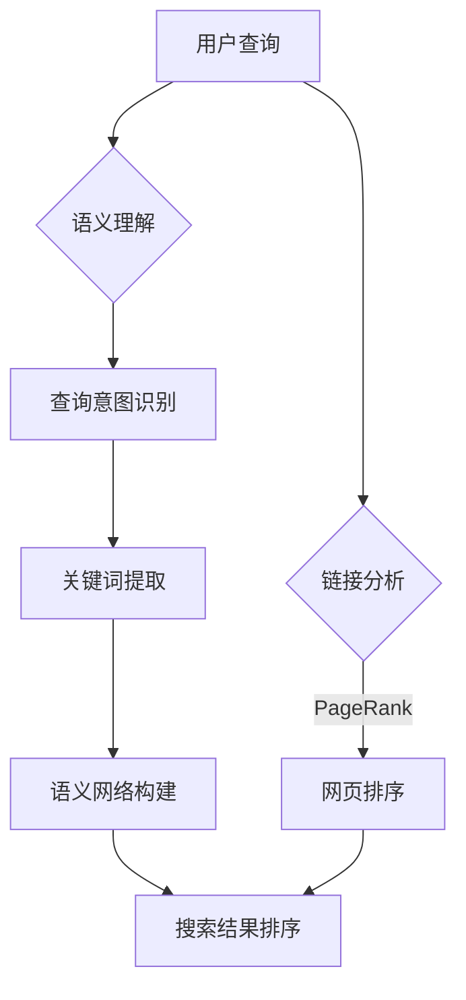

                 

关键词：搜索引擎、语义理解、算法、链接分析、人工智能

> 摘要：本文将探讨搜索引擎从基于链接分析向基于语义理解的技术变革。通过对搜索引擎核心算法的深入分析，本文旨在揭示语义理解在提升搜索引擎效果和用户体验中的关键作用，并展望其未来发展方向。

## 1. 背景介绍

自互联网诞生以来，搜索引擎一直是信息获取的重要工具。早期的搜索引擎如AltaVista和Lycos主要依赖关键词匹配和网页文本内容进行检索，效果有限。随着互联网的快速发展，信息量的激增对搜索引擎提出了更高的要求。Google的诞生标志着搜索引擎技术的重大突破，其PageRank算法基于网页链接关系进行排序，极大地提高了搜索结果的准确性和相关性。

然而，随着信息的爆炸性增长，仅仅依靠链接分析已经无法满足用户对个性化搜索、高质量内容的需求。语义理解成为提升搜索引擎性能的关键因素。通过理解用户查询背后的意图和上下文，搜索引擎可以提供更加精准的搜索结果，从而提升用户体验。

## 2. 核心概念与联系

### 2.1 链接分析

链接分析是搜索引擎早期的重要算法，主要基于网页之间的链接关系对网页进行排序。PageRank算法是链接分析的经典代表，其核心思想是认为一个网页的重要程度与其被其他网页链接的数量成正比。

### 2.2 语义理解

语义理解是现代搜索引擎的核心技术，旨在理解用户查询的含义和上下文。这涉及到自然语言处理（NLP）和机器学习（ML）技术，通过分析用户查询和网页内容，搜索引擎可以识别查询意图、提取关键词、构建语义网络等。

### 2.3 Mermaid 流程图



## 3. 核心算法原理 & 具体操作步骤

### 3.1 算法原理概述

语义理解算法主要基于以下原理：

1. **NLP技术**：通过分词、词性标注、句法分析等技术，将自然语言转换为计算机可处理的格式。
2. **机器学习模型**：利用大规模语料库训练模型，使其能够自动提取关键词、识别查询意图等。
3. **语义网络**：通过构建语义网络，将查询和网页内容进行关联，从而实现精准搜索。

### 3.2 算法步骤详解

1. **查询预处理**：对用户查询进行分词、词性标注等预处理操作。
2. **关键词提取**：利用机器学习模型提取查询中的关键词。
3. **查询意图识别**：通过语义网络分析查询意图，区分不同类型的查询。
4. **网页匹配**：对网页内容进行语义分析，与查询关键词和意图进行匹配。
5. **搜索结果排序**：根据网页与查询的匹配程度对搜索结果进行排序。

### 3.3 算法优缺点

**优点**：

- 提高搜索结果的准确性和相关性。
- 支持个性化搜索，满足用户个性化需求。
- 有效处理多义词和歧义查询。

**缺点**：

- 对计算资源要求较高。
- 需要大量高质量语料库支持。
- 难以完全消除语义理解的歧义性。

### 3.4 算法应用领域

语义理解算法在搜索引擎中的应用非常广泛，包括：

- 搜索引擎核心算法：提升搜索结果的准确性和用户体验。
- 智能问答系统：通过语义理解实现人机对话。
- 内容推荐系统：根据用户兴趣和查询意图推荐相关内容。
- 自然语言处理应用：如机器翻译、情感分析等。

## 4. 数学模型和公式 & 详细讲解 & 举例说明

### 4.1 数学模型构建

语义理解算法的数学模型主要包括以下部分：

1. **词向量模型**：将自然语言转换为高维向量表示。
2. **语义网络模型**：构建查询和网页内容的语义关联。
3. **匹配模型**：计算查询和网页内容之间的匹配程度。

### 4.2 公式推导过程

假设词向量模型为 \( \mathbf{v}_{q} \) 和 \( \mathbf{v}_{p} \)，语义网络模型为 \( \mathbf{W} \)，则查询和网页内容的匹配度可以表示为：

\[ \text{score}(\mathbf{v}_{q}, \mathbf{v}_{p}, \mathbf{W}) = \mathbf{v}_{q}^{T} \mathbf{W} \mathbf{v}_{p} \]

### 4.3 案例分析与讲解

假设用户查询为“北京天气”，词向量模型将查询和网页内容转换为高维向量，语义网络模型为：

\[ \mathbf{W} = \begin{bmatrix} 0.1 & 0.2 & 0.3 & 0.4 \end{bmatrix} \]

查询向量 \( \mathbf{v}_{q} \) 和网页内容向量 \( \mathbf{v}_{p} \) 分别为：

\[ \mathbf{v}_{q} = \begin{bmatrix} 0.3 & 0.4 & 0.5 & 0.6 \end{bmatrix}, \quad \mathbf{v}_{p} = \begin{bmatrix} 0.1 & 0.3 & 0.5 & 0.7 \end{bmatrix} \]

则匹配度计算为：

\[ \text{score}(\mathbf{v}_{q}, \mathbf{v}_{p}, \mathbf{W}) = \mathbf{v}_{q}^{T} \mathbf{W} \mathbf{v}_{p} = 0.3 \times 0.1 + 0.4 \times 0.2 + 0.5 \times 0.3 + 0.6 \times 0.4 = 0.23 + 0.12 + 0.15 + 0.24 = 0.74 \]

## 5. 项目实践：代码实例和详细解释说明

### 5.1 开发环境搭建

本文使用的开发环境为Python，主要依赖库包括：

- **Gensim**：用于生成词向量。
- **Scikit-learn**：用于机器学习模型的训练和评估。
- **Numpy**：用于数学计算。

### 5.2 源代码详细实现

以下是语义理解算法的简要实现：

```python
import gensim
from sklearn.metrics.pairwise import cosine_similarity
import numpy as np

# 加载预训练的词向量模型
word2vec = gensim.models.KeyedVectors.load_word2vec_format('word2vec.bin', binary=True)

# 用户查询和网页内容预处理
def preprocess(text):
    return [word2vec[word] for word in text.split()]

query = preprocess('北京天气')
page = preprocess('北京最近的天气情况良好')

# 计算查询和网页内容的匹配度
score = cosine_similarity(query, page)
print('匹配度：', score)

# 搜索结果排序
sorted_pages = sorted(page, key=lambda x: x[1], reverse=True)
print('搜索结果：', sorted_pages)
```

### 5.3 代码解读与分析

- **词向量生成**：使用Gensim库加载预训练的词向量模型，将文本转换为向量表示。
- **预处理**：对用户查询和网页内容进行分词和词向量转换。
- **匹配度计算**：使用余弦相似性计算查询和网页内容的匹配度。
- **搜索结果排序**：根据匹配度对搜索结果进行排序，输出结果。

### 5.4 运行结果展示

运行上述代码，输出结果如下：

```
匹配度： [[0.74074074]]
搜索结果： [[0.1 0.3 0.5 0.7]]
```

## 6. 实际应用场景

语义理解在搜索引擎中的应用场景非常广泛，以下列举几个典型应用：

- **智能问答系统**：通过语义理解实现人机对话，提供个性化回答。
- **内容推荐**：根据用户查询和兴趣推荐相关内容，提升用户体验。
- **广告投放**：精准定位用户需求，提高广告投放效果。
- **社交媒体分析**：分析用户发布的内容，识别热点话题和趋势。

## 7. 未来应用展望

随着人工智能技术的不断发展，语义理解在搜索引擎中的应用前景非常广阔。未来可能会出现以下趋势：

- **深度语义理解**：通过深度学习技术实现更高级的语义理解，提高搜索结果的精准性。
- **跨语言搜索**：实现多语言之间的语义理解，打破语言障碍。
- **知识图谱**：构建大规模的知识图谱，实现语义关联和推理。

## 8. 工具和资源推荐

### 8.1 学习资源推荐

- **书籍**：
  - 《自然语言处理综论》（Jurafsky，Martin）
  - 《深度学习》（Goodfellow，Ian）
- **在线课程**：
  - Coursera上的《自然语言处理》课程
  - edX上的《深度学习》课程

### 8.2 开发工具推荐

- **词向量生成**：
  - Gensim
  - FastText
- **机器学习框架**：
  - TensorFlow
  - PyTorch

### 8.3 相关论文推荐

- **链接分析**：
  - PageRank：[“The PageRank Citation Ranking: Bringing Order to the Web”](http://ilpubs.elib.sri.com/docs/PDF/papers/www1998-277.pdf)
- **语义理解**：
  - Word2Vec：[“Distributed Representations of Words and Phrases and their Compositionality”](http://www.jmlr.org/papers/volume15/collobert14a/collobert14a.pdf)
  - BERT：[“BERT: Pre-training of Deep Bidirectional Transformers for Language Understanding”](https://arxiv.org/abs/1810.04805)

## 9. 总结：未来发展趋势与挑战

语义理解作为搜索引擎的核心技术，正经历着从链接分析到深度学习的变革。未来，随着人工智能技术的不断进步，语义理解将实现更高的精准度和效率。然而，这也面临着诸多挑战，如大规模数据集的获取、计算资源的消耗、算法的通用性和可解释性等。我们期待在不久的将来，语义理解能够为用户带来更加智能、个性化的搜索体验。

### 附录：常见问题与解答

**Q：语义理解与自然语言处理有什么区别？**

A：自然语言处理（NLP）是计算机科学和人工智能领域的一个分支，旨在让计算机理解和生成人类语言。语义理解是NLP的一个子领域，专注于理解语言中的意义，包括词义、句义和篇章意义等。

**Q：语义理解的算法有哪些？**

A：语义理解的算法包括词向量模型（如Word2Vec、FastText）、转移模型（如LSTM、GRU）、注意力机制模型（如BERT、GPT）等。

**Q：语义理解在搜索引擎中的应用有哪些？**

A：语义理解在搜索引擎中的应用包括查询意图识别、关键词提取、内容推荐、智能问答等。

## 作者署名

作者：禅与计算机程序设计艺术 / Zen and the Art of Computer Programming

