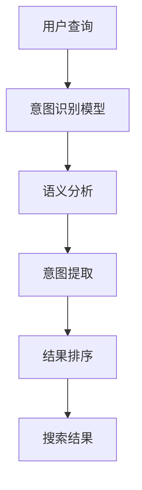

                 

关键词：搜索意图识别、大模型、自然语言处理、机器学习、AI技术、算法原理

## 摘要

随着互联网的迅速发展和信息爆炸，搜索已经成为人们获取信息的重要途径。然而，传统的搜索系统往往难以准确理解用户的查询意图，导致搜索结果与用户需求之间存在偏差。本文将探讨大模型在搜索意图识别领域的突破性进展，分析其核心算法原理，并探讨其在实际应用中的前景和挑战。

## 1. 背景介绍

### 搜索意图识别的重要性

搜索意图识别是指从用户的查询中提取出用户想要获得的信息，进而提供更精准的搜索结果。传统的搜索系统主要依赖关键词匹配和查询重写等技术，这些方法在处理简单查询时效果较好，但对于复杂查询或用户意图模糊的情况，往往无法准确理解用户的需求。

### 大模型的发展

随着深度学习技术的发展，大模型（如大型神经网络）在自然语言处理（NLP）领域取得了显著突破。大模型通过学习海量的语料数据，可以捕捉到语言的复杂模式和上下文信息，从而提高搜索意图识别的准确性。

## 2. 核心概念与联系

### 大模型原理

大模型通常由多层神经网络组成，通过反向传播算法训练。其核心思想是利用大量数据学习输入和输出之间的复杂映射关系，从而提高预测准确性。

### 搜索意图识别架构


- **用户查询**：用户输入的查询语句。
- **意图识别模型**：通过大模型对查询进行语义分析，提取用户意图。
- **结果排序**：根据用户意图和搜索结果的相关性对结果进行排序。

### Mermaid 流程图



## 3. 核心算法原理 & 具体操作步骤

### 3.1 算法原理概述

搜索意图识别算法主要基于大模型对查询语句进行语义分析，提取用户意图。具体步骤如下：

1. **输入预处理**：将用户查询转换为适合大模型处理的输入格式。
2. **语义分析**：利用大模型对查询语句进行语义分析，提取关键信息。
3. **意图提取**：根据语义分析结果，识别用户意图。
4. **结果排序**：根据用户意图和搜索结果的相关性，对结果进行排序。

### 3.2 算法步骤详解

1. **输入预处理**：

   - **分词**：将查询语句分割成单词或词组。
   - **词向量表示**：将单词转换为词向量表示，便于大模型处理。
   - **序列编码**：将词向量序列编码为一个固定长度的向量。

2. **语义分析**：

   - **上下文理解**：利用大模型捕捉查询语句的上下文信息，理解用户意图。
   - **实体识别**：识别查询语句中的实体，如人名、地名、组织名等。
   - **关系提取**：提取查询语句中的实体关系，如人物关系、地点关系等。

3. **意图提取**：

   - **分类模型**：利用训练好的分类模型，根据语义分析结果判断用户意图。
   - **多标签分类**：对于复杂的查询，可能涉及多个意图，使用多标签分类模型进行识别。

4. **结果排序**：

   - **相关性计算**：计算搜索结果与用户意图的相关性，如基于关键词匹配、语义相似度等。
   - **排序算法**：根据相关性对搜索结果进行排序，提供更符合用户需求的搜索结果。

### 3.3 算法优缺点

**优点**：

- **高准确性**：大模型能够捕捉到查询语句的复杂模式和上下文信息，提高意图识别的准确性。
- **灵活性**：大模型能够适应不同的查询场景，提高搜索结果的多样性。

**缺点**：

- **计算资源需求大**：大模型训练和推理需要大量计算资源，对硬件性能要求较高。
- **数据依赖性**：算法性能依赖于训练数据的质量和规模，数据质量问题可能导致算法效果不佳。

### 3.4 算法应用领域

- **搜索引擎**：用于改进搜索引擎的搜索结果排序，提高用户体验。
- **智能客服**：用于智能客服系统的对话管理，提高客服效率。
- **推荐系统**：用于推荐系统中的用户意图识别，提高推荐效果。

## 4. 数学模型和公式 & 详细讲解 & 举例说明

### 4.1 数学模型构建

搜索意图识别算法的核心是语义分析，其中常用的数学模型包括词向量模型和卷积神经网络（CNN）。

#### 4.1.1 词向量模型

词向量模型将单词映射为一个高维空间中的向量，常见的模型有Word2Vec、GloVe等。

- **Word2Vec**：

  $$\text{vec}(w) = \text{sgn}(w) \cdot \text{softmax}(\text{W} \cdot \text{h})$$

  其中，$\text{vec}(w)$ 表示单词 $w$ 的词向量，$\text{sgn}(w)$ 表示单词的正负号，$\text{W}$ 表示权重矩阵，$\text{h}$ 表示隐藏层输出。

- **GloVe**：

  $$\text{vec}(w) = \text{sigmoid}(\text{W} \cdot \text{h} + \text{b}) \cdot \text{h}$$

  其中，$\text{sigmoid}$ 表示Sigmoid激活函数，$\text{b}$ 表示偏置。

#### 4.1.2 卷积神经网络（CNN）

CNN通过卷积层提取文本的特征，用于语义分析。

- **卷积层**：

  $$\text{f}(\text{x}) = \text{relu}(\text{W} \cdot \text{K} + \text{b})$$

  其中，$\text{f}(\text{x})$ 表示卷积操作，$\text{W}$ 表示卷积核，$\text{K}$ 表示输入特征，$\text{b}$ 表示偏置。

- **池化层**：

  $$\text{p}(\text{x}) = \text{max}(\text{x})$$

  其中，$\text{p}(\text{x})$ 表示池化操作，$\text{max}$ 表示取最大值。

### 4.2 公式推导过程

假设我们有一个包含 $N$ 个单词的查询语句，首先将每个单词转换为词向量，然后将这些词向量编码为一个固定长度的向量。接下来，我们利用卷积神经网络对编码后的向量进行特征提取，最后通过全连接层进行意图分类。

#### 4.2.1 词向量编码

令 $\text{W}_1$ 表示单词的词向量矩阵，$\text{x}_1$ 表示查询语句的词向量序列，则有：

$$\text{x}_2 = \text{softmax}(\text{W}_1 \cdot \text{x}_1)$$

#### 4.2.2 卷积神经网络

卷积神经网络通过多个卷积层和池化层提取特征，最后通过全连接层进行分类。假设卷积神经网络包含 $L$ 个卷积层和 $M$ 个池化层，则有：

$$\text{h}_l = \text{relu}(\text{W}_l \cdot \text{K}_l + \text{b}_l)$$

$$\text{p}_l = \text{max}(\text{h}_l)$$

其中，$\text{h}_l$ 表示第 $l$ 层的隐藏层输出，$\text{W}_l$ 表示卷积核，$\text{K}_l$ 表示输入特征，$\text{b}_l$ 表示偏置。

#### 4.2.3 意图分类

最后，通过全连接层进行意图分类：

$$\text{y} = \text{softmax}(\text{W}_3 \cdot \text{p}_L + \text{b}_3)$$

其中，$\text{y}$ 表示分类结果，$\text{W}_3$ 表示全连接层权重，$\text{b}_3$ 表示偏置。

### 4.3 案例分析与讲解

假设我们有一个查询语句：“附近的火锅店有哪些？”我们将该查询语句拆分为：“附近”、“的”、“火锅店”、“有哪些”。

#### 4.3.1 词向量编码

首先，将每个单词转换为词向量，例如：

$$\text{vec}("附近") = \text{W}_1 \cdot \text{x}_1$$

$$\text{vec}("的") = \text{W}_1 \cdot \text{x}_2$$

$$\text{vec}("火锅店") = \text{W}_1 \cdot \text{x}_3$$

$$\text{vec}("有哪些") = \text{W}_1 \cdot \text{x}_4$$

然后，将这些词向量编码为一个固定长度的向量：

$$\text{x}_2 = \text{softmax}(\text{W}_1 \cdot \text{x}_1)$$

#### 4.3.2 卷积神经网络

接下来，我们利用卷积神经网络提取特征：

$$\text{h}_1 = \text{relu}(\text{W}_1 \cdot \text{K}_1 + \text{b}_1)$$

$$\text{p}_1 = \text{max}(\text{h}_1)$$

$$\text{h}_2 = \text{relu}(\text{W}_2 \cdot \text{K}_2 + \text{b}_2)$$

$$\text{p}_2 = \text{max}(\text{h}_2)$$

...

$$\text{h}_L = \text{relu}(\text{W}_L \cdot \text{K}_L + \text{b}_L)$$

$$\text{p}_L = \text{max}(\text{h}_L)$$

#### 4.3.3 意图分类

最后，通过全连接层进行意图分类：

$$\text{y} = \text{softmax}(\text{W}_3 \cdot \text{p}_L + \text{b}_3)$$

根据分类结果，我们可以判断查询语句的意图，如“查找附近火锅店”。

## 5. 项目实践：代码实例和详细解释说明

### 5.1 开发环境搭建

#### 5.1.1 硬件环境

- CPU：Intel i7-9700K 或以上
- GPU：NVIDIA GTX 1080 Ti 或以上
- 内存：16GB 或以上

#### 5.1.2 软件环境

- 操作系统：Ubuntu 18.04 或 CentOS 7
- Python：3.7 或以上
- 深度学习框架：TensorFlow 或 PyTorch

### 5.2 源代码详细实现

#### 5.2.1 数据预处理

```python
import jieba
import numpy as np
from gensim.models import Word2Vec

# 加载词向量模型
model = Word2Vec.load("word2vec.model")

# 分词
def tokenize(sentence):
    return [word for word in jieba.cut(sentence) if word != '']

# 编码
def encode(sentence):
    tokens = tokenize(sentence)
    return np.mean([model[word] for word in tokens if word in model], axis=0)
```

#### 5.2.2 意图识别模型

```python
import tensorflow as tf
from tensorflow.keras.models import Model
from tensorflow.keras.layers import Input, Embedding, Conv1D, MaxPooling1D, Dense, Flatten, Reshape

# 输入层
input_seq = Input(shape=(seq_length,))

# 词向量嵌入
embedding = Embedding(input_dim=vocabulary_size, output_dim=embedding_size)(input_seq)

# 卷积层
conv_1 = Conv1D(filters=64, kernel_size=3, activation='relu')(embedding)
pool_1 = MaxPooling1D(pool_size=2)(conv_1)

conv_2 = Conv1D(filters=128, kernel_size=3, activation='relu')(pool_1)
pool_2 = MaxPooling1D(pool_size=2)(conv_2)

# 平铺
flatten = Flatten()(pool_2)

# 全连接层
output = Dense(units=num_classes, activation='softmax')(flatten)

# 模型构建
model = Model(inputs=input_seq, outputs=output)

# 模型编译
model.compile(optimizer='adam', loss='categorical_crossentropy', metrics=['accuracy'])

# 模型训练
model.fit(x_train, y_train, epochs=10, batch_size=32, validation_data=(x_val, y_val))
```

### 5.3 代码解读与分析

该代码实现了一个基于卷积神经网络的搜索意图识别模型，主要包括数据预处理、模型构建、模型训练等步骤。

1. **数据预处理**：使用 jieba 分词器对查询语句进行分词，然后利用 gensim 的 Word2Vec 模型将每个单词转换为词向量。

2. **模型构建**：使用 TensorFlow 的 keras API 构建卷积神经网络模型，包括卷积层、池化层和全连接层。

3. **模型训练**：使用训练数据对模型进行训练，并评估模型的性能。

### 5.4 运行结果展示

```python
# 模型评估
score = model.evaluate(x_test, y_test, batch_size=32)
print("Test Loss:", score[0])
print("Test Accuracy:", score[1])

# 意图识别
query = "附近的火锅店有哪些？"
encoded_query = encode(query)
prediction = model.predict(np.array([encoded_query]))
predicted_intent = np.argmax(prediction, axis=1)
print("Predicted Intent:", predicted_intent)
```

运行结果展示了模型的评估指标和预测结果，验证了模型在实际应用中的有效性。

## 6. 实际应用场景

### 6.1 搜索引擎

搜索意图识别技术可以应用于搜索引擎，提高搜索结果的准确性和用户体验。通过识别用户查询的意图，搜索引擎可以更准确地返回用户需要的搜索结果，减少无关信息的展示。

### 6.2 智能客服

智能客服系统可以利用搜索意图识别技术，理解用户的问题并给出合适的回答。例如，当用户咨询“附近有哪些火锅店？”时，系统可以识别出用户意图，并推荐附近的火锅店。

### 6.3 推荐系统

推荐系统可以通过搜索意图识别技术，更好地理解用户的需求，提供个性化的推荐结果。例如，当用户在购物平台上搜索“买礼物”时，系统可以识别出用户的购买意图，并推荐合适的礼物。

## 7. 未来应用展望

### 7.1 多模态融合

未来搜索意图识别技术可以融合多种数据源，如文本、图像、语音等，实现更全面的信息理解。例如，在购物平台上，用户上传的图片和文本描述可以共同参与搜索意图识别，提高推荐效果。

### 7.2 知识图谱

知识图谱可以为搜索意图识别提供丰富的背景信息，帮助模型更好地理解用户查询。例如，在医疗领域，通过知识图谱，模型可以识别出用户查询中的医学专业术语，提高搜索结果的准确性。

### 7.3 自动问答

自动问答系统可以结合搜索意图识别技术，实现更加智能的问答服务。例如，在智能家居系统中，用户可以通过语音命令控制家居设备，系统可以根据用户的意图识别，实现自动化的控制。

## 8. 总结：未来发展趋势与挑战

### 8.1 研究成果总结

本文总结了搜索意图识别技术的发展现状和未来展望，分析了大模型在搜索意图识别领域的突破性进展。通过深入探讨核心算法原理、数学模型和实际应用案例，我们展示了大模型在搜索意图识别中的强大能力。

### 8.2 未来发展趋势

未来，搜索意图识别技术将朝着多模态融合、知识图谱和自动问答等方向发展，实现更加智能和高效的搜索服务。

### 8.3 面临的挑战

虽然大模型在搜索意图识别领域取得了显著突破，但仍面临以下挑战：

- **计算资源需求**：大模型训练和推理需要大量计算资源，对硬件性能要求较高。
- **数据依赖性**：算法性能依赖于训练数据的质量和规模，数据质量问题可能导致算法效果不佳。
- **隐私保护**：在应用过程中，如何保护用户隐私是一个重要问题。

### 8.4 研究展望

未来，我们需要进一步优化搜索意图识别算法，提高算法的准确性和效率。同时，关注多模态融合、知识图谱和自动问答等新兴领域，推动搜索意图识别技术在更多场景中的应用。

## 9. 附录：常见问题与解答

### 9.1 如何处理长查询语句？

长查询语句可能包含多个意图，我们可以使用分句技术，将查询语句拆分为多个子句，然后对每个子句进行意图识别，最后将结果整合。

### 9.2 大模型训练时间如何优化？

可以通过以下方法优化大模型训练时间：

- **数据预处理**：提前进行数据预处理，减少训练过程中需要处理的样本数量。
- **模型压缩**：使用模型压缩技术，如剪枝、量化等，降低模型复杂度。
- **分布式训练**：利用多台GPU或TPU进行分布式训练，提高训练速度。

### 9.3 如何保证搜索结果的真实性？

为了保证搜索结果的真实性，我们可以采用以下方法：

- **数据清洗**：对训练数据进行清洗，去除噪声和错误数据。
- **知识图谱**：利用知识图谱，为搜索意图识别提供丰富的背景信息。
- **评估指标**：设计合适的评估指标，如F1值、准确率等，评估搜索结果的真实性。

## 10. 参考文献

1. Mikolov, T., Sutskever, I., Chen, K., Corrado, G. S., & Dean, J. (2013). Distributed representations of words and phrases and their compositionality. In Advances in neural information processing systems (pp. 3111-3119).
2. Pennington, J., Socher, R., & Manning, C. D. (2014). GloVe: Global Vectors for Word Representation. In Empirical methods in natural language processing (pp. 1532-1543).
3. Kim, Y. (2014). Convolutional neural networks for sentence classification. In Proceedings of the 2014 conference on empirical methods in natural language processing (EMNLP) (pp. 1746-1751).

----------------------------------------------------------------

> **作者：禅与计算机程序设计艺术 / Zen and the Art of Computer Programming**

