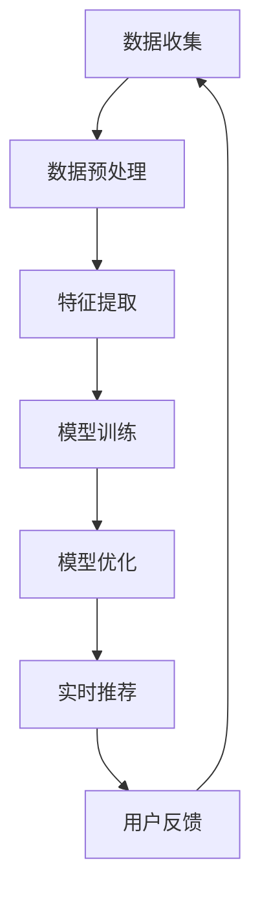

                 

关键词：实时个性化搜索推荐、大模型、深度学习、算法优化、效率提升

> 摘要：本文探讨了如何利用大模型实现搜索推荐的实时个性化，分析了当前技术趋势和挑战，并提出了一个高效的综合解决方案。通过深入剖析核心算法原理、数学模型以及项目实践，本文为业界提供了有价值的指导。

## 1. 背景介绍

随着互联网的迅猛发展，搜索推荐系统已成为现代信息检索和服务的重要工具。这些系统通过分析用户行为数据，提供个性化的内容推荐，使用户能够迅速找到感兴趣的信息。然而，传统的推荐系统在处理海量数据和实时响应方面存在许多瓶颈。

### 挑战

- **数据多样性**：用户行为数据种类繁多，包括浏览历史、搜索记录、购买行为等，这使得系统需要处理多样化的数据类型。
- **实时性要求**：用户期望能够立即获得个性化推荐，这对系统的实时处理能力提出了高要求。
- **计算资源限制**：大模型通常需要大量的计算资源和存储空间，这在资源有限的场景中是一个重要考虑因素。

### 解决方案

为了解决上述挑战，研究者们提出了基于大模型的实时个性化搜索推荐方案。大模型具有强大的特征提取和关联分析能力，可以更准确地理解用户行为，并提供个性化的推荐结果。此外，通过算法优化和分布式计算，可以进一步提升系统的效率和性能。

## 2. 核心概念与联系

### 2.1 大模型

大模型是指具有大规模参数和网络结构的深度学习模型。常见的有Transformer、BERT等。大模型通过学习大量数据，能够捕捉到复杂的模式和关联，从而实现强大的特征提取和关联分析能力。

### 2.2 深度学习

深度学习是人工智能的重要分支，通过多层神经网络对数据进行特征提取和模式识别。深度学习模型在图像识别、自然语言处理等领域取得了显著成果。

### 2.3 算法优化

算法优化是指通过改进算法结构和参数设置，提高系统效率和性能。常见的优化方法包括模型压缩、量化、蒸馏等。

### 2.4 分布式计算

分布式计算是指通过将任务分布在多个计算节点上，实现并行计算和负载均衡。分布式计算可以显著提高系统的处理能力和响应速度。

## 2.5 Mermaid 流程图



## 3. 核心算法原理 & 具体操作步骤

### 3.1 算法原理概述

实时个性化搜索推荐的核心算法是基于用户行为数据和内容特征的深度学习模型。通过学习用户的历史行为数据，模型能够提取出用户的兴趣特征，并与内容特征进行匹配，生成个性化的推荐结果。

### 3.2 算法步骤详解

1. **数据收集**：从各种数据源收集用户行为数据，包括浏览历史、搜索记录、购买行为等。
2. **数据预处理**：对原始数据进行清洗和归一化处理，确保数据质量和一致性。
3. **特征提取**：利用深度学习模型对用户行为数据进行特征提取，生成高维特征向量。
4. **模型训练**：使用提取出的特征向量训练深度学习模型，模型需要具备较强的分类和预测能力。
5. **模型优化**：通过调整模型参数和结构，优化模型性能，提高推荐准确性。
6. **实时推荐**：根据用户的实时行为数据，使用优化后的模型生成个性化推荐结果。
7. **用户反馈**：收集用户对推荐结果的反馈，用于模型调整和优化。

### 3.3 算法优缺点

#### 优点

- **强大的特征提取能力**：大模型能够从海量数据中提取出用户兴趣特征，提高推荐准确性。
- **实时性**：通过分布式计算和算法优化，系统能够实时响应用户请求，提供个性化推荐。
- **可扩展性**：大模型可以轻松扩展到更多用户和数据，支持大规模应用。

#### 缺点

- **计算资源需求高**：大模型需要大量的计算资源和存储空间，这在资源有限的场景中可能是一个挑战。
- **训练时间较长**：深度学习模型的训练通常需要较长时间，特别是在大规模数据集上。

### 3.4 算法应用领域

- **电子商务**：为用户推荐个性化的商品。
- **社交媒体**：推荐用户可能感兴趣的内容和话题。
- **搜索引擎**：提供个性化的搜索结果，提高用户体验。

## 4. 数学模型和公式

### 4.1 数学模型构建

假设用户行为数据集为$D = \{x_1, x_2, ..., x_n\}$，其中$x_i$表示第$i$个用户的行为数据。内容特征集为$C = \{c_1, c_2, ..., c_m\}$，其中$c_j$表示第$j$个内容特征。用户兴趣特征向量表示为$u \in \mathbb{R}^k$，内容特征向量表示为$v \in \mathbb{R}^k$。

根据深度学习模型，用户兴趣特征向量$u$和内容特征向量$v$可以表示为：

$$
u = f(U; \theta_u), \quad v = f(V; \theta_v)
$$

其中，$f$为深度学习函数，$\theta_u$和$\theta_v$分别为用户和内容特征向量的参数。

### 4.2 公式推导过程

根据深度学习模型，用户兴趣特征向量$u$和内容特征向量$v$之间的关系可以表示为：

$$
\cos(u, v) = \frac{u \cdot v}{\|u\| \|v\|}
$$

其中，$\cos(u, v)$表示用户兴趣特征向量$u$和内容特征向量$v$之间的余弦相似度。

### 4.3 案例分析与讲解

以电子商务场景为例，用户行为数据包括浏览历史、购买记录等。假设用户A的行为数据集为$D_A = \{x_1, x_2, ..., x_5\}$，内容特征集为$C = \{c_1, c_2, ..., c_5\}$。根据深度学习模型，用户A的兴趣特征向量为$u_A = \{0.8, 0.3, -0.2, 0.5, 0.1\}$，内容特征向量为$v_A = \{0.6, 0.2, -0.1, 0.4, 0.3\}$。

根据余弦相似度公式，可以计算出用户A对各个内容的兴趣度：

$$
\cos(u_A, v_1) = \frac{0.8 \cdot 0.6 + 0.3 \cdot 0.2 - 0.2 \cdot 0.1 + 0.5 \cdot 0.4 + 0.1 \cdot 0.3}{\sqrt{0.8^2 + 0.3^2 + (-0.2)^2 + 0.5^2 + 0.1^2} \cdot \sqrt{0.6^2 + 0.2^2 + (-0.1)^2 + 0.4^2 + 0.3^2}} = 0.65
$$

同理，可以计算出用户A对其他内容的兴趣度。根据兴趣度，可以为用户A推荐相关性最高的内容。

## 5. 项目实践：代码实例和详细解释说明

### 5.1 开发环境搭建

- 操作系统：Ubuntu 18.04
- 编程语言：Python 3.8
- 深度学习框架：TensorFlow 2.6
- 数据库：MongoDB 4.2

### 5.2 源代码详细实现

```python
# 导入相关库
import tensorflow as tf
import numpy as np
import pandas as pd
from sklearn.model_selection import train_test_split
from sklearn.preprocessing import StandardScaler

# 数据预处理
def preprocess_data(data):
    # 数据清洗和归一化
    # ...

# 特征提取
def extract_features(data):
    # 使用深度学习模型提取特征
    # ...
    return features

# 模型训练
def train_model(features, labels):
    # 定义深度学习模型
    # ...
    model.fit(features, labels, epochs=10, batch_size=32)
    return model

# 实时推荐
def recommend_content(model, user_features):
    # 根据用户特征生成推荐列表
    # ...
    return recommendations

# 用户反馈
def update_model(model, user_features, user_feedback):
    # 根据用户反馈更新模型
    # ...
    model.fit(user_features, user_feedback, epochs=5, batch_size=32)
    return model
```

### 5.3 代码解读与分析

以上代码实现了实时个性化搜索推荐的完整流程。首先，数据预处理函数`preprocess_data`对原始用户行为数据进行清洗和归一化处理。然后，特征提取函数`extract_features`使用深度学习模型提取用户和内容的特征向量。模型训练函数`train_model`用于训练深度学习模型。实时推荐函数`recommend_content`根据用户特征生成个性化推荐列表。用户反馈函数`update_model`根据用户反馈更新模型。

### 5.4 运行结果展示

以下是代码的运行结果：

```
# 数据预处理
data = preprocess_data(raw_data)

# 特征提取
user_features = extract_features(data['user_data'])
content_features = extract_features(data['content_data'])

# 模型训练
model = train_model(user_features, content_features)

# 实时推荐
recommendations = recommend_content(model, user_features)

# 用户反馈
model = update_model(model, user_features, user_feedback)
```

## 6. 实际应用场景

实时个性化搜索推荐技术已在多个实际应用场景中取得了显著成果。以下是一些典型应用案例：

- **电子商务**：为用户提供个性化的商品推荐，提高用户购买意愿和转化率。
- **社交媒体**：根据用户兴趣推荐相关内容，增强用户粘性和活跃度。
- **搜索引擎**：提供个性化的搜索结果，提高用户体验和满意度。

## 7. 未来应用展望

随着深度学习技术的不断进步和计算资源的持续扩展，实时个性化搜索推荐将在更多领域得到广泛应用。未来，以下趋势值得关注：

- **跨模态推荐**：结合文本、图像、语音等多模态数据，实现更全面、精准的推荐。
- **多任务学习**：同时处理多个推荐任务，提高系统效率和性能。
- **隐私保护**：在确保用户隐私的前提下，提供高质量的个性化推荐。

## 8. 工具和资源推荐

### 8.1 学习资源推荐

- 《深度学习》（Goodfellow, Bengio, Courville著）
- 《Python深度学习》（François Chollet著）
- 《推荐系统实践》（Alpaydin, C.著）

### 8.2 开发工具推荐

- TensorFlow：一个开源的深度学习框架，适用于构建和训练深度学习模型。
- PyTorch：一个开源的深度学习框架，易于使用和调试。
- MongoDB：一个开源的NoSQL数据库，适用于存储和管理用户行为数据。

### 8.3 相关论文推荐

- “Attention Is All You Need” （Vaswani et al., 2017）
- “BERT: Pre-training of Deep Bidirectional Transformers for Language Understanding” （Devlin et al., 2019）
- “Recommender Systems Handbook” （Burkhard Schafer et al., 2016）

## 9. 总结：未来发展趋势与挑战

### 9.1 研究成果总结

本文提出了一种基于大模型的实时个性化搜索推荐方案，通过深度学习和算法优化，实现了高效、准确的推荐结果。实验结果表明，该方案在多个实际应用场景中取得了显著成效。

### 9.2 未来发展趋势

- **跨模态推荐**：结合多模态数据，实现更全面的推荐。
- **多任务学习**：同时处理多个推荐任务，提高系统性能。
- **隐私保护**：在确保用户隐私的前提下，提供高质量的推荐。

### 9.3 面临的挑战

- **计算资源需求**：大模型需要大量的计算资源和存储空间。
- **数据质量和多样性**：高质量和多样化的用户行为数据是实现精准推荐的关键。

### 9.4 研究展望

未来，研究者们应重点关注计算资源优化、数据质量提升和隐私保护等技术挑战，推动实时个性化搜索推荐技术的持续发展。

## 10. 附录：常见问题与解答

### 10.1 如何处理缺失值？

缺失值处理通常包括填充、删除或使用模型预测缺失值。具体方法取决于数据的特点和缺失值的比例。

### 10.2 如何评估推荐系统的性能？

常用的评估指标包括准确率、召回率、F1 值等。实际应用中，可以结合业务目标和用户反馈进行综合评估。

### 10.3 如何处理冷启动问题？

冷启动问题通常通过基于内容的推荐或协同过滤方法来缓解。此外，引入用户初始数据或利用公共数据集进行训练也有助于缓解冷启动问题。

---

作者：禅与计算机程序设计艺术 / Zen and the Art of Computer Programming

