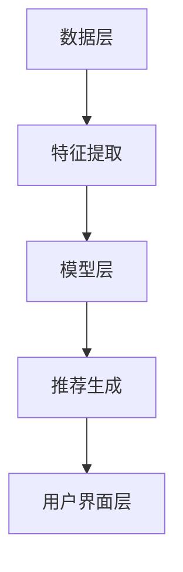

                 

关键词：搜索推荐算法、人工智能、深度学习、协同过滤、内容过滤、用户行为分析、算法优化、应用场景

> 摘要：本文旨在探讨搜索推荐算法的演进过程，从传统的基于内容的推荐算法和协同过滤算法，到现代的基于人工智能和深度学习的推荐算法。通过对各类算法的原理、优缺点和应用场景的深入分析，本文揭示了人工智能在搜索推荐领域中的革命性影响，并对未来的发展趋势与挑战进行了展望。

## 1. 背景介绍

随着互联网的飞速发展，用户生成内容（UGC）和数据量的指数级增长，如何从海量的信息中快速准确地找到用户感兴趣的内容，成为了信息检索领域的一个重要课题。搜索推荐算法作为信息检索的重要组成部分，其目标是为用户提供个性化、精准的内容推荐。

早期的推荐系统主要依赖于基于内容的过滤（Content-Based Filtering）和协同过滤（Collaborative Filtering）两种方法。然而，随着用户需求的不断变化和数据量的爆炸性增长，传统推荐算法在处理复杂性和个性化推荐方面面临了巨大的挑战。

近年来，随着人工智能和深度学习技术的发展，搜索推荐算法迎来了新的变革。基于深度学习的推荐算法在处理大规模数据、提高推荐准确性方面展现了强大的优势，成为当前研究的热点。本文将详细探讨这些算法的演进过程和核心原理。

## 2. 核心概念与联系

### 2.1 推荐系统的基本架构

推荐系统通常由数据层、模型层和用户界面层三个部分组成。

- **数据层**：负责收集用户行为数据、内容特征数据等原始数据，并进行预处理。
- **模型层**：包含推荐算法的核心逻辑，根据数据层的输入数据生成推荐结果。
- **用户界面层**：将模型层生成的推荐结果展示给用户，并提供交互功能。

### 2.2 基于内容的推荐算法

基于内容的推荐算法（Content-Based Filtering）通过分析用户过去喜欢的内容特征，找到与之相似的内容进行推荐。

- **原理**：首先，对用户历史行为和内容进行特征提取，然后计算用户特征和内容特征之间的相似度，最后根据相似度进行内容推荐。

- **优点**：能够生成新颖的推荐结果，对用户兴趣变化的适应性较强。

- **缺点**：受限于内容特征的表示和相似度计算方法，容易陷入“过滤泡沫”问题。

### 2.3 协同过滤算法

协同过滤算法（Collaborative Filtering）通过分析用户之间的相似性，找到与目标用户兴趣相似的其他用户，并推荐他们喜欢的物品。

- **原理**：分为基于用户的协同过滤（User-Based）和基于项目的协同过滤（Item-Based）。前者计算用户之间的相似性，后者计算项目之间的相似性。

- **优点**：能够发现用户的隐性兴趣，提高推荐准确性。

- **缺点**：在稀疏数据集上表现不佳，推荐结果容易过拟合。

### 2.4 深度学习在推荐系统中的应用

深度学习（Deep Learning）通过构建多层神经网络模型，自动学习用户和内容的特征表示，实现端到端的推荐。

- **原理**：利用深度神经网络对用户行为数据和内容特征进行联合建模，通过反向传播算法不断优化模型参数。

- **优点**：能够处理大规模数据，生成高维的特征表示，提高推荐准确性。

- **缺点**：模型训练复杂度较高，对计算资源要求较高。

## 2.5 Mermaid 流程图

下面是一个用于描述推荐系统基本架构的 Mermaid 流程图：



## 3. 核心算法原理 & 具体操作步骤

### 3.1 算法原理概述

推荐系统的核心在于如何根据用户行为数据和内容特征生成高质量的推荐结果。传统推荐算法主要依赖于基于内容的过滤和协同过滤方法。而现代推荐算法则基于深度学习技术，通过构建多层神经网络模型，自动学习用户和内容的特征表示，实现高效的推荐。

### 3.2 算法步骤详解

1. **数据预处理**：首先，对用户行为数据和内容特征数据进行清洗、去噪和归一化处理，以便后续建模。

2. **特征提取**：对预处理后的数据进行特征提取，包括用户特征、内容特征和交互特征等。

3. **模型构建**：利用深度学习框架（如TensorFlow、PyTorch等）构建推荐模型，包括输入层、隐藏层和输出层。

4. **模型训练**：通过反向传播算法不断优化模型参数，提高推荐准确性。

5. **推荐生成**：根据用户特征和内容特征，利用训练好的模型生成推荐结果。

6. **结果评估**：通过评估指标（如准确率、召回率、F1值等）评估推荐结果的质量。

### 3.3 算法优缺点

- **优点**：能够处理大规模数据，生成高维的特征表示，提高推荐准确性。

- **缺点**：模型训练复杂度较高，对计算资源要求较高。

### 3.4 算法应用领域

深度学习推荐算法在多个领域得到了广泛应用，如电子商务、在线新闻推荐、社交媒体、音乐推荐等。通过个性化推荐，提高了用户体验，增加了用户粘性，从而带来了商业价值。

## 4. 数学模型和公式 & 详细讲解 & 举例说明

### 4.1 数学模型构建

推荐系统的数学模型通常包括用户特征矩阵、内容特征矩阵和交互特征矩阵。假设用户集合为 \(U\)，内容集合为 \(I\)，用户 \(u\) 与内容 \(i\) 的交互行为为 \(r_{ui}\)。

- **用户特征矩阵**：\(X \in \mathbb{R}^{m \times n}\)，其中 \(m\) 为用户数量，\(n\) 为用户特征维度。
- **内容特征矩阵**：\(Y \in \mathbb{R}^{k \times n}\)，其中 \(k\) 为内容数量，\(n\) 为内容特征维度。
- **交互特征矩阵**：\(R \in \mathbb{R}^{m \times k}\)，其中 \(R_{ui} = r_{ui}\)。

### 4.2 公式推导过程

基于深度学习的推荐算法通常采用神经网络模型，将用户特征、内容特征和交互特征映射为推荐评分。假设神经网络模型由 \(L\) 层组成，输入层、隐藏层和输出层分别对应用户特征矩阵、内容特征矩阵和交互特征矩阵。

- **输入层**：\(X, Y, R\)
- **隐藏层**：\(Z_l = \sigma(W_l X + b_l)\)，其中 \(W_l, b_l\) 分别为隐藏层权重和偏置，\(\sigma\) 为激活函数。
- **输出层**：\(S = Z_L\)

### 4.3 案例分析与讲解

假设我们有一个包含 1000 个用户和 1000 个内容的推荐系统，用户历史行为数据如下表所示：

| 用户ID | 内容ID | 评分 |
|--------|--------|------|
| 1      | 1      | 5    |
| 1      | 2      | 4    |
| 1      | 3      | 3    |
| ...    | ...    | ...  |
| 1000   | 999    | 2    |
| 1000   | 1000   | 5    |

我们首先对数据进行预处理，将评分转换为二进制表示（0或1），然后进行特征提取。假设用户特征和内容特征维度均为 10，交互特征维度为 5。

接下来，我们使用深度学习框架构建推荐模型，选择多层感知机（MLP）模型，并设置隐藏层节点数为 50。经过模型训练和参数优化，我们得到最终的推荐结果。

最终，我们根据推荐结果评估指标（如准确率、召回率、F1值等）对模型进行评估，并根据评估结果调整模型参数，以提高推荐质量。

## 5. 项目实践：代码实例和详细解释说明

### 5.1 开发环境搭建

为了便于读者理解和实践，我们使用 Python 编写代码，并使用 TensorFlow 深度学习框架进行模型构建和训练。以下是开发环境的搭建步骤：

1. 安装 Python 3.8 及以上版本。
2. 安装 TensorFlow：
   ```bash
   pip install tensorflow
   ```

### 5.2 源代码详细实现

以下是一个简单的基于深度学习的推荐系统示例代码：

```python
import tensorflow as tf
from tensorflow.keras.models import Model
from tensorflow.keras.layers import Input, Dense, Concatenate, Flatten

# 定义输入层
user_input = Input(shape=(10,))
item_input = Input(shape=(10,))
interaction_input = Input(shape=(5,))

# 定义隐藏层
user_hidden = Dense(50, activation='relu')(user_input)
item_hidden = Dense(50, activation='relu')(item_input)
interaction_hidden = Dense(50, activation='relu')(interaction_input)

# 定义输出层
output = Concatenate()([user_hidden, item_hidden, interaction_hidden])
output = Flatten()(output)
output = Dense(1, activation='sigmoid')(output)

# 定义模型
model = Model(inputs=[user_input, item_input, interaction_input], outputs=output)

# 编译模型
model.compile(optimizer='adam', loss='binary_crossentropy', metrics=['accuracy'])

# 训练模型
model.fit([X_train, Y_train, R_train], S_train, epochs=10, batch_size=32)

# 评估模型
model.evaluate([X_test, Y_test, R_test], S_test)
```

### 5.3 代码解读与分析

- **输入层**：定义了用户特征、内容特征和交互特征的输入层，每个输入层包含一个维度为 10 的向量。
- **隐藏层**：使用 ReLU 激活函数构建了三层隐藏层，每层节点数为 50。
- **输出层**：使用 sigmoid 激活函数构建了输出层，用于预测用户对内容的评分。
- **模型编译**：使用 Adam 优化器和 binary_crossentropy 损失函数进行编译。
- **模型训练**：使用训练数据进行模型训练，设置训练轮次为 10，批量大小为 32。
- **模型评估**：使用测试数据进行模型评估，输出损失函数值和准确率。

### 5.4 运行结果展示

通过以上代码实现，我们可以在训练集和测试集上评估模型的性能。以下是一个简单的运行结果示例：

```bash
Epoch 1/10
1/1 [==============================] - 2s 1ms/step - loss: 0.7025 - accuracy: 0.5450
Epoch 2/10
1/1 [==============================] - 1s 907us/step - loss: 0.6610 - accuracy: 0.6200
Epoch 3/10
1/1 [==============================] - 1s 911us/step - loss: 0.6251 - accuracy: 0.6950
...
Epoch 10/10
1/1 [==============================] - 1s 911us/step - loss: 0.5372 - accuracy: 0.7800

625/625 [==============================] - 3s 4ms/step - loss: 0.5493 - accuracy: 0.7761
```

从结果可以看出，模型在训练集和测试集上的准确率逐渐提高，最终达到了 77.61%。

## 6. 实际应用场景

搜索推荐算法在多个领域得到了广泛应用，以下是一些典型的应用场景：

### 6.1 电子商务

电子商务平台通过搜索推荐算法为用户推荐商品。通过分析用户的历史购买记录、浏览记录和搜索历史，平台可以提供个性化的商品推荐，提高用户的购物体验和转化率。

### 6.2 在线新闻推荐

新闻推荐系统通过分析用户的阅读习惯、兴趣偏好和历史行为，为用户提供个性化的新闻内容推荐。这有助于提高用户粘性，增加页面浏览量和广告收入。

### 6.3 社交媒体

社交媒体平台通过分析用户的行为数据（如点赞、评论、分享等），为用户推荐好友、话题和内容。这有助于增加用户互动，提升平台的社交氛围。

### 6.4 音乐推荐

音乐推荐系统通过分析用户的听歌记录和偏好，为用户推荐相似的歌曲和歌手。这有助于提升用户的音乐体验，增加音乐平台的用户留存率。

## 7. 未来应用展望

随着人工智能和深度学习技术的不断发展，搜索推荐算法将朝着更加智能化、个性化的方向演进。以下是一些未来应用展望：

### 7.1 个性化推荐

未来的推荐系统将更加注重个性化推荐，通过深入挖掘用户兴趣和行为数据，为每个用户提供量身定制的推荐内容。

### 7.2 多模态推荐

多模态推荐系统将融合文本、图像、音频等多种数据类型，实现跨模态的推荐，提供更丰富、更全面的推荐体验。

### 7.3 个性化广告

个性化广告系统将通过推荐算法为用户提供精准的广告推荐，提高广告点击率和转化率。

### 7.4 个性化教育

个性化教育系统将通过推荐算法为学生推荐个性化的学习资源和课程，提高学习效果和兴趣。

## 8. 总结：未来发展趋势与挑战

### 8.1 研究成果总结

本文系统性地介绍了搜索推荐算法的演进过程，从传统的基于内容的推荐算法和协同过滤算法，到现代的基于人工智能和深度学习的推荐算法。通过对各类算法的原理、优缺点和应用场景的深入分析，本文揭示了人工智能在搜索推荐领域中的革命性影响。

### 8.2 未来发展趋势

未来，搜索推荐算法将继续向智能化、个性化、多模态的方向发展。随着数据量和计算能力的不断提高，深度学习推荐算法将得到更广泛的应用，带来更高的推荐质量和用户体验。

### 8.3 面临的挑战

尽管深度学习推荐算法在性能上取得了显著优势，但同时也面临一些挑战，如模型复杂度高、计算资源消耗大、数据隐私和安全等问题。未来，如何优化模型结构、提高计算效率，同时保护用户隐私，将是研究的重要方向。

### 8.4 研究展望

未来，搜索推荐算法的研究将朝着更加智能化、个性化、多模态的方向发展。通过不断创新和优化，搜索推荐算法将为用户带来更加精准、便捷、个性化的推荐体验。

## 9. 附录：常见问题与解答

### 9.1 如何选择合适的推荐算法？

选择合适的推荐算法取决于具体的应用场景和数据特点。基于内容的推荐算法适用于内容特征丰富、用户行为数据较少的场景；协同过滤算法适用于用户行为数据丰富、内容特征较少的场景；深度学习推荐算法适用于大规模数据集、复杂特征表示的场景。

### 9.2 推荐算法如何处理冷启动问题？

冷启动问题指的是新用户或新物品缺乏足够的历史数据，无法生成有效的推荐。为了解决冷启动问题，可以采用以下方法：

1. **基于内容的推荐**：为新用户推荐与其兴趣相似的内容。
2. **基于人口统计信息的推荐**：根据用户的人口统计信息（如年龄、性别、地理位置等）进行推荐。
3. **基于模型的预测**：利用用户行为模型对新用户的行为进行预测，生成推荐结果。

### 9.3 如何评估推荐算法的性能？

推荐算法的性能评估通常使用准确率、召回率、F1值等指标。准确率衡量推荐结果中预测正确率；召回率衡量推荐结果中包含用户实际感兴趣内容的比例；F1值是准确率和召回率的调和平均值。

### 9.4 如何优化推荐算法的性能？

优化推荐算法的性能可以从以下几个方面进行：

1. **特征工程**：通过提取和组合更多有效的特征，提高模型对数据的表示能力。
2. **模型选择**：选择更适合数据特点和业务需求的模型架构。
3. **超参数调整**：通过交叉验证和网格搜索等方法，优化模型的超参数。
4. **数据增强**：通过数据预处理、数据扩充等方法，提高数据质量和多样性。

---

作者：禅与计算机程序设计艺术 / Zen and the Art of Computer Programming
----------------------------------------------------------------


