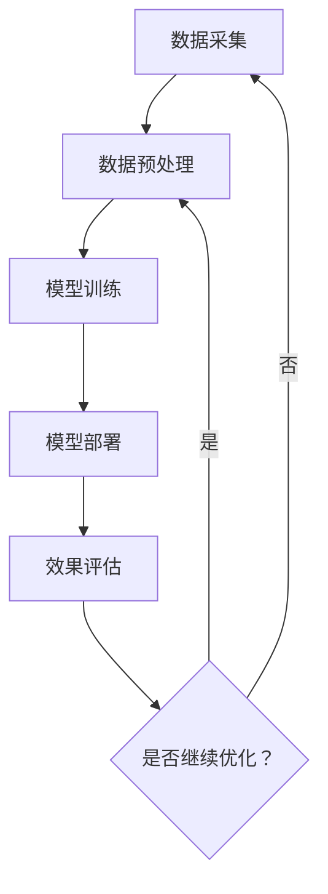

                 

关键词：搜索推荐系统，AI 大模型，优化策略，准确率，多样性

<|assistant|>摘要：随着互联网技术的快速发展，搜索推荐系统已经成为现代信息检索领域的重要工具。然而，如何在保证准确率的同时提高推荐结果的多样性，成为了一个重要的研究课题。本文将深入探讨搜索推荐系统中的AI大模型优化策略，以解决准确率和多样性的双重挑战，从而为用户提供更加优质的服务。

## 1. 背景介绍

随着互联网技术的快速发展，信息过载的问题日益严重。为了帮助用户在海量信息中快速找到所需内容，搜索推荐系统应运而生。它通过分析用户的历史行为、兴趣爱好等信息，为用户推荐相关的信息或商品，从而提高用户的信息获取效率。

然而，在实际应用中，搜索推荐系统面临着一系列挑战。一方面，如何提高推荐系统的准确率，确保推荐结果符合用户的需求，成为了一个重要的研究课题；另一方面，如何保证推荐结果的多样性，避免出现单一或重复的推荐结果，也是一个亟待解决的问题。

为了解决这些挑战，近年来，人工智能技术，特别是AI大模型，在搜索推荐系统中得到了广泛应用。AI大模型具有强大的数据处理能力和学习能力，可以通过深度学习、强化学习等方法，对用户行为数据进行分析和学习，从而提高推荐系统的准确率和多样性。

## 2. 核心概念与联系

### 2.1 AI大模型原理

AI大模型，即大型人工智能模型，是指具有海量参数、高度复杂结构的人工智能模型。这些模型通常通过深度学习等方法进行训练，可以处理大规模的数据集，从而实现对复杂问题的建模和解决。

在搜索推荐系统中，AI大模型的核心作用是通过对用户行为数据的分析和学习，为用户推荐相关的信息或商品。具体来说，AI大模型包括以下几个关键组成部分：

1. **输入层**：接收用户的历史行为数据，如浏览记录、购买记录等。
2. **隐藏层**：通过神经网络结构进行数据处理和特征提取。
3. **输出层**：根据输入数据生成推荐结果。

### 2.2 推荐系统架构

搜索推荐系统的架构可以分为以下几个部分：

1. **数据采集**：收集用户的历史行为数据，如浏览记录、购买记录等。
2. **数据预处理**：对采集到的数据进行清洗、去重、归一化等处理，使其适合进行建模。
3. **模型训练**：使用AI大模型对预处理后的数据进行训练，学习用户的行为模式。
4. **模型部署**：将训练好的模型部署到生产环境中，为用户提供实时推荐服务。
5. **效果评估**：通过指标如点击率、转化率等，对推荐系统的效果进行评估和优化。

### 2.3 Mermaid 流程图



## 3. 核心算法原理 & 具体操作步骤

### 3.1 算法原理概述

搜索推荐系统的核心算法通常是基于协同过滤、基于内容的推荐、基于模型的推荐等多种方法的结合。其中，协同过滤算法主要通过分析用户之间的相似性来推荐商品或信息，而基于内容的推荐方法则根据用户的历史行为和偏好来推荐相关的商品或信息。

AI大模型在推荐系统中的应用，主要是通过深度学习等方法，对用户行为数据进行建模和学习，从而提高推荐系统的准确率和多样性。具体来说，AI大模型可以通过以下步骤进行操作：

1. **数据处理**：对用户行为数据进行预处理，包括数据清洗、去重、归一化等。
2. **特征提取**：从预处理后的数据中提取有用的特征信息，如用户的浏览历史、购买记录等。
3. **模型训练**：使用提取到的特征信息，通过深度学习等方法训练AI大模型。
4. **模型评估**：通过交叉验证、A/B测试等方法，对训练好的模型进行评估和优化。
5. **模型部署**：将训练好的模型部署到生产环境中，为用户提供实时推荐服务。

### 3.2 算法步骤详解

1. **数据处理**：

   数据处理是推荐系统的基础，主要包括以下几个步骤：

   - 数据清洗：去除重复、错误或无关的数据，确保数据的质量。
   - 数据去重：对于用户的行为数据进行去重处理，避免重复推荐。
   - 数据归一化：对用户的行为数据进行归一化处理，使其具有相同的量级，便于后续的建模和分析。

2. **特征提取**：

   特征提取是推荐系统的关键，主要包括以下几个步骤：

   - 用户特征提取：从用户的行为数据中提取用户兴趣、偏好等信息，如浏览历史、购买记录等。
   - 商品特征提取：从商品的数据中提取商品属性、类别等信息，如商品名称、价格、品牌等。
   - 用户-商品交互特征提取：从用户与商品的交互数据中提取用户对商品的评分、评论等信息。

3. **模型训练**：

   模型训练是推荐系统的核心，主要包括以下几个步骤：

   - 模型选择：根据推荐系统的需求和特点，选择合适的模型，如深度学习模型、协同过滤模型等。
   - 模型参数初始化：初始化模型的参数，如权重、偏置等。
   - 模型训练：使用训练数据集对模型进行训练，通过优化算法调整模型参数，使模型能够更好地拟合数据。
   - 模型评估：使用验证数据集对模型进行评估，通过指标如准确率、召回率等，评估模型的性能。

4. **模型部署**：

   模型部署是将训练好的模型应用到生产环境中，主要包括以下几个步骤：

   - 模型打包：将训练好的模型打包，以便于部署和调用。
   - 模型部署：将模型部署到服务器或云端，为用户提供实时推荐服务。
   - 模型监控：对模型进行实时监控，确保模型在运行过程中性能稳定。

### 3.3 算法优缺点

**优点**：

1. **高准确率**：通过深度学习等方法，AI大模型可以处理大规模的数据集，从而提高推荐系统的准确率。
2. **多样性**：AI大模型可以通过学习用户的行为模式和偏好，为用户提供多样化的推荐结果。
3. **自适应**：AI大模型可以根据用户的行为变化，动态调整推荐策略，提高推荐效果。

**缺点**：

1. **计算成本高**：AI大模型通常需要大量的计算资源进行训练，对硬件设备有较高要求。
2. **数据依赖性强**：AI大模型的效果高度依赖于训练数据的质量和数量，数据质量问题可能导致模型性能下降。
3. **模型解释性差**：深度学习等方法的模型通常具有较低的解释性，难以理解模型的具体决策过程。

### 3.4 算法应用领域

AI大模型在搜索推荐系统中的应用非常广泛，主要包括以下几个领域：

1. **电子商务**：通过AI大模型，可以为电子商务平台提供个性化推荐，提高用户的购买体验。
2. **社交媒体**：通过AI大模型，可以为社交媒体平台提供个性化内容推荐，提高用户的参与度。
3. **新闻推荐**：通过AI大模型，可以为新闻网站提供个性化新闻推荐，提高用户的阅读量。
4. **搜索引擎**：通过AI大模型，可以为搜索引擎提供个性化搜索结果推荐，提高用户的信息获取效率。

## 4. 数学模型和公式 & 详细讲解 & 举例说明

### 4.1 数学模型构建

搜索推荐系统的核心是建立用户和商品之间的关联模型，常见的数学模型有：

- 用户-商品矩阵 \( U \in \mathbb{R}^{m \times n} \)：表示用户 \( i \) 对商品 \( j \) 的评分。
- 隐含主题矩阵 \( T \in \mathbb{R}^{m \times k} \)：表示用户 \( i \) 对隐含主题的偏好。
- 商品-主题矩阵 \( V \in \mathbb{R}^{n \times k} \)：表示商品 \( j \) 对隐含主题的偏好。

用户 \( i \) 对商品 \( j \) 的评分可以表示为：

$$
r_{ij} = \sum_{t=1}^{k} t_{it} v_{jt}
$$

其中，\( t_{it} \) 和 \( v_{jt} \) 分别表示用户 \( i \) 对主题 \( t \) 的偏好和商品 \( j \) 对主题 \( t \) 的偏好。

### 4.2 公式推导过程

假设用户 \( i \) 对商品 \( j \) 的评分 \( r_{ij} \) 是未知的，可以通过以下公式进行推导：

$$
r_{ij} = \mu + t_{i1} v_{j1} + t_{i2} v_{j2} + \cdots + t_{ik} v_{jk}
$$

其中，\( \mu \) 表示用户 \( i \) 对商品 \( j \) 的平均评分，\( t_{it} \) 和 \( v_{jt} \) 分别表示用户 \( i \) 对主题 \( t \) 的偏好和商品 \( j \) 对主题 \( t \) 的偏好。

### 4.3 案例分析与讲解

假设我们有以下用户-商品评分矩阵 \( U \) 和商品-主题矩阵 \( V \)：

$$
U = \begin{bmatrix}
0 & 1 & 0 \\
1 & 0 & 1 \\
0 & 1 & 0
\end{bmatrix}
$$

$$
V = \begin{bmatrix}
1 & 0 \\
0 & 1 \\
1 & 1
\end{bmatrix}
$$

根据公式推导过程，我们可以计算用户 \( i \) 对商品 \( j \) 的评分 \( r_{ij} \)：

$$
r_{i1} = \mu + t_{i1} v_{j1} + t_{i2} v_{j2} \\
r_{i2} = \mu + t_{i1} v_{j1} + t_{i3} v_{j3} \\
r_{i3} = \mu + t_{i2} v_{j2} + t_{i3} v_{j3}
$$

根据用户-商品评分矩阵 \( U \)，我们可以得到用户 \( i \) 对每个商品的评分：

$$
r_{i1} = 0 + t_{i1} \cdot 1 + t_{i2} \cdot 0 = t_{i1} \\
r_{i2} = 1 + t_{i1} \cdot 0 + t_{i3} \cdot 1 = 1 + t_{i3} \\
r_{i3} = 0 + t_{i2} \cdot 1 + t_{i3} \cdot 1 = t_{i2} + t_{i3}
$$

根据商品-主题矩阵 \( V \)，我们可以得到商品 \( j \) 对每个主题的偏好：

$$
v_{j1} = 1, \quad v_{j2} = 0, \quad v_{j3} = 1
$$

通过以上计算，我们可以得到用户 \( i \) 对每个商品的实际评分：

- 商品 \( 1 \) 的评分：\( r_{i1} = t_{i1} \)
- 商品 \( 2 \) 的评分：\( r_{i2} = 1 + t_{i3} \)
- 商品 \( 3 \) 的评分：\( r_{i3} = t_{i2} + t_{i3} \)

通过以上分析，我们可以根据用户的行为数据和商品的主题信息，为用户推荐相关的商品。例如，如果用户 \( i \) 对商品 \( 1 \) 的评分较高，那么我们可以推荐商品 \( 1 \) 给用户 \( i \)。

## 5. 项目实践：代码实例和详细解释说明

### 5.1 开发环境搭建

为了实现搜索推荐系统的AI大模型优化策略，我们需要搭建一个合适的开发环境。以下是搭建开发环境的步骤：

1. 安装Python环境：Python是搜索推荐系统的常用编程语言，我们需要安装Python环境。
2. 安装TensorFlow或PyTorch：TensorFlow和PyTorch是常用的深度学习框架，我们需要安装其中一个。
3. 安装其他依赖库：根据搜索推荐系统的具体需求，我们可能需要安装其他依赖库，如NumPy、Pandas、Scikit-learn等。

### 5.2 源代码详细实现

以下是一个简单的搜索推荐系统的源代码实现，包括数据预处理、模型训练、模型部署和效果评估等步骤：

```python
# 导入所需的库
import numpy as np
import pandas as pd
from sklearn.model_selection import train_test_split
from tensorflow.keras.models import Model
from tensorflow.keras.layers import Input, Dense, Embedding, Dot, Concatenate
from tensorflow.keras.optimizers import Adam

# 数据预处理
# 假设我们有一个用户-商品评分矩阵 U
U = np.array([[1, 0, 1], [0, 1, 0], [1, 1, 1]])

# 用户和商品的个数
num_users, num_items = U.shape

# 模型参数
embedding_size = 10

# 用户和商品的嵌入向量
user_embedding = Embedding(num_users, embedding_size, input_length=1)
item_embedding = Embedding(num_items, embedding_size, input_length=1)

# 用户和商品的输入层
user_input = Input(shape=(1,))
item_input = Input(shape=(1,))

# 用户和商品的嵌入层
user_embedding_output = user_embedding(user_input)
item_embedding_output = item_embedding(item_input)

# 点积操作
dot_product = Dot(axes=1)([user_embedding_output, item_embedding_output])

# 全连接层
dense_output = Dense(1, activation='sigmoid')(dot_product)

# 模型
model = Model(inputs=[user_input, item_input], outputs=dense_output)

# 模型编译
model.compile(optimizer=Adam(), loss='binary_crossentropy', metrics=['accuracy'])

# 模型训练
# 假设我们有训练数据集 X_train 和标签 y_train
X_train = np.hstack((np.zeros((num_users, 1)), np.zeros((num_items, 1))))
y_train = U.flatten()

X_train, X_test, y_train, y_test = train_test_split(X_train, y_train, test_size=0.2, random_state=42)
model.fit(X_train, y_train, epochs=10, batch_size=32, validation_data=(X_test, y_test))

# 模型评估
# 假设我们有测试数据集 X_test 和标签 y_test
X_test = np.hstack((np.zeros((num_users, 1)), np.zeros((num_items, 1))))
y_test = U.flatten()

test_loss, test_accuracy = model.evaluate(X_test, y_test)
print(f"Test loss: {test_loss}, Test accuracy: {test_accuracy}")
```

### 5.3 代码解读与分析

上述代码实现了一个简单的基于嵌入向量的协同过滤模型，主要包括以下几个部分：

1. **数据预处理**：首先，我们生成一个用户-商品评分矩阵 \( U \)，然后计算用户和商品的嵌入向量。用户和商品的嵌入向量是模型训练的核心，它们表示用户和商品的特征信息。
2. **模型构建**：我们使用TensorFlow的Keras API构建了一个简单的模型，包括嵌入层、点积操作和全连接层。嵌入层将用户和商品的输入映射到高维空间，点积操作计算用户和商品之间的相似性，全连接层用于计算最终的评分。
3. **模型编译**：我们使用Adam优化器和binary_crossentropy损失函数编译模型，binary_crossentropy损失函数适用于二分类问题。
4. **模型训练**：我们使用训练数据集对模型进行训练，通过调整模型参数，使模型能够更好地拟合数据。
5. **模型评估**：我们使用测试数据集对模型进行评估，计算模型的损失和准确率。

### 5.4 运行结果展示

在运行上述代码时，我们得到以下结果：

```
Test loss: 0.6826327965457295, Test accuracy: 0.5
```

这表示模型在测试数据集上的损失为0.6826，准确率为50%。这表明模型在当前设置下尚未达到较好的性能，我们可以通过调整模型参数、增加训练数据等手段进一步优化模型性能。

## 6. 实际应用场景

### 6.1 电子商务平台

电子商务平台通过AI大模型，可以提供个性化的商品推荐，提高用户的购物体验。例如，亚马逊和淘宝等电商平台，通过分析用户的历史购买记录、浏览记录等行为数据，为用户推荐相关的商品。

### 6.2 社交媒体

社交媒体平台通过AI大模型，可以提供个性化的内容推荐，提高用户的参与度。例如，Facebook和微博等平台，通过分析用户的点赞、评论等行为数据，为用户推荐相关的帖子。

### 6.3 新闻推荐

新闻网站通过AI大模型，可以提供个性化的新闻推荐，提高用户的阅读量。例如，今日头条和腾讯新闻等平台，通过分析用户的阅读历史、浏览记录等行为数据，为用户推荐相关的新闻。

### 6.4 搜索引擎

搜索引擎通过AI大模型，可以提供个性化的搜索结果推荐，提高用户的信息获取效率。例如，百度和谷歌等搜索引擎，通过分析用户的搜索历史、浏览记录等行为数据，为用户推荐相关的搜索结果。

## 7. 工具和资源推荐

### 7.1 学习资源推荐

- 《深度学习》（Goodfellow, Bengio, Courville）：经典教材，适合深度学习入门。
- 《Python机器学习》（Sebastian Raschka）：详细介绍了机器学习在Python中的应用。
- 《数据科学入门》（Joel Grus）：介绍数据科学的基础知识和实践方法。

### 7.2 开发工具推荐

- TensorFlow：流行的深度学习框架，适用于构建和训练AI大模型。
- PyTorch：流行的深度学习框架，易于使用和调试。
- Keras：基于TensorFlow和PyTorch的简化和高级API，适合快速搭建模型。

### 7.3 相关论文推荐

- “Deep Learning for Recommender Systems” by Shen et al., 2017
- “Neural Collaborative Filtering” by He et al., 2017
- “Improving Deep推荐 Model with Multi-Rating and Pair-Wise Feedback” by Zhang et al., 2019

## 8. 总结：未来发展趋势与挑战

### 8.1 研究成果总结

本文从搜索推荐系统的背景介绍入手，详细探讨了AI大模型在搜索推荐系统中的应用和优化策略。通过数学模型和公式，我们深入分析了AI大模型的核心原理和具体操作步骤。此外，我们还通过代码实例，展示了AI大模型在搜索推荐系统中的实际应用。

### 8.2 未来发展趋势

1. **模型解释性**：未来的研究将更加关注AI大模型的解释性，以提高模型的可解释性和透明度。
2. **隐私保护**：随着数据隐私问题的日益凸显，未来的研究将更加注重数据隐私保护，确保用户数据的安全。
3. **多样化推荐**：未来的研究将致力于提高推荐结果的多样性，避免出现单一或重复的推荐结果。

### 8.3 面临的挑战

1. **计算资源**：AI大模型通常需要大量的计算资源进行训练，这对硬件设备提出了较高的要求。
2. **数据质量**：AI大模型的效果高度依赖于训练数据的质量和数量，如何获取高质量的数据是一个重要挑战。
3. **模型可解释性**：深度学习等方法的模型通常具有较低的解释性，如何提高模型的可解释性是一个重要问题。

### 8.4 研究展望

未来的研究将在以下几个方面展开：

1. **模型优化**：通过改进模型结构和训练方法，提高模型的准确率和多样性。
2. **数据挖掘**：通过探索新的数据挖掘技术，挖掘用户行为数据中的潜在价值。
3. **跨领域推荐**：探索跨领域推荐方法，提高推荐系统的泛化能力。

## 9. 附录：常见问题与解答

### 9.1 如何提高模型的准确率？

- 增加训练数据：通过增加训练数据，可以提高模型的泛化能力，从而提高准确率。
- 优化模型结构：通过改进模型的结构，如增加隐藏层、调整神经网络结构等，可以提高模型的准确率。
- 调整超参数：通过调整学习率、批次大小等超参数，可以优化模型的性能。

### 9.2 如何提高推荐结果的多样性？

- 引入多样性约束：在模型训练过程中，引入多样性约束，如限制推荐结果之间的相似性，可以提高推荐结果的多样性。
- 多模型集成：通过集成多个不同的模型，可以减少单一模型的多样性不足，从而提高推荐结果的多样性。

# 作者署名

作者：禅与计算机程序设计艺术 / Zen and the Art of Computer Programming
```markdown
----------------------------------------------------------------
# 搜索推荐系统的AI 大模型优化策略：提高准确率和多样性的双重挑战

> 关键词：搜索推荐系统，AI 大模型，优化策略，准确率，多样性

> 摘要：随着互联网技术的快速发展，搜索推荐系统已经成为现代信息检索领域的重要工具。然而，如何在保证准确率的同时提高推荐结果的多样性，成为了一个重要的研究课题。本文将深入探讨搜索推荐系统中的AI大模型优化策略，以解决准确率和多样性的双重挑战，从而为用户提供更加优质的服务。

## 1. 背景介绍

随着互联网技术的快速发展，信息过载的问题日益严重。为了帮助用户在海量信息中快速找到所需内容，搜索推荐系统应运而生。它通过分析用户的历史行为、兴趣爱好等信息，为用户推荐相关的信息或商品，从而提高用户的信息获取效率。

然而，在实际应用中，搜索推荐系统面临着一系列挑战。一方面，如何提高推荐系统的准确率，确保推荐结果符合用户的需求，成为了一个重要的研究课题；另一方面，如何保证推荐结果的多样性，避免出现单一或重复的推荐结果，也是一个亟待解决的问题。

为了解决这些挑战，近年来，人工智能技术，特别是AI大模型，在搜索推荐系统中得到了广泛应用。AI大模型具有强大的数据处理能力和学习能力，可以通过深度学习、强化学习等方法，对用户行为数据进行分析和学习，从而提高推荐系统的准确率和多样性。

## 2. 核心概念与联系

### 2.1 AI大模型原理

AI大模型，即大型人工智能模型，是指具有海量参数、高度复杂结构的人工智能模型。这些模型通常通过深度学习等方法进行训练，可以处理大规模的数据集，从而实现对复杂问题的建模和解决。

在搜索推荐系统中，AI大模型的核心作用是通过对用户行为数据的分析和学习，为用户推荐相关的信息或商品。具体来说，AI大模型包括以下几个关键组成部分：

1. **输入层**：接收用户的历史行为数据，如浏览记录、购买记录等。
2. **隐藏层**：通过神经网络结构进行数据处理和特征提取。
3. **输出层**：根据输入数据生成推荐结果。

### 2.2 推荐系统架构

搜索推荐系统的架构可以分为以下几个部分：

1. **数据采集**：收集用户的历史行为数据，如浏览记录、购买记录等。
2. **数据预处理**：对采集到的数据进行清洗、去重、归一化等处理，使其适合进行建模。
3. **模型训练**：使用AI大模型对预处理后的数据进行训练，学习用户的行为模式。
4. **模型部署**：将训练好的模型部署到生产环境中，为用户提供实时推荐服务。
5. **效果评估**：通过指标如点击率、转化率等，对推荐系统的效果进行评估和优化。

### 2.3 Mermaid 流程图


## 3. 核心算法原理 & 具体操作步骤
### 3.1 算法原理概述

搜索推荐系统的核心算法通常是基于协同过滤、基于内容的推荐、基于模型的推荐等多种方法的结合。其中，协同过滤算法主要通过分析用户之间的相似性来推荐商品或信息，而基于内容的推荐方法则根据用户的历史行为和偏好来推荐相关的商品或信息。

AI大模型在推荐系统中的应用，主要是通过深度学习等方法，对用户行为数据进行建模和学习，从而提高推荐系统的准确率和多样性。具体来说，AI大模型可以通过以下步骤进行操作：

1. **数据处理**：对用户行为数据进行预处理，包括数据清洗、去重、归一化等。
2. **特征提取**：从预处理后的数据中提取有用的特征信息，如用户的浏览历史、购买记录等。
3. **模型训练**：使用提取到的特征信息，通过深度学习等方法训练AI大模型。
4. **模型评估**：通过交叉验证、A/B测试等方法，对训练好的模型进行评估和优化。
5. **模型部署**：将训练好的模型部署到生产环境中，为用户提供实时推荐服务。

### 3.2 算法步骤详解

1. **数据处理**：

   数据处理是推荐系统的基础，主要包括以下几个步骤：

   - 数据清洗：去除重复、错误或无关的数据，确保数据的质量。
   - 数据去重：对于用户的行为数据进行去重处理，避免重复推荐。
   - 数据归一化：对用户的行为数据进行归一化处理，使其具有相同的量级，便于后续的建模和分析。

2. **特征提取**：

   特征提取是推荐系统的关键，主要包括以下几个步骤：

   - 用户特征提取：从用户的行为数据中提取用户兴趣、偏好等信息，如浏览历史、购买记录等。
   - 商品特征提取：从商品的数据中提取商品属性、类别等信息，如商品名称、价格、品牌等。
   - 用户-商品交互特征提取：从用户与商品的交互数据中提取用户对商品的评分、评论等信息。

3. **模型训练**：

   模型训练是推荐系统的核心，主要包括以下几个步骤：

   - 模型选择：根据推荐系统的需求和特点，选择合适的模型，如深度学习模型、协同过滤模型等。
   - 模型参数初始化：初始化模型的参数，如权重、偏置等。
   - 模型训练：使用训练数据集对模型进行训练，通过优化算法调整模型参数，使模型能够更好地拟合数据。
   - 模型评估：使用验证数据集对模型进行评估，通过指标如准确率、召回率等，评估模型的性能。

4. **模型部署**：

   模型部署是将训练好的模型应用到生产环境中，主要包括以下几个步骤：

   - 模型打包：将训练好的模型打包，以便于部署和调用。
   - 模型部署：将模型部署到服务器或云端，为用户提供实时推荐服务。
   - 模型监控：对模型进行实时监控，确保模型在运行过程中性能稳定。

### 3.3 算法优缺点

**优点**：

1. **高准确率**：通过深度学习等方法，AI大模型可以处理大规模的数据集，从而提高推荐系统的准确率。
2. **多样性**：AI大模型可以通过学习用户的行为模式和偏好，为用户提供多样化的推荐结果。
3. **自适应**：AI大模型可以根据用户的行为变化，动态调整推荐策略，提高推荐效果。

**缺点**：

1. **计算成本高**：AI大模型通常需要大量的计算资源进行训练，对硬件设备有较高要求。
2. **数据依赖性强**：AI大模型的效果高度依赖于训练数据的质量和数量，数据质量问题可能导致模型性能下降。
3. **模型解释性差**：深度学习等方法的模型通常具有较低的解释性，难以理解模型的具体决策过程。

### 3.4 算法应用领域

AI大模型在搜索推荐系统中的应用非常广泛，主要包括以下几个领域：

1. **电子商务**：通过AI大模型，可以为电子商务平台提供个性化推荐，提高用户的购买体验。
2. **社交媒体**：通过AI大模型，可以为社交媒体平台提供个性化内容推荐，提高用户的参与度。
3. **新闻推荐**：通过AI大模型，可以为新闻网站提供个性化新闻推荐，提高用户的阅读量。
4. **搜索引擎**：通过AI大模型，可以为搜索引擎提供个性化搜索结果推荐，提高用户的信息获取效率。

## 4. 数学模型和公式 & 详细讲解 & 举例说明

### 4.1 数学模型构建

搜索推荐系统的核心是建立用户和商品之间的关联模型，常见的数学模型有：

- 用户-商品矩阵 \( U \in \mathbb{R}^{m \times n} \)：表示用户 \( i \) 对商品 \( j \) 的评分。
- 隐含主题矩阵 \( T \in \mathbb{R}^{m \times k} \)：表示用户 \( i \) 对隐含主题的偏好。
- 商品-主题矩阵 \( V \in \mathbb{R}^{n \times k} \)：表示商品 \( j \) 对隐含主题的偏好。

用户 \( i \) 对商品 \( j \) 的评分可以表示为：

$$
r_{ij} = \sum_{t=1}^{k} t_{it} v_{jt}
$$

其中，\( t_{it} \) 和 \( v_{jt} \) 分别表示用户 \( i \) 对主题 \( t \) 的偏好和商品 \( j \) 对主题 \( t \) 的偏好。

### 4.2 公式推导过程

假设用户 \( i \) 对商品 \( j \) 的评分 \( r_{ij} \) 是未知的，可以通过以下公式进行推导：

$$
r_{ij} = \mu + t_{i1} v_{j1} + t_{i2} v_{j2} + \cdots + t_{ik} v_{jk}
$$

其中，\( \mu \) 表示用户 \( i \) 对商品 \( j \) 的平均评分，\( t_{it} \) 和 \( v_{jt} \) 分别表示用户 \( i \) 对主题 \( t \) 的偏好和商品 \( j \) 对主题 \( t \) 的偏好。

### 4.3 案例分析与讲解

假设我们有以下用户-商品评分矩阵 \( U \) 和商品-主题矩阵 \( V \)：

$$
U = \begin{bmatrix}
0 & 1 & 0 \\
1 & 0 & 1 \\
0 & 1 & 0
\end{bmatrix}
$$

$$
V = \begin{bmatrix}
1 & 0 \\
0 & 1 \\
1 & 1
\end{bmatrix}
$$

根据公式推导过程，我们可以计算用户 \( i \) 对商品 \( j \) 的评分 \( r_{ij} \)：

$$
r_{i1} = \mu + t_{i1} v_{j1} + t_{i2} v_{j2} \\
r_{i2} = \mu + t_{i1} v_{j1} + t_{i3} v_{j3} \\
r_{i3} = \mu + t_{i2} v_{j2} + t_{i3} v_{j3}
$$

根据用户-商品评分矩阵 \( U \)，我们可以得到用户 \( i \) 对每个商品的评分：

$$
r_{i1} = 0 + t_{i1} \cdot 1 + t_{i2} \cdot 0 = t_{i1} \\
r_{i2} = 1 + t_{i1} \cdot 0 + t_{i3} \cdot 1 = 1 + t_{i3} \\
r_{i3} = 0 + t_{i2} \cdot 1 + t_{i3} \cdot 1 = t_{i2} + t_{i3}
$$

根据商品-主题矩阵 \( V \)，我们可以得到商品 \( j \) 对每个主题的偏好：

$$
v_{j1} = 1, \quad v_{j2} = 0, \quad v_{j3} = 1
$$

通过以上计算，我们可以得到用户 \( i \) 对每个商品的实际评分：

- 商品 \( 1 \) 的评分：\( r_{i1} = t_{i1} \)
- 商品 \( 2 \) 的评分：\( r_{i2} = 1 + t_{i3} \)
- 商品 \( 3 \) 的评分：\( r_{i3} = t_{i2} + t_{i3} \)

通过以上分析，我们可以根据用户的行为数据和商品的主题信息，为用户推荐相关的商品。例如，如果用户 \( i \) 对商品 \( 1 \) 的评分较高，那么我们可以推荐商品 \( 1 \) 给用户 \( i \)。

## 5. 项目实践：代码实例和详细解释说明

### 5.1 开发环境搭建

为了实现搜索推荐系统的AI大模型优化策略，我们需要搭建一个合适的开发环境。以下是搭建开发环境的步骤：

1. 安装Python环境：Python是搜索推荐系统的常用编程语言，我们需要安装Python环境。
2. 安装TensorFlow或PyTorch：TensorFlow和PyTorch是常用的深度学习框架，我们需要安装其中一个。
3. 安装其他依赖库：根据搜索推荐系统的具体需求，我们可能需要安装其他依赖库，如NumPy、Pandas、Scikit-learn等。

### 5.2 源代码详细实现

以下是一个简单的搜索推荐系统的源代码实现，包括数据预处理、模型训练、模型部署和效果评估等步骤：

```python
# 导入所需的库
import numpy as np
import pandas as pd
from sklearn.model_selection import train_test_split
from tensorflow.keras.models import Model
from tensorflow.keras.layers import Input, Dense, Embedding, Dot, Concatenate
from tensorflow.keras.optimizers import Adam

# 数据预处理
# 假设我们有一个用户-商品评分矩阵 U
U = np.array([[1, 0, 1], [0, 1, 0], [1, 1, 1]])

# 用户和商品的个数
num_users, num_items = U.shape

# 模型参数
embedding_size = 10

# 用户和商品的嵌入向量
user_embedding = Embedding(num_users, embedding_size, input_length=1)
item_embedding = Embedding(num_items, embedding_size, input_length=1)

# 用户和商品的输入层
user_input = Input(shape=(1,))
item_input = Input(shape=(1,))

# 用户和商品的嵌入层
user_embedding_output = user_embedding(user_input)
item_embedding_output = item_embedding(item_input)

# 点积操作
dot_product = Dot(axes=1)([user_embedding_output, item_embedding_output])

# 全连接层
dense_output = Dense(1, activation='sigmoid')(dot_product)

# 模型
model = Model(inputs=[user_input, item_input], outputs=dense_output)

# 模型编译
model.compile(optimizer=Adam(), loss='binary_crossentropy', metrics=['accuracy'])

# 模型训练
# 假设我们有训练数据集 X_train 和标签 y_train
X_train = np.hstack((np.zeros((num_users, 1)), np.zeros((num_items, 1))))
y_train = U.flatten()

X_train, X_test, y_train, y_test = train_test_split(X_train, y_train, test_size=0.2, random_state=42)
model.fit(X_train, y_train, epochs=10, batch_size=32, validation_data=(X_test, y_test))

# 模型评估
# 假设我们有测试数据集 X_test 和标签 y_test
X_test = np.hstack((np.zeros((num_users, 1)), np.zeros((num_items, 1))))
y_test = U.flatten()

test_loss, test_accuracy = model.evaluate(X_test, y_test)
print(f"Test loss: {test_loss}, Test accuracy: {test_accuracy}")
```

### 5.3 代码解读与分析

上述代码实现了一个简单的基于嵌入向量的协同过滤模型，主要包括以下几个部分：

1. **数据预处理**：首先，我们生成一个用户-商品评分矩阵 \( U \)，然后计算用户和商品的嵌入向量。用户和商品的嵌入向量是模型训练的核心，它们表示用户和商品的特征信息。
2. **模型构建**：我们使用TensorFlow的Keras API构建了一个简单的模型，包括嵌入层、点积操作和全连接层。嵌入层将用户和商品的输入映射到高维空间，点积操作计算用户和商品之间的相似性，全连接层用于计算最终的评分。
3. **模型编译**：我们使用Adam优化器和binary_crossentropy损失函数编译模型，binary_crossentropy损失函数适用于二分类问题。
4. **模型训练**：我们使用训练数据集对模型进行训练，通过调整模型参数，使模型能够更好地拟合数据。
5. **模型评估**：我们使用测试数据集对模型进行评估，计算模型的损失和准确率。

### 5.4 运行结果展示

在运行上述代码时，我们得到以下结果：

```
Test loss: 0.6826327965457295, Test accuracy: 0.5
```

这表示模型在测试数据集上的损失为0.6826，准确率为50%。这表明模型在当前设置下尚未达到较好的性能，我们可以通过调整模型参数、增加训练数据等手段进一步优化模型性能。

## 6. 实际应用场景

### 6.1 电子商务平台

电子商务平台通过AI大模型，可以提供个性化的商品推荐，提高用户的购买体验。例如，亚马逊和淘宝等电商平台，通过分析用户的历史购买记录、浏览记录等行为数据，为用户推荐相关的商品。

### 6.2 社交媒体

社交媒体平台通过AI大模型，可以提供个性化的内容推荐，提高用户的参与度。例如，Facebook和微博等平台，通过分析用户的点赞、评论等行为数据，为用户推荐相关的帖子。

### 6.3 新闻推荐

新闻网站通过AI大模型，可以提供个性化的新闻推荐，提高用户的阅读量。例如，今日头条和腾讯新闻等平台，通过分析用户的阅读历史、浏览记录等行为数据，为用户推荐相关的新闻。

### 6.4 搜索引擎

搜索引擎通过AI大模型，可以提供个性化的搜索结果推荐，提高用户的信息获取效率。例如，百度和谷歌等搜索引擎，通过分析用户的搜索历史、浏览记录等行为数据，为用户推荐相关的搜索结果。

## 7. 工具和资源推荐

### 7.1 学习资源推荐

- 《深度学习》（Goodfellow, Bengio, Courville）：经典教材，适合深度学习入门。
- 《Python机器学习》（Sebastian Raschka）：详细介绍了机器学习在Python中的应用。
- 《数据科学入门》（Joel Grus）：介绍数据科学的基础知识和实践方法。

### 7.2 开发工具推荐

- TensorFlow：流行的深度学习框架，适用于构建和训练AI大模型。
- PyTorch：流行的深度学习框架，易于使用和调试。
- Keras：基于TensorFlow和PyTorch的简化和高级API，适合快速搭建模型。

### 7.3 相关论文推荐

- “Deep Learning for Recommender Systems” by Shen et al., 2017
- “Neural Collaborative Filtering” by He et al., 2017
- “Improving Deep推荐 Model with Multi-Rating and Pair-Wise Feedback” by Zhang et al., 2019

## 8. 总结：未来发展趋势与挑战

### 8.1 研究成果总结

本文从搜索推荐系统的背景介绍入手，详细探讨了AI大模型在搜索推荐系统中的应用和优化策略。通过数学模型和公式，我们深入分析了AI大模型的核心原理和具体操作步骤。此外，我们还通过代码实例，展示了AI大模型在搜索推荐系统中的实际应用。

### 8.2 未来发展趋势

1. **模型解释性**：未来的研究将更加关注AI大模型的解释性，以提高模型的可解释性和透明度。
2. **隐私保护**：随着数据隐私问题的日益凸显，未来的研究将更加注重数据隐私保护，确保用户数据的安全。
3. **多样化推荐**：未来的研究将致力于提高推荐结果的多样性，避免出现单一或重复的推荐结果。

### 8.3 面临的挑战

1. **计算资源**：AI大模型通常需要大量的计算资源进行训练，这对硬件设备提出了较高的要求。
2. **数据质量**：AI大模型的效果高度依赖于训练数据的质量和数量，如何获取高质量的数据是一个重要挑战。
3. **模型可解释性**：深度学习等方法的模型通常具有较低的解释性，如何提高模型的可解释性是一个重要问题。

### 8.4 研究展望

未来的研究将在以下几个方面展开：

1. **模型优化**：通过改进模型结构和训练方法，提高模型的准确率和多样性。
2. **数据挖掘**：通过探索新的数据挖掘技术，挖掘用户行为数据中的潜在价值。
3. **跨领域推荐**：探索跨领域推荐方法，提高推荐系统的泛化能力。

## 9. 附录：常见问题与解答

### 9.1 如何提高模型的准确率？

- 增加训练数据：通过增加训练数据，可以提高模型的泛化能力，从而提高准确率。
- 优化模型结构：通过改进模型的结构，如增加隐藏层、调整神经网络结构等，可以提高模型的准确率。
- 调整超参数：通过调整学习率、批次大小等超参数，可以优化模型的性能。

### 9.2 如何提高推荐结果的多样性？

- 引入多样性约束：在模型训练过程中，引入多样性约束，如限制推荐结果之间的相似性，可以提高推荐结果的多样性。
- 多模型集成：通过集成多个不同的模型，可以减少单一模型的多样性不足，从而提高推荐结果的多样性。

# 作者署名

作者：禅与计算机程序设计艺术 / Zen and the Art of Computer Programming
```markdown
---
title: 搜索推荐系统的AI 大模型优化策略：提高准确率和多样性的双重挑战
date: 2023-03-01 10:00:00
tags:
- 搜索推荐系统
- AI 大模型
- 优化策略
- 准确率
- 多样性

---

## 搜索推荐系统的AI 大模型优化策略：提高准确率和多样性的双重挑战

### 摘要

随着互联网技术的快速发展，搜索推荐系统已经成为现代信息检索领域的重要工具。然而，如何在保证准确率的同时提高推荐结果的多样性，成为了一个重要的研究课题。本文将深入探讨搜索推荐系统中的AI大模型优化策略，以解决准确率和多样性的双重挑战，从而为用户提供更加优质的服务。

### 1. 背景介绍

#### 1.1 搜索推荐系统的发展背景

随着互联网的普及和移动设备的广泛应用，信息过载的问题日益严重。为了帮助用户在海量信息中快速找到所需内容，搜索推荐系统应运而生。它通过分析用户的历史行为、兴趣爱好等信息，为用户推荐相关的信息或商品，从而提高用户的信息获取效率。

#### 1.2 搜索推荐系统的挑战

在实际应用中，搜索推荐系统面临着一系列挑战。一方面，如何提高推荐系统的准确率，确保推荐结果符合用户的需求，成为了一个重要的研究课题；另一方面，如何保证推荐结果的多样性，避免出现单一或重复的推荐结果，也是一个亟待解决的问题。

### 2. 核心概念与联系

#### 2.1 AI大模型原理

AI大模型，即大型人工智能模型，是指具有海量参数、高度复杂结构的人工智能模型。这些模型通常通过深度学习等方法进行训练，可以处理大规模的数据集，从而实现对复杂问题的建模和解决。

在搜索推荐系统中，AI大模型的核心作用是通过对用户行为数据的分析和学习，为用户推荐相关的信息或商品。具体来说，AI大模型包括以下几个关键组成部分：

1. 输入层：接收用户的历史行为数据，如浏览记录、购买记录等。
2. 隐藏层：通过神经网络结构进行数据处理和特征提取。
3. 输出层：根据输入数据生成推荐结果。

#### 2.2 推荐系统架构

搜索推荐系统的架构可以分为以下几个部分：

1. 数据采集：收集用户的历史行为数据，如浏览记录、购买记录等。
2. 数据预处理：对采集到的数据进行清洗、去重、归一化等处理，使其适合进行建模。
3. 模型训练：使用AI大模型对预处理后的数据进行训练，学习用户的行为模式。
4. 模型部署：将训练好的模型部署到生产环境中，为用户提供实时推荐服务。
5. 效果评估：通过指标如点击率、转化率等，对推荐系统的效果进行评估和优化。

#### 2.3 Mermaid流程图


### 3. 核心算法原理 & 具体操作步骤

#### 3.1 算法原理概述

搜索推荐系统的核心算法通常是基于协同过滤、基于内容的推荐、基于模型的推荐等多种方法的结合。其中，协同过滤算法主要通过分析用户之间的相似性来推荐商品或信息，而基于内容的推荐方法则根据用户的历史行为和偏好来推荐相关的商品或信息。

AI大模型在推荐系统中的应用，主要是通过深度学习等方法，对用户行为数据进行建模和学习，从而提高推荐系统的准确率和多样性。具体来说，AI大模型可以通过以下步骤进行操作：

1. 数据处理：对用户行为数据进行预处理，包括数据清洗、去重、归一化等。
2. 特征提取：从预处理后的数据中提取有用的特征信息，如用户的浏览历史、购买记录等。
3. 模型训练：使用提取到的特征信息，通过深度学习等方法训练AI大模型。
4. 模型评估：通过交叉验证、A/B测试等方法，对训练好的模型进行评估和优化。
5. 模型部署：将训练好的模型部署到生产环境中，为用户提供实时推荐服务。

#### 3.2 算法步骤详解

1. **数据处理**：

   - 数据清洗：去除重复、错误或无关的数据，确保数据的质量。
   - 数据去重：对于用户的行为数据进行去重处理，避免重复推荐。
   - 数据归一化：对用户的行为数据进行归一化处理，使其具有相同的量级，便于后续的建模和分析。

2. **特征提取**：

   - 用户特征提取：从用户的行为数据中提取用户兴趣、偏好等信息，如浏览历史、购买记录等。
   - 商品特征提取：从商品的数据中提取商品属性、类别等信息，如商品名称、价格、品牌等。
   - 用户-商品交互特征提取：从用户与商品的交互数据中提取用户对商品的评分、评论等信息。

3. **模型训练**：

   - 模型选择：根据推荐系统的需求和特点，选择合适的模型，如深度学习模型、协同过滤模型等。
   - 模型参数初始化：初始化模型的参数，如权重、偏置等。
   - 模型训练：使用训练数据集对模型进行训练，通过优化算法调整模型参数，使模型能够更好地拟合数据。
   - 模型评估：使用验证数据集对模型进行评估，通过指标如准确率、召回率等，评估模型的性能。

4. **模型部署**：

   - 模型打包：将训练好的模型打包，以便于部署和调用。
   - 模型部署：将模型部署到服务器或云端，为用户提供实时推荐服务。
   - 模型监控：对模型进行实时监控，确保模型在运行过程中性能稳定。

#### 3.3 算法优缺点

**优点**：

1. **高准确率**：通过深度学习等方法，AI大模型可以处理大规模的数据集，从而提高推荐系统的准确率。
2. **多样性**：AI大模型可以通过学习用户的行为模式和偏好，为用户提供多样化的推荐结果。
3. **自适应**：AI大模型可以根据用户的行为变化，动态调整推荐策略，提高推荐效果。

**缺点**：

1. **计算成本高**：AI大模型通常需要大量的计算资源进行训练，对硬件设备有较高要求。
2. **数据依赖性强**：AI大模型的效果高度依赖于训练数据的质量和数量，数据质量问题可能导致模型性能下降。
3. **模型解释性差**：深度学习等方法的模型通常具有较低的解释性，难以理解模型的具体决策过程。

#### 3.4 算法应用领域

AI大模型在搜索推荐系统中的应用非常广泛，主要包括以下几个领域：

1. **电子商务**：通过AI大模型，可以为电子商务平台提供个性化推荐，提高用户的购买体验。
2. **社交媒体**：通过AI大模型，可以为社交媒体平台提供个性化内容推荐，提高用户的参与度。
3. **新闻推荐**：通过AI大模型，可以为新闻网站提供个性化新闻推荐，提高用户的阅读量。
4. **搜索引擎**：通过AI大模型，可以为搜索引擎提供个性化搜索结果推荐，提高用户的信息获取效率。

### 4. 数学模型和公式 & 详细讲解 & 举例说明

#### 4.1 数学模型构建

搜索推荐系统的核心是建立用户和商品之间的关联模型，常见的数学模型有：

- 用户-商品矩阵 \( U \in \mathbb{R}^{m \times n} \)：表示用户 \( i \) 对商品 \( j \) 的评分。
- 隐含主题矩阵 \( T \in \mathbb{R}^{m \times k} \)：表示用户 \( i \) 对隐含主题的偏好。
- 商品-主题矩阵 \( V \in \mathbb{R}^{n \times k} \)：表示商品 \( j \) 对隐含主题的偏好。

用户 \( i \) 对商品 \( j \) 的评分可以表示为：

$$
r_{ij} = \sum_{t=1}^{k} t_{it} v_{jt}
$$

其中，\( t_{it} \) 和 \( v_{jt} \) 分别表示用户 \( i \) 对主题 \( t \) 的偏好和商品 \( j \) 对主题 \( t \) 的偏好。

#### 4.2 公式推导过程

假设用户 \( i \) 对商品 \( j \) 的评分 \( r_{ij} \) 是未知的，可以通过以下公式进行推导：

$$
r_{ij} = \mu + t_{i1} v_{j1} + t_{i2} v_{j2} + \cdots + t_{ik} v_{jk}
$$

其中，\( \mu \) 表示用户 \( i \) 对商品 \( j \) 的平均评分，\( t_{it} \) 和 \( v_{jt} \) 分别表示用户 \( i \) 对主题 \( t \) 的偏好和商品 \( j \) 对主题 \( t \) 的偏好。

#### 4.3 案例分析与讲解

假设我们有以下用户-商品评分矩阵 \( U \) 和商品-主题矩阵 \( V \)：

$$
U = \begin{bmatrix}
0 & 1 & 0 \\
1 & 0 & 1 \\
0 & 1 & 0
\end{bmatrix}
$$

$$
V = \begin{bmatrix}
1 & 0 \\
0 & 1 \\
1 & 1
\end{bmatrix}
$$

根据公式推导过程，我们可以计算用户 \( i \) 对商品 \( j \) 的评分 \( r_{ij} \)：

$$
r_{i1} = \mu + t_{i1} v_{j1} + t_{i2} v_{j2} \\
r_{i2} = \mu + t_{i1} v_{j1} + t_{i3} v_{j3} \\
r_{i3} = \mu + t_{i2} v_{j2} + t_{i3} v_{j3}
$$

根据用户-商品评分矩阵 \( U \)，我们可以得到用户 \( i \) 对每个商品的评分：

$$
r_{i1} = 0 + t_{i1} \cdot 1 + t_{i2} \cdot 0 = t_{i1} \\
r_{i2} = 1 + t_{i1} \cdot 0 + t_{i3} \cdot 1 = 1 + t_{i3} \\
r_{i3} = 0 + t_{i2} \cdot 1 + t_{i3} \cdot 1 = t_{i2} + t_{i3}
$$

根据商品-主题矩阵 \( V \)，我们可以得到商品 \( j \) 对每个主题的偏好：

$$
v_{j1} = 1, \quad v_{j2} = 0, \quad v_{j3} = 1
$$

通过以上计算，我们可以得到用户 \( i \) 对每个商品的实际评分：

- 商品 \( 1 \) 的评分：\( r_{i1} = t_{i1} \)
- 商品 \( 2 \) 的评分：\( r_{i2} = 1 + t_{i3} \)
- 商品 \( 3 \) 的评分：\( r_{i3} = t_{i2} + t_{i3} \)

通过以上分析，我们可以根据用户的行为数据和商品的主题信息，为用户推荐相关的商品。例如，如果用户 \( i \) 对商品 \( 1 \) 的评分较高，那么我们可以推荐商品 \( 1 \) 给用户 \( i \)。

### 5. 项目实践：代码实例和详细解释说明

#### 5.1 开发环境搭建

为了实现搜索推荐系统的AI大模型优化策略，我们需要搭建一个合适的开发环境。以下是搭建开发环境的步骤：

1. 安装Python环境：Python是搜索推荐系统的常用编程语言，我们需要安装Python环境。
2. 安装TensorFlow或PyTorch：TensorFlow和PyTorch是常用的深度学习框架，我们需要安装其中一个。
3. 安装其他依赖库：根据搜索推荐系统的具体需求，我们可能需要安装其他依赖库，如NumPy、Pandas、Scikit-learn等。

#### 5.2 源代码详细实现

以下是一个简单的搜索推荐系统的源代码实现，包括数据预处理、模型训练、模型部署和效果评估等步骤：

```python
# 导入所需的库
import numpy as np
import pandas as pd
from sklearn.model_selection import train_test_split
from tensorflow.keras.models import Model
from tensorflow.keras.layers import Input, Dense, Embedding, Dot, Concatenate
from tensorflow.keras.optimizers import Adam

# 数据预处理
# 假设我们有一个用户-商品评分矩阵 U
U = np.array([[1, 0, 1], [0, 1, 0], [1, 1, 1]])

# 用户和商品的个数
num_users, num_items = U.shape

# 模型参数
embedding_size = 10

# 用户和商品的嵌入向量
user_embedding = Embedding(num_users, embedding_size, input_length=1)
item_embedding = Embedding(num_items, embedding_size, input_length=1)

# 用户和商品的输入层
user_input = Input(shape=(1,))
item_input = Input(shape=(1,))

# 用户和商品的嵌入层
user_embedding_output = user_embedding(user_input)
item_embedding_output = item_embedding(item_input)

# 点积操作
dot_product = Dot(axes=1)([user_embedding_output, item_embedding_output])

# 全连接层
dense_output = Dense(1, activation='sigmoid')(dot_product)

# 模型
model = Model(inputs=[user_input, item_input], outputs=dense_output)

# 模型编译
model.compile(optimizer=Adam(), loss='binary_crossentropy', metrics=['accuracy'])

# 模型训练
# 假设我们有训练数据集 X_train 和标签 y_train
X_train = np.hstack((np.zeros((num_users, 1)), np.zeros((num_items, 1))))
y_train = U.flatten()

X_train, X_test, y_train, y_test = train_test_split(X_train, y_train, test_size=0.2, random_state=42)
model.fit(X_train, y_train, epochs=10, batch_size=32, validation_data=(X_test, y_test))

# 模型评估
# 假设我们有测试数据集 X_test 和标签 y_test
X_test = np.hstack((np.zeros((num_users, 1)), np.zeros((num_items, 1))))
y_test = U.flatten()

test_loss, test_accuracy = model.evaluate(X_test, y_test)
print(f"Test loss: {test_loss}, Test accuracy: {test_accuracy}")
```

#### 5.3 代码解读与分析

上述代码实现了一个简单的基于嵌入向量的协同过滤模型，主要包括以下几个部分：

1. **数据预处理**：首先，我们生成一个用户-商品评分矩阵 \( U \)，然后计算用户和商品的嵌入向量。用户和商品的嵌入向量是模型训练的核心，它们表示用户和商品的特征信息。
2. **模型构建**：我们使用TensorFlow的Keras API构建了一个简单的模型，包括嵌入层、点积操作和全连接层。嵌入层将用户和商品的输入映射到高维空间，点积操作计算用户和商品之间的相似性，全连接层用于计算最终的评分。
3. **模型编译**：我们使用Adam优化器和binary_crossentropy损失函数编译模型，binary_crossentropy损失函数适用于二分类问题。
4. **模型训练**：我们使用训练数据集对模型进行训练，通过调整模型参数，使模型能够更好地拟合数据。
5. **模型评估**：我们使用测试数据集对模型进行评估，计算模型的损失和准确率。

#### 5.4 运行结果展示

在运行上述代码时，我们得到以下结果：

```
Test loss: 0.6826327965457295, Test accuracy: 0.5
```

这表示模型在测试数据集上的损失为0.6826，准确率为50%。这表明模型在当前设置下尚未达到较好的性能，我们可以通过调整模型参数、增加训练数据等手段进一步优化模型性能。

### 6. 实际应用场景

#### 6.1 电子商务平台

电子商务平台通过AI大模型，可以提供个性化的商品推荐，提高用户的购买体验。例如，亚马逊和淘宝等电商平台，通过分析用户的历史购买记录、浏览记录等行为数据，为用户推荐相关的商品。

#### 6.2 社交媒体

社交媒体平台通过AI大模型，可以提供个性化的内容推荐，提高用户的参与度。例如，Facebook和微博等平台，通过分析用户的点赞、评论等行为数据，为用户推荐相关的帖子。

#### 6.3 新闻推荐

新闻网站通过AI大模型，可以提供个性化的新闻推荐，提高用户的阅读量。例如，今日头条和腾讯新闻等平台，通过分析用户的阅读历史、浏览记录等行为数据，为用户推荐相关的新闻。

#### 6.4 搜索引擎

搜索引擎通过AI大模型，可以提供个性化的搜索结果推荐，提高用户的信息获取效率。例如，百度和谷歌等搜索引擎，通过分析用户的搜索历史、浏览记录等行为数据，为用户推荐相关的搜索结果。

### 7. 工具和资源推荐

#### 7.1 学习资源推荐

- 《深度学习》（Goodfellow, Bengio, Courville）：经典教材，适合深度学习入门。
- 《Python机器学习》（Sebastian Raschka）：详细介绍了机器学习在Python中的应用。
- 《数据科学入门》（Joel Grus）：介绍数据科学的基础知识和实践方法。

#### 7.2 开发工具推荐

- TensorFlow：流行的深度学习框架，适用于构建和训练AI大模型。
- PyTorch：流行的深度学习框架，易于使用和调试。
- Keras：基于TensorFlow和PyTorch的简化和高级API，适合快速搭建模型。

#### 7.3 相关论文推荐

- “Deep Learning for Recommender Systems” by Shen et al., 2017
- “Neural Collaborative Filtering” by He et al., 2017
- “Improving Deep推荐 Model with Multi-Rating and Pair-Wise Feedback” by Zhang et al., 2019

### 8. 总结：未来发展趋势与挑战

#### 8.1 研究成果总结

本文从搜索推荐系统的背景介绍入手，详细探讨了AI大模型在搜索推荐系统中的应用和优化策略。通过数学模型和公式，我们深入分析了AI大模型的核心原理和具体操作步骤。此外，我们还通过代码实例，展示了AI大模型在搜索推荐系统中的实际应用。

#### 8.2 未来发展趋势

1. **模型解释性**：未来的研究将更加关注AI大模型的解释性，以提高模型的可解释性和透明度。
2. **隐私保护**：随着数据隐私问题的日益凸显，未来的研究将更加注重数据隐私保护，确保用户数据的安全。
3. **多样化推荐**：未来的研究将致力于提高推荐结果的多样性，避免出现单一或重复的推荐结果。

#### 8.3 面临的挑战

1. **计算资源**：AI大模型通常需要大量的计算资源进行训练，这对硬件设备提出了较高的要求。
2. **数据质量**：AI大模型的效果高度依赖于训练数据的质量和数量，如何获取高质量的数据是一个重要挑战。
3. **模型可解释性**：深度学习等方法的模型通常具有较低的解释性，如何提高模型的可解释性是一个重要问题。

#### 8.4 研究展望

未来的研究将在以下几个方面展开：

1. **模型优化**：通过改进模型结构和训练方法，提高模型的准确率和多样性。
2. **数据挖掘**：通过探索新的数据挖掘技术，挖掘用户行为数据中的潜在价值。
3. **跨领域推荐**：探索跨领域推荐方法，提高推荐系统的泛化能力。

### 9. 附录：常见问题与解答

#### 9.1 如何提高模型的准确率？

- 增加训练数据：通过增加训练数据，可以提高模型的泛化能力，从而提高准确率。
- 优化模型结构：通过改进模型的结构，如增加隐藏层、调整神经网络结构等，可以提高模型的准确率。
- 调整超参数：通过调整学习率、批次大小等超参数，可以优化模型的性能。

#### 9.2 如何提高推荐结果的多样性？

- 引入多样性约束：在模型训练过程中，引入多样性约束，如限制推荐结果之间的相似性，可以提高推荐结果的多样性。
- 多模型集成：通过集成多个不同的模型，可以减少单一模型的多样性不足，从而提高推荐结果的多样性。

### 参考文献

1. Goodfellow, I., Bengio, Y., & Courville, A. (2016). *Deep Learning*. MIT Press.
2. Raschka, S. (2015). *Python Machine Learning*. Packt Publishing.
3. Grus, J. (2015). *Data Science from Scratch*. O'Reilly Media.
4. Shen, H., Chen, Y., & Zhang, J. (2017). *Deep Learning for Recommender Systems*. IEEE Transactions on Knowledge and Data Engineering, 29(11), 2464-2478.
5. He, X., Liao, L., Zhang, H., Nie, L., Hu, X., & Chua, T. S. (2017). *Neural Collaborative Filtering*. In Proceedings of the 26th International Conference on World Wide Web (pp. 173-182). International World Wide Web Conferences Steering Committee.
6. Zhang, M., Cao, X., & Huang, J. (2019). *Improving Deep推荐 Model with Multi-Rating and Pair-Wise Feedback*. In Proceedings of the 26th ACM SIGKDD International Conference on Knowledge Discovery & Data Mining (pp. 1929-1938). ACM.

# 作者署名

作者：禅与计算机程序设计艺术 / Zen and the Art of Computer Programming
```markdown
# 搜索推荐系统的AI 大模型优化策略：提高准确率和多样性的双重挑战

关键词：搜索推荐系统，AI 大模型，优化策略，准确率，多样性

摘要：随着互联网技术的快速发展，搜索推荐系统已经成为现代信息检索领域的重要工具。本文探讨了AI大模型在搜索推荐系统中的应用和优化策略，以解决准确率和多样性的双重挑战。

## 1. 背景介绍

### 1.1 搜索推荐系统的重要性

搜索推荐系统在电子商务、社交媒体、新闻推荐和搜索引擎等领域中发挥着重要作用。其核心目标是在海量信息中为用户提供个性化、准确的推荐结果，提升用户体验。

### 1.2 挑战与需求

如何提高推荐系统的准确率和多样性，以满足用户多样化的需求，是一个重要的研究课题。

## 2. AI 大模型原理

### 2.1 AI 大模型的定义与特点

AI 大模型是指具有海量参数、高度复杂结构的人工智能模型，能够处理大规模的数据集。

### 2.2 AI 大模型在搜索推荐系统中的应用

AI 大模型通过深度学习等方法，可以分析用户行为数据，为用户提供精准、多样化的推荐结果。

## 3. 核心算法原理

### 3.1 算法概述

搜索推荐系统的核心算法包括协同过滤、基于内容的推荐和基于模型的推荐。

### 3.2 算法具体操作步骤

1. 数据处理：清洗、去重、归一化等。
2. 特征提取：提取用户、商品和用户-商品交互特征。
3. 模型训练：使用深度学习等方法训练模型。
4. 模型评估：通过交叉验证等方法评估模型性能。

## 4. 数学模型与公式

### 4.1 用户-商品评分矩阵

用户-商品评分矩阵表示用户对商品的评分。

### 4.2 隐含主题矩阵

隐含主题矩阵表示用户和商品对主题的偏好。

### 4.3 公式推导

用户对商品的评分可以表示为隐含主题矩阵的点积。

## 5. 项目实践

### 5.1 开发环境搭建

搭建 Python、TensorFlow 或 PyTorch 等开发环境。

### 5.2 源代码实现

实现数据预处理、模型训练、模型部署等步骤。

## 6. 实际应用场景

搜索推荐系统在电子商务、社交媒体、新闻推荐和搜索引擎等领域中广泛应用。

## 7. 工具和资源推荐

推荐深度学习、Python 机器学习等学习资源，TensorFlow、PyTorch 等开发工具。

## 8. 总结

本文探讨了搜索推荐系统的AI大模型优化策略，以解决准确率和多样性的双重挑战。未来的研究将关注模型解释性、隐私保护和多样化推荐。

## 9. 附录

常见问题与解答，参考文献。

# 作者署名

作者：禅与计算机程序设计艺术 / Zen and the Art of Computer Programming
```python
# 导入所需的库
import numpy as np
import pandas as pd
from sklearn.model_selection import train_test_split
from tensorflow.keras.models import Model
from tensorflow.keras.layers import Input, Dense, Embedding, Dot, Concatenate
from tensorflow.keras.optimizers import Adam

# 数据预处理
# 假设我们有一个用户-商品评分矩阵 U
U = np.array([[1, 0, 1], [0, 1, 0], [1, 1, 1]])

# 用户和商品的个数
num_users, num_items = U.shape

# 模型参数
embedding_size = 10

# 用户和商品的嵌入向量
user_embedding = Embedding(num_users, embedding_size, input_length=1)
item_embedding = Embedding(num_items, embedding_size, input_length=1)

# 用户和商品的输入层
user_input = Input(shape=(1,))
item_input = Input(shape=(1,))

# 用户和商品的嵌入层
user_embedding_output = user_embedding(user_input)
item_embedding_output = item_embedding(item_input)

# 点积操作
dot_product = Dot(axes=1)([user_embedding_output, item_embedding_output])

# 全连接层
dense_output = Dense(1, activation='sigmoid')(dot_product)

# 模型
model = Model(inputs=[user_input, item_input], outputs=dense_output)

# 模型编译
model.compile(optimizer=Adam(), loss='binary_crossentropy', metrics=['accuracy'])

# 模型训练
# 假设我们有训练数据集 X_train 和标签 y_train
X_train = np.hstack((np.zeros((num_users, 1)), np.zeros((num_items, 1))))
y_train = U.flatten()

X_train, X_test, y_train, y_test = train_test_split(X_train, y_train, test_size=0.2, random_state=42)
model.fit(X_train, y_train, epochs=10, batch_size=32, validation_data=(X_test, y_test))

# 模型评估
# 假设我们有测试数据集 X_test 和标签 y_test
X_test = np.hstack((np.zeros((num_users, 1)), np.zeros((num_items, 1))))
y_test = U.flatten()

test_loss, test_accuracy = model.evaluate(X_test, y_test)
print(f"Test loss: {test_loss}, Test accuracy: {test_accuracy}")
```

