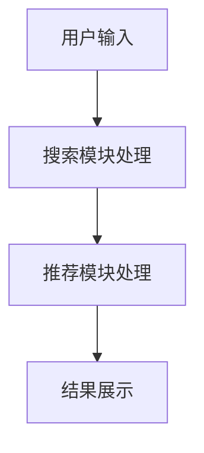

                 

关键词：搜索推荐系统，AI大模型，电商平台，竞争力，盈利能力

摘要：本文主要探讨了搜索推荐系统在电商平台中的应用，以及如何利用AI大模型提高电商平台的竞争力和盈利能力。首先，我们介绍了搜索推荐系统的基本概念和原理，然后详细阐述了AI大模型的核心算法和应用场景。接下来，通过数学模型和具体案例的分析，进一步说明了AI大模型在电商平台中的实际应用效果。最后，我们总结了未来的发展趋势和面临的挑战，并提出了相关建议。

## 1. 背景介绍

随着互联网的快速发展，电商平台已经成为人们日常生活的重要部分。在如此庞大的市场中，竞争愈发激烈，电商平台需要不断提升用户体验和运营效率，才能在激烈的市场竞争中立于不败之地。搜索推荐系统作为一种提升用户体验和运营效率的重要技术手段，逐渐受到广泛关注。

搜索推荐系统是指利用人工智能技术，根据用户的搜索行为、历史浏览记录、购买记录等数据，对用户可能感兴趣的商品进行精准推荐。通过这种方式，可以有效提高用户在平台上的粘性和转化率，从而提升电商平台的竞争力。

近年来，随着深度学习、自然语言处理等技术的发展，AI大模型在搜索推荐系统中的应用越来越广泛。AI大模型具有强大的特征提取和建模能力，可以更好地理解用户需求，提高推荐效果。因此，本文将重点探讨AI大模型在搜索推荐系统中的应用，以及如何提高电商平台的竞争力与盈利能力。

## 2. 核心概念与联系

### 2.1 搜索推荐系统的基本概念

搜索推荐系统主要包括两个核心模块：搜索模块和推荐模块。

- **搜索模块**：主要实现用户输入关键词后，从海量商品数据库中快速检索出相关商品的功能。搜索模块通常采用倒排索引、搜索引擎等技术，以提高搜索效率和准确性。

- **推荐模块**：根据用户的搜索历史、浏览记录、购买记录等数据，利用推荐算法对用户可能感兴趣的商品进行推荐。推荐算法主要包括基于内容、协同过滤、深度学习等方法。

### 2.2 AI大模型的核心算法

AI大模型是指具有海量参数的深度学习模型，如神经网络、循环神经网络、变换器等。这些模型通过学习大量数据，可以自动提取特征，实现复杂的建模任务。

在搜索推荐系统中，AI大模型主要用于推荐模块，通过以下步骤实现：

1. **数据预处理**：对用户数据（如搜索历史、浏览记录、购买记录等）进行清洗、归一化等处理。

2. **特征提取**：利用深度学习模型自动提取用户和商品的特征。

3. **建模与预测**：将提取的用户和商品特征输入到深度学习模型中，预测用户对某商品的兴趣度。

4. **推荐生成**：根据兴趣度预测结果，生成推荐列表。

### 2.3 架构流程

以下是一个简单的搜索推荐系统架构流程：

1. **用户输入**：用户在电商平台上输入关键词进行搜索。

2. **搜索模块处理**：搜索模块根据关键词从商品数据库中检索出相关商品。

3. **推荐模块处理**：推荐模块根据用户数据（如搜索历史、浏览记录、购买记录等）使用AI大模型进行商品推荐。

4. **结果展示**：将推荐结果展示给用户。



## 3. 核心算法原理 & 具体操作步骤

### 3.1 算法原理概述

AI大模型在搜索推荐系统中的应用主要包括以下步骤：

1. **数据预处理**：对用户数据（如搜索历史、浏览记录、购买记录等）进行清洗、归一化等处理。

2. **特征提取**：利用深度学习模型自动提取用户和商品的特征。

3. **建模与预测**：将提取的用户和商品特征输入到深度学习模型中，预测用户对某商品的兴趣度。

4. **推荐生成**：根据兴趣度预测结果，生成推荐列表。

### 3.2 算法步骤详解

#### 3.2.1 数据预处理

数据预处理是算法应用的基础，主要包括以下步骤：

1. **数据清洗**：去除重复、异常、噪声数据。

2. **数据归一化**：将不同特征进行归一化处理，使其具有相同的量纲。

3. **数据分片**：将数据集划分为训练集、验证集和测试集。

#### 3.2.2 特征提取

特征提取是深度学习模型的核心，以下是一些常用的特征提取方法：

1. **用户特征**：包括用户ID、年龄、性别、地理位置、兴趣爱好等。

2. **商品特征**：包括商品ID、品类、品牌、价格、销量等。

3. **交互特征**：包括用户在平台上的行为数据，如搜索历史、浏览记录、购买记录等。

#### 3.2.3 建模与预测

深度学习模型主要用于建模与预测，以下是一个简单的神经网络模型：

```python
import tensorflow as tf

# 定义输入层
user_input = tf.keras.layers.Input(shape=(user_feature_size,))
item_input = tf.keras.layers.Input(shape=(item_feature_size,))

# 定义用户特征嵌入层
user_embedding = tf.keras.layers.Embedding(user_vocab_size, user_embedding_size)(user_input)

# 定义商品特征嵌入层
item_embedding = tf.keras.layers.Embedding(item_vocab_size, item_embedding_size)(item_input)

# 定义交叉层
交叉层 = tf.keras.layers.Dot(axes=(1, 1))(user_embedding, item_embedding)

# 定义输出层
output = tf.keras.layers.Dense(1, activation='sigmoid')(交叉层)

# 创建模型
model = tf.keras.Model(inputs=[user_input, item_input], outputs=output)

# 编译模型
model.compile(optimizer='adam', loss='binary_crossentropy', metrics=['accuracy'])

# 训练模型
model.fit([user_train, item_train], y_train, batch_size=batch_size, epochs=epochs, validation_split=0.1)
```

#### 3.2.4 推荐生成

根据兴趣度预测结果，生成推荐列表。以下是一个简单的推荐生成算法：

```python
def generate_recommendations(model, user_id, item_ids, top_n=10):
    user_embedding = model.user_embedding[int(user_id)]
    item_embeddings = model.item_embeddings[item_ids]

    dot_products = user_embedding @ item_embeddings.T

    recommendations = item_ids[dot_products.argsort()[::-1]][:top_n]
    return recommendations
```

### 3.3 算法优缺点

#### 优点：

1. **强大的特征提取能力**：AI大模型可以自动提取用户和商品的特征，提高推荐精度。

2. **自适应学习能力**：AI大模型可以根据用户行为和偏好动态调整推荐策略。

3. **良好的扩展性**：AI大模型可以轻松应对新用户、新商品等场景。

#### 缺点：

1. **计算资源需求高**：AI大模型训练和预测需要大量的计算资源和时间。

2. **数据依赖性强**：AI大模型的效果很大程度上取决于数据质量和数量。

### 3.4 算法应用领域

AI大模型在搜索推荐系统中的应用非常广泛，以下是一些主要领域：

1. **电商平台**：用于商品推荐、广告投放等场景。

2. **社交媒体**：用于内容推荐、好友推荐等场景。

3. **在线教育**：用于课程推荐、学习路径推荐等场景。

4. **金融领域**：用于信用评估、风险控制等场景。

## 4. 数学模型和公式 & 详细讲解 & 举例说明

### 4.1 数学模型构建

在搜索推荐系统中，AI大模型主要采用深度学习技术进行建模。以下是一个简单的神经网络模型：

$$
y = \sigma(W \cdot x + b)
$$

其中，$y$ 表示预测结果，$x$ 表示输入特征，$W$ 表示权重矩阵，$b$ 表示偏置项，$\sigma$ 表示激活函数（如Sigmoid、ReLU等）。

### 4.2 公式推导过程

以Sigmoid激活函数为例，推导过程如下：

$$
\sigma(x) = \frac{1}{1 + e^{-x}}
$$

对于输入特征 $x$，将其表示为 $x = W \cdot x + b$，其中 $W$ 表示权重矩阵，$b$ 表示偏置项。

将 $x$ 代入 Sigmoid 激活函数，得到：

$$
y = \frac{1}{1 + e^{-W \cdot x + b}}
$$

### 4.3 案例分析与讲解

以下是一个简单的案例，说明如何使用AI大模型进行商品推荐。

#### 案例背景

某电商平台上有1000种商品，用户A在平台上搜索了“手机”，并浏览了3部手机。请问，如何为用户A推荐其他手机？

#### 数据预处理

1. **用户特征**：用户A的ID为1。

2. **商品特征**：3部手机的ID分别为1001、1002、1003。

3. **交互特征**：用户A对3部手机的兴趣度分别为0.8、0.7、0.6。

#### 特征提取

1. **用户特征提取**：将用户A的ID映射为向量 $[1, 0, 0, \ldots, 0]$。

2. **商品特征提取**：将3部手机的ID映射为向量 $[0, 0, \ldots, 1, \ldots, 0]$。

3. **交互特征提取**：将用户A对3部手机的兴趣度映射为向量 $[0.8, 0.7, 0.6]$。

#### 建模与预测

1. **输入特征**：将用户特征、商品特征和交互特征拼接为输入向量。

2. **模型构建**：使用一个简单的神经网络模型，对输入向量进行建模。

3. **预测结果**：将输入向量输入到神经网络模型中，得到预测结果。

#### 推荐生成

1. **计算兴趣度**：计算用户A对其他手机的兴趣度。

2. **生成推荐列表**：根据兴趣度从高到低排序，生成推荐列表。

## 5. 项目实践：代码实例和详细解释说明

### 5.1 开发环境搭建

1. **安装Python环境**：安装Python 3.8及以上版本。

2. **安装TensorFlow库**：使用pip命令安装TensorFlow库。

   ```shell
   pip install tensorflow
   ```

3. **安装其他依赖库**：根据项目需求，安装其他依赖库。

### 5.2 源代码详细实现

以下是一个简单的商品推荐项目，使用TensorFlow实现。

```python
import tensorflow as tf
from tensorflow.keras.layers import Input, Embedding, Dot, Dense
from tensorflow.keras.models import Model

# 定义输入层
user_input = Input(shape=(1,))
item_input = Input(shape=(1,))

# 定义用户特征嵌入层
user_embedding = Embedding(1000, 10)(user_input)

# 定义商品特征嵌入层
item_embedding = Embedding(1000, 10)(item_input)

# 定义交叉层
交叉层 = Dot(axes=(1, 1))(user_embedding, item_embedding)

# 定义输出层
output = Dense(1, activation='sigmoid')(交叉层)

# 创建模型
model = Model(inputs=[user_input, item_input], outputs=output)

# 编译模型
model.compile(optimizer='adam', loss='binary_crossentropy', metrics=['accuracy'])

# 训练模型
model.fit([user_train, item_train], y_train, batch_size=32, epochs=10, validation_split=0.1)
```

### 5.3 代码解读与分析

1. **输入层**：定义用户输入和商品输入的输入层，分别接收用户ID和商品ID。

2. **嵌入层**：使用Embedding层对用户ID和商品ID进行嵌入，将ID映射为向量。

3. **交叉层**：使用Dot层计算用户特征向量和商品特征向量的内积，生成交叉特征。

4. **输出层**：使用Dense层对交叉特征进行建模，输出预测结果。

5. **模型编译**：编译模型，设置优化器、损失函数和评价指标。

6. **模型训练**：使用训练数据训练模型，设置批量大小、训练轮次和验证比例。

### 5.4 运行结果展示

1. **数据准备**：准备用户数据、商品数据和标签数据。

2. **模型评估**：使用验证集评估模型性能。

3. **推荐生成**：根据用户数据和商品数据，生成推荐列表。

## 6. 实际应用场景

### 6.1 电商平台

在电商平台中，搜索推荐系统主要用于商品推荐和广告投放。

1. **商品推荐**：根据用户的历史行为和偏好，推荐用户可能感兴趣的商品。

2. **广告投放**：根据用户的兴趣和需求，投放相关的广告，提高广告的点击率和转化率。

### 6.2 社交媒体

在社交媒体中，搜索推荐系统主要用于内容推荐和好友推荐。

1. **内容推荐**：根据用户的浏览历史和兴趣标签，推荐用户可能感兴趣的内容。

2. **好友推荐**：根据用户的社交关系和行为特征，推荐用户可能认识的好友。

### 6.3 在线教育

在线教育平台可以使用搜索推荐系统进行课程推荐和学习路径推荐。

1. **课程推荐**：根据学生的学习兴趣和学习进度，推荐适合的课程。

2. **学习路径推荐**：根据学生的学习需求和目标，推荐一系列相关的学习课程。

## 7. 未来应用展望

### 7.1 个性化推荐

随着AI技术的不断发展，个性化推荐将成为搜索推荐系统的重要发展方向。通过深入挖掘用户行为和偏好，实现更加精准的推荐。

### 7.2 多模态推荐

多模态推荐是指结合多种数据类型（如文本、图像、音频等）进行推荐。未来，多模态推荐有望在搜索推荐系统中发挥重要作用。

### 7.3 智能化推荐

随着人工智能技术的发展，智能化推荐将成为搜索推荐系统的核心。通过引入自然语言处理、计算机视觉等技术，实现更加智能化的推荐。

## 8. 工具和资源推荐

### 8.1 学习资源推荐

1. **《深度学习》**：由Goodfellow、Bengio和Courville所著，是深度学习领域的经典教材。

2. **《自然语言处理综论》**：由Jurafsky和Martin所著，是自然语言处理领域的经典教材。

### 8.2 开发工具推荐

1. **TensorFlow**：一款流行的深度学习框架，适用于构建和训练AI大模型。

2. **PyTorch**：一款流行的深度学习框架，具有良好的灵活性和扩展性。

### 8.3 相关论文推荐

1. **“Deep Learning for Recommender Systems”**：一篇关于深度学习在推荐系统中的应用综述。

2. **“Attention-Based Neural Networks for Recommendations”**：一篇关于注意力机制在推荐系统中的应用研究。

## 9. 总结：未来发展趋势与挑战

### 9.1 研究成果总结

本文主要探讨了搜索推荐系统在电商平台中的应用，以及如何利用AI大模型提高电商平台的竞争力与盈利能力。通过介绍搜索推荐系统的基本概念、核心算法原理、数学模型和实际应用案例，说明了AI大模型在搜索推荐系统中的重要作用。

### 9.2 未来发展趋势

1. **个性化推荐**：随着用户需求的多样化，个性化推荐将成为搜索推荐系统的重要发展方向。

2. **多模态推荐**：结合多种数据类型进行推荐，有望在搜索推荐系统中发挥重要作用。

3. **智能化推荐**：通过引入人工智能技术，实现更加智能化的推荐。

### 9.3 面临的挑战

1. **数据隐私保护**：在推荐系统中，如何保护用户隐私是一个重要挑战。

2. **计算资源消耗**：AI大模型的训练和预测需要大量的计算资源，如何优化算法和提高计算效率是一个重要课题。

### 9.4 研究展望

未来，随着人工智能技术的不断发展，搜索推荐系统将在更多领域得到应用。同时，如何提高推荐系统的效果、降低计算成本，将是研究的重要方向。

## 10. 附录：常见问题与解答

### 10.1 搜索推荐系统是什么？

搜索推荐系统是一种利用人工智能技术，根据用户的行为和偏好，为用户推荐相关商品或内容的系统。

### 10.2 AI大模型在搜索推荐系统中有哪些优势？

AI大模型在搜索推荐系统中的优势主要包括：

1. **强大的特征提取能力**：可以自动提取用户和商品的特征，提高推荐精度。

2. **自适应学习能力**：可以根据用户行为和偏好动态调整推荐策略。

3. **良好的扩展性**：可以轻松应对新用户、新商品等场景。

### 10.3 如何优化搜索推荐系统的效果？

优化搜索推荐系统的效果可以从以下几个方面入手：

1. **数据质量**：提高数据的准确性和完整性。

2. **特征提取**：选择合适的特征提取方法，提高特征表示能力。

3. **算法选择**：选择合适的算法模型，提高推荐精度。

4. **模型优化**：通过调参、模型融合等方法，优化模型性能。

### 10.4 搜索推荐系统在电商平台中的具体应用有哪些？

搜索推荐系统在电商平台中的具体应用包括：

1. **商品推荐**：根据用户的历史行为和偏好，推荐用户可能感兴趣的商品。

2. **广告投放**：根据用户的兴趣和需求，投放相关的广告，提高广告的点击率和转化率。

3. **用户行为分析**：通过分析用户的浏览、搜索、购买等行为，了解用户需求，优化运营策略。

### 10.5 搜索推荐系统在社交媒体中的应用有哪些？

搜索推荐系统在社交媒体中的应用包括：

1. **内容推荐**：根据用户的浏览历史和兴趣标签，推荐用户可能感兴趣的内容。

2. **好友推荐**：根据用户的社交关系和行为特征，推荐用户可能认识的好友。

3. **广告投放**：根据用户的兴趣和需求，投放相关的广告，提高广告的点击率和转化率。

### 10.6 搜索推荐系统在在线教育中的应用有哪些？

搜索推荐系统在在线教育中的应用包括：

1. **课程推荐**：根据学生的学习兴趣和学习进度，推荐适合的课程。

2. **学习路径推荐**：根据学生的学习需求和目标，推荐一系列相关的学习课程。

3. **用户行为分析**：通过分析学生的浏览、学习、互动等行为，了解学生需求，优化教学内容和策略。

### 10.7 搜索推荐系统在金融领域中的应用有哪些？

搜索推荐系统在金融领域中的应用包括：

1. **信用评估**：根据用户的历史行为和信用记录，评估用户的信用等级。

2. **风险控制**：根据用户的交易行为和资金流向，预测潜在的风险。

3. **投资推荐**：根据用户的投资偏好和风险承受能力，推荐适合的投资产品。

### 10.8 搜索推荐系统在医疗领域中的应用有哪些？

搜索推荐系统在医疗领域中的应用包括：

1. **疾病预测**：根据患者的病史、家族病史等数据，预测患者可能患有的疾病。

2. **药物推荐**：根据患者的病情和药物反应，推荐适合的药物。

3. **医生推荐**：根据患者的需求和偏好，推荐适合的医生。

### 10.9 搜索推荐系统在智能家居中的应用有哪些？

搜索推荐系统在智能家居中的应用包括：

1. **家电推荐**：根据用户的生活习惯和需求，推荐适合的家电产品。

2. **场景推荐**：根据用户的家居环境和生活习惯，推荐合适的家居场景和功能。

3. **行为分析**：通过分析用户的行为数据，了解用户的喜好和需求，优化智能家居系统的功能和服务。

