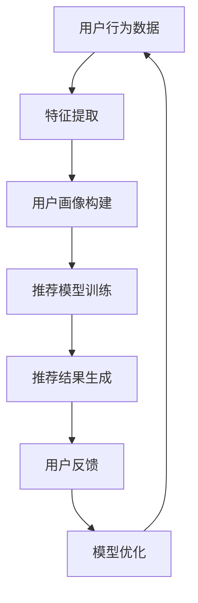

                 

关键词：搜索推荐系统，AI 大模型，电商平台，转化率，用户体验

> 摘要：随着互联网技术的飞速发展，电商平台日益普及，用户对个性化推荐的需求越来越高。本文将探讨如何通过AI 大模型技术，优化搜索推荐系统，从而提高电商平台的转化率和用户体验。文章将从核心概念、算法原理、数学模型、项目实践、实际应用场景以及未来展望等多个维度，深入解析搜索推荐系统的AI 大模型应用。

## 1. 背景介绍

在当今信息爆炸的时代，用户在海量数据中寻找所需信息变得愈发困难。传统推荐系统主要通过协同过滤、基于内容的推荐等方式，虽然在一定程度上提高了用户的满意度，但仍存在诸多局限性。随着深度学习技术的发展，AI 大模型逐渐成为搜索推荐系统的核心驱动力。大模型具有强大的学习能力，可以捕捉用户行为数据的深层特征，从而提供更精准的推荐结果。

电商平台作为互联网经济的核心，其盈利能力在很大程度上取决于用户的转化率和满意度。优化搜索推荐系统，提高转化率和用户体验，已经成为电商平台发展的关键。

## 2. 核心概念与联系

### 2.1 搜索推荐系统

搜索推荐系统是一种通过算法模型，将用户可能感兴趣的内容主动推荐给用户的系统。其核心在于通过分析用户的历史行为、兴趣标签、上下文信息等，构建用户画像，实现个性化推荐。

### 2.2 AI 大模型

AI 大模型是指具有大规模参数、能够处理海量数据的深度学习模型。其通过海量数据训练，可以自动提取复杂特征，实现对未知数据的预测和分类。

### 2.3 联系与作用

AI 大模型在搜索推荐系统中的应用，可以有效地提高推荐精度和效率。通过大模型，可以更好地捕捉用户的深层兴趣和行为特征，从而提供更加个性化的推荐结果。此外，大模型还可以自适应地调整推荐策略，提高用户体验和转化率。

### 2.4 Mermaid 流程图

以下是一个简化的搜索推荐系统与AI 大模型的联系流程图：



## 3. 核心算法原理 & 具体操作步骤

### 3.1 算法原理概述

搜索推荐系统中的AI 大模型主要基于深度学习技术，通过多层神经网络结构，实现对用户行为数据的自动特征提取和建模。其核心原理包括：

1. **输入层**：接收用户行为数据，如点击、购买、搜索等。
2. **隐藏层**：通过神经网络结构，对输入数据进行特征提取和转换。
3. **输出层**：生成推荐结果，如商品、内容等。

### 3.2 算法步骤详解

1. **数据预处理**：对原始用户行为数据进行清洗、归一化等处理，以便于模型训练。
2. **特征提取**：通过神经网络，将预处理后的数据转换为特征表示。
3. **模型训练**：使用训练数据集，对神经网络模型进行训练，调整模型参数。
4. **推荐生成**：将用户特征和商品特征输入模型，生成推荐结果。
5. **模型优化**：根据用户反馈，调整模型参数，优化推荐效果。

### 3.3 算法优缺点

**优点**：

1. **高精度**：通过深度学习技术，可以自动提取复杂特征，提高推荐精度。
2. **自适应调整**：可以根据用户反馈，动态调整推荐策略，提高用户体验。

**缺点**：

1. **计算资源消耗大**：训练大模型需要大量计算资源和时间。
2. **数据依赖性强**：推荐效果高度依赖用户数据的质量和数量。

### 3.4 算法应用领域

AI 大模型在搜索推荐系统中的应用广泛，包括但不限于：

1. **电商平台**：优化商品推荐，提高转化率和用户满意度。
2. **社交媒体**：优化内容推荐，提高用户活跃度和留存率。
3. **在线教育**：根据用户学习行为，提供个性化课程推荐。

## 4. 数学模型和公式 & 详细讲解 & 举例说明

### 4.1 数学模型构建

搜索推荐系统的AI 大模型主要基于深度学习技术，其数学模型可以表示为：

$$
Y = f(W \cdot X + b)
$$

其中，$Y$ 是输出层的结果，$X$ 是输入层的数据，$W$ 是权重矩阵，$b$ 是偏置项，$f$ 是激活函数。

### 4.2 公式推导过程

以卷积神经网络（CNN）为例，其基本推导过程如下：

1. **输入层**：

$$
X = [x_1, x_2, ..., x_n]
$$

2. **隐藏层**：

$$
H = \sigma(W \cdot X + b)
$$

其中，$\sigma$ 是激活函数，如ReLU函数。

3. **输出层**：

$$
Y = f(W \cdot H + b)
$$

### 4.3 案例分析与讲解

以电商平台商品推荐为例，假设用户历史行为数据为点击、购买和搜索记录，通过深度学习模型，可以将其转换为用户特征和商品特征。

1. **用户特征提取**：

$$
U = f(W_1 \cdot X + b_1)
$$

2. **商品特征提取**：

$$
P = f(W_2 \cdot X + b_2)
$$

3. **推荐结果生成**：

$$
R = \sigma(W_3 \cdot U \cdot P + b_3)
$$

通过上述公式，可以实现对用户商品推荐的有效计算。

## 5. 项目实践：代码实例和详细解释说明

### 5.1 开发环境搭建

在本节中，我们将使用Python和TensorFlow框架来实现一个简单的商品推荐系统。首先，确保安装以下依赖库：

```bash
pip install tensorflow numpy pandas sklearn
```

### 5.2 源代码详细实现

以下是一个简单的商品推荐系统实现代码：

```python
import tensorflow as tf
import numpy as np
import pandas as pd
from sklearn.model_selection import train_test_split

# 数据预处理
def preprocess_data(data):
    # 数据清洗、归一化等操作
    return data

# 模型构建
def build_model(input_dim, hidden_dim, output_dim):
    model = tf.keras.Sequential([
        tf.keras.layers.Dense(hidden_dim, activation='relu', input_shape=(input_dim,)),
        tf.keras.layers.Dense(output_dim, activation='sigmoid')
    ])
    model.compile(optimizer='adam', loss='binary_crossentropy', metrics=['accuracy'])
    return model

# 主函数
def main():
    # 加载数据
    data = pd.read_csv('user_item_data.csv')
    X = preprocess_data(data)
    y = data['label']

    # 划分训练集和测试集
    X_train, X_test, y_train, y_test = train_test_split(X, y, test_size=0.2, random_state=42)

    # 构建模型
    model = build_model(input_dim=X_train.shape[1], hidden_dim=64, output_dim=1)

    # 训练模型
    model.fit(X_train, y_train, epochs=10, batch_size=32, validation_data=(X_test, y_test))

    # 评估模型
    loss, accuracy = model.evaluate(X_test, y_test)
    print(f"Test accuracy: {accuracy}")

if __name__ == '__main__':
    main()
```

### 5.3 代码解读与分析

1. **数据预处理**：对用户行为数据进行清洗、归一化等处理。
2. **模型构建**：使用TensorFlow框架构建一个简单的卷积神经网络模型。
3. **训练模型**：使用训练数据集，对模型进行训练。
4. **评估模型**：使用测试数据集，评估模型性能。

### 5.4 运行结果展示

运行上述代码，可以得到商品推荐系统的评估结果。根据评估结果，可以进一步优化模型结构和参数，以提高推荐效果。

## 6. 实际应用场景

搜索推荐系统的AI 大模型技术，在电商、社交媒体、在线教育等多个领域具有广泛的应用。以下是一些实际应用场景：

1. **电商平台**：通过AI 大模型，实现精准商品推荐，提高用户转化率和满意度。
2. **社交媒体**：根据用户兴趣和行为，提供个性化内容推荐，提高用户活跃度和留存率。
3. **在线教育**：根据用户学习行为和知识背景，提供个性化课程推荐，提高学习效果。

## 7. 工具和资源推荐

### 7.1 学习资源推荐

1. **《深度学习》（Goodfellow, Bengio, Courville）**：介绍深度学习的基础理论和应用。
2. **《TensorFlow 实战：基于深度学习的技术实践》**：介绍TensorFlow框架的使用方法和实际应用案例。

### 7.2 开发工具推荐

1. **TensorFlow**：开源深度学习框架，适用于构建和训练AI 大模型。
2. **Jupyter Notebook**：适用于数据分析和模型调试的交互式开发环境。

### 7.3 相关论文推荐

1. **"Deep Learning for Recommender Systems"**：介绍深度学习在推荐系统中的应用。
2. **"User Interest Evolution and Its Application in Recommender Systems"**：探讨用户兴趣演化在推荐系统中的应用。

## 8. 总结：未来发展趋势与挑战

随着AI 大模型技术的不断发展，搜索推荐系统将在未来发挥更加重要的作用。然而，也面临着以下挑战：

1. **数据隐私**：如何在保证用户隐私的前提下，利用用户数据优化推荐效果。
2. **计算资源消耗**：训练大模型需要大量计算资源和时间，如何在有限资源下高效地训练模型。
3. **模型解释性**：如何提高模型的解释性，使其更加透明和可解释。

未来，搜索推荐系统与AI 大模型技术将不断创新，为各个领域提供更加智能和个性化的服务。

## 9. 附录：常见问题与解答

### 9.1 什么是搜索推荐系统？

搜索推荐系统是一种通过算法模型，将用户可能感兴趣的内容主动推荐给用户的系统。其核心在于通过分析用户的历史行为、兴趣标签、上下文信息等，构建用户画像，实现个性化推荐。

### 9.2 AI 大模型在搜索推荐系统中的作用是什么？

AI 大模型在搜索推荐系统中的作用主要体现在两个方面：一是通过深度学习技术，自动提取复杂特征，提高推荐精度；二是可以自适应地调整推荐策略，提高用户体验。

### 9.3 搜索推荐系统的AI 大模型如何实现个性化推荐？

搜索推荐系统的AI 大模型通过以下步骤实现个性化推荐：

1. **数据预处理**：对用户行为数据进行清洗、归一化等处理。
2. **特征提取**：通过神经网络，将预处理后的数据转换为特征表示。
3. **模型训练**：使用训练数据集，对神经网络模型进行训练。
4. **推荐生成**：将用户特征和商品特征输入模型，生成推荐结果。
5. **模型优化**：根据用户反馈，调整模型参数，优化推荐效果。

### 9.4 AI 大模型在搜索推荐系统中的优势有哪些？

AI 大模型在搜索推荐系统中的优势主要包括：

1. **高精度**：通过深度学习技术，可以自动提取复杂特征，提高推荐精度。
2. **自适应调整**：可以根据用户反馈，动态调整推荐策略，提高用户体验。
3. **广泛适用性**：可以在多个领域（如电商、社交媒体、在线教育等）应用，提供个性化服务。

### 9.5 AI 大模型在搜索推荐系统中面临的挑战有哪些？

AI 大模型在搜索推荐系统中面临的挑战主要包括：

1. **数据隐私**：如何在保证用户隐私的前提下，利用用户数据优化推荐效果。
2. **计算资源消耗**：训练大模型需要大量计算资源和时间，如何在有限资源下高效地训练模型。
3. **模型解释性**：如何提高模型的解释性，使其更加透明和可解释。

----------------------------------------------------------------
作者：禅与计算机程序设计艺术 / Zen and the Art of Computer Programming

