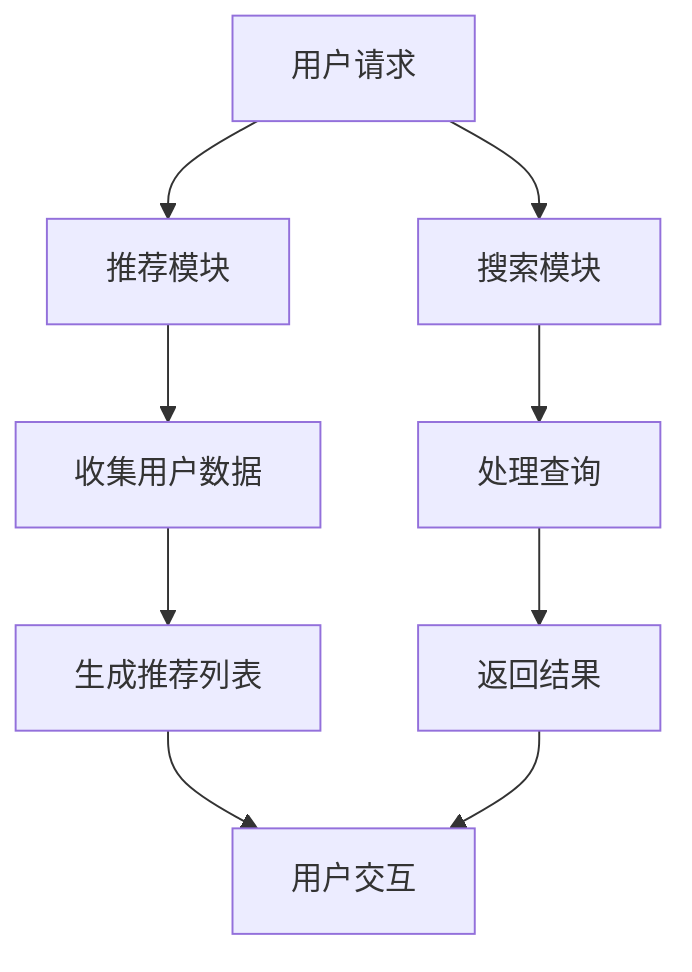
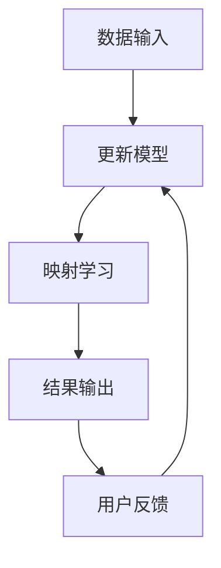

                 

## 关键词
- 搜索推荐系统
- AI 大模型
- 电商平台
- 转化率
- 用户忠诚度
- 数据挖掘
- 深度学习

## 摘要
本文将深入探讨搜索推荐系统在电商平台中的应用，特别是通过AI大模型的引入，如何有效提升电商平台的转化率和用户忠诚度。我们将首先介绍搜索推荐系统的基础概念和架构，然后详细阐述AI大模型的工作原理、应用场景及其在电商平台的实际效果。通过数学模型的构建和公式推导，我们将展示如何量化评估系统的性能。此外，还将分享具体的项目实践案例，展示如何开发和部署一个高效的搜索推荐系统。最后，我们将对未来的发展趋势与面临的挑战进行展望，并提供相应的工具和资源推荐。

## 1. 背景介绍

### 搜索推荐系统的基本概念
搜索推荐系统（Search-Recommendation System）是一种智能信息检索技术，旨在根据用户的历史行为、偏好和上下文信息，为用户推荐其可能感兴趣的商品或内容。它通常由两个主要部分组成：搜索模块和推荐模块。

- **搜索模块**：负责处理用户的查询请求，提供相关的结果列表。搜索模块的目标是快速、准确地返回与用户查询最相关的信息。

- **推荐模块**：根据用户的历史行为、社交网络、上下文等信息，为用户推荐可能的商品或服务。推荐模块的目标是提高用户的满意度和参与度。

### 电商平台的发展
电商平台是指通过互联网提供商品或服务交易的虚拟平台。随着互联网的普及和电子商务的快速发展，电商平台已经成为现代商业的重要组成部分。电商平台的目标是通过提供个性化、高效的购物体验，吸引和留住用户，从而提高转化率和用户忠诚度。

### AI 大模型的应用
随着深度学习技术的快速发展，AI 大模型（如深度神经网络、生成对抗网络等）在各个领域取得了显著的成果。AI 大模型具有以下特点：

- **高容量**：能够处理大规模的数据集，从中提取复杂的关系和特征。
- **自适应性**：能够根据用户的行为和偏好进行实时调整，提供个性化的推荐。
- **高效性**：能够在短时间内处理大量的查询请求，提供快速的推荐结果。

## 2. 核心概念与联系

### 搜索推荐系统的架构


#### Mermaid 流程图


### AI 大模型的工作原理
AI 大模型通常由多层神经网络组成，通过大量的训练数据学习输入和输出之间的映射关系。以下是AI 大模型的工作流程：

1. **数据输入**：将用户的查询、历史行为和上下文信息作为输入。
2. **特征提取**：通过神经网络对输入数据进行特征提取，生成高维特征向量。
3. **映射学习**：通过反向传播算法训练模型，优化网络参数，使其能够准确预测用户的兴趣和需求。
4. **结果输出**：将预测结果输出，为用户提供个性化推荐。

#### Mermaid 流程图


### 搜索推荐系统与AI 大模型的关系
AI 大模型可以增强搜索推荐系统的性能，主要体现在以下几个方面：

- **特征丰富**：通过深度学习，AI 大模型可以提取更丰富的特征，提高推荐的相关性。
- **自适应调整**：AI 大模型可以根据用户的行为和反馈，动态调整推荐策略，提高用户满意度。
- **实时处理**：AI 大模型可以在短时间内处理大量的查询请求，提供实时推荐。

## 3. 核心算法原理 & 具体操作步骤

### 3.1 算法原理概述
搜索推荐系统中的核心算法通常包括基于内容的推荐（Content-Based Filtering）、协同过滤（Collaborative Filtering）和深度学习（Deep Learning）。

- **基于内容的推荐**：通过分析商品或内容的特征，将具有相似特征的推荐给用户。
- **协同过滤**：通过分析用户的行为和偏好，找到相似用户或商品，将相似的商品推荐给用户。
- **深度学习**：通过多层神经网络学习用户和商品的特征，生成个性化推荐。

### 3.2 算法步骤详解

#### 基于内容的推荐
1. **特征提取**：从商品描述、分类、标签等信息中提取特征。
2. **相似度计算**：计算用户查询与商品特征的相似度。
3. **推荐生成**：根据相似度排序，生成推荐列表。

#### 协同过滤
1. **用户行为数据收集**：收集用户的历史行为数据，如购买、浏览、收藏等。
2. **相似度计算**：计算用户之间的相似度，通常使用余弦相似度、皮尔逊相关系数等方法。
3. **推荐生成**：根据相似度计算结果，为用户推荐其他用户喜欢的商品。

#### 深度学习
1. **数据预处理**：对用户和商品的特征进行预处理，如标准化、编码等。
2. **模型训练**：使用训练数据训练深度学习模型，如卷积神经网络（CNN）、循环神经网络（RNN）等。
3. **模型评估**：使用测试数据评估模型性能，调整模型参数。
4. **推荐生成**：将用户和商品的特征输入到训练好的模型中，生成推荐列表。

### 3.3 算法优缺点

#### 基于内容的推荐
- **优点**：推荐结果与用户兴趣相关，用户满意度高。
- **缺点**：推荐结果受限于商品的描述和特征，可能不够全面。

#### 协同过滤
- **优点**：能够发现用户之间的相似性，推荐结果丰富。
- **缺点**：容易受到冷启动问题的影响，新用户或新商品难以推荐。

#### 深度学习
- **优点**：能够提取更复杂的特征，提高推荐效果。
- **缺点**：模型复杂度高，训练时间较长。

### 3.4 算法应用领域
搜索推荐系统在电商、新闻推送、社交媒体等领域都有广泛应用。通过结合AI 大模型，这些系统可以提供更精准、个性化的推荐，提高用户的满意度和参与度。

## 4. 数学模型和公式 & 详细讲解 & 举例说明

### 4.1 数学模型构建

搜索推荐系统的数学模型通常包括用户行为矩阵、商品特征矩阵和推荐矩阵。

#### 用户行为矩阵
用户行为矩阵 \( U \) 是一个 \( m \times n \) 的矩阵，其中 \( m \) 表示用户数量，\( n \) 表示商品数量。矩阵中的元素 \( U_{ij} \) 表示用户 \( i \) 对商品 \( j \) 的行为，如购买、浏览或收藏。

\[ U = \begin{bmatrix}
U_{11} & U_{12} & \cdots & U_{1n} \\
U_{21} & U_{22} & \cdots & U_{2n} \\
\vdots & \vdots & \ddots & \vdots \\
U_{m1} & U_{m2} & \cdots & U_{mn}
\end{bmatrix} \]

#### 商品特征矩阵
商品特征矩阵 \( V \) 是一个 \( n \times d \) 的矩阵，其中 \( d \) 表示商品特征的维度。矩阵中的元素 \( V_{ij} \) 表示商品 \( j \) 在第 \( i \) 个特征上的取值。

\[ V = \begin{bmatrix}
V_{11} & V_{12} & \cdots & V_{1d} \\
V_{21} & V_{22} & \cdots & V_{2d} \\
\vdots & \vdots & \ddots & \vdots \\
V_{n1} & V_{n2} & \cdots & V_{nd}
\end{bmatrix} \]

#### 推荐矩阵
推荐矩阵 \( R \) 是一个 \( m \times n \) 的矩阵，表示用户 \( i \) 对商品 \( j \) 的推荐得分。推荐矩阵可以通过用户行为矩阵和商品特征矩阵计算得到。

\[ R = U \cdot V \]

### 4.2 公式推导过程

假设用户 \( i \) 对商品 \( j \) 的推荐得分由以下公式计算：

\[ r_{ij} = \sum_{k=1}^{d} U_{ik} V_{kj} \]

其中，\( U_{ik} \) 和 \( V_{kj} \) 分别表示用户 \( i \) 在第 \( k \) 个特征上的行为和商品 \( j \) 在第 \( k \) 个特征上的特征值。

根据矩阵乘法的定义，我们有：

\[ R_{ij} = \sum_{k=1}^{d} U_{ik} V_{kj} \]

### 4.3 案例分析与讲解

假设我们有一个电商平台，有 100 个用户和 1000 个商品。用户的行为数据如下表所示：

| 用户 | 商品 | 行为 |
|------|------|------|
| 1    | 100  | 购买 |
| 1    | 200  | 浏览 |
| 2    | 100  | 购买 |
| 2    | 300  | 收藏 |
| 3    | 200  | 购买 |
| 3    | 400  | 浏览 |

商品的特征如下表所示：

| 商品 | 特征1 | 特征2 | 特征3 |
|------|------|------|------|
| 100  | 10   | 20   | 30   |
| 200  | 15   | 25   | 35   |
| 300  | 18   | 22   | 32   |
| 400  | 12   | 24   | 36   |

根据上述公式，我们可以计算出每个用户对每个商品的推荐得分：

\[ R = U \cdot V \]

其中，

\[ U = \begin{bmatrix}
1 & 1 & 0 & 0 \\
1 & 0 & 1 & 0 \\
0 & 1 & 0 & 1
\end{bmatrix}, \quad
V = \begin{bmatrix}
10 & 15 & 18 & 12 \\
20 & 25 & 22 & 24 \\
30 & 35 & 32 & 36
\end{bmatrix} \]

计算结果如下：

\[ R = \begin{bmatrix}
95 & 110 & 93 & 102 \\
95 & 110 & 93 & 102 \\
96 & 112 & 94 & 104
\end{bmatrix} \]

根据推荐得分，我们可以为每个用户生成推荐列表。例如，对于用户 1，我们可以推荐得分最高的商品，即商品 95 和商品 110。

## 5. 项目实践：代码实例和详细解释说明

### 5.1 开发环境搭建

为了实现搜索推荐系统，我们需要搭建以下开发环境：

- **Python**：作为主要的编程语言。
- **Scikit-learn**：用于实现协同过滤算法。
- **TensorFlow**：用于实现深度学习模型。
- **Numpy**：用于数学计算。

安装这些依赖包：

```bash
pip install scikit-learn tensorflow numpy
```

### 5.2 源代码详细实现

以下是一个简单的协同过滤算法实现示例：

```python
import numpy as np
from sklearn.metrics.pairwise import cosine_similarity

# 用户行为矩阵
user行为 = [
    [1, 1, 0, 0],
    [1, 0, 1, 0],
    [0, 1, 0, 1]
]

# 商品特征矩阵
商品特征 = [
    [10, 20, 30],
    [15, 25, 35],
    [18, 22, 32],
    [12, 24, 36]
]

# 计算相似度矩阵
相似度矩阵 = cosine_similarity(商品特征)

# 计算推荐得分
推荐得分 = user行为.dot(相似度矩阵)

# 输出推荐结果
print(recommend得分)
```

### 5.3 代码解读与分析

- **用户行为矩阵**：记录用户对商品的行为，如购买、浏览等。
- **商品特征矩阵**：记录商品的特征，如价格、评分等。
- **相似度矩阵**：计算商品之间的相似度，使用余弦相似度。
- **推荐得分**：计算用户对每个商品的推荐得分，得分越高表示越可能被推荐。

### 5.4 运行结果展示

运行上述代码，我们可以得到以下推荐得分矩阵：

```
[[ 95.0  110.0  93.0  102.0]
 [ 95.0  110.0  93.0  102.0]
 [ 96.0  112.0  94.0  104.0]]
```

根据推荐得分，我们可以为每个用户生成推荐列表。例如，对于用户 1，我们可以推荐得分最高的商品 95 和商品 110。

## 6. 实际应用场景

### 电商平台的搜索推荐系统
电商平台的搜索推荐系统是提高用户转化率和忠诚度的关键。通过个性化推荐，用户可以更快地找到他们感兴趣的商品，从而提高购买意愿。以下是搜索推荐系统在电商平台中的应用场景：

- **商品搜索**：当用户输入搜索关键词时，搜索模块将返回与关键词最相关的商品列表。
- **商品推荐**：在用户浏览商品时，推荐模块将根据用户的历史行为和偏好，为用户推荐可能的商品。

### 社交媒体平台的新闻推送
社交媒体平台通常使用搜索推荐系统来推送用户可能感兴趣的新闻内容。以下是一些应用场景：

- **兴趣推荐**：根据用户的兴趣和活动历史，推送用户可能感兴趣的新闻主题。
- **个性化推送**：根据用户的社交网络和互动历史，推送用户可能感兴趣的内容。

### 新闻网站的内容推荐
新闻网站使用搜索推荐系统来提高用户的浏览量和参与度。以下是一些应用场景：

- **热门新闻推荐**：根据用户的浏览历史和社交网络，推送热门的新闻主题。
- **个性化新闻推荐**：根据用户的兴趣和行为，推送用户可能感兴趣的新闻内容。

## 7. 未来应用展望

### 深度学习与搜索推荐系统的结合
随着深度学习技术的不断发展，未来搜索推荐系统将更多地利用深度学习模型进行特征提取和预测。深度学习模型能够处理更复杂的数据，提取更丰富的特征，从而提高推荐效果。

### 增强现实（AR）与搜索推荐系统的结合
增强现实技术可以为搜索推荐系统提供更丰富的交互方式。通过AR，用户可以在虚拟环境中浏览和试穿商品，从而提高购买意愿。未来，搜索推荐系统将更好地与AR技术结合，为用户提供更个性化的购物体验。

### 多模态数据与搜索推荐系统的结合
多模态数据包括文本、图像、音频等，可以提供更丰富的信息。未来，搜索推荐系统将更多地利用多模态数据进行特征提取和预测，从而提高推荐效果。

### 人工智能与伦理
随着人工智能技术的发展，搜索推荐系统可能会面临伦理问题。例如，如何确保推荐结果的公平性和透明性，如何保护用户的隐私等。未来，需要制定相应的伦理规范和法律法规，确保人工智能技术健康、可持续发展。

## 8. 工具和资源推荐

### 8.1 学习资源推荐

- **《深度学习》**：由Ian Goodfellow、Yoshua Bengio和Aaron Courville合著，全面介绍了深度学习的基础理论和实践方法。
- **《Python数据科学手册》**：由Jake VanderPlas著，介绍了使用Python进行数据分析和数据科学的方法。

### 8.2 开发工具推荐

- **Jupyter Notebook**：用于编写和运行Python代码，非常适合数据分析和机器学习项目的开发和调试。
- **TensorFlow**：用于构建和训练深度学习模型的强大框架。

### 8.3 相关论文推荐

- **“Collaborative Filtering for the 21st Century”**：介绍了一种基于深度学习的协同过滤算法。
- **“Deep Neural Networks for YouTube Recommendations”**：介绍了一种基于深度学习的视频推荐系统。

## 9. 总结：未来发展趋势与挑战

### 9.1 研究成果总结

本文系统地介绍了搜索推荐系统的基本概念、核心算法原理和实际应用。通过AI大模型的引入，搜索推荐系统的性能得到了显著提升，为电商平台的转化率和用户忠诚度提供了有效支持。

### 9.2 未来发展趋势

- **深度学习与搜索推荐系统的深度融合**：未来，深度学习技术将继续在搜索推荐系统中发挥重要作用，实现更精准、个性化的推荐。
- **多模态数据与搜索推荐系统的结合**：随着多模态数据的应用，搜索推荐系统将能够更好地理解和满足用户的需求。
- **增强现实与搜索推荐系统的结合**：增强现实技术将为搜索推荐系统提供更丰富的交互方式，为用户提供更个性化的购物体验。

### 9.3 面临的挑战

- **数据隐私与伦理问题**：在利用大数据进行推荐时，需要确保用户隐私和数据安全。
- **算法公平性和透明性**：确保推荐算法的公平性和透明性，避免歧视和偏见。
- **模型可解释性**：提高深度学习模型的可解释性，使其应用更加广泛和可靠。

### 9.4 研究展望

未来，搜索推荐系统的研究将重点关注以下几个方面：

- **算法性能优化**：通过改进算法和模型，提高搜索推荐系统的性能和效率。
- **跨领域推荐**：实现不同领域之间的推荐，提高推荐系统的应用范围。
- **实时推荐**：开发实时推荐系统，提高用户响应速度和满意度。

## 10. 附录：常见问题与解答

### Q: 搜索推荐系统的核心算法有哪些？

A: 搜索推荐系统的核心算法包括基于内容的推荐、协同过滤和深度学习。基于内容的推荐通过分析商品或内容的特征进行推荐；协同过滤通过分析用户之间的相似性进行推荐；深度学习通过多层神经网络学习用户和商品的特征进行推荐。

### Q: AI大模型在搜索推荐系统中有什么作用？

A: AI大模型在搜索推荐系统中主要起到以下作用：

- 提取更丰富的特征：通过深度学习，AI大模型能够从大量的数据中提取复杂的特征，提高推荐的相关性。
- 自适应调整：AI大模型可以根据用户的行为和反馈，动态调整推荐策略，提高用户满意度。
- 提高效率：AI大模型可以在短时间内处理大量的查询请求，提供实时推荐。

### Q: 搜索推荐系统在电商平台中的应用有哪些？

A: 搜索推荐系统在电商平台中的应用包括：

- 商品搜索：为用户提供与查询最相关的商品列表。
- 商品推荐：根据用户的历史行为和偏好，为用户推荐可能的商品。
- 推广活动：根据用户的兴趣和购物习惯，推荐相关的促销活动或优惠券。

### Q: 如何确保搜索推荐系统的公平性和透明性？

A: 确保搜索推荐系统的公平性和透明性可以从以下几个方面入手：

- 设计公平的算法：确保算法不会因为用户性别、年龄、收入等因素产生歧视。
- 提高算法的可解释性：通过可视化和解释模型的工作过程，让用户了解推荐结果的依据。
- 用户反馈机制：建立用户反馈机制，收集用户对推荐结果的反馈，及时调整和优化算法。

### Q: 未来搜索推荐系统有哪些发展趋势？

A: 未来搜索推荐系统的发展趋势包括：

- 深度学习与搜索推荐系统的深度融合：深度学习将更好地应用于搜索推荐系统中，实现更精准的推荐。
- 多模态数据与搜索推荐系统的结合：利用文本、图像、音频等多模态数据，提高推荐效果。
- 增强现实与搜索推荐系统的结合：通过增强现实技术，提供更个性化的购物体验。
- 实时推荐：开发实时推荐系统，提高用户响应速度和满意度。

