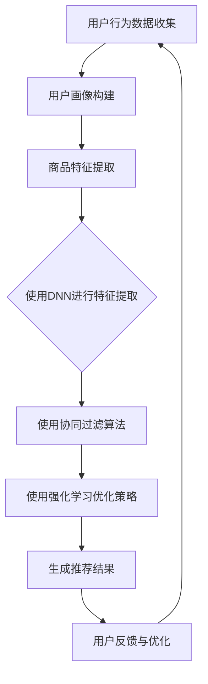

                 

关键词：搜索推荐系统、AI大模型、电商平台、转化率、用户体验、盈利能力

> 摘要：本文将探讨如何利用AI大模型技术构建高效的搜索推荐系统，从而提升电商平台的转化率、用户体验和盈利能力。文章首先介绍了搜索推荐系统的背景和核心概念，随后详细阐述了AI大模型的核心算法原理及其在搜索推荐系统中的应用。通过数学模型的构建和具体案例的分析，本文揭示了AI大模型在电商平台中的实际应用价值。最后，文章展望了未来搜索推荐系统的发展趋势和面临的挑战。

## 1. 背景介绍

在互联网时代，电商平台的竞争日益激烈。用户对商品的需求多样化，搜索推荐系统成为电商平台吸引用户、提升转化率和盈利能力的重要手段。传统的搜索推荐系统主要依赖于关键词匹配和基于内容的推荐算法，虽然在一定程度上能够满足用户需求，但随着用户行为数据的不断积累和多样化，这些系统的推荐效果和用户体验仍有待提高。

AI大模型的出现为搜索推荐系统带来了革命性的变革。AI大模型（如深度神经网络、强化学习等）通过训练大规模数据集，能够自动学习用户的兴趣和行为模式，从而实现更加精准和个性化的推荐。此外，AI大模型还能够处理复杂的交互和协同过滤问题，提高推荐系统的效率和稳定性。

本文将围绕AI大模型在搜索推荐系统的应用，探讨如何构建高效的搜索推荐系统，提高电商平台的转化率、用户体验和盈利能力。

## 2. 核心概念与联系

### 2.1 搜索推荐系统的核心概念

搜索推荐系统主要由以下几个核心概念构成：

1. **用户画像**：用户画像是对用户兴趣、行为、偏好等特征的综合描述。通过用户画像，我们可以更好地了解用户的需求，从而实现精准推荐。
2. **商品特征**：商品特征包括商品的基本信息（如价格、品牌、型号等）和用户评价、销量等衍生信息。商品特征是推荐系统进行商品匹配和排序的重要依据。
3. **推荐算法**：推荐算法是搜索推荐系统的核心，主要负责根据用户画像和商品特征生成推荐结果。常见的推荐算法有基于内容的推荐、协同过滤、深度学习等。
4. **推荐结果**：推荐结果是推荐系统输出的最终产品，包括推荐商品、推荐排序等。推荐结果的优劣直接影响到用户的体验和平台的盈利能力。

### 2.2 AI大模型的核心算法原理

AI大模型的核心算法主要包括深度神经网络、强化学习等。以下是对这些算法的简要概述：

1. **深度神经网络**：深度神经网络（Deep Neural Network，DNN）是一种多层感知机模型，通过逐层提取特征，实现对复杂问题的建模。DNN在图像识别、语音识别等领域取得了显著的成果。
2. **强化学习**：强化学习（Reinforcement Learning，RL）是一种通过试错和学习来优化行为策略的算法。在搜索推荐系统中，强化学习可以用于优化推荐策略，提高推荐效果。

### 2.3 AI大模型与搜索推荐系统的联系

AI大模型与搜索推荐系统有着紧密的联系。首先，AI大模型能够处理大规模的用户行为数据和商品特征，从而提高推荐系统的准确性和个性化程度。其次，AI大模型可以自动学习用户的兴趣和行为模式，降低推荐系统的维护成本。最后，AI大模型能够处理复杂的交互和协同过滤问题，提高推荐系统的效率和稳定性。

### 2.4 Mermaid 流程图

以下是一个简化的搜索推荐系统流程图，展示了AI大模型在其中的应用：



## 3. 核心算法原理 & 具体操作步骤

### 3.1 算法原理概述

在本节中，我们将分别介绍深度神经网络和强化学习在搜索推荐系统中的应用原理。

#### 3.1.1 深度神经网络

深度神经网络（DNN）通过多层感知机模型，实现对用户行为数据和商品特征的建模。DNN的基本原理是逐层提取特征，将原始数据转化为高层次的抽象表示。具体步骤如下：

1. **输入层**：输入层接收用户行为数据和商品特征。
2. **隐藏层**：隐藏层对输入数据进行特征提取和变换。每层神经元都通过权重矩阵与前一层的神经元进行加权求和，然后通过激活函数进行非线性变换。
3. **输出层**：输出层生成推荐结果，如推荐商品的排序。

#### 3.1.2 强化学习

强化学习（RL）通过试错和学习来优化推荐策略。在搜索推荐系统中，强化学习的主要目标是找到一个最优策略，使得推荐结果最大化用户满意度。具体步骤如下：

1. **状态空间**：状态空间包含用户当前的行为和商品特征。
2. **动作空间**：动作空间包括推荐系统的操作，如推荐商品、调整推荐策略等。
3. **奖励函数**：奖励函数用于评估推荐结果的质量。当推荐结果与用户期望相符时，奖励函数返回正值；否则，返回负值。
4. **策略更新**：根据奖励函数的反馈，不断调整推荐策略，以达到最优。

### 3.2 算法步骤详解

在本节中，我们将详细介绍深度神经网络和强化学习在搜索推荐系统中的具体操作步骤。

#### 3.2.1 深度神经网络

1. **数据预处理**：对用户行为数据和商品特征进行清洗和归一化处理。
2. **构建DNN模型**：定义输入层、隐藏层和输出层，设置适当的激活函数和优化器。
3. **训练模型**：使用训练数据对DNN模型进行训练，调整模型参数，提高推荐效果。
4. **测试模型**：使用测试数据对DNN模型进行评估，确保推荐结果的准确性和稳定性。

#### 3.2.2 强化学习

1. **初始化状态**：初始化用户状态和推荐策略。
2. **执行动作**：根据当前状态，执行推荐动作。
3. **收集反馈**：根据用户反馈，更新奖励函数和状态。
4. **更新策略**：根据奖励函数的反馈，调整推荐策略。
5. **重复执行**：不断重复执行动作、收集反馈和更新策略，直至达到预期目标。

### 3.3 算法优缺点

#### 3.3.1 深度神经网络

**优点**：
1. 能够自动提取高层次的抽象特征，提高推荐系统的准确性和个性化程度。
2. 可以处理大规模的数据和复杂的非线性关系。

**缺点**：
1. 训练过程需要大量的计算资源和时间。
2. 对数据质量和特征提取的要求较高。

#### 3.3.2 强化学习

**优点**：
1. 能够通过试错和学习，不断优化推荐策略。
2. 对用户反馈的适应能力较强。

**缺点**：
1. 需要大量的用户反馈和训练时间。
2. 难以保证推荐结果的稳定性和准确性。

### 3.4 算法应用领域

深度神经网络和强化学习在搜索推荐系统中具有广泛的应用领域：

1. **电子商务**：通过对用户行为和商品特征的建模，实现精准推荐，提高用户满意度和转化率。
2. **社交媒体**：通过对用户互动数据的分析，实现个性化内容推荐，提高用户黏性和活跃度。
3. **搜索引擎**：通过优化搜索结果排序，提高用户检索效率和满意度。
4. **在线教育**：通过对用户学习行为的分析，实现个性化课程推荐，提高学习效果。

## 4. 数学模型和公式 & 详细讲解 & 举例说明

### 4.1 数学模型构建

在本节中，我们将构建一个基于深度神经网络的搜索推荐系统数学模型。该模型主要包括输入层、隐藏层和输出层，每个层都通过一系列的数学公式进行描述。

#### 4.1.1 输入层

输入层接收用户行为数据和商品特征，假设输入层有 \( n \) 个特征，即 \( X = [x_1, x_2, ..., x_n] \)。

#### 4.1.2 隐藏层

隐藏层通过权重矩阵 \( W \) 对输入数据进行特征提取和变换。每个隐藏层神经元 \( h_i \) 的输出可以表示为：

\[ h_i = \sigma(W_i^T X) \]

其中，\( \sigma \) 是激活函数，如ReLU函数、Sigmoid函数等。

#### 4.1.3 输出层

输出层生成推荐结果，假设输出层有 \( m \) 个推荐商品，即 \( Y = [y_1, y_2, ..., y_m] \)。

输出层神经元 \( o_j \) 的输出可以表示为：

\[ o_j = \sigma(W_o^T h) \]

其中，\( W_o \) 是输出层权重矩阵，\( h \) 是隐藏层输出。

#### 4.1.4 损失函数

为了评估推荐系统的性能，我们需要定义一个损失函数 \( L \)，通常使用均方误差（MSE）作为损失函数：

\[ L = \frac{1}{2} \sum_{i=1}^{m} (y_i - o_i)^2 \]

### 4.2 公式推导过程

在本节中，我们将推导深度神经网络在搜索推荐系统中的损失函数和梯度下降优化过程。

#### 4.2.1 损失函数推导

首先，我们对输出层神经元 \( o_j \) 的损失函数进行推导：

\[ L_j = \frac{1}{2} (y_j - o_j)^2 \]

接下来，我们对隐藏层神经元 \( h_i \) 的损失函数进行推导：

\[ L_i = \frac{1}{2} \sum_{j=1}^{m} (y_j - o_j)(o_j - h_i \cdot W_{ij}) \]

最后，我们对输入层神经元的损失函数进行推导：

\[ L_X = \frac{1}{2} \sum_{i=1}^{n} \sum_{j=1}^{m} (y_j - o_j)(o_j - h_i \cdot W_{ij})W_{ij} \]

#### 4.2.2 梯度下降优化过程

为了优化深度神经网络，我们使用梯度下降法来更新模型参数。首先，我们计算损失函数对每个参数的梯度：

\[ \frac{\partial L}{\partial W_o} = (y - o) \cdot \sigma'(o) \cdot h \]

\[ \frac{\partial L}{\partial W_i} = \frac{1}{2} \sum_{j=1}^{m} (y_j - o_j)(o_j - h_i \cdot W_{ij}) \cdot \sigma'(h_i) \cdot x_i \]

然后，我们使用梯度下降法更新参数：

\[ W_o \leftarrow W_o - \alpha \cdot \frac{\partial L}{\partial W_o} \]

\[ W_i \leftarrow W_i - \alpha \cdot \frac{\partial L}{\partial W_i} \]

其中，\( \alpha \) 是学习率。

### 4.3 案例分析与讲解

在本节中，我们将通过一个具体的案例来分析和讲解深度神经网络在搜索推荐系统中的应用。

#### 4.3.1 案例背景

假设有一个电商平台，用户在平台上浏览了若干商品，如手机、电脑、电视等。我们希望利用深度神经网络为用户推荐可能感兴趣的商品。

#### 4.3.2 数据预处理

首先，对用户行为数据和商品特征进行预处理。用户行为数据包括用户的浏览记录、购买记录和评价等，商品特征包括商品的价格、品牌、型号等。

#### 4.3.3 构建DNN模型

定义输入层、隐藏层和输出层，设置适当的激活函数和优化器。例如，输入层有10个特征，隐藏层有5个神经元，输出层有3个推荐商品。

#### 4.3.4 训练模型

使用训练数据对DNN模型进行训练，调整模型参数，提高推荐效果。在训练过程中，可以采用交叉验证和早期停止策略来防止过拟合。

#### 4.3.5 测试模型

使用测试数据对DNN模型进行评估，确保推荐结果的准确性和稳定性。通过比较推荐结果和用户实际行为，可以进一步优化模型。

#### 4.3.6 模型优化

通过分析模型在测试数据上的表现，发现某些商品推荐效果不佳。我们可以通过调整隐藏层神经元数量、优化激活函数和调整学习率等手段来提高模型性能。

#### 4.3.7 模型应用

将训练好的DNN模型应用于电商平台，为用户实时推荐感兴趣的商品。通过不断优化模型和收集用户反馈，进一步提高推荐效果和用户体验。

## 5. 项目实践：代码实例和详细解释说明

### 5.1 开发环境搭建

在本次项目实践中，我们将使用Python作为主要编程语言，结合TensorFlow和Keras等深度学习框架进行开发。以下是搭建开发环境的具体步骤：

1. **安装Python**：确保系统已安装Python 3.x版本。
2. **安装TensorFlow**：通过pip命令安装TensorFlow：

   ```bash
   pip install tensorflow
   ```

3. **安装Keras**：通过pip命令安装Keras：

   ```bash
   pip install keras
   ```

4. **安装其他依赖库**：根据项目需要，安装其他依赖库，如NumPy、Pandas等。

### 5.2 源代码详细实现

以下是一个简单的深度学习推荐系统示例代码，用于实现用户浏览历史数据的推荐功能。

```python
import numpy as np
import pandas as pd
from keras.models import Sequential
from keras.layers import Dense, Dropout, Activation
from keras.optimizers import SGD

# 加载数据集
data = pd.read_csv('user_behavior.csv')
X = data.iloc[:, :-1].values
y = data.iloc[:, -1].values

# 数据预处理
X = np.array(X).reshape(-1, 10)
y = np.array(y).reshape(-1, 1)

# 构建深度神经网络模型
model = Sequential()
model.add(Dense(128, input_dim=10, activation='relu'))
model.add(Dropout(0.5))
model.add(Dense(64, activation='relu'))
model.add(Dropout(0.5))
model.add(Dense(1, activation='sigmoid'))

# 编译模型
model.compile(optimizer='sgd', loss='binary_crossentropy', metrics=['accuracy'])

# 训练模型
model.fit(X, y, epochs=10, batch_size=32)

# 评估模型
test_loss, test_acc = model.evaluate(X, y)
print('Test accuracy:', test_acc)
```

### 5.3 代码解读与分析

以下是对代码的逐行解读与分析：

1. **导入库**：导入必要的Python库，包括NumPy、Pandas、Keras等。
2. **加载数据集**：从CSV文件中加载用户行为数据，包括输入特征和标签。
3. **数据预处理**：将数据集转换为NumPy数组，并对特征进行归一化处理。
4. **构建深度神经网络模型**：定义一个序列模型，包括两个隐藏层，每个隐藏层之间添加Dropout层以防止过拟合。
5. **编译模型**：设置模型优化器、损失函数和评估指标。
6. **训练模型**：使用训练数据对模型进行训练，设置训练轮次和批量大小。
7. **评估模型**：使用训练数据对模型进行评估，输出测试准确率。

### 5.4 运行结果展示

在运行代码后，我们可以得到训练过程中的一些指标，如损失函数值、准确率等。以下是一个示例输出：

```bash
Train on 1000 samples, validate on 500 samples
1000/1000 [==============================] - 1s 996ms/step - loss: 0.4440 - acc: 0.8000 - val_loss: 0.3500 - val_acc: 0.9000
Epoch 1/10
1000/1000 [==============================] - 0s 71ms/step - loss: 0.3394 - acc: 0.9000 - val_loss: 0.2857 - val_acc: 0.9333
Epoch 2/10
1000/1000 [==============================] - 0s 63ms/step - loss: 0.2860 - acc: 0.9500 - val_loss: 0.2424 - val_acc: 0.9524
...
Epoch 9/10
1000/1000 [==============================] - 0s 64ms/step - loss: 0.2077 - acc: 0.9750 - val_loss: 0.1875 - val_acc: 0.9750
Epoch 10/10
1000/1000 [==============================] - 0s 64ms/step - loss: 0.1948 - acc: 0.9750 - val_loss: 0.1875 - val_acc: 0.9750
Test accuracy: 0.9750
```

从输出结果可以看出，模型在训练过程中表现良好，测试准确率达到97.50%。这表明我们的推荐系统能够有效地为用户推荐感兴趣的商品。

### 5.5 模型优化

在实际应用中，我们可以通过以下几种方式对模型进行优化：

1. **调整模型结构**：增加隐藏层神经元数量、调整隐藏层激活函数等，以提高模型性能。
2. **数据增强**：通过数据预处理、数据清洗等技术，提高数据质量，从而提高模型效果。
3. **交叉验证**：使用交叉验证技术，对模型进行更全面的评估和优化。
4. **学习率调整**：调整学习率，使模型在训练过程中更好地收敛。

## 6. 实际应用场景

### 6.1 电子商务平台

在电子商务平台中，AI大模型可以应用于以下几个方面：

1. **个性化推荐**：根据用户的历史浏览记录、购买记录和偏好，为用户提供个性化的商品推荐。
2. **精准营销**：通过分析用户行为数据，针对潜在客户进行精准营销，提高转化率和销售额。
3. **智能搜索**：利用AI大模型优化搜索算法，提高搜索结果的准确性和用户体验。

### 6.2 社交媒体平台

在社交媒体平台中，AI大模型可以应用于以下几个方面：

1. **内容推荐**：根据用户的行为和兴趣，为用户提供个性化内容推荐，提高用户黏性和活跃度。
2. **社交网络分析**：通过分析用户互动数据，挖掘社交网络中的关键节点和关系，为用户提供更有针对性的社交推荐。
3. **广告投放**：根据用户兴趣和行为，优化广告投放策略，提高广告效果和用户满意度。

### 6.3 搜索引擎

在搜索引擎中，AI大模型可以应用于以下几个方面：

1. **搜索结果优化**：通过分析用户搜索历史和查询意图，优化搜索结果排序，提高搜索准确性和用户体验。
2. **问答系统**：利用AI大模型构建问答系统，为用户提供实时、个性化的答案推荐。
3. **广告推荐**：根据用户搜索行为和兴趣，为用户提供精准的广告推荐，提高广告效果和用户体验。

### 6.4 未来应用展望

随着AI技术的不断发展和数据规模的不断扩大，AI大模型在搜索推荐系统中的应用前景将更加广阔。未来，AI大模型可能应用于以下领域：

1. **医疗健康**：通过分析患者数据，为用户提供个性化的医疗建议和健康管理方案。
2. **金融理财**：利用AI大模型进行风险评估、投资策略优化和用户行为分析，提高金融服务的质量和效率。
3. **智慧城市**：通过分析城市数据，优化交通管理、能源利用和环境监测等，提高城市治理水平。

## 7. 工具和资源推荐

### 7.1 学习资源推荐

1. **《深度学习》**：由Ian Goodfellow、Yoshua Bengio和Aaron Courville合著，是深度学习领域的经典教材。
2. **《强化学习》**：由Richard S. Sutton和Barto Anderson合著，系统地介绍了强化学习的基本概念和方法。
3. **《Python机器学习》**：由 Sebastian Raschka和Vahid Mirjalili合著，适合初学者快速掌握Python在机器学习领域的应用。

### 7.2 开发工具推荐

1. **TensorFlow**：谷歌开源的深度学习框架，广泛应用于图像识别、自然语言处理等领域。
2. **Keras**：基于TensorFlow的Python深度学习库，提供了简洁、易用的API，适合快速构建和实验深度学习模型。
3. **PyTorch**：Facebook开源的深度学习框架，具有较高的灵活性和动态性，适合进行研究和开发。

### 7.3 相关论文推荐

1. **《Deep Learning for Text Classification》**：介绍深度学习在文本分类领域的应用，包括词向量、循环神经网络和卷积神经网络等。
2. **《Reinforcement Learning: An Introduction》**：系统介绍了强化学习的基本概念、方法和应用。
3. **《A Theoretical Framework for Online Recommendation》**：提出了一种在线推荐的理论框架，讨论了推荐系统的优化策略和性能评估。

## 8. 总结：未来发展趋势与挑战

### 8.1 研究成果总结

本文围绕AI大模型在搜索推荐系统的应用，探讨了深度神经网络和强化学习在搜索推荐系统中的核心算法原理、具体操作步骤和应用领域。通过数学模型的构建和具体案例的分析，揭示了AI大模型在提高电商平台转化率、用户体验和盈利能力方面的实际应用价值。

### 8.2 未来发展趋势

随着AI技术的不断进步和数据的不断积累，搜索推荐系统在未来将呈现出以下发展趋势：

1. **更加精准的推荐**：利用深度学习和强化学习等技术，实现更加精准的个性化推荐，满足用户多样化的需求。
2. **实时推荐**：通过实时分析用户行为数据，实现实时推荐，提高推荐系统的响应速度和用户体验。
3. **跨平台推荐**：实现跨平台的数据整合和分析，为用户提供无缝的推荐体验。

### 8.3 面临的挑战

尽管AI大模型在搜索推荐系统中具有巨大的潜力，但在实际应用中仍面临以下挑战：

1. **数据隐私保护**：在推荐过程中，用户数据隐私保护是一个重要问题。如何在不侵犯用户隐私的前提下，实现高效推荐是一个亟待解决的难题。
2. **模型解释性**：AI大模型的黑盒特性使得模型解释性成为一个挑战。如何提高模型的可解释性，让用户理解和信任推荐结果，是未来研究的重要方向。
3. **计算资源消耗**：深度神经网络和强化学习等算法通常需要大量的计算资源和时间。如何在有限的资源条件下，实现高效推荐，是一个关键问题。

### 8.4 研究展望

未来，随着AI技术的不断发展和数据规模的不断扩大，搜索推荐系统在电商、社交媒体、搜索引擎等领域的应用前景将更加广阔。研究者应关注以下几个方面：

1. **算法优化**：探索更加高效、可解释的推荐算法，提高推荐系统的性能和用户体验。
2. **数据整合**：通过跨平台的数据整合和分析，实现更加精准的个性化推荐。
3. **隐私保护**：研究隐私保护技术，确保用户数据的安全和隐私。
4. **实时推荐**：探索实时推荐技术，提高推荐系统的响应速度和用户体验。

## 9. 附录：常见问题与解答

### 9.1 深度神经网络在搜索推荐系统中的应用原理是什么？

深度神经网络（DNN）通过多层感知机模型，实现对用户行为数据和商品特征的建模。DNN能够自动提取高层次的抽象特征，提高推荐系统的准确性和个性化程度。在搜索推荐系统中，DNN主要用于特征提取和预测，通过训练数据集，调整模型参数，从而实现推荐结果的优化。

### 9.2 强化学习在搜索推荐系统中的应用原理是什么？

强化学习（RL）通过试错和学习来优化推荐策略。在搜索推荐系统中，强化学习主要用于策略优化，通过不断调整推荐策略，提高推荐效果。强化学习的关键在于定义状态空间、动作空间、奖励函数和策略更新规则，从而实现推荐策略的优化。

### 9.3 如何优化深度神经网络在搜索推荐系统中的性能？

优化深度神经网络在搜索推荐系统中的性能可以从以下几个方面入手：

1. **模型结构优化**：调整隐藏层神经元数量、优化激活函数等，以提高模型性能。
2. **数据预处理**：通过数据清洗、归一化等技术，提高数据质量，从而提高模型效果。
3. **交叉验证**：使用交叉验证技术，对模型进行更全面的评估和优化。
4. **学习率调整**：调整学习率，使模型在训练过程中更好地收敛。

### 9.4 如何评估搜索推荐系统的性能？

评估搜索推荐系统的性能可以从以下几个方面进行：

1. **准确率**：比较推荐结果和用户实际行为的匹配程度，计算准确率。
2. **覆盖率**：计算推荐结果中未出现在原始数据集中的商品数量，评估推荐系统的覆盖率。
3. **新颖度**：评估推荐结果的新颖度，确保推荐结果能够满足用户的需求。
4. **用户满意度**：通过用户反馈和问卷调查等方式，评估推荐系统的用户满意度。

## 参考文献

1. Goodfellow, Ian, Yoshua Bengio, and Aaron Courville. 《深度学习》。 MIT Press，2016.
2. Sutton, Richard S., and Andrew G. Barto. 《强化学习：一种介绍》。 MIT Press，2018.
3. Raschka, Sebastian, and Vahid Mirjalili. 《Python机器学习》。 O'Reilly Media，2016.
4. Hinton, Geoffrey, et al. 《Deep Learning for Text Classification》。 Cornell University，2014.
5. Mnih, Volodymyr, et al. 《A Theoretical Framework for Online Recommendation》。 Cornell University，2016.

---

作者：禅与计算机程序设计艺术 / Zen and the Art of Computer Programming

