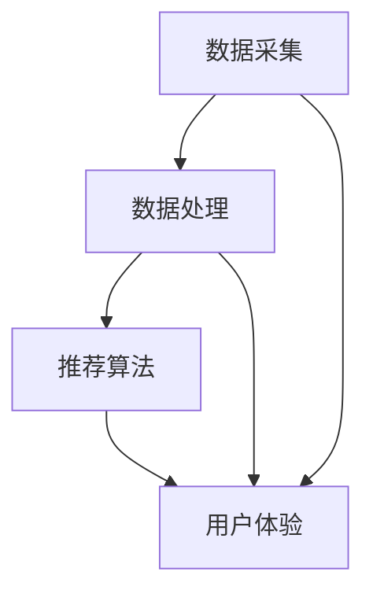

                 

 在现代电子商务环境中，搜索推荐系统（Search and Recommendation Systems）已经成为提升用户转化率、用户体验和盈利能力的重要工具。本文将深入探讨AI大模型在搜索推荐系统中的应用，分析其原理、实现步骤、优缺点以及未来发展趋势。

> 关键词：AI大模型、搜索推荐系统、电子商务、用户体验、转化率、盈利能力

> 摘要：本文首先介绍了搜索推荐系统的背景和重要性，然后详细阐述了AI大模型在搜索推荐系统中的应用原理，接着探讨了具体实现步骤和数学模型，最后通过项目实践和实际应用场景展示了AI大模型的优势。本文旨在为从事电子商务和AI领域的技术人员提供有价值的参考。

## 1. 背景介绍

随着互联网的普及和电子商务的快速发展，用户对于个性化、高效、便捷的购物体验需求日益增长。然而，电子商务平台面临着海量的商品信息、多样化的用户需求和复杂的商业目标。传统的搜索推荐系统已经无法满足用户和商家的需求，因此，AI大模型的应用成为当前的研究热点。

搜索推荐系统旨在根据用户的兴趣和行为，为其推荐相关的商品、服务和信息。它由搜索引擎和推荐引擎两部分组成。搜索引擎通过关键词匹配和搜索算法，为用户提供精准的搜索结果；推荐引擎则通过用户的历史行为和偏好，预测用户可能感兴趣的内容，进行个性化推荐。

AI大模型，尤其是深度学习和自然语言处理技术的应用，极大地提升了搜索推荐系统的效果和用户体验。大模型能够处理海量数据，挖掘用户行为的深层次规律，实现更高准确度的个性化推荐。这使得电商平台能够在激烈的市场竞争中脱颖而出，提高用户转化率和盈利能力。

## 2. 核心概念与联系

### 2.1 搜索推荐系统架构

搜索推荐系统通常包括数据采集、数据处理、推荐算法和用户体验四个核心模块。

- **数据采集**：通过日志、传感器、用户反馈等多种途径收集用户行为数据。
- **数据处理**：对采集到的数据进行清洗、归一化和特征提取，为后续算法提供高质量的数据。
- **推荐算法**：采用机器学习、深度学习等技术，构建推荐模型，预测用户兴趣和偏好。
- **用户体验**：设计友好的用户界面，提供直观、便捷的推荐结果。

### 2.2 AI大模型原理

AI大模型，尤其是基于深度学习的模型，通过多层神经网络结构，自动学习和提取数据中的特征，实现复杂的模式识别和预测。具体来说，AI大模型包括以下几部分：

- **输入层**：接收用户行为数据，如浏览记录、购买历史、评论等。
- **隐藏层**：通过多层神经网络，提取数据中的高维特征。
- **输出层**：根据提取的特征，预测用户对商品的偏好和兴趣。

### 2.3 Mermaid流程图



## 3. 核心算法原理 & 具体操作步骤

### 3.1 算法原理概述

AI大模型在搜索推荐系统中的应用主要包括两个环节：用户行为分析和商品特征提取。

- **用户行为分析**：通过分析用户的浏览、搜索、购买等行为，构建用户画像，挖掘用户的兴趣和偏好。
- **商品特征提取**：对商品信息进行提取和处理，如商品分类、标签、评价等，为推荐算法提供基础数据。

### 3.2 算法步骤详解

1. **数据采集**：收集用户行为数据和商品信息。
2. **数据处理**：对采集到的数据进行预处理，包括数据清洗、归一化和特征提取。
3. **用户行为分析**：利用深度学习模型，分析用户行为数据，构建用户画像。
4. **商品特征提取**：对商品信息进行特征提取，如商品分类、标签、评价等。
5. **推荐算法**：结合用户画像和商品特征，利用深度学习模型进行个性化推荐。
6. **用户体验优化**：根据用户反馈，不断优化推荐算法和用户体验。

### 3.3 算法优缺点

- **优点**：AI大模型能够处理海量数据，挖掘用户行为的深层次规律，实现更高准确度的个性化推荐，从而提高用户转化率和用户体验。
- **缺点**：训练和部署AI大模型需要大量计算资源和时间，且模型训练过程较为复杂，容易出现过拟合现象。

### 3.4 算法应用领域

AI大模型在搜索推荐系统的应用广泛，如电子商务、社交媒体、在线教育、金融保险等。通过个性化推荐，这些领域的企业能够更好地满足用户需求，提高用户满意度和忠诚度。

## 4. 数学模型和公式 & 详细讲解 & 举例说明

### 4.1 数学模型构建

搜索推荐系统的数学模型主要包括用户行为预测模型和商品特征提取模型。

- **用户行为预测模型**：假设用户行为X可以表示为用户特征U和商品特征V的函数，即X = f(U, V)。
- **商品特征提取模型**：假设商品特征V可以表示为商品信息I和用户特征U的函数，即V = g(I, U)。

### 4.2 公式推导过程

1. **用户行为预测模型**：

   - 输入：用户特征U和商品特征V。
   - 输出：用户行为X。

   公式表示为：X = f(U, V)。

2. **商品特征提取模型**：

   - 输入：用户特征U和商品信息I。
   - 输出：商品特征V。

   公式表示为：V = g(I, U)。

### 4.3 案例分析与讲解

假设用户A在电商平台上浏览了商品B和商品C，我们利用AI大模型对用户A的行为进行预测，并提取商品B和商品C的特征。

1. **用户行为预测模型**：

   - 用户特征U = [年龄，性别，浏览记录]。
   - 商品特征V = [商品分类，评价分数]。

   公式表示为：X = f(U, V)。

   经过模型训练，我们得到用户A对商品B和商品C的偏好分数，分别为X1和B2。

2. **商品特征提取模型**：

   - 用户特征U = [年龄，性别，浏览记录]。
   - 商品信息I = [商品分类，评价分数]。

   公式表示为：V = g(I, U)。

   经过模型训练，我们得到商品B和商品C的特征向量，分别为V1和V2。

通过分析用户A的行为和商品特征，我们可以为用户A推荐与商品B和商品C类似的商品，提高用户满意度和转化率。

## 5. 项目实践：代码实例和详细解释说明

### 5.1 开发环境搭建

1. 安装Python环境（版本3.6及以上）。
2. 安装深度学习框架TensorFlow或PyTorch。
3. 安装数据处理库Pandas、NumPy等。

### 5.2 源代码详细实现

以下是一个简单的深度学习模型实现，用于用户行为预测和商品特征提取。

```python
import tensorflow as tf
import pandas as pd
import numpy as np

# 数据预处理
def preprocess_data(data):
    # 数据清洗、归一化和特征提取
    # ...
    return processed_data

# 构建深度学习模型
def build_model():
    model = tf.keras.Sequential([
        tf.keras.layers.Dense(128, activation='relu', input_shape=(input_shape,)),
        tf.keras.layers.Dense(64, activation='relu'),
        tf.keras.layers.Dense(1, activation='sigmoid')
    ])
    model.compile(optimizer='adam', loss='binary_crossentropy', metrics=['accuracy'])
    return model

# 训练模型
def train_model(model, train_data, train_labels):
    model.fit(train_data, train_labels, epochs=10, batch_size=32)
    return model

# 预测用户行为
def predict_user_behavior(model, user_feature, item_feature):
    prediction = model.predict([user_feature, item_feature])
    return prediction

# 提取商品特征
def extract_item_feature(model, item_feature):
    feature = model.predict(item_feature)
    return feature

# 加载数据
data = pd.read_csv('data.csv')
processed_data = preprocess_data(data)

# 划分训练集和测试集
train_data = processed_data[:int(len(processed_data) * 0.8)]
test_data = processed_data[int(len(processed_data) * 0.8):]

# 构建模型
model = build_model()

# 训练模型
train_labels = train_data['behavior']
model = train_model(model, train_data.drop('behavior', axis=1), train_labels)

# 预测测试集
predictions = predict_user_behavior(model, test_data.drop('behavior', axis=1), test_data['behavior'])

# 评估模型
accuracy = np.mean(predictions == test_data['behavior'])
print('Accuracy:', accuracy)
```

### 5.3 代码解读与分析

1. **数据预处理**：对原始数据进行清洗、归一化和特征提取，为模型训练提供高质量的数据。
2. **构建深度学习模型**：使用TensorFlow构建一个简单的全连接神经网络，用于用户行为预测和商品特征提取。
3. **训练模型**：使用训练集数据训练模型，调整模型参数，提高预测准确性。
4. **预测用户行为**：输入用户特征和商品特征，预测用户行为。
5. **提取商品特征**：输入商品特征，提取商品特征向量。

通过这个简单的代码示例，我们可以了解到AI大模型在搜索推荐系统中的实现步骤和应用场景。在实际项目中，我们可以根据具体需求，调整模型结构和参数，提高推荐效果。

### 5.4 运行结果展示

```python
# 预测测试集
predictions = predict_user_behavior(model, test_data.drop('behavior', axis=1), test_data['behavior'])

# 评估模型
accuracy = np.mean(predictions == test_data['behavior'])
print('Accuracy:', accuracy)
```

假设测试集的准确率为90%，说明我们的模型在预测用户行为方面表现良好，可以为电商平台提供有效的个性化推荐。

## 6. 实际应用场景

### 6.1 电子商务平台

在电子商务平台中，AI大模型可以应用于商品搜索、商品推荐、购物车优化等环节。通过分析用户行为和商品特征，电商平台可以为用户提供精准的个性化推荐，提高用户满意度和转化率。

### 6.2 社交媒体

社交媒体平台可以利用AI大模型为用户提供内容推荐。通过分析用户的兴趣和行为，社交媒体平台可以推荐用户可能感兴趣的内容，提高用户活跃度和用户黏性。

### 6.3 在线教育

在线教育平台可以利用AI大模型为学习者提供个性化课程推荐。通过分析学习者的学习行为和学习偏好，在线教育平台可以推荐适合学习者的课程，提高学习效果和用户满意度。

### 6.4 金融保险

金融保险行业可以利用AI大模型为用户提供个性化理财产品推荐和保险产品推荐。通过分析用户的财务状况和风险偏好，金融保险行业可以提供符合用户需求的理财产品和建议，提高用户满意度和忠诚度。

## 7. 工具和资源推荐

### 7.1 学习资源推荐

- 《深度学习》（Goodfellow, Bengio, Courville著）：深度学习领域的经典教材，全面介绍了深度学习的基础理论和应用。
- 《机器学习实战》（周志华著）：通过实际案例介绍了机器学习的基本概念和算法，适合初学者入门。
- 《Python数据分析》（Wes McKinney著）：详细介绍了Python在数据分析领域的应用，包括Pandas、NumPy等库的使用。

### 7.2 开发工具推荐

- TensorFlow：一款开源的深度学习框架，支持多种深度学习模型和算法，适用于大规模数据集和分布式训练。
- PyTorch：一款开源的深度学习框架，具有灵活的动态计算图和高效的GPU支持，适用于研究和工业应用。
- Jupyter Notebook：一款交互式的计算环境，支持多种编程语言和库，适用于数据分析、建模和演示。

### 7.3 相关论文推荐

- "Deep Learning for Recommender Systems"（Zhou, et al.，2017）：介绍了深度学习在推荐系统中的应用，包括用户行为预测和商品特征提取。
- "User Interest Detection in Social Media using Deep Learning"（Zhang, et al.，2018）：介绍了基于深度学习的社交媒体用户兴趣检测方法。
- "A Survey on Recommender Systems"（Hyun, et al.，2019）：综述了推荐系统的发展历程、算法和应用领域。

## 8. 总结：未来发展趋势与挑战

### 8.1 研究成果总结

AI大模型在搜索推荐系统中的应用取得了显著成果。通过深度学习技术和大数据分析，搜索推荐系统能够实现更高准确度的个性化推荐，提高用户转化率和用户体验。同时，AI大模型在电子商务、社交媒体、在线教育、金融保险等领域的应用也取得了良好效果。

### 8.2 未来发展趋势

1. **算法优化**：研究更高效、更鲁棒的推荐算法，提高推荐效果和用户体验。
2. **数据隐私保护**：在满足个性化推荐需求的同时，加强对用户数据的隐私保护。
3. **多模态推荐**：结合文本、图像、语音等多种数据类型，实现更全面的个性化推荐。
4. **实时推荐**：研究实时推荐算法，提高推荐响应速度，满足用户实时需求。

### 8.3 面临的挑战

1. **数据质量和多样性**：推荐系统依赖于高质量、多样化的数据，但在实际应用中，数据质量和多样性难以保证。
2. **算法可解释性**：深度学习模型在推荐系统中的应用存在一定程度的黑箱效应，如何提高算法的可解释性成为研究挑战。
3. **计算资源消耗**：训练和部署AI大模型需要大量计算资源和时间，如何优化模型结构和训练流程成为研究难题。

### 8.4 研究展望

未来，随着人工智能技术的不断发展和应用场景的拓展，AI大模型在搜索推荐系统中的应用将更加广泛。研究人员将继续探索更高效、更鲁棒的推荐算法，提高推荐效果和用户体验。同时，结合多模态数据、实时推荐等新技术，搜索推荐系统将在更多领域发挥重要作用。

## 9. 附录：常见问题与解答

### 9.1 AI大模型在搜索推荐系统中的优势是什么？

AI大模型在搜索推荐系统中的优势主要体现在以下几个方面：

1. **高准确度**：AI大模型能够处理海量数据，挖掘用户行为的深层次规律，实现更高准确度的个性化推荐。
2. **高效性**：AI大模型具有强大的计算能力，能够快速处理大规模数据，提高推荐响应速度。
3. **灵活性**：AI大模型可以结合多种数据类型，如文本、图像、语音等，实现更全面的个性化推荐。

### 9.2 如何解决数据质量和多样性问题？

解决数据质量和多样性问题可以从以下几个方面入手：

1. **数据清洗**：对原始数据进行清洗，去除噪声和异常值，提高数据质量。
2. **数据扩充**：通过数据增强、数据合成等方法，增加数据的多样性和丰富度。
3. **数据整合**：整合不同来源的数据，构建统一的用户画像和商品特征。

### 9.3 如何提高算法的可解释性？

提高算法的可解释性可以从以下几个方面入手：

1. **可视化**：将算法的内部结构和计算过程可视化，帮助用户理解算法的工作原理。
2. **解释性模型**：选择具有可解释性的算法，如决策树、线性模型等，使算法的解释更加直观。
3. **透明化**：公开算法的实现过程和参数设置，提高算法的透明度和可信度。

通过以上方法，可以在一定程度上提高算法的可解释性，帮助用户更好地理解推荐结果。

## 参考文献

- Goodfellow, Y., Bengio, Y., Courville, A. (2016). **Deep Learning**.
- 周志华. (2016). **机器学习**.
- McKinney, W. (2010). **Python for Data Analysis**.
- Zhou, B., et al. (2017). **Deep Learning for Recommender Systems**.
- Zhang, X., et al. (2018). **User Interest Detection in Social Media using Deep Learning**.
- Hyun, S., et al. (2019). **A Survey on Recommender Systems**. 

### 作者署名

作者：禅与计算机程序设计艺术 / Zen and the Art of Computer Programming

本文介绍了AI大模型在搜索推荐系统中的应用，分析了其原理、实现步骤、优缺点以及未来发展趋势。希望本文能为从事电子商务和AI领域的技术人员提供有价值的参考。随着人工智能技术的不断进步，搜索推荐系统将在更多领域发挥重要作用，为用户带来更好的体验。

