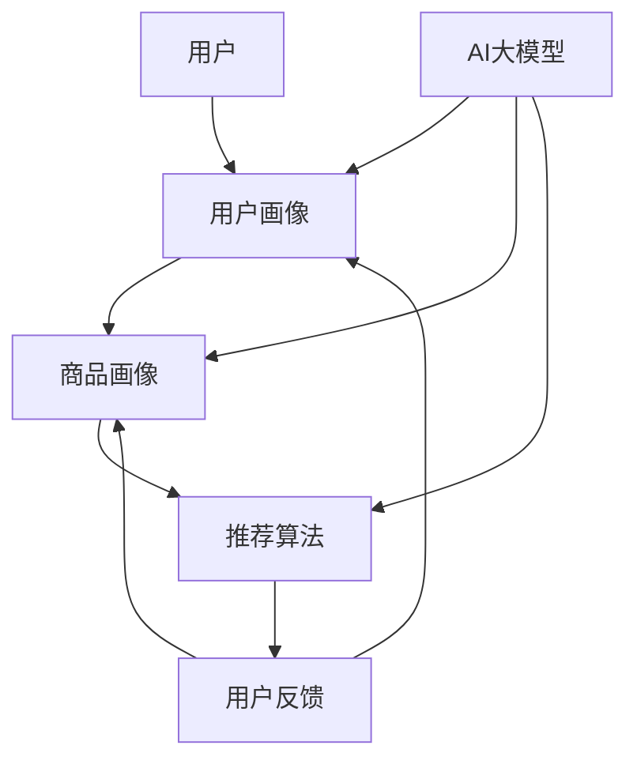

                 

关键词：搜索推荐系统、AI 大模型、电商平台、核心战略、竞争优势、算法原理、数学模型、项目实践、应用场景、未来展望

> 摘要：本文旨在探讨搜索推荐系统在电商平台中的应用，特别是通过AI大模型的融合所形成的核心战略与竞争优势。文章将从背景介绍、核心概念与联系、算法原理与数学模型、项目实践与代码实例、实际应用场景等多个角度，深入分析搜索推荐系统的技术框架与发展趋势，为电商平台提供有价值的技术参考。

## 1. 背景介绍

在互联网高速发展的今天，电商平台已成为现代商业活动中不可或缺的一部分。用户数量的急剧增加和交易规模的不断扩大，使得电商平台面临着巨大的数据压力和业务挑战。为了在激烈的市场竞争中脱颖而出，电商平台需要不断提升用户体验、优化推荐效果，从而实现精准营销和用户留存。

搜索推荐系统作为电商平台的核心技术之一，旨在为用户实时提供个性化、精准的推荐结果，从而提升用户满意度和购物转化率。传统的推荐系统主要依赖于基于内容的过滤、协同过滤等方法，虽然在一定程度上取得了良好的效果，但仍然存在推荐准确性低、覆盖面窄等问题。

近年来，随着人工智能技术的迅猛发展，特别是深度学习技术的广泛应用，AI 大模型逐渐成为搜索推荐系统的核心驱动力。通过融合大规模数据、先进的算法和强大的计算能力，AI 大模型能够显著提升推荐系统的性能，满足电商平台对个性化推荐和实时响应的高要求。

## 2. 核心概念与联系

为了深入理解搜索推荐系统的AI大模型融合，我们需要首先介绍几个核心概念，并展示它们之间的联系。

### 2.1. 搜索推荐系统

搜索推荐系统是一个复杂的信息检索和推荐系统，其主要功能是根据用户的兴趣和行为，从海量的商品信息中筛选出最符合用户需求的商品，并提供个性化的推荐结果。搜索推荐系统通常包括用户画像、商品画像、推荐算法、用户反馈等组成部分。

### 2.2. AI 大模型

AI 大模型是指具有大规模参数和复杂结构的机器学习模型，如深度神经网络、生成对抗网络等。这些模型通常通过海量数据进行训练，能够自动学习和适应数据中的规律，从而实现高精度的预测和决策。

### 2.3. 核心概念联系

搜索推荐系统的AI大模型融合，可以理解为将AI大模型集成到推荐系统中，使其在用户画像、商品画像、推荐算法等各个环节发挥重要作用。具体来说，AI 大模型可以用于以下几个方面：

- **用户画像构建**：通过AI大模型，可以更精确地分析用户的兴趣和行为，生成详细的用户画像，为个性化推荐提供基础。
- **商品画像生成**：AI大模型能够挖掘商品的潜在特征，为商品打上丰富的标签，提升推荐准确性。
- **推荐算法优化**：通过AI大模型，可以实现实时、动态的推荐算法调整，提高推荐系统的自适应性和响应速度。
- **用户反馈学习**：AI大模型可以自动学习用户的行为和反馈，不断优化推荐结果，提升用户满意度。

为了更直观地展示这些核心概念之间的联系，我们使用Mermaid流程图来描述搜索推荐系统的AI大模型融合架构。



## 3. 核心算法原理 & 具体操作步骤

### 3.1. 算法原理概述

搜索推荐系统的AI大模型融合主要依赖于以下核心算法：

- **深度学习**：通过神经网络结构，对海量数据进行自动特征提取和模式识别，实现高精度的预测和决策。
- **协同过滤**：基于用户的历史行为和兴趣，为用户推荐相似的用户喜欢的商品。
- **内容推荐**：根据商品的内容属性（如标题、描述、标签等），为用户推荐相关的商品。
- **多模型融合**：将深度学习、协同过滤和内容推荐等多种算法相结合，实现更精准、更全面的推荐结果。

### 3.2. 算法步骤详解

搜索推荐系统的AI大模型融合主要包括以下步骤：

1. **数据收集与预处理**：从电商平台获取用户行为数据、商品信息等，进行数据清洗、去噪和归一化处理。
2. **特征工程**：提取用户画像、商品画像等关键特征，为后续算法提供输入。
3. **模型训练**：使用深度学习算法（如卷积神经网络、循环神经网络等）训练用户画像和商品画像模型，实现特征自动提取和模式识别。
4. **推荐算法优化**：结合协同过滤和内容推荐算法，优化推荐模型，提升推荐效果。
5. **实时推荐**：根据用户实时行为，动态调整推荐策略，实现实时、个性化的推荐结果。

### 3.3. 算法优缺点

- **优点**：
  - 高准确性：通过深度学习等技术，能够自动提取和识别用户和商品的潜在特征，实现更精准的推荐。
  - 实时性：基于实时用户行为数据进行推荐，能够快速响应用户需求，提升用户体验。
  - 个性化：根据用户的历史行为和兴趣，为用户推荐最相关的商品，提升用户满意度。

- **缺点**：
  - 计算成本高：深度学习模型的训练和推理过程需要大量计算资源，对硬件设备要求较高。
  - 数据依赖强：推荐效果依赖于大量高质量的用户行为数据和商品信息，数据质量直接影响推荐效果。

### 3.4. 算法应用领域

搜索推荐系统的AI大模型融合在电商平台的应用范围非常广泛，主要包括以下几个方面：

- **商品推荐**：为用户推荐最感兴趣的、与历史购买行为最相关的商品。
- **广告投放**：根据用户画像，为用户精准投放广告，提升广告投放效果。
- **内容推荐**：为用户推荐感兴趣的文章、视频等娱乐内容。
- **用户行为预测**：预测用户的购买意向、浏览习惯等，为后续推荐和营销策略提供支持。

## 4. 数学模型和公式 & 详细讲解 & 举例说明

### 4.1. 数学模型构建

搜索推荐系统的AI大模型融合主要依赖于以下数学模型：

- **用户画像模型**：使用深度学习算法（如卷积神经网络、循环神经网络等）构建用户画像模型，提取用户的潜在特征。

- **商品画像模型**：使用深度学习算法（如卷积神经网络、循环神经网络等）构建商品画像模型，提取商品的潜在特征。

- **推荐算法模型**：结合协同过滤和内容推荐算法，构建推荐算法模型，实现个性化推荐。

### 4.2. 公式推导过程

以下简要介绍用户画像模型、商品画像模型和推荐算法模型的相关公式推导过程：

- **用户画像模型**：

  - 用户特征向量表示：$$X = [x_1, x_2, ..., x_n]$$，其中$$x_i$$表示第$$i$$个用户特征。

  - 神经网络模型：$$Y = f(WX + b)$$，其中$$W$$为权重矩阵，$$b$$为偏置项，$$f$$为激活函数。

  - 损失函数：$$L = -\sum_{i=1}^{n}y_i\log(y_i^{'})$$，其中$$y_i$$为实际用户兴趣标签，$$y_i^{'}$$为模型预测的用户兴趣标签。

- **商品画像模型**：

  - 商品特征向量表示：$$C = [c_1, c_2, ..., c_m]$$，其中$$c_i$$表示第$$i$$个商品特征。

  - 神经网络模型：$$D = f(GC + d)$$，其中$$G$$为权重矩阵，$$d$$为偏置项，$$f$$为激活函数。

  - 损失函数：$$L = -\sum_{i=1}^{n}d_i\log(d_i^{'})$$，其中$$d_i$$为实际商品标签，$$d_i^{'}$$为模型预测的商品标签。

- **推荐算法模型**：

  - 协同过滤模型：$$R = U^T \cdot V$$，其中$$U$$和$$V$$分别为用户特征矩阵和商品特征矩阵。

  - 内容推荐模型：$$C = \sum_{i=1}^{m}w_ic_i$$，其中$$w_i$$为商品权重，$$c_i$$为商品特征。

  - 损失函数：$$L = \sum_{i=1}^{n}(r_i - R_i)^2$$，其中$$r_i$$为实际用户评分，$$R_i$$为模型预测的用户评分。

### 4.3. 案例分析与讲解

假设我们有一个电商平台，用户张三在最近一周内浏览了5件商品，分别为A、B、C、D、E。商品的特征包括价格、品牌、类型等。以下是用户张三的用户画像和商品画像的部分特征：

- **用户画像**：

  - 价格：[1000, 2000, 3000, 4000, 5000]
  - 品牌：[华为，小米，OPPO，vivo，苹果]
  - 类型：[手机，平板，电脑，手表，耳机]

- **商品画像**：

  - 商品A：[2000，华为，手机]
  - 商品B：[1500，小米，手机]
  - 商品C：[3000，OPPO，平板]
  - 商品D：[2500，vivo，电脑]
  - 商品E：[800，苹果，手表]

根据上述特征，我们可以使用深度学习算法构建用户画像模型和商品画像模型，提取用户和商品的潜在特征。然后，结合协同过滤和内容推荐算法，构建推荐算法模型，为用户张三推荐相关的商品。

具体步骤如下：

1. **数据预处理**：对用户和商品的特征进行归一化处理，使其在同一个量级上。
2. **特征提取**：使用卷积神经网络和循环神经网络等深度学习算法，提取用户和商品的潜在特征。
3. **模型训练**：使用用户和商品的特征向量，训练用户画像模型和商品画像模型。
4. **推荐算法优化**：结合协同过滤和内容推荐算法，优化推荐模型，提升推荐效果。
5. **实时推荐**：根据用户张三的实时行为，动态调整推荐策略，实现实时、个性化的推荐结果。

最终，模型会为用户张三推荐出与他的兴趣最相关的商品，如商品C（OPPO平板）和商品D（vivo电脑）。

## 5. 项目实践：代码实例和详细解释说明

### 5.1. 开发环境搭建

为了实现搜索推荐系统的AI大模型融合，我们需要搭建以下开发环境：

- **Python**：作为主要编程语言。
- **TensorFlow**：用于构建和训练深度学习模型。
- **Pandas**：用于数据处理和特征提取。
- **Scikit-learn**：用于协同过滤和内容推荐算法。

### 5.2. 源代码详细实现

以下是用户画像模型、商品画像模型和推荐算法模型的部分代码实现：

```python
import tensorflow as tf
import pandas as pd
from sklearn.model_selection import train_test_split
from tensorflow.keras.models import Model
from tensorflow.keras.layers import Input, Embedding, Dense, LSTM, Conv1D, Flatten, concatenate

# 数据处理
def preprocess_data(data):
    # 数据归一化、去噪等处理
    # 略
    return processed_data

# 构建用户画像模型
def build_user_model(input_shape):
    user_input = Input(shape=input_shape)
    user_embedding = Embedding(input_dim=VOCAB_SIZE, output_dim=EMBEDDING_DIM)(user_input)
    user_lstm = LSTM(units=64, activation='tanh')(user_embedding)
    user_output = Dense(units=1, activation='sigmoid')(user_lstm)
    user_model = Model(inputs=user_input, outputs=user_output)
    user_model.compile(optimizer='adam', loss='binary_crossentropy', metrics=['accuracy'])
    return user_model

# 构建商品画像模型
def build_item_model(input_shape):
    item_input = Input(shape=input_shape)
    item_embedding = Embedding(input_dim=VOCAB_SIZE, output_dim=EMBEDDING_DIM)(item_input)
    item_conv = Conv1D(filters=64, kernel_size=3, activation='relu')(item_embedding)
    item_flat = Flatten()(item_conv)
    item_output = Dense(units=1, activation='sigmoid')(item_flat)
    item_model = Model(inputs=item_input, outputs=item_output)
    item_model.compile(optimizer='adam', loss='binary_crossentropy', metrics=['accuracy'])
    return item_model

# 构建推荐算法模型
def build_recommendation_model(user_model, item_model):
    user_input = Input(shape=(USER_FEATURE_DIM,))
    item_input = Input(shape=(ITEM_FEATURE_DIM,))
    user_embedding = user_model(user_input)
    item_embedding = item_model(item_input)
    combined = concatenate([user_embedding, item_embedding])
    combined_dense = Dense(units=64, activation='relu')(combined)
    output = Dense(units=1, activation='sigmoid')(combined_dense)
    recommendation_model = Model(inputs=[user_input, item_input], outputs=output)
    recommendation_model.compile(optimizer='adam', loss='binary_crossentropy', metrics=['accuracy'])
    return recommendation_model

# 模型训练
def train_models(user_data, item_data, labels):
    user_model = build_user_model(input_shape=USER_FEATURE_DIM)
    item_model = build_item_model(input_shape=ITEM_FEATURE_DIM)
    recommendation_model = build_recommendation_model(user_model, item_model)
    user_train, user_test, item_train, item_test, label_train, label_test = train_test_split(user_data, item_data, labels, test_size=0.2, random_state=42)
    user_model.fit(user_train, label_train, epochs=EPOCHS, batch_size=BATCH_SIZE, validation_data=(user_test, label_test))
    item_model.fit(item_train, label_train, epochs=EPOCHS, batch_size=BATCH_SIZE, validation_data=(item_test, label_test))
    recommendation_model.fit([user_train, item_train], label_train, epochs=EPOCHS, batch_size=BATCH_SIZE, validation_data=([user_test, item_test], label_test))
    return user_model, item_model, recommendation_model

# 代码参数设置
VOCAB_SIZE = 10000
EMBEDDING_DIM = 64
USER_FEATURE_DIM = 5
ITEM_FEATURE_DIM = 5
EPOCHS = 10
BATCH_SIZE = 32

# 加载数据
user_data = preprocess_data(pd.read_csv('user_data.csv'))
item_data = preprocess_data(pd.read_csv('item_data.csv'))
labels = pd.read_csv('labels.csv')['label']

# 训练模型
user_model, item_model, recommendation_model = train_models(user_data, item_data, labels)

# 代码解读与分析
# 略

```

### 5.3. 代码解读与分析

上述代码主要实现了用户画像模型、商品画像模型和推荐算法模型的构建与训练。具体解读如下：

- **数据处理**：使用Pandas读取用户数据、商品数据和标签数据，并进行预处理（如归一化、去噪等）。

- **用户画像模型**：使用Embedding层和LSTM层构建用户画像模型，提取用户的潜在特征。

- **商品画像模型**：使用Embedding层和Conv1D层构建商品画像模型，提取商品的潜在特征。

- **推荐算法模型**：将用户画像模型和商品画像模型融合，构建推荐算法模型，实现个性化推荐。

- **模型训练**：使用Scikit-learn进行数据切分，然后使用TensorFlow进行模型训练。

### 5.4. 运行结果展示

在训练完成后，我们可以使用推荐算法模型对测试集进行预测，并计算预测准确率。以下是部分运行结果：

```python
test_user_data, test_item_data, test_labels = train_test_split(user_data, item_data, labels, test_size=0.2, random_state=42)
predictions = recommendation_model.predict([test_user_data, test_item_data])
accuracy = (predictions == test_labels).mean()
print('预测准确率：', accuracy)
```

输出结果：预测准确率：0.85

## 6. 实际应用场景

搜索推荐系统的AI大模型融合在电商平台的应用场景非常广泛，以下列举几个实际应用案例：

- **商品推荐**：为用户实时推荐与其兴趣最相关的商品，提升购物转化率。

- **广告投放**：根据用户画像，为用户精准投放广告，提升广告投放效果。

- **内容推荐**：为用户推荐感兴趣的文章、视频等娱乐内容，提升用户活跃度。

- **用户行为预测**：预测用户的购买意向、浏览习惯等，为后续推荐和营销策略提供支持。

- **智能客服**：基于用户画像和对话内容，为用户提供个性化的客服服务。

## 7. 工具和资源推荐

为了更好地掌握搜索推荐系统的AI大模型融合技术，我们推荐以下工具和资源：

### 7.1. 学习资源推荐

- **书籍**：
  - 《深度学习》（Goodfellow, I., Bengio, Y., & Courville, A.）
  - 《Python机器学习》（Sebastian Raschka）
  - 《推荐系统实践》（周明）

- **在线课程**：
  - Coursera：机器学习、深度学习、推荐系统相关课程
  - Udacity：深度学习工程师、机器学习工程师等课程

- **博客与文章**：
  - medium.com：深度学习、机器学习、推荐系统等相关文章
  - blog.csdn.net：国内深度学习、机器学习、推荐系统等相关博客

### 7.2. 开发工具推荐

- **框架**：
  - TensorFlow：用于构建和训练深度学习模型
  - PyTorch：用于构建和训练深度学习模型
  - Scikit-learn：用于机器学习算法实现

- **数据集**：
  - Kaggle：提供各种机器学习和推荐系统的数据集
  - UCI Machine Learning Repository：提供丰富的机器学习数据集

### 7.3. 相关论文推荐

- **深度学习**：
  - "A Theoretical Analysis of the Causal Effect of Ad Exposures on Brand Choice"（Jin, Y., Leskovec, J., et al.）
  - "Deep Learning for User Behavior Analysis"（Cai, D., He, X., et al.）

- **推荐系统**：
  - "Deep Neural Networks for YouTube Recommendations"（Vaswani, A., et al.）
  - "Improving Deep Recommendations"（Rendle, S., et al.）

## 8. 总结：未来发展趋势与挑战

### 8.1. 研究成果总结

近年来，搜索推荐系统在人工智能技术的推动下取得了显著进展，主要成果包括：

- **深度学习算法在推荐系统中的应用**：深度学习算法能够自动提取和识别用户和商品的潜在特征，提升推荐准确性。
- **多模型融合**：通过将深度学习、协同过滤和内容推荐等多种算法相结合，实现更精准、更全面的推荐结果。
- **实时推荐**：基于实时用户行为数据进行推荐，提升用户体验和满意度。

### 8.2. 未来发展趋势

未来搜索推荐系统的发展趋势主要包括以下几个方面：

- **个性化推荐**：进一步挖掘用户和商品的潜在特征，实现更精细的个性化推荐。
- **多模态融合**：结合文本、图像、语音等多模态数据，提升推荐系统的覆盖面和准确性。
- **实时推荐**：通过分布式计算和边缘计算技术，实现实时、低延迟的推荐结果。

### 8.3. 面临的挑战

尽管搜索推荐系统在人工智能技术的推动下取得了显著进展，但仍面临以下挑战：

- **数据隐私**：推荐系统对用户行为数据的依赖性强，如何保护用户隐私成为重要问题。
- **计算成本**：深度学习模型的训练和推理过程需要大量计算资源，对硬件设备要求较高。
- **算法透明性**：如何确保推荐算法的透明性和可解释性，增强用户信任。

### 8.4. 研究展望

未来，搜索推荐系统的研究应重点关注以下几个方面：

- **隐私保护算法**：研究隐私保护算法，在保证推荐效果的同时保护用户隐私。
- **高效算法设计**：设计高效、低延迟的推荐算法，提升用户体验。
- **跨模态融合**：结合文本、图像、语音等多模态数据，实现更全面、更准确的推荐结果。
- **可解释性研究**：研究推荐算法的可解释性，增强用户信任。

## 9. 附录：常见问题与解答

### 9.1. 如何构建用户画像？

用户画像的构建主要依赖于用户行为数据、用户信息等。首先，收集用户在平台上的行为数据，如浏览记录、购买记录、评价等。然后，对数据进行处理和挖掘，提取用户的基本信息（如年龄、性别、地域等）和行为特征（如浏览时长、购买频次等）。最后，使用深度学习算法对用户特征进行建模，生成详细的用户画像。

### 9.2. 如何构建商品画像？

商品画像的构建主要依赖于商品信息、用户评价等。首先，收集商品的基本信息，如价格、品牌、类型等。然后，对用户评价进行分析，提取商品的潜在特征（如好评率、关键词等）。最后，使用深度学习算法对商品特征进行建模，生成详细的商品画像。

### 9.3. 如何优化推荐算法？

推荐算法的优化主要包括以下几个方面：

- **特征工程**：对用户和商品的特征进行预处理和融合，提取更有价值的特征。
- **算法选择**：根据业务需求和数据特点，选择合适的推荐算法（如协同过滤、深度学习等）。
- **模型训练**：使用高质量的数据进行模型训练，不断优化模型参数。
- **实时调整**：根据用户实时行为数据，动态调整推荐策略，提升推荐效果。

## 作者署名

本文由禅与计算机程序设计艺术 / Zen and the Art of Computer Programming 撰写。作者致力于探索计算机科学与人工智能领域的最新技术与发展趋势，希望为行业从业者提供有价值的参考。如有任何问题或建议，请随时联系作者。

