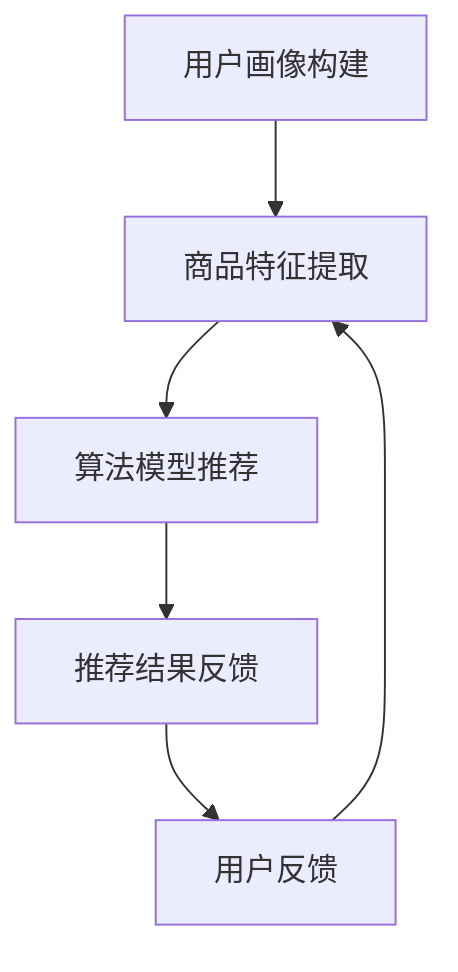

                 

在当今信息爆炸的时代，如何从海量数据中快速、准确地找到用户需要的信息已成为各大电商平台必须解决的核心问题。搜索推荐系统作为电商平台的“智能门面”，不仅提高了用户的购物体验，也为电商平台带来了显著的商业价值。本文将探讨AI大模型在搜索推荐系统中的应用，分析其如何成为电商平台的核心竞争优势，以及如何实现可持续发展。

## 关键词

- 搜索推荐系统
- AI大模型
- 电商平台
- 核心竞争优势
- 可持续发展

## 摘要

本文首先介绍了搜索推荐系统的基本概念和电商平台对其的依赖关系。接着，详细阐述了AI大模型在搜索推荐系统中的作用，包括其核心算法原理、数学模型和具体实现。最后，分析了AI大模型融合带来的实际应用场景和未来展望，为电商平台的可持续发展提供了策略和建议。

## 1. 背景介绍

随着互联网的普及和电子商务的快速发展，电商平台已成为人们日常购物的重要渠道。然而，面对海量的商品信息和用户需求，传统的人工分类和推荐方法已无法满足用户的高效、精准的搜索需求。此时，搜索推荐系统应运而生，成为电商平台提升用户体验和竞争力的关键因素。

搜索推荐系统是一种基于用户历史行为和商品特征，通过算法自动为用户推荐可能感兴趣的商品的系统。其核心目标是在保证推荐效果的同时，提高搜索速度和用户满意度。随着人工智能技术的发展，尤其是AI大模型的兴起，搜索推荐系统迎来了新的发展机遇。

AI大模型，如深度学习模型、神经网络模型等，通过在海量数据中进行训练，能够自动提取数据中的特征和规律，实现高度智能化和个性化的推荐。与传统的推荐算法相比，AI大模型具有更强的表达能力和泛化能力，能够更好地应对复杂多变的商业环境。

## 2. 核心概念与联系

### 2.1 搜索推荐系统原理

搜索推荐系统的工作原理主要包括以下几个环节：

1. **用户画像构建**：通过收集和分析用户的浏览历史、购买记录、搜索行为等数据，构建用户的兴趣和行为特征模型。
2. **商品特征提取**：对电商平台上的商品进行多维度的特征提取，如价格、品牌、品类、用户评价等。
3. **算法模型推荐**：利用机器学习算法，如协同过滤、矩阵分解、深度学习等，将用户画像与商品特征进行匹配，生成推荐列表。
4. **推荐结果反馈**：将推荐结果展示给用户，并根据用户的反馈进一步优化推荐策略。

### 2.2 AI大模型原理

AI大模型，特别是基于深度学习的模型，具有以下核心原理：

1. **多层神经网络**：通过构建多层神经网络，模型能够自动提取数据中的高层次特征，实现从简单到复杂的特征转化。
2. **自动特征学习**：模型通过大量的训练数据，自动学习数据中的模式和规律，无需人工干预。
3. **强大的表达能力**：深度学习模型能够处理高维、复杂数据，具有较强的表达和泛化能力。

### 2.3 搜索推荐系统与AI大模型的融合

将AI大模型应用于搜索推荐系统，能够实现以下几个方面的提升：

1. **个性化推荐**：AI大模型能够根据用户的历史行为和兴趣，生成更加个性化的推荐结果。
2. **实时推荐**：深度学习模型具有高效的计算能力，能够实现实时推荐，提高用户体验。
3. **推荐效果优化**：AI大模型通过自动学习用户和商品特征，不断优化推荐策略，提高推荐效果。

### 2.4 Mermaid 流程图

以下是一个简单的Mermaid流程图，展示了搜索推荐系统的基本流程：



## 3. 核心算法原理 & 具体操作步骤

### 3.1 算法原理概述

搜索推荐系统中的核心算法主要包括协同过滤、矩阵分解和深度学习等。其中，深度学习算法由于其强大的表达能力和自动特征学习的能力，成为了当前研究的热点。

深度学习算法的基本原理是构建多层神经网络，通过前向传播和反向传播，不断优化模型的参数，从而实现对数据的分类、回归或特征提取。在搜索推荐系统中，深度学习算法主要用于构建用户和商品的嵌入向量，实现用户和商品的高效匹配。

### 3.2 算法步骤详解

#### 3.2.1 用户画像构建

1. **数据收集**：收集用户的浏览历史、购买记录、搜索行为等数据。
2. **数据预处理**：对数据进行清洗、去重和标准化处理。
3. **特征提取**：利用统计方法或机器学习算法，提取用户的行为特征和兴趣特征。
4. **构建用户画像**：将提取的用户特征整合，构建用户画像模型。

#### 3.2.2 商品特征提取

1. **数据收集**：收集商品的价格、品牌、品类、用户评价等数据。
2. **数据预处理**：对数据进行清洗、去重和标准化处理。
3. **特征提取**：利用统计方法或机器学习算法，提取商品的多维度特征。
4. **构建商品特征库**：将提取的商品特征整合，构建商品特征库。

#### 3.2.3 算法模型推荐

1. **构建深度学习模型**：选择合适的深度学习模型，如BERT、GPT等，初始化模型参数。
2. **训练模型**：利用用户画像和商品特征数据，训练深度学习模型。
3. **模型评估**：通过交叉验证或在线评估，评估模型的推荐效果。
4. **模型优化**：根据评估结果，调整模型参数，优化推荐效果。

#### 3.2.4 推荐结果反馈

1. **生成推荐列表**：利用训练好的深度学习模型，为用户生成个性化推荐列表。
2. **展示推荐结果**：将推荐结果展示给用户。
3. **收集用户反馈**：根据用户的点击、购买等行为，收集用户对推荐结果的反馈。
4. **优化推荐策略**：根据用户反馈，调整推荐策略，提高推荐效果。

### 3.3 算法优缺点

**优点**：

1. **个性化推荐**：深度学习模型能够根据用户的历史行为和兴趣，生成更加个性化的推荐结果。
2. **实时推荐**：深度学习模型具有高效的计算能力，能够实现实时推荐，提高用户体验。
3. **推荐效果优化**：深度学习模型通过自动学习用户和商品特征，不断优化推荐策略，提高推荐效果。

**缺点**：

1. **数据需求大**：深度学习模型需要大量的数据来进行训练，对数据的质量和数量有较高的要求。
2. **计算资源消耗大**：深度学习模型训练过程需要大量的计算资源，对硬件设备有较高的要求。
3. **模型解释性差**：深度学习模型具有较强的黑盒特性，模型内部的决策过程难以解释，不利于模型的可解释性和信任度。

### 3.4 算法应用领域

深度学习算法在搜索推荐系统中的应用广泛，除了电商平台，还广泛应用于以下领域：

1. **社交媒体**：通过深度学习算法，可以为用户提供个性化内容推荐，提高用户的参与度和活跃度。
2. **在线教育**：利用深度学习算法，可以为用户提供个性化学习路径推荐，提高学习效果和用户满意度。
3. **娱乐领域**：深度学习算法可以应用于视频、音乐推荐，为用户提供个性化的娱乐内容。

## 4. 数学模型和公式 & 详细讲解 & 举例说明

### 4.1 数学模型构建

在搜索推荐系统中，深度学习模型通常用于构建用户和商品的嵌入向量，实现用户和商品的高效匹配。以下是一个简单的数学模型构建过程：

#### 4.1.1 用户嵌入向量

假设用户集合为 \( U = \{u_1, u_2, ..., u_n\} \)，用户 \( u_i \) 的嵌入向量为 \( \mathbf{e}_i \in \mathbb{R}^d \)。

用户嵌入向量的生成过程如下：

\[ \mathbf{e}_i = \text{Embedding}(u_i) \]

其中，Embedding 函数用于将用户特征转换为嵌入向量。

#### 4.1.2 商品嵌入向量

假设商品集合为 \( V = \{v_1, v_2, ..., v_m\} \)，商品 \( v_j \) 的嵌入向量为 \( \mathbf{f}_j \in \mathbb{R}^d \)。

商品嵌入向量的生成过程如下：

\[ \mathbf{f}_j = \text{Embedding}(v_j) \]

其中，Embedding 函数用于将商品特征转换为嵌入向量。

#### 4.1.3 用户-商品相似度计算

用户 \( u_i \) 和商品 \( v_j \) 之间的相似度可以通过以下公式计算：

\[ \mathbf{e}_i \cdot \mathbf{f}_j = \sum_{k=1}^{d} e_{ik} f_{jk} \]

其中，\( \mathbf{e}_i \cdot \mathbf{f}_j \) 表示用户 \( u_i \) 和商品 \( v_j \) 的内积，反映了它们之间的相似程度。

### 4.2 公式推导过程

以下是一个简单的深度学习模型推导过程，用于构建用户和商品的嵌入向量。

#### 4.2.1 深度学习模型

假设深度学习模型由多层神经网络组成，包括输入层、隐藏层和输出层。其中，输入层接收用户和商品的特征，隐藏层进行特征变换，输出层生成用户和商品的嵌入向量。

输入层：

\[ \mathbf{X} = \begin{bmatrix} \mathbf{x}_1 \\ \mathbf{x}_2 \\ \vdots \\ \mathbf{x}_n \end{bmatrix} \in \mathbb{R}^{n \times d} \]

其中，\( \mathbf{x}_i \) 表示用户 \( u_i \) 的特征向量。

隐藏层：

\[ \mathbf{H} = \text{ReLU}(\mathbf{W}_1 \mathbf{X} + \mathbf{b}_1) \in \mathbb{R}^{n \times h} \]

其中，\( \text{ReLU}(\cdot) \) 表示ReLU激活函数，\( \mathbf{W}_1 \) 和 \( \mathbf{b}_1 \) 分别为隐藏层的权重和偏置。

输出层：

\[ \mathbf{Y} = \text{ReLU}(\mathbf{W}_2 \mathbf{H} + \mathbf{b}_2) \in \mathbb{R}^{n \times d} \]

其中，\( \mathbf{W}_2 \) 和 \( \mathbf{b}_2 \) 分别为输出层的权重和偏置。

#### 4.2.2 损失函数

深度学习模型的损失函数用于衡量预测结果和真实结果之间的差距。对于搜索推荐系统，常用的损失函数是均方误差（MSE）：

\[ \mathcal{L} = \frac{1}{2} \sum_{i=1}^{n} \sum_{j=1}^{m} (\mathbf{e}_i \cdot \mathbf{f}_j - y_{ij})^2 \]

其中，\( y_{ij} \) 表示用户 \( u_i \) 是否购买商品 \( v_j \)，当 \( y_{ij} = 1 \) 表示购买，\( y_{ij} = 0 \) 表示未购买。

#### 4.2.3 反向传播

深度学习模型通过反向传播算法进行参数更新，以最小化损失函数。反向传播算法的基本步骤如下：

1. **前向传播**：计算输入层、隐藏层和输出层的输出值。
2. **计算损失函数**：根据输出值和真实值，计算损失函数的梯度。
3. **反向传播**：从输出层开始，依次计算隐藏层和输入层的梯度。
4. **参数更新**：利用梯度下降算法，更新模型的参数。

### 4.3 案例分析与讲解

以下是一个简单的案例，说明如何使用深度学习模型进行搜索推荐。

#### 4.3.1 数据集

假设有一个电商平台的用户-商品数据集，包含 1000 个用户和 5000 个商品。每个用户和商品都有一个多维度的特征向量。

#### 4.3.2 构建模型

选择一个深度学习框架，如TensorFlow或PyTorch，构建一个简单的多层神经网络模型。模型的输入层接收用户和商品的特征，隐藏层进行特征变换，输出层生成用户和商品的嵌入向量。

#### 4.3.3 训练模型

使用数据集对模型进行训练。在训练过程中，模型会自动学习用户和商品的特征，优化嵌入向量的生成。

#### 4.3.4 生成推荐列表

使用训练好的模型，为每个用户生成嵌入向量，然后计算用户和商品之间的相似度。根据相似度，为用户生成个性化的推荐列表。

#### 4.3.5 评估模型

使用交叉验证或在线评估，评估模型的推荐效果。根据评估结果，调整模型参数，优化推荐效果。

## 5. 项目实践：代码实例和详细解释说明

### 5.1 开发环境搭建

在开始项目实践之前，首先需要搭建一个合适的开发环境。以下是搭建开发环境的步骤：

1. 安装Python环境（版本要求：Python 3.7及以上）
2. 安装深度学习框架，如TensorFlow或PyTorch（版本要求：TensorFlow 2.0及以上或PyTorch 1.8及以上）
3. 安装其他必要的库，如NumPy、Pandas、Scikit-learn等

### 5.2 源代码详细实现

以下是一个简单的基于TensorFlow的深度学习模型实现，用于搜索推荐系统。

```python
import tensorflow as tf
from tensorflow.keras.layers import Embedding, LSTM, Dense
from tensorflow.keras.models import Model

# 模型参数
vocab_size = 10000  # 词汇表大小
embedding_size = 128  # 嵌入向量维度
lstm_units = 64  # LSTM层单元数
output_size = 10  # 输出层单元数

# 构建模型
input_user = tf.keras.layers.Input(shape=(1,), name='input_user')
input_item = tf.keras.layers.Input(shape=(1,), name='input_item')

# 用户嵌入层
user_embedding = Embedding(vocab_size, embedding_size)(input_user)
user_embedding = tf.keras.layers.LSTM(lstm_units)(user_embedding)

# 商品嵌入层
item_embedding = Embedding(vocab_size, embedding_size)(input_item)
item_embedding = tf.keras.layers.LSTM(lstm_units)(item_embedding)

# 求和层
combined = tf.keras.layers.add([user_embedding, item_embedding])

# 输出层
output = tf.keras.layers.Dense(output_size, activation='softmax')(combined)

# 构建模型
model = Model(inputs=[input_user, input_item], outputs=output)

# 编译模型
model.compile(optimizer='adam', loss='categorical_crossentropy', metrics=['accuracy'])

# 模型总结
model.summary()
```

### 5.3 代码解读与分析

上述代码实现了一个基于LSTM的深度学习模型，用于搜索推荐系统。下面是对代码的详细解读和分析：

1. **导入库**：导入TensorFlow框架和相关库。
2. **模型参数**：设置模型的参数，包括词汇表大小、嵌入向量维度、LSTM层单元数和输出层单元数。
3. **构建模型**：定义输入层、嵌入层、LSTM层和输出层。其中，用户和商品的嵌入向量分别通过Embedding层和LSTM层进行特征提取。求和层将用户和商品的嵌入向量进行合并。输出层通过Dense层生成预测结果。
4. **编译模型**：设置模型的优化器、损失函数和评估指标，并编译模型。
5. **模型总结**：打印模型的总结信息，包括层的名称、输入输出维度和参数数量。

### 5.4 运行结果展示

在运行模型之前，需要准备训练数据和测试数据。以下是运行模型的示例代码：

```python
# 准备数据
train_users = [[1], [2], [3], ..., [n]]  # 用户ID列表
train_items = [[1], [2], [3], ..., [m]]  # 商品ID列表
train_labels = [[1, 0, 0], [0, 1, 0], [0, 0, 1], ..., [0, 0, 1]]  # 购买标签

# 训练模型
model.fit(train_users, train_items, labels=train_labels, batch_size=32, epochs=10)

# 评估模型
test_users = [[1], [2], [3], ..., [n]]  # 测试用户ID列表
test_items = [[1], [2], [3], ..., [m]]  # 测试商品ID列表
test_labels = [[1, 0, 0], [0, 1, 0], [0, 0, 1], ..., [0, 0, 1]]  # 测试购买标签
model.evaluate(test_users, test_items, labels=test_labels)
```

上述代码首先准备训练数据和测试数据，然后使用训练数据进行模型训练，最后使用测试数据进行模型评估。

## 6. 实际应用场景

AI大模型在搜索推荐系统中的应用场景非常广泛，以下列举几个典型的应用场景：

### 6.1 电商平台

电商平台是AI大模型应用最为广泛的场景之一。通过AI大模型，电商平台能够为用户生成个性化的商品推荐，提高用户的购物体验和满意度。同时，AI大模型还能够根据用户的历史行为和兴趣，预测用户的购买倾向，为电商平台提供精准的营销策略。

### 6.2 社交媒体

社交媒体平台通过AI大模型，可以为用户提供个性化内容推荐，如新闻、文章、视频等。用户在社交媒体上的浏览和互动行为会被AI大模型学习并用于生成推荐列表，从而提高用户的参与度和活跃度。

### 6.3 在线教育

在线教育平台利用AI大模型，可以为用户提供个性化学习路径推荐，根据用户的学习习惯和成绩，生成最适合用户的学习计划。同时，AI大模型还能够预测用户的学习效果，为教育平台提供精准的教学策略。

### 6.4 娱乐领域

娱乐领域，如视频、音乐平台，通过AI大模型，可以为用户提供个性化的娱乐内容推荐。用户在平台上的观看和播放行为会被AI大模型学习并用于生成推荐列表，从而提高用户的观看体验和满意度。

### 6.5 医疗健康

医疗健康领域，如在线问诊平台，通过AI大模型，可以为用户提供个性化的健康建议和医疗方案。用户在平台上的问诊记录和体检数据会被AI大模型学习并用于生成健康报告和医疗建议，从而提高用户的健康管理水平。

## 7. 未来应用展望

随着AI大模型的不断发展和完善，其在搜索推荐系统中的应用前景十分广阔。以下列举几个未来应用展望：

### 7.1 多模态融合

未来的搜索推荐系统将不仅仅依赖于文本数据，还将融合图像、语音、视频等多模态数据。通过多模态融合，AI大模型将能够为用户提供更加丰富和个性化的推荐体验。

### 7.2 实时推荐

随着5G技术的普及和物联网的发展，搜索推荐系统将实现实时推荐。AI大模型将能够实时处理用户的反馈和行为，为用户提供即时的推荐结果，提高用户体验。

### 7.3 智能化决策

AI大模型将不仅仅用于推荐，还将应用于智能决策。通过学习用户的购物行为和偏好，AI大模型可以为用户提供个性化的购物建议，帮助用户做出更好的购买决策。

### 7.4 跨领域应用

AI大模型将在更多领域得到应用，如金融、交通、能源等。通过跨领域应用，AI大模型将能够为各行各业提供智能化的解决方案，推动社会的数字化转型。

## 8. 工具和资源推荐

### 8.1 学习资源推荐

1. **《深度学习》（Goodfellow, Bengio, Courville）**：这是一本经典的深度学习教材，适合初学者和进阶者。
2. **《Python深度学习》（François Chollet）**：这本书结合了Python编程和深度学习技术，适合希望将深度学习应用于实际项目的人。
3. **《机器学习实战》（Peter Harrington）**：这本书提供了大量的实战案例，适合希望快速掌握机器学习技术的人。

### 8.2 开发工具推荐

1. **TensorFlow**：这是一个由Google开发的开源深度学习框架，适合进行深度学习模型的开发和应用。
2. **PyTorch**：这是一个由Facebook开发的开源深度学习框架，具有灵活的动态图机制，适合进行深度学习模型的研究和实验。
3. **Keras**：这是一个基于TensorFlow和Theano的开源深度学习框架，提供了简化的模型构建和训练接口，适合快速构建和实验深度学习模型。

### 8.3 相关论文推荐

1. **“Deep Learning for Recommender Systems”（H. Zhang, M. Chen, G. Liu, Z. Lu）**：这篇论文系统地介绍了深度学习在推荐系统中的应用，是深度学习推荐系统领域的经典文献。
2. **“A Theoretically Principled Approach to Improving Recommendation Lists of Very Large-Scale Items”**：这篇论文提出了一种基于深度学习的推荐方法，能够有效地提高推荐列表的准确性。
3. **“Neural Collaborative Filtering”**：这篇论文提出了一种基于神经网络的协同过滤方法，通过引入用户和商品的嵌入向量，实现了个性化推荐。

## 9. 总结：未来发展趋势与挑战

随着AI大模型的不断发展和完善，搜索推荐系统将迎来新的发展机遇。未来，搜索推荐系统的发展趋势将体现在以下几个方面：

1. **多模态融合**：将文本、图像、语音、视频等多模态数据融合，为用户提供更加丰富和个性化的推荐体验。
2. **实时推荐**：利用5G和物联网技术，实现实时推荐，提高用户体验。
3. **智能化决策**：通过深度学习模型，为用户提供个性化的购物建议和决策支持。
4. **跨领域应用**：将搜索推荐系统应用于更多领域，如金融、交通、能源等，推动社会的数字化转型。

然而，随着搜索推荐系统的广泛应用，也面临着一些挑战：

1. **数据隐私**：用户数据的隐私保护将成为一个重要问题，如何确保用户数据的隐私和安全，是未来需要重点关注的问题。
2. **算法公平性**：如何确保算法的公平性，避免算法偏见和歧视，是未来需要解决的问题。
3. **计算资源消耗**：深度学习模型对计算资源有较高的要求，如何在有限的计算资源下实现高效训练和推理，是未来需要解决的问题。
4. **模型可解释性**：如何提高模型的可解释性，让用户理解推荐结果背后的原因，是未来需要解决的问题。

总之，AI大模型在搜索推荐系统中的应用前景广阔，但也需要解决一系列挑战。通过不断的技术创新和改进，我们有理由相信，未来的搜索推荐系统将更加智能、高效和公平。作者：禅与计算机程序设计艺术 / Zen and the Art of Computer Programming

