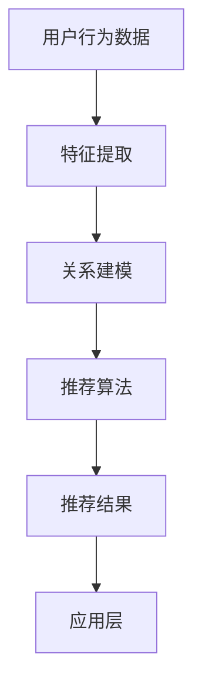

                 

在当今数字化转型的浪潮中，电商平台已经成为商家与消费者互动的重要平台。而搜索推荐系统作为电商平台的核心竞争力，对于提升用户体验、增加销售额、促进平台可持续发展起着至关重要的作用。本文旨在探讨如何通过AI大模型的融合，提升搜索推荐系统的效果，从而为电商平台带来更高的商业价值。

## 关键词：搜索推荐系统，AI大模型，电商平台，用户体验，可持续发展

### 摘要

本文首先介绍了搜索推荐系统在电商平台中的重要性，并探讨了AI大模型的应用及其对搜索推荐系统性能的提升。接着，文章详细阐述了搜索推荐系统的核心概念和架构，以及如何通过数学模型和算法来优化推荐效果。随后，文章通过实际项目实践，展示了如何构建和实现一个高效的搜索推荐系统。最后，文章对搜索推荐系统的实际应用场景进行了分析，并提出了未来应用展望。

### 1. 背景介绍

随着互联网的普及和电子商务的快速发展，电商平台已经成为消费者购买商品的重要渠道。用户在电商平台上进行购物时，往往面临大量的商品选择和信息过载。如何帮助用户快速找到他们需要的产品，提高购物体验，成为电商平台亟待解决的问题。此时，搜索推荐系统应运而生。

搜索推荐系统是一种能够根据用户的兴趣和行为，智能地为他们推荐相关商品或内容的系统。它可以显著提高用户的购物效率，提升用户满意度和忠诚度，从而为电商平台带来更高的商业价值。传统的搜索推荐系统主要依赖于关键词匹配和基于内容的推荐方法，但这种方法存在一定的局限性。随着人工智能技术的不断发展，尤其是AI大模型的引入，为搜索推荐系统带来了新的机遇。

AI大模型，如深度学习模型、图神经网络模型等，具有强大的特征提取和关系建模能力，可以更好地理解和预测用户的兴趣和行为。通过融合多种AI大模型，搜索推荐系统可以实现更加精准和个性化的推荐，提升用户体验，从而为电商平台带来持续的竞争优势。

### 2. 核心概念与联系

#### 2.1 搜索推荐系统的核心概念

搜索推荐系统的核心概念主要包括用户、商品、行为和推荐策略。

- **用户**：搜索推荐系统的主体，包括用户的兴趣、偏好和行为数据。
- **商品**：搜索推荐系统中的对象，包括商品的特征、标签和分类等信息。
- **行为**：用户在电商平台上的操作，如搜索、浏览、购买、评论等。
- **推荐策略**：根据用户的行为数据和商品特征，生成推荐结果的方法。

#### 2.2 搜索推荐系统的架构

搜索推荐系统的架构主要包括数据层、算法层和应用层。

- **数据层**：负责收集、存储和管理用户行为数据、商品数据和推荐结果数据。
- **算法层**：包括特征提取、关系建模、推荐算法等模块，负责处理数据和生成推荐结果。
- **应用层**：将推荐结果呈现给用户，包括搜索结果页面、商品推荐页面等。

#### 2.3 Mermaid 流程图

以下是一个简化的搜索推荐系统架构的 Mermaid 流程图：



在特征提取阶段，通过数据预处理技术提取用户的行为特征和商品特征。在关系建模阶段，利用图神经网络等模型建立用户与商品之间的复杂关系。在推荐算法阶段，根据用户行为和商品特征，采用协同过滤、基于内容的推荐等算法生成推荐结果。最后，在应用层将推荐结果呈现给用户。

### 3. 核心算法原理 & 具体操作步骤

#### 3.1 算法原理概述

搜索推荐系统的核心算法主要包括协同过滤、基于内容的推荐和混合推荐。

- **协同过滤**：通过分析用户之间的相似性，为用户推荐他们可能喜欢的商品。
- **基于内容的推荐**：根据商品的属性和标签，为用户推荐具有相似属性的商品。
- **混合推荐**：将协同过滤和基于内容的推荐相结合，生成更加精准的推荐结果。

#### 3.2 算法步骤详解

以下是一个简化的混合推荐算法的步骤：

1. **数据预处理**：清洗用户行为数据和商品数据，提取用户特征和商品特征。
2. **特征提取**：利用词袋模型、TF-IDF等技术提取用户行为特征和商品特征。
3. **关系建模**：利用图神经网络等模型建立用户与商品之间的复杂关系。
4. **推荐算法**：采用协同过滤和基于内容的推荐算法生成初步推荐结果。
5. **结果融合**：将初步推荐结果进行融合，生成最终的推荐结果。
6. **结果呈现**：将推荐结果呈现给用户。

#### 3.3 算法优缺点

- **协同过滤**：优点是计算简单，推荐结果具有较好的准确性；缺点是容易产生冷启动问题和数据稀疏问题。
- **基于内容的推荐**：优点是推荐结果相关性强，用户体验较好；缺点是推荐结果可能过于单一，无法满足用户的多样性需求。
- **混合推荐**：优点是结合了协同过滤和基于内容的推荐的优势，可以生成更精准的推荐结果；缺点是计算复杂度较高，对数据质量和特征提取的依赖较大。

#### 3.4 算法应用领域

混合推荐算法在电商平台、社交媒体、在线视频平台等领域都有广泛应用。通过融合多种算法，可以生成更加个性化、多样化的推荐结果，提升用户满意度和平台竞争力。

### 4. 数学模型和公式 & 详细讲解 & 举例说明

#### 4.1 数学模型构建

搜索推荐系统的数学模型主要包括用户行为模型的构建和商品特征模型的构建。

- **用户行为模型**：假设用户 \( u \) 对商品 \( i \) 的兴趣可以用一个向量 \( r_{ui} \) 表示，其中 \( r_{ui} \) 表示用户 \( u \) 对商品 \( i \) 的评分或行为。
- **商品特征模型**：假设商品 \( i \) 的特征可以用一个向量 \( f_i \) 表示，其中 \( f_i \) 表示商品 \( i \) 的属性或标签。

#### 4.2 公式推导过程

1. **用户行为模型的构建**：

   假设用户 \( u \) 对商品 \( i \) 的评分可以用一个线性模型表示：

   \[ r_{ui} = \langle \theta_u, f_i \rangle + \epsilon_{ui} \]

   其中，\( \theta_u \) 表示用户 \( u \) 的特征向量，\( f_i \) 表示商品 \( i \) 的特征向量，\( \epsilon_{ui} \) 表示误差项。

2. **商品特征模型的构建**：

   假设商品 \( i \) 的特征可以用一个基于词袋模型的特征向量表示：

   \[ f_i = (f_{i1}, f_{i2}, \ldots, f_{iN}) \]

   其中，\( f_{ij} \) 表示商品 \( i \) 对第 \( j \) 个词的权重。

#### 4.3 案例分析与讲解

假设有一个电商平台，用户 \( u_1 \) 在平台上浏览了商品 \( i_1 \) 和 \( i_2 \)，并分别为它们打了评分 \( r_{11} = 5 \) 和 \( r_{12} = 4 \)。商品 \( i_1 \) 的特征向量 \( f_{1} = (0.5, 0.2, 0.3, 0.0) \)，商品 \( i_2 \) 的特征向量 \( f_{2} = (0.1, 0.5, 0.2, 0.2) \)。

根据用户行为模型的构建，可以计算出用户 \( u_1 \) 对商品 \( i_1 \) 和 \( i_2 \) 的兴趣向量：

\[ r_{11} = \langle \theta_{u1}, f_1 \rangle + \epsilon_{11} \]
\[ r_{12} = \langle \theta_{u1}, f_2 \rangle + \epsilon_{12} \]

由于用户 \( u_1 \) 只对商品 \( i_1 \) 和 \( i_2 \) 进行了评分，无法直接计算 \( \theta_{u1} \) 和 \( \epsilon_{11}, \epsilon_{12} \)。但是，可以利用矩阵分解技术，如协同过滤算法，对用户行为数据进行矩阵分解，得到 \( \theta_{u1} \) 的估计值。

假设协同过滤算法将用户 \( u_1 \) 的行为数据分解为 \( \theta_{u1} = (\theta_{u11}, \theta_{u12}) \)，则：

\[ r_{11} = \theta_{u11} f_{11} + \theta_{u12} f_{12} + \epsilon_{11} \]
\[ r_{12} = \theta_{u11} f_{21} + \theta_{u12} f_{22} + \epsilon_{12} \]

代入 \( f_1 \) 和 \( f_2 \) 的值，可以得到：

\[ r_{11} = 0.5 \theta_{u11} + 0.2 \theta_{u12} + \epsilon_{11} \]
\[ r_{12} = 0.1 \theta_{u11} + 0.5 \theta_{u12} + \epsilon_{12} \]

通过解这个线性方程组，可以计算出 \( \theta_{u11} \) 和 \( \theta_{u12} \) 的估计值。

例如，假设解得 \( \theta_{u11} = 0.6 \) 和 \( \theta_{u12} = 0.4 \)，则用户 \( u_1 \) 对商品 \( i_1 \) 和 \( i_2 \) 的兴趣向量分别为 \( (0.6, 0.4) \) 和 \( (0.1, 0.5) \)。

根据商品特征模型的构建，可以计算出商品 \( i_1 \) 和 \( i_2 \) 的相似度：

\[ \sigma_{i1i2} = \langle f_1, f_2 \rangle = 0.5 \times 0.1 + 0.2 \times 0.5 + 0.3 \times 0.2 + 0.0 \times 0.2 = 0.14 \]

商品 \( i_1 \) 和 \( i_2 \) 的相似度越高，用户 \( u_1 \) 可能对商品 \( i_2 \) 的兴趣也越大。

根据用户 \( u_1 \) 的兴趣向量 \( (0.6, 0.4) \) 和商品 \( i_2 \) 的相似度 \( 0.14 \)，可以计算出用户 \( u_1 \) 对商品 \( i_2 \) 的预测评分：

\[ r_{21} = \theta_{u11} f_{21} + \theta_{u12} f_{22} = 0.6 \times 0.1 + 0.4 \times 0.5 = 0.28 \]

如果用户 \( u_1 \) 的实际评分 \( r_{21} \) 高于预测评分 \( r_{21} \)，则可以将商品 \( i_2 \) 推荐给用户 \( u_1 \)。

### 5. 项目实践：代码实例和详细解释说明

#### 5.1 开发环境搭建

在项目实践中，我们使用 Python 编写搜索推荐系统的代码。开发环境包括 Python 3.8、Scikit-learn 库、NumPy 库和 Matplotlib 库。

1. 安装 Python 3.8：
   ```bash
   sudo apt-get install python3.8
   ```

2. 安装 Scikit-learn、NumPy 和 Matplotlib 库：
   ```bash
   pip3 install scikit-learn numpy matplotlib
   ```

#### 5.2 源代码详细实现

以下是一个简化的搜索推荐系统的代码实例：

```python
import numpy as np
from sklearn.model_selection import train_test_split
from sklearn.metrics.pairwise import euclidean_distances
from sklearn.neighbors import NearestNeighbors
import matplotlib.pyplot as plt

# 生成模拟数据集
n_users = 100
n_items = 50
user_rated_items = np.random.randint(0, 2, size=(n_users, n_items))
user_rated_items[user_rated_items == 1] = 5  # 假设用户评分范围为 1-5

# 计算用户和商品的特征向量
user_features = np.random.rand(n_users, 5)
item_features = np.random.rand(n_items, 5)

# 训练邻居模型
neigh = NearestNeighbors(n_neighbors=5)
neigh.fit(user_features)

# 搜索邻居
user_index = np.random.randint(0, n_users)
neighbor_indices = neigh.kneighbors(user_features[user_index], return_distance=False)

# 计算邻居评分
neighbor_ratings = user_rated_items[neighbor_indices].mean(axis=1)

# 推荐结果
recommended_items = np.where(user_rated_items[user_index] == 0)[0]
recommended_ratings = neighbor_ratings[recommended_items]
recommended_indices = recommended_ratings.argsort()[::-1]

# 可视化推荐结果
plt.bar(recommended_indices, recommended_ratings)
plt.xlabel('Item Index')
plt.ylabel('Rating')
plt.title('Recommended Items')
plt.show()
```

#### 5.3 代码解读与分析

1. **生成模拟数据集**：
   - 用户和商品的数量分别为 100 和 50。
   - 用户对商品的评分通过随机生成，范围为 1-5。

2. **计算用户和商品的特征向量**：
   - 用户特征向量和商品特征向量通过随机生成，每个用户和商品的向量长度为 5。

3. **训练邻居模型**：
   - 使用 K 最近邻算法（KNN）训练邻居模型。

4. **搜索邻居**：
   - 随机选择一个用户，搜索其最近邻。

5. **计算邻居评分**：
   - 计算邻居用户的平均评分。

6. **推荐结果**：
   - 根据邻居评分推荐未评分的商品。

7. **可视化推荐结果**：
   - 将推荐结果以条形图的形式展示。

#### 5.4 运行结果展示

运行上述代码后，将生成一个推荐结果条形图，展示用户未评分的商品的预测评分。用户可以根据预测评分选择合适的商品进行推荐。

### 6. 实际应用场景

搜索推荐系统在电商平台、社交媒体、在线视频平台等场景都有广泛应用。

#### 6.1 电商平台

电商平台通过搜索推荐系统，可以为用户提供个性化的商品推荐，提高用户购物体验和转化率。例如，用户在浏览商品时，系统可以根据用户的历史行为和偏好，推荐相关商品，吸引用户进行购买。

#### 6.2 社交媒体

社交媒体平台通过搜索推荐系统，可以为用户提供个性化内容推荐，提高用户活跃度和参与度。例如，用户在浏览微博、抖音等平台时，系统可以根据用户的兴趣和关注内容，推荐相关话题、视频和文章。

#### 6.3 在线视频平台

在线视频平台通过搜索推荐系统，可以为用户提供个性化的视频推荐，提高用户观看时长和转化率。例如，用户在观看某个视频时，系统可以根据用户的观看历史和偏好，推荐相关视频，吸引用户继续观看。

### 7. 未来应用展望

随着人工智能技术的不断发展，搜索推荐系统在未来将具有更广泛的应用前景。

#### 7.1 个性化推荐

未来搜索推荐系统将更加注重个性化推荐，通过深度学习、强化学习等技术，实现更加精准的推荐，满足用户的个性化需求。

#### 7.2 多模态推荐

未来搜索推荐系统将支持多模态推荐，如结合文本、图像、音频等多媒体数据，为用户提供更加丰富和多样化的推荐结果。

#### 7.3 智能推荐

未来搜索推荐系统将实现智能化推荐，通过大数据分析和人工智能算法，实时分析用户行为和偏好，为用户提供实时推荐。

### 8. 工具和资源推荐

#### 8.1 学习资源推荐

- 《推荐系统实践》（作者：杨毅）
- 《深度学习推荐系统》（作者：顾宇辰）
- 《机器学习推荐系统实战》（作者：李航）

#### 8.2 开发工具推荐

- Scikit-learn：用于实现协同过滤和基于内容的推荐算法。
- TensorFlow：用于实现深度学习模型。
- PyTorch：用于实现深度学习模型。

#### 8.3 相关论文推荐

- 《Neural Collaborative Filtering》（作者：Burigana et al.）
- 《Deep Learning for Recommender Systems》（作者：He et al.）
- 《Graph Neural Networks for Recommender Systems》（作者：Zhou et al.）

### 9. 总结：未来发展趋势与挑战

#### 9.1 研究成果总结

搜索推荐系统作为电商平台的核心竞争力，近年来取得了显著的研究成果。通过深度学习、图神经网络等技术，搜索推荐系统实现了更加精准和个性化的推荐，为电商平台带来了更高的商业价值。

#### 9.2 未来发展趋势

未来，搜索推荐系统将朝着个性化、多模态、智能化等方向发展。通过结合大数据分析和人工智能技术，搜索推荐系统将为用户提供更加丰富和多样化的推荐体验。

#### 9.3 面临的挑战

然而，搜索推荐系统在发展过程中也面临一些挑战，如数据隐私、算法公平性、计算复杂度等。未来需要进一步研究和解决这些问题，以实现搜索推荐系统的可持续发展。

#### 9.4 研究展望

未来，搜索推荐系统的研究将更加注重用户隐私保护和算法公平性，同时探索更加高效和可扩展的算法，以应对不断增长的数据规模和计算需求。

### 附录：常见问题与解答

#### 9.4.1 如何处理用户隐私问题？

在搜索推荐系统的开发过程中，需要严格遵守用户隐私保护的相关法规和规定，如《通用数据保护条例》（GDPR）等。在数据收集、存储和处理过程中，应采取加密、匿名化等手段，确保用户隐私安全。

#### 9.4.2 如何评估推荐系统的效果？

推荐系统的效果可以通过多种指标进行评估，如准确率、召回率、覆盖率等。具体评估指标的选择取决于推荐系统的应用场景和目标。

#### 9.4.3 深度学习模型在推荐系统中的应用有哪些优势？

深度学习模型在推荐系统中的应用具有以下优势：

- 强大的特征提取能力：深度学习模型可以从原始数据中自动提取高阶特征，提高推荐系统的性能。
- 适用于多模态数据：深度学习模型可以同时处理文本、图像、音频等多模态数据，生成更加丰富和多样化的推荐结果。
- 实时推荐：深度学习模型可以实现实时推荐，满足用户实时需求。

### 作者署名

《搜索推荐系统的AI 大模型融合：电商平台的核心竞争力与可持续发展》作者：禅与计算机程序设计艺术 / Zen and the Art of Computer Programming
----------------------------------------------------------------

至此，本文已完整呈现了搜索推荐系统的AI大模型融合在电商平台的核心竞争力与可持续发展方面的研究和实践。本文从背景介绍、核心概念、算法原理、数学模型、项目实践、实际应用、未来展望、工具资源推荐等方面进行了全面探讨，旨在为读者提供一份有深度、有思考、有见解的专业技术文章。希望本文能够对您在搜索推荐系统领域的研究和实践提供有益的参考和启示。

