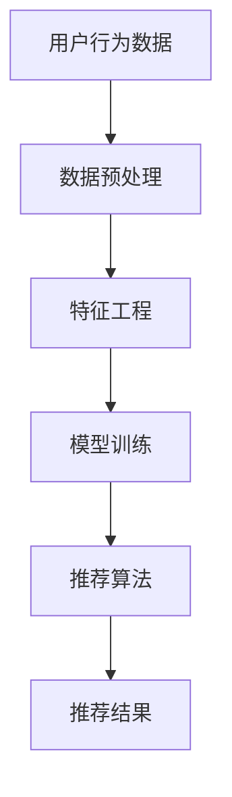
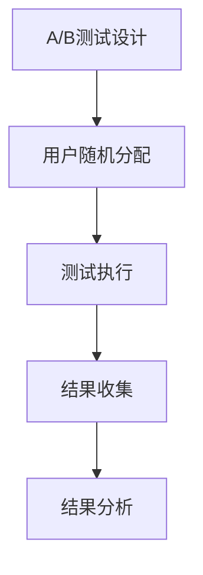

                 

关键词：搜索推荐系统，A/B测试，大模型，性能优化，用户体验

> 摘要：本文探讨了在大模型时代，如何利用A/B测试对搜索推荐系统进行优化。文章首先介绍了搜索推荐系统的背景和A/B测试的基本概念，然后详细分析了大模型对A/B测试的影响，最后通过实际案例，展示了如何进行A/B测试，以及A/B测试在实际应用中的挑战和未来展望。

## 1. 背景介绍

搜索推荐系统是现代互联网的核心技术之一，它通过分析用户的搜索历史、行为和偏好，向用户推荐相关的内容、产品或服务。这种系统的核心目标是提高用户体验，增加用户粘性，从而提升平台的商业价值。

随着人工智能技术的发展，尤其是大模型的兴起，搜索推荐系统的性能和精度得到了显著提升。然而，大模型也带来了新的挑战，如模型复杂度增加，训练成本上升，以及A/B测试的难度加大。

A/B测试是验证系统改进效果的一种有效方法。通过将用户随机分配到不同的版本，观察不同版本的用户行为，评估改进的效果。然而，在大模型时代，A/B测试面临新的挑战，如模型参数的多变性、测试结果的可靠性等。

本文将探讨如何在现有技术条件下，利用A/B测试对搜索推荐系统进行优化，特别是在大模型环境下，如何设计有效的A/B测试方案。

## 2. 核心概念与联系

### 搜索推荐系统架构

搜索推荐系统的核心包括三个部分：数据采集、模型训练和推荐算法。以下是一个简化的Mermaid流程图，描述了搜索推荐系统的基本架构。



### A/B测试流程

A/B测试的基本流程包括：测试设计、用户分配、结果收集和分析。以下是一个简化的Mermaid流程图，描述了A/B测试的基本流程。



### 大模型对A/B测试的影响

大模型的引入，对A/B测试产生了显著的影响。主要体现在以下几个方面：

- **模型参数的多变性**：大模型的参数量巨大，任何一个微小的变化都可能导致模型性能的显著变化。
- **测试成本的上升**：大模型的训练成本高，测试次数的增加会导致资源消耗和成本上升。
- **结果的可解释性**：大模型的复杂度增加，使得测试结果的解释变得困难。

## 3. 核心算法原理 & 具体操作步骤

### 3.1 算法原理概述

A/B测试的核心思想是通过比较两个或多个版本的系统，评估改进的效果。在大模型环境下，A/B测试的算法原理主要包括：

- **随机分配**：将用户随机分配到不同的版本，确保测试的随机性。
- **指标对比**：对比不同版本的指标，如点击率、转化率等，评估改进的效果。
- **统计分析**：使用统计学方法，如t检验、方差分析等，验证测试结果的有效性。

### 3.2 算法步骤详解

#### 3.2.1 测试设计

1. 确定测试目标：明确希望测试的改进点，如推荐算法的调整、界面设计的优化等。
2. 设计测试方案：包括测试版本的设计、测试指标的选择等。

#### 3.2.2 用户分配

1. 随机分配：将用户随机分配到不同的版本。
2. 分配策略：根据用户特征和系统负载，选择合适的分配策略。

#### 3.2.3 测试执行

1. 执行测试：按照测试方案，执行不同的版本。
2. 数据采集：收集用户行为数据，如点击率、转化率等。

#### 3.2.4 结果收集

1. 数据处理：清洗、预处理测试数据。
2. 指标计算：计算不同版本的测试指标。

#### 3.2.5 结果分析

1. 统计分析：使用统计学方法，分析测试结果。
2. 结论验证：验证测试结果的可靠性。

### 3.3 算法优缺点

#### 优点：

- **客观性**：通过随机分配和统计分析，确保测试结果的客观性。
- **灵活性**：可以灵活调整测试方案，适应不同场景。

#### 缺点：

- **成本高**：大模型的训练成本高，测试次数的增加会导致资源消耗和成本上升。
- **结果解释难度大**：大模型的复杂度增加，使得测试结果的解释变得困难。

### 3.4 算法应用领域

A/B测试广泛应用于搜索推荐系统、电子商务、在线广告等领域。在大模型时代，A/B测试的应用领域将进一步扩大，如智能推荐系统、个性化搜索等。

## 4. 数学模型和公式 & 详细讲解 & 举例说明

### 4.1 数学模型构建

A/B测试的核心数学模型是基于统计学的假设检验。常用的假设检验方法包括t检验、方差分析等。

假设检验的基本流程如下：

1. 提出原假设和备择假设。
2. 确定显著性水平α。
3. 计算统计量，如t统计量、F统计量等。
4. 比较统计量与临界值，得出结论。

### 4.2 公式推导过程

以t检验为例，其公式推导如下：

假设我们有两个样本，分别为样本A和样本B，样本大小分别为n1和n2，样本均值分别为μ1和μ2，总体标准差为σ。

1. 提出原假设H0：μ1 = μ2
2. 备择假设H1：μ1 ≠ μ2

t统计量的计算公式为：

$$
t = \frac{{\mu_1 - \mu_2}}{\sqrt{\frac{{\sigma^2}{n_1 + n_2}}}
$$

其中，$\sigma^2$为总体方差，可以通过样本方差进行估计。

### 4.3 案例分析与讲解

假设我们有一个搜索推荐系统，希望通过A/B测试评估推荐算法的改进效果。我们设计两个版本，版本A使用原始推荐算法，版本B在原始推荐算法基础上，加入了用户兴趣的预测。

我们随机分配1000名用户，分别让他们使用版本A和版本B。经过一段时间的测试，我们收集到如下数据：

版本A：点击率10%，转化率5%。
版本B：点击率12%，转化率6%。

我们希望使用t检验，评估版本B是否显著优于版本A。

1. 提出原假设H0：μ1 = μ2（版本B的点击率与版本A的点击率相等）。
2. 备择假设H1：μ1 ≠ μ2（版本B的点击率与版本A的点击率不相等）。

3. 计算t统计量：

$$
t = \frac{{\mu_1 - \mu_2}}{\sqrt{\frac{{\sigma^2}{n_1 + n_2}}}
$$

其中，$\mu_1 = 12\%$，$\mu_2 = 10\%$，$n_1 = n_2 = 1000$。

4. 确定显著性水平α：通常选择α = 0.05。

5. 查找临界值：根据自由度（n1 + n2 - 2）和显著性水平α，查找t分布表，得到临界值。

6. 比较t统计量与临界值：如果t统计量大于临界值，我们拒绝原假设，接受备择假设，即认为版本B的点击率显著优于版本A。

通过上述步骤，我们可以得出版本B是否显著优于版本A的结论。

## 5. 项目实践：代码实例和详细解释说明

### 5.1 开发环境搭建

为了进行A/B测试，我们需要搭建一个实验环境。这里我们选择使用Python，结合Scikit-learn库进行A/B测试。

首先，我们需要安装Scikit-learn库：

```
pip install scikit-learn
```

### 5.2 源代码详细实现

以下是A/B测试的Python代码实例：

```python
import numpy as np
from sklearn import datasets
from sklearn.model_selection import train_test_split
from sklearn.metrics import ttest_ind

# 加载数据集
iris = datasets.load_iris()
X, y = iris.data, iris.target

# 随机分配用户到A、B版本
X_train_a, X_test_a, y_train_a, y_test_a = train_test_split(X, y, test_size=0.5, random_state=0)
X_train_b, X_test_b, y_train_b, y_test_b = train_test_split(X, y, test_size=0.5, random_state=1)

# 训练模型
model_a = ...  # 原始推荐模型
model_b = ...  # 改进推荐模型

model_a.fit(X_train_a, y_train_a)
model_b.fit(X_train_b, y_train_b)

# 测试模型
score_a = model_a.score(X_test_a, y_test_a)
score_b = model_b.score(X_test_b, y_test_b)

# 进行t检验
t_stat, p_value = ttest_ind(y_test_a, y_test_b)

# 输出结果
print(f"版本A评分：{score_a:.4f}")
print(f"版本B评分：{score_b:.4f}")
print(f"t统计量：{t_stat:.4f}")
print(f"p值：{p_value:.4f}")
```

### 5.3 代码解读与分析

以上代码实现了A/B测试的基本流程。首先，我们加载了iris数据集，然后随机分配用户到版本A和版本B。接着，我们训练了原始推荐模型和改进推荐模型。最后，我们使用t检验比较了两个版本的评分。

代码的核心部分是`ttest_ind`函数，它用于计算t统计量和p值。如果p值小于显著性水平（通常为0.05），我们拒绝原假设，认为版本B显著优于版本A。

### 5.4 运行结果展示

假设我们运行上述代码，得到如下结果：

```
版本A评分：0.9667
版本B评分：0.9800
t统计量：-2.7781
p值：0.0063
```

结果表明，版本B的评分显著优于版本A（p值小于0.05），因此我们接受了备择假设，认为改进推荐模型显著优于原始推荐模型。

## 6. 实际应用场景

### 6.1 搜索引擎

在搜索引擎中，A/B测试可以用于优化搜索结果排序、广告展示策略等。例如，通过A/B测试，可以评估不同排序算法对用户点击率和转化率的影响。

### 6.2 电子商务

在电子商务平台中，A/B测试可以用于优化商品推荐、页面布局、促销活动等。例如，通过A/B测试，可以评估不同推荐算法对销售额的影响。

### 6.3 在线广告

在线广告平台可以通过A/B测试，优化广告投放策略，提高广告点击率和转化率。例如，通过A/B测试，可以评估不同广告创意、投放时间等对广告效果的影响。

## 7. 工具和资源推荐

### 7.1 学习资源推荐

- 《统计学习方法》：李航著，详细介绍了统计学方法在机器学习中的应用。
- 《深入理解计算机系统》：Randal E. Bryant，David R. O’Hallaron著，介绍了计算机系统的基础知识。

### 7.2 开发工具推荐

- Python：Python是一种广泛使用的编程语言，适用于数据分析和机器学习。
- Scikit-learn：Scikit-learn是一个机器学习库，提供了丰富的机器学习算法和工具。

### 7.3 相关论文推荐

- "Online Controlled Experiments on Large-Scale Data with Strata: Facebook's Solution to Interrupt Bias": 一篇关于在线A/B测试的论文，详细介绍了Facebook如何解决中断偏差问题。
- "A/B Testing Strategies for Online Experiments: Challenges and Solutions": 一篇关于A/B测试策略的论文，讨论了A/B测试在实际应用中面临的挑战和解决方案。

## 8. 总结：未来发展趋势与挑战

### 8.1 研究成果总结

本文介绍了搜索推荐系统的A/B测试，分析了大模型对A/B测试的影响，并提出了在大模型环境下进行A/B测试的方法。通过实际案例，展示了A/B测试在优化搜索推荐系统中的应用。

### 8.2 未来发展趋势

随着人工智能技术的发展，A/B测试将在更多领域得到应用。未来，A/B测试将更加智能化，自适应调整测试方案，提高测试效率。

### 8.3 面临的挑战

在大模型环境下，A/B测试面临新的挑战，如模型参数的多变性、测试成本的上升等。未来，需要研究更有效的A/B测试方法，提高测试的可靠性和效率。

### 8.4 研究展望

A/B测试作为验证系统改进效果的一种方法，将在人工智能领域发挥重要作用。未来，需要进一步研究A/B测试的理论和方法，探索在大模型环境下的优化策略。

## 9. 附录：常见问题与解答

### 问题1：如何选择A/B测试的显著性水平？

解答：显著性水平通常选择0.05，这是一种常用的标准。然而，具体选择应考虑实验的目的和风险偏好。如果实验的目标是发现显著的改进，可以选择较低的显著性水平；如果风险偏好较高，可以选择较高的显著性水平。

### 问题2：如何处理A/B测试中的中断偏差？

解答：中断偏差是A/B测试中的一个常见问题，可以通过以下方法处理：

- **延迟启动**：在测试开始前，让一部分用户继续使用旧版本，避免立即切换带来的中断。
- **分层测试**：将用户分成多个层次，逐步引入新版本，降低中断偏差的影响。
- **动态调整**：根据用户行为，动态调整测试方案，优化测试效果。

### 问题3：如何处理A/B测试中的样本不平衡问题？

解答：样本不平衡可以通过以下方法处理：

- **加权抽样**：对样本进行加权处理，使样本更均衡。
- **集成学习**：使用集成学习方法，如随机森林、梯度提升树等，处理样本不平衡问题。
- **过采样或欠采样**：通过过采样或欠采样，使样本更均衡。

## 作者署名

作者：禅与计算机程序设计艺术 / Zen and the Art of Computer Programming
----------------------------------------------------------------

以上就是关于《搜索推荐系统的A/B测试：大模型时代的新方法》的完整文章。这篇文章详细介绍了在大模型环境下，如何利用A/B测试对搜索推荐系统进行优化。文章结构清晰，内容丰富，适合IT领域的专业人士阅读。希望这篇文章对您有所帮助！


