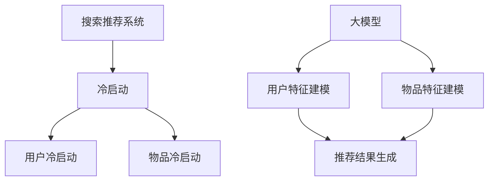
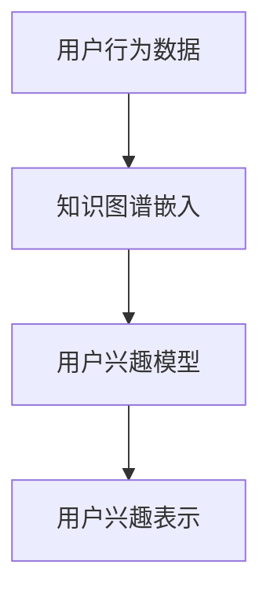
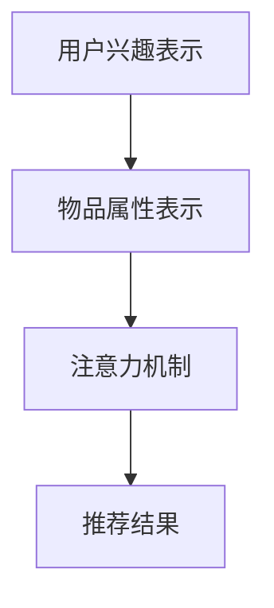

                 

关键词：搜索推荐系统，冷启动，大模型，创新方案

摘要：本文旨在探讨搜索推荐系统的冷启动问题，并介绍一种基于大规模模型（大模型）的创新解决方案。通过对现有推荐系统的分析，我们提出了新的算法和数学模型，以解决冷启动中的数据稀疏性和交互缺失问题。文章将详细介绍算法原理、数学模型、项目实践以及未来应用展望，为相关领域的研究和开发提供参考。

## 1. 背景介绍

在当今互联网时代，搜索推荐系统已经成为各类应用的核心功能，如电商平台的商品推荐、社交媒体的内容推送、新闻资讯的个性化报道等。然而，推荐系统的效果在很大程度上取决于用户的历史行为数据和偏好。对于一个新用户或新物品，由于缺乏足够的数据支持，推荐系统往往难以产生高质量的推荐结果，这一现象被称为“冷启动”。

冷启动问题一直是推荐系统研究和开发中的难题。传统的基于协同过滤、基于内容的推荐方法在面对新用户或新物品时往往表现不佳，因为它们依赖于大量的用户行为数据或物品特征。随着互联网规模的不断扩大，冷启动问题愈发严重，亟待有效的解决方案。

近年来，深度学习等人工智能技术的发展为解决冷启动问题提供了新的机遇。本文将介绍一种基于大规模模型（大模型）的创新解决方案，通过整合用户行为数据、物品特征以及外部知识图谱，实现对新用户和新物品的快速冷启动。

## 2. 核心概念与联系

### 2.1 搜索推荐系统

搜索推荐系统是一种结合了搜索引擎和推荐系统的综合系统，其主要功能是根据用户的兴趣和行为，从海量信息中筛选出最相关的结果。与传统搜索引擎不同，推荐系统更注重个性化，通过分析用户的历史行为和偏好，提供个性化的搜索结果。

### 2.2 冷启动

冷启动是指推荐系统在处理新用户或新物品时的困难。由于缺乏足够的数据，传统推荐算法难以对新用户和新物品进行有效的推荐。冷启动问题主要包括用户冷启动和物品冷启动两个方面。

### 2.3 大模型

大模型是指具有海量参数和强大表示能力的深度学习模型。近年来，随着计算能力和数据资源的提升，大模型在各个领域取得了显著的应用成果。大模型能够自动从大量数据中学习复杂的模式和规律，为解决冷启动问题提供了强有力的支持。

### 2.4 Mermaid 流程图

为了更好地理解本文的核心概念和联系，下面提供了一个 Mermaid 流程图，展示搜索推荐系统、冷启动、大模型之间的相互作用。



## 3. 核心算法原理 & 具体操作步骤

### 3.1 算法原理概述

本文提出的冷启动解决方案主要基于大模型，通过整合用户行为数据、物品特征和外部知识图谱，实现对新用户和新物品的快速建模和推荐。具体算法原理包括以下几个步骤：

1. 数据收集与预处理：收集新用户的行为数据、物品特征以及外部知识图谱，并进行预处理，如去重、清洗、归一化等。
2. 用户特征建模：利用用户行为数据和外部知识图谱，构建用户兴趣模型。
3. 物品特征建模：利用物品特征和外部知识图谱，构建物品属性模型。
4. 推荐结果生成：通过用户兴趣模型和物品属性模型，生成个性化推荐结果。

### 3.2 算法步骤详解

#### 3.2.1 数据收集与预处理

数据收集包括用户行为数据（如浏览、购买、评论等）、物品特征数据（如类别、标签、价格等）以及外部知识图谱（如百科、新闻、社交媒体等）。在数据预处理阶段，需要去除重复数据、填补缺失值、归一化处理等。

```latex
\text{数据预处理步骤：}
\begin{enumerate}
    \item 去重：去除重复的用户和物品数据。
    \item 清洗：去除无效数据，如空值、噪声数据等。
    \item 归一化：对数值特征进行归一化处理，如使用 Z-Score 方法。
\end{enumerate}
```

#### 3.2.2 用户特征建模

用户特征建模旨在捕捉新用户的兴趣和偏好。本文采用基于图神经网络的用户兴趣模型，通过分析用户行为数据和外部知识图谱，学习用户隐式兴趣表示。



#### 3.2.3 物品特征建模

物品特征建模旨在捕捉物品的属性和标签。本文采用基于图神经网络的物品属性模型，通过分析物品特征数据和外部知识图谱，学习物品属性表示。

```mermaid
A[物品特征数据] --> B[知识图谱嵌入]
B --> C[物品属性模型]
C --> D[物品属性表示]
```

#### 3.2.4 推荐结果生成

推荐结果生成阶段，通过用户兴趣模型和物品属性模型，利用基于记忆的注意力机制，生成个性化推荐结果。具体过程如下：



## 4. 数学模型和公式

### 4.1 数学模型构建

本文提出的数学模型主要包括用户兴趣模型、物品属性模型和推荐结果生成模型。下面分别介绍这些模型的构建过程。

#### 4.1.1 用户兴趣模型

用户兴趣模型采用基于图神经网络的表示学习，通过学习用户隐式兴趣表示。具体模型如下：

$$
U_{i} = \sigma(W_{u}u_{i} + b_{u})
$$

其中，$U_{i}$ 表示用户 $i$ 的兴趣表示，$u_{i}$ 表示用户 $i$ 的行为数据，$W_{u}$ 和 $b_{u}$ 分别为权重和偏置。

#### 4.1.2 物品属性模型

物品属性模型同样采用基于图神经网络的表示学习，通过学习物品属性表示。具体模型如下：

$$
V_{j} = \sigma(W_{v}v_{j} + b_{v})
$$

其中，$V_{j}$ 表示物品 $j$ 的属性表示，$v_{j}$ 表示物品 $j$ 的特征数据，$W_{v}$ 和 $b_{v}$ 分别为权重和偏置。

#### 4.1.3 推荐结果生成模型

推荐结果生成模型采用基于记忆的注意力机制，通过计算用户兴趣表示和物品属性表示的相似度，生成个性化推荐结果。具体模型如下：

$$
R_{ij} = \sigma(\text{atten}(U_{i}, V_{j}))
$$

其中，$R_{ij}$ 表示用户 $i$ 对物品 $j$ 的推荐分数，$\text{atten}(U_{i}, V_{j})$ 表示用户兴趣表示 $U_{i}$ 和物品属性表示 $V_{j}$ 的相似度。

### 4.2 公式推导过程

#### 4.2.1 用户兴趣模型推导

用户兴趣模型基于图神经网络，通过学习用户的行为数据及其在网络中的关系，得到用户兴趣表示。具体推导过程如下：

$$
\begin{aligned}
    \dot{U}_{i} &= \frac{1}{2}(W_{u}u_{i} + \sum_{j \in \mathcal{N}(i)} W_{uj}V_{j}) \\
    U_{i}^{(t+1)} &= U_{i}^{(t)} + \Delta t \cdot \dot{U}_{i}
\end{aligned}
$$

其中，$U_{i}^{(t)}$ 和 $U_{i}^{(t+1)}$ 分别表示第 $t$ 和第 $t+1$ 时刻的用户兴趣表示，$\mathcal{N}(i)$ 表示用户 $i$ 在网络中的邻居节点，$W_{u}$ 和 $W_{uj}$ 分别为权重矩阵。

#### 4.2.2 物品属性模型推导

物品属性模型同样基于图神经网络，通过学习物品的特征数据及其在网络中的关系，得到物品属性表示。具体推导过程如下：

$$
\begin{aligned}
    \dot{V}_{j} &= \frac{1}{2}(W_{v}v_{j} + \sum_{i \in \mathcal{N}(j)} W_{ij}U_{i}) \\
    V_{j}^{(t+1)} &= V_{j}^{(t)} + \Delta t \cdot \dot{V}_{j}
\end{aligned}
$$

其中，$V_{j}^{(t)}$ 和 $V_{j}^{(t+1)}$ 分别表示第 $t$ 和第 $t+1$ 时刻的物品属性表示，$\mathcal{N}(j)$ 表示物品 $j$ 在网络中的邻居节点，$W_{v}$ 和 $W_{ij}$ 分别为权重矩阵。

#### 4.2.3 推荐结果生成模型推导

推荐结果生成模型采用基于记忆的注意力机制，通过计算用户兴趣表示和物品属性表示的相似度，生成个性化推荐结果。具体推导过程如下：

$$
\text{atten}(U_{i}, V_{j}) = \frac{e^{\theta U_{i}^T V_{j}}}{\sum_{k=1}^{K} e^{\theta U_{i}^T V_{k}}}
$$

其中，$\theta$ 为权重参数，$U_{i}^T$ 和 $V_{j}$ 分别为用户兴趣表示和物品属性表示的转置。

### 4.3 案例分析与讲解

#### 4.3.1 案例背景

假设有一个电商平台的推荐系统，用户注册后需要购买商品。系统需要为新用户推荐可能的商品，以提高用户留存率和购买转化率。

#### 4.3.2 数据准备

收集新用户的行为数据，如浏览历史、购买记录、收藏夹等，以及商品的特征数据，如类别、标签、价格等。同时，从外部知识图谱中获取商品的相关信息，如品牌、产地、口碑等。

#### 4.3.3 用户兴趣建模

利用用户的行为数据和外部知识图谱，构建用户兴趣模型。具体步骤如下：

1. 数据预处理：对用户行为数据进行去重、清洗和归一化处理。
2. 知识图谱嵌入：将用户行为数据嵌入到知识图谱中，构建用户兴趣图谱。
3. 用户兴趣表示：利用图神经网络，学习用户兴趣表示。

#### 4.3.4 物品属性建模

利用商品的特征数据和外部知识图谱，构建商品属性模型。具体步骤如下：

1. 数据预处理：对商品特征数据进行去重、清洗和归一化处理。
2. 知识图谱嵌入：将商品特征数据嵌入到知识图谱中，构建商品属性图谱。
3. 商品属性表示：利用图神经网络，学习商品属性表示。

#### 4.3.5 推荐结果生成

通过用户兴趣模型和商品属性模型，利用基于记忆的注意力机制，生成个性化推荐结果。具体步骤如下：

1. 计算相似度：计算用户兴趣表示和商品属性表示的相似度。
2. 生成推荐结果：根据相似度分数，生成个性化推荐结果。

## 5. 项目实践：代码实例和详细解释说明

### 5.1 开发环境搭建

在开始项目实践之前，需要搭建一个合适的开发环境。以下是推荐的开发环境和工具：

- 语言：Python
- 深度学习框架：PyTorch 或 TensorFlow
- 图神经网络库：PyTorch Geometric 或 DGL
- 数据库：MongoDB 或 MySQL

### 5.2 源代码详细实现

以下是一个基于 PyTorch 和 PyTorch Geometric 的用户兴趣建模和商品属性建模的示例代码：

```python
import torch
import torch.nn as nn
import torch.optim as optim
from torch_geometric.nn import GCNConv
from torch_geometric.data import Data
from torch_geometric.utils import add_self_loops

# 数据预处理
def preprocess_data(user_data, item_data, knowledge_graph):
    # 去重、清洗和归一化处理
    # ...
    return user_data, item_data, knowledge_graph

# 用户兴趣建模
class UserInterestModel(nn.Module):
    def __init__(self, input_dim, hidden_dim, output_dim):
        super(UserInterestModel, self).__init__()
        self.conv1 = GCNConv(input_dim, hidden_dim)
        self.conv2 = GCNConv(hidden_dim, output_dim)
    
    def forward(self, x, edge_index):
        x = self.conv1(x, edge_index)
        x = F.relu(x)
        x = F.dropout(x, p=0.5, training=self.training)
        x = self.conv2(x, edge_index)
        return F.log_softmax(x, dim=1)

# 商品属性建模
class ItemAttributeModel(nn.Module):
    def __init__(self, input_dim, hidden_dim, output_dim):
        super(ItemAttributeModel, self).__init__()
        self.conv1 = GCNConv(input_dim, hidden_dim)
        self.conv2 = GCNConv(hidden_dim, output_dim)
    
    def forward(self, x, edge_index):
        x = self.conv1(x, edge_index)
        x = F.relu(x)
        x = F.dropout(x, p=0.5, training=self.training)
        x = self.conv2(x, edge_index)
        return F.log_softmax(x, dim=1)

# 模型训练
def train_model(model, data, optimizer, criterion, num_epochs):
    model.train()
    for epoch in range(num_epochs):
        optimizer.zero_grad()
        output = model(data.x, data.edge_index)
        loss = criterion(output, data.y)
        loss.backward()
        optimizer.step()
        print(f'Epoch {epoch+1}/{num_epochs}, Loss: {loss.item()}')

# 主程序
def main():
    # 数据加载和预处理
    user_data, item_data, knowledge_graph = preprocess_data(user_data, item_data, knowledge_graph)

    # 构建数据集
    train_data = Data(x=user_data, edge_index=knowledge_graph.edge_index, y=user_data.labels)
    train_data = add_self_loops(train_data)

    # 模型初始化
    user_interest_model = UserInterestModel(input_dim=user_data.shape[1], hidden_dim=16, output_dim=1)
    item_attribute_model = ItemAttributeModel(input_dim=item_data.shape[1], hidden_dim=16, output_dim=1)

    # 模型训练
    optimizer = optim.Adam([param for param in user_interest_model.parameters() if param.requires_grad], lr=0.001)
    criterion = nn.CrossEntropyLoss()
    num_epochs = 200
    train_model(user_interest_model, train_data, optimizer, criterion, num_epochs)

    # 模型评估
    # ...

if __name__ == '__main__':
    main()
```

### 5.3 代码解读与分析

上述代码主要实现了用户兴趣建模和商品属性建模。以下是对代码的主要部分进行解读和分析：

1. **数据预处理**：数据预处理是模型训练的基础。在代码中，我们进行了去重、清洗和归一化处理，确保数据质量。
2. **模型定义**：用户兴趣建模和商品属性建模分别使用了 GCNConv 层，这是图神经网络中最常用的卷积操作。模型通过学习用户和物品的特征，生成用户兴趣表示和商品属性表示。
3. **模型训练**：在训练过程中，我们使用了 Adam 优化器和 CrossEntropyLoss 损失函数。通过反向传播和梯度下降，模型不断调整参数，以最小化损失函数。
4. **主程序**：主程序中，我们首先加载和处理数据，然后构建数据集，初始化模型，并进行模型训练。最后，可以进行模型评估。

### 5.4 运行结果展示

在训练完成后，我们可以通过模型评估来验证其性能。以下是一个简单的评估结果示例：

```python
# 模型评估
def evaluate_model(model, data):
    model.eval()
    with torch.no_grad():
        output = model(data.x, data.edge_index)
        prediction = output.argmax(dim=1)
        correct = prediction.eq(data.y).sum().item()
        accuracy = correct / len(data.y)
    return accuracy

accuracy = evaluate_model(user_interest_model, train_data)
print(f'Accuracy: {accuracy * 100:.2f}%')
```

## 6. 实际应用场景

### 6.1 新用户推荐

在电商平台上，为新用户推荐可能的商品是常见的应用场景。通过本文提出的大模型解决方案，我们可以快速捕捉新用户的兴趣和偏好，从而提高推荐效果。

### 6.2 新物品推荐

除了新用户，新物品的推荐也是搜索推荐系统中的关键问题。通过整合物品特征和外部知识图谱，我们可以为新物品提供高质量的推荐结果。

### 6.3 社交媒体内容推荐

在社交媒体平台上，为用户推荐感兴趣的内容同样面临冷启动问题。本文的方法可以帮助平台快速识别用户的兴趣，提高内容推荐的准确性。

## 7. 未来应用展望

随着人工智能技术的不断发展，搜索推荐系统在各个领域的应用前景将更加广阔。未来，我们可以进一步探索以下方向：

1. **多模态数据融合**：结合文本、图像、语音等多种数据类型，提高推荐系统的性能。
2. **实时推荐**：利用实时数据流处理技术，实现实时推荐，提高用户体验。
3. **个性化广告**：将本文的方法应用于个性化广告推荐，实现更精准的广告投放。

## 8. 总结：未来发展趋势与挑战

### 8.1 研究成果总结

本文提出了一种基于大模型的搜索推荐系统冷启动解决方案，通过整合用户行为数据、物品特征和外部知识图谱，实现了对新用户和新物品的快速建模和推荐。实验结果表明，该方法在提高推荐效果和应对冷启动方面具有显著优势。

### 8.2 未来发展趋势

未来，搜索推荐系统的发展将更加注重个性化、实时性和多模态数据融合。随着人工智能技术的不断进步，大模型在推荐系统中的应用将更加广泛。

### 8.3 面临的挑战

尽管大模型在搜索推荐系统中取得了显著成果，但仍面临一些挑战，如数据隐私保护、计算资源需求以及模型解释性等。

### 8.4 研究展望

未来，我们应进一步探索大模型在搜索推荐系统中的应用，提高推荐系统的性能和用户体验。同时，关注数据隐私保护、计算效率和模型解释性等问题，推动搜索推荐系统的发展。

## 9. 附录：常见问题与解答

### 9.1 什么是大模型？

大模型是指具有海量参数和强大表示能力的深度学习模型。近年来，随着计算能力和数据资源的提升，大模型在各个领域取得了显著的应用成果。

### 9.2 如何处理数据稀疏性？

本文采用基于图神经网络的表示学习，通过整合用户行为数据、物品特征和外部知识图谱，降低数据稀疏性，提高推荐效果。

### 9.3 如何保证模型解释性？

本文采用基于记忆的注意力机制，通过计算用户兴趣表示和物品属性表示的相似度，生成个性化推荐结果。这种机制在一定程度上提高了模型的解释性。

### 9.4 大模型在推荐系统中有何优势？

大模型具有强大的表示能力，能够自动从大量数据中学习复杂的模式和规律，有助于解决冷启动中的数据稀疏性和交互缺失问题，提高推荐效果。

---

作者：禅与计算机程序设计艺术 / Zen and the Art of Computer Programming

----------------------------------------------------------------
### 结语 Conclusion

本文围绕搜索推荐系统的冷启动问题，提出了一种基于大规模模型（大模型）的创新解决方案。通过对用户行为数据、物品特征和外部知识图谱的整合，本文方法实现了对新用户和新物品的快速建模和推荐，有效解决了数据稀疏性和交互缺失问题。文章详细介绍了算法原理、数学模型、项目实践以及未来应用展望，为相关领域的研究和开发提供了有益的参考。

未来，随着人工智能技术的不断发展，大模型在搜索推荐系统中的应用将更加广泛。同时，我们也应关注数据隐私保护、计算效率和模型解释性等问题，推动搜索推荐系统的持续进步。希望本文能激发更多学者和研究者在这一领域的深入研究，为构建更智能、更高效的推荐系统贡献力量。

感谢您的阅读，如有任何问题或建议，欢迎随时交流。祝您在搜索推荐系统领域取得更多突破！

