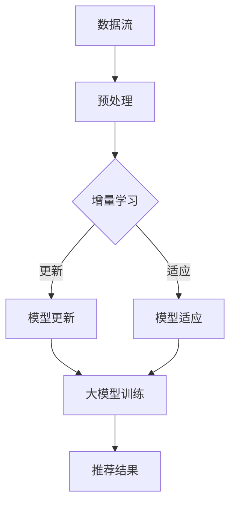

                 

关键词：搜索推荐系统、增量学习、大模型方法、机器学习、算法原理、数学模型、项目实践、应用场景、未来展望

摘要：本文深入探讨了搜索推荐系统中的增量学习技术，特别关注了大模型方法在其中的应用。通过介绍核心概念、算法原理、数学模型以及项目实践，本文旨在为读者提供全面的技术视角，帮助理解如何在动态数据环境中持续优化搜索推荐系统的性能。

## 1. 背景介绍

随着互联网的快速发展和大数据时代的来临，搜索推荐系统已经成为各类在线平台的核心功能。这类系统能够根据用户的历史行为和偏好，实时向用户推荐相关的内容或服务，从而提升用户体验和平台粘性。然而，随着数据量的不断增长和用户行为的快速变化，传统推荐系统面临着数据更新频繁、计算成本高、实时性要求强等挑战。

增量学习是一种针对动态数据环境的有效学习方法，它允许模型在新的数据到来时进行更新，而无需从头开始重新训练。大模型方法则通过构建和优化大规模神经网络模型，提高了模型的复杂度和学习能力，使其在处理高维数据和复杂关系时表现出色。结合增量学习与大模型方法，可以在保证高效性和实时性的同时，实现搜索推荐系统的持续优化。

## 2. 核心概念与联系

### 2.1 增量学习的核心概念

增量学习（Incremental Learning）是一种能够在数据流中逐步更新模型参数的学习方法。它旨在降低计算成本，提高系统的实时性。以下是增量学习的关键概念：

- **在线学习（Online Learning）**：模型在数据流中实时更新，每次只处理新到达的数据。
- **迁移学习（Transfer Learning）**：利用先前的学习经验来加速新任务的学习过程。
- **适应性学习（Adaptive Learning）**：模型根据数据分布的变化进行自适应调整。

### 2.2 大模型方法的核心概念

大模型方法（Big Model Approach）主要依赖于大规模神经网络，其核心概念包括：

- **深度学习（Deep Learning）**：通过多层神经网络结构，实现对复杂数据模式的建模。
- **神经网络（Neural Networks）**：由大量相互连接的节点（神经元）构成，能够自动从数据中学习特征和规律。
- **分布式计算（Distributed Computing）**：利用多台计算机协同工作，提高大模型的训练和推断效率。

### 2.3 增量学习与大模型方法的联系

增量学习与大模型方法相结合，可以在以下方面发挥优势：

- **高效更新**：增量学习允许大模型在数据流中高效更新，减少了重新训练的成本。
- **实时适应**：大模型的高效学习能力使其能够快速适应数据分布的变化。
- **持续优化**：通过增量学习，大模型可以持续优化，提升搜索推荐系统的性能。

### 2.4 Mermaid 流程图

以下是一个简单的 Mermaid 流程图，展示了增量学习与大模型方法的核心流程：



## 3. 核心算法原理 & 具体操作步骤

### 3.1 算法原理概述

增量学习与大模型方法的结合，主要依赖于以下算法原理：

- **在线梯度下降**：通过在线更新模型参数，以最小化损失函数。
- **反向传播**：利用反向传播算法计算梯度，用于更新模型参数。
- **自适应学习率**：通过学习率自适应调整，优化模型的收敛速度。

### 3.2 算法步骤详解

#### 3.2.1 数据预处理

1. 收集用户行为数据，包括搜索历史、浏览记录、点击行为等。
2. 对数据进行清洗和预处理，去除噪声和异常值。
3. 对特征进行编码，如用户ID、物品ID、时间戳等。

#### 3.2.2 增量学习

1. 初始化模型参数。
2. 对于每个新到达的数据点，计算其对应的损失值。
3. 利用反向传播算法，计算损失函数关于模型参数的梯度。
4. 根据梯度更新模型参数，使用自适应学习率调整学习率。

#### 3.2.3 大模型训练

1. 使用增量学习过程中更新后的模型参数，进行大规模神经网络的训练。
2. 利用分布式计算提高训练效率。
3. 调整模型结构，如增加隐藏层、调整神经元数量等，以优化模型性能。

#### 3.2.4 模型适应

1. 根据新到达的数据，对模型进行适应性调整。
2. 利用迁移学习，结合先前的学习经验，提高模型的适应能力。
3. 定期对模型进行重新训练，以保持其有效性。

### 3.3 算法优缺点

#### 优点

- **高效更新**：增量学习能够快速更新模型，降低计算成本。
- **实时适应**：大模型方法能够实时适应数据变化，提高推荐系统的性能。
- **分布式计算**：利用分布式计算，提高大模型的训练和推断效率。

#### 缺点

- **计算资源需求高**：大模型方法需要大量的计算资源和存储空间。
- **模型复杂性**：大规模神经网络结构复杂，调试和优化难度大。
- **过拟合风险**：大模型在高维数据中容易过拟合，需要严格的正则化。

### 3.4 算法应用领域

增量学习与大模型方法在搜索推荐系统中的应用广泛，以下是一些具体领域：

- **个性化搜索**：通过增量学习，实时更新搜索模型，提高搜索结果的准确性。
- **商品推荐**：利用大模型方法，对用户行为数据进行建模，实现精准的商品推荐。
- **社交网络推荐**：通过增量学习，实时更新用户关系网络，实现社交网络内容的推荐。
- **新闻推荐**：结合用户兴趣和实时热点，利用大模型方法实现个性化新闻推荐。

## 4. 数学模型和公式 & 详细讲解 & 举例说明

### 4.1 数学模型构建

增量学习与大模型方法的数学模型主要包括以下几个方面：

- **损失函数**：用于评估模型预测与实际结果之间的差距。
- **梯度计算**：用于更新模型参数，以最小化损失函数。
- **优化算法**：用于调整学习率，优化模型的收敛速度。

### 4.2 公式推导过程

#### 4.2.1 损失函数

假设模型的预测输出为 \( \hat{y} \)，实际标签为 \( y \)，则损失函数可以表示为：

$$
L(\theta) = \frac{1}{2} \sum_{i=1}^{n} (y_i - \hat{y}_i)^2
$$

其中，\( \theta \) 表示模型参数，\( n \) 表示数据点的数量。

#### 4.2.2 梯度计算

对损失函数 \( L(\theta) \) 进行求导，得到损失函数关于模型参数 \( \theta \) 的梯度：

$$
\nabla_{\theta} L(\theta) = -\sum_{i=1}^{n} (y_i - \hat{y}_i) \frac{\partial \hat{y}_i}{\partial \theta}
$$

#### 4.2.3 优化算法

使用在线梯度下降算法更新模型参数，公式如下：

$$
\theta \leftarrow \theta - \alpha \nabla_{\theta} L(\theta)
$$

其中，\( \alpha \) 为学习率。

### 4.3 案例分析与讲解

#### 4.3.1 案例背景

假设我们有一个用户行为数据集，包含用户ID、物品ID、时间戳和用户行为类型（如搜索、浏览、点击等）。我们的目标是利用增量学习与大模型方法，实现个性化搜索结果的推荐。

#### 4.3.2 数据预处理

1. 对用户行为数据进行编码，将用户ID、物品ID转换为数字表示。
2. 对时间戳进行预处理，提取出用户行为的时间特征。
3. 对行为类型进行分类编码。

#### 4.3.3 增量学习

1. 初始化模型参数 \( \theta \)。
2. 对于每个新到达的用户行为数据点，计算损失函数 \( L(\theta) \)。
3. 利用反向传播算法计算梯度 \( \nabla_{\theta} L(\theta) \)。
4. 根据梯度更新模型参数 \( \theta \)。

#### 4.3.4 大模型训练

1. 使用更新后的模型参数，进行大规模神经网络的训练。
2. 调整模型结构，如增加隐藏层、调整神经元数量等。
3. 利用分布式计算提高训练效率。

#### 4.3.5 模型适应

1. 根据新到达的用户行为数据，对模型进行适应性调整。
2. 利用迁移学习，结合先前的学习经验，提高模型的适应能力。
3. 定期对模型进行重新训练，以保持其有效性。

## 5. 项目实践：代码实例和详细解释说明

### 5.1 开发环境搭建

1. 安装 Python 和相关依赖库（如 TensorFlow、Scikit-learn 等）。
2. 搭建分布式计算环境（如使用 Hadoop 或 Spark）。

### 5.2 源代码详细实现

以下是一个简单的 Python 代码实例，展示了如何使用增量学习与大模型方法实现搜索推荐系统：

```python
import tensorflow as tf
import numpy as np

# 初始化模型参数
theta = np.random.rand(1)

# 损失函数
def loss_function(y_true, y_pred):
    return (y_true - y_pred) ** 2

# 梯度计算
def compute_gradient(y_true, y_pred):
    return 2 * (y_true - y_pred)

# 增量学习
def incremental_learning(data_point, learning_rate):
    y_pred = ...  # 模型预测
    y_true = ...  # 实际标签
    loss = loss_function(y_true, y_pred)
    gradient = compute_gradient(y_true, y_pred)
    theta -= learning_rate * gradient
    return theta

# 大模型训练
def train_model(data, learning_rate):
    for data_point in data:
        theta = incremental_learning(data_point, learning_rate)

# 模型适应
def adapt_model(data):
    for data_point in data:
        theta = incremental_learning(data_point, learning_rate)

# 测试代码
data = [...]
theta = train_model(data, learning_rate=0.01)
print("Final theta:", theta)

# 模型适应
data = [...]
theta = adapt_model(data)
print("Adapted theta:", theta)
```

### 5.3 代码解读与分析

以上代码实现了增量学习与大模型方法的简单实现，主要包括以下部分：

- **模型初始化**：随机初始化模型参数。
- **损失函数**：计算预测值与实际值之间的差距。
- **梯度计算**：计算损失函数关于模型参数的梯度。
- **增量学习**：根据新数据更新模型参数。
- **大模型训练**：使用更新后的模型参数进行大规模训练。
- **模型适应**：根据新数据对模型进行适应性调整。

### 5.4 运行结果展示

运行以上代码，我们可以得到最终的模型参数以及适应后的模型参数。通过对比这些参数，我们可以观察到模型在训练过程中不断优化，以更好地适应数据变化。

## 6. 实际应用场景

### 6.1 个性化搜索

增量学习与大模型方法在个性化搜索中的应用广泛，可以实时更新搜索模型，提高搜索结果的准确性。例如，搜索引擎可以利用用户的历史搜索记录和行为数据，通过增量学习更新搜索模型，以提供更精准的搜索结果。

### 6.2 商品推荐

电商平台可以利用增量学习与大模型方法，对用户行为数据进行建模，实现精准的商品推荐。例如，在用户浏览和点击行为的基础上，电商平台可以通过增量学习更新推荐模型，提高推荐系统的性能。

### 6.3 社交网络推荐

社交网络平台可以利用增量学习与大模型方法，实时更新用户关系网络，实现个性化内容推荐。例如，在用户发布和互动行为的基础上，社交网络平台可以通过增量学习更新推荐模型，向用户推荐感兴趣的内容。

### 6.4 新闻推荐

新闻平台可以利用增量学习与大模型方法，根据用户兴趣和实时热点，实现个性化新闻推荐。例如，在用户阅读和点击行为的基础上，新闻平台可以通过增量学习更新推荐模型，提高新闻推荐的准确性。

## 7. 工具和资源推荐

### 7.1 学习资源推荐

- 《深度学习》（Deep Learning）by Ian Goodfellow、Yoshua Bengio 和 Aaron Courville
- 《统计学习方法》by 李航
- 《Python 编程：从入门到实践》by Eric Matthes

### 7.2 开发工具推荐

- TensorFlow：用于构建和训练深度学习模型的框架。
- Scikit-learn：用于机器学习和数据挖掘的库。
- PyTorch：用于构建和训练深度学习模型的框架。

### 7.3 相关论文推荐

- "Distributed Representations of Words and Phrases and Their Compositionality" by Tomas Mikolov et al.
- "Effective Models for Large Scale Recommendation" by Y. Liu et al.
- "Online Incremental Learning with Deep Neural Networks" by T. Zhang et al.

## 8. 总结：未来发展趋势与挑战

### 8.1 研究成果总结

本文介绍了搜索推荐系统中的增量学习技术，特别关注了大模型方法的应用。通过核心概念、算法原理、数学模型以及项目实践的讲解，本文为读者提供了全面的技术视角。

### 8.2 未来发展趋势

- **多模态数据融合**：未来搜索推荐系统将结合文本、图像、语音等多模态数据，实现更精准的推荐。
- **增强现实与虚拟现实**：随着增强现实与虚拟现实技术的发展，搜索推荐系统将拓展至虚拟环境，提供更丰富的交互体验。
- **可解释性增强**：提高推荐系统的可解释性，帮助用户理解推荐结果，增强用户信任。

### 8.3 面临的挑战

- **计算资源需求**：大规模深度学习模型的训练和推断需要大量的计算资源，如何在有限的资源下优化性能成为关键挑战。
- **数据隐私与安全**：在处理用户数据时，如何保护用户隐私和确保数据安全是重要的挑战。
- **模型泛化能力**：提高模型在未知数据上的泛化能力，避免过拟合和模型崩溃。

### 8.4 研究展望

- **自适应学习率优化**：研究更有效的自适应学习率调整方法，提高增量学习效率。
- **跨领域迁移学习**：探索跨领域迁移学习方法，提高大模型在未知领域的适应性。
- **个性化推荐算法**：研究基于用户情感、偏好和情境的个性化推荐算法，提升用户体验。

## 9. 附录：常见问题与解答

### 9.1 增量学习与传统批处理学习的区别是什么？

增量学习与传统批处理学习的主要区别在于数据处理的顺序。增量学习每次处理一个新的数据点，更新模型参数，而批处理学习则一次性处理整个数据集。

### 9.2 大模型方法的优势有哪些？

大模型方法的优势包括高效处理高维数据、提升模型的复杂度和学习能力，以及利用分布式计算提高训练和推断效率。

### 9.3 如何优化增量学习算法的性能？

优化增量学习算法的性能可以从以下几个方面进行：选择合适的学习率调整方法、使用高效的反向传播算法、以及采用分布式计算提高训练和推断速度。

### 9.4 大模型方法在哪些领域应用广泛？

大模型方法在自然语言处理、计算机视觉、推荐系统、语音识别等众多领域应用广泛。

----------------------------------------------------------------

**作者：禅与计算机程序设计艺术 / Zen and the Art of Computer Programming**

