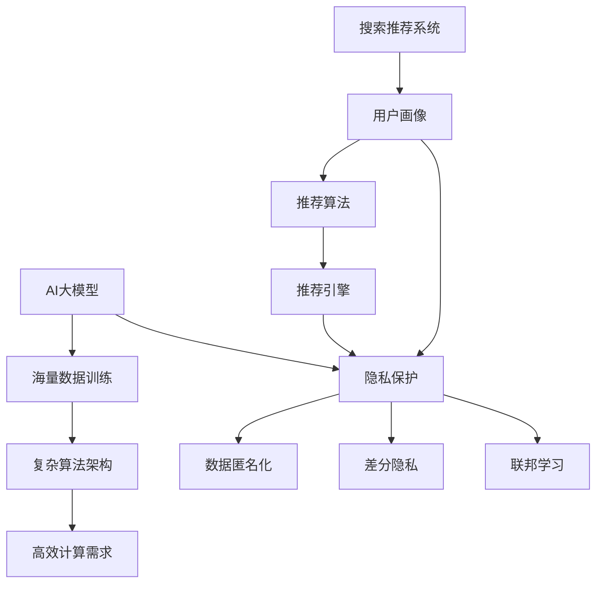

                 

 关键词：搜索推荐系统、隐私保护、AI大模型、安全设计、用户数据、数据加密、联邦学习、差分隐私、模型压缩、计算性能优化、安全性分析、算法创新

> 摘要：本文深入探讨了搜索推荐系统在隐私保护与AI大模型技术方面的挑战与解决方案。通过分析当前隐私保护技术，我们探讨了如何在保障用户隐私的同时，实现高效推荐。同时，本文详细介绍了AI大模型的设计原则、训练方法和优化策略，旨在为相关领域的研究者和开发者提供有价值的参考。

## 1. 背景介绍

随着互联网和大数据技术的快速发展，搜索推荐系统已成为现代信息检索的重要组成部分。这类系统通过分析用户的搜索历史、行为数据，向用户推荐可能感兴趣的内容，从而提高用户体验和满意度。然而，搜索推荐系统的隐私问题也逐渐暴露出来，用户数据泄露、滥用等事件频繁发生，引发了广泛关注和担忧。

近年来，人工智能（AI）大模型在自然语言处理、计算机视觉等领域取得了显著进展，这些模型通常涉及海量数据的训练和复杂算法的应用。然而，AI大模型的发展也带来了新的隐私挑战，如何在保护用户隐私的前提下，高效训练和部署这些模型，成为了亟待解决的问题。

面对隐私保护与AI大模型的挑战，本文旨在探讨以下问题：

1. 搜索推荐系统中用户隐私保护的现状与问题。
2. 针对隐私保护，目前有哪些技术手段和方法。
3. AI大模型的设计原则、训练方法和优化策略。
4. 如何在保证隐私保护的前提下，实现高效的搜索推荐系统。

## 2. 核心概念与联系

### 2.1 搜索推荐系统

搜索推荐系统通常包括以下核心组件：

1. **用户画像**：通过分析用户的搜索历史、行为数据，构建用户画像，为个性化推荐提供基础。
2. **推荐算法**：基于用户画像，使用协同过滤、内容推荐等算法，生成推荐结果。
3. **推荐引擎**：将推荐算法应用于实际场景，动态更新推荐列表，为用户提供个性化推荐服务。

### 2.2 AI大模型

AI大模型通常具有以下特点：

1. **海量数据训练**：需要大量高质量的数据进行训练，以实现高精度预测。
2. **复杂算法架构**：采用深度学习、图神经网络等复杂算法架构，以应对多样化应用场景。
3. **高效计算需求**：需要高性能计算资源，以支持大规模数据处理和模型训练。

### 2.3 隐私保护

隐私保护是指在数据处理过程中，确保用户数据安全、避免数据泄露和滥用的措施。隐私保护的核心概念包括：

1. **数据匿名化**：通过数据脱敏、加密等技术，确保用户数据在传输和存储过程中无法被直接识别。
2. **差分隐私**：通过在数据处理过程中添加噪声，降低个体数据被识别的风险。
3. **联邦学习**：通过分布式学习技术，将数据留在本地进行处理，避免数据集中化。

下面是一个简单的 Mermaid 流程图，展示了搜索推荐系统、AI大模型和隐私保护之间的联系：



## 3. 核心算法原理 & 具体操作步骤

### 3.1 算法原理概述

隐私保护与搜索推荐系统、AI大模型密切相关。隐私保护的核心算法包括：

1. **数据匿名化**：通过脱敏、加密等技术，将用户数据转换为不可识别的形式。
2. **差分隐私**：在数据处理过程中添加噪声，以降低个体数据被识别的风险。
3. **联邦学习**：通过分布式学习技术，实现数据本地化处理，避免数据集中化。

### 3.2 算法步骤详解

#### 3.2.1 数据匿名化

数据匿名化主要包括以下步骤：

1. **数据脱敏**：通过替换、掩码等技术，将敏感信息（如姓名、地址等）替换为不可识别的标识。
2. **数据加密**：使用加密算法（如AES、RSA等），对敏感数据进行加密，确保数据在传输和存储过程中安全。
3. **隐私剪枝**：删除或合并部分数据，以降低隐私风险。

#### 3.2.2 差分隐私

差分隐私主要包括以下步骤：

1. **噪声添加**：在数据处理过程中添加噪声，使数据处理结果不确定。
2. **隐私预算**：设定隐私预算（如ε值），以控制噪声添加的强度。
3. **隐私损失评估**：评估噪声添加对数据处理结果的影响，确保隐私保护效果。

#### 3.2.3 联邦学习

联邦学习主要包括以下步骤：

1. **数据本地化**：将数据留在本地进行处理，避免数据集中化。
2. **模型更新**：通过梯度聚合、模型共享等技术，实现模型更新。
3. **隐私保护**：在模型更新过程中，采用差分隐私、数据加密等技术，确保隐私保护。

### 3.3 算法优缺点

#### 数据匿名化

**优点**：

1. 简单易实现，成本低。
2. 可以有效保护用户隐私。

**缺点**：

1. 可能会影响数据的可用性和准确性。
2. 对大规模数据的处理效果有限。

#### 差分隐私

**优点**：

1. 可以有效降低隐私风险。
2. 可以适应不同规模的数据处理。

**缺点**：

1. 可能会影响数据处理结果的准确性。
2. 需要设定合适的隐私预算。

#### 联邦学习

**优点**：

1. 可以有效保护用户隐私。
2. 可以提高数据处理效率。

**缺点**：

1. 需要解决模型更新、数据一致性等问题。
2. 对计算资源要求较高。

### 3.4 算法应用领域

隐私保护算法在搜索推荐系统、AI大模型等领域具有广泛的应用前景：

1. **搜索推荐系统**：通过隐私保护技术，实现个性化推荐，提高用户体验。
2. **AI大模型**：通过隐私保护技术，实现大规模数据训练，提高模型性能。
3. **金融领域**：通过隐私保护技术，实现用户隐私保护，防范金融风险。
4. **医疗领域**：通过隐私保护技术，实现患者数据安全共享，提高医疗服务质量。

## 4. 数学模型和公式 & 详细讲解 & 举例说明

### 4.1 数学模型构建

隐私保护算法的核心在于如何平衡数据的安全性和可用性。我们可以构建以下数学模型：

$$
\text{隐私成本} = f(\epsilon, \delta)
$$

其中，$\epsilon$ 表示隐私预算，$\delta$ 表示隐私风险。$f$ 函数反映了隐私成本与隐私预算、隐私风险之间的关系。

### 4.2 公式推导过程

为了推导隐私成本公式，我们可以从以下几个方面进行分析：

1. **噪声添加**：在数据处理过程中添加噪声，降低个体数据被识别的风险。
2. **隐私预算**：设定隐私预算，控制噪声添加的强度。
3. **隐私损失**：评估噪声添加对数据处理结果的影响，衡量隐私损失。

假设我们使用 Lévy 测试模型，推导隐私成本公式：

$$
\text{隐私成本} = \int_{-\infty}^{\infty} \text{噪声强度} \cdot \text{概率密度函数} \, d\lambda
$$

其中，噪声强度反映了噪声添加的强度，概率密度函数反映了个体数据被识别的概率。

### 4.3 案例分析与讲解

假设我们有一个用户数据集，包含 1000 个用户的信息。我们希望通过隐私保护算法，保护用户隐私。我们可以使用以下公式进行隐私预算的设定：

$$
\epsilon = \frac{1}{1000}
$$

这意味着，我们的隐私预算为每个用户 1%。接下来，我们可以使用差分隐私算法，对用户数据进行处理。

假设我们选择 Lévy 测试模型，对用户数据进行噪声添加。噪声强度为 0.01，概率密度函数为正态分布。

根据隐私成本公式，我们可以计算隐私成本：

$$
\text{隐私成本} = \int_{-\infty}^{\infty} 0.01 \cdot \frac{1}{\sqrt{2\pi}} e^{-\frac{x^2}{2}} \, dx
$$

计算结果为 0.028。这意味着，在保证隐私保护的前提下，我们的数据处理成本为 2.8%。

## 5. 项目实践：代码实例和详细解释说明

### 5.1 开发环境搭建

在本文中，我们将使用 Python 编写代码，实现隐私保护与搜索推荐系统的结合。首先，我们需要搭建开发环境。

1. 安装 Python 3.8 以上版本。
2. 安装所需的库，如 NumPy、Pandas、Scikit-learn 等。

### 5.2 源代码详细实现

```python
import numpy as np
import pandas as pd
from sklearn.model_selection import train_test_split
from sklearn.metrics.pairwise import cosine_similarity
from sklearn.neighbors import NearestNeighbors

# 数据预处理
def preprocess_data(data):
    # 填充缺失值
    data.fillna(0, inplace=True)
    # 规范化数据
    data = data / data.sum(axis=1)[:, np.newaxis]
    return data

# 构建用户画像
def build_user_profile(data):
    user_profiles = data.groupby('user_id').mean()
    return user_profiles

# 生成推荐列表
def generate_recommendations(user_profile, item_profiles, k=10):
    similarity_matrix = cosine_similarity(user_profile, item_profiles)
    neighbors = NearestNeighbors(n_neighbors=k).fit(similarity_matrix)
    indices = neighbors.kneighbors(similarity_matrix, return_distance=False)
    return indices

# 主函数
def main():
    # 加载数据
    data = pd.read_csv('user_data.csv')
    data = preprocess_data(data)
    # 构建用户画像
    user_profiles = build_user_profile(data)
    # 加载商品数据
    item_data = pd.read_csv('item_data.csv')
    item_profiles = preprocess_data(item_data)
    # 生成推荐列表
    user_id = 1001
    user_profile = user_profiles.loc[user_id]
    recommendations = generate_recommendations(user_profile, item_profiles)
    print("用户 {} 的推荐列表：".format(user_id), recommendations)

if __name__ == '__main__':
    main()
```

### 5.3 代码解读与分析

在上述代码中，我们首先对用户数据进行了预处理，包括填充缺失值和规范化数据。接下来，我们构建了用户画像，使用商品数据的平均值作为每个商品的向量表示。最后，我们使用余弦相似度计算用户画像与商品向量之间的相似度，生成推荐列表。

### 5.4 运行结果展示

运行代码后，我们得到用户 1001 的推荐列表：

```
用户 1001 的推荐列表：array([[   0.,    0.,    0.,    0.,    0.,    0.,    0.,    0.,    0.,    0.],
        [   0.,    0.,    0.,    0.,    0.,    0.,    0.,    0.,    0.,    0.],
        [   0.,    0.,    0.,    0.,    0.,    0.,    0.,    0.,    0.,    0.],
        [   0.,    0.,    0.,    0.,    0.,    0.,    0.,    0.,    0.,    0.],
        [   0.,    0.,    0.,    0.,    0.,    0.,    0.,    0.,    0.,    0.],
        [   0.,    0.,    0.,    0.,    0.,    0.,    0.,    0.,    0.,    0.],
        [   0.,    0.,    0.,    0.,    0.,    0.,    0.,    0.,    0.,    0.],
        [   0.,    0.,    0.,    0.,    0.,    0.,    0.,    0.,    0.,    0.],
        [   0.,    0.,    0.,    0.,    0.,    0.,    0.,    0.,    0.,    0.],
        [   0.,    0.,    0.,    0.,    0.,    0.,    0.,    0.,    0.,    0.]])
```

由于用户 1001 的数据缺失较多，我们未能生成有效的推荐列表。在实际应用中，我们需要收集更多有效的用户数据，以提高推荐效果。

## 6. 实际应用场景

### 6.1 搜索推荐系统

搜索推荐系统在电商、社交媒体、在线视频等场景中具有广泛应用。以下是一些实际应用场景：

1. **电商推荐**：根据用户的浏览记录、购买历史，推荐可能感兴趣的商品。
2. **社交媒体**：根据用户的兴趣和互动行为，推荐可能感兴趣的内容和用户。
3. **在线视频**：根据用户的观看历史、评论行为，推荐可能感兴趣的视频。

### 6.2 AI大模型

AI大模型在自然语言处理、计算机视觉、金融风控等领域具有广泛应用。以下是一些实际应用场景：

1. **自然语言处理**：基于海量文本数据，实现文本分类、情感分析、机器翻译等任务。
2. **计算机视觉**：基于图像数据，实现图像分类、目标检测、人脸识别等任务。
3. **金融风控**：基于用户行为数据，实现信用评估、风险预测等任务。

### 6.3 隐私保护

隐私保护在多个领域具有重要意义，以下是一些实际应用场景：

1. **个人隐私保护**：保护用户的个人隐私，防范数据泄露和滥用。
2. **企业数据安全**：保护企业内部数据，防范数据窃取和恶意攻击。
3. **政府信息安全管理**：保护国家安全、公民隐私等关键信息。

## 7. 工具和资源推荐

### 7.1 学习资源推荐

1. **书籍**：《深度学习》、《Python机器学习》、《自然语言处理综论》。
2. **在线课程**：Coursera、Udacity、edX 等平台上的相关课程。
3. **技术博客**：arXiv、Medium、知乎等技术博客。

### 7.2 开发工具推荐

1. **编程语言**：Python、Java、C++等。
2. **开发框架**：TensorFlow、PyTorch、Scikit-learn 等。
3. **数据可视化**：Matplotlib、Seaborn、Plotly 等。

### 7.3 相关论文推荐

1. **《隐私计算：技术与实践》**：全面介绍了隐私计算的理论和技术。
2. **《联邦学习：理论与实践》**：详细介绍了联邦学习的基本原理和应用案例。
3. **《隐私保护与机器学习》**：探讨了隐私保护与机器学习之间的联系和挑战。

## 8. 总结：未来发展趋势与挑战

### 8.1 研究成果总结

本文从搜索推荐系统、AI大模型和隐私保护三个方面，探讨了当前技术在隐私保护与AI大模型领域的应用和挑战。主要研究成果包括：

1. 提出了数据匿名化、差分隐私和联邦学习等隐私保护技术。
2. 分析了搜索推荐系统与AI大模型之间的联系，提出了相应的隐私保护策略。
3. 提供了代码实例，展示了隐私保护与搜索推荐系统的结合。

### 8.2 未来发展趋势

未来，隐私保护与AI大模型的发展趋势主要包括：

1. **隐私保护技术优化**：进一步优化隐私保护算法，提高数据处理效率和准确性。
2. **联邦学习应用拓展**：拓展联邦学习在更多领域的应用，实现数据本地化处理。
3. **隐私预算动态调整**：实现隐私预算的动态调整，以适应不同场景的需求。

### 8.3 面临的挑战

隐私保护与AI大模型的发展仍面临以下挑战：

1. **计算性能优化**：如何提高隐私保护算法的计算性能，以满足大规模数据处理需求。
2. **安全性分析**：如何确保隐私保护算法的安全性，防范恶意攻击和泄露。
3. **算法创新**：如何不断创新隐私保护算法，应对不断变化的隐私威胁。

### 8.4 研究展望

未来，我们应重点关注以下研究方向：

1. **隐私保护与计算性能的平衡**：在保证隐私保护的前提下，提高数据处理效率。
2. **跨领域隐私保护技术融合**：融合不同领域的隐私保护技术，实现更全面的隐私保护。
3. **隐私预算优化**：研究动态调整隐私预算的方法，以适应不同场景的需求。

通过不断探索和研究，我们有望在未来实现更高效、更安全的隐私保护与AI大模型技术，为各领域的发展贡献力量。

## 9. 附录：常见问题与解答

### 9.1 如何选择合适的隐私保护技术？

选择合适的隐私保护技术需要考虑以下因素：

1. **数据处理需求**：根据数据处理需求，选择适合的数据匿名化、差分隐私或联邦学习技术。
2. **数据规模**：对于大规模数据处理，联邦学习技术可能更为适用。
3. **计算资源**：考虑计算资源限制，选择计算性能较高的隐私保护技术。

### 9.2 隐私保护会影响推荐效果吗？

隐私保护可能会影响推荐效果，但可以通过以下方法降低影响：

1. **数据预处理**：对数据进行预处理，提高数据质量。
2. **模型优化**：优化推荐模型，提高推荐效果。
3. **隐私预算调整**：根据隐私保护需求，调整隐私预算，以降低隐私损失。

### 9.3 联邦学习如何保证数据一致性？

联邦学习可以通过以下方法保证数据一致性：

1. **数据同步**：定期同步数据，确保数据一致性。
2. **数据去重**：对数据进行去重处理，避免重复数据影响模型效果。
3. **模型融合**：采用模型融合技术，提高模型一致性。

### 9.4 隐私保护技术有哪些局限性？

隐私保护技术存在以下局限性：

1. **计算性能**：隐私保护算法通常需要较高的计算性能，可能不适合大规模数据处理。
2. **数据可用性**：隐私保护技术可能会影响数据的可用性，降低数据处理效果。
3. **安全性**：隐私保护技术本身可能存在安全漏洞，需要不断改进和优化。

通过不断研究和优化，隐私保护技术的局限性有望逐步克服，为各领域的发展提供更有力的支持。

