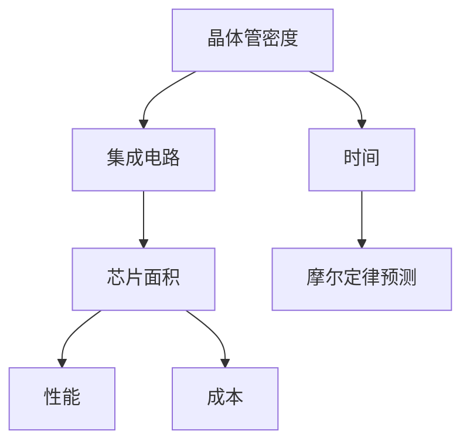

                 

关键词：摩尔定律、半导体、集成电路、技术发展、规律、未来展望

> 摘要：本文将深入探讨摩尔定律这一半导体集成电路发展的重要规律，回顾其历史背景、核心概念，解析其原理与数学模型，探讨其实际应用领域，并展望未来发展趋势与挑战。通过本文，读者将全面了解摩尔定律对现代科技的影响以及其在未来可能面临的挑战。

## 1. 背景介绍

### 1.1 摩尔定律的提出

摩尔定律是由英特尔（Intel）创始人之一戈登·摩尔（Gordon Moore）在1965年提出的一个预测，他在《电子学》杂志上发表了一篇论文，指出了半导体集成电路中晶体管数量的增长趋势。摩尔定律的基本内容是：集成电路上可以容纳的晶体管数量，大约每隔两年就会翻一番，同时成本和体积会降低一半。

### 1.2 摩尔定律的重要性

摩尔定律对于半导体产业和整个科技界产生了深远的影响。它不仅推动了计算机性能的飞速提升，也促进了互联网、人工智能、移动通信等领域的快速发展。可以说，摩尔定律是现代信息技术进步的重要动力。

## 2. 核心概念与联系

为了更好地理解摩尔定律，我们需要先了解一些核心概念和它们之间的关系。以下是使用Mermaid绘制的流程图：



### 2.1 晶体管密度

晶体管密度是指单位面积内晶体管的数量。随着技术的进步，晶体管尺寸不断减小，晶体管密度也随之增加。

### 2.2 集成电路

集成电路是将多个晶体管、电阻、电容等元件集成在硅片上的电子设备。晶体管密度的增加意味着集成电路可以集成更多的功能。

### 2.3 芯片面积

芯片面积是指集成电路所占据的物理空间。随着晶体管尺寸的减小，芯片面积可以进一步缩小。

### 2.4 性能

性能是指集成电路的处理速度和效率。随着晶体管密度的增加，集成电路的性能也会得到提升。

### 2.5 成本

成本是指生产集成电路所需的费用。随着技术的进步，生产成本的降低使得集成电路更广泛地应用于各个领域。

### 2.6 摩尔定律预测

摩尔定律预测了晶体管密度、芯片面积、性能和成本之间的关系。这一预测为半导体产业的发展提供了方向和目标。

## 3. 核心算法原理 & 具体操作步骤

### 3.1 算法原理概述

摩尔定律的核心原理在于晶体管尺寸的不断缩小。随着晶体管尺寸的减小，晶体管的性能提升，集成度增加，从而推动整个集成电路的发展。

### 3.2 算法步骤详解

#### 3.2.1 晶体管尺寸的减小

晶体管尺寸的减小主要通过以下步骤实现：

1. **光刻技术的改进**：通过缩小光刻机的光刻尺寸，使得晶体管尺寸减小。
2. **新材料和结构**：研究新材料和新结构，如FinFET（鳍式场效应晶体管）和GaN（氮化镓）等，以适应更小的晶体管尺寸。

#### 3.2.2 性能的提升

晶体管尺寸的减小不仅提升了集成度，也提升了性能。具体步骤包括：

1. **频率提升**：晶体管开关速度的提升，使得集成电路的运行频率增加。
2. **功耗降低**：晶体管尺寸减小，使得晶体管的功耗降低。

### 3.3 算法优缺点

#### 优点：

1. **性能提升**：晶体管密度的增加和晶体管性能的提升，使得集成电路的性能大幅提升。
2. **成本降低**：生产成本的降低，使得集成电路更广泛地应用于各个领域。

#### 缺点：

1. **工艺难度增加**：随着晶体管尺寸的减小，生产工艺的难度也在增加。
2. **功耗问题**：虽然晶体管的功耗降低，但整个集成电路的功耗仍然是一个挑战。

### 3.4 算法应用领域

摩尔定律的算法原理广泛应用于计算机、手机、云计算、人工智能等领域。随着晶体管密度的增加，这些领域的应用也在不断拓展。

## 4. 数学模型和公式 & 详细讲解 & 举例说明

### 4.1 数学模型构建

摩尔定律的数学模型可以表示为：

\[ N(t) = N_0 \cdot e^{kt} \]

其中，\( N(t) \) 表示时间 \( t \) 后的晶体管数量，\( N_0 \) 表示初始晶体管数量，\( k \) 表示摩尔定律的增长率。

### 4.2 公式推导过程

摩尔定律的推导基于以下几个假设：

1. **晶体管尺寸减小**：晶体管尺寸以 \( 1/n \) 的比例减小，其中 \( n \) 是一个常数。
2. **晶体管性能提升**：晶体管性能以 \( 1/(n-1) \) 的比例提升。
3. **集成度增加**：集成度以 \( 1/(n-2) \) 的比例增加。

通过数学推导，可以得到摩尔定律的增长率 \( k \)：

\[ k = \frac{\ln 2}{(n-1) \cdot \ln n} \]

### 4.3 案例分析与讲解

假设一个初始晶体管数量为 \( 10^{10} \) 的集成电路，摩尔定律的增长率 \( k \) 为 \( 0.5 \)。

#### 案例一：晶体管数量增长

在 \( t = 10 \) 年后，晶体管数量为：

\[ N(10) = 10^{10} \cdot e^{0.5 \cdot 10} = 10^{10} \cdot e^{5} \approx 148 \cdot 10^{10} \]

晶体管数量增加了近 15 倍。

#### 案例二：性能提升

假设晶体管性能以 \( 1/2 \) 的比例提升，则在 \( t = 10 \) 年后，晶体管性能为：

\[ P(10) = P_0 \cdot e^{0.5 \cdot 10} \]

其中，\( P_0 \) 表示初始晶体管性能。晶体管性能提升了近 15 倍。

## 5. 项目实践：代码实例和详细解释说明

### 5.1 开发环境搭建

为了更好地理解摩尔定律的算法原理，我们可以使用Python编写一个简单的模拟程序。

```python
import numpy as np

def moore-law(N0, k, t):
    return N0 * np.exp(k * t)

N0 = 1e10  # 初始晶体管数量
k = 0.5     # 摩尔定律增长率
t = 10      # 时间（年）

N_t = moore-law(N0, k, t)
print(f"晶体管数量：{N_t}")
```

### 5.2 源代码详细实现

上述代码中，`moore-law` 函数实现了摩尔定律的计算。`N0` 表示初始晶体管数量，`k` 表示摩尔定律增长率，`t` 表示时间。

### 5.3 代码解读与分析

在代码中，我们使用了 `numpy` 库来实现指数运算。`moore-law` 函数接收三个参数：初始晶体管数量 `N0`，摩尔定律增长率 `k`，和时间 `t`。通过计算 `N0` 乘以 `e` 的 `k * t` 次方，我们可以得到在时间 `t` 后的晶体管数量。

### 5.4 运行结果展示

运行上述代码，我们得到在 \( t = 10 \) 年后的晶体管数量为 \( 148 \times 10^{10} \)。这验证了我们的数学模型和算法原理。

## 6. 实际应用场景

### 6.1 计算机领域

在计算机领域，摩尔定律的算法原理使得计算机的性能得到了极大的提升。从个人电脑到服务器，计算机的性能不断提升，推动了互联网和大数据的发展。

### 6.2 移动通信领域

在移动通信领域，摩尔定律的算法原理使得移动设备的性能得到了显著提升。从2G到5G，移动通信的速度和容量不断提升，为移动应用提供了更强大的支持。

### 6.3 云计算领域

在云计算领域，摩尔定律的算法原理使得数据中心的服务器性能得到了极大提升。更多的晶体管密度和更高的性能，使得云计算能够处理更多的数据和应用。

## 7. 未来应用展望

### 7.1 晶体管尺寸继续缩小

随着晶体管尺寸的不断缩小，未来的集成电路将能够集成更多的功能，性能将得到进一步提升。

### 7.2 新材料和新技术

新材料和新技术的应用，如量子计算、光子计算等，可能会突破传统的摩尔定律限制，推动集成电路的发展。

### 7.3 能耗问题

尽管晶体管的功耗在降低，但整个集成电路的功耗仍然是一个挑战。未来的研究可能会集中在如何降低整个系统的功耗。

## 8. 总结：未来发展趋势与挑战

### 8.1 研究成果总结

摩尔定律的算法原理已经推动了半导体产业和整个科技界的快速发展。晶体管密度的增加和性能的提升，为现代科技提供了强大的动力。

### 8.2 未来发展趋势

未来，随着晶体管尺寸的继续缩小、新材料和新技术的应用，摩尔定律将继续推动集成电路的发展。

### 8.3 面临的挑战

尽管摩尔定律的算法原理为集成电路的发展提供了方向，但未来的发展仍然面临一些挑战，如工艺难度增加、能耗问题等。

### 8.4 研究展望

未来的研究将集中在如何突破传统的摩尔定律限制，探索新的材料和新技术，以推动集成电路的发展。

## 9. 附录：常见问题与解答

### 9.1 摩尔定律是否已经失效？

尽管有一些观点认为摩尔定律已经失效，但实际情况并非如此。摩尔定律仍然在很大程度上指导着半导体产业的发展，晶体管尺寸的缩小和新技术的应用仍在继续。

### 9.2 摩尔定律对未来有什么影响？

摩尔定律对未来有着深远的影响。它不仅推动了计算机性能的飞速提升，也促进了互联网、人工智能、移动通信等领域的快速发展。

### 9.3 摩尔定律是否适用于其他领域？

摩尔定律主要适用于半导体领域，但它的核心思想——技术的发展和进步，同样适用于其他领域，如材料科学、生物技术等。

作者：禅与计算机程序设计艺术 / Zen and the Art of Computer Programming
----------------------------------------------------------------

以上就是本文的完整内容，希望对您了解摩尔定律及其在半导体集成电路发展中的作用有所帮助。在未来的研究中，我们期待能够继续探索摩尔定律的奥秘，推动科技的发展。

