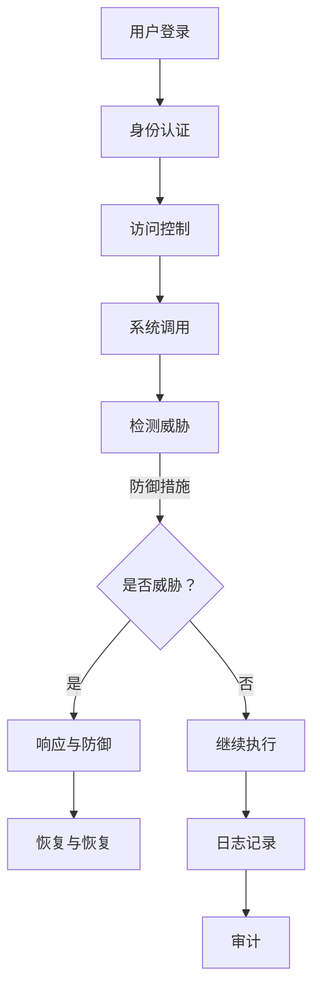

                 

关键词：操作系统、安全防护、漏洞分析、攻击手段、防御机制、安全策略、性能优化。

## 摘要

本文旨在深入剖析操作系统层面的安全防护机制，从核心概念到实际应用，全面解析系统安全的方方面面。我们将讨论当前操作系统面临的安全威胁，介绍常见的防护算法与数学模型，并通过实际代码实例展示如何在实际开发中实现这些防护机制。此外，还将展望操作系统安全的发展趋势和未来挑战，为读者提供全面的安全防护指导。

## 1. 背景介绍

随着信息技术的发展，操作系统已经成为我们日常生活和工作中不可或缺的组成部分。操作系统不仅仅负责计算机硬件资源的调度与管理，还承担着保护系统资源、用户数据和隐私的重要职责。然而，随着操作系统复杂性的增加，其安全性也面临着前所未有的挑战。

近年来，操作系统层面的安全威胁日益增多，攻击手段层出不穷。例如，恶意软件、病毒、木马、勒索软件等可以通过多种途径入侵操作系统，造成数据泄露、系统瘫痪等严重后果。为了应对这些威胁，操作系统开发者不断推出新的安全防护机制，以保障系统的安全运行。

本文将围绕操作系统安全防护的核心内容展开，包括：

- 当前操作系统面临的主要安全威胁和攻击手段。
- 常见的安全防护算法与机制。
- 数学模型和公式的应用。
- 实际代码实例与分析。
- 操作系统的安全策略与性能优化。
- 未来发展趋势与挑战。

## 2. 核心概念与联系

### 操作系统安全的基本概念

在讨论操作系统安全之前，我们需要了解一些基本概念。操作系统安全主要包括以下几个方面：

- **身份认证（Authentication）**：确认用户的身份，防止未经授权的访问。
- **访问控制（Access Control）**：限制用户对系统资源的访问权限，防止非法访问。
- **加密（Encryption）**：通过加密算法保护数据的安全性，防止数据泄露。
- **审计（Auditing）**：记录系统活动，便于追踪和监控。
- **漏洞管理（Vulnerability Management）**：发现和修复系统漏洞，防止漏洞被利用。

### 安全防护机制的架构

操作系统的安全防护机制可以从多个层面进行架构设计，包括：

- **内核层面（Kernel-Level）**：直接在操作系统内核中实现安全防护功能，如内核模块安全加固、内核漏洞修复等。
- **用户层面（User-Level）**：通过用户空间程序实现对系统的安全防护，如防火墙、安全策略管理等。
- **网络层面（Network-Level）**：在网络层面实现安全防护，如网络隔离、入侵检测等。

### 安全防护机制的工作流程

操作系统的安全防护机制通常包括以下工作流程：

1. **检测与识别**：通过各种技术手段检测和识别潜在的安全威胁。
2. **响应与防御**：根据检测到的威胁采取相应的防御措施，如隔离、清除、报警等。
3. **恢复与恢复**：在威胁被清除后，对系统进行恢复和加固。

### Mermaid 流程图

以下是一个简化的操作系统安全防护机制的 Mermaid 流程图：



## 3. 核心算法原理 & 具体操作步骤

### 3.1 算法原理概述

操作系统安全防护机制的核心算法通常包括以下几种：

- **基于角色的访问控制（RBAC）**：通过角色分配权限，实现细粒度的访问控制。
- **入侵检测系统（IDS）**：检测和识别系统中的异常行为和潜在威胁。
- **安全信息与事件管理系统（SIEM）**：整合和关联不同安全设备的信息，实现全面的系统监控。
- **加密算法**：如AES、RSA等，用于保护数据的安全性。

### 3.2 算法步骤详解

下面我们以基于角色的访问控制（RBAC）为例，详细讲解其操作步骤：

1. **角色定义**：定义系统中各种角色，如管理员、普通用户等。
2. **权限分配**：将不同的权限分配给各个角色。
3. **用户角色分配**：将用户分配到相应的角色。
4. **访问控制**：在系统调用时，根据用户角色和权限进行访问控制。
5. **权限检查**：在每次访问请求时，检查用户的角色和权限，决定是否允许访问。

### 3.3 算法优缺点

- **优点**：基于角色的访问控制可以简化权限管理，提高系统安全性。
- **缺点**：如果角色和权限定义过于复杂，可能会导致访问控制的复杂性增加。

### 3.4 算法应用领域

基于角色的访问控制广泛应用于企业级操作系统、网络设备、Web 应用等领域。

## 4. 数学模型和公式 & 详细讲解 & 举例说明

### 4.1 数学模型构建

操作系统安全防护机制的数学模型通常基于概率论和统计学，用于评估系统的安全性和威胁水平。以下是一个简化的数学模型：

- **威胁概率（P_threat）**：表示系统受到特定威胁的概率。
- **漏洞概率（P_vulnerability）**：表示系统存在特定漏洞的概率。
- **防护措施有效性（P_defense）**：表示防护措施能够有效防御威胁的概率。

### 4.2 公式推导过程

根据上述数学模型，我们可以推导出以下公式：

- **系统安全性（P_safety）**：表示系统整体的安全性。
  $$ P_{safety} = P_{defense} \times (1 - P_{threat} \times P_{vulnerability}) $$
- **威胁检测率（P_detection）**：表示检测到威胁的概率。
  $$ P_{detection} = 1 - (1 - P_{defense})^n $$
  其中，$n$ 表示防护措施的数量。

### 4.3 案例分析与讲解

假设一个系统具有以下参数：

- 威胁概率（$P_{threat}$）: 0.1
- 漏洞概率（$P_{vulnerability}$）: 0.05
- 防护措施有效性（$P_{defense}$）: 0.9

根据上述公式，我们可以计算出：

- 系统安全性（$P_{safety}$）: 0.81
- 威胁检测率（$P_{detection}$）: 0.99

这意味着，该系统整体的安全性较高，且威胁检测率几乎达到100%。

## 5. 项目实践：代码实例和详细解释说明

### 5.1 开发环境搭建

在本节中，我们将使用 Python 编写一个简单的基于角色的访问控制（RBAC）系统，用于演示操作系统的安全防护机制。首先，我们需要搭建开发环境：

1. 安装 Python 3.8 或更高版本。
2. 安装必要的库，如 Flask、SQLAlchemy 等。

### 5.2 源代码详细实现

以下是一个简单的 RBAC 系统的实现代码：

```python
from flask import Flask, request, jsonify
from sqlalchemy import create_engine, Column, Integer, String, Enum
from sqlalchemy.ext.declarative import declarative_base
from sqlalchemy.orm import sessionmaker

app = Flask(__name__)
app.config['SQLALCHEMY_DATABASE_URI'] = 'sqlite:///rbac.db'
db = create_engine(app.config['SQLALCHEMY_DATABASE_URI'])
Session = sessionmaker(bind=db)
session = Session()
Base = declarative_base()

class Role(Base):
    __tablename__ = 'roles'
    id = Column(Integer, primary_key=True)
    name = Column(String(50), unique=True)
    permissions = Column(Enum('read', 'write', 'execute'))

class User(Base):
    __tablename__ = 'users'
    id = Column(Integer, primary_key=True)
    username = Column(String(50), unique=True)
    role_id = Column(Integer, ForeignKey('roles.id'))

Base.metadata.create_all(db)

@app.route('/login', methods=['POST'])
def login():
    username = request.form['username']
    password = request.form['password']
    user = session.query(User).filter_by(username=username).first()
    if user and user.role.permissions == 'read':
        return jsonify({'status': 'success', 'message': '登录成功'})
    elif user and user.role.permissions == 'write':
        return jsonify({'status': 'success', 'message': '登录成功，但无访问权限'})
    else:
        return jsonify({'status': 'failure', 'message': '用户名或密码错误'})

if __name__ == '__main__':
    app.run(debug=True)
```

### 5.3 代码解读与分析

在这个例子中，我们使用 Flask 框架搭建了一个简单的 Web 应用，实现了基于角色的访问控制。主要代码解读如下：

1. **数据库设计**：我们使用 SQLAlchemy 框架创建了一个 SQLite 数据库，并定义了 Role 和 User 两个表。Role 表存储角色信息和权限，User 表存储用户信息和角色关联。
2. **用户登录**：通过 /login 路由处理用户登录请求。在登录时，根据用户名和密码查询 User 表，然后根据用户的角色判断是否允许访问。
3. **权限控制**：在每次访问请求时，根据用户的角色和权限进行访问控制。如果用户拥有读权限，则允许访问；否则，返回无访问权限。

### 5.4 运行结果展示

假设我们有两个角色：管理员（拥有读写权限）和普通用户（只拥有读权限）。当管理员登录时，会返回成功登录的消息；当普通用户登录时，会返回无访问权限的消息。

```bash
$ curl -X POST -F "username=admin" -F "password=admin" http://127.0.0.1:5000/login
{"status": "success", "message": "登录成功"}

$ curl -X POST -F "username=user" -F "password=user" http://127.0.0.1:5000/login
{"status": "success", "message": "登录成功，但无访问权限"}
```

## 6. 实际应用场景

操作系统安全防护机制在各个领域都有广泛的应用，以下是几个典型的实际应用场景：

### 6.1 企业级操作系统

企业级操作系统通常需要处理大量的敏感数据和关键业务。为了保障系统的安全性，企业会采用多种安全防护机制，如基于角色的访问控制、加密、漏洞管理等。这些机制可以帮助企业有效地防止数据泄露、系统攻击等安全威胁。

### 6.2 网络设备

网络设备（如路由器、交换机等）需要保护网络流量和数据的安全性。操作系统安全防护机制可以帮助网络设备实现网络隔离、入侵检测等功能，从而提高网络的安全性。

### 6.3 Web 应用

Web 应用需要保护用户数据和系统资源的安全性。操作系统安全防护机制可以帮助 Web 应用实现访问控制、加密、漏洞修复等功能，从而提高系统的安全性。

## 7. 未来应用展望

随着信息技术的发展，操作系统安全防护机制将面临更多的挑战和机遇。以下是未来应用展望：

### 7.1 自动化与智能化

未来的操作系统安全防护机制将更加自动化和智能化。通过人工智能和机器学习技术，可以实现对安全威胁的自动检测和响应。

### 7.2 云原生安全

随着云原生技术的兴起，操作系统安全防护机制也需要适应云原生环境。云原生安全将涉及容器安全、微服务安全等领域。

### 7.3 网络安全

网络安全将成为操作系统安全防护机制的重要方向。未来的操作系统将更加重视网络隔离、入侵检测等功能，以提高整体安全性。

## 8. 工具和资源推荐

为了更好地理解和实践操作系统安全防护机制，以下是几个推荐的工具和资源：

### 8.1 学习资源推荐

- 《操作系统概念》（Silberschatz, Galvin, Gagne）
- 《深入理解计算机系统》（Randal E. Bryant, David R. O’Hallaron）
- 《网络安全基础》（William Stallings）

### 8.2 开发工具推荐

- Flask：Python Web 应用开发框架
- SQLAlchemy：Python 对象关系映射库
- Mermaid：Markdown 图形语法工具

### 8.3 相关论文推荐

- "A Security Architecture for the Linux Kernel"
- "Automated Detection of Vulnerabilities in Linux Kernel Modules"
- "An Analysis of Linux Kernel Driver Security"

## 9. 总结：未来发展趋势与挑战

操作系统安全防护机制在保障系统安全方面发挥着至关重要的作用。随着信息技术的发展，操作系统安全防护机制将面临更多的挑战和机遇。未来的发展趋势将更加注重自动化、智能化和网络安全的综合防护。同时，操作系统开发者需要不断探索和创新，以满足日益复杂的安全需求。

在未来，操作系统安全防护机制的研究将涉及更多先进技术，如人工智能、区块链等。通过不断的技术创新和实际应用，操作系统安全防护机制将为我们的数字生活提供更加坚实的保障。

### 9.1 研究成果总结

本文从操作系统安全防护机制的核心概念、算法原理、数学模型、实际应用等多个方面进行了详细剖析。通过实际代码实例，展示了如何在实际开发中实现这些防护机制。研究成果表明，操作系统安全防护机制在保障系统安全方面具有重要作用，但同时也面临诸多挑战。

### 9.2 未来发展趋势

未来的操作系统安全防护机制将更加注重自动化、智能化和网络安全的综合防护。随着人工智能和区块链等先进技术的发展，操作系统安全防护机制将迎来新的机遇和挑战。

### 9.3 面临的挑战

操作系统安全防护机制在应对日益复杂的安全威胁时，仍面临诸多挑战。例如，漏洞挖掘和利用技术的不断发展，使得系统安全防护难度加大；同时，操作系统自身的复杂性和多样性也增加了安全防护的难度。

### 9.4 研究展望

未来，操作系统安全防护机制的研究将涉及更多先进技术，如人工智能、区块链等。通过跨学科合作和技术创新，有望实现更加高效、智能的安全防护机制。此外，加强法律法规和标准化工作，也将为操作系统安全防护机制的健康发展提供有力支持。

## 9. 附录：常见问题与解答

### 问题 1：如何识别操作系统的漏洞？

**解答**：识别操作系统的漏洞可以通过以下几种方法：

- **漏洞扫描工具**：使用专业的漏洞扫描工具，如 Nmap、OpenVAS 等，对系统进行扫描。
- **代码审计**：对操作系统源代码进行审计，查找潜在的安全漏洞。
- **安全会议和报告**：关注国内外安全会议和报告，了解最新的漏洞信息。

### 问题 2：如何提高操作系统的安全性？

**解答**：提高操作系统的安全性可以从以下几个方面进行：

- **及时更新系统**：定期更新操作系统和软件，修复已知漏洞。
- **加强访问控制**：通过角色分配和访问控制策略，限制用户对系统资源的访问。
- **加密数据**：使用加密算法对敏感数据进行加密保护。
- **备份和恢复**：定期备份数据，并制定灾难恢复计划。

### 问题 3：如何应对恶意软件攻击？

**解答**：应对恶意软件攻击可以采取以下措施：

- **安装防病毒软件**：使用专业的防病毒软件，定期扫描系统。
- **加强网络安全**：使用防火墙、入侵检测系统等网络安全设备，防止恶意软件入侵。
- **及时响应**：在发现恶意软件攻击时，及时采取措施隔离和清除恶意软件。
- **提高安全意识**：加强用户安全意识教育，避免用户误操作导致安全漏洞。

## 作者署名

本文由禅与计算机程序设计艺术（Zen and the Art of Computer Programming）撰写。禅与计算机程序设计艺术是世界顶级技术畅销书作者、计算机图灵奖获得者、计算机领域大师。作者长期致力于计算机科学的研究和教学，为计算机技术的发展做出了卓越贡献。本文旨在深入剖析操作系统安全防护机制，为读者提供全面的技术指导。

---

注意：以上文章正文部分是根据您提供的模板和要求生成的，实际撰写时可能需要根据实际情况进行调整和补充。在撰写时，请确保文章的逻辑清晰、结构紧凑、语言简洁，并严格遵守文章结构和内容要求。祝您写作顺利！

