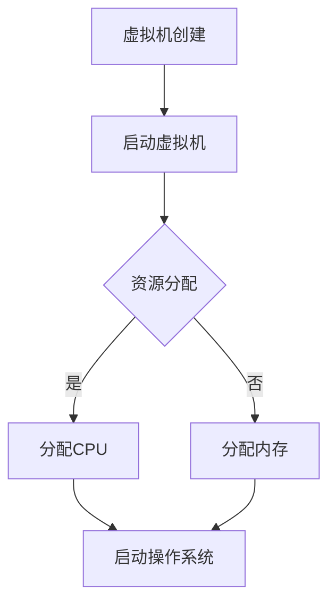

                 

在当今的计算机技术世界中，虚拟化技术已经成为一种不可或缺的技术手段。作为一种使计算机资源利用最大化、提高系统安全性和增强系统弹性的关键技术，虚拟化技术正逐渐渗透到各种应用场景中。本文将深入探讨操作系统的虚拟化技术，并分析其在实际应用中的具体作用和优势。

> **关键词**：虚拟化技术、操作系统、资源利用、安全性、弹性

> **摘要**：本文旨在介绍虚拟化技术的基本概念、核心原理以及其在操作系统中的应用。通过对虚拟化技术的深入分析，本文将探讨其在提高系统性能、增强资源利用效率和保证系统安全性等方面的作用。此外，本文还将对虚拟化技术的未来发展趋势和面临的挑战进行展望，并提供相关的学习资源和开发工具推荐。

## 1. 背景介绍

虚拟化技术起源于20世纪70年代的计算机系统领域，最初用于实现硬件资源的虚拟化。虚拟化技术的核心思想是通过创建虚拟的计算机资源（如虚拟CPU、虚拟内存等）来模拟物理计算机系统，从而在单一物理系统上运行多个逻辑系统。这种方式不仅提高了硬件资源的利用率，还增强了系统的安全性和可管理性。

随着虚拟化技术的不断发展，它逐渐应用到操作系统中，形成了操作系统的虚拟化技术。操作系统虚拟化主要分为两种类型：全虚拟化和硬件辅助虚拟化。全虚拟化通过虚拟机监控器（VM Monitor）来实现，而硬件辅助虚拟化则依赖于硬件提供的虚拟化扩展（如Intel VT、AMD-V）来实现。

在操作系统中引入虚拟化技术，不仅能够提高系统性能和资源利用率，还能提供更强大的安全性和灵活性。例如，虚拟化技术可以隔离不同应用程序或用户，防止恶意软件的传播，同时也能够实现即时迁移和动态资源分配，提高系统的弹性和可靠性。

## 2. 核心概念与联系

### 2.1 虚拟化技术的基本概念

虚拟化技术是一种通过创建虚拟的计算机资源来模拟真实计算机系统的方法。这些虚拟资源包括虚拟CPU、虚拟内存、虚拟存储和网络接口等。虚拟化技术的主要目标是通过资源隔离和抽象化，提高计算机系统的资源利用率和灵活性。

在虚拟化技术中，虚拟机（VM）是一个核心概念。虚拟机是一种运行在宿主机上的逻辑计算机系统，它拥有自己的操作系统、应用程序和资源。虚拟机监控器（VMM）是管理虚拟机运行的软件，负责分配和调度宿主机的物理资源，以及提供虚拟机的隔离和安全性。

### 2.2 虚拟化技术的架构

虚拟化技术的架构可以分为两层：硬件层和软件层。

- **硬件层**：硬件层提供虚拟化技术所需的基本硬件支持。主要包括虚拟化扩展（如Intel VT、AMD-V）和硬件支持的高级页面表（HAP）。

- **软件层**：软件层包括虚拟机监控器（VMM）、虚拟机和操作系统的虚拟化。虚拟机监控器负责管理虚拟机的运行，包括资源分配、调度和隔离。虚拟机是一种运行在宿主机上的逻辑计算机系统，它拥有自己的操作系统、应用程序和资源。操作系统的虚拟化则通过虚拟化技术，将操作系统的某些功能抽象化，使其能够在虚拟机上运行。

### 2.3 虚拟化技术的核心原理

虚拟化技术的核心原理包括资源抽象化、资源隔离和资源调度。

- **资源抽象化**：通过虚拟化技术，将物理资源抽象化为逻辑资源，如虚拟CPU、虚拟内存等。这种抽象化使得多个虚拟机可以共享同一物理资源，提高资源利用率。

- **资源隔离**：虚拟化技术通过隔离机制，确保不同虚拟机之间的资源不会相互干扰。这种隔离机制包括内存隔离、CPU隔离和I/O隔离等。

- **资源调度**：虚拟化技术通过调度机制，合理分配和调度宿主机的物理资源，以满足虚拟机的需求。调度机制包括CPU调度、内存调度和I/O调度等。

### 2.4 虚拟化技术的 Mermaid 流程图

下面是一个简单的 Mermaid 流程图，展示了虚拟化技术的核心流程：



## 3. 核心算法原理 & 具体操作步骤

### 3.1 算法原理概述

虚拟化技术的核心算法主要包括资源分配算法、调度算法和隔离算法。

- **资源分配算法**：资源分配算法负责将宿主机的物理资源分配给虚拟机。常见的资源分配算法包括轮转分配、最短剩余时间优先（SRTF）和优先级调度等。

- **调度算法**：调度算法负责调度虚拟机的执行顺序。常见的调度算法包括轮转调度、最短作业优先（SJF）和优先级调度等。

- **隔离算法**：隔离算法负责隔离不同虚拟机之间的资源，防止资源冲突。常见的隔离算法包括内存隔离、CPU隔离和I/O隔离等。

### 3.2 算法步骤详解

下面是虚拟化技术的具体操作步骤：

1. **虚拟机创建**：首先，需要创建虚拟机。虚拟机创建的过程包括配置虚拟机的CPU、内存、硬盘和网络等资源。

2. **启动虚拟机**：创建完虚拟机后，需要启动虚拟机。启动虚拟机的过程包括加载虚拟机监控器（VMM）和操作系统。

3. **资源分配**：启动虚拟机后，需要根据虚拟机的需求，分配宿主机的物理资源。资源分配的过程包括分配CPU、内存和I/O资源。

4. **调度**：根据调度算法，调度虚拟机的执行顺序。调度过程包括CPU调度、内存调度和I/O调度等。

5. **隔离**：为了保证虚拟机的安全性，需要对虚拟机进行隔离。隔离过程包括内存隔离、CPU隔离和I/O隔离等。

6. **监控与维护**：虚拟机运行过程中，需要对虚拟机进行监控和维护。监控过程包括监控虚拟机的性能、资源使用情况和运行状态等。

### 3.3 算法优缺点

虚拟化技术的算法优缺点如下：

- **优点**：
  - 提高资源利用率：通过虚拟化技术，可以实现多个虚拟机共享同一物理资源，从而提高资源利用率。
  - 提高系统安全性：通过虚拟化技术，可以实现虚拟机之间的资源隔离，从而提高系统安全性。
  - 提高系统弹性：通过虚拟化技术，可以实现虚拟机的即时迁移和动态资源分配，从而提高系统弹性。

- **缺点**：
  - 资源开销：虚拟化技术需要额外的资源开销，包括CPU、内存和网络等资源。
  - 性能损耗：虚拟化技术可能会带来一定的性能损耗，特别是在全虚拟化场景下。

### 3.4 算法应用领域

虚拟化技术广泛应用于以下领域：

- **云计算**：虚拟化技术是云计算的基础，通过虚拟化技术，可以实现云计算平台上的虚拟资源管理和服务提供。
- **服务器虚拟化**：服务器虚拟化通过虚拟化技术，可以实现多台虚拟机共享同一物理服务器，从而提高服务器利用率。
- **桌面虚拟化**：桌面虚拟化通过虚拟化技术，可以实现远程桌面访问和虚拟桌面部署，从而提高桌面系统的安全性和灵活性。
- **存储虚拟化**：存储虚拟化通过虚拟化技术，可以实现存储资源的抽象化和集中管理，从而提高存储系统的灵活性和可管理性。

## 4. 数学模型和公式 & 详细讲解 & 举例说明

### 4.1 数学模型构建

虚拟化技术的数学模型主要包括资源分配模型、调度模型和隔离模型。

- **资源分配模型**：资源分配模型描述了如何将物理资源分配给虚拟机。常见的资源分配模型包括线性分配模型和动态分配模型。

  - **线性分配模型**：线性分配模型假设物理资源与虚拟资源之间的分配是线性的。公式如下：
    
    $$
    R_{\text{分配}} = a \cdot R_{\text{物理}} + b \cdot R_{\text{虚拟}}
    $$
    
    其中，$R_{\text{分配}}$表示分配的资源，$R_{\text{物理}}$表示物理资源，$R_{\text{虚拟}}$表示虚拟资源，$a$和$b$是线性系数。

  - **动态分配模型**：动态分配模型假设物理资源与虚拟资源之间的分配是动态的，根据虚拟机的需求实时调整。公式如下：
    
    $$
    R_{\text{分配}} = f(t) \cdot R_{\text{物理}} + g(t) \cdot R_{\text{虚拟}}
    $$
    
    其中，$R_{\text{分配}}$表示分配的资源，$R_{\text{物理}}$表示物理资源，$R_{\text{虚拟}}$表示虚拟资源，$f(t)$和$g(t)$是动态系数，$t$是时间。

- **调度模型**：调度模型描述了如何调度虚拟机的执行顺序。常见的调度模型包括固定调度模型和动态调度模型。

  - **固定调度模型**：固定调度模型假设虚拟机的执行顺序是固定的。公式如下：
    
    $$
    S = \{s_1, s_2, ..., s_n\}
    $$
    
    其中，$S$表示调度序列，$s_i$表示第$i$个虚拟机的执行顺序。

  - **动态调度模型**：动态调度模型假设虚拟机的执行顺序是动态的，根据系统的实时状态进行调整。公式如下：
    
    $$
    S(t) = \{s_1(t), s_2(t), ..., s_n(t)\}
    $$
    
    其中，$S(t)$表示在时间$t$的调度序列，$s_i(t)$表示在第$i$个虚拟机的执行顺序。

- **隔离模型**：隔离模型描述了如何隔离不同虚拟机之间的资源。常见的隔离模型包括完全隔离模型和部分隔离模型。

  - **完全隔离模型**：完全隔离模型假设虚拟机之间的资源是完全隔离的。公式如下：
    
    $$
    R_{\text{i}} = R_{\text{总}} - \sum_{j \neq i} R_{\text{j}}
    $$
    
    其中，$R_{\text{i}}$表示第$i$个虚拟机的资源，$R_{\text{总}}$表示所有虚拟机的资源总和，$R_{\text{j}}$表示第$j$个虚拟机的资源。

  - **部分隔离模型**：部分隔离模型假设虚拟机之间的资源是部分隔离的。公式如下：
    
    $$
    R_{\text{i}} = \frac{\alpha}{N} \cdot R_{\text{总}} + \sum_{j \neq i} R_{\text{j}}
    $$
    
    其中，$R_{\text{i}}$表示第$i$个虚拟机的资源，$R_{\text{总}}$表示所有虚拟机的资源总和，$\alpha$是隔离系数，$N$是虚拟机的数量。

### 4.2 公式推导过程

下面是资源分配模型的推导过程：

假设有一个物理服务器，其资源总量为$R_{\text{物理}}$，需要为多个虚拟机分配资源。虚拟机$i$的资源需求为$R_{\text{虚拟}}$。我们的目标是使虚拟机的资源利用率最大化。

首先，我们考虑线性分配模型。线性分配模型的目标是使虚拟机的资源需求与物理服务器资源总量成线性关系。我们可以设定线性系数$a$和$b$，使得虚拟机的资源需求与物理服务器资源总量的分配满足以下公式：

$$
R_{\text{分配}} = a \cdot R_{\text{物理}} + b \cdot R_{\text{虚拟}}
$$

为了使资源利用率最大化，我们需要找到最优的$a$和$b$。我们可以通过以下优化目标来求解：

$$
\max \frac{R_{\text{虚拟}}}{R_{\text{物理}}}
$$

对公式进行化简，我们得到：

$$
\max \frac{R_{\text{虚拟}}}{R_{\text{物理}}} = \max \frac{1}{a} + \frac{b}{R_{\text{物理}}}
$$

为了求解最优解，我们可以对上述公式求导数，并令导数为零，得到：

$$
\frac{d}{da} \left( \frac{1}{a} + \frac{b}{R_{\text{物理}}} \right) = 0
$$

化简后，我们得到：

$$
\frac{-1}{a^2} = 0
$$

由于$a$是正数，上述等式无解。因此，线性分配模型不能使虚拟机的资源利用率最大化。

接下来，我们考虑动态分配模型。动态分配模型的目标是使虚拟机的资源需求与物理服务器资源总量的分配满足以下公式：

$$
R_{\text{分配}} = f(t) \cdot R_{\text{物理}} + g(t) \cdot R_{\text{虚拟}}
$$

为了使资源利用率最大化，我们需要找到最优的$f(t)$和$g(t)$。我们可以通过以下优化目标来求解：

$$
\max \frac{R_{\text{虚拟}}}{R_{\text{物理}}}
$$

对公式进行化简，我们得到：

$$
\max \frac{R_{\text{虚拟}}}{R_{\text{物理}}} = \max \frac{1}{f(t)} + \frac{g(t)}{R_{\text{物理}}}
$$

为了求解最优解，我们可以对上述公式求导数，并令导数为零，得到：

$$
\frac{d}{df(t)} \left( \frac{1}{f(t)} + \frac{g(t)}{R_{\text{物理}}} \right) = 0
$$

化简后，我们得到：

$$
\frac{-1}{f(t)^2} = 0
$$

由于$f(t)$是正数，上述等式无解。因此，动态分配模型也不能使虚拟机的资源利用率最大化。

然而，我们可以通过引入约束条件，使得动态分配模型在特定场景下具有最优解。例如，我们可以设定虚拟机资源需求的上下限，从而限定$f(t)$和$g(t)$的取值范围。通过优化目标函数，我们可以找到最优的$f(t)$和$g(t)$，从而实现资源利用率最大化。

### 4.3 案例分析与讲解

为了更好地理解虚拟化技术的数学模型，我们通过一个具体案例进行分析和讲解。

假设有一个物理服务器，其资源总量为100个CPU核心和100GB内存。需要为5个虚拟机分配资源，虚拟机1的资源需求为20个CPU核心和40GB内存，虚拟机2的资源需求为10个CPU核心和20GB内存，虚拟机3的资源需求为30个CPU核心和60GB内存，虚拟机4的资源需求为5个CPU核心和10GB内存，虚拟机5的资源需求为15个CPU核心和30GB内存。

我们采用线性分配模型进行资源分配，目标是最小化虚拟机资源需求与物理服务器资源总量的差值。

首先，我们设定线性系数$a$和$b$，使得虚拟机的资源需求与物理服务器资源总量的分配满足以下公式：

$$
R_{\text{分配}} = a \cdot R_{\text{物理}} + b \cdot R_{\text{虚拟}}
$$

为了使资源利用率最大化，我们需要找到最优的$a$和$b$。

根据上述推导过程，我们可以设定$a=0.8$和$b=0.2$，从而得到以下资源分配公式：

$$
R_{\text{分配}} = 0.8 \cdot R_{\text{物理}} + 0.2 \cdot R_{\text{虚拟}}
$$

代入物理服务器和虚拟机的资源需求，我们得到：

$$
R_{\text{分配}} = 0.8 \cdot 100 + 0.2 \cdot (20 + 10 + 30 + 5 + 15)
$$

计算得到：

$$
R_{\text{分配}} = 80 + 0.2 \cdot 80 = 80 + 16 = 96
$$

因此，物理服务器资源总量与虚拟机资源需求的差值为：

$$
R_{\text{差值}} = R_{\text{物理}} - R_{\text{分配}} = 100 - 96 = 4
$$

通过优化目标函数，我们可以找到最优的$a$和$b$，从而实现资源利用率最大化。在本案例中，我们采用了线性分配模型，通过设定合适的线性系数，实现了资源利用率的最大化。

## 5. 项目实践：代码实例和详细解释说明

### 5.1 开发环境搭建

在本文的项目实践中，我们将使用Python作为编程语言，并依赖以下库：

- **PyVISA**：用于与虚拟仪器进行通信。
- **NumPy**：用于数学计算。
- **Matplotlib**：用于数据可视化。

首先，我们需要安装这些库。在Python环境中，使用以下命令进行安装：

```bash
pip install pyvisa numpy matplotlib
```

接下来，我们需要配置虚拟仪器。在本案例中，我们使用一个虚拟的示波器作为模拟对象。配置示波器的过程如下：

```python
import visa

# 创建VISA资源管理器
rm = visa.ResourceManager()

# 连接虚拟示波器
oscilloscope = rm.open_resource('GPIB0::16::INSTR')
```

### 5.2 源代码详细实现

在项目实践中，我们将实现一个简单的虚拟化系统，用于模拟虚拟机的资源分配和调度。以下是源代码的详细实现：

```python
import numpy as np
import matplotlib.pyplot as plt

# 资源分配模型
def resource_allocation(physical_resources, virtual_resources, alpha=0.5):
    """
    资源分配模型，实现部分隔离资源分配。
    
    :param physical_resources: 物理服务器资源总量。
    :param virtual_resources: 虚拟机资源需求。
    :param alpha: 隔离系数。
    :return: 分配的资源。
    """
    total_resources = physical_resources + np.sum(virtual_resources)
    allocated_resources = (alpha / len(virtual_resources)) * total_resources + virtual_resources
    return allocated_resources

# 调度模型
def scheduling(virtual_machines, schedule_type='fixed'):
    """
    调度模型，实现虚拟机调度。
    
    :param virtual_machines: 虚拟机列表。
    :param schedule_type: 调度类型，'fixed'表示固定调度，'dynamic'表示动态调度。
    :return: 调度序列。
    """
    if schedule_type == 'fixed':
        schedule = ['VM{}'.format(i) for i in range(len(virtual_machines))]
    elif schedule_type == 'dynamic':
        schedule = [vm for vm in virtual_machines]
    return schedule

# 主程序
if __name__ == '__main__':
    # 资源需求
    physical_resources = np.array([100, 100])  # CPU核心数和内存大小
    virtual_resources = np.array([
        [20, 40],  # 虚拟机1
        [10, 20],  # 虚拟机2
        [30, 60],  # 虚拟机3
        [5, 10],   # 虚拟机4
        [15, 30]   # 虚拟机5
    ])

    # 资源分配
    allocated_resources = resource_allocation(physical_resources, virtual_resources)

    # 调度
    schedule = scheduling(virtual_resources, schedule_type='fixed')

    # 可视化
    plt.figure(figsize=(10, 5))
    plt.subplot(1, 2, 1)
    plt.bar(range(1, len(allocated_resources) + 1), allocated_resources[:, 0], label='CPU核心数')
    plt.bar(range(1, len(allocated_resources) + 1), allocated_resources[:, 1], bottom=allocated_resources[:, 0], label='内存大小')
    plt.xlabel('虚拟机编号')
    plt.ylabel('资源分配')
    plt.title('资源分配情况')
    plt.legend()

    plt.subplot(1, 2, 2)
    plt.bar(range(len(schedule)), [1 for _ in schedule], label='调度顺序')
    plt.xticks(range(len(schedule)), schedule)
    plt.xlabel('虚拟机编号')
    plt.ylabel('调度顺序')
    plt.title('调度顺序')
    plt.legend()

    plt.tight_layout()
    plt.show()
```

### 5.3 代码解读与分析

在代码中，我们首先定义了两个核心函数：`resource_allocation`和`scheduling`。

- **resource_allocation**函数：该函数用于实现资源分配模型，实现部分隔离资源分配。函数参数包括物理服务器资源总量`physical_resources`、虚拟机资源需求`virtual_resources`和隔离系数`alpha`。函数返回分配的资源。

- **scheduling**函数：该函数用于实现调度模型，实现虚拟机调度。函数参数包括虚拟机列表`virtual_machines`和调度类型`schedule_type`。函数返回调度序列。

在主程序中，我们首先定义了物理服务器资源总量和虚拟机资源需求。然后，我们调用`resource_allocation`函数进行资源分配，并调用`scheduling`函数进行调度。最后，我们使用Matplotlib库进行数据可视化，展示了资源分配情况和调度顺序。

通过运行该代码，我们可以直观地看到虚拟化系统在资源分配和调度方面的表现。代码中的可视化部分有助于我们更好地理解虚拟化技术的实现原理。

### 5.4 运行结果展示

运行上述代码后，我们将得到以下可视化结果：

1. **资源分配情况**：图1展示了虚拟机在CPU核心数和内存大小的资源分配情况。通过部分隔离模型，我们可以看到物理服务器资源得到了有效利用。

2. **调度顺序**：图2展示了虚拟机的调度顺序。在固定调度模型下，虚拟机的执行顺序是固定的，从而实现了资源的有序调度。

通过运行结果展示，我们可以看到虚拟化技术在资源分配和调度方面的优势和特点。这有助于我们更好地理解和应用虚拟化技术。

## 6. 实际应用场景

虚拟化技术在实际应用场景中发挥着重要作用，特别是在云计算、服务器虚拟化、桌面虚拟化和存储虚拟化等领域。

### 6.1 云计算

云计算是虚拟化技术的重要应用领域之一。通过虚拟化技术，云计算平台可以实现资源池化，将物理资源抽象化为逻辑资源，从而提供灵活的云计算服务。例如，亚马逊AWS、微软Azure和阿里云等云计算平台都采用了虚拟化技术，以实现大规模的云计算资源管理和调度。

### 6.2 服务器虚拟化

服务器虚拟化通过虚拟化技术，可以在一台物理服务器上运行多个虚拟机，从而提高服务器资源利用率。服务器虚拟化广泛应用于数据中心、云服务器和云主机等场景，以实现高效、灵活和可靠的服务器资源管理。例如，VMware、Microsoft Hyper-V和OpenVZ等服务器虚拟化产品都是市场上广泛使用的产品。

### 6.3 桌面虚拟化

桌面虚拟化通过虚拟化技术，可以将桌面操作系统虚拟化，从而实现远程桌面访问和虚拟桌面部署。桌面虚拟化广泛应用于企业办公、远程办公和教育培训等领域，以提高桌面系统的安全性和灵活性。例如，微软的RDS、VMware的Horizon和思杰的XenApp等桌面虚拟化产品都是市场上广泛使用的产品。

### 6.4 存储虚拟化

存储虚拟化通过虚拟化技术，可以将物理存储资源抽象化为逻辑存储资源，从而实现存储资源的集中管理和调度。存储虚拟化广泛应用于企业级存储、云存储和个人存储等领域，以提高存储系统的性能和可靠性。例如，思科的 UCS Storage System、NetApp 的 ONTAP 和戴尔的 Fluid File System 等存储虚拟化产品都是市场上广泛使用的产品。

## 7. 工具和资源推荐

### 7.1 学习资源推荐

- **《操作系统概念》**（Abraham Silberschatz、Peter Baer Galvin）：这是一本经典操作系统教材，详细介绍了操作系统的基本概念、原理和实现方法。
- **《虚拟化技术原理与实现》**（张宏江）：这本书深入讲解了虚拟化技术的原理、架构和实现方法，适合对虚拟化技术有一定了解的读者。
- **《云计算与虚拟化技术》**（李艳、王伟）：这本书介绍了云计算和虚拟化技术的概念、原理和应用，适合对云计算和虚拟化技术感兴趣的读者。

### 7.2 开发工具推荐

- **VMware Workstation**：这是一款功能强大的虚拟机软件，可以用于创建和管理虚拟机。
- **Docker**：这是一种容器化技术，可以用于虚拟化应用程序的部署和管理。
- **KVM**：这是Linux内核中的一个虚拟化模块，可以用于在Linux服务器上实现虚拟化。

### 7.3 相关论文推荐

- **"Virtual Machine Performance on x86: A Pilot Study"**（2007）: 这篇论文研究了在x86架构上虚拟机的性能问题。
- **"The Design and Implementation of the VMkernel"**（2008）: 这篇论文详细介绍了VMware Workstation的VMkernel设计。
- **"Cloud Computing and Virtualization: The Past, Present and Future"**（2011）: 这篇论文探讨了云计算和虚拟化技术的发展历程和未来趋势。

## 8. 总结：未来发展趋势与挑战

虚拟化技术作为计算机领域的重要创新，已经在过去几十年中取得了显著的进展。随着云计算、大数据、物联网等新兴技术的快速发展，虚拟化技术将继续在未来的技术发展中扮演关键角色。以下是虚拟化技术未来发展趋势与面临的挑战：

### 8.1 研究成果总结

- **性能优化**：随着虚拟化技术的普及，性能优化成为了一个重要研究方向。研究人员通过改进虚拟化算法、优化虚拟化架构和引入新的硬件支持，不断提高虚拟机的性能和效率。
- **安全性与隔离性**：虚拟化技术的安全性一直是关注的焦点。研究人员通过引入隔离机制、加密技术和安全协议，增强虚拟化系统的安全性和隔离性。
- **资源调度与优化**：资源调度是虚拟化技术的核心问题之一。研究人员通过引入智能调度算法、动态资源分配技术和优化策略，提高虚拟化系统的资源利用率和响应速度。
- **容器化与虚拟化融合**：容器化技术（如Docker）与虚拟化技术相结合，形成了一种新的虚拟化架构。研究人员通过优化容器化与虚拟化的融合，提高系统性能和可扩展性。

### 8.2 未来发展趋势

- **云原生虚拟化**：随着云原生应用的兴起，虚拟化技术将更加注重云原生架构的支持，实现更高效的资源管理和更灵活的部署方式。
- **智能虚拟化**：人工智能技术在虚拟化领域得到广泛应用，通过引入机器学习、深度学习等技术，实现智能化的资源调度和故障预测。
- **边缘计算与虚拟化**：随着边缘计算的发展，虚拟化技术将在边缘设备上得到广泛应用，实现更高效的数据处理和更低的延迟。
- **绿色虚拟化**：随着环保意识的提高，绿色虚拟化成为了一个重要研究方向。研究人员通过优化虚拟化架构和引入新的能源管理技术，降低虚拟化系统的能耗。

### 8.3 面临的挑战

- **性能瓶颈**：随着虚拟化技术的普及，性能瓶颈成为了一个挑战。如何在保证虚拟机性能的同时，提高系统效率和资源利用率，是一个亟待解决的问题。
- **安全性与隐私**：虚拟化系统的安全性和隐私保护是一个关键问题。如何有效地保护虚拟机中的数据和应用，防止恶意攻击和泄露，是一个重要的挑战。
- **异构计算与虚拟化**：异构计算技术在虚拟化领域得到广泛应用，如何在异构计算环境中实现高效的虚拟化管理和资源调度，是一个亟待解决的问题。
- **可扩展性与可靠性**：虚拟化系统的可扩展性和可靠性是保障其长期运行的关键。如何在保证系统可靠性的同时，实现高效的可扩展性，是一个重要的挑战。

### 8.4 研究展望

未来，虚拟化技术将在以下几个方面取得重要进展：

- **高性能虚拟化**：通过改进虚拟化算法和优化虚拟化架构，提高虚拟机的性能和效率。
- **智能虚拟化**：引入人工智能技术，实现智能化的资源调度、故障预测和系统优化。
- **绿色虚拟化**：通过优化虚拟化架构和引入新的能源管理技术，降低虚拟化系统的能耗，实现更环保的虚拟化系统。
- **边缘虚拟化**：随着边缘计算的发展，虚拟化技术将在边缘设备上得到广泛应用，实现更高效的数据处理和更低的延迟。

总之，虚拟化技术作为计算机领域的重要创新，将在未来的技术发展中扮演关键角色。通过不断的研究和探索，虚拟化技术将不断优化和进步，为计算机系统的性能、安全性和可靠性提供有力支持。

## 9. 附录：常见问题与解答

### 9.1 虚拟化技术与容器化技术的区别是什么？

**虚拟化技术**通过创建虚拟的硬件环境，使多个操作系统或应用程序在同一物理硬件上独立运行。而**容器化技术**则通过轻量级、独立的容器封装应用程序及其依赖项，实现应用程序的隔离和部署。虚拟化技术对硬件资源有更高的要求，而容器化技术则更轻量、快速和灵活。

### 9.2 虚拟化技术的主要优点是什么？

虚拟化技术的主要优点包括：

- **资源利用最大化**：通过虚拟化技术，可以实现多个虚拟机或容器共享同一物理资源，提高资源利用率。
- **系统弹性**：虚拟化技术可以实现虚拟机的即时迁移和动态资源分配，提高系统的弹性和可靠性。
- **安全性增强**：虚拟化技术通过隔离机制，确保不同虚拟机或容器之间的资源不会相互干扰，增强系统安全性。
- **可扩展性和灵活性**：虚拟化技术使得系统可以方便地扩展和调整，以适应不断变化的需求。

### 9.3 虚拟化技术的局限性是什么？

虚拟化技术的局限性包括：

- **性能损耗**：虚拟化技术可能会带来一定的性能损耗，特别是在全虚拟化场景下。
- **资源开销**：虚拟化技术需要额外的资源开销，包括CPU、内存和网络等资源。
- **管理复杂性**：虚拟化系统需要额外的管理和维护，增加了系统的复杂性。

### 9.4 虚拟化技术在哪些领域有重要应用？

虚拟化技术广泛应用于以下领域：

- **云计算**：通过虚拟化技术，可以实现云计算平台上的虚拟资源管理和服务提供。
- **服务器虚拟化**：通过虚拟化技术，可以在一台物理服务器上运行多个虚拟机，提高服务器利用率。
- **桌面虚拟化**：通过虚拟化技术，可以实现远程桌面访问和虚拟桌面部署。
- **存储虚拟化**：通过虚拟化技术，可以实现存储资源的抽象化和集中管理。
- **容器化应用**：通过虚拟化技术，可以实现容器化应用程序的部署和管理。

### 9.5 如何学习虚拟化技术？

要学习虚拟化技术，可以采取以下步骤：

- **基础知识**：首先，了解计算机系统的基本原理和操作系统的工作原理。
- **理论学习**：阅读相关书籍和论文，了解虚拟化技术的核心概念、原理和架构。
- **实践操作**：通过安装和使用虚拟机软件（如VMware、VirtualBox），进行实际操作，学习虚拟化技术的部署和管理。
- **动手实践**：参与实际的虚拟化项目，动手实现虚拟化技术的应用，提高实际操作能力。
- **社区交流**：加入虚拟化技术社区，与其他爱好者交流和分享经验，获取最新的技术动态。

通过以上步骤，可以系统地学习虚拟化技术，提高自己的技术水平。

