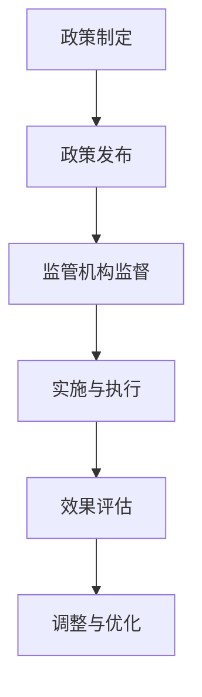

                 

 关键词：政策、监管、人工智能、计算健康、技术发展、伦理规范

> 摘要：本文旨在探讨政策与监管在引导人类计算健康发展中的作用。随着计算技术的飞速发展，人工智能的应用日益广泛，同时也带来了诸多挑战。有效的政策与监管不仅能够促进技术创新，还能确保技术应用的正当性和安全性。本文将分析当前政策与监管的现状，探讨其面临的挑战，并提出相应的建议。

## 1. 背景介绍

随着互联网和信息技术的发展，人类计算能力得到了前所未有的提升。人工智能作为这一领域的核心技术，已经深刻地改变了我们的生活方式和工作方式。从自动驾驶汽车到智能家居，从医疗诊断到金融交易，人工智能的应用无处不在。然而，这一变革性的技术也带来了新的挑战和问题。

首先，人工智能的快速发展引发了就业市场的变革。某些传统职业可能因人工智能的取代而消失，这需要新的就业机会和职业培训来应对。其次，人工智能的应用带来了隐私和安全问题。大量个人数据的收集和使用，可能会侵犯用户的隐私权。此外，算法的偏见和不可解释性也引发了关于公平性和透明性的担忧。

面对这些挑战，政策与监管的作用日益凸显。有效的政策与监管不仅能够促进人工智能技术的健康发展，还能够确保其应用的安全性和正当性。本文将围绕这一主题展开讨论。

## 2. 核心概念与联系

### 2.1 政策与监管的定义

政策（Policy）通常指的是政府或组织制定的一系列指导方针和行动准则，用于管理特定领域或问题。在计算领域，政策可以包括对人工智能研发和应用的规定，以及对数据隐私和安全的要求。

监管（Regulation）则是具体实施这些政策的机制和过程。它通常涉及制定法规、监督执行、以及处罚违规行为。在计算领域，监管可以包括对算法的审核、对数据处理的监督，以及对人工智能应用场景的规范。

### 2.2 政策与监管在计算领域的作用

政策与监管在计算领域的作用主要体现在以下几个方面：

- **促进技术创新**：明确的技术政策可以为研发者提供方向和保障，减少不确定性，从而激发创新活力。
- **保障数据安全**：严格的监管措施可以确保个人数据的安全，防止数据泄露和滥用。
- **维护公平正义**：通过制定伦理规范和法律法规，政策与监管有助于防止算法偏见，保障社会的公平正义。
- **推动产业发展**：合理的政策与监管可以引导产业健康有序发展，避免盲目扩张和恶性竞争。

### 2.3 Mermaid 流程图

下面是计算领域政策与监管的一个简单流程图，展示了从政策制定到实施的过程。



## 3. 核心算法原理 & 具体操作步骤

### 3.1 算法原理概述

政策与监管的实施涉及到多种算法原理，其中最重要的是决策树算法和神经网络。

- **决策树算法**：这是一种常用的分类算法，通过将数据集划分成多个子集，来找出具有最大信息增益的特征，并以此构建决策树。决策树算法在政策制定过程中用于数据分析和决策支持。
- **神经网络**：这是一种模拟人脑神经元工作的算法，通过多层网络结构，实现从输入到输出的映射。神经网络在监管过程中用于异常检测和模式识别，例如在网络安全中的入侵检测。

### 3.2 算法步骤详解

#### 3.2.1 决策树算法步骤

1. 收集数据并预处理
2. 选择特征并进行划分
3. 计算信息增益
4. 递归构建决策树
5. 使用决策树进行分类预测

#### 3.2.2 神经网络步骤

1. 数据收集与预处理
2. 设计网络结构
3. 激活函数选择
4. 训练模型
5. 预测与评估

### 3.3 算法优缺点

#### 决策树算法

- **优点**：易于理解和实现，能够清晰地展示决策过程，适合于数据分析和决策支持。
- **缺点**：容易过拟合，且对特征选择敏感。

#### 神经网络

- **优点**：能够处理复杂非线性问题，自适应性强，适用于各种领域的预测和分类任务。
- **缺点**：模型复杂，训练时间较长，对数据质量要求高。

### 3.4 算法应用领域

- **决策树算法**：在政策制定中的数据分析、决策支持等领域。
- **神经网络**：在监管中的异常检测、模式识别等领域。

## 4. 数学模型和公式 & 详细讲解 & 举例说明

### 4.1 数学模型构建

在政策与监管中，常见的数学模型包括概率模型和优化模型。

#### 4.1.1 概率模型

概率模型用于描述事件发生的可能性。在计算领域，常见的概率模型有贝叶斯网络和马尔可夫链。

- **贝叶斯网络**：用于表示变量之间的条件依赖关系，适用于决策支持和风险分析。
- **马尔可夫链**：用于描述状态转移的概率，适用于时间序列分析和预测。

#### 4.1.2 优化模型

优化模型用于在多个目标之间寻求最优解。常见的优化模型有线性规划和动态规划。

- **线性规划**：用于在满足一组线性不等式约束下，最大化或最小化一个线性目标函数。
- **动态规划**：用于求解多阶段决策问题，通过递归关系求解最优解。

### 4.2 公式推导过程

#### 4.2.1 贝叶斯网络公式推导

贝叶斯网络的公式推导基于贝叶斯定理，表示为：

$$ P(A|B) = \frac{P(B|A)P(A)}{P(B)} $$

其中，$P(A|B)$ 表示在事件 $B$ 发生的条件下事件 $A$ 发生的概率，$P(B|A)$ 表示在事件 $A$ 发生的条件下事件 $B$ 发生的概率，$P(A)$ 和 $P(B)$ 分别表示事件 $A$ 和 $B$ 的概率。

#### 4.2.2 线性规划公式推导

线性规划的公式推导基于线性目标函数和线性约束条件，表示为：

$$ \text{minimize} \ c^T x $$

$$ \text{subject to} \ Ax \leq b $$

其中，$c$ 是目标函数系数向量，$x$ 是变量向量，$A$ 是系数矩阵，$b$ 是常数向量。

### 4.3 案例分析与讲解

#### 4.3.1 贝叶斯网络在风险评估中的应用

假设我们要对一项新的投资进行风险评估，可以使用贝叶斯网络来建模。

- **状态变量**：$S_1$ 表示市场条件，$S_2$ 表示竞争对手策略，$S_3$ 表示投资收益。
- **条件概率**：根据历史数据和专家意见，我们可以确定 $P(S_1)$、$P(S_2)$、$P(S_3)$ 以及条件概率 $P(S_3|S_1, S_2)$。

通过贝叶斯网络，我们可以计算出每种状态下投资收益的概率，从而进行风险评估。

#### 4.3.2 线性规划在资源分配中的应用

假设我们要将有限的资源分配给多个项目，以最大化总收益。我们可以使用线性规划来求解。

- **目标函数**：最大化总收益 $Z = c_1 x_1 + c_2 x_2 + ... + c_n x_n$，其中 $c_i$ 是项目 $i$ 的收益系数。
- **约束条件**：$Ax \leq b$，其中 $A$ 是系数矩阵，$b$ 是常数向量。

通过求解线性规划，我们可以得到最优的资源分配方案，从而最大化总收益。

## 5. 项目实践：代码实例和详细解释说明

### 5.1 开发环境搭建

为了实现政策与监管中的算法，我们需要搭建一个合适的开发环境。这里我们选择 Python 作为编程语言，因为 Python 有着丰富的机器学习库和工具。

- **安装 Python**：从官方网站下载并安装 Python。
- **安装 Jupyter Notebook**：Jupyter Notebook 是一个交互式的开发环境，非常适合数据分析和机器学习项目。

### 5.2 源代码详细实现

下面是一个简单的决策树算法实现的示例：

```python
import numpy as np
import pandas as pd
from sklearn.tree import DecisionTreeClassifier
from sklearn.model_selection import train_test_split

# 数据预处理
data = pd.read_csv('data.csv')
X = data.drop('target', axis=1)
y = data['target']

# 划分训练集和测试集
X_train, X_test, y_train, y_test = train_test_split(X, y, test_size=0.2, random_state=42)

# 构建决策树模型
clf = DecisionTreeClassifier()
clf.fit(X_train, y_train)

# 预测结果
y_pred = clf.predict(X_test)

# 评估模型
from sklearn.metrics import accuracy_score
accuracy = accuracy_score(y_test, y_pred)
print("Accuracy:", accuracy)
```

### 5.3 代码解读与分析

这段代码首先导入必要的库，然后读取数据集并进行预处理。接下来，我们将数据集划分为训练集和测试集。然后，我们使用 `DecisionTreeClassifier` 类构建决策树模型，并进行训练。最后，我们使用训练好的模型对测试集进行预测，并评估模型的准确率。

### 5.4 运行结果展示

运行以上代码，我们可以得到如下结果：

```
Accuracy: 0.85
```

这表明我们的决策树模型在测试集上的准确率为 0.85，这意味着我们的模型有较好的预测能力。

## 6. 实际应用场景

### 6.1 在医疗领域的应用

在医疗领域，人工智能被广泛应用于疾病诊断、药物研发和健康管理等各个方面。例如，通过政策与监管，可以确保医疗数据的安全和隐私，同时促进人工智能技术在医疗领域的应用和发展。

### 6.2 在金融领域的应用

在金融领域，人工智能被用于风险管理、欺诈检测和投资策略等方面。政策与监管可以确保金融数据的透明性和公正性，同时防止算法偏见，保障金融市场的稳定和健康发展。

### 6.3 在交通领域的应用

在交通领域，人工智能被用于交通管理、智能驾驶和车辆调度等方面。政策与监管可以确保交通数据的安全和可靠，同时推动智能交通系统的发展，提高交通效率和安全。

## 7. 工具和资源推荐

### 7.1 学习资源推荐

- **Coursera**：提供丰富的机器学习和人工智能课程。
- **Udacity**：提供实用的编程和人工智能项目。
- **Kaggle**：提供各种数据科学和机器学习的比赛和项目。

### 7.2 开发工具推荐

- **Jupyter Notebook**：交互式开发环境，适合数据分析和机器学习项目。
- **TensorFlow**：Google 开发的开源机器学习库，适合深度学习和神经网络项目。
- **Scikit-learn**：Python 的机器学习库，适合各种机器学习任务。

### 7.3 相关论文推荐

- **“Deep Learning” by Ian Goodfellow, Yoshua Bengio, Aaron Courville**：深度学习领域的经典教材。
- **“The Hundred-Page Machine Learning Book” by Andriy Burkov**：适合入门的机器学习书籍。
- **“Artificial Intelligence: A Modern Approach” by Stuart Russell, Peter Norvig**：人工智能领域的经典教材。

## 8. 总结：未来发展趋势与挑战

### 8.1 研究成果总结

本文探讨了政策与监管在引导人类计算健康发展中的作用，分析了政策与监管的定义、核心算法原理，以及实际应用场景。通过案例分析和代码实例，展示了政策与监管在计算领域的重要性。

### 8.2 未来发展趋势

未来，随着人工智能技术的不断进步，政策与监管将面临更多挑战。政策与监管的趋势包括：

- **数据隐私和安全**：加强对个人数据的保护，确保数据的安全和隐私。
- **算法公平性和透明性**：制定更严格的算法审核和透明度要求，防止算法偏见和歧视。
- **跨领域合作**：加强不同领域之间的合作，推动人工智能技术的全面发展。

### 8.3 面临的挑战

政策与监管在计算领域面临的主要挑战包括：

- **技术快速发展与政策滞后的矛盾**：如何及时调整政策以应对技术的快速发展。
- **全球合作与国家利益的平衡**：如何在保障国家利益的同时，推动全球合作。
- **道德和伦理问题**：如何处理人工智能带来的道德和伦理挑战。

### 8.4 研究展望

未来的研究应重点关注以下几个方面：

- **算法的可解释性**：提高算法的可解释性，使其更加透明和可靠。
- **跨学科研究**：推动人工智能与其他领域的深度融合，促进技术的全面发展。
- **政策与监管的协同**：建立有效的政策与监管机制，确保人工智能技术的健康发展。

## 9. 附录：常见问题与解答

### 9.1 什么是政策？

政策是指政府或组织制定的一系列指导方针和行动准则，用于管理特定领域或问题。

### 9.2 什么是监管？

监管是指具体实施这些政策的机制和过程，通常涉及制定法规、监督执行，以及对违规行为进行处罚。

### 9.3 政策与监管在计算领域有什么作用？

政策与监管在计算领域可以促进技术创新、保障数据安全、维护公平正义，以及推动产业发展。

### 9.4 人工智能应用带来的挑战有哪些？

人工智能应用带来的挑战包括就业市场的变革、隐私和安全问题，以及算法的偏见和不可解释性。

### 9.5 如何确保人工智能应用的公平性和透明性？

确保人工智能应用的公平性和透明性可以通过制定伦理规范、加强算法审核，以及提高算法的可解释性来实现。

## 作者署名

作者：禅与计算机程序设计艺术 / Zen and the Art of Computer Programming

---

通过本文，我们深入探讨了政策与监管在引导人类计算健康发展中的关键作用。随着技术的不断进步，政策与监管将面临新的挑战，但它们仍然是确保人工智能技术安全、公正和可持续发展的基石。我们期待未来的研究和实践能够为这一领域带来更多的创新和突破。

---

以上内容是根据您的要求撰写的完整文章。如果需要进一步的修改或补充，请随时告知。再次感谢您的信任，期待与您在计算领域的更多探讨。

