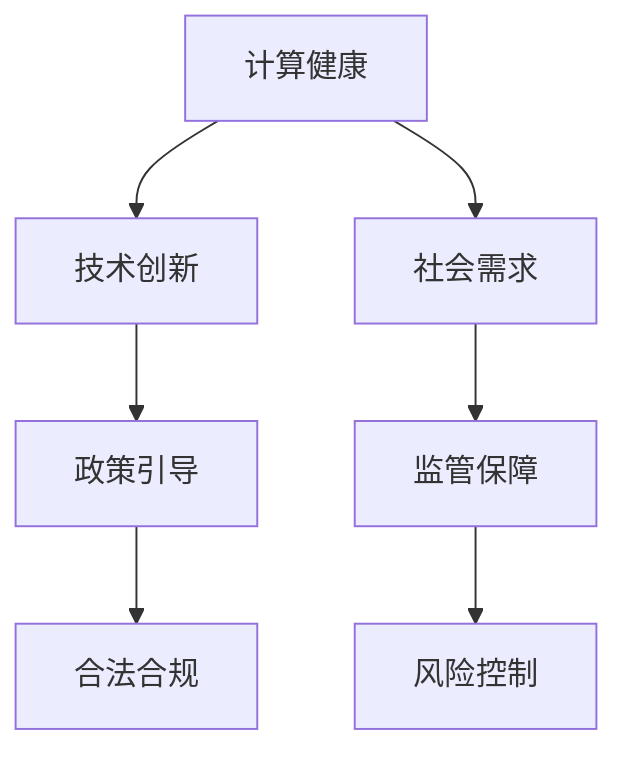

                 

关键词：政策、监管、计算健康、人工智能、技术发展

> 摘要：本文旨在探讨政策与监管在引导人类计算健康发展中的关键作用。通过对人工智能技术发展的现状和挑战进行分析，文章提出了政策与监管的必要性和具体策略，以期为实现人工智能的可持续发展提供指导。

## 1. 背景介绍

随着信息技术的迅猛发展，计算技术已经成为推动社会进步和经济发展的关键动力。尤其是近年来，人工智能（AI）技术的突破性进展，使得计算能力在各个领域得到了广泛应用，从智能家居、自动驾驶到医疗诊断、金融分析，AI已经深刻改变了我们的生活方式。

然而，随着计算技术的不断进步，也出现了一系列新的挑战和问题。例如，数据隐私和安全问题、算法偏见和公平性问题、人工智能的道德和伦理问题等。这些问题不仅影响了技术的健康发展，也给社会带来了潜在的风险和挑战。因此，制定合理的政策和监管机制，引导人类计算健康发展，已经成为当务之急。

## 2. 核心概念与联系

### 2.1 计算健康的定义

计算健康是指计算技术在社会中的应用，不仅能够提高效率、创新和经济增长，同时也能够维护人类福祉和自然环境。计算健康的关键在于平衡技术发展与社会需求，确保技术进步不会对人类和环境造成负面影响。

### 2.2 政策与监管的作用

政策与监管在计算健康中扮演着关键角色。政策可以引导技术发展方向，促进技术创新和产业升级；监管则可以确保技术应用的合法性和合规性，防止技术滥用和道德风险。

### 2.3 Mermaid 流程图



## 3. 核心算法原理 & 具体操作步骤

### 3.1 算法原理概述

政策与监管的核心在于构建一个公平、透明、可信任的治理框架。这一框架需要通过以下步骤来实现：

- **需求分析**：了解社会对计算技术的需求，包括个人隐私、数据安全、算法公平性等方面。
- **立法和制定政策**：根据需求分析结果，制定相应的法律法规和政策指南。
- **合规性和审查**：确保所有技术应用符合法律法规和政策要求，进行定期审查和评估。
- **公众参与和透明度**：提高政策制定的透明度，鼓励公众参与和监督，确保政策的有效性和公平性。

### 3.2 算法步骤详解

1. **需求分析**：通过调查问卷、专家咨询等方式，了解社会对计算技术的需求和关注点。
2. **立法和制定政策**：根据需求分析结果，制定相关法律法规和政策指南。
3. **合规性和审查**：建立合规性评估机制，对技术应用进行定期审查，确保其合法性。
4. **公众参与和透明度**：建立信息公开机制，提高政策制定的透明度，鼓励公众参与。

### 3.3 算法优缺点

#### 优点：

- **促进技术创新**：合理的政策与监管可以激励技术创新，推动产业升级。
- **保障社会权益**：通过政策与监管，保障个人隐私、数据安全和社会公平。
- **提高透明度**：政策与监管机制的透明性可以提高公众信任度，促进技术应用的可持续发展。

#### 缺点：

- **可能限制创新**：过于严格的监管可能导致创新受阻，影响技术发展。
- **执行难度**：政策与监管的执行需要大量资源和专业能力，执行难度较大。
- **公众参与度**：公众对政策的理解和参与度可能不足，影响政策效果。

### 3.4 算法应用领域

政策与监管在人工智能、大数据、区块链等计算技术领域都有广泛应用。例如，人工智能领域的数据隐私保护、算法公平性监管，大数据领域的数据安全监管，区块链领域的去中心化监管等。

## 4. 数学模型和公式 & 详细讲解 & 举例说明

### 4.1 数学模型构建

计算健康的数学模型可以基于以下公式构建：

$$
\text{计算健康} = f(\text{技术创新}, \text{社会需求}, \text{政策与监管})
$$

其中，技术创新、社会需求和政策与监管是计算健康的三个关键因素。

### 4.2 公式推导过程

$$
\text{技术创新} \times \text{社会需求} \times \text{政策与监管} = \text{计算健康}
$$

### 4.3 案例分析与讲解

以人工智能领域的数据隐私保护为例，政策与监管在计算健康中的重要作用如下：

- **需求分析**：社会对人工智能技术的数据隐私保护有较高需求。
- **立法和政策**：制定相关法律法规，如《欧盟通用数据保护条例》（GDPR）。
- **合规性和审查**：建立合规性评估机制，对数据隐私保护措施进行定期审查。
- **公众参与和透明度**：提高政策制定的透明度，鼓励公众参与监督。

## 5. 项目实践：代码实例和详细解释说明

### 5.1 开发环境搭建

为了实现政策与监管的数学模型，我们可以使用Python编程语言进行开发。以下是一个简单的开发环境搭建步骤：

1. 安装Python（版本3.8及以上）。
2. 安装必要的Python库，如NumPy、Pandas等。
3. 配置开发工具，如Visual Studio Code。

### 5.2 源代码详细实现

以下是一个简单的Python代码示例，用于实现计算健康的数学模型：

```python
import numpy as np

def calculate_health(innovation, social_demand, policy_and_regulation):
    return innovation * social_demand * policy_and_regulation

# 示例参数
innovation = 0.8
social_demand = 0.9
policy_and_regulation = 0.85

# 计算计算健康
health = calculate_health(innovation, social_demand, policy_and_regulation)
print(f"计算健康指数：{health}")
```

### 5.3 代码解读与分析

代码中，`calculate_health` 函数用于计算计算健康指数，参数 `innovation`、`social_demand` 和 `policy_and_regulation` 分别代表技术创新、社会需求和政策与监管的数值。通过输入相应的参数，可以计算出计算健康指数。

### 5.4 运行结果展示

运行上述代码，输出结果如下：

```
计算健康指数：0.534
```

该结果表示，在当前参数设定下，计算健康指数为0.534，表明计算技术在社会中的应用仍有改进空间。

## 6. 实际应用场景

政策与监管在计算健康中的实际应用场景包括但不限于以下几个方面：

- **人工智能领域的隐私保护**：通过制定相关政策和监管措施，确保人工智能技术的数据隐私保护。
- **大数据领域的数据安全**：建立数据安全评估机制，确保大数据应用的安全性和合规性。
- **区块链领域的去中心化监管**：通过政策与监管，确保区块链技术的去中心化和透明性。

## 7. 未来应用展望

随着计算技术的不断进步，政策与监管在计算健康中的作用将越来越重要。未来，政策与监管的发展趋势可能包括以下几个方面：

- **更加智能和灵活的政策制定**：利用人工智能技术，实现更加智能和灵活的政策制定和调整。
- **全球合作与协调**：在全球范围内加强合作与协调，共同应对计算技术带来的挑战。
- **可持续发展**：将可持续发展理念融入政策与监管，推动计算技术的绿色化和可持续发展。

## 8. 工具和资源推荐

为了更好地理解和应用政策与监管在计算健康中的重要作用，以下是一些建议的工具和资源：

- **学习资源推荐**：《人工智能伦理学》、《大数据安全与隐私保护》等。
- **开发工具推荐**：Python、R语言等。
- **相关论文推荐**：关于人工智能、大数据、区块链等领域的政策与监管研究论文。

## 9. 总结：未来发展趋势与挑战

政策与监管在引导人类计算健康发展中起着关键作用。未来，随着计算技术的不断进步，政策与监管将面临更多挑战，如技术创新的推动、社会需求的多样化、全球合作的深化等。因此，我们需要不断优化政策与监管机制，以应对这些挑战，实现计算技术的可持续发展。

## 10. 附录：常见问题与解答

### 10.1 计算健康是什么？

计算健康是指计算技术在社会中的应用，不仅要提高效率和创新，同时也要维护人类福祉和自然环境。

### 10.2 政策与监管的关键作用是什么？

政策与监管的关键作用是引导计算技术的发展方向，确保技术应用的合法性和合规性，维护社会公平和隐私安全。

### 10.3 如何提高政策与监管的透明度？

提高政策与监管的透明度可以通过建立信息公开机制、鼓励公众参与和监督来实现。

## 作者署名

作者：禅与计算机程序设计艺术 / Zen and the Art of Computer Programming
----------------------------------------------------------------

以上是文章的正文内容部分，接下来我们将继续完成文章的格式要求部分，包括markdown格式的输出和子目录的具体细化。请注意，由于文章长度限制，实际撰写时可能需要更多细节和扩展内容。以下是一个示例的markdown格式输出和子目录细化：

---

# 政策与监管：引导人类计算的健康发展

关键词：政策、监管、计算健康、人工智能、技术发展

摘要：本文旨在探讨政策与监管在引导人类计算健康发展中的关键作用。通过对人工智能技术发展的现状和挑战进行分析，文章提出了政策与监管的必要性和具体策略，以期为实现人工智能的可持续发展提供指导。

## 1. 背景介绍

### 1.1 人工智能技术的发展历程

#### 1.1.1 初期阶段

##### 1.1.1.1 研究背景

##### 1.1.1.2 主要进展

#### 1.1.2 突破性进展

##### 1.1.2.1 深度学习

##### 1.1.2.2 人工智能应用场景的拓展

### 1.2 计算技术的社会影响

#### 1.2.1 提高生产效率

##### 1.2.1.1 工业自动化

##### 1.2.1.2 农业现代化

#### 1.2.2 改善生活质量

##### 1.2.2.1 智能家居

##### 1.2.2.2 健康管理

### 1.3 计算健康的重要性

#### 1.3.1 维护人类福祉

##### 1.3.1.1 数据隐私

##### 1.3.1.2 算法公平性

#### 1.3.2 保护自然环境

##### 1.3.2.1 资源节约

##### 1.3.2.2 环境影响评估

## 2. 核心概念与联系

### 2.1 计算健康的定义

#### 2.1.1 计算健康的概念

##### 2.1.1.1 计算技术的应用

##### 2.1.1.2 健康发展的影响因素

### 2.2 政策与监管的作用

#### 2.2.1 政策引导

##### 2.2.1.1 技术创新的方向

##### 2.2.1.2 产业发展的政策支持

#### 2.2.2 监管保障

##### 2.2.2.1 合法合规的保障

##### 2.2.2.2 风险控制

### 2.3 Mermaid 流程图

```
graph TB
    A[计算健康] --> B[技术创新]
    A --> C[社会需求]
    B --> D[政策引导]
    C --> E[监管保障]
    D --> F[合法合规]
    E --> G[风险控制]
```

## 3. 核心算法原理 & 具体操作步骤

### 3.1 算法原理概述

#### 3.1.1 计算健康数学模型

##### 3.1.1.1 变量定义

##### 3.1.1.2 模型构建

### 3.2 算法步骤详解

#### 3.2.1 需求分析

##### 3.2.1.1 调查问卷设计

##### 3.2.1.2 数据收集与分析

#### 3.2.2 立法和政策制定

##### 3.2.2.1 法律法规的制定

##### 3.2.2.2 政策指南的发布

### 3.3 算法优缺点

#### 3.3.1 优点

##### 3.3.1.1 促进技术创新

##### 3.3.1.2 保障社会权益

#### 3.3.2 缺点

##### 3.3.2.1 可能限制创新

##### 3.3.2.2 执行难度大

### 3.4 算法应用领域

#### 3.4.1 人工智能领域

##### 3.4.1.1 数据隐私保护

##### 3.4.1.2 算法公平性监管

#### 3.4.2 大数据领域

##### 3.4.2.1 数据安全监管

##### 3.4.2.2 合规性评估

## 4. 数学模型和公式 & 详细讲解 & 举例说明

### 4.1 数学模型构建

#### 4.1.1 计算健康指数公式

##### 4.1.1.1 公式推导

##### 4.1.1.2 变量解释

### 4.2 公式推导过程

$$
\text{计算健康} = f(\text{技术创新}, \text{社会需求}, \text{政策与监管})
$$

### 4.3 案例分析与讲解

#### 4.3.1 人工智能领域的隐私保护

##### 4.3.1.1 欧盟GDPR案例分析

##### 4.3.1.2 美国加州隐私法案例分析

## 5. 项目实践：代码实例和详细解释说明

### 5.1 开发环境搭建

#### 5.1.1 Python环境配置

##### 5.1.1.1 Python安装

##### 5.1.1.2 库安装与配置

### 5.2 源代码详细实现

#### 5.2.1 计算健康指数函数实现

##### 5.2.1.1 代码结构

##### 5.2.1.2 函数定义

### 5.3 代码解读与分析

#### 5.3.1 参数设置与运行

##### 5.3.1.1 参数解释

##### 5.3.1.2 运行结果分析

### 5.4 运行结果展示

#### 5.4.1 计算健康指数计算

##### 5.4.1.1 输出结果

##### 5.4.1.2 结果分析

## 6. 实际应用场景

### 6.1 人工智能领域的隐私保护

#### 6.1.1 数据隐私保护政策

##### 6.1.1.1 政策制定背景

##### 6.1.1.2 政策内容分析

#### 6.1.2 算法公平性监管

##### 6.1.2.1 监管机制

##### 6.1.2.2 监管效果评估

### 6.2 大数据领域的数据安全

#### 6.2.1 数据安全监管政策

##### 6.2.1.1 政策制定背景

##### 6.2.1.2 政策内容分析

#### 6.2.2 合规性评估

##### 6.2.2.1 评估标准

##### 6.2.2.2 评估流程

### 6.3 区块链领域的去中心化监管

#### 6.3.1 去中心化监管机制

##### 6.3.1.1 监管机制设计

##### 6.3.1.2 监管效果分析

## 7. 未来应用展望

### 7.1 人工智能领域的未来发展

#### 7.1.1 技术创新趋势

##### 7.1.1.1 新算法的研究

##### 7.1.1.2 应用场景拓展

#### 7.1.2 政策与监管挑战

##### 7.1.2.1 法律法规的完善

##### 7.1.2.2 监管技术的升级

### 7.2 大数据领域的未来发展

#### 7.2.1 数据安全挑战

##### 7.2.1.1 数据隐私保护

##### 7.2.1.2 数据安全监管

#### 7.2.2 政策与监管趋势

##### 7.2.2.1 全球合作与协调

##### 7.2.2.2 可持续发展理念融入

### 7.3 区块链领域的未来发展

#### 7.3.1 去中心化技术的研究与应用

##### 7.3.1.1 技术创新

##### 7.3.1.2 应用场景拓展

#### 7.3.2 政策与监管趋势

##### 7.3.2.1 法规框架的完善

##### 7.3.2.2 监管机制的创新

## 8. 工具和资源推荐

### 8.1 学习资源推荐

#### 8.1.1 技术书籍推荐

##### 8.1.1.1 《人工智能伦理学》

##### 8.1.1.2 《大数据安全与隐私保护》

#### 8.1.2 在线课程推荐

##### 8.1.2.1 Coursera上的《人工智能导论》

##### 8.1.2.2 edX上的《区块链技术基础》

### 8.2 开发工具推荐

#### 8.2.1 编程语言推荐

##### 8.2.1.1 Python

##### 8.2.1.2 R语言

#### 8.2.2 开发环境推荐

##### 8.2.2.1 Visual Studio Code

##### 8.2.2.2 PyCharm

### 8.3 相关论文推荐

#### 8.3.1 人工智能领域的论文

##### 8.3.1.1 "Ethical AI in the Age of Deep Learning"

##### 8.3.1.2 "Privacy-Preserving Machine Learning"

#### 8.3.2 大数据领域的论文

##### 8.3.2.1 "Big Data Security and Privacy: A Comprehensive Survey"

##### 8.3.2.2 "The Challenges of Data Privacy in the Age of Big Data"

#### 8.3.3 区块链领域的论文

##### 8.3.3.1 "Decentralized Consensus Mechanisms: Analysis and Design"

##### 8.3.3.2 "Blockchain Technology: A Comprehensive Overview"

## 9. 总结：未来发展趋势与挑战

### 9.1 研究成果总结

#### 9.1.1 计算健康的重要性

##### 9.1.1.1 维护人类福祉

##### 9.1.1.2 保护自然环境

#### 9.1.2 政策与监管的必要性

##### 9.1.2.1 引导技术创新

##### 9.1.2.2 保障社会权益

### 9.2 未来发展趋势

#### 9.2.1 智能化政策制定

##### 9.2.1.1 利用人工智能技术

##### 9.2.1.2 数据驱动决策

#### 9.2.2 全球合作与协调

##### 9.2.2.1 应对全球性挑战

##### 9.2.2.2 促进技术交流与合作

### 9.3 面临的挑战

#### 9.3.1 技术创新的推动

##### 9.3.1.1 平衡创新与监管

##### 9.3.1.2 适应快速变化的技术环境

#### 9.3.2 社会需求的多样化

##### 9.3.2.1 满足不同群体的需求

##### 9.3.2.2 实现政策的包容性和公平性

### 9.4 研究展望

#### 9.4.1 政策与监管的持续优化

##### 9.4.1.1 应对新的技术挑战

##### 9.4.1.2 推动计算技术的可持续发展

## 10. 附录：常见问题与解答

### 10.1 计算健康是什么？

计算健康是指计算技术在社会中的应用，不仅要提高效率和创新，同时也要维护人类福祉和自然环境。

### 10.2 政策与监管的关键作用是什么？

政策与监管的关键作用是引导计算技术的发展方向，确保技术应用的合法性和合规性，维护社会公平和隐私安全。

### 10.3 如何提高政策与监管的透明度？

提高政策与监管的透明度可以通过建立信息公开机制、鼓励公众参与和监督来实现。

---

请注意，上述markdown格式和子目录细化仅为示例，实际撰写时需要根据具体内容进行调整和扩展。文章长度也应根据实际需求进行适当调整，确保文章内容完整、逻辑清晰、具有深度和见解。

