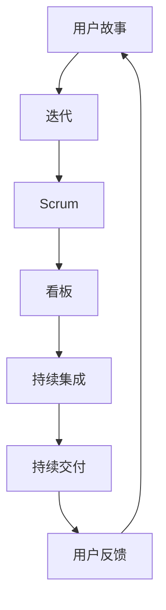

                 

在当今快速变化和高度不确定的商业环境中，敏捷管理作为一种应对动态变化的组织策略，正日益受到广泛关注。本文旨在探讨敏捷管理的核心概念、原理和应用，旨在帮助读者更好地理解和实施这一重要的管理方法论。

## 关键词
敏捷管理，敏捷方法论，组织策略，动态变化，商业环境。

## 摘要
本文将详细介绍敏捷管理的基本原理，包括其核心概念、实践方法以及如何在不同的组织场景中应用。通过本文的阅读，读者将能够深入了解敏捷管理的优势、挑战和未来的发展方向。

## 1. 背景介绍
在20世纪90年代末期，面对快速变化的市场需求和日益复杂的软件开发项目，传统的项目管理方法逐渐暴露出其局限性。为了应对这些挑战，敏捷管理方法论应运而生。敏捷管理强调快速响应变化、持续迭代和团队协作，旨在通过灵活性和适应性提升组织效率。

### 1.1 传统管理方法
在传统管理方法中，项目通常在项目启动时进行详细规划，随后按照计划执行。这种方法虽然在某些情况下有效，但在面对不确定性时往往表现出较大的局限性。传统方法强调严格的时间表和预算控制，但对需求的变更缺乏灵活性，容易导致项目延误和成本超支。

### 1.2 敏捷管理兴起
敏捷管理方法论的出现，是对传统项目管理方法的一种反思和改进。敏捷管理强调以人为核心，通过迭代和增量的方式逐步实现项目目标。这种方法论鼓励快速反馈和持续改进，使组织能够更好地适应变化。

## 2. 核心概念与联系
敏捷管理的核心概念包括用户故事、迭代、Scrum、看板等。为了更好地理解这些概念，我们使用Mermaid流程图展示其相互关系。



### 2.1 用户故事
用户故事是一种用于描述软件需求的基本单位。它通常采用“作为……，我想要……”的格式，以用户为中心，明确用户的需求和期望。

### 2.2 迭代
迭代是敏捷管理中的基本工作周期，通常持续几周。在每个迭代中，团队会集中精力完成一部分用户故事，然后进行评估和反馈。

### 2.3 Scrum
Scrum是一种流行的敏捷管理框架，它定义了如何组织团队工作、管理项目进度和产品交付。Scrum的关键组成部分包括每日站会、冲刺计划和回顾会议。

### 2.4 看板
看板是一种用于可视化和优化工作流程的工具。它通过在白板上展示任务的状态和进度，帮助团队识别瓶颈和优化流程。

### 2.5 持续集成和持续交付
持续集成和持续交付是敏捷开发中的关键实践，它们确保软件在开发过程中始终处于可部署状态，并及时响应用户反馈。

## 3. 核心算法原理 & 具体操作步骤
### 3.1 算法原理概述
敏捷管理中的核心算法原理主要包括用户故事地图、Sprint规划和任务分解等。

### 3.2 算法步骤详解
#### 3.2.1 用户故事地图
用户故事地图是一种用于理解和优先级排序用户故事的工具。通过用户故事地图，团队可以清晰地了解用户需求、产品愿景和实现路径。

#### 3.2.2 Sprint规划
Sprint规划是敏捷管理中的关键步骤。在Sprint规划中，团队会根据用户故事地图和产品需求，选择一个或多个用户故事进行开发。

#### 3.2.3 任务分解
在选择了用户故事之后，团队会将其分解为更小的任务，并分配给团队成员。

### 3.3 算法优缺点
#### 优点
- 灵活性：敏捷管理能够快速响应需求变化，确保项目始终与用户需求保持一致。
- 协作：敏捷管理强调团队合作，提高团队协作效率和沟通质量。
- 持续改进：通过迭代和反馈，团队能够不断优化产品和服务。

#### 缺点
- 项目管理难度：敏捷管理对团队和组织的要求较高，需要团队成员具备较高的自我管理和协调能力。
- 时间和资源压力：在快速迭代的过程中，团队需要平衡时间和资源，以确保每个迭代都能交付有价值的产品。

### 3.4 算法应用领域
敏捷管理广泛应用于软件开发、产品管理和咨询服务等领域。随着敏捷方法的普及，越来越多的组织开始采用敏捷管理以提高竞争力。

## 4. 数学模型和公式 & 详细讲解 & 举例说明
### 4.1 数学模型构建
敏捷管理中的数学模型主要包括工作量估算、迭代计划和风险管理等。

### 4.2 公式推导过程
#### 工作量估算
工作量估算的公式通常为：
\[ E = T \times C \]
其中，\( E \) 为估计的工作量，\( T \) 为任务时间，\( C \) 为任务复杂度系数。

#### 迭代计划
迭代计划的公式为：
\[ P = \sum_{i=1}^{n} (D_i \times C_i) \]
其中，\( P \) 为迭代计划的总工作量，\( D_i \) 为第 \( i \) 个任务的工期，\( C_i \) 为第 \( i \) 个任务的复杂度系数。

### 4.3 案例分析与讲解
假设一个开发团队计划进行一个为期两周的迭代，他们需要完成以下任务：
- 任务A：5天，复杂度系数1.2
- 任务B：3天，复杂度系数1.0
- 任务C：2天，复杂度系数1.5

根据上述公式，我们可以计算出：
\[ P = (5 \times 1.2) + (3 \times 1.0) + (2 \times 1.5) = 11 \]

这意味着团队在这个迭代中需要完成 11 的工作量。由于迭代时间为两周，我们可以计算出每天的平均工作量：
\[ \frac{11}{14} \approx 0.79 \]

这表明团队每天需要完成约 0.79 的工作量才能按时完成迭代。

## 5. 项目实践：代码实例和详细解释说明
### 5.1 开发环境搭建
为了实践敏捷管理，我们需要搭建一个适合敏捷开发的开发环境。以下是一个简单的步骤：

1. 安装JDK 1.8或更高版本。
2. 安装Maven 3.6.3或更高版本。
3. 安装Git 2.30.0或更高版本。
4. 安装一个IDE，如IntelliJ IDEA或Eclipse。

### 5.2 源代码详细实现
以下是一个简单的用户故事管理系统的源代码示例：

```java
public class UserStory {
    private String id;
    private String title;
    private String description;
    private boolean isCompleted;

    public UserStory(String id, String title, String description) {
        this.id = id;
        this.title = title;
        this.description = description;
        this.isCompleted = false;
    }

    public void complete() {
        this.isCompleted = true;
    }

    // 省略其他getter和setter方法
}
```

### 5.3 代码解读与分析
上述代码定义了一个简单的`UserStory`类，用于表示用户故事。该类包含一个唯一的ID、标题、描述以及是否完成的状态。`complete()`方法用于标记用户故事已完成。

### 5.4 运行结果展示
通过以下代码，我们可以创建一个新的用户故事并完成它：

```java
UserStory story = new UserStory("001", "开发一个API接口", "实现一个用户登录功能");
System.out.println("初始状态：" + story.isCompleted());
story.complete();
System.out.println("完成状态：" + story.isCompleted());
```

输出结果为：
```
初始状态：false
完成状态：true
```

## 6. 实际应用场景
### 6.1 软件开发
在软件开发领域，敏捷管理已被广泛采用。通过敏捷方法，团队可以更快地响应需求变化，提高产品质量。

### 6.2 产品管理
在产品管理领域，敏捷管理可以帮助团队更好地规划产品路线图，确保产品始终符合市场需求。

### 6.3 咨询服务
在咨询服务领域，敏捷管理可以帮助客户更快地实现业务目标，提高项目成功率。

## 7. 工具和资源推荐
### 7.1 学习资源推荐
- 《敏捷软件开发：原则、实践与模式》（《敏捷宣言》作者之一Kent Beck著）
- 《Scrum精髓：了解与掌握敏捷管理》（作者Jeff Sutherland著）

### 7.2 开发工具推荐
- JIRA：一款功能强大的敏捷项目管理工具。
- Trello：一款简单易用的看板工具。
- GitLab：一款开源的敏捷开发平台。

### 7.3 相关论文推荐
- 《敏捷开发与软件过程改进：一个实验性研究》（作者：阿尔贝托·莫拉蒂等）

## 8. 总结：未来发展趋势与挑战
### 8.1 研究成果总结
敏捷管理在过去几十年中取得了显著成果，已被广泛应用于多个领域。通过敏捷方法，团队可以更快地响应变化，提高产品质量。

### 8.2 未来发展趋势
随着数字化转型的加速，敏捷管理将继续发展。未来的发展趋势包括更广泛的领域应用、更先进的技术支持和更高效的管理实践。

### 8.3 面临的挑战
敏捷管理在实施过程中仍面临一些挑战，如团队协调、项目管理、技术选型等。为了克服这些挑战，组织需要持续改进和优化敏捷实践。

### 8.4 研究展望
未来，敏捷管理的研究将继续聚焦于如何更好地适应快速变化的市场需求、提高组织效率以及实现可持续发展。

## 9. 附录：常见问题与解答
### 9.1 什么是敏捷管理？
敏捷管理是一种应对快速变化的管理方法论，强调以人为核心，通过迭代和增量方式逐步实现项目目标。

### 9.2 敏捷管理与传统管理有什么区别？
敏捷管理强调快速响应变化、持续迭代和团队合作，而传统管理则侧重于严格规划和控制。

### 9.3 敏捷管理适用于哪些领域？
敏捷管理广泛应用于软件开发、产品管理、咨询服务等领域。

### 9.4 敏捷管理的核心原则是什么？
敏捷管理的核心原则包括用户需求优先、迭代开发、团队合作、快速反馈和持续改进。

---

本文由禅与计算机程序设计艺术（Zen and the Art of Computer Programming）撰写，旨在为读者提供关于敏捷管理的全面了解和实践指导。希望本文能对您的敏捷管理实践有所帮助。

