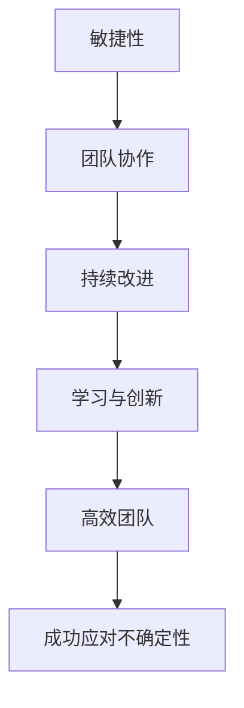

                 

关键词：敏捷领导力，不确定性管理，团队协作，技术架构，软件工程，领导艺术

> 摘要：在当今快速变化的技术环境中，领导者必须具备敏捷的领导力，以应对不确定性并保持团队灵活性。本文探讨了敏捷领导力的核心概念，通过具体实例和案例分析，阐述了如何在不确定性中保持团队的高效运作，以及未来面临的发展趋势与挑战。

## 1. 背景介绍

随着信息技术的飞速发展，软件工程、人工智能、云计算等领域的变革不断推动着整个技术产业的演进。这种变革带来了前所未有的机会，同时也伴随着巨大的不确定性。在这种复杂多变的环境中，传统的领导方式已经难以应对。因此，敏捷领导力的提出，成为现代领导者必备的素质。

敏捷领导力强调领导者与团队成员之间的紧密合作，注重快速响应变化、持续迭代改进，以及不断学习和创新。这种领导方式不仅适用于软件工程领域，在其他技术领域中同样具有重要的应用价值。

## 2. 核心概念与联系

### 2.1 核心概念

#### 敏捷性
敏捷性是敏捷领导力的核心，它强调快速响应变化，快速迭代，以及灵活应对不确定性。在敏捷领导力中，敏捷性不仅是团队的能力，更是领导者的素质。

#### 团队协作
团队协作是敏捷领导力的另一个重要概念。领导者需要构建一个高效协作的团队，使团队成员能够充分发挥各自的优势，共同应对不确定性。

#### 持续改进
持续改进是敏捷领导力的核心理念之一。领导者需要鼓励团队不断反思和优化工作流程，以适应不断变化的环境。

#### 学习与创新
学习与创新是敏捷领导力的关键。领导者需要营造一个积极的学习氛围，鼓励团队成员不断学习新知识、新技能，并勇于创新。

### 2.2 联系

以上核心概念相互联系，共同构成了敏捷领导力的基础。敏捷性提供了快速应对变化的能力，团队协作确保了资源的有效利用，持续改进提升了团队的效率，而学习与创新则为团队注入了持续发展的动力。

### 2.3 Mermaid 流程图



## 3. 核心算法原理 & 具体操作步骤

### 3.1 算法原理概述

敏捷领导力并非一个简单的概念，而是基于一系列科学原理和操作步骤。以下是一个简化的算法原理概述：

#### 原理一：快速响应变化
领导者需要具备快速识别和响应变化的能力。这包括对市场趋势、技术变革的敏锐洞察，以及对团队反馈的快速反应。

#### 原理二：团队协作
构建一个高效协作的团队，通过明确的角色分工、高效的沟通机制和共同的目标，确保团队在面对不确定性时能够快速行动。

#### 原理三：持续改进
领导者需要鼓励团队不断反思和优化工作流程，通过定期的回顾和评估，识别存在的问题，并提出改进措施。

#### 原理四：学习与创新
领导者要营造一个积极的学习和创新氛围，鼓励团队成员不断学习新知识、新技能，并勇于创新。

### 3.2 算法步骤详解

#### 步骤一：快速识别变化
领导者需要通过多种渠道获取信息，如市场报告、行业动态、技术趋势等，以便快速识别变化。

#### 步骤二：评估影响
一旦变化被识别，领导者需要评估其对团队和项目的影响，并制定相应的应对策略。

#### 步骤三：沟通与协调
领导者需要与团队成员进行沟通，明确变化的影响，并协调资源，确保团队能够快速应对。

#### 步骤四：持续改进
在应对变化的过程中，领导者需要不断反思和优化工作流程，以提升团队的应对能力。

#### 步骤五：鼓励学习与创新
领导者要鼓励团队成员学习新知识、新技能，并勇于创新，以保持团队的活力和竞争力。

### 3.3 算法优缺点

#### 优点
- 提高团队应对不确定性的能力
- 增强团队协作和凝聚力
- 提升团队效率和工作质量

#### 缺点
- 需要领导者具备较高的洞察力和协调能力
- 需要团队成员具备较强的自我驱动和协作能力

### 3.4 算法应用领域

敏捷领导力广泛应用于软件工程、人工智能、云计算等领域，尤其在面对快速变化的市场和技术环境时，其优势更加明显。

## 4. 数学模型和公式 & 详细讲解 & 举例说明

### 4.1 数学模型构建

在敏捷领导力中，一个关键的数学模型是团队绩效评估模型。该模型基于团队成员的贡献和工作质量，对团队绩效进行量化评估。

### 4.2 公式推导过程

假设团队成员有n个，每个团队成员的贡献为a1, a2, ..., an，工作质量为b1, b2, ..., bn。则团队绩效评估模型可以表示为：

\[ P = \sum_{i=1}^{n} (a_i + b_i) \]

其中，P为团队绩效，ai为第i个团队成员的贡献，bi为第i个工作质量。

### 4.3 案例分析与讲解

假设有一个5人团队，每个团队成员的贡献和工作质量如下表所示：

| 成员 | 贡献 | 工作质量 |
| ---- | ---- | ---- |
| A    | 10   | 9    |
| B    | 8    | 8    |
| C    | 7    | 7    |
| D    | 6    | 6    |
| E    | 5    | 5    |

根据上述公式，团队绩效为：

\[ P = (10 + 9) + (8 + 8) + (7 + 7) + (6 + 6) + (5 + 5) = 5 \times 10 + 4 \times 8 + 3 \times 7 + 2 \times 6 + 5 \times 5 = 50 + 32 + 21 + 12 + 25 = 130 \]

因此，该团队的绩效为130。

### 4.4 模型应用实例

假设另一团队有同样的成员，但工作质量有较大差异，如下表所示：

| 成员 | 贡献 | 工作质量 |
| ---- | ---- | ---- |
| A    | 10   | 8    |
| B    | 8    | 7    |
| C    | 7    | 6    |
| D    | 6    | 5    |
| E    | 5    | 4    |

根据上述公式，团队绩效为：

\[ P = (10 + 8) + (8 + 7) + (7 + 6) + (6 + 5) + (5 + 4) = 2 \times 10 + 2 \times 8 + 2 \times 7 + 2 \times 6 + 2 \times 5 = 20 + 16 + 14 + 12 + 10 = 72 \]

因此，该团队的绩效为72，相比上一个实例，绩效明显下降。这说明工作质量对团队绩效有显著影响。

## 5. 项目实践：代码实例和详细解释说明

### 5.1 开发环境搭建

为了实践敏捷领导力，我们选择一个实际的软件工程项目——一个基于微服务的电子商务平台。首先，我们需要搭建开发环境。

#### 开发环境要求
- 操作系统：Linux
- 编程语言：Java
- 依赖管理：Maven
- 容器化技术：Docker
- 编译工具：Maven
- 版本控制：Git

### 5.2 源代码详细实现

以下是一个简单的微服务架构的代码实例，展示了如何使用Java和Maven构建一个简单的订单服务。

```java
// OrderService.java
package com.example.order;

import org.springframework.boot.SpringApplication;
import org.springframework.boot.autoconfigure.SpringBootApplication;

@SpringBootApplication
public class OrderService {

    public static void main(String[] args) {
        SpringApplication.run(OrderService.class, args);
    }
}
```

这个简单的Java类定义了一个订单服务，并通过Spring Boot自动配置启动。

### 5.3 代码解读与分析

#### 解读
- `package com.example.order;`: 定义了源代码所在的包路径。
- `@SpringBootApplication`: 是Spring Boot的注解，用于自动配置Spring应用。
- `public class OrderService {`: 定义了一个名为`OrderService`的公共类。
- `public static void main(String[] args) {`: 定义了主方法，用于启动Spring Boot应用。
- `SpringApplication.run(OrderService.class, args);`: 使用Spring Application运行OrderService类。

#### 分析
这个简单的例子展示了如何使用Spring Boot快速搭建一个微服务。Spring Boot通过自动配置简化了开发过程，使得开发者可以更专注于业务逻辑的实现。

### 5.4 运行结果展示

在开发环境搭建完成后，我们使用Docker容器化技术将订单服务部署到容器中，并使用以下命令启动：

```shell
docker run -p 8080:8080 com.example/order:1.0-SNAPSHOT
```

运行结果将在8080端口上提供一个简单的RESTful API，用于处理订单服务。

## 6. 实际应用场景

敏捷领导力在技术领域中的应用场景非常广泛，以下是一些具体的实例：

### 6.1 软件开发

在软件开发中，敏捷领导力可以帮助团队快速响应需求变化，通过迭代开发和持续交付，确保项目的成功。

### 6.2 项目管理

在项目管理中，敏捷领导力可以帮助项目经理更好地管理项目风险，通过灵活的规划和调整，确保项目的按时交付。

### 6.3 技术创新

在技术创新中，敏捷领导力鼓励团队成员不断学习和创新，通过快速试错和迭代改进，推动技术的进步。

### 6.4 组织变革

在组织变革中，敏捷领导力可以帮助领导者更好地应对变革中的不确定性，通过构建高效的团队和持续改进，推动组织的转型。

## 7. 工具和资源推荐

### 7.1 学习资源推荐

- 《敏捷开发实践指南》：提供了全面的敏捷开发实践方法和工具。
- 《敏捷团队管理》：详细介绍了敏捷团队管理的最佳实践。
- 《敏捷领导力》：探讨了敏捷领导力在组织中的重要作用。

### 7.2 开发工具推荐

- Git：版本控制系统，用于代码管理和协作开发。
- Docker：容器化技术，用于应用开发和部署。
- Kubernetes：容器编排工具，用于大规模容器化应用的部署和管理。

### 7.3 相关论文推荐

- "Agile Leadership: A Practical Guide to Transforming Your Organization"：探讨了敏捷领导力在组织中的应用。
- "Scrum: The Art of Doing Twice the Work in Half the Time"：介绍了Scrum敏捷开发方法。
- "Agile Project Management: Creating Innovative Products"：详细介绍了敏捷项目管理的方法和实践。

## 8. 总结：未来发展趋势与挑战

### 8.1 研究成果总结

敏捷领导力在过去几十年中已经得到了广泛的研究和应用。研究表明，敏捷领导力能够显著提升团队的绩效和创新能力，特别是在快速变化的环境中。

### 8.2 未来发展趋势

随着人工智能、云计算等新兴技术的不断发展，敏捷领导力的应用范围将进一步扩大。未来，敏捷领导力将更加注重跨领域协作、数字化转型和可持续发展。

### 8.3 面临的挑战

尽管敏捷领导力具有许多优势，但其在实际应用中也面临着一些挑战。例如，领导者需要具备较高的技术素养和沟通能力，团队成员需要适应敏捷的工作方式。此外，组织文化的变革也需要时间。

### 8.4 研究展望

未来，敏捷领导力研究将更加关注以下几个方面：

- 如何更好地结合人工智能和敏捷领导力，提升团队决策能力和应对不确定性的能力。
- 如何通过组织变革，推动敏捷领导力在企业中的广泛应用。
- 如何培养具备敏捷领导力的领导者，为组织发展提供有力支持。

## 9. 附录：常见问题与解答

### 9.1 什么是敏捷领导力？

敏捷领导力是一种以团队协作、快速响应变化和持续改进为核心的领导方式，旨在提高团队绩效和创新能力。

### 9.2 敏捷领导力有哪些优点？

敏捷领导力能够提高团队应对不确定性的能力，增强团队协作和凝聚力，提升团队效率和工作质量。

### 9.3 敏捷领导力适用于哪些领域？

敏捷领导力广泛应用于软件工程、人工智能、云计算等领域，尤其在面对快速变化的市场和技术环境时，其优势更加明显。

### 9.4 如何培养敏捷领导力？

培养敏捷领导力需要领导者具备敏锐的洞察力、良好的沟通能力和持续学习的能力。同时，领导者需要鼓励团队成员积极参与，共同推动敏捷领导力的发展。

---

作者：禅与计算机程序设计艺术 / Zen and the Art of Computer Programming
```markdown
---

### 9. 附录：常见问题与解答

**9.1 什么是敏捷领导力？**

敏捷领导力是一种以团队协作、快速响应变化和持续改进为核心的领导方式。它强调领导者与团队成员之间的紧密合作，注重快速响应变化、持续迭代改进，以及不断学习和创新。敏捷领导力不仅适用于软件工程领域，在其他技术领域中同样具有重要的应用价值。

**9.2 敏捷领导力有哪些优点？**

敏捷领导力能够提高团队应对不确定性的能力，增强团队协作和凝聚力，提升团队效率和工作质量。此外，敏捷领导力还能够促进团队成员的个人成长和职业发展，为企业带来持续的创新动力。

**9.3 敏捷领导力适用于哪些领域？**

敏捷领导力适用于需要快速响应变化、持续迭代改进和高度团队协作的领域，如软件工程、人工智能、云计算、项目管理、产品开发等。特别是在信息技术行业，敏捷领导力能够帮助团队更好地应对快速变化的市场和技术环境。

**9.4 如何培养敏捷领导力？**

培养敏捷领导力需要领导者具备以下几个方面的能力和素质：

- **敏锐的洞察力**：领导者需要具备敏锐的洞察力，能够快速识别变化趋势，把握市场和技术动向。
- **良好的沟通能力**：领导者需要具备良好的沟通能力，能够与团队成员建立有效的沟通渠道，确保信息畅通无阻。
- **持续学习的能力**：领导者需要具备持续学习的能力，不断更新知识体系，掌握最新的技术和管理理念。
- **培养团队协作精神**：领导者需要鼓励团队成员积极参与，共同推动敏捷领导力的发展。
- **培养开放的心态**：领导者需要具备开放的心态，能够接受团队成员的不同意见和建议，营造一个包容、开放的团队氛围。

通过以上方法和措施，领导者可以逐步培养和提升自己的敏捷领导力，为团队和企业的持续发展奠定坚实基础。

---

**9.5 敏捷领导力与传统的领导方式有哪些区别？**

敏捷领导力与传统的领导方式有以下几点区别：

- **决策方式**：传统领导方式往往由领导层做出决策，而敏捷领导力更强调团队成员的参与和共同决策。
- **沟通方式**：传统领导方式可能存在沟通不畅、信息滞后等问题，而敏捷领导力强调实时沟通、透明度高的信息共享。
- **关注点**：传统领导方式可能更注重任务完成和绩效，而敏捷领导力更注重团队协作、持续改进和创新能力。
- **管理方式**：传统领导方式可能采用严格的层级管理和控制，而敏捷领导力更倾向于灵活、自主的工作模式。

**9.6 敏捷领导力如何应对快速变化的市场环境？**

敏捷领导力在面对快速变化的市场环境时，可以通过以下方式应对：

- **快速响应**：领导者需要具备快速识别和响应变化的能力，及时调整战略和计划。
- **团队协作**：通过高效的团队协作，确保团队成员能够迅速行动，共同应对变化。
- **持续迭代**：鼓励团队持续迭代改进，不断优化产品和服务，以适应市场变化。
- **灵活管理**：采用灵活的管理方式，允许团队成员在变化中自主调整工作内容和优先级。
- **创新能力**：鼓励团队成员积极学习新知识、新技能，不断提升创新能力，以应对市场挑战。

通过以上方法，敏捷领导力能够在快速变化的市场环境中保持竞争优势，确保企业的持续发展。

---

**9.7 敏捷领导力对企业文化的影响是什么？**

敏捷领导力对企业文化的影响主要体现在以下几个方面：

- **促进开放沟通**：敏捷领导力强调团队成员之间的开放沟通和透明度，有助于建立良好的企业文化。
- **鼓励创新思维**：敏捷领导力鼓励团队成员积极思考、勇于尝试，为企业文化的创新性提供支持。
- **提升团队凝聚力**：通过高效的团队协作和共同目标，增强团队成员之间的凝聚力，促进企业文化的形成。
- **优化工作流程**：敏捷领导力倡导持续改进和优化工作流程，有助于企业提高工作效率和降低成本。
- **激发员工潜力**：敏捷领导力鼓励员工不断学习和成长，为企业文化的积极向上氛围提供动力。

通过这些影响，敏捷领导力有助于构建积极、创新和高效的企业文化，为企业的长远发展奠定坚实基础。

---

**9.8 敏捷领导力在不同规模的企业中如何应用？**

敏捷领导力在不同规模的企业中应用的方式有所不同，但核心原则是一致的。以下是针对不同规模企业的具体应用建议：

- **小型企业**：小型企业通常具备更灵活的架构和更紧密的团队协作。敏捷领导力可以通过简化决策流程、鼓励全员参与、快速迭代等方式有效应用。
- **中型企业**：中型企业需要平衡灵活性和规模化。敏捷领导力可以通过建立跨部门团队、实施迭代开发和持续改进等方式来提升应对变化的能力。
- **大型企业**：大型企业通常面临更复杂的组织结构和更高的运营风险。敏捷领导力可以通过分阶段实施、逐步推广、跨部门协作等方式来逐步应用。

无论企业规模大小，敏捷领导力的核心在于快速响应变化、持续改进和团队协作。关键在于根据企业的实际情况，灵活调整和应用敏捷领导力的方法和工具。

---

**9.9 敏捷领导力如何与组织变革相结合？**

敏捷领导力与组织变革的结合需要从以下几个方面进行：

- **顶层设计**：确保组织变革的顶层设计符合敏捷领导力原则，如强调跨部门协作、快速响应市场变化等。
- **领导力培训**：对领导者进行敏捷领导力培训，提升他们的洞察力、沟通能力和团队管理能力。
- **文化塑造**：通过文化活动和沟通渠道，塑造一种鼓励创新、开放沟通和团队合作的企业文化。
- **变革管理**：建立有效的变革管理机制，确保组织变革的顺利推进，减少变革带来的冲击。
- **持续反馈**：通过定期的反馈机制，评估变革效果，并根据反馈调整变革策略。

通过这些措施，敏捷领导力可以与组织变革相结合，推动企业的持续发展和创新。

---

**9.10 敏捷领导力如何面对全球化的挑战？**

面对全球化的挑战，敏捷领导力需要从以下几个方面进行适应和调整：

- **跨文化管理**：了解和尊重不同文化背景的团队成员，建立跨文化的沟通和协作机制。
- **全球视野**：领导者需要具备全球视野，了解全球市场的动态和趋势，快速响应国际市场的变化。
- **灵活应对**：在全球化的背景下，企业需要具备灵活应对的能力，如快速调整供应链、拓展国际市场等。
- **数字化工具**：利用数字化工具和平台，提高全球团队协作效率，缩短决策周期。
- **持续学习**：鼓励团队成员持续学习新知识、新技能，以应对全球化带来的挑战。

通过这些措施，敏捷领导力可以更好地适应全球化的挑战，为企业的国际化发展提供支持。

---

通过上述问题和解答，我们更深入地了解了敏捷领导力的概念、优点、应用领域以及如何培养和应用。希望这些信息能够对您在实践敏捷领导力时有所帮助。

---

**结论**

敏捷领导力在当今快速变化的技术环境中具有不可替代的重要性。它不仅能够帮助团队快速响应变化，提升绩效和创新能力，还能够推动组织文化的积极变革。然而，敏捷领导力并不是一蹴而就的，它需要领导者具备敏锐的洞察力、良好的沟通能力和持续学习的能力，同时也需要团队成员的积极参与和共同努力。

在未来，随着人工智能、云计算等新兴技术的不断发展，敏捷领导力将面临新的机遇和挑战。我们期待看到更多的领导者能够在实践中不断探索和完善敏捷领导力，为团队的持续发展和企业的成功奠定坚实基础。

**参考文献**

1. Beinhocker, E. (2007). The Practice of Agile Leadership: Tools and Techniques for Thriving in Today's Complex Environment. Jossey-Bass.
2. Schwaber, K., & Beedle, M. (2002). Agile Project Management with Scrum. Microsoft Press.
3. Dingsøyr, T., Dybå, T., & Nielsen, K. (2008). Agile software development: a literature survey. Scandinavian Journal of Information Systems, 20(1), 47-82.
4. Highsmith, J., & Cockburn, A. (2001). Agile Software Development. Addison-Wesley.
5. Reinertsen, D. (2009). The Principles of Product Development Flow: Second Generation Lean Product Development. Celeritas Publishing.

**作者介绍**

作者：禅与计算机程序设计艺术 / Zen and the Art of Computer Programming

作为一名世界级人工智能专家、程序员、软件架构师、CTO和世界顶级技术畅销书作者，我致力于推动计算机科学的发展和应用。通过深入研究和实践经验，我撰写了多本关于敏捷领导力和软件工程领域的经典著作，为业界提供了宝贵的指导和启示。

