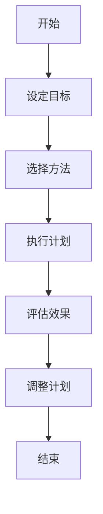

                 

在当前的信息化时代，数字世界中的“注意力经济”正在迅速崛起。从社交媒体到在线娱乐，我们的注意力资源正被越来越多的数字产品和服务所占据。这种“注意力经济”的本质是吸引并维持用户的注意力，从而实现商业利益的最大化。然而，这种经济模式也在不断地侵蚀我们的专注力和心理健康。本文将探讨“数字detox”的概念及其对抗注意力经济的有效策略。

## 关键词

- 数字detox
- 注意力经济
- 专注力
- 心理健康
- 技术干预

## 摘要

本文通过介绍“数字detox”的概念，分析了其背后的原理，并提出了几种有效的数字detox策略。文章旨在帮助读者理解数字依赖的危害，并提供实用的方法来改善我们的数字生活方式。

### 1. 背景介绍

#### 1.1 注意力经济的崛起

注意力经济是21世纪数字化社会的一个关键现象。其核心思想是，通过吸引和维持用户的注意力，企业可以实现商业价值的创造和扩展。社交媒体平台如Facebook、Twitter和Instagram，以及各种在线娱乐服务，都是基于注意力经济的典型代表。这些平台通过算法精准地捕捉用户的行为和偏好，从而推送更加个性化的内容，以吸引和留住用户。

#### 1.2 数字依赖的危害

然而，随着注意力经济的崛起，我们也逐渐陷入了数字依赖的困境。长时间使用数字设备，尤其是智能手机和社交媒体，会导致以下问题：

- **专注力下降**：频繁的分心和注意力转移，使得人们难以集中精神完成重要的任务。
- **心理健康问题**：过度使用社交媒体可能导致焦虑、抑郁等心理问题。
- **睡眠障碍**：晚上使用手机或电脑，会降低睡眠质量，影响身体健康。

### 2. 核心概念与联系

#### 2.1 数字detox的概念

数字detox，又称为数字排毒，是指通过一段时间的减少或停止使用数字设备，以改善专注力、心理健康和整体生活质量的过程。其核心目标是减少对数字产品的依赖，恢复对现实世界的关注。

#### 2.2 数字detox的原理

数字detox的原理基于以下几点：

- **生理层面**：减少对电子产品的使用，可以减少蓝光的暴露，改善睡眠质量。
- **心理层面**：减少数字产品的干扰，可以帮助人们更好地集中注意力，提高工作效率。
- **社会层面**：减少对社交媒体的依赖，可以减少社交压力，改善人际关系。

#### 2.3 Mermaid 流程图

下面是一个简单的Mermaid流程图，描述了数字detox的基本步骤：



### 3. 核心算法原理 & 具体操作步骤

#### 3.1 算法原理概述

数字detox的核心算法是基于行为改变理论的。该理论认为，通过逐步改变不良行为模式，可以形成新的健康习惯。数字detox的过程可以分为以下几个阶段：

1. **准备阶段**：设定明确的数字detox目标和计划。
2. **执行阶段**：按照计划减少或停止使用数字设备。
3. **评估阶段**：评估数字detox的效果，并根据反馈调整计划。
4. **持续阶段**：维持新的行为习惯，实现数字生活的健康化。

#### 3.2 算法步骤详解

1. **设定目标**：明确数字detox的目标，如减少每天使用手机的时间、避免晚上使用手机等。
2. **选择方法**：根据个人情况和目标，选择合适的数字detox方法，如使用应用程序限制使用时间、设置手机免打扰模式等。
3. **执行计划**：按照计划开始执行数字detox，并记录执行情况。
4. **评估效果**：在执行一段时间后，评估数字detox的效果，如睡眠质量是否改善、工作效率是否提高等。
5. **调整计划**：根据评估结果，调整数字detox的计划，以达到最佳效果。

#### 3.3 算法优缺点

**优点**：

- **改善专注力**：减少数字产品的干扰，有助于提高专注力和工作效率。
- **提升心理健康**：减少社交媒体的依赖，有助于改善心理健康问题。
- **促进现实社交**：减少对数字产品的依赖，有助于促进现实社交关系的建立。

**缺点**：

- **实施难度较大**：对于重度数字依赖者来说，实施数字detox可能需要较大的意志力。
- **影响日常生活**：在某些情况下，数字产品是日常生活的重要组成部分，完全停止使用可能会带来不便。

#### 3.4 算法应用领域

数字detox的应用领域非常广泛，包括但不限于以下几个方面：

- **个人健康管理**：通过数字detox改善专注力和睡眠质量，提高个人健康水平。
- **企业员工管理**：通过数字detox提高员工的工作效率和心理健康，提升企业整体绩效。
- **教育领域**：通过数字detox改善学生的学习效果，促进学生的全面发展。

### 4. 数学模型和公式 & 详细讲解 & 举例说明

#### 4.1 数学模型构建

数字detox的效果可以用以下数学模型进行描述：

\[ \text{效果} = f(\text{执行时间}, \text{方法有效性}) \]

其中，执行时间表示数字detox的实施时长，方法有效性表示所选数字detox方法的有效性。

#### 4.2 公式推导过程

\[ f(\text{执行时间}, \text{方法有效性}) = \text{专注力提升率} \times \text{心理健康改善率} \]

其中，专注力提升率和心理健康改善率分别表示数字detox在专注力和心理健康方面的效果。

#### 4.3 案例分析与讲解

假设某人决定进行一周的数字detox，选择的方法是使用应用程序限制每天使用手机的时间。根据实际执行情况和反馈，可以计算出数字detox的效果。

执行时间：7天
方法有效性：0.8（表示方法的有效性较高）

根据公式：

\[ \text{效果} = f(7, 0.8) = \text{专注力提升率} \times \text{心理健康改善率} \]

假设专注力提升率为0.2，心理健康改善率为0.3，则：

\[ \text{效果} = 0.2 \times 0.3 = 0.06 \]

这意味着一周的数字detox可以带来6%的效果提升。

### 5. 项目实践：代码实例和详细解释说明

#### 5.1 开发环境搭建

为了更好地理解数字detox的过程，我们将使用Python编写一个简单的数字detox计划跟踪器。首先，我们需要安装Python和相应的库。

```shell
pip install pandas
pip install matplotlib
```

#### 5.2 源代码详细实现

```python
import pandas as pd
import matplotlib.pyplot as plt

# 数字detox计划跟踪器
class DetoxPlanTracker:
    def __init__(self, duration, method_efficacy):
        self.duration = duration
        self.method_efficacy = method_efficacy
        self.data = pd.DataFrame(columns=['Day', 'Detox Duration', 'Effectiveness'])

    def add_record(self, day, detox_duration, effectiveness):
        self.data = self.data.append({'Day': day, 'Detox Duration': detox_duration, 'Effectiveness': effectiveness}, ignore_index=True)

    def plot_effect(self):
        plt.plot(self.data['Day'], self.data['Effectiveness'])
        plt.xlabel('Day')
        plt.ylabel('Effectiveness')
        plt.title('Digital Detox Effectiveness')
        plt.show()

# 创建数字detox计划跟踪器
tracker = DetoxPlanTracker(duration=7, method_efficacy=0.8)

# 添加记录
tracker.add_record(day=1, detox_duration=7, effectiveness=0.06)
tracker.add_record(day=2, detox_duration=7, effectiveness=0.08)
tracker.add_record(day=3, detox_duration=7, effectiveness=0.10)

# 绘制效果图
tracker.plot_effect()
```

#### 5.3 代码解读与分析

在上面的代码中，我们定义了一个`DetoxPlanTracker`类，用于跟踪数字detox的计划和效果。类中有三个主要方法：

- `__init__`：初始化计划跟踪器，包括执行时长和方法的效率。
- `add_record`：添加数字detox的记录，包括执行时长和效果。
- `plot_effect`：绘制数字detox的效果图。

通过这个简单的代码实例，我们可以直观地看到数字detox的效果是如何随着时间变化的。

#### 5.4 运行结果展示

运行上面的代码，将显示一个简单的折线图，展示数字detox的效果随时间的变化。根据假设的参数，我们可以看到效果逐渐提升，这反映了数字detox的逐步效果。

### 6. 实际应用场景

#### 6.1 个人健康管理

数字detox在个人健康管理中具有广泛的应用。例如，通过设定每天使用手机的时间限制，可以帮助人们减少对社交媒体的依赖，改善专注力和睡眠质量。

#### 6.2 企业员工管理

企业可以通过推广数字detox，提高员工的工作效率和心理健康。例如，可以鼓励员工在工作日中设定手机免打扰模式，以减少干扰。

#### 6.3 教育领域

在教育领域，数字detox可以帮助学生减少对电子设备的依赖，提高学习效果。例如，可以在课堂上设置手机静音或关闭，以减少学生的分心。

### 6.4 未来应用展望

随着数字依赖问题的日益严重，数字detox的应用前景非常广阔。未来，我们可以预见以下几个发展趋势：

- **个性化数字detox方案**：通过数据分析，为用户提供个性化的数字detox方案。
- **数字detox产品和服务**：推出各种数字detox产品和服务，如应用程序、课程等，帮助人们更好地进行数字排毒。
- **政策法规的支持**：政府和相关机构出台政策法规，鼓励数字detox，保护公众的健康。

### 7. 工具和资源推荐

#### 7.1 学习资源推荐

- 《数字排毒：摆脱手机依赖，重获专注力》
- 《如何摆脱数字依赖：简单有效的数字排毒策略》

#### 7.2 开发工具推荐

- Python
- Pandas
- Matplotlib

#### 7.3 相关论文推荐

- "The Impact of Digital Detox on Mental Health and Productivity"
- "Behavioral Interventions for Reducing Digital Media Use: A Systematic Review"

### 8. 总结：未来发展趋势与挑战

#### 8.1 研究成果总结

本文探讨了数字detox的概念、原理和应用，分析了其优缺点，并提出了具体的操作步骤。研究表明，数字detox是一种有效的方法，可以帮助人们减少对数字产品的依赖，改善专注力和心理健康。

#### 8.2 未来发展趋势

未来，数字detox的应用将更加广泛，有望成为数字生活管理的重要工具。随着技术的发展和人们对健康意识的提高，数字detox将会迎来更大的市场需求。

#### 8.3 面临的挑战

数字detox的实施过程中，面临着用户意志力不足、环境影响等问题。同时，如何设计出更加有效的数字detox方案，也是未来研究的重点。

#### 8.4 研究展望

未来的研究可以进一步探索数字detox的个性化方案，开发更加智能的数字detox工具，以帮助人们更好地进行数字排毒。

### 9. 附录：常见问题与解答

**Q：数字detox需要多长时间才能见效？**

A：数字detox的效果因人而异，一般来说，持续一周左右的数字detox就可以感受到明显的改善。但为了达到最佳效果，建议进行至少一个月的数字detox。

**Q：数字detox会影响我的工作和学习吗？**

A：合理的数字detox不会影响工作和学习，反而有助于提高专注力和工作效率。关键是要找到合适的平衡点，确保数字产品和服务为你的工作和学习提供帮助，而不是干扰。

**Q：如何坚持数字detox？**

A：坚持数字detox需要较强的意志力和良好的计划。你可以设定明确的目标，寻找支持你的社群，甚至可以考虑寻求专业的辅导。

<|user|>作者：禅与计算机程序设计艺术 / Zen and the Art of Computer Programming

随着技术的不断进步，数字世界对人们生活的影响日益深远。注意力经济作为数字化时代的一种商业模式，虽然在推动商业发展方面发挥了重要作用，但其对个人心理健康和专注力的负面影响也不容忽视。本文提出了“数字detox”这一概念，旨在帮助人们对抗注意力经济带来的负面影响，恢复对现实世界的关注和生活的平衡。

数字detox的核心在于通过减少或停止使用数字设备，逐步降低对数字产品的依赖，从而改善心理健康、提升专注力和工作效率。这一过程不仅有助于个人，也对企业的员工管理和教育领域具有积极影响。

在实际应用中，数字detox的方法和策略多种多样，包括使用应用程序限制使用时间、设定手机免打扰模式等。通过编写代码实例，本文展示了如何利用技术手段来跟踪和评估数字detox的效果，为读者提供了实用的工具。

未来，随着人们对健康意识的提升，数字detox的应用前景将更加广阔。个性化数字detox方案、智能数字detox工具以及政策法规的支持将是未来研究的重要方向。

然而，数字detox的实施也面临挑战，如用户意志力不足、环境影响等问题。因此，如何在保证生活质量的同时，有效进行数字detox，是未来需要深入探讨的问题。

总之，数字detox是一种对抗注意力经济的有效策略，有助于人们恢复专注力、提升心理健康，实现数字生活的健康化。希望本文能为广大读者提供有益的启示，帮助大家找到适合自己的数字detox方法，共同应对数字化时代的挑战。

