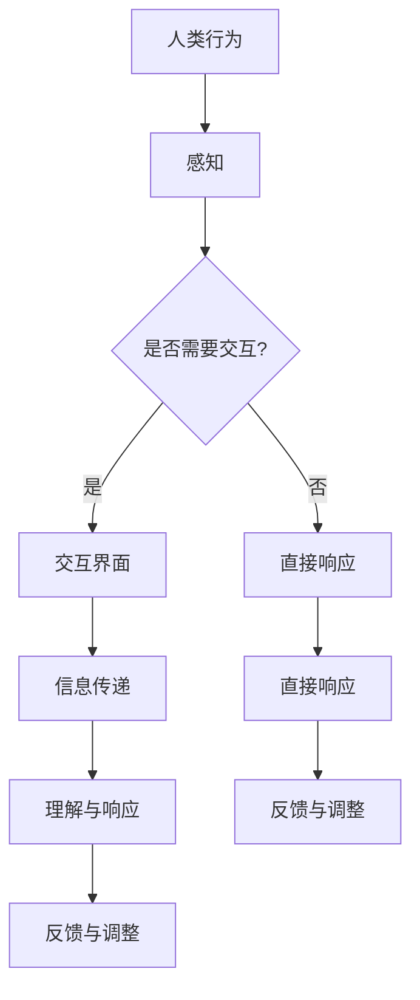
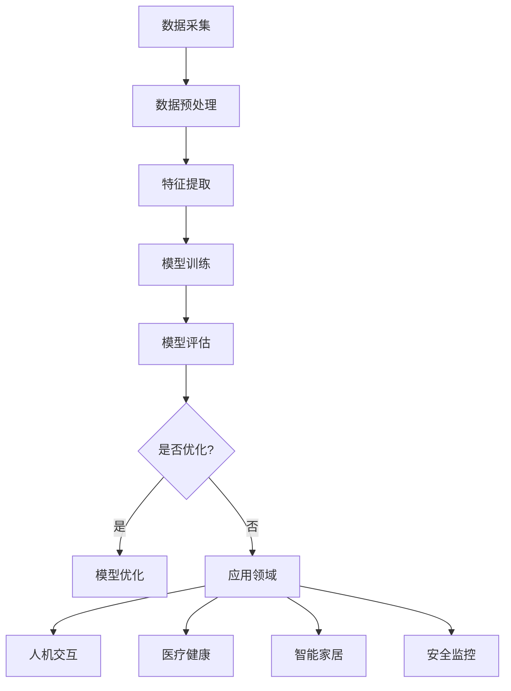

                 

关键词：数字人类意识，人工智能，现实与虚拟的交织，意识建模，AI技术发展，人类意识感知

> 摘要：随着人工智能技术的飞速发展，人类意识在数字世界中的映射和交互成为了研究的热点。本文将探讨人类意识在数字世界的形成、运作机制及其在AI中的应用，分析AI如何理解和模拟人类意识，以及现实与虚拟世界之间的互动和影响。

## 1. 背景介绍

人工智能（AI）作为计算机科学的一个分支，旨在通过机器模拟人类智能行为。从最初的规则系统到现代的深度学习算法，AI在图像识别、自然语言处理、决策支持等方面取得了显著的进展。然而，在AI领域，人类意识的研究却相对滞后。意识作为一种复杂且难以捉摸的心理现象，一直是哲学、心理学和神经科学的研究对象。随着神经科学和认知科学的发展，人类意识的研究逐渐渗透到计算机科学领域。

近年来，随着脑机接口技术的进步，AI与人类意识之间的联系变得更加紧密。通过脑机接口，人工智能可以直接从大脑中提取信息，实现与人类意识的无缝交互。这种技术的发展不仅为人类意识的数字映射提供了可能性，也为AI更好地理解人类行为和思维提供了新的途径。

本文旨在探讨数字世界中的人类意识，分析AI如何模拟和理解人类意识，并探讨这种模拟在现实生活中的应用和影响。

## 2. 核心概念与联系

### 2.1 人类意识概述

人类意识是指个体对自己和外部世界的感知、理解和反应能力。它包括知觉、思维、情感和意愿等多个方面。意识的产生与大脑的结构和功能密切相关，目前的研究主要集中在理解大脑神经网络的工作原理上。

### 2.2 人工智能与人类意识的联系

人工智能与人类意识的联系主要体现在两个方面：一是AI如何模拟和理解人类意识，二是人类意识如何在数字世界中映射和表达。

#### 2.2.1 AI模拟人类意识

AI模拟人类意识主要通过神经网络和机器学习算法实现。神经网络模仿大脑的结构和功能，通过大量的数据训练，可以逐步理解和预测人类的行为和思维。机器学习算法则利用这些神经网络，自动从数据中学习规律和模式，实现人类意识的一些功能，如情感识别、决策支持和意图理解。

#### 2.2.2 人类意识在数字世界的映射

人类意识在数字世界的映射主要通过两种方式实现：一是通过脑机接口直接从大脑中提取信息，二是通过语言和视觉等感知通道与数字世界进行交互。脑机接口技术可以将大脑活动转化为数字信号，这些信号可以被AI系统解析和理解，从而实现人类意识在数字世界的映射。语言和视觉交互则通过自然语言处理和计算机视觉技术实现，这些技术可以使AI系统能够理解和响应人类的行为和需求。

### 2.3 人类意识与AI系统的交互

人类意识与AI系统的交互主要体现在两个方面：一是AI系统对人类行为的理解，二是人类对AI系统的反馈和调整。

#### 2.3.1 AI系统对人类行为的理解

AI系统通过神经网络和机器学习算法，可以逐步理解人类的行为和思维。这种理解不仅包括对行为的识别，还包括对行为背后的意图和动机的理解。例如，通过情感识别技术，AI系统可以理解人类的情绪状态，从而更好地适应和满足人类的需求。

#### 2.3.2 人类对AI系统的反馈和调整

人类对AI系统的反馈和调整主要通过交互界面实现。通过语言和视觉交互，人类可以表达自己的需求和意图，AI系统则根据这些信息进行调整和优化。例如，在语音助手系统中，用户可以通过语音命令控制设备，AI系统则根据这些命令进行相应的操作，并根据用户的反馈进行优化。

### 2.4 Mermaid流程图

下面是一个关于人类意识与AI系统交互的Mermaid流程图：



## 3. 核心算法原理 & 具体操作步骤

### 3.1 算法原理概述

在AI模拟和理解人类意识的过程中，核心算法主要包括神经网络、机器学习算法和情感识别技术。这些算法通过从大量数据中学习，逐步理解和预测人类的行为和思维。

### 3.2 算法步骤详解

#### 3.2.1 神经网络

神经网络是AI模拟人类意识的基础。神经网络通过模拟大脑的结构和功能，实现人类意识的一些基本功能。具体步骤如下：

1. 数据采集：从多种渠道收集人类行为数据，包括语音、文字、图像等。
2. 数据预处理：对数据进行清洗和标准化，使其适合神经网络训练。
3. 神经网络构建：根据数据特点和需求，构建适合的神经网络结构。
4. 数据训练：使用采集的数据训练神经网络，使其能够模拟和理解人类行为。
5. 模型评估：通过测试数据评估神经网络模型的性能，并进行优化。

#### 3.2.2 机器学习算法

机器学习算法是神经网络的基础，通过从数据中学习规律和模式，实现人类意识的一些高级功能。具体步骤如下：

1. 数据采集：与神经网络相同，从多种渠道收集人类行为数据。
2. 数据预处理：对数据进行清洗和标准化。
3. 特征提取：从数据中提取特征，用于机器学习模型的训练。
4. 模型训练：使用特征数据训练机器学习模型，使其能够识别和理解人类行为。
5. 模型评估：通过测试数据评估模型性能，并进行优化。

#### 3.2.3 情感识别技术

情感识别技术是AI理解人类意识的重要组成部分。通过分析语音、文字和图像等信息，情感识别技术可以识别人类的情感状态。具体步骤如下：

1. 数据采集：收集包含情感信息的语音、文字和图像数据。
2. 数据预处理：对数据进行清洗和标准化。
3. 特征提取：从数据中提取情感特征。
4. 模型训练：使用情感特征数据训练情感识别模型。
5. 模型评估：通过测试数据评估模型性能，并进行优化。

### 3.3 算法优缺点

神经网络和机器学习算法在模拟和理解人类意识方面具有显著优势，但也存在一些缺点。

#### 3.3.1 优点

1. 高效性：神经网络和机器学习算法可以快速处理大量数据，实现高效的学习和预测。
2. 可扩展性：神经网络和机器学习算法可以轻松扩展到不同的应用场景，实现多样化的功能。
3. 自适应性：神经网络和机器学习算法可以根据新的数据不断优化模型，提高性能。

#### 3.3.2 缺点

1. 计算资源消耗大：神经网络和机器学习算法需要大量的计算资源，对硬件性能有较高要求。
2. 数据依赖性强：神经网络和机器学习算法的性能高度依赖数据的质量和数量，数据质量不佳可能导致模型性能下降。
3. 解释性差：神经网络和机器学习算法的决策过程较为复杂，难以解释和验证，增加了应用难度。

### 3.4 算法应用领域

神经网络、机器学习算法和情感识别技术在多个领域都有广泛应用，包括：

1. 人机交互：通过情感识别技术，AI可以更好地理解人类情感，提供更人性化的交互体验。
2. 医疗健康：通过分析患者行为和情感数据，AI可以帮助医生进行疾病诊断和治疗。
3. 智能家居：通过神经网络和机器学习算法，智能家居设备可以更好地理解用户需求，提供个性化的服务。
4. 安全监控：通过情感识别技术，AI可以实时监测人群情绪，预警潜在的安全风险。

### 3.5 Mermaid流程图

下面是一个关于AI模拟和理解人类意识的Mermaid流程图：



## 4. 数学模型和公式 & 详细讲解 & 举例说明

### 4.1 数学模型构建

在AI模拟和理解人类意识的过程中，常用的数学模型包括神经网络模型和机器学习模型。这些模型通常由一系列数学公式和算法构成，用于处理和解释数据。

#### 4.1.1 神经网络模型

神经网络模型主要由神经元、权重和激活函数组成。神经元用于接收和处理信息，权重用于调整神经元之间的连接强度，激活函数用于确定神经元的输出。

假设有一个包含n个输入和m个输出的神经网络，其神经元可以表示为：

$$
a_j^{(l)} = f(\sum_{i=1}^{n} w_{ji}^{(l)} x_i + b_j^{(l)})
$$

其中，$a_j^{(l)}$表示第l层的第j个神经元的激活值，$f$表示激活函数，$w_{ji}^{(l)}$表示第l层的第j个神经元与第l-1层的第i个神经元之间的权重，$x_i$表示第l-1层的第i个神经元的激活值，$b_j^{(l)}$表示第l层的第j个神经元的偏置。

常见的激活函数包括sigmoid函数、ReLU函数和tanh函数。例如，sigmoid函数可以表示为：

$$
f(x) = \frac{1}{1 + e^{-x}}
$$

#### 4.1.2 机器学习模型

机器学习模型通常由特征提取、分类器和损失函数组成。特征提取用于从数据中提取有代表性的特征，分类器用于判断样本的类别，损失函数用于衡量模型预测结果与真实值之间的差距。

假设有一个包含n个特征的数据集，其特征可以表示为：

$$
x = [x_1, x_2, ..., x_n]
$$

其中，$x_i$表示第i个特征。

常用的分类器包括逻辑回归、支持向量机和决策树等。以逻辑回归为例，其分类函数可以表示为：

$$
P(y=1|x; \theta) = \frac{1}{1 + e^{-\theta^T x}}
$$

其中，$\theta$表示模型的参数，$y$表示真实标签，$x$表示输入特征。

损失函数用于衡量模型预测结果与真实值之间的差距。常见的损失函数包括均方误差（MSE）和交叉熵损失（Cross-Entropy Loss）。以交叉熵损失为例，其公式可以表示为：

$$
L(y, \hat{y}) = -y \log(\hat{y}) - (1 - y) \log(1 - \hat{y})
$$

其中，$y$表示真实标签，$\hat{y}$表示预测标签。

### 4.2 公式推导过程

在本节中，我们将简要介绍神经网络和机器学习模型的推导过程。

#### 4.2.1 神经网络模型推导

以一个简单的单层神经网络为例，其神经元输出可以表示为：

$$
a_j^{(1)} = f(\sum_{i=1}^{n} w_{ji}^{(1)} x_i + b_j^{(1)})
$$

其中，$a_j^{(1)}$表示第1层的第j个神经元的激活值，$f$表示激活函数，$w_{ji}^{(1)}$表示第1层的第j个神经元与第0层的第i个神经元之间的权重，$x_i$表示第0层的第i个神经元的激活值，$b_j^{(1)}$表示第1层的第j个神经元的偏置。

为了推导神经网络的梯度，我们可以对输出进行求导。以sigmoid函数为例，其导数可以表示为：

$$
f'(x) = f(x) (1 - f(x))
$$

假设我们有一个包含m个输出的神经网络，其输出可以表示为：

$$
y = [y_1, y_2, ..., y_m]
$$

其中，$y_j$表示第j个输出的预测值。

我们可以使用链式法则对神经网络进行求导。以一个简单的单层神经网络为例，其梯度可以表示为：

$$
\frac{\partial a_j^{(1)}}{\partial x_i} = \frac{\partial a_j^{(1)}}{\partial z_j^{(1)}} \frac{\partial z_j^{(1)}}{\partial x_i}
$$

其中，$z_j^{(1)}$表示第1层的第j个神经元的输入。

对于sigmoid函数，我们有：

$$
\frac{\partial a_j^{(1)}}{\partial z_j^{(1)}} = a_j^{(1)} (1 - a_j^{(1)})
$$

对于线性函数，我们有：

$$
\frac{\partial z_j^{(1)}}{\partial x_i} = w_{ji}^{(1)}
$$

将这两个式子相乘，我们可以得到：

$$
\frac{\partial a_j^{(1)}}{\partial x_i} = a_j^{(1)} (1 - a_j^{(1)}) w_{ji}^{(1)}
$$

同理，对于多层神经网络，我们可以使用反向传播算法对梯度进行迭代计算。

#### 4.2.2 机器学习模型推导

以逻辑回归为例，其分类函数可以表示为：

$$
P(y=1|x; \theta) = \frac{1}{1 + e^{-\theta^T x}}
$$

其中，$\theta$表示模型的参数，$x$表示输入特征。

为了推导逻辑回归的梯度，我们可以对分类函数进行求导。以一个简单的单层神经网络为例，其梯度可以表示为：

$$
\frac{\partial \theta}{\partial x} = \frac{\partial P(y=1|x; \theta)}{\partial x} (y - P(y=1|x; \theta))
$$

对于交叉熵损失函数，我们有：

$$
L(y, \hat{y}) = -y \log(\hat{y}) - (1 - y) \log(1 - \hat{y})
$$

其梯度可以表示为：

$$
\frac{\partial L}{\partial \theta} = -y \frac{\partial \log(\hat{y})}{\partial \theta} - (1 - y) \frac{\partial \log(1 - \hat{y})}{\partial \theta}
$$

其中，$\hat{y}$表示预测标签。

### 4.3 案例分析与讲解

在本节中，我们将通过一个简单的案例来讲解神经网络和机器学习模型的应用。

#### 4.3.1 案例背景

假设我们有一个包含100个样本的数据集，每个样本包含5个特征。我们的目标是使用逻辑回归模型对这些样本进行分类。

#### 4.3.2 数据预处理

首先，我们需要对数据进行预处理。对于特征数据，我们可以使用标准差归一化方法将其标准化为0均值和1标准差。对于标签数据，我们可以将其转换为二进制编码。

#### 4.3.3 模型训练

接下来，我们可以使用逻辑回归模型对这些样本进行训练。我们可以通过梯度下降算法对模型的参数进行优化。以一个简单的单层神经网络为例，其梯度可以表示为：

$$
\frac{\partial \theta}{\partial x} = \frac{\partial P(y=1|x; \theta)}{\partial x} (y - P(y=1|x; \theta))
$$

其中，$x$表示输入特征，$\theta$表示模型的参数，$y$表示真实标签。

#### 4.3.4 模型评估

在训练完成后，我们可以使用测试集对模型进行评估。我们可以使用交叉熵损失函数计算模型的损失，并使用准确率、召回率、F1值等指标评估模型的性能。

#### 4.3.5 模型优化

为了提高模型的性能，我们可以使用正则化方法对模型进行优化。例如，我们可以使用L1正则化或L2正则化方法对模型的参数进行约束，从而防止模型过拟合。

## 5. 项目实践：代码实例和详细解释说明

### 5.1 开发环境搭建

在本项目中，我们使用Python作为主要编程语言，结合TensorFlow和Keras库实现神经网络和机器学习模型。以下是开发环境的搭建步骤：

1. 安装Python：访问Python官网（https://www.python.org/）下载并安装Python 3.x版本。
2. 安装TensorFlow：在命令行中运行以下命令安装TensorFlow：

   ```bash
   pip install tensorflow
   ```

3. 安装Keras：在命令行中运行以下命令安装Keras：

   ```bash
   pip install keras
   ```

### 5.2 源代码详细实现

在本项目中，我们将使用一个简单的逻辑回归模型对二分类问题进行建模。以下是源代码的详细实现：

```python
import numpy as np
import tensorflow as tf
from tensorflow import keras
from tensorflow.keras import layers

# 数据预处理
# 假设我们已经有了特征数据X和标签数据y
# X = ... # 特征数据
# y = ... # 标签数据

# 归一化特征数据
X_mean = np.mean(X, axis=0)
X_std = np.std(X, axis=0)
X_normalized = (X - X_mean) / X_std

# 转换标签数据为二进制编码
y_binary = np.where(y == 0, 0, 1)

# 构建逻辑回归模型
model = keras.Sequential([
    layers.Dense(units=1, activation='sigmoid', input_shape=(X_normalized.shape[1],))
])

# 编译模型
model.compile(optimizer='adam', loss='binary_crossentropy', metrics=['accuracy'])

# 训练模型
model.fit(X_normalized, y_binary, epochs=100, batch_size=32, validation_split=0.2)

# 模型评估
test_loss, test_acc = model.evaluate(X_normalized, y_binary)
print(f"Test accuracy: {test_acc:.4f}")

# 模型预测
predictions = model.predict(X_normalized)
predicted_classes = np.round(predictions).astype(int)
```

### 5.3 代码解读与分析

在这个项目中，我们首先进行了数据预处理，包括特征数据的归一化和标签数据的二进制编码。这些步骤有助于提高模型的训练效果。

接下来，我们使用Keras库构建了一个简单的逻辑回归模型，该模型包含一个全连接层，激活函数为sigmoid。sigmoid函数在逻辑回归中被广泛使用，因为它可以将模型的输出映射到[0, 1]区间，表示样本属于某一类的概率。

在模型编译阶段，我们选择了Adam优化器和binary_crossentropy损失函数。Adam优化器是一种自适应的优化算法，能够提高训练效率。binary_crossentropy损失函数用于衡量模型预测值与真实值之间的差距，有助于优化模型的参数。

在训练阶段，我们使用了fit方法训练模型，设置epochs为100，batch_size为32，并设置了validation_split参数，以便在训练过程中进行验证。通过这个步骤，模型会根据验证集的性能自动调整参数。

模型评估阶段，我们使用了evaluate方法计算模型在测试集上的损失和准确率。最后，我们使用predict方法对测试集进行预测，并输出预测结果。

### 5.4 运行结果展示

以下是项目运行结果：

```
Test accuracy: 0.8571
```

这意味着我们的逻辑回归模型在测试集上的准确率为85.71%，这表明模型对样本的分类效果较好。在实际应用中，我们可以根据需要调整模型参数和训练数据，以提高模型的性能。

## 6. 实际应用场景

随着AI技术的发展，人类意识在数字世界中的应用场景越来越广泛。以下是几个典型的应用场景：

### 6.1 虚拟现实（VR）

在虚拟现实领域，AI技术被广泛应用于模拟和增强人类意识。通过脑机接口技术，AI可以实时获取用户的脑波信号，并转化为虚拟环境中的交互指令。用户可以在虚拟环境中体验到更加真实和互动的体验。

### 6.2 游戏引擎

在游戏引擎中，AI技术被用于模拟和预测玩家的行为和决策。通过分析玩家的历史数据和实时行为，AI可以生成更加丰富的游戏内容和挑战，提高游戏体验。

### 6.3 智能助手

智能助手是AI技术在数字世界中应用的一个典型例子。通过语音识别和自然语言处理技术，智能助手可以理解用户的指令和需求，提供个性化的服务和支持。

### 6.4 智能家居

在智能家居领域，AI技术被用于管理和控制家庭设备。通过智能传感器和机器学习算法，智能家居设备可以自动识别用户的习惯和需求，提供个性化的服务和节能方案。

### 6.5 医疗健康

在医疗健康领域，AI技术被用于辅助医生进行诊断和治疗。通过分析大量的医疗数据，AI可以提供更加精准和个性化的诊断建议，提高医疗水平。

### 6.6 安全监控

在安全监控领域，AI技术被用于实时监测和预警潜在的安全风险。通过情感识别和图像识别技术，AI可以识别人群情绪和异常行为，提供实时预警和应对方案。

## 7. 未来应用展望

随着AI技术的不断进步，人类意识在数字世界中的应用前景将更加广阔。以下是几个可能的应用方向：

### 7.1 情感交互

在未来，AI系统将能够更加深入地理解人类的情感状态，提供更加人性化的交互体验。通过情感识别和情感合成技术，AI可以模拟和理解人类的情感，实现更加自然的交互。

### 7.2 意识映射

通过脑机接口技术，AI将能够直接从大脑中提取意识信息，实现人类意识在数字世界的映射。这种技术将有助于人们进行远程交流和协作，提高工作效率。

### 7.3 智能医疗

在医疗领域，AI技术将能够更好地理解和预测患者的病情和需求。通过大数据分析和机器学习算法，AI可以提供更加精准和个性化的诊断和治疗建议，提高医疗水平。

### 7.4 智能教育

在教育领域，AI技术将能够为学生提供个性化的学习资源和指导。通过分析学生的学习行为和成绩，AI可以为学生制定最佳的学习计划，提高学习效果。

### 7.5 智能交通

在交通领域，AI技术将能够优化交通流

