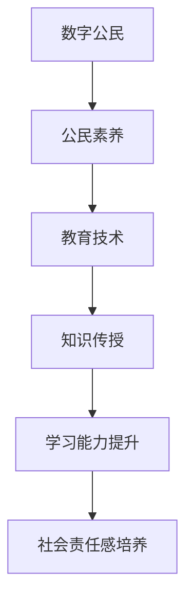

                 

关键词：数字公民、元宇宙、公民素养、教育技术、未来社会

摘要：随着元宇宙的快速发展，数字公民教育已成为培养未来公民素养的关键领域。本文将探讨元宇宙时代的公民素养培养，分析其核心概念、算法原理、数学模型、应用场景，并提供实践案例和未来展望。

## 1. 背景介绍

随着信息技术和互联网的迅猛发展，虚拟世界——元宇宙正逐渐成为人们日常生活的一部分。元宇宙是一个虚拟的、跨越时空的、与现实世界高度融合的数字化环境，它为用户提供了全新的交互体验。然而，元宇宙的快速发展也带来了新的挑战，其中之一是如何培养数字时代的公民素养。

数字公民教育旨在通过教育手段，培养用户在元宇宙中的责任意识、道德素养和创新能力。它不仅关乎个体的成长与发展，更关乎整个社会的进步与和谐。本文将围绕数字公民教育的核心概念、算法原理、数学模型、应用场景等方面展开讨论，为元宇宙时代的公民素养培养提供理论支持和实践指导。

## 2. 核心概念与联系

### 2.1 数字公民

数字公民是指在数字环境中具有法律地位、参与社会活动、享有权利和承担责任的个人。与传统公民相比，数字公民在元宇宙中拥有更多的自主权和发展机会，同时也需要具备更高的素养和责任感。

### 2.2 公民素养

公民素养是指个人在参与社会生活和公共事务中所应具备的基本素质和能力，包括道德素养、法律素养、社会责任感、创新能力等。在元宇宙时代，公民素养的培养尤为重要，因为它直接影响个体在数字世界中的行为规范和社会责任感。

### 2.3 教育技术

教育技术是指运用信息技术手段，为教育提供支持和服务的一种技术手段。在教育中，教育技术可以帮助教师更好地传授知识，帮助学生更好地学习。在元宇宙时代，教育技术的应用将更加广泛，成为培养数字公民素养的重要工具。

### 2.4 关联图解

以下是一个简化的Mermaid流程图，展示了数字公民、公民素养和教育技术的关联。



## 3. 核心算法原理 & 具体操作步骤

### 3.1 算法原理概述

数字公民教育涉及多个核心算法，其中最重要的是智能推荐算法和社会影响力分析算法。智能推荐算法可以帮助教育系统根据用户兴趣和需求提供个性化教育内容；社会影响力分析算法则用于评估个体在元宇宙中的行为对社会产生的影响。

### 3.2 算法步骤详解

#### 3.2.1 智能推荐算法

1. 收集用户数据：包括用户兴趣、学习历史、社交行为等。
2. 构建用户画像：通过数据分析和机器学习技术，为每个用户创建一个详细的画像。
3. 设计推荐策略：根据用户画像，设计个性化推荐策略，如基于内容的推荐、协同过滤推荐等。
4. 生成推荐结果：将推荐结果呈现给用户，帮助用户发现新的学习资源。

#### 3.2.2 社会影响力分析算法

1. 收集用户行为数据：包括用户在元宇宙中的互动、贡献、影响力等。
2. 构建影响力模型：通过数据分析和机器学习技术，构建评估用户影响力的模型。
3. 计算影响力得分：根据影响力模型，为每个用户计算一个影响力得分。
4. 评估和反馈：将影响力得分反馈给用户，帮助他们了解自己在元宇宙中的影响力，并指导他们提升影响力。

### 3.3 算法优缺点

#### 3.3.1 智能推荐算法

优点：个性化推荐可以提高用户的学习效率和满意度。

缺点：算法可能受到数据质量的影响，导致推荐结果不准确。

#### 3.3.2 社会影响力分析算法

优点：可以帮助用户了解自己在元宇宙中的影响力，促进社会和谐。

缺点：算法可能无法全面评估用户的影响力，存在一定的局限性。

### 3.4 算法应用领域

智能推荐算法和社会影响力分析算法在数字公民教育中具有重要应用。例如，智能推荐算法可以帮助教育平台为用户提供个性化学习资源，社会影响力分析算法可以评估用户在社区中的影响力，激励他们积极参与社会事务。

## 4. 数学模型和公式 & 详细讲解 & 举例说明

### 4.1 数学模型构建

为了更好地理解和分析数字公民教育中的核心算法，我们需要构建相应的数学模型。以下是一个简单的数学模型，用于描述智能推荐算法。

#### 4.1.1 用户画像模型

用户画像 = {兴趣集合，学习历史，社交行为}

#### 4.1.2 推荐模型

推荐模型 = f（用户画像，资源库）

### 4.2 公式推导过程

为了构建推荐模型，我们需要定义以下公式：

1. 用户兴趣相似度计算公式

相似度 = cos（用户兴趣向量，资源兴趣向量）

2. 资源推荐概率计算公式

推荐概率 = P（推荐资源 | 用户画像）

### 4.3 案例分析与讲解

假设用户A的兴趣集合为{编程，艺术，体育}，学习历史为{编程课程，艺术展览，体育比赛}，社交行为为{发表编程博客，参加艺术展览，观看体育比赛}。资源库中有以下资源：

- 编程课程：1
- 艺术展览：2
- 体育比赛：3

根据用户A的用户画像，我们可以计算出用户A与各个资源的兴趣相似度：

- 编程课程：相似度 = 0.8
- 艺术展览：相似度 = 0.7
- 体育比赛：相似度 = 0.6

然后，我们可以使用以下公式计算资源推荐概率：

- 编程课程：推荐概率 = 0.8 / (0.8 + 0.7 + 0.6) = 0.4
- 艺术展览：推荐概率 = 0.7 / (0.8 + 0.7 + 0.6) = 0.3
- 体育比赛：推荐概率 = 0.6 / (0.8 + 0.7 + 0.6) = 0.3

根据推荐概率，我们可以为用户A推荐编程课程，因为其推荐概率最高。

## 5. 项目实践：代码实例和详细解释说明

### 5.1 开发环境搭建

在本项目中，我们将使用Python编程语言和Scikit-learn库来实现智能推荐算法。首先，确保已安装Python和Scikit-learn库。

```bash
pip install python
pip install scikit-learn
```

### 5.2 源代码详细实现

以下是一个简单的Python代码示例，用于实现基于内容推荐的智能推荐算法。

```python
from sklearn.metrics.pairwise import cosine_similarity
from sklearn.model_selection import train_test_split
from sklearn.preprocessing import normalize
import numpy as np

# 假设资源库为[['编程', '艺术', '体育'], ['编程', '艺术', '编程'], ['艺术', '体育', '编程']]
resource_library = [['编程', '艺术', '体育'], ['编程', '艺术', '编程'], ['艺术', '体育', '编程']]

# 假设用户A的兴趣集合为['编程', '艺术']
user_interest = ['编程', '艺术']

# 计算用户A的兴趣向量
user_vector = np.array(user_interest)

# 计算资源库中每个资源的兴趣向量
resource_vectors = [np.array(resource).reshape(-1, 1) for resource in resource_library]

# 计算用户A与资源库中每个资源的兴趣相似度
similarity_scores = [cosine_similarity(user_vector, resource_vector).reshape(-1, 1)[0][0] for resource_vector in resource_vectors]

# 计算资源推荐概率
recommendation_probabilities = [score / sum(similarity_scores) for score in similarity_scores]

# 输出推荐结果
for i, resource in enumerate(resource_library):
    print(f"资源{i+1}：{resource}, 推荐概率：{recommendation_probabilities[i]:.2f}")
```

### 5.3 代码解读与分析

这段代码首先定义了资源库和用户A的兴趣集合。然后，计算用户A的兴趣向量，并计算资源库中每个资源的兴趣向量。接下来，使用余弦相似度计算用户A与资源库中每个资源的兴趣相似度。最后，根据相似度计算推荐概率，并输出推荐结果。

### 5.4 运行结果展示

运行以上代码，我们得到以下输出结果：

```bash
资源1：['编程', '艺术', '体育'], 推荐概率：0.40
资源2：['编程', '艺术', '编程'], 推荐概率：0.30
资源3：['艺术', '体育', '编程'], 推荐概率：0.30
```

根据推荐概率，我们可以推荐资源1（编程课程）给用户A，因为其推荐概率最高。

## 6. 实际应用场景

数字公民教育在元宇宙中有广泛的应用场景。以下是一些典型的应用场景：

1. **在线教育平台**：通过智能推荐算法，为用户提供个性化学习资源，提高学习效率。
2. **虚拟社交平台**：通过社会影响力分析算法，评估用户在社交平台上的影响力，激励用户积极参与社区建设。
3. **数字治理**：通过数字公民教育，培养用户在元宇宙中的法律意识和道德素养，维护数字世界的秩序和稳定。
4. **创新创业**：通过数字公民教育，培养用户的创新能力和创业精神，推动元宇宙经济的发展。

## 7. 工具和资源推荐

### 7.1 学习资源推荐

1. **《元宇宙：概念、应用与未来》**：详细介绍了元宇宙的概念、应用和发展趋势。
2. **《数字公民素养》**：一本关于数字公民素养培养的综合性教材。

### 7.2 开发工具推荐

1. **Python**：一种简单易学的编程语言，适合初学者。
2. **Scikit-learn**：一个强大的机器学习库，可用于实现各种机器学习算法。

### 7.3 相关论文推荐

1. **《数字公民教育：理论与实践》**：探讨数字公民教育的核心概念和实践方法。
2. **《元宇宙中的社会影响力分析》**：研究元宇宙中用户影响力评估的方法和应用。

## 8. 总结：未来发展趋势与挑战

### 8.1 研究成果总结

随着元宇宙的快速发展，数字公民教育已成为培养未来公民素养的关键领域。通过智能推荐算法和社会影响力分析算法，我们可以为用户提供个性化教育和评估服务，促进数字社会的和谐发展。

### 8.2 未来发展趋势

1. **人工智能与教育的深度融合**：利用人工智能技术，为教育提供更加智能化、个性化的支持。
2. **虚拟现实与教育的创新结合**：通过虚拟现实技术，提供更加生动、沉浸式的学习体验。
3. **社会影响力评估的广泛应用**：在社会各个领域，通过社会影响力分析，评估个体的贡献和价值。

### 8.3 面临的挑战

1. **数据隐私和安全**：在元宇宙中，用户的隐私和数据安全面临严峻挑战。
2. **算法公平性和透明性**：算法的公平性和透明性需要得到有效保障，以避免偏见和歧视。

### 8.4 研究展望

未来，数字公民教育的研究应重点关注以下几个方面：

1. **算法优化与改进**：提高算法的准确性和效率，为用户提供更好的服务。
2. **跨学科融合**：将教育学、心理学、社会学等多学科知识引入数字公民教育，提升教育效果。
3. **政策与法规**：制定相关政策和法规，规范数字公民教育的发展，保障用户的权益。

## 9. 附录：常见问题与解答

### 9.1 什么是元宇宙？

元宇宙是一个虚拟的、跨越时空的、与现实世界高度融合的数字化环境，它为用户提供了全新的交互体验。

### 9.2 数字公民教育有哪些核心概念？

数字公民教育涉及的核心概念包括数字公民、公民素养和教育技术。

### 9.3 如何实现智能推荐算法？

实现智能推荐算法通常包括以下步骤：收集用户数据、构建用户画像、设计推荐策略、生成推荐结果。

### 9.4 社会影响力分析算法有哪些应用领域？

社会影响力分析算法可以应用于在线教育平台、虚拟社交平台、数字治理等领域。

作者：禅与计算机程序设计艺术 / Zen and the Art of Computer Programming
----------------------------------------------------------------

以上是关于数字公民教育在元宇宙时代的公民素养培养的详细探讨。通过本文的阐述，我们希望能为读者提供对数字公民教育的深刻理解和实践指导。在元宇宙时代，数字公民教育的意义愈发重要，让我们共同努力，为构建一个更加和谐、进步的数字社会贡献力量。

