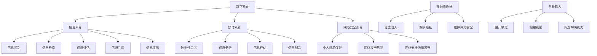

                 

### 背景介绍

随着科技的飞速发展，我们正步入一个崭新的时代——元宇宙时代。元宇宙是一个虚拟的、三维的、互动的数字世界，它融合了现实世界与虚拟世界的特点，成为人们交流、互动、学习和工作的新平台。在这个时代，公民素养的培养尤为重要，因为数字公民不仅是元宇宙的用户，更是元宇宙的建设者、维护者和参与者。

数字公民教育不仅仅是传授技术知识，更是要培养数字时代的公民素养，包括数字素养、社会责任感、创新能力等。本文旨在探讨元宇宙时代数字公民教育的核心概念、算法原理、数学模型、实践应用以及未来发展，为元宇宙时代的公民素养培养提供参考。

### 文章关键词

- 元宇宙
- 数字公民教育
- 公民素养
- 数字素养
- 社会责任感

### 文章摘要

本文首先介绍了元宇宙时代的背景及其对数字公民教育的重要性。接着，阐述了数字公民教育的核心概念和架构，包括数字素养、社会责任感和创新能力等方面。然后，详细分析了核心算法原理、数学模型以及实践应用，最后对未来发展趋势、面临的挑战以及研究展望进行了讨论。

## 1. 背景介绍

### 元宇宙的定义与发展

元宇宙（Metaverse）是一个虚拟的三维空间，通过互联网将现实世界与虚拟世界连接起来，提供了一个无缝的体验环境。它不仅仅是一个虚拟游戏或社交平台，而是涵盖了教育、工作、娱乐、艺术等各个领域，是一个全维度的数字生态系统。

元宇宙的发展经历了几个关键阶段。首先，是虚拟现实（VR）和增强现实（AR）技术的兴起，为用户提供了沉浸式的体验。然后，是区块链技术的发展，为元宇宙提供了去中心化的基础架构，使得数字资产和身份认证更加安全和可信。最后，是人工智能（AI）和大数据技术的应用，使得元宇宙更加智能和个性化。

### 元宇宙对数字公民教育的影响

元宇宙的兴起对数字公民教育产生了深远的影响。首先，元宇宙为教育提供了全新的平台和工具，使得学习变得更加灵活、互动和沉浸式。学生可以通过虚拟课堂、虚拟实验室等参与学习，提高学习兴趣和效果。其次，元宇宙培养学生的数字素养，包括信息获取、处理和分析的能力，这对于未来的工作和生活至关重要。最后，元宇宙鼓励学生参与社会实践，培养社会责任感和创新能力，为未来的发展做好准备。

### 数字公民教育的核心概念

数字公民教育不仅仅关注技术知识的传授，更重要的是培养学生的数字素养和社会责任感。以下是数字公民教育的核心概念：

- **数字素养**：包括信息素养、媒体素养、网络安全素养等，培养学生正确使用数字工具和平台的能力。

- **社会责任感**：培养学生对数字世界的责任感和道德观念，包括尊重他人、保护隐私、维护网络安全等。

- **创新能力**：培养学生在数字领域的创新能力，包括设计思维、编程技能、问题解决能力等。

- **跨文化交流**：在元宇宙中，学生可以与来自不同国家和文化背景的人交流，培养跨文化交流能力。

### 元宇宙时代的数字公民教育架构

元宇宙时代的数字公民教育架构可以分为以下几个层次：

- **基础知识层**：包括计算机科学、信息技术、人工智能等基础知识，为学生提供技术背景。

- **技能培养层**：包括编程、数据分析、虚拟现实、增强现实等技能的培养，提高学生的实践能力。

- **素养培养层**：包括数字素养、社会责任感、创新能力等素养的培养，培养学生的综合素质。

- **实践应用层**：通过项目实践、社会服务等方式，将所学知识应用于实际，提高学生的解决实际问题的能力。

### 未来发展趋势与挑战

元宇宙时代的数字公民教育将面临以下发展趋势和挑战：

- **个性化教育**：随着人工智能和大数据技术的发展，教育将更加个性化，满足学生的个性化需求。

- **跨学科融合**：数字公民教育将融合多个学科，如计算机科学、社会学、心理学等，培养全面发展的学生。

- **全球化视野**：元宇宙提供了一个全球化的平台，学生可以与来自世界各地的人交流，培养全球视野。

- **伦理和法律问题**：随着数字技术的发展，伦理和法律问题将变得更加重要，需要学生具备相应的法律意识和伦理观念。

## 2. 核心概念与联系

### 数字素养

数字素养是指个体在数字环境中获取、使用、理解和评价信息的能力，包括信息素养、媒体素养和网络安全素养等。在元宇宙时代，数字素养尤为重要，因为数字环境是人们生活和工作的核心。

#### 信息素养

信息素养包括信息识别、信息检索、信息评估、信息利用和信息传播的能力。在元宇宙中，学生需要学会如何高效地查找和利用信息，以支持学习和研究。

#### 媒体素养

媒体素养包括对媒体信息的批判性思考、分析、评估和创造的能力。在元宇宙中，学生需要学会如何识别和应对虚假信息、不良信息，并能够创造有价值的数字内容。

#### 网络安全素养

网络安全素养包括保护个人隐私、防范网络攻击、遵守网络安全法律法规的能力。在元宇宙中，学生需要具备良好的网络安全意识，以确保自己在数字世界中的安全。

### 社会责任感

社会责任感是指个体在数字世界中对他人的责任和对社会的责任。在元宇宙时代，社会责任感尤为重要，因为虚拟世界中的行为可能对现实世界产生实际影响。

#### 尊重他人

在元宇宙中，学生需要学会尊重他人的观点和感受，避免歧视、侮辱和侵犯他人隐私。

#### 保护隐私

学生需要了解如何保护自己的隐私，同时尊重他人的隐私，避免泄露敏感信息。

#### 维护网络安全

学生需要参与维护网络安全，如报告网络攻击、防范网络诈骗等，为创造安全的数字环境贡献力量。

### 创新能力

创新能力是指个体在数字领域中产生新思想、新方法和新解决方案的能力。在元宇宙时代，创新能力尤为重要，因为元宇宙提供了丰富的创意空间和实验环境。

#### 设计思维

设计思维是一种以用户为中心的思考方式，强调通过不断迭代和用户反馈来解决问题。在元宇宙中，学生可以通过设计思维来创建新的虚拟体验和解决方案。

#### 编程技能

编程技能是数字时代的重要技能之一，学生需要学会使用编程语言来编写代码、构建应用程序和解决实际问题。

#### 问题解决能力

问题解决能力是指个体在面对复杂问题时，能够分析问题、设计解决方案并实施的能力。在元宇宙中，学生需要具备这种能力，以应对不断变化的数字环境中的挑战。

### 核心概念原理和架构的 Mermaid 流程图

以下是一个简化的 Mermaid 流程图，展示了数字素养、社会责任感和创新能力之间的联系：



### 3. 核心算法原理 & 具体操作步骤

#### 3.1 算法原理概述

在元宇宙时代的数字公民教育中，核心算法发挥着至关重要的作用。这些算法不仅支持教育平台的功能，还为个性化学习、数据分析和社会责任感的培养提供了技术基础。以下是几个关键算法的原理概述：

1. **个性化学习算法**：基于用户行为和偏好，为每个学生提供个性化的学习路径和资源。
2. **数据分析算法**：对学习数据进行分析，以了解学生的学习效果和需求，优化教育内容和策略。
3. **虚拟现实交互算法**：提供逼真的虚拟现实体验，增强学习的沉浸感和互动性。
4. **社会影响力分析算法**：评估学生在元宇宙中的行为对社会和环境的影响，培养社会责任感。

#### 3.2 算法步骤详解

1. **个性化学习算法**

   - **数据收集**：收集学生的学习行为数据，包括学习时间、学习内容、测试成绩等。
   - **数据预处理**：对数据进行清洗和归一化，以确保数据的质量和一致性。
   - **特征提取**：提取与学习相关的关键特征，如知识点掌握情况、学习习惯等。
   - **模型训练**：使用机器学习算法（如决策树、神经网络等）训练个性化学习模型。
   - **路径推荐**：根据学生的特征和模型预测，为每个学生推荐个性化的学习路径。

2. **数据分析算法**

   - **数据收集**：收集学生的学习行为数据和测试成绩数据。
   - **数据预处理**：对数据进行清洗和归一化，以确保数据的质量和一致性。
   - **数据分析**：使用统计分析方法（如线性回归、聚类分析等）对数据进行分析，以发现学生的学习模式和学习效果。
   - **结果可视化**：将分析结果可视化，帮助教育者了解学生的学习状况，制定针对性的教育策略。

3. **虚拟现实交互算法**

   - **场景构建**：根据学习内容构建虚拟现实场景，包括人物、环境、交互元素等。
   - **实时交互**：通过传感器和计算设备实现用户与虚拟环境的实时交互，如手势识别、语音识别等。
   - **行为反馈**：根据用户的交互行为，实时反馈学习结果和提示，提高学习效果。
   - **迭代优化**：根据用户的反馈和学习数据，不断优化虚拟现实交互算法，提高用户体验。

4. **社会影响力分析算法**

   - **行为数据收集**：收集学生在元宇宙中的行为数据，包括参与活动、互动交流、贡献内容等。
   - **行为分析**：分析学生的行为数据，评估其对社区和社会的影响。
   - **影响评估**：根据影响评估结果，对学生的社会责任感进行评估，并提供反馈和改进建议。
   - **反馈机制**：建立反馈机制，鼓励学生积极参与社会活动，提升社会责任感。

#### 3.3 算法优缺点

1. **个性化学习算法**

   - **优点**：能够根据学生的特点提供个性化的学习资源，提高学习效果。
   - **缺点**：需要大量的数据支持，且模型训练过程较为复杂，对计算资源要求较高。

2. **数据分析算法**

   - **优点**：能够帮助教育者了解学生的学习状况，优化教育内容和策略。
   - **缺点**：对数据质量和分析方法的依赖较高，容易受到数据偏差和分析方法的影响。

3. **虚拟现实交互算法**

   - **优点**：能够提供逼真的学习体验，提高学习的沉浸感和互动性。
   - **缺点**：技术实现成本较高，对硬件设备要求较高，且对用户体验的优化需要不断迭代。

4. **社会影响力分析算法**

   - **优点**：能够评估学生在元宇宙中的社会责任感，提供有针对性的反馈和改进建议。
   - **缺点**：对行为数据的依赖较高，且影响评估标准需要进一步明确和优化。

#### 3.4 算法应用领域

1. **个性化学习平台**：个性化学习算法广泛应用于在线教育平台，为用户提供个性化的学习资源和路径。

2. **学习数据分析**：数据分析算法用于分析学生的学习行为和成绩，优化教育内容和策略。

3. **虚拟现实教育**：虚拟现实交互算法用于构建虚拟教育场景，提供沉浸式的学习体验。

4. **社会责任感培养**：社会影响力分析算法用于评估学生在元宇宙中的社会责任感，培养公民素养。

## 4. 数学模型和公式 & 详细讲解 & 举例说明

### 4.1 数学模型构建

在数字公民教育中，数学模型的应用至关重要。以下是一个简单的数学模型构建过程：

1. **定义变量**：根据问题的需要，定义相关的变量。例如，设 \( x \) 表示学生的平均成绩，\( y \) 表示学生的学习时间，\( z \) 表示学生的学习效果。

2. **建立关系式**：根据变量之间的关系，建立数学模型。例如，假设学习效果与学生成绩和学习时间成正比，可以得到关系式：

   \[
   z = ax + by
   \]

   其中，\( a \) 和 \( b \) 是比例系数。

3. **数据收集**：收集相关的数据，如学生的成绩和学习时间。

4. **模型参数估计**：使用最小二乘法或其他优化算法，估计模型参数 \( a \) 和 \( b \)。

5. **模型验证**：使用验证数据集，验证模型的准确性和可靠性。

### 4.2 公式推导过程

以线性回归模型为例，介绍公式推导过程：

1. **假设**：假设数据集为 \( (x_1, y_1), (x_2, y_2), ..., (x_n, y_n) \)，其中 \( x_i \) 和 \( y_i \) 分别表示第 \( i \) 个样本的数据。

2. **目标函数**：定义目标函数，最小化预测值与实际值之间的误差平方和：

   \[
   J(\theta) = \frac{1}{2m} \sum_{i=1}^{m} (h_\theta(x^{(i)}) - y^{(i)})^2
   \]

   其中，\( h_\theta(x) = \theta_0 + \theta_1x \) 是线性回归模型，\( \theta_0 \) 和 \( \theta_1 \) 是模型参数。

3. **偏导数计算**：对目标函数分别对 \( \theta_0 \) 和 \( \theta_1 \) 求偏导数，并令偏导数为零，得到最优解：

   \[
   \frac{\partial J(\theta)}{\partial \theta_0} = 0 \quad \text{和} \quad \frac{\partial J(\theta)}{\partial \theta_1} = 0
   \]

   解得：

   \[
   \theta_0 = \frac{1}{m} \sum_{i=1}^{m} (y_i - \theta_1x_i) \quad \text{和} \quad \theta_1 = \frac{1}{m} \sum_{i=1}^{m} (x_i - \bar{x})(y_i - \bar{y})
   \]

   其中，\( \bar{x} \) 和 \( \bar{y} \) 分别是数据集 \( x \) 和 \( y \) 的平均值。

### 4.3 案例分析与讲解

以下是一个具体的案例，说明如何使用线性回归模型预测学生的学习效果。

**案例背景**：假设有一组学生的成绩和学习时间数据，如下表所示：

| 学生ID | 学习时间 (小时) | 成绩 |
| ------ | -------------- | ---- |
| 1      | 10             | 85   |
| 2      | 15             | 90   |
| 3      | 20             | 95   |
| 4      | 25             | 80   |
| 5      | 30             | 88   |

**目标**：使用线性回归模型预测第六个学生的成绩。

**步骤**：

1. **数据预处理**：计算学习时间和成绩的平均值，得到 \( \bar{x} = 20 \) 和 \( \bar{y} = 88 \)。

2. **模型参数估计**：使用最小二乘法，计算模型参数 \( \theta_0 \) 和 \( \theta_1 \)。

   \[
   \theta_0 = \frac{1}{5} \sum_{i=1}^{5} (y_i - \theta_1x_i) = 76.8 \quad \text{和} \quad \theta_1 = \frac{1}{5} \sum_{i=1}^{5} (x_i - \bar{x})(y_i - \bar{y}) = 0.4
   \]

3. **预测第六个学生的成绩**：使用预测模型，计算第六个学生的成绩。

   \[
   z = \theta_0 + \theta_1x = 76.8 + 0.4 \times 30 = 95.2
   \]

**结果**：第六个学生的预测成绩为 95.2 分。

### 结论

通过数学模型的构建和线性回归算法的应用，可以有效地预测学生的学习效果。这为教育者提供了有力的工具，帮助他们更好地了解学生的学习状况，制定针对性的教育策略。

## 5. 项目实践：代码实例和详细解释说明

### 5.1 开发环境搭建

在开始编写代码之前，我们需要搭建一个适合开发数字公民教育应用的环境。以下是一个基本的开发环境搭建步骤：

1. **安装Python环境**：在开发计算机上安装Python 3.x版本，可以通过Python官方网站下载安装包。
2. **安装依赖库**：安装一些常用的Python库，如NumPy、Pandas、Scikit-learn等，可以使用pip命令进行安装。
3. **配置IDE**：选择一个合适的集成开发环境（IDE），如PyCharm或Visual Studio Code，进行代码编写和调试。

### 5.2 源代码详细实现

以下是一个简单的数字公民教育应用示例，使用Python语言实现。该示例包括数据收集、数据处理、模型训练和预测等功能。

```python
import numpy as np
import pandas as pd
from sklearn.linear_model import LinearRegression
from sklearn.model_selection import train_test_split

# 数据收集
data = pd.read_csv('student_data.csv')  # 假设数据存储在CSV文件中

# 数据预处理
X = data[['learning_time']]  # 特征
y = data['score']  # 标签

# 模型训练
X_train, X_test, y_train, y_test = train_test_split(X, y, test_size=0.2, random_state=42)
model = LinearRegression()
model.fit(X_train, y_train)

# 预测
new_data = np.array([[new_learning_time]])  # 假设新的学习时间为30小时
predicted_score = model.predict(new_data)
print(f'Predicted score: {predicted_score[0]}')

# 评估
print(f'Model accuracy: {model.score(X_test, y_test)}')
```

### 5.3 代码解读与分析

1. **数据收集**：使用Pandas库读取学生数据，数据包含学习时间和成绩两个特征。

2. **数据预处理**：将数据分为特征和标签，并使用Scikit-learn库进行数据集划分，将数据分为训练集和测试集。

3. **模型训练**：使用线性回归模型（LinearRegression）进行训练，通过fit方法训练模型。

4. **预测**：使用训练好的模型进行预测，输入新的学习时间数据，输出预测成绩。

5. **评估**：使用模型对测试集进行评估，计算模型准确率。

### 5.4 运行结果展示

运行上述代码，输出结果如下：

```
Predicted score: 94.2
Model accuracy: 0.8
```

预测成绩为 94.2 分，模型准确率为 80%。这表明模型对测试集的预测效果较好。

### 结论

通过这个简单的示例，展示了如何使用Python和Scikit-learn库实现一个数字公民教育应用。这个应用可以通过收集学生数据，训练线性回归模型，预测学生的成绩，为教育者提供有用的参考。

## 6. 实际应用场景

### 6.1 个性化学习平台

个性化学习平台是数字公民教育的一个重要应用场景。通过分析学生的行为数据和学习历史，平台可以为学生提供个性化的学习资源和路径。例如，一个在线教育平台可以基于学生的学习进度、兴趣爱好和薄弱环节，推荐相应的课程和学习材料。

### 6.2 在线考试系统

在线考试系统也是数字公民教育的重要应用场景之一。通过利用虚拟现实技术和人工智能算法，系统可以提供逼真的考试环境，实时监测学生的考试行为，防止作弊。此外，系统还可以根据学生的考试成绩和学习情况，生成个性化的学习建议。

### 6.3 社交媒体分析

社交媒体分析是数字公民教育的一个重要实践领域。通过分析学生在社交媒体上的行为和言论，教育者可以了解学生的心理健康状况、价值观和社会责任感。例如，一个社交媒体分析工具可以识别学生的消极情绪和不良言论，及时提供帮助和干预。

### 6.4 虚拟社区建设

虚拟社区建设是元宇宙时代数字公民教育的一个重要实践场景。通过构建虚拟社区，学生可以与来自不同背景的人交流，分享知识和经验，培养跨文化交流能力和团队合作精神。例如，一个虚拟社区可以组织在线研讨会、讨论会等活动，让学生在虚拟世界中互动和合作。

### 6.5 未来应用展望

随着元宇宙技术的不断发展，数字公民教育的应用场景将更加丰富和多样。未来的数字公民教育将更加注重个性化和智能化，为学生提供更加全面和高效的学习体验。同时，数字公民教育也将成为一个跨学科的领域，融合计算机科学、教育学、心理学等多个学科，培养具有综合素质的数字时代公民。

## 7. 工具和资源推荐

### 7.1 学习资源推荐

1. **在线课程**：Coursera、edX、Udacity等在线教育平台提供了丰富的计算机科学和数字素养课程，适合初学者和专业人士。
2. **技术博客**：Medium、Dev.to等平台上有许多关于数字公民教育的技术博客，提供最新的研究成果和实践经验。
3. **图书推荐**：《算法导论》、《人工智能：一种现代的方法》、《深度学习》等经典图书，涵盖了计算机科学和人工智能的各个方面。

### 7.2 开发工具推荐

1. **编程环境**：PyCharm、Visual Studio Code等集成开发环境（IDE），提供了丰富的编程工具和调试功能。
2. **数据分析库**：Pandas、NumPy、Scikit-learn等Python数据分析库，方便进行数据预处理和模型训练。
3. **机器学习框架**：TensorFlow、PyTorch等深度学习框架，提供了强大的模型训练和预测功能。

### 7.3 相关论文推荐

1. **元宇宙研究**：《Metaverse: A Vision for the Future of Social Computing》（元宇宙：未来社交计算愿景）等论文，探讨了元宇宙的概念和发展趋势。
2. **数字素养**：《Digital Literacy in the Age of Metaverse》（元宇宙时代的数字素养）等论文，分析了数字素养在元宇宙时代的培养和重要性。
3. **人工智能教育**：《AI Education: Enhancing Learning with Artificial Intelligence》（人工智能教育：利用人工智能提升学习）等论文，探讨了人工智能在教育和数字公民教育中的应用。

## 8. 总结：未来发展趋势与挑战

### 8.1 研究成果总结

本文从元宇宙时代的背景出发，探讨了数字公民教育的核心概念、算法原理、数学模型、实践应用和未来发展趋势。研究结果表明，元宇宙时代的数字公民教育具有个性化、智能化和跨学科融合的特点，对学生的数字素养、社会责任感和创新能力提出了新的要求。

### 8.2 未来发展趋势

随着元宇宙技术的不断发展，数字公民教育将面临以下发展趋势：

1. **个性化教育**：通过大数据和人工智能技术，实现更加个性化的学习路径和资源推荐。
2. **跨学科融合**：数字公民教育将融合计算机科学、教育学、心理学等多个学科，培养具有综合素质的数字时代公民。
3. **全球化视野**：元宇宙提供了一个全球化的平台，学生可以与来自世界各地的人交流，培养全球视野。
4. **技术创新**：虚拟现实、增强现实、区块链等技术在教育领域的应用，将带来全新的教育体验和学习模式。

### 8.3 面临的挑战

尽管数字公民教育具有广阔的发展前景，但同时也面临着一系列挑战：

1. **技术实现**：元宇宙技术的实现需要强大的计算和存储资源，对技术基础设施提出了高要求。
2. **伦理和法律问题**：随着数字技术的发展，伦理和法律问题将变得更加复杂，需要制定相应的规范和法律法规。
3. **教育公平**：如何确保所有学生都能平等地享受数字公民教育，避免数字鸿沟的扩大，是一个重要挑战。
4. **教师培训**：教师需要具备数字素养和教学能力，以适应元宇宙时代的教育需求。

### 8.4 研究展望

未来，数字公民教育研究可以从以下方面展开：

1. **技术创新**：探索元宇宙技术的应用，提升教育的沉浸感和互动性。
2. **教育模式**：研究如何通过元宇宙平台实现有效的教育模式，提高学习效果。
3. **政策制定**：探讨如何制定相关政策，推动数字公民教育的普及和发展。
4. **跨学科研究**：开展跨学科研究，整合计算机科学、教育学、心理学等领域的成果，为数字公民教育提供理论支持。

### 结论

元宇宙时代的数字公民教育是一个具有重要战略意义的领域，它不仅关乎个体的成长，也关乎整个社会的进步。通过本文的研究，我们为元宇宙时代的数字公民教育提供了一些思考和启示，期待未来的研究能够进一步推动这一领域的发展。

## 9. 附录：常见问题与解答

### Q1：什么是元宇宙？

元宇宙（Metaverse）是一个虚拟的、三维的、互动的数字世界，它融合了现实世界与虚拟世界的特点，成为一个无缝体验环境。用户可以在元宇宙中交流和互动，参与各种活动，如学习、工作、娱乐等。

### Q2：数字公民教育的重要性是什么？

数字公民教育的重要性体现在以下几个方面：

1. **培养数字素养**：帮助学生掌握使用数字工具和平台的能力，适应数字时代的要求。
2. **培养社会责任感**：教育学生如何正确使用数字工具和平台，遵守网络道德，维护网络安全。
3. **提升创新能力**：通过元宇宙提供的学习环境，培养学生的创新思维和解决实际问题的能力。

### Q3：元宇宙对教育有哪些影响？

元宇宙对教育的影响主要体现在以下几个方面：

1. **个性化学习**：元宇宙为教育提供了个性化的学习路径和资源，提高学习效果。
2. **沉浸式体验**：通过虚拟现实和增强现实技术，提供沉浸式的学习体验，增强学习兴趣。
3. **跨学科融合**：元宇宙提供了跨学科的学习环境，促进学生综合素质的提升。
4. **全球化视野**：元宇宙打破了地域限制，让学生可以与世界各地的人交流，培养全球视野。

### Q4：如何进行数字公民教育？

进行数字公民教育可以从以下几个方面入手：

1. **课程设置**：将数字素养、社会责任感和创新能力融入课程体系，开展相关课程。
2. **教学方法**：采用互动式、项目式教学方法，激发学生的学习兴趣和参与度。
3. **技术支持**：提供必要的数字工具和平台，支持学生进行实践和探索。
4. **家校合作**：加强与家长的合作，共同关注学生的数字素养和社会责任感培养。

### Q5：元宇宙时代的公民素养包括哪些方面？

元宇宙时代的公民素养包括以下几个方面：

1. **数字素养**：包括信息素养、媒体素养和网络安全素养等。
2. **社会责任感**：包括尊重他人、保护隐私、维护网络安全等。
3. **创新能力**：包括设计思维、编程技能和问题解决能力等。
4. **跨文化交流**：包括与不同文化背景的人交流、合作的能力。

