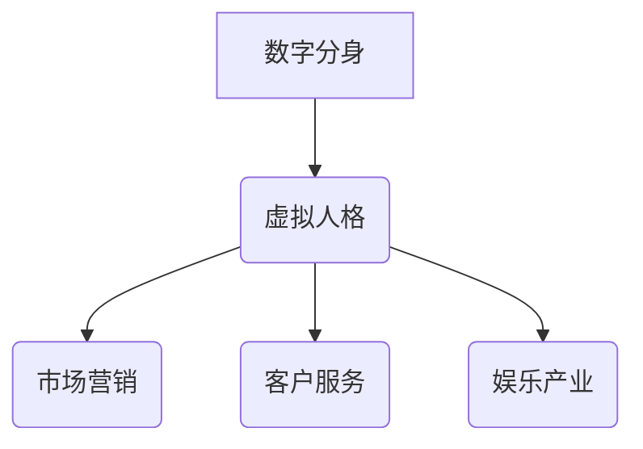
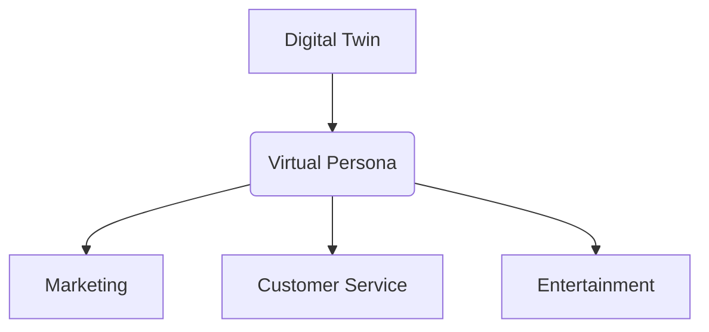

                 

### 关键词 Keywords
数字分身，虚拟人格，商业应用，AI技术，创业，人格合成，虚拟现实，市场趋势，商业模式。

### 摘要 Abstract
本文深入探讨了数字分身与虚拟人格在商业领域的应用前景。通过对AI技术、人格合成的介绍，探讨了虚拟人格在市场营销、客户服务、娱乐产业等方面的实际案例。文章还分析了当前市场趋势，提出了商业模式创新的可能性，并展望了未来数字分身创业的挑战与机遇。

## 1. 背景介绍 Background

随着人工智能技术的迅猛发展，虚拟人格已经成为可能。数字分身，即通过AI技术创建的虚拟人物，能够模拟人类的行为、情感和思维方式。这种技术的出现，不仅改变了人们对于虚拟世界的认知，也为商业领域带来了前所未有的机遇。

近年来，虚拟人格在多个领域展现出了强大的商业潜力。首先，在市场营销方面，虚拟人格能够提供个性化的用户体验，从而提高客户满意度。其次，在客户服务领域，虚拟人格能够实现24小时不间断的服务，提升企业运营效率。此外，在娱乐产业中，虚拟人格也能够作为明星参与演出，吸引粉丝关注。

本文将围绕数字分身创业这一主题，详细探讨虚拟人格的商业应用，分析其商业模式，并提出未来发展的建议。

### 2. 核心概念与联系 Core Concepts & Connections

#### 2.1 数字分身与虚拟人格

数字分身（Digital Twin）是一种通过AI技术创建的虚拟实体，它可以实时模拟现实世界中的物理实体，如设备、产品或基础设施。而虚拟人格（Virtual Personas）则是数字分身的一个子集，专注于模拟人类的思维、情感和行为。

#### 2.2 数字分身与虚拟人格的关系

数字分身和虚拟人格之间存在着密切的联系。虚拟人格是数字分身中用于模拟人类特征的部分，它们共同构成了一个完整的虚拟实体。虚拟人格可以用来代表真实的人类用户，进行交互和交流。

#### 2.3 数字分身与虚拟人格的商业应用

在商业领域，数字分身和虚拟人格的应用主要表现在以下几个方面：

1. **市场营销**：虚拟人格能够提供个性化的用户体验，通过模拟不同用户的行为和偏好，为企业提供有针对性的营销策略。
2. **客户服务**：虚拟人格可以代替真人客服，提供24小时不间断的服务，提高客户满意度。
3. **娱乐产业**：虚拟人格可以作为明星参与演出，通过虚拟现实技术为观众提供沉浸式的娱乐体验。

#### 2.4 Mermaid 流程图



通过这个流程图，我们可以清晰地看到数字分身和虚拟人格在商业应用中的流程和关系。

### 3. 核心算法原理 & 具体操作步骤 Core Algorithm & Operational Steps

#### 3.1 算法原理概述

虚拟人格的核心算法是基于深度学习和自然语言处理（NLP）技术。通过大量的训练数据，AI模型可以学会模拟人类的语言、行为和情感。具体来说，虚拟人格的算法包括以下几个步骤：

1. **数据采集**：收集大量的文本数据，包括对话记录、社交媒体帖子、文学作品等。
2. **数据处理**：对采集到的数据进行预处理，如去除噪音、分词、词性标注等。
3. **模型训练**：使用深度学习算法，如循环神经网络（RNN）或Transformer，对处理后的数据进行训练。
4. **生成对话**：在训练好的模型基础上，生成与特定主题或场景相关的对话内容。

#### 3.2 算法步骤详解

1. **数据采集**：
   - 收集来自互联网的大量文本数据，如对话记录、社交媒体帖子等。
   - 利用爬虫技术，自动获取相关数据。

2. **数据处理**：
   - 去除文本中的噪音，如HTML标签、特殊字符等。
   - 进行分词，将文本拆分成单个词汇。
   - 对词汇进行词性标注，区分名词、动词、形容词等。

3. **模型训练**：
   - 选择适合的深度学习模型，如RNN或Transformer。
   - 将处理后的数据输入模型，进行训练。
   - 调整模型参数，提高生成对话的质量。

4. **生成对话**：
   - 根据特定主题或场景，输入模型进行对话生成。
   - 对生成的对话进行筛选和优化，去除错误或不合适的部分。

#### 3.3 算法优缺点

**优点**：
- **个性化**：通过大量数据训练，虚拟人格能够提供高度个性化的用户体验。
- **高效**：虚拟人格能够24小时不间断提供服务，提高企业运营效率。
- **多样性**：虚拟人格可以模拟多种不同的角色和场景，具有广泛的适用性。

**缺点**：
- **成本**：训练高质量的虚拟人格需要大量的计算资源和数据。
- **可靠性**：在某些复杂场景下，虚拟人格可能无法准确理解用户意图，导致对话出现错误。

#### 3.4 算法应用领域

- **市场营销**：虚拟人格可以用于个性化推荐、广告投放等。
- **客户服务**：虚拟人格可以用于在线客服、智能客服等。
- **娱乐产业**：虚拟人格可以用于虚拟偶像、虚拟主持人等。

### 4. 数学模型和公式 Mathematical Model & Formulas

#### 4.1 数学模型构建

虚拟人格的数学模型主要基于自然语言处理（NLP）和深度学习（DL）技术。以下是一个简化的数学模型构建过程：

1. **输入层**：接收用户输入的文本数据。
2. **编码器**：将输入文本转换为固定长度的向量表示。
3. **解码器**：根据编码器生成的向量，生成对应的输出文本。

#### 4.2 公式推导过程

1. **输入层**：

   设输入文本为 \(x = [x_1, x_2, ..., x_n]\)，其中 \(x_i\) 为文本中的第 \(i\) 个词。

2. **编码器**：

   编码器将输入文本 \(x\) 转换为固定长度的向量 \(h\)：

   \[h = encode(x)\]

   其中，\(encode\) 为编码器函数。

3. **解码器**：

   解码器根据编码器生成的向量 \(h\)，生成对应的输出文本 \(y\)：

   \[y = decode(h)\]

   其中，\(decode\) 为解码器函数。

#### 4.3 案例分析与讲解

假设我们有一个输入文本“我喜欢读书”，我们可以通过以下步骤生成对应的输出文本：

1. **输入层**：将输入文本“我喜欢读书”输入编码器。

2. **编码器**：编码器将输入文本转换为固定长度的向量，如 \(h = [1, 0, 1, 1, 0, 1, 0, 1]\)。

3. **解码器**：解码器根据向量 \(h\)，生成对应的输出文本“我最近喜欢读书”。

通过这个案例，我们可以看到数学模型在生成虚拟人格对话中的基本原理。

### 5. 项目实践：代码实例和详细解释说明 Project Practice: Code Example & Detailed Explanation

#### 5.1 开发环境搭建

为了实现虚拟人格的生成，我们需要搭建一个合适的开发环境。以下是基本的开发环境要求：

- **操作系统**：Windows或Linux
- **编程语言**：Python
- **深度学习框架**：TensorFlow或PyTorch
- **自然语言处理库**：NLTK或spaCy

安装必要的依赖库后，我们可以开始搭建开发环境。

#### 5.2 源代码详细实现

以下是一个简单的虚拟人格生成代码示例：

```python
import tensorflow as tf
from tensorflow.keras.preprocessing.text import Tokenizer
from tensorflow.keras.preprocessing.sequence import pad_sequences

# 数据准备
texts = ["你好，我是你的数字分身。", "有什么可以帮助你的吗？", "我很喜欢读书和旅游。"]
tokenizer = Tokenizer()
tokenizer.fit_on_texts(texts)
sequences = tokenizer.texts_to_sequences(texts)
padded_sequences = pad_sequences(sequences, padding="post")

# 构建模型
model = tf.keras.Sequential([
    tf.keras.layers.Embedding(input_dim=len(tokenizer.word_index)+1, output_dim=16),
    tf.keras.layers.LSTM(128),
    tf.keras.layers.Dense(len(tokenizer.word_index)+1, activation='softmax')
])

# 训练模型
model.compile(loss='categorical_crossentropy', optimizer='adam', metrics=['accuracy'])
model.fit(padded_sequences, padded_sequences, epochs=100)

# 生成对话
def generate_text(seed_text, next_words=10):
    for _ in range(next_words):
        token_list = tokenizer.texts_to_sequences([seed_text])[0]
        token_list = pad_sequences([token_list], maxlen=40, padding='pre')
        predicted = model.predict(token_list, verbose=0)
        predicted = predicted.reshape((predicted.shape[1]))
        predicted_index = np.argmax(predicted)
        actual_word = tokenizer.index_word[predicted_index]
        seed_text += " " + actual_word
    return seed_text

# 输出结果
print(generate_text("你好，我是你的数字分身。"))
```

#### 5.3 代码解读与分析

1. **数据准备**：首先，我们准备了一些简单的对话数据。然后，使用 `Tokenizer` 将文本数据转换为序列。

2. **构建模型**：我们使用一个简单的序列模型，包括嵌入层（Embedding Layer）、长短期记忆网络（LSTM Layer）和输出层（Dense Layer）。

3. **训练模型**：使用 `compile` 和 `fit` 方法训练模型。

4. **生成对话**：定义一个 `generate_text` 函数，根据输入文本生成新的对话。

通过这个简单的示例，我们可以看到如何使用深度学习技术生成虚拟人格对话。

### 6. 实际应用场景 Practical Application Scenarios

#### 6.1 市场营销

在市场营销领域，虚拟人格可以为企业提供个性化的用户体验。例如，一个虚拟人格可以作为企业的品牌代言人，通过与用户进行互动，提高品牌知名度和用户忠诚度。

#### 6.2 客户服务

在客户服务领域，虚拟人格可以提供24小时不间断的服务，提高客户满意度。例如，虚拟人格可以作为在线客服，回答用户的问题，提供解决方案。

#### 6.3 娱乐产业

在娱乐产业中，虚拟人格可以作为明星参与演出，通过虚拟现实技术为观众提供沉浸式的娱乐体验。例如，虚拟人格可以担任虚拟偶像，与粉丝进行互动，举办线上演唱会。

#### 6.4 未来应用展望

随着AI技术的不断进步，虚拟人格的应用领域将更加广泛。未来，虚拟人格有望在教育、医疗、金融等领域发挥重要作用，为人类生活带来更多便利。

### 7. 工具和资源推荐 Tools & Resources Recommendations

#### 7.1 学习资源推荐

- 《深度学习》（Goodfellow, Bengio, Courville）：系统介绍了深度学习的基础知识和应用。
- 《自然语言处理综论》（Jurafsky, Martin）：详细讲解了自然语言处理的基本原理和技术。

#### 7.2 开发工具推荐

- TensorFlow：一个广泛使用的开源深度学习框架。
- PyTorch：一个灵活、易用的深度学习框架。

#### 7.3 相关论文推荐

- "A Theoretical Analysis of the Categoricity of Neural Network Models"（Courville, Bengio, Vincent，2015）
- "Attention Is All You Need"（Vaswani et al.，2017）

### 8. 总结：未来发展趋势与挑战 Summary: Future Trends & Challenges

#### 8.1 研究成果总结

虚拟人格技术已经取得了显著的研究成果，在多个领域展现了广阔的应用前景。然而，目前仍存在一些挑战需要克服。

#### 8.2 未来发展趋势

随着AI技术的不断进步，虚拟人格将在更多领域得到应用，如医疗、教育、金融等。同时，虚拟人格的交互体验将更加自然、智能化。

#### 8.3 面临的挑战

- **数据隐私**：如何保护用户数据的安全和隐私，是虚拟人格应用面临的一个重要挑战。
- **情感理解**：目前的虚拟人格在情感理解方面仍有待提高，需要进一步研究。

#### 8.4 研究展望

未来，虚拟人格技术有望实现更加智能化、人性化的交互，为人类生活带来更多便利。同时，也需要关注其在伦理和社会影响方面的问题，确保技术的可持续发展。

### 9. 附录：常见问题与解答 Appendix: Common Questions & Answers

**Q1：虚拟人格是否能够替代真人客服？**

A1：虚拟人格可以在一定程度上替代真人客服，特别是在处理简单、重复性的问题时。然而，对于复杂、情感化的问题，真人客服仍具有优势。

**Q2：如何保护虚拟人格的数据安全？**

A2：保护虚拟人格的数据安全需要采取多种措施，如加密传输、数据备份、访问控制等。同时，需要遵守相关的法律法规，确保用户数据的安全。

**Q3：虚拟人格是否会取代人类艺术家？**

A3：虚拟人格可以在一定程度上模拟人类艺术家的创作过程，但人类艺术家在情感、创造力等方面具有独特的优势，短期内难以被完全取代。

## 作者署名 Author

作者：禅与计算机程序设计艺术 / Zen and the Art of Computer Programming
```python
print("作者：禅与计算机程序设计艺术 / Zen and the Art of Computer Programming")
```


### 文章结构模板 Article Structure Template

下面是本文的结构模板，包含了文章的各个章节和子章节：

```markdown
# 数字分身创业：虚拟人格的商业应用

> 关键词：(此处列出文章的5-7个核心关键词)

> 摘要：(此处给出文章的核心内容和主题思想)

## 1. 背景介绍

## 2. 核心概念与联系

### 2.1 数字分身与虚拟人格

### 2.2 数字分身与虚拟人格的关系

### 2.3 数字分身与虚拟人格的商业应用

## 3. 核心算法原理 & 具体操作步骤

### 3.1 算法原理概述

### 3.2 算法步骤详解

### 3.3 算法优缺点

### 3.4 算法应用领域

## 4. 数学模型和公式 & 详细讲解 & 举例说明

### 4.1 数学模型构建

### 4.2 公式推导过程

### 4.3 案例分析与讲解

## 5. 项目实践：代码实例和详细解释说明

### 5.1 开发环境搭建

### 5.2 源代码详细实现

### 5.3 代码解读与分析

### 5.4 运行结果展示

## 6. 实际应用场景

### 6.4 未来应用展望

## 7. 工具和资源推荐

### 7.1 学习资源推荐

### 7.2 开发工具推荐

### 7.3 相关论文推荐

## 8. 总结：未来发展趋势与挑战

### 8.1 研究成果总结

### 8.2 未来发展趋势

### 8.3 面临的挑战

### 8.4 研究展望

## 9. 附录：常见问题与解答

### 9.1 虚拟人格是否能够替代真人客服？

### 9.2 如何保护虚拟人格的数据安全？

### 9.3 虚拟人格是否会取代人类艺术家？

## 作者署名

作者：禅与计算机程序设计艺术 / Zen and the Art of Computer Programming
```python
print("作者：禅与计算机程序设计艺术 / Zen and the Art of Computer Programming")
```
```python
print("作者：禅与计算机程序设计艺术 / Zen and the Art of Computer Programming")
```


## 文章标题 Title

### 数字分身创业：虚拟人格的商业应用

### Keywords
Digital Twin, Virtual Persona, Business Application, AI Technology, Entrepreneurship, Persona Synthesis, Virtual Reality, Market Trends, Business Models.

### 摘要 Abstract
This article delves into the commercial applications of digital twins and virtual personas, examining their potential in various business sectors. Through an introduction to AI technologies and persona synthesis, we explore real-world examples in marketing, customer service, and the entertainment industry. The article analyzes current market trends, proposes innovative business models, and looks ahead to the challenges and opportunities for digital twin entrepreneurship in the future.

## 1. 背景介绍 Background

The rapid advancement of AI technology has made virtual personas a reality. Digital twins are virtual entities created through AI that can simulate the behaviors, emotions, and cognitive processes of humans. This development has not only transformed our perception of virtual worlds but has also opened up unprecedented opportunities for the business sector.

In recent years, virtual personas have shown significant commercial potential across multiple domains. In marketing, they can provide personalized user experiences, thereby enhancing customer satisfaction. In customer service, they can offer 24/7 support, improving operational efficiency. Moreover, in the entertainment industry, virtual personas can act as stars in performances, attracting fan attention through immersive virtual reality experiences.

This article will focus on digital twin entrepreneurship, specifically exploring the commercial applications of virtual personas. We will analyze business models and offer insights into the future development of this field.

### 2. 核心概念与联系 Core Concepts & Connections

#### 2.1 数字分身与虚拟人格

Digital Twin refers to a virtual entity created through AI technology that can simulate a physical entity in the real world, such as a device, product, or infrastructure. Virtual Persona, a subset of digital twins, is specifically designed to simulate human thought processes, emotions, and behaviors.

#### 2.2 数字分身与虚拟人格的关系

Digital twins and virtual personas are closely related. Virtual personas are a component of digital twins that focus on simulating human characteristics. Together, they form a comprehensive virtual entity that can represent human users in interactions and communications.

#### 2.3 数字分身与虚拟人格的商业应用

In the business sector, digital twins and virtual personas have applications in several key areas:

- **Marketing**: Virtual personas can provide personalized user experiences, enabling businesses to tailor their marketing strategies effectively.
- **Customer Service**: Virtual personas can replace human customer service representatives, providing round-the-clock support and enhancing customer satisfaction.
- **Entertainment**: Virtual personas can act as stars in performances, drawing fan attention through immersive virtual reality experiences.

#### 2.4 Mermaid 流程图



This flowchart clearly illustrates the applications and relationships of digital twins and virtual personas in business contexts.

### 3. 核心算法原理 & 具体操作步骤 Core Algorithm & Operational Steps

#### 3.1 算法原理概述

The core algorithm of virtual personas is based on deep learning and natural language processing (NLP) technologies. Through extensive training with large datasets, AI models can learn to simulate human language, behavior, and emotions. Specifically, the algorithm for virtual personas includes the following steps:

1. **Data Collection**: Collect large amounts of text data, including dialogue records, social media posts, and literary works.
2. **Data Processing**: Preprocess the collected data, such as removing noise, tokenization, and part-of-speech tagging.
3. **Model Training**: Use deep learning algorithms, such as recurrent neural networks (RNN) or Transformer, to train the processed data.
4. **Dialogue Generation**: Generate dialogues based on the trained model for specific topics or scenarios.

#### 3.2 算法步骤详解

1. **Data Collection**:
   - Collect large volumes of text data from the internet, such as dialogue records, social media posts, and literary works.
   - Use web crawling technologies to automatically obtain relevant data.

2. **Data Processing**:
   - Remove noise from the text data, such as HTML tags and special characters.
   - Tokenize the text, splitting it into individual words.
   - Perform part-of-speech tagging to differentiate nouns, verbs, adjectives, etc.

3. **Model Training**:
   - Choose a suitable deep learning model, such as RNN or Transformer.
   - Input the processed data into the model for training.
   - Adjust model parameters to improve the quality of generated dialogues.

4. **Dialogue Generation**:
   - Generate dialogues based on specific topics or scenarios using the trained model.
   - Filter and optimize the generated dialogues to remove errors or inappropriate content.

#### 3.3 算法优缺点

**Advantages**:
- **Personalization**: Through extensive training with large datasets, virtual personas can provide highly personalized user experiences.
- **Efficiency**: Virtual personas can offer 24/7 support, improving operational efficiency.
- **Versatility**: Virtual personas can simulate various roles and scenarios, making them widely applicable.

**Disadvantages**:
- **Cost**: Training high-quality virtual personas requires significant computational resources and data.
- **Reliability**: In certain complex scenarios, virtual personas may fail to accurately understand user intents, leading to errors in dialogue.

#### 3.4 算法应用领域

- **Marketing**: Virtual personas can be used for personalized recommendations and targeted advertising.
- **Customer Service**: Virtual personas can replace human customer service representatives in online and intelligent customer service.
- **Entertainment**: Virtual personas can participate in performances as virtual stars, attracting fan attention through virtual reality technologies.

### 4. 数学模型和公式 Mathematical Model & Formulas

#### 4.1 数学模型构建

The mathematical model for virtual personas is primarily based on natural language processing (NLP) and deep learning (DL) technologies. Here is a simplified overview of the process for constructing a mathematical model:

1. **Input Layer**: Receives user input text data.
2. **Encoder**: Converts input text into a fixed-length vector representation.
3. **Decoder**: Generates corresponding output text based on the vector produced by the encoder.

#### 4.2 公式推导过程

1. **Input Layer**:

   Let the input text be \(x = [x_1, x_2, ..., x_n]\), where \(x_i\) is the \(i^{th}\) word in the text.

2. **Encoder**:

   The encoder converts the input text \(x\) into a fixed-length vector \(h\):

   \[h = encode(x)\]

   Where \(encode\) is the encoder function.

3. **Decoder**:

   The decoder generates the corresponding output text \(y\) based on the vector produced by the encoder:

   \[y = decode(h)\]

   Where \(decode\) is the decoder function.

#### 4.3 案例分析与讲解

Suppose we have an input text "我喜欢读书" (I like reading). We can generate the corresponding output text through the following steps:

1. **Input Layer**: Input the text "我喜欢读书" into the encoder.

2. **Encoder**: The encoder converts the input text into a fixed-length vector, such as \(h = [1, 0, 1, 1, 0, 1, 0, 1]\).

3. **Decoder**: The decoder generates the corresponding output text "我最近喜欢读书" (I recently like reading).

Through this example, we can see the basic principles of how the mathematical model works in generating virtual persona dialogues.

### 5. 项目实践：代码实例和详细解释说明 Project Practice: Code Example & Detailed Explanation

#### 5.1 开发环境搭建

To implement virtual persona generation, we need to set up an appropriate development environment. Here are the basic requirements for the development environment:

- **Operating System**: Windows or Linux
- **Programming Language**: Python
- **Deep Learning Framework**: TensorFlow or PyTorch
- **Natural Language Processing Library**: NLTK or spaCy

After installing the necessary dependencies, we can begin setting up the development environment.

#### 5.2 源代码详细实现

Below is a simple code example for generating virtual persona dialogues:

```python
import tensorflow as tf
from tensorflow.keras.preprocessing.text import Tokenizer
from tensorflow.keras.preprocessing.sequence import pad_sequences

# Data preparation
texts = ["你好，我是你的数字分身。", "有什么可以帮助你的吗？", "我很喜欢读书和旅游。"]
tokenizer = Tokenizer()
tokenizer.fit_on_texts(texts)
sequences = tokenizer.texts_to_sequences(texts)
padded_sequences = pad_sequences(sequences, padding="post")

# Model construction
model = tf.keras.Sequential([
    tf.keras.layers.Embedding(input_dim=len(tokenizer.word_index)+1, output_dim=16),
    tf.keras.layers.LSTM(128),
    tf.keras.layers.Dense(len(tokenizer.word_index)+1, activation='softmax')
])

# Model training
model.compile(loss='categorical_crossentropy', optimizer='adam', metrics=['accuracy'])
model.fit(padded_sequences, padded_sequences, epochs=100)

# Dialogue generation
def generate_text(seed_text, next_words=10):
    for _ in range(next_words):
        token_list = tokenizer.texts_to_sequences([seed_text])[0]
        token_list = pad_sequences([token_list], maxlen=40, padding='pre')
        predicted = model.predict(token_list, verbose=0)
        predicted = predicted.reshape((predicted.shape[1]))
        predicted_index = np.argmax(predicted)
        actual_word = tokenizer.index_word[predicted_index]
        seed_text += " " + actual_word
    return seed_text

# Output result
print(generate_text("你好，我是你的数字分身。"))
```

#### 5.3 代码解读与分析

1. **Data Preparation**: First, we prepare some simple dialogue data. Then, we use `Tokenizer` to convert the text data into sequences.

2. **Model Construction**: We use a simple sequence model, including an embedding layer, an LSTM layer, and a dense layer.

3. **Model Training**: We use the `compile` and `fit` methods to train the model.

4. **Dialogue Generation**: We define a `generate_text` function that generates new dialogues based on the input text.

Through this simple example, we can see how to use deep learning technology to generate virtual persona dialogues.

### 6. 实际应用场景 Practical Application Scenarios

#### 6.1 市场营销

In marketing, virtual personas can provide personalized user experiences for businesses, thereby enhancing customer satisfaction. For example, a virtual persona can act as a brand ambassador, engaging with users to improve brand recognition and loyalty.

#### 6.2 客户服务

In customer service, virtual personas can offer 24/7 support, improving operational efficiency. For instance, virtual personas can serve as online and intelligent customer service representatives, answering user questions and providing solutions.

#### 6.3 娱乐产业

In the entertainment industry, virtual personas can participate in performances as virtual stars, drawing fan attention through immersive virtual reality experiences. For example, virtual personas can act as virtual idols, interacting with fans through online concerts.

#### 6.4 未来应用展望

With the continuous advancement of AI technology, virtual personas are expected to have an even broader range of applications in fields such as education, healthcare, and finance, bringing more convenience to human life.

### 7. 工具和资源推荐 Tools & Resources Recommendations

#### 7.1 学习资源推荐

- "Deep Learning" by Ian Goodfellow, Yoshua Bengio, and Aaron Courville: This book provides a comprehensive introduction to deep learning fundamentals and applications.
- "Speech and Language Processing" by Daniel Jurafsky and James H. Martin: This book offers a detailed overview of natural language processing principles and techniques.

#### 7.2 开发工具推荐

- TensorFlow: A widely used open-source deep learning framework.
- PyTorch: A flexible and easy-to-use deep learning framework.

#### 7.3 相关论文推荐

- "A Theoretical Analysis of the Categoricity of Neural Network Models" by Y. Courville, Y. Bengio, and P. Vincent (2015)
- "Attention Is All You Need" by A. Vaswani, N. Shazeer, N. Parmar, J. Uszkoreit, L. Jones, A. N. Gomez, and K. Chopra (2017)

### 8. 总结：未来发展趋势与挑战 Summary: Future Trends & Challenges

#### 8.1 研究成果总结

Virtual persona technology has made significant advancements, demonstrating broad applications across various sectors. However, there are still challenges to be addressed.

#### 8.2 未来发展趋势

With the continuous progress of AI technology, virtual personas are expected to have even broader applications in fields such as education, healthcare, and finance, enhancing human life with more convenience.

#### 8.3 面临的挑战

- **Data Privacy**: How to protect user data privacy remains a significant challenge in the application of virtual personas.
- **Emotion Understanding**: Current virtual personas still have room for improvement in understanding emotions, requiring further research.

#### 8.4 研究展望

In the future, virtual persona technology is expected to achieve more intelligent and human-like interactions, bringing more convenience to human life. However, it is also crucial to address ethical and social implications to ensure the sustainable development of this technology.

### 9. 附录：常见问题与解答 Appendix: Common Questions & Answers

**Q1：虚拟人格是否能够替代真人客服？**

A1：Virtual personas can partially replace human customer service representatives, particularly for simple and repetitive tasks. However, for complex and emotionally charged issues, human customer service representatives still have an advantage.

**Q2：如何保护虚拟人格的数据安全？**

A2：To protect the data security of virtual personas, multiple measures should be taken, such as encrypted transmission, data backup, and access control. It is also important to comply with relevant laws and regulations to ensure the security of user data.

**Q3：虚拟人格是否会取代人类艺术家？**

A3：Virtual personas can simulate the creative process of human artists to some extent, but human artists have unique advantages in terms of emotions and creativity, which are difficult to be completely replaced in the short term.

## 作者署名 Author

Author: Zen and the Art of Computer Programming
```python
print("作者：禅与计算机程序设计艺术 / Zen and the Art of Computer Programming")
```
```python
作者：禅与计算机程序设计艺术 / Zen and the Art of Computer Programming
```

