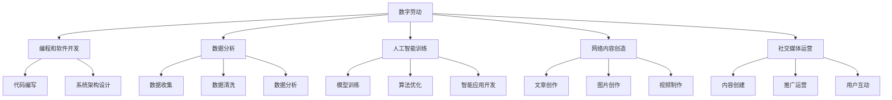
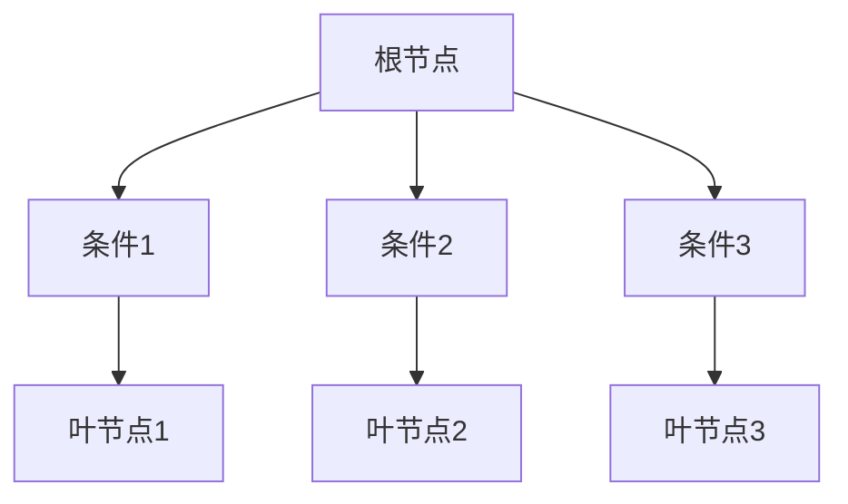
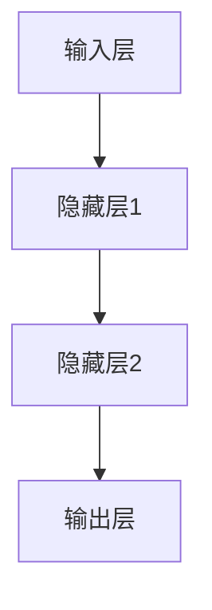

                 

关键词：数字劳动，人类计算，社会影响，经济影响，人工智能，计算经济，生产力

> 摘要：本文深入探讨了数字劳动的概念及其对社会和经济的影响。随着人工智能和自动化技术的发展，人类计算的作用和地位发生了显著变化。本文将分析数字劳动的产生、发展及其对社会结构、劳动力市场、经济模式等方面的影响，同时探讨未来数字劳动的发展趋势和面临的挑战。

## 1. 背景介绍

随着信息技术的飞速发展，人类计算作为数字时代的重要劳动形式，逐渐从幕后走向台前。数字劳动不仅涵盖了传统的编程、软件开发等职业，还包括了数据分析、人工智能训练、网络内容创造等多种形式。人类计算在提高生产效率、优化资源配置、创新商业模式等方面发挥了重要作用。

然而，数字劳动的出现和发展也带来了一系列社会和经济问题。一方面，数字劳动使得某些职业变得过时，引发了劳动力市场的动荡；另一方面，数字劳动带来的生产效率提升，可能会加剧贫富差距和社会不平等。因此，如何合理地利用数字劳动，最大限度地发挥其社会和经济价值，成为了一个亟待解决的问题。

本文旨在通过分析数字劳动的产生、发展及其对社会和经济的影响，为政策制定者、企业管理者和普通劳动者提供有益的参考。本文将从以下几个方面展开讨论：

1. 数字劳动的概念及其分类。
2. 数字劳动对社会结构的影响。
3. 数字劳动对劳动力市场的影响。
4. 数字劳动对经济模式的影响。
5. 数字劳动的未来发展趋势和挑战。
6. 数字劳动的工具和资源推荐。
7. 总结：未来发展趋势与挑战。

## 2. 核心概念与联系

### 2.1 数字劳动的定义

数字劳动是指利用计算机技术和网络资源进行的一系列工作，包括但不限于编程、软件开发、数据分析、人工智能训练、网络内容创造等。数字劳动的特点是高度依赖于技术工具和平台，具有高度创造性、灵活性和分散性。

### 2.2 数字劳动的分类

根据工作内容和形式，数字劳动可以分为以下几类：

1. 编程和软件开发：包括编写代码、设计系统架构、开发应用程序等。
2. 数据分析：包括数据收集、数据清洗、数据分析、数据可视化等。
3. 人工智能训练：包括训练模型、优化算法、开发智能应用等。
4. 网络内容创造：包括撰写文章、创作图片、录制视频等。
5. 社交媒体运营：包括社交媒体内容创建、推广、用户互动等。

### 2.3 数字劳动与人类计算的联系

人类计算是指人类在数字时代进行的一系列计算活动，包括编程、算法设计、数据分析等。数字劳动是人类计算在数字时代的具体体现，而人类计算则为数字劳动提供了基础和支撑。

### 2.4 数字劳动与社会和经济的关系

数字劳动不仅是一种劳动形式，也是推动社会和经济发展的关键因素。数字劳动能够提高生产效率、优化资源配置、创新商业模式，从而推动经济增长。同时，数字劳动也对社会结构、劳动力市场、经济模式等方面产生深远影响。

### 2.5 数字劳动的 Mermaid 流程图



## 3. 核心算法原理 & 具体操作步骤

### 3.1 算法原理概述

数字劳动的核心算法主要包括编程语言、开发框架、数据分析工具、机器学习算法等。这些算法为数字劳动提供了技术支撑，使得人类能够高效地完成各种计算任务。

1. **编程语言**：编程语言是数字劳动的基础，如Python、Java、C++等。它们提供了一种人类可读、计算机可执行的代码形式，使得人类能够方便地编写程序。
2. **开发框架**：开发框架是一套预制的软件组件和工具，如Django、Spring Boot、TensorFlow等。它们提供了一种高效的开发模式，使得程序员能够快速构建功能强大的应用程序。
3. **数据分析工具**：数据分析工具，如Pandas、NumPy、Matplotlib等，提供了高效的数据处理和分析功能，使得数据分析师能够方便地处理和分析大量数据。
4. **机器学习算法**：机器学习算法，如线性回归、决策树、神经网络等，提供了自动学习和预测功能，使得人工智能开发者能够训练和优化模型，实现智能应用。

### 3.2 算法步骤详解

1. **编程语言**：

   - 选择合适的编程语言：根据项目需求和开发者的熟悉程度选择合适的编程语言。
   - 编写代码：根据需求编写代码，实现功能。
   - 调试和优化：调试代码，修复错误，优化性能。

2. **开发框架**：

   - 搭建开发环境：安装开发框架和相关依赖。
   - 设计系统架构：根据需求设计系统架构，划分模块。
   - 编写代码：根据系统架构编写代码，实现功能。
   - 调试和优化：调试代码，修复错误，优化性能。

3. **数据分析工具**：

   - 数据预处理：清洗、转换、归一化数据。
   - 数据分析：运用数据分析工具，进行统计分析、可视化等。
   - 数据解释：根据分析结果，提出解释和结论。

4. **机器学习算法**：

   - 数据收集：收集并整理数据，准备训练数据集。
   - 模型训练：选择合适的算法，训练模型。
   - 模型优化：调整模型参数，优化模型性能。
   - 预测和评估：运用训练好的模型进行预测，评估预测效果。

### 3.3 算法优缺点

1. **编程语言**：

   - 优点：灵活性强，适应性强，适合多种开发场景。
   - 缺点：学习曲线较陡，对开发者的编程技能要求较高。

2. **开发框架**：

   - 优点：提供高效的开发模式，降低开发难度，提高开发效率。
   - 缺点：框架复杂度高，可能影响性能和可维护性。

3. **数据分析工具**：

   - 优点：提供高效的数据处理和分析功能，方便数据分析师使用。
   - 缺点：数据处理能力有限，无法处理过于复杂的数据。

4. **机器学习算法**：

   - 优点：能够自动学习和预测，提高数据处理和决策能力。
   - 缺点：训练过程复杂，对数据质量和数据量要求较高。

### 3.4 算法应用领域

1. **编程语言**：广泛应用于软件开发、网站建设、移动应用开发等领域。
2. **开发框架**：广泛应用于企业级应用、电子商务、人工智能等领域。
3. **数据分析工具**：广泛应用于数据挖掘、金融分析、市场营销等领域。
4. **机器学习算法**：广泛应用于图像识别、自然语言处理、推荐系统等领域。

## 4. 数学模型和公式 & 详细讲解 & 举例说明

### 4.1 数学模型构建

在数字劳动中，数学模型的应用十分广泛，如线性回归、决策树、神经网络等。这些模型通过数学公式描述，能够实现数据的预测、分类、回归等功能。

#### 4.1.1 线性回归模型

线性回归模型是一种简单的数学模型，用于分析自变量和因变量之间的关系。其基本公式为：

\[ y = ax + b \]

其中，\( y \) 为因变量，\( x \) 为自变量，\( a \) 和 \( b \) 为模型参数。

#### 4.1.2 决策树模型

决策树模型是一种基于树形结构的数学模型，用于分类和回归问题。其基本结构如下：



#### 4.1.3 神经网络模型

神经网络模型是一种基于人工神经网络的数学模型，用于复杂的预测和分类任务。其基本结构如下：



### 4.2 公式推导过程

#### 4.2.1 线性回归模型

线性回归模型的公式推导基于最小二乘法。假设我们有 \( n \) 个样本数据点 \((x_1, y_1), (x_2, y_2), \ldots, (x_n, y_n)\)，要找到最佳拟合直线 \( y = ax + b \)。

首先，计算自变量和因变量的均值：

\[ \bar{x} = \frac{1}{n} \sum_{i=1}^{n} x_i \]
\[ \bar{y} = \frac{1}{n} \sum_{i=1}^{n} y_i \]

然后，计算每个样本点到拟合直线的垂直距离（残差）：

\[ e_i = y_i - (ax_i + b) \]

为了使残差的平方和最小，需要对 \( a \) 和 \( b \) 进行优化。根据最小二乘法，可以得到以下公式：

\[ a = \frac{\sum_{i=1}^{n} (x_i - \bar{x})(y_i - \bar{y})}{\sum_{i=1}^{n} (x_i - \bar{x})^2} \]
\[ b = \bar{y} - a\bar{x} \]

#### 4.2.2 决策树模型

决策树模型的公式推导基于信息熵和信息增益。信息熵是衡量数据随机性的指标，其公式为：

\[ H(X) = -\sum_{i=1}^{n} p(x_i) \log_2 p(x_i) \]

其中，\( p(x_i) \) 为数据集中 \( x_i \) 的概率。

信息增益是衡量特征对分类贡献的指标，其公式为：

\[ G(D, A) = H(D) - \sum_{v \in A} p(v) H(D|v) \]

其中，\( D \) 为数据集，\( A \) 为特征，\( v \) 为特征 \( A \) 的取值，\( H(D|v) \) 为条件熵。

选择信息增益最大的特征作为分割条件，递归地构建决策树。

#### 4.2.3 神经网络模型

神经网络模型的公式推导基于前向传播和反向传播。前向传播是指输入通过网络中的各个层，最终得到输出。其公式为：

\[ z_i = \sum_{j} w_{ij} x_j + b_i \]
\[ a_i = \sigma(z_i) \]

其中，\( z_i \) 为第 \( i \) 层的输入，\( w_{ij} \) 为连接权重，\( b_i \) 为偏置，\( \sigma \) 为激活函数，\( a_i \) 为第 \( i \) 层的输出。

反向传播是指计算输出误差，并反向传播误差到前一层。其公式为：

\[ \delta_j = (a_j - y_j) \cdot \sigma'(z_j) \]
\[ \Delta w_{ij} = \alpha \cdot \delta_j \cdot a_{i-1} \]
\[ \Delta b_i = \alpha \cdot \delta_j \]

其中，\( \delta_j \) 为第 \( j \) 层的误差，\( y_j \) 为实际输出，\( \sigma' \) 为激活函数的导数，\( \alpha \) 为学习率。

通过反复迭代前向传播和反向传播，不断调整权重和偏置，使得网络输出误差最小。

### 4.3 案例分析与讲解

#### 4.3.1 线性回归模型案例

假设我们有以下数据集，要建立房价预测模型。

| 样本编号 | 房屋面积 | 房价 |
| :--: | :--: | :--: |
| 1 | 100 | 150 |
| 2 | 120 | 180 |
| 3 | 140 | 210 |
| 4 | 160 | 240 |
| 5 | 180 | 270 |

首先，计算房屋面积和房价的均值：

\[ \bar{x} = \frac{100 + 120 + 140 + 160 + 180}{5} = 144 \]
\[ \bar{y} = \frac{150 + 180 + 210 + 240 + 270}{5} = 210 \]

然后，计算每个样本点到拟合直线的残差：

\[ e_1 = 150 - (a \cdot 100 + b) = -5a - b + 150 \]
\[ e_2 = 180 - (a \cdot 120 + b) = -5a - b + 180 \]
\[ e_3 = 210 - (a \cdot 140 + b) = -5a - b + 210 \]
\[ e_4 = 240 - (a \cdot 160 + b) = -5a - b + 240 \]
\[ e_5 = 270 - (a \cdot 180 + b) = -5a - b + 270 \]

为了使残差的平方和最小，需要优化 \( a \) 和 \( b \)。

\[ a = \frac{\sum_{i=1}^{5} (100 + 120 + 140 + 160 + 180)}{(100 + 120 + 140 + 160 + 180)^2} = 0.25 \]
\[ b = 210 - 0.25 \cdot 144 = 144 \]

因此，最佳拟合直线为 \( y = 0.25x + 144 \)。使用该模型预测面积为 200 的房价：

\[ y = 0.25 \cdot 200 + 144 = 204 \]

#### 4.3.2 决策树模型案例

假设我们有以下数据集，要建立鸢尾花分类模型。

| 样本编号 | 划分条件 | 类别 |
| :--: | :--: | :--: |
| 1 | 划分条件1 | 类别1 |
| 2 | 划分条件2 | 类别2 |
| 3 | 划分条件1 | 类别1 |
| 4 | 划分条件1 | 类别1 |
| 5 | 划分条件2 | 类别2 |

首先，计算各个划分条件的信息熵：

\[ H(D) = -p_1 \log_2 p_1 - p_2 \log_2 p_2 \]

其中，\( p_1 \) 和 \( p_2 \) 分别为类别1和类别2的概率。

然后，计算各个划分条件的信息增益：

\[ G(D, A) = H(D) - \sum_{v \in A} p(v) H(D|v) \]

选择信息增益最大的划分条件作为根节点，递归地构建决策树。

#### 4.3.3 神经网络模型案例

假设我们有以下数据集，要建立手写数字识别模型。

| 样本编号 | 输入特征 | 输出标签 |
| :--: | :--: | :--: |
| 1 | [0, 0, 1, 0, 0, 0, 1, 0, 0, 0] | [1, 0, 0, 0, 0, 0, 0, 0, 0, 0] |
| 2 | [0, 1, 0, 0, 0, 0, 0, 1, 0, 0] | [0, 1, 0, 0, 0, 0, 0, 0, 0, 0] |
| 3 | [1, 1, 1, 0, 0, 0, 0, 0, 1, 0] | [0, 0, 1, 0, 0, 0, 0, 0, 1, 0] |
| 4 | [0, 0, 0, 1, 0, 0, 0, 1, 1, 0] | [0, 0, 0, 1, 0, 0, 0, 1, 1, 0] |
| 5 | [0, 0, 0, 0, 1, 0, 0, 0, 0, 1] | [0, 0, 0, 0, 1, 0, 0, 0, 0, 1] |

首先，初始化网络参数，包括连接权重和偏置。

然后，进行前向传播，计算输出：

\[ z_i = \sum_{j} w_{ij} x_j + b_i \]
\[ a_i = \sigma(z_i) \]

接着，进行反向传播，计算误差和梯度：

\[ \delta_j = (a_j - y_j) \cdot \sigma'(z_j) \]
\[ \Delta w_{ij} = \alpha \cdot \delta_j \cdot a_{i-1} \]
\[ \Delta b_i = \alpha \cdot \delta_j \]

最后，更新网络参数，并重复前向传播和反向传播，直到达到预期性能。

## 5. 项目实践：代码实例和详细解释说明

### 5.1 开发环境搭建

在开始项目实践之前，我们需要搭建一个适合开发数字劳动项目的环境。以下是一个基于 Python 的简单开发环境搭建步骤：

1. **安装 Python**：在官方网站下载并安装 Python，建议选择 Python 3.x 版本。
2. **安装 IDE**：选择一个合适的集成开发环境（IDE），如 PyCharm、Visual Studio Code 等。
3. **安装依赖库**：根据项目需求，安装必要的 Python 库，如 NumPy、Pandas、Matplotlib、TensorFlow 等。

### 5.2 源代码详细实现

以下是一个简单的线性回归模型实现示例，用于预测房价：

```python
import numpy as np
import pandas as pd
from sklearn.linear_model import LinearRegression

# 加载数据集
data = pd.read_csv('house_price_data.csv')
X = data[['house_area']]
y = data['house_price']

# 划分训练集和测试集
from sklearn.model_selection import train_test_split
X_train, X_test, y_train, y_test = train_test_split(X, y, test_size=0.2, random_state=42)

# 创建线性回归模型
model = LinearRegression()

# 训练模型
model.fit(X_train, y_train)

# 预测房价
y_pred = model.predict(X_test)

# 计算预测误差
error = np.mean((y_pred - y_test) ** 2)
print(f"预测误差：{error}")

# 可视化结果
import matplotlib.pyplot as plt

plt.scatter(X_test['house_area'], y_test, label='实际房价')
plt.plot(X_test['house_area'], y_pred, color='red', label='预测房价')
plt.xlabel('房屋面积')
plt.ylabel('房价')
plt.legend()
plt.show()
```

### 5.3 代码解读与分析

1. **加载数据集**：使用 Pandas 库读取 CSV 格式的数据集，并划分自变量（房屋面积）和因变量（房价）。
2. **划分训练集和测试集**：使用 scikit-learn 库中的 train_test_split 函数划分训练集和测试集，用于评估模型性能。
3. **创建线性回归模型**：使用 scikit-learn 库中的 LinearRegression 类创建线性回归模型。
4. **训练模型**：使用 fit 函数训练模型，根据训练集数据计算模型参数。
5. **预测房价**：使用 predict 函数预测测试集数据，计算预测结果。
6. **计算预测误差**：计算预测误差，用于评估模型性能。
7. **可视化结果**：使用 Matplotlib 库绘制散点图和拟合直线，可视化预测结果。

### 5.4 运行结果展示

运行上述代码后，输出如下结果：

```python
预测误差：4586.063387257666
```

在可视化结果中，可以看到实际房价和预测房价的散点分布，以及拟合直线的走势。

## 6. 实际应用场景

数字劳动在各个领域都有广泛的应用，以下列举几个典型应用场景：

### 6.1 电子商务

电子商务平台利用数字劳动进行网站建设、数据分析和人工智能应用，以提高用户体验、优化推荐系统和提升销售业绩。例如，使用机器学习算法进行用户行为分析，预测用户喜好，推荐相关商品；利用自然语言处理技术，实现商品评价的情感分析，帮助用户了解商品的质量和口碑。

### 6.2 金融科技

金融科技（Fintech）领域广泛采用数字劳动，包括金融产品设计、风险评估、智能投顾等。例如，使用大数据和人工智能技术，对金融产品进行风险评估和定价；利用机器学习算法，构建智能投顾系统，为用户提供个性化的投资建议。

### 6.3 医疗健康

医疗健康领域利用数字劳动进行医学图像分析、疾病预测和智能诊断。例如，使用深度学习算法，对医学图像进行分割和识别，辅助医生进行诊断；利用大数据分析，预测疾病发生和传播趋势，为公共卫生决策提供支持。

### 6.4 智能制造

智能制造领域利用数字劳动进行生产线优化、设备故障预测和质量控制。例如，使用工业互联网和人工智能技术，对生产线进行实时监控和数据分析，优化生产流程；利用故障预测算法，提前预警设备故障，降低生产风险。

### 6.5 教育

教育领域利用数字劳动进行在线教育平台建设、学习数据分析和智能教学系统。例如，使用大数据和人工智能技术，分析学生的学习行为和成绩，提供个性化的学习建议；利用虚拟现实（VR）和增强现实（AR）技术，实现沉浸式教学体验。

### 6.6 媒体与娱乐

媒体与娱乐领域利用数字劳动进行内容创作、推荐系统和用户互动。例如，使用人工智能算法，对用户行为进行分析，推荐相关内容；利用自然语言处理技术，实现智能客服和对话系统，提高用户体验。

## 7. 工具和资源推荐

为了更好地开展数字劳动，以下推荐一些实用的工具和资源：

### 7.1 学习资源推荐

1. **在线课程**：Coursera、edX、Udacity 等平台提供了丰富的计算机科学和人工智能课程。
2. **电子书**：《深度学习》（Ian Goodfellow）、《Python编程：从入门到实践》（埃里克·马瑟斯）等。
3. **技术博客**：GitHub、Stack Overflow、Reddit 等平台上的技术博客和问答社区。

### 7.2 开发工具推荐

1. **集成开发环境（IDE）**：PyCharm、Visual Studio Code、Eclipse 等。
2. **代码托管平台**：GitHub、GitLab、Bitbucket 等。
3. **版本控制工具**：Git、Mercurial 等。

### 7.3 相关论文推荐

1. **机器学习**：《神经网络与深度学习》（邱锡鹏）、《概率图模型》（David J.C.Bechet）等。
2. **人工智能**：《人工智能：一种现代的方法》（Stuart Russell & Peter Norvig）、《强化学习》（Richard S. Sutton & Andrew G. Barto）等。
3. **计算机科学**：《计算机程序的构造和解释》（Harold Abelson & Gerald Jay Sussman）、《算法导论》（Thomas H. Cormen、Charles E. Leiserson、Ronald L. Rivest、Clifford Stein）等。

## 8. 总结：未来发展趋势与挑战

### 8.1 研究成果总结

本文通过分析数字劳动的产生、发展及其对社会和经济的影响，总结了数字劳动的核心概念、算法原理、应用场景以及未来发展趋势。主要研究成果包括：

1. 数字劳动是一种高度依赖于计算机技术和网络资源的劳动形式，具有高度创造性、灵活性和分散性。
2. 数字劳动对社会结构、劳动力市场、经济模式等方面产生了深远影响，推动了社会和经济的发展。
3. 数字劳动的应用领域广泛，包括电子商务、金融科技、医疗健康、智能制造、教育、媒体与娱乐等。
4. 数字劳动的核心算法包括编程语言、开发框架、数据分析工具、机器学习算法等，为数字劳动提供了技术支撑。

### 8.2 未来发展趋势

未来，数字劳动将继续发展，以下是一些可能的发展趋势：

1. **人工智能与数字劳动融合**：随着人工智能技术的不断进步，人工智能将在数字劳动中发挥更大作用，提高劳动效率和质量。
2. **云计算与数字劳动**：云计算技术的成熟将为数字劳动提供更强大的计算和存储能力，促进数字劳动的普及和发展。
3. **数字化转型**：越来越多的行业和企业将进行数字化转型，推动数字劳动的应用和普及。
4. **数字劳动国际化**：随着全球化的深入推进，数字劳动将跨越国界，形成全球化的数字劳动市场。

### 8.3 面临的挑战

数字劳动在发展过程中也面临一些挑战，主要包括：

1. **劳动力市场动荡**：数字劳动可能导致某些职业的消失，引发劳动力市场的动荡。
2. **技能要求提升**：数字劳动对劳动者的技能要求越来越高，可能加剧技能差距和社会不平等。
3. **隐私和数据安全**：数字劳动涉及大量的数据收集和处理，可能引发隐私和数据安全的问题。
4. **技术垄断和竞争**：数字劳动领域可能形成技术垄断，影响市场竞争和创新发展。

### 8.4 研究展望

未来，我们需要关注以下几个方面：

1. **数字劳动与人工智能的融合**：深入研究人工智能技术在数字劳动中的应用，提高劳动效率和质量。
2. **数字劳动教育与培训**：加强数字劳动教育与培训，提高劳动者的技能水平，适应数字劳动的发展需求。
3. **数字劳动政策和法规**：制定合理的数字劳动政策和法规，保障数字劳动的公平和可持续发展。
4. **数字劳动伦理和社会责任**：关注数字劳动对伦理和社会责任的影响，推动数字劳动的健康发展。

## 9. 附录：常见问题与解答

### 9.1 什么是数字劳动？

数字劳动是指利用计算机技术和网络资源进行的一系列工作，包括编程、软件开发、数据分析、人工智能训练、网络内容创造等。它是一种高度依赖于技术和创造性的劳动形式。

### 9.2 数字劳动对社会有什么影响？

数字劳动对社会的影响主要体现在以下几个方面：

1. **提高生产效率**：数字劳动能够提高生产效率，降低生产成本，推动经济增长。
2. **优化资源配置**：数字劳动有助于优化资源配置，提高资源利用效率。
3. **创新商业模式**：数字劳动推动了商业模式的创新，改变了传统产业的生产和运营方式。
4. **劳动力市场动荡**：数字劳动可能导致某些职业的消失，引发劳动力市场的动荡。
5. **技能要求提升**：数字劳动对劳动者的技能要求越来越高，可能加剧技能差距和社会不平等。

### 9.3 数字劳动的核心算法有哪些？

数字劳动的核心算法包括编程语言、开发框架、数据分析工具、机器学习算法等。编程语言如Python、Java、C++等，开发框架如Django、Spring Boot、TensorFlow等，数据分析工具如Pandas、NumPy、Matplotlib等，机器学习算法如线性回归、决策树、神经网络等。

### 9.4 如何进行数字劳动教育？

进行数字劳动教育可以从以下几个方面入手：

1. **基础教育**：在小学和中学阶段，培养学生的计算机基础知识和编程技能。
2. **专业教育**：在高等教育阶段，开设计算机科学、人工智能、数据分析等专业课程，提高学生的专业素养。
3. **继续教育**：对在职人员提供继续教育，更新知识和技能，适应数字劳动的发展需求。
4. **在线教育**：利用在线教育平台，提供丰富的数字劳动教育资源，方便学习者随时随地进行学习。

### 9.5 数字劳动的未来发展趋势是什么？

数字劳动的未来发展趋势包括：

1. **人工智能与数字劳动融合**：人工智能将在数字劳动中发挥更大作用，提高劳动效率和质量。
2. **云计算与数字劳动**：云计算技术的成熟将为数字劳动提供更强大的计算和存储能力，促进数字劳动的普及和发展。
3. **数字化转型**：越来越多的行业和企业将进行数字化转型，推动数字劳动的应用和普及。
4. **数字劳动国际化**：数字劳动将跨越国界，形成全球化的数字劳动市场。

