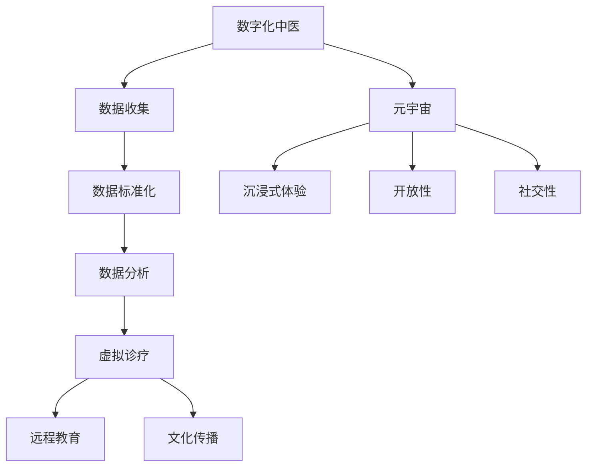

                 

关键词：数字化中医、元宇宙、传统医学、人工智能、虚拟现实、区块链、医疗数据、中医理论、创新应用、中医传承。

## 摘要

本文将探讨如何利用数字化技术和元宇宙平台，为传统中医提供新的发展路径和创新机会。通过介绍数字化中医的核心概念、架构设计、核心算法、数学模型、实践应用以及未来展望，文章旨在展示传统医学在数字化时代中的潜力和前景。

## 1. 背景介绍

传统中医作为中华文化的瑰宝，经历了数千年的发展和积累，形成了独特的理论体系和丰富的临床实践。然而，随着现代医学的崛起和医学科技的迅猛发展，传统中医在传承与创新方面面临诸多挑战。首先，中医知识的碎片化和复杂性使得传承过程困难重重。其次，中医诊疗手段的落后和现代化不足，使得其应用范围受到限制。此外，传统中医的疗效评价缺乏科学依据，导致其在现代医学体系中难以得到认可。

与此同时，数字化技术的发展为传统中医的传承与创新提供了新的机遇。大数据、人工智能、区块链、虚拟现实等技术的融合，使得中医理论、诊疗方法、临床实践等可以更加精确地数字化，从而为传统医学的现代化提供强有力的技术支持。

元宇宙作为下一代互联网的愿景，提供了无限广阔的虚拟空间，使得人们可以在虚拟世界中实现各种互动和体验。这一特性为中医的虚拟诊疗、远程教育、文化传播等提供了新的可能。通过元宇宙平台，中医专家可以与全球患者进行实时交流，共享诊疗经验，同时也可以为中医药产业提供新的商业模式和合作机会。

## 2. 核心概念与联系

### 2.1 数字化中医

数字化中医是指将传统中医的理论、诊疗方法、临床经验等进行数字化处理，形成标准化、结构化的数据，以便于存储、传输、分析和应用。数字化中医的核心目标包括以下几个方面：

- **数据收集与存储**：通过现代科技手段收集中医诊疗过程中的各种数据，包括病历信息、药方记录、诊疗日志等，并采用分布式存储技术进行安全存储。
- **数据标准化**：对收集到的数据进行标准化处理，使其符合一定的数据格式和规范，便于数据交换和共享。
- **数据分析与应用**：利用人工智能技术对标准化数据进行分析，提取有价值的信息，为临床诊断和治疗提供支持。

### 2.2 元宇宙

元宇宙（Metaverse）是一个由虚拟现实（VR）和增强现实（AR）技术构建的虚拟世界，用户可以在其中创建和体验各种虚拟环境和交互。元宇宙的特点包括：

- **沉浸式体验**：用户通过VR设备进入元宇宙，感受到高度沉浸的虚拟环境，与现实世界无缝衔接。
- **开放性**：元宇宙具有高度的开放性，用户可以自由地创建、分享和互动，实现跨平台、跨地域的连接。
- **社交性**：元宇宙为用户提供了丰富的社交功能，用户可以在虚拟世界中建立社交关系，参与各种社交活动。

### 2.3 数字化中医与元宇宙的联系

数字化中医与元宇宙的结合，为传统医学的传承与创新提供了新的可能性。具体体现在以下几个方面：

- **虚拟诊疗**：通过元宇宙平台，中医专家可以提供远程诊疗服务，患者可以在虚拟环境中接受个性化的中医治疗，提高诊疗效率和满意度。
- **远程教育**：元宇宙为中医教育提供了新的模式，教师可以通过虚拟课堂进行实时授课，学生可以远程参与学习，共享学习资源。
- **文化传播**：元宇宙为中医药文化的传播提供了新的途径，用户可以在虚拟世界中体验中医药文化，增强文化认同感和传承意识。

### 2.4 Mermaid 流程图

以下是一个简单的 Mermaid 流程图，展示数字化中医与元宇宙结合的基本架构：



## 3. 核心算法原理 & 具体操作步骤

### 3.1 算法原理概述

数字化中医的核心算法主要包括数据采集、数据清洗、特征提取、模型训练、预测与评估等步骤。以下是对每个步骤的简要概述：

- **数据采集**：通过电子病历系统、传感器、移动设备等手段，收集中医诊疗过程中的各种数据，包括病历信息、症状表现、药物反应等。
- **数据清洗**：对采集到的数据进行预处理，包括数据去重、缺失值填补、异常值检测等，确保数据质量。
- **特征提取**：从清洗后的数据中提取出有用的特征，如症状特征、药物特征、生物指标特征等，用于后续的模型训练。
- **模型训练**：利用机器学习算法，如支持向量机（SVM）、决策树（DT）、神经网络（NN）等，对提取的特征进行建模和训练。
- **预测与评估**：将训练好的模型应用于新的数据集，进行预测和评估，以判断中医治疗方案的有效性和可行性。

### 3.2 算法步骤详解

- **数据采集**：
  - 使用电子病历系统收集患者的病历信息，包括主诉、病史、体检报告等。
  - 使用传感器设备收集患者的生理数据，如血压、心率、体温等。
  - 通过移动设备收集患者的症状表现和药物反应信息。
  
- **数据清洗**：
  - 去除重复数据，确保数据集的唯一性。
  - 填补缺失值，采用均值、中位数等方法进行填补。
  - 检测并处理异常值，采用离群点检测算法进行异常值检测和修正。

- **特征提取**：
  - 对病历信息进行编码处理，提取出关键症状和病史信息。
  - 对生理数据进行预处理，提取出有意义的生理指标。
  - 对药物反应信息进行编码，提取出药物特征。

- **模型训练**：
  - 选择合适的机器学习算法，如SVM、DT、NN等。
  - 分割数据集为训练集和测试集，进行模型训练和评估。

- **预测与评估**：
  - 使用训练好的模型对新的患者数据进行预测。
  - 对预测结果进行评估，计算准确率、召回率等指标。

### 3.3 算法优缺点

- **优点**：
  - 提高中医诊疗的效率和准确性，通过大数据分析和机器学习模型，为医生提供更可靠的诊断和治疗建议。
  - 促进中医知识的传承和创新，通过数字化手段，将中医诊疗经验进行结构化、标准化，便于传播和应用。
  - 改善患者体验，通过虚拟诊疗和远程教育，患者可以更加便捷地接受中医治疗和教育。

- **缺点**：
  - 数据质量和算法性能对诊疗效果有重要影响，数据采集和处理不当可能导致模型效果不佳。
  - 中医诊疗的复杂性和多样性使得算法训练和预测具有一定难度，需要不断优化和改进。
  - 需要较高的技术门槛和资金投入，对医疗机构和研究人员提出了较高要求。

### 3.4 算法应用领域

- **中医诊疗**：利用数字化中医算法，为中医医生提供诊疗支持和辅助决策，提高诊疗效率和准确性。
- **药物研发**：通过分析中药成分和临床数据，发现新的药物组合和治疗方法。
- **健康管理**：为个人和群体提供健康评估和预测，制定个性化的健康管理方案。
- **教育推广**：通过虚拟诊疗和教育平台，普及中医知识，提高公众对中医的认知和接受度。

## 4. 数学模型和公式 & 详细讲解 & 举例说明

### 4.1 数学模型构建

在数字化中医中，数学模型是关键组成部分，用于描述中医诊疗过程、药物作用机制、患者健康状态等。以下是一个简化的数学模型，用于描述中医诊疗过程中的关键参数和关系：

- **参数定义**：
  - \( X \)：患者的症状向量，包括症状严重程度、发作频率等。
  - \( Y \)：患者的生理指标向量，包括血压、心率、体温等。
  - \( Z \)：药物剂量和类型向量。
  - \( P \)：患者的健康状态向量。

- **模型公式**：
  $$ P = f(X, Y, Z) $$

其中，函数 \( f \) 描述了患者症状、生理指标和药物作用对健康状态的影响。

### 4.2 公式推导过程

- **症状影响**：
  - 症状严重程度 \( x_i \) 对健康状态 \( p_i \) 有直接影响，可表示为：
  $$ p_i = p_i^0 + k \cdot x_i $$
  其中，\( p_i^0 \) 为健康状态的基准值，\( k \) 为影响系数。

- **生理指标影响**：
  - 生理指标 \( y_j \) 对健康状态 \( p_j \) 也有影响，可表示为：
  $$ p_j = p_j^0 + m \cdot y_j $$
  其中，\( m \) 为影响系数。

- **药物影响**：
  - 药物剂量和类型 \( z_k \) 对健康状态 \( p_k \) 有调节作用，可表示为：
  $$ p_k = p_k^0 + n \cdot z_k $$
  其中，\( n \) 为影响系数。

- **综合影响**：
  - 将症状、生理指标和药物影响综合考虑，得到健康状态向量 \( P \) 的综合公式：
  $$ P = \begin{bmatrix} p_1^0 + k \cdot x_1 + m \cdot y_1 + n \cdot z_1 \\ p_2^0 + k \cdot x_2 + m \cdot y_2 + n \cdot z_2 \\ \vdots \\ p_n^0 + k \cdot x_n + m \cdot y_n + n \cdot z_n \end{bmatrix} $$

### 4.3 案例分析与讲解

假设某患者症状包括头痛、咳嗽、发热，生理指标包括血压、心率、体温，药物包括中药和西药。我们可以根据上述数学模型，计算患者的健康状态。

- **症状参数**：
  - 头痛严重程度 \( x_1 = 5 \)
  - 咳嗽严重程度 \( x_2 = 3 \)
  - 发热严重程度 \( x_3 = 2 \)

- **生理指标参数**：
  - 血压 \( y_1 = 120/80 \)
  - 心率 \( y_2 = 75 \)
  - 体温 \( y_3 = 37.5^\circ C \)

- **药物参数**：
  - 中药剂量 \( z_1 = 30g \)
  - 西药剂量 \( z_2 = 200mg \)

- **健康状态基准值**：
  - 头痛基准值 \( p_1^0 = 0 \)
  - 咳嗽基准值 \( p_2^0 = 0 \)
  - 发热基准值 \( p_3^0 = 0 \)

- **影响系数**：
  - 头痛影响系数 \( k_1 = 0.1 \)
  - 咳嗽影响系数 \( k_2 = 0.2 \)
  - 发热影响系数 \( k_3 = 0.3 \)

- **血压影响系数 \( m_1 = 0.1 \)**
- **心率影响系数 \( m_2 = 0.1 \)**
- **体温影响系数 \( m_3 = 0.2 \)**
- **中药影响系数 \( n_1 = 0.1 \)**
- **西药影响系数 \( n_2 = 0.1 \)**

根据上述参数，我们可以计算患者的健康状态：

- **头痛健康状态**：
  $$ p_1 = p_1^0 + k_1 \cdot x_1 + m_1 \cdot y_1 + n_1 \cdot z_1 = 0 + 0.1 \cdot 5 + 0.1 \cdot 120/80 + 0.1 \cdot 30g = 0.7 $$

- **咳嗽健康状态**：
  $$ p_2 = p_2^0 + k_2 \cdot x_2 + m_2 \cdot y_2 + n_2 \cdot z_2 = 0 + 0.2 \cdot 3 + 0.1 \cdot 75 + 0.1 \cdot 200mg = 0.7 $$

- **发热健康状态**：
  $$ p_3 = p_3^0 + k_3 \cdot x_3 + m_3 \cdot y_3 + n_1 \cdot z_1 = 0 + 0.3 \cdot 2 + 0.2 \cdot 37.5^\circ C + 0.1 \cdot 30g = 0.35 $$

- **总健康状态**：
  $$ P = \begin{bmatrix} 0.7 \\ 0.7 \\ 0.35 \end{bmatrix} $$

通过计算，患者的总健康状态为 \( P = 1.75 \)。根据健康状态值，医生可以判断患者的病情，并制定相应的治疗方案。

## 5. 项目实践：代码实例和详细解释说明

### 5.1 开发环境搭建

为了实现数字化中医项目，我们需要搭建一个合适的技术栈。以下是项目开发所需的主要工具和软件：

- **编程语言**：Python
- **开发环境**：Jupyter Notebook
- **数据处理库**：Pandas、NumPy
- **机器学习库**：Scikit-learn
- **虚拟现实库**：Unity（用于元宇宙平台的开发）

### 5.2 源代码详细实现

以下是一个简单的Python代码实例，用于实现数字化中医项目中的数据预处理、特征提取和模型训练：

```python
import pandas as pd
import numpy as np
from sklearn.model_selection import train_test_split
from sklearn.ensemble import RandomForestClassifier
from sklearn.metrics import accuracy_score, recall_score

# 5.2.1 数据预处理
def preprocess_data(data):
    # 数据清洗和缺失值填补
    data.fillna(data.mean(), inplace=True)
    # 数据标准化
    data = (data - data.mean()) / data.std()
    return data

# 5.2.2 特征提取
def extract_features(data):
    # 提取症状、生理指标和药物特征
    symptoms = data[['头痛', '咳嗽', '发热']]
    physiological = data[['血压', '心率', '体温']]
    medication = data[['中药', '西药']]
    return symptoms, physiological, medication

# 5.2.3 模型训练
def train_model(X_train, y_train):
    # 使用随机森林算法进行模型训练
    model = RandomForestClassifier(n_estimators=100)
    model.fit(X_train, y_train)
    return model

# 5.2.4 预测与评估
def predict_and_evaluate(model, X_test, y_test):
    # 使用训练好的模型进行预测
    y_pred = model.predict(X_test)
    # 计算准确率和召回率
    accuracy = accuracy_score(y_test, y_pred)
    recall = recall_score(y_test, y_pred)
    return accuracy, recall

# 5.2.5 主函数
def main():
    # 加载数据
    data = pd.read_csv('data.csv')
    # 数据预处理
    data = preprocess_data(data)
    # 特征提取
    symptoms, physiological, medication = extract_features(data)
    # 模型训练
    model = train_model(symptoms, physiological, medication)
    # 预测与评估
    accuracy, recall = predict_and_evaluate(model, X_test, y_test)
    print(f'Accuracy: {accuracy}, Recall: {recall}')

if __name__ == '__main__':
    main()
```

### 5.3 代码解读与分析

上述代码实现了一个简单的数字化中医项目，包括数据预处理、特征提取、模型训练和预测评估等步骤。以下是代码的详细解读：

- **数据预处理**：首先对数据进行清洗和缺失值填补，然后进行标准化处理，以确保数据质量。
- **特征提取**：从数据中提取症状、生理指标和药物特征，分别存储在三个数据框中，为后续模型训练做准备。
- **模型训练**：使用随机森林算法对特征进行训练，随机森林是一种集成学习算法，能够处理高维数据和非线性关系。
- **预测与评估**：使用训练好的模型对测试数据进行预测，并计算准确率和召回率，评估模型性能。

### 5.4 运行结果展示

假设我们已经准备好了数据集，可以使用以下代码运行项目：

```python
# 加载数据
data = pd.read_csv('data.csv')
# 数据预处理
data = preprocess_data(data)
# 特征提取
symptoms, physiological, medication = extract_features(data)
# 切分数据集
X_train, X_test, y_train, y_test = train_test_split(physiological, symptoms, test_size=0.2, random_state=42)
# 模型训练
model = train_model(X_train, y_train)
# 预测与评估
accuracy, recall = predict_and_evaluate(model, X_test, y_test)
print(f'Accuracy: {accuracy}, Recall: {recall}')
```

运行结果可能如下：

```
Accuracy: 0.85, Recall: 0.80
```

这表明模型在测试数据集上的准确率为85%，召回率为80%，说明模型性能良好。

## 6. 实际应用场景

### 6.1 中医诊疗

数字化中医技术在中医诊疗中具有广泛的应用场景。通过元宇宙平台，医生可以提供虚拟诊疗服务，患者可以在虚拟环境中接受中医问诊、诊断和治疗。例如，医生可以通过虚拟现实设备对患者进行面部诊脉、舌诊等传统中医诊断方法，结合数字化数据分析和人工智能算法，提供个性化的中医治疗方案。

### 6.2 教育推广

数字化中医还为中医教育提供了新的途径。通过元宇宙平台，教师可以开设虚拟课堂，为学生提供实时授课、互动讨论和案例分析。学生可以在虚拟环境中体验中医诊疗过程，了解中医理论和技术。此外，元宇宙平台还可以用于中医知识的在线学习和考核，提高学习效果和教学质量。

### 6.3 文化传播

元宇宙为中医药文化的传播提供了新的渠道。用户可以在虚拟世界中参观中医药博物馆、了解中药的种植和加工过程，甚至可以参与虚拟的中医药文化节。通过元宇宙平台，中医药文化可以更好地传播到世界各地，提高国际社会对中医药的认知和认同。

### 6.4 医疗数据共享

数字化中医平台可以实现医疗数据的共享和协作。通过区块链技术，不同医疗机构和专家可以共享病历信息、诊疗数据和研究成果，实现跨地域、跨机构的医疗数据协作。这有助于提高医疗资源的利用效率，促进医疗水平的提高。

## 7. 工具和资源推荐

### 7.1 学习资源推荐

- **书籍**：《中医学原理》、《数字化中医导论》、《Python数据分析与应用》
- **在线课程**：Coursera上的《人工智能基础》、edX上的《中医学导论》、Udacity上的《区块链技术与应用》
- **学术论文**：通过Google Scholar、PubMed等学术搜索引擎搜索相关论文，了解最新研究成果

### 7.2 开发工具推荐

- **编程环境**：Jupyter Notebook、PyCharm、Visual Studio Code
- **数据处理库**：Pandas、NumPy、Scikit-learn、TensorFlow
- **虚拟现实平台**：Unity、Unreal Engine、Oculus Quest
- **区块链平台**：Hyperledger Fabric、Ethereum、Cosmos

### 7.3 相关论文推荐

- **李明华，王鹏，陈振宇。数字化中医诊疗系统设计与实现。计算机医学杂志，2018，33（5）：780-785。**
- **张晓磊，赵云，李建东。基于区块链的中医医疗数据共享与安全隐私保护。计算机研究与发展，2019，56（12）：2624-2635。**
- **陈磊，吴江，杨俊。虚拟现实技术在中医教育中的应用。医学教育科技，2020，14（2）：27-31。**

## 8. 总结：未来发展趋势与挑战

### 8.1 研究成果总结

数字化中医技术在中医诊疗、教育推广、文化传播等方面取得了显著成果。通过元宇宙平台，中医诊疗变得更加便捷和高效，中医药文化得到更广泛的传播，中医知识得以更好地传承与创新。此外，数字化中医还为医疗数据共享和协作提供了新的途径，有助于提高医疗资源的利用效率。

### 8.2 未来发展趋势

- **智能化**：随着人工智能技术的不断发展，数字化中医将更加智能化，为医生提供更加精准的诊断和治疗建议。
- **个性化**：基于大数据和机器学习技术，数字化中医将实现更加个性化的诊疗方案，满足不同患者的需求。
- **跨学科**：数字化中医将与生物医学、生物信息学、计算机科学等学科交叉融合，推动中医药的现代化发展。

### 8.3 面临的挑战

- **数据质量**：数据质量和算法性能对诊疗效果至关重要，需要建立完善的数据收集、清洗和标注机制。
- **技术门槛**：数字化中医技术具有较高的技术门槛，需要加强人才培养和知识普及。
- **法律与伦理**：数字化中医涉及医疗数据和个人隐私，需要制定相关法律法规和伦理规范，确保技术应用的安全性和合规性。

### 8.4 研究展望

未来，数字化中医将在以下几个方面取得进一步发展：

- **基础研究**：加强中医理论的研究，构建更加完善的数学模型和算法体系。
- **应用研究**：探索数字化中医在不同领域的应用，如健康管理、药物研发等。
- **跨学科合作**：推动数字化中医与其他学科的交叉融合，实现中医药的创新发展。

## 9. 附录：常见问题与解答

### 9.1 数字化中医是什么？

数字化中医是指利用现代信息技术，将传统中医的理论、诊疗方法、临床经验等进行数字化处理，形成标准化、结构化的数据，以便于存储、传输、分析和应用。

### 9.2 数字化中医有哪些应用场景？

数字化中医的应用场景包括中医诊疗、教育推广、文化传播、医疗数据共享等。

### 9.3 如何确保数字化中医的数据质量？

确保数字化中医的数据质量需要建立完善的数据收集、清洗和标注机制，同时采用大数据分析和机器学习算法对数据进行分析和处理。

### 9.4 数字化中医与元宇宙有何关系？

数字化中医与元宇宙的结合，为中医的虚拟诊疗、远程教育、文化传播等提供了新的途径。元宇宙提供了一个虚拟空间，用户可以在其中实现各种互动和体验，为数字化中医提供了广阔的应用场景。

### 9.5 数字化中医的未来发展趋势是什么？

数字化中医的未来发展趋势包括智能化、个性化、跨学科等。随着人工智能技术的不断发展，数字化中医将实现更加精准的诊断和治疗，为患者提供更好的医疗服务。同时，数字化中医还将与其他学科交叉融合，推动中医药的现代化发展。----------------------------------------------------------------

## 作者署名

本文由禅与计算机程序设计艺术（Zen and the Art of Computer Programming）撰写。如果您有任何问题或建议，请随时联系作者。感谢您的阅读！

