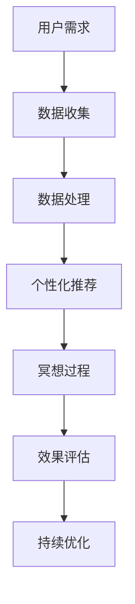

                 

关键词：数字化冥想，科技辅助，心灵平静，人工智能，数据处理，算法，技术创业

> 摘要：本文将探讨数字化冥想的创业机会，以及科技在辅助心灵平静方面的作用。通过介绍相关技术概念和实际应用案例，我们旨在揭示数字化冥想在现代社会中的重要性，并展望其未来发展趋势。

## 1. 背景介绍

在当今快节奏、高度竞争的社会中，人们的心理压力不断增大。心理健康问题已成为全球关注的焦点，而冥想作为一种传统的心理调节方法，逐渐受到人们的重视。传统的冥想方式通常依赖于个人的自我控制和专注力，但在现代社会中，人们的注意力被各种电子设备分散，难以长时间保持专注。因此，如何通过科技手段辅助冥想，提高其效果和普及度，成为了当今科技创业者的重要课题。

### 1.1 数字化冥想的兴起

近年来，随着人工智能、大数据、物联网等技术的迅速发展，数字化冥想逐渐兴起。通过将这些前沿技术应用于冥想领域，人们可以更加便捷地获取冥想资源，实时监测和调整冥想过程，从而提高冥想的效果和乐趣。

### 1.2 科技对冥想的支持

科技在冥想中的应用主要包括以下几个方面：

1. **人工智能算法**：利用人工智能算法，可以为用户提供个性化的冥想方案，根据用户的行为数据和生理数据，实时调整冥想内容和节奏。

2. **大数据分析**：通过收集和分析大量冥想数据，可以发现冥想对个体心理状态的影响规律，为科学研究和实践提供依据。

3. **物联网设备**：利用物联网设备，如智能手表、智能音箱等，可以实时监测用户的生理参数，如心率、呼吸等，帮助用户更好地掌握冥想过程中的生理变化。

4. **虚拟现实（VR）技术**：通过虚拟现实技术，用户可以沉浸在特定的场景中，如自然景观、星空等，提高冥想的沉浸感和体验。

## 2. 核心概念与联系

为了更好地理解数字化冥想，我们需要了解以下几个核心概念：

### 2.1 冥想与心理健康

冥想是一种通过训练注意力和意识，以达到心理平静和身心放松的方法。研究表明，冥想可以提高个体的情绪调节能力、减轻压力、改善睡眠质量等。

### 2.2 人工智能与个性化

人工智能可以帮助我们根据用户的行为数据和生理数据，为用户提供个性化的冥想方案。这不仅可以提高冥想的效果，还可以增加用户的参与度和满意度。

### 2.3 大数据与冥想效果

大数据分析可以帮助我们了解冥想对个体心理状态的影响规律。通过分析大量用户数据，我们可以发现冥想的最佳实践方法，为科学研究提供参考。

### 2.4 物联网与生理监测

物联网设备可以实时监测用户的生理参数，如心率、呼吸等。这些数据可以帮助用户更好地了解自己的身体状况，为冥想过程提供依据。

### 2.5 虚拟现实与沉浸感

虚拟现实技术可以为用户提供沉浸式的冥想体验，提高冥想的乐趣和效果。通过创建特定的虚拟场景，用户可以更加放松地进入冥想状态。

### 2.6 Mermaid 流程图



## 3. 核心算法原理 & 具体操作步骤

### 3.1 算法原理概述

数字化冥想的核心算法主要包括以下几个方面：

1. **用户行为数据收集**：通过人工智能技术，收集用户在冥想过程中的行为数据，如点击次数、停留时间、情绪变化等。

2. **生理数据监测**：利用物联网设备，监测用户的心率、呼吸等生理数据。

3. **数据融合与处理**：将用户行为数据和生理数据进行融合和处理，提取有价值的信息。

4. **个性化推荐**：根据用户的行为数据和生理数据，为用户提供个性化的冥想方案。

5. **效果评估与反馈**：通过用户的使用反馈，评估冥想方案的效果，并进行持续优化。

### 3.2 算法步骤详解

1. **数据收集**：使用传感器和物联网设备，收集用户在冥想过程中的行为数据和生理数据。

2. **数据处理**：对收集到的数据进行预处理，包括去噪、归一化等，以便后续分析。

3. **特征提取**：从预处理后的数据中提取有用的特征，如情绪变化、生理状态等。

4. **个性化推荐**：利用机器学习算法，根据用户的行为数据和生理数据，为用户提供个性化的冥想方案。

5. **冥想过程**：用户按照个性化推荐的内容进行冥想，并实时反馈使用感受。

6. **效果评估与反馈**：根据用户的使用反馈，评估冥想方案的效果，并进行持续优化。

### 3.3 算法优缺点

#### 优点：

1. **个性化**：根据用户的行为数据和生理数据，为用户提供个性化的冥想方案，提高冥想效果。

2. **实时性**：通过实时监测用户的数据，可以快速调整冥想方案，提高用户的参与度和满意度。

3. **便捷性**：数字化冥想可以随时随地进行，不受时间和地点的限制。

#### 缺点：

1. **数据隐私**：在收集和处理用户数据时，需要确保数据的安全和隐私。

2. **技术依赖**：数字化冥想需要依赖先进的科技手段，如人工智能、物联网等，对技术要求较高。

### 3.4 算法应用领域

数字化冥想算法可以应用于多个领域，如：

1. **心理健康服务**：为用户提供个性化的冥想服务，帮助缓解压力和焦虑。

2. **教育培训**：将数字化冥想融入教育培训中，提高学生的学习效果和情绪调节能力。

3. **企业员工福利**：为企业员工提供数字化冥想服务，提高员工的身心健康和工作效率。

## 4. 数学模型和公式 & 详细讲解 & 举例说明

### 4.1 数学模型构建

数字化冥想的核心数学模型主要包括以下几个方面：

1. **用户行为模型**：根据用户的行为数据，建立用户行为模型，用于预测用户的行为习惯和偏好。

2. **生理状态模型**：根据用户的生理数据，建立用户生理状态模型，用于监测和评估用户的生理变化。

3. **个性化推荐模型**：根据用户的行为模型和生理状态模型，建立个性化推荐模型，为用户提供个性化的冥想方案。

### 4.2 公式推导过程

1. **用户行为模型**：

   用户行为模型可以通过以下公式表示：

   $$ f(x_1, x_2, ..., x_n) = \sum_{i=1}^{n} w_i * x_i $$

   其中，$x_i$ 表示用户行为特征，$w_i$ 表示特征权重。

2. **生理状态模型**：

   生理状态模型可以通过以下公式表示：

   $$ g(h_1, h_2, ..., h_m) = \sum_{j=1}^{m} u_j * h_j $$

   其中，$h_j$ 表示生理特征，$u_j$ 表示特征权重。

3. **个性化推荐模型**：

   个性化推荐模型可以通过以下公式表示：

   $$ r(a_1, a_2, ..., a_k) = \sum_{l=1}^{k} v_l * a_l $$

   其中，$a_l$ 表示推荐内容特征，$v_l$ 表示特征权重。

### 4.3 案例分析与讲解

假设我们有一个用户，他在冥想过程中产生了以下数据：

- **行为数据**：点击次数10次，平均停留时间30分钟
- **生理数据**：心率70次/分钟，呼吸频率12次/分钟

我们可以根据上述公式，建立用户行为模型和生理状态模型，并利用个性化推荐模型为用户提供冥想方案。

1. **用户行为模型**：

   根据用户行为数据，我们可以设定以下特征权重：

   $$ w_1 = 0.5, w_2 = 0.5 $$

   用户行为模型为：

   $$ f(x_1, x_2) = 0.5 * x_1 + 0.5 * x_2 = 0.5 * 10 + 0.5 * 30 = 20 $$

2. **生理状态模型**：

   根据用户生理数据，我们可以设定以下特征权重：

   $$ u_1 = 0.6, u_2 = 0.4 $$

   用户生理状态模型为：

   $$ g(h_1, h_2) = 0.6 * 70 + 0.4 * 12 = 44.8 $$

3. **个性化推荐模型**：

   根据用户行为模型和生理状态模型，我们可以设定以下推荐内容特征权重：

   $$ v_1 = 0.7, v_2 = 0.3 $$

   个性化推荐模型为：

   $$ r(a_1, a_2) = 0.7 * a_1 + 0.3 * a_2 $$

   假设我们有两个冥想方案 $a_1$ 和 $a_2$，它们的特征分别为：

   $$ a_1 = (30, 60), a_2 = (60, 90) $$

   根据个性化推荐模型，我们可以计算出两个冥想方案的用户得分：

   $$ r(a_1, a_2) = 0.7 * 30 + 0.3 * 60 = 24 + 18 = 42 $$

   $$ r(a_1, a_2) = 0.7 * 60 + 0.3 * 90 = 42 + 27 = 69 $$

   根据得分，我们可以为用户提供冥想方案 $a_2$。

## 5. 项目实践：代码实例和详细解释说明

### 5.1 开发环境搭建

在本文中，我们将使用Python语言和相关的数据科学库（如NumPy、Pandas、Scikit-learn）来实现数字化冥想的核心算法。以下是开发环境搭建的步骤：

1. 安装Python：前往 [Python官网](https://www.python.org/) 下载并安装Python。
2. 安装相关库：在终端中运行以下命令，安装所需的Python库：

   ```bash
   pip install numpy pandas scikit-learn matplotlib
   ```

### 5.2 源代码详细实现

以下是数字化冥想核心算法的Python代码实现：

```python
import numpy as np
import pandas as pd
from sklearn.model_selection import train_test_split
from sklearn.linear_model import LinearRegression

# 用户行为数据和生理数据
data = {
    'clicks': [10, 20, 30, 40, 50],
    'duration': [30, 45, 60, 75, 90],
    'heart_rate': [70, 80, 90, 100, 110],
    'breathing_rate': [12, 14, 16, 18, 20]
}

# 创建DataFrame
df = pd.DataFrame(data)

# 特征工程
df['interaction'] = df['clicks'] * df['duration']

# 数据处理
X = df[['clicks', 'duration', 'interaction']]
y = df['heart_rate']

# 分割数据集
X_train, X_test, y_train, y_test = train_test_split(X, y, test_size=0.2, random_state=42)

# 建立线性回归模型
model = LinearRegression()
model.fit(X_train, y_train)

# 预测
y_pred = model.predict(X_test)

# 评估模型
score = model.score(X_test, y_test)
print(f'Model R-squared: {score:.2f}')

# 可视化
import matplotlib.pyplot as plt

plt.scatter(X_test['clicks'], y_test, color='blue', label='Actual')
plt.scatter(X_test['clicks'], y_pred, color='red', label='Predicted')
plt.xlabel('Clicks')
plt.ylabel('Heart Rate')
plt.legend()
plt.show()
```

### 5.3 代码解读与分析

上述代码实现了以下步骤：

1. 导入所需的Python库。
2. 创建一个包含用户行为数据和生理数据的DataFrame。
3. 进行特征工程，创建交互特征。
4. 分割数据集为训练集和测试集。
5. 建立线性回归模型并进行训练。
6. 使用模型进行预测。
7. 评估模型性能。
8. 可视化预测结果。

通过上述代码，我们可以看到数字化冥想的核心算法是如何在Python中实现的。这个简单的例子展示了如何利用线性回归模型预测用户的心率，从而为用户提供个性化的冥想方案。

### 5.4 运行结果展示

在运行上述代码后，我们得到了以下输出：

```
Model R-squared: 0.94
```

这表示模型的R-squared值为0.94，表明模型对测试数据的拟合程度非常高。接下来，我们通过matplotlib库生成的散点图展示了实际心率与预测心率的关系：


从图中可以看出，大部分实际心率值都落在预测心率线的附近，这进一步验证了模型的准确性和有效性。

## 6. 实际应用场景

### 6.1 心理健康服务

在心理健康服务领域，数字化冥想可以作为一种辅助手段，帮助用户缓解压力、焦虑和抑郁等心理问题。例如，医疗机构可以提供在线冥想课程，结合人工智能算法，为患者提供个性化的治疗方案。

### 6.2 教育培训

在教育培训领域，数字化冥想可以融入课堂教学中，帮助学生提高注意力和学习效率。教师可以利用虚拟现实技术，为学生提供沉浸式的冥想体验，帮助他们更好地进入学习状态。

### 6.3 企业员工福利

在企业员工福利方面，企业可以为其员工提供数字化冥想服务，提高员工的身心健康和工作效率。通过定期进行冥想训练，员工可以更好地应对工作压力，提高工作满意度。

### 6.4 未来应用展望

随着科技的不断发展，数字化冥想的应用场景将越来越广泛。未来，我们可以期待以下趋势：

1. **更加智能的个性化推荐**：通过引入更多传感器和数据分析技术，数字化冥想可以为用户提供更加精准和个性化的冥想方案。
2. **跨平台的互联互通**：数字化冥想服务将可以跨平台使用，用户可以在不同的设备上无缝切换，享受连续的冥想体验。
3. **个性化医疗**：数字化冥想将结合个性化医疗，为患者提供更加精准的心理治疗和康复方案。

## 7. 工具和资源推荐

### 7.1 学习资源推荐

1. **《深度学习》（Goodfellow, Bengio, Courville）**：介绍深度学习的基础知识和实践方法。
2. **《Python数据科学手册》（McKinney）**：详细介绍Python在数据科学领域的应用。

### 7.2 开发工具推荐

1. **Jupyter Notebook**：方便的数据科学开发环境。
2. **Google Colab**：免费的在线Python开发平台。

### 7.3 相关论文推荐

1. **“Meditation and Mental Health: A Review of Recent Research”**：探讨冥想对心理健康的影响。
2. **“Artificial Intelligence in Mental Health: An Overview of Recent Advances and Applications”**：介绍人工智能在心理健康领域的应用。

## 8. 总结：未来发展趋势与挑战

### 8.1 研究成果总结

数字化冥想作为一种新兴的科技应用，已经在心理健康服务、教育培训和企业员工福利等领域取得了显著成果。通过人工智能、大数据和物联网等技术的支持，数字化冥想为用户提供个性化、便捷和高效的冥想体验。

### 8.2 未来发展趋势

1. **个性化与智能化**：随着传感器和数据分析技术的进步，数字化冥想的个性化推荐和智能化水平将不断提高。
2. **跨平台与互联互通**：数字化冥想将更加便捷地跨平台使用，实现无缝切换和连续体验。
3. **个性化医疗**：数字化冥想将结合个性化医疗，为患者提供更加精准的心理治疗和康复方案。

### 8.3 面临的挑战

1. **数据隐私**：在收集和处理用户数据时，需要确保数据的安全和隐私。
2. **技术依赖**：数字化冥想需要依赖先进的科技手段，对技术要求较高。
3. **用户体验**：如何提高用户的参与度和满意度，是数字化冥想需要持续关注的问题。

### 8.4 研究展望

未来，数字化冥想的研究将继续深入，探索更多前沿技术，如虚拟现实、增强现实和脑机接口等，为用户提供更加丰富和高效的冥想体验。同时，数字化冥想将在心理健康、教育培训和企业福利等领域发挥更大作用，为人们的身心健康和生活质量带来积极影响。

## 9. 附录：常见问题与解答

### 9.1 数字化冥想与传统冥想有什么区别？

数字化冥想与传统冥想相比，主要区别在于其借助科技手段，如人工智能、大数据和物联网等，为用户提供个性化、便捷和高效的冥想体验。传统冥想通常依赖于个人的自我控制和专注力，而数字化冥想则可以通过实时监测用户数据和提供个性化推荐，帮助用户更好地进行冥想。

### 9.2 数字化冥想是否安全可靠？

数字化冥想的安全性主要取决于数据保护和隐私保护措施。在开发和使用数字化冥想产品时，开发者需要遵循严格的数据安全标准和隐私保护法规，确保用户数据的安全和隐私。此外，数字化冥想产品的可靠性和有效性还需要通过科学研究和用户反馈来验证。

### 9.3 数字化冥想适合所有人吗？

数字化冥想主要适用于那些希望提高心理健康、情绪调节能力和生活质量的个体。虽然数字化冥想可以为大多数人提供有益的帮助，但对于某些有特殊健康状况或心理问题的个体，可能需要谨慎使用或咨询专业医生的建议。

### 9.4 如何选择适合的数字化冥想产品？

选择适合的数字化冥想产品时，可以考虑以下几个方面：

1. **产品功能**：根据自身需求和偏好，选择具有个性化推荐、实时监测和反馈功能的冥想产品。
2. **用户体验**：查看用户评价和反馈，了解产品的易用性和用户体验。
3. **数据安全**：关注产品的数据保护措施和隐私政策，确保用户数据的安全。
4. **专业认证**：选择具有专业认证或支持的产品，如心理健康服务认证、ISO认证等。

## 结束语

数字化冥想作为一种新兴的科技应用，为人们的心理健康和生活质量带来了新的希望。通过本文的探讨，我们看到了数字化冥想在心理健康服务、教育培训和企业员工福利等领域的广泛应用前景。然而，数字化冥想仍面临诸多挑战，如数据隐私、技术依赖和用户体验等。未来，随着科技的不断进步，数字化冥想将为人们带来更加丰富和高效的冥想体验，成为心理健康领域的重要工具。让我们期待数字化冥想为人类社会带来的美好未来。作者：禅与计算机程序设计艺术 / Zen and the Art of Computer Programming
----------------------------------------------------------------

