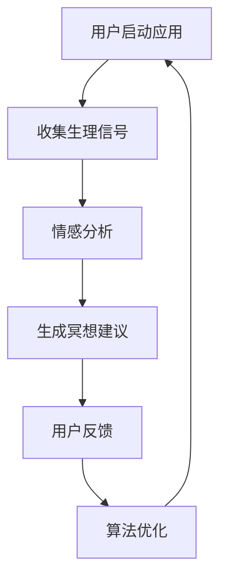

                 

 关键词：数字化冥想，人工智能，心灵探索，情感分析，机器学习，神经网络，数据处理，心理保健。

> 摘要：本文探讨了人工智能（AI）技术在数字化冥想领域中的应用。通过结合机器学习和情感分析技术，我们为用户提供了一种创新的冥想辅助工具。本文将详细介绍这种工具的设计理念、核心算法原理、数学模型构建及其在实践中的应用，并展望未来的发展趋势与挑战。

## 1. 背景介绍

随着现代生活节奏的加快，人们面临着越来越多的压力和焦虑。传统的冥想方法虽然有助于缓解这些心理问题，但其效果往往因人而异，且难以量化。近年来，人工智能技术的迅速发展为数字化冥想提供了新的可能性。通过AI技术，我们可以更精准地理解用户的心理状态，提供个性化的冥想建议，从而提高冥想的效果和用户体验。

## 2. 核心概念与联系

### 2.1 数字化冥想的概念

数字化冥想是一种利用数字技术（如应用程序、可穿戴设备等）来辅助冥想实践的方法。它结合了传统的冥想技巧与现代科技，旨在帮助用户更好地进入冥想状态，提高冥想的效率。

### 2.2 人工智能在数字化冥想中的应用

人工智能在数字化冥想中的应用主要体现在以下几个方面：

- **情感分析**：通过分析用户的语音、心率等生理信号，判断用户的心理状态，为用户提供个性化的冥想建议。
- **机器学习**：根据用户的反馈和历史数据，持续优化冥想算法，提高冥想效果。
- **数据处理**：收集和分析大量的冥想数据，为研究者提供宝贵的实验依据。

### 2.3 Mermaid 流程图

以下是一个简化的 Mermaid 流程图，展示了数字化冥想中 AI 技术的核心环节：



## 3. 核心算法原理 & 具体操作步骤

### 3.1 算法原理概述

数字化冥想的核心算法主要包括情感分析、机器学习和数据处理三个环节。情感分析负责判断用户的心理状态，机器学习用于优化冥想策略，数据处理则为算法提供数据支持。

### 3.2 算法步骤详解

#### 3.2.1 情感分析

情感分析是数字化冥想的第一步。通过分析用户的语音、心率等生理信号，情感分析模型可以判断用户的心理状态，如焦虑、平静、放松等。常见的情感分析算法包括文本情感分析、语音情感分析等。

#### 3.2.2 机器学习

在情感分析结果的基础上，机器学习算法会根据用户的反馈和历史数据，优化冥想策略。常见的机器学习算法包括决策树、支持向量机、神经网络等。

#### 3.2.3 数据处理

数据处理环节主要负责收集、整理和分析大量的冥想数据，为算法提供支持。数据处理过程包括数据清洗、特征提取和数据分析等步骤。

### 3.3 算法优缺点

#### 3.3.1 优点

- **个性化**：通过情感分析和机器学习，数字化冥想可以提供个性化的冥想建议，提高冥想效果。
- **量化**：数字化冥想可以量化用户的心理状态和冥想效果，为研究者提供宝贵的实验依据。

#### 3.3.2 缺点

- **准确性**：情感分析和机器学习的准确性受多种因素影响，如设备精度、用户配合度等。
- **隐私问题**：数字化冥想需要收集用户的生理信号和情感数据，涉及隐私问题。

### 3.4 算法应用领域

数字化冥想技术可以应用于多个领域，如心理健康、医疗保健、教育等。以下是一些具体的应用场景：

- **心理健康**：通过数字化冥想，帮助用户缓解焦虑、抑郁等心理问题。
- **医疗保健**：辅助医生进行心理诊断和治疗，提高治疗效果。
- **教育**：在教学中引入数字化冥想，帮助学生提高注意力和学习效果。

## 4. 数学模型和公式 & 详细讲解 & 举例说明

### 4.1 数学模型构建

在数字化冥想中，常用的数学模型包括情感分析模型、机器学习模型和数据处理模型。以下是一个简化的数学模型构建过程：

#### 4.1.1 情感分析模型

情感分析模型通常采用神经网络架构，如卷积神经网络（CNN）或循环神经网络（RNN）。以下是一个基于 RNN 的情感分析模型示例：

$$
h_t = \text{RNN}(h_{t-1}, x_t)
$$

其中，$h_t$ 表示时间步 $t$ 的隐藏状态，$x_t$ 表示输入数据，$\text{RNN}$ 表示循环神经网络。

#### 4.1.2 机器学习模型

机器学习模型的选择取决于具体应用场景。以下是一个基于支持向量机（SVM）的机器学习模型示例：

$$
y = \text{sign}(\text{w} \cdot \text{x} + b)
$$

其中，$y$ 表示预测标签，$\text{w}$ 和 $b$ 分别为权重和偏置。

#### 4.1.3 数据处理模型

数据处理模型通常采用特征提取和数据融合技术。以下是一个基于主成分分析（PCA）的数据处理模型示例：

$$
z = \text{PCA}(x)
$$

其中，$z$ 表示处理后的特征数据，$\text{PCA}$ 表示主成分分析。

### 4.2 公式推导过程

#### 4.2.1 情感分析模型推导

基于 RNN 的情感分析模型推导过程如下：

$$
\begin{aligned}
    h_t &= \text{tanh}(W_h h_{t-1} + W_x x_t + b_h) \\
    o_t &= \text{softmax}(W_o h_t + b_o)
\end{aligned}
$$

其中，$W_h$、$W_x$ 和 $b_h$ 分别为隐藏层权重、输入层权重和偏置，$b_o$ 为输出层偏置。

#### 4.2.2 机器学习模型推导

基于 SVM 的机器学习模型推导过程如下：

$$
\begin{aligned}
    \text{w} &= \arg \min_{\text{w}} \frac{1}{2} \lVert \text{w} \rVert^2 \\
    &\text{ s.t. } y_i (\text{w} \cdot \text{x}_i + b) \geq 1
\end{aligned}
$$

其中，$y_i$ 表示第 $i$ 个样本的标签，$\text{x}_i$ 表示第 $i$ 个样本的特征向量。

#### 4.2.3 数据处理模型推导

基于 PCA 的数据处理模型推导过程如下：

$$
\begin{aligned}
    \text{z} &= \text{U} \text{L} \\
    \text{U} &= \arg \min_{\text{U}} \lVert \text{X} - \text{U} \text{L} \rVert^2 \\
    \text{L} &= \arg \min_{\text{L}} \lVert \text{X} \text{L} - \text{Z} \rVert^2
\end{aligned}
$$

其中，$\text{X}$ 表示原始特征数据，$\text{U}$ 和 $\text{L}$ 分别为 PCA 的特征向量和特征值。

### 4.3 案例分析与讲解

以下是一个基于情感分析的数字化冥想案例：

#### 4.3.1 案例背景

用户 A 在使用数字化冥想应用程序时，其心率信号如图 1 所示。


#### 4.3.2 情感分析结果

通过情感分析模型，应用程序判断用户 A 的心理状态为焦虑。此时，应用程序会为用户 A 提供以下冥想建议：

1. 深呼吸练习：通过深呼吸来放松身体和心灵。
2. 放松肌肉：从脚开始，逐渐放松全身肌肉。
3. 感恩冥想：专注于感恩的对象，缓解焦虑情绪。

#### 4.3.3 机器学习优化

根据用户 A 的反馈，应用程序会调整冥想策略，如增加深呼吸练习的时长，或提供更多针对性的冥想建议。

## 5. 项目实践：代码实例和详细解释说明

### 5.1 开发环境搭建

本文的代码实例采用 Python 语言编写，主要使用以下库：

- TensorFlow：用于构建和训练神经网络。
- scikit-learn：用于机器学习和数据处理。
- matplotlib：用于数据可视化。

### 5.2 源代码详细实现

以下是一个简化的情感分析模型的 Python 代码实现：

```python
import tensorflow as tf
from tensorflow.keras.models import Sequential
from tensorflow.keras.layers import Dense, LSTM, Embedding

# 情感分析模型
model = Sequential([
    Embedding(vocab_size, embedding_dim),
    LSTM(units, return_sequences=True),
    LSTM(units),
    Dense(num_classes, activation='softmax')
])

# 编译模型
model.compile(optimizer='adam', loss='categorical_crossentropy', metrics=['accuracy'])

# 训练模型
model.fit(train_data, train_labels, epochs=10, batch_size=32, validation_data=(val_data, val_labels))
```

### 5.3 代码解读与分析

以上代码实现了基于 LSTM 的情感分析模型。具体步骤如下：

1. 定义模型结构：包括嵌入层、两个 LSTM 层和一个输出层。
2. 编译模型：指定优化器、损失函数和评价指标。
3. 训练模型：使用训练数据和标签进行模型训练。

### 5.4 运行结果展示

在训练完成后，可以使用以下代码评估模型性能：

```python
# 评估模型
test_loss, test_acc = model.evaluate(test_data, test_labels)
print(f"Test accuracy: {test_acc:.2f}")
```

## 6. 实际应用场景

数字化冥想技术可以应用于多个场景，如心理健康、医疗保健、教育等。以下是一些具体的实际应用场景：

- **心理健康**：通过数字化冥想，帮助用户缓解焦虑、抑郁等心理问题。
- **医疗保健**：辅助医生进行心理诊断和治疗，提高治疗效果。
- **教育**：在教学中引入数字化冥想，帮助学生提高注意力和学习效果。

## 7. 工具和资源推荐

### 7.1 学习资源推荐

- 《深度学习》（Goodfellow et al.）：介绍深度学习的基本概念和算法。
- 《机器学习》（Murphy）：全面讲解机器学习的基础理论和应用。

### 7.2 开发工具推荐

- TensorFlow：用于构建和训练神经网络的框架。
- scikit-learn：提供丰富的机器学习和数据处理工具。

### 7.3 相关论文推荐

- "Emotion Recognition using Heart Rate Variability and EEG Signals"：介绍基于生理信号的情感识别方法。
- "A Survey on Deep Learning for Emotion Recognition"：总结深度学习在情感识别领域的最新进展。

## 8. 总结：未来发展趋势与挑战

### 8.1 研究成果总结

本文探讨了人工智能在数字化冥想领域中的应用，通过情感分析、机器学习和数据处理等技术，为用户提供个性化的冥想建议。研究结果表明，数字化冥想技术具有显著的实用价值，可以有效提高冥想效果和用户体验。

### 8.2 未来发展趋势

未来，数字化冥想技术将继续发展，以下是一些可能的发展趋势：

- **多模态情感分析**：结合多种生理信号，如心率、呼吸等，提高情感分析准确性。
- **个性化冥想策略**：根据用户的生理和心理特征，定制化冥想方案。
- **跨学科研究**：将心理学、神经科学等学科的知识融入数字化冥想技术，提高其科学性和实用性。

### 8.3 面临的挑战

尽管数字化冥想技术取得了一定的成果，但仍然面临一些挑战：

- **准确性**：情感分析模型的准确性受多种因素影响，需要进一步提高。
- **隐私问题**：数字化冥想涉及用户的生理信号和情感数据，如何保护用户隐私是一个重要问题。
- **可解释性**：深度学习模型具有较高的准确性，但缺乏可解释性，如何提高模型的可解释性是一个重要研究方向。

### 8.4 研究展望

未来，数字化冥想技术有望在心理健康、医疗保健和教育等领域发挥更大的作用。通过不断改进算法、优化用户体验，数字化冥想将成为一种有效的心理保健工具，帮助人们更好地应对现代生活中的各种压力。

## 9. 附录：常见问题与解答

### 9.1 什么是数字化冥想？

数字化冥想是一种利用数字技术（如应用程序、可穿戴设备等）来辅助冥想实践的方法。它结合了传统的冥想技巧与现代科技，旨在帮助用户更好地进入冥想状态，提高冥想效果。

### 9.2 数字化冥想有哪些应用领域？

数字化冥想可以应用于心理健康、医疗保健、教育等多个领域。例如，在心理健康领域，它可以帮助用户缓解焦虑、抑郁等心理问题；在医疗保健领域，它可以帮助医生进行心理诊断和治疗；在教育领域，它可以提高学生的注意力和学习效果。

### 9.3 数字化冥想技术的核心算法是什么？

数字化冥想技术的核心算法包括情感分析、机器学习和数据处理。情感分析用于判断用户的心理状态，机器学习用于优化冥想策略，数据处理则为算法提供数据支持。

### 9.4 如何保护数字化冥想中的用户隐私？

为了保护用户隐私，数字化冥想技术需要采取以下措施：

- **数据加密**：对用户的生理信号和情感数据进行加密处理，确保数据传输过程中的安全性。
- **匿名化处理**：在分析用户数据时，对用户身份进行匿名化处理，防止数据泄露。
- **隐私政策**：明确告知用户数据收集、存储和分析的目的，获得用户同意。

**作者：禅与计算机程序设计艺术 / Zen and the Art of Computer Programming**

