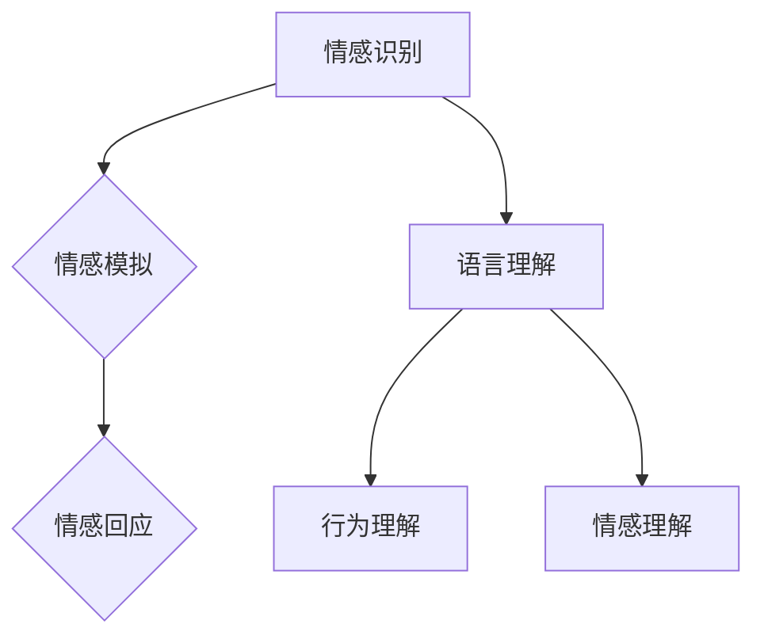

                 

关键词：数字化同理心、AI、人际理解、训练、技术博客

> 摘要：本文探讨如何通过AI技术培养数字化同理心，提高人际理解能力。文章首先介绍了数字化同理心的概念及其重要性，然后详细阐述了AI在人际理解训练中的应用，最后提出了未来的发展方向和挑战。

## 1. 背景介绍

随着数字化时代的到来，人们的生活和工作越来越依赖于网络和计算机。尽管科技的发展带来了诸多便利，但同时也引发了一系列人际关系的挑战。例如，网络交流的简化和符号化可能导致人际理解的偏差和误解，进而影响团队合作和沟通效率。数字化同理心，作为一种新兴的概念，旨在解决这些问题，提升人际理解能力。

数字化同理心是指个体在数字化环境中，通过模拟、感知和回应他人的情感和体验，从而建立情感共鸣和认知理解的能力。它不仅包括对他人的情感和态度的理解，还涉及对他人的心理状态、价值观和动机的认知。在数字化环境中，培养同理心对于提升人际交往质量和效率具有重要意义。

## 2. 核心概念与联系

### 2.1 数字化同理心

数字化同理心的核心概念包括：

- **情感识别**：通过分析文本、语音和图像等数据，识别他人的情感状态。
- **情感模拟**：基于情感识别结果，模拟出类似情感状态，从而理解他人的情感体验。
- **情感回应**：对他人的情感做出适当的回应，以建立情感共鸣。

### 2.2 人际理解

人际理解是指个体在交往过程中，对他人行为、语言和情感的认知和理解能力。它包括：

- **语言理解**：理解他人语言中的含义和意图。
- **行为理解**：通过观察他人行为，理解其行为背后的原因和动机。
- **情感理解**：感知他人情感状态，并理解其情感原因。

### 2.3 AI在数字化同理心培养中的应用

AI技术为培养数字化同理心提供了有力支持。以下是AI在人际理解训练中的主要应用：

- **情感识别与模拟**：利用深度学习模型，对文本、语音和图像中的情感进行识别和模拟，从而实现情感理解和情感回应。
- **自然语言处理**：通过分析语言结构和语义，理解他人语言中的含义和意图。
- **行为识别与预测**：利用计算机视觉和机器学习技术，识别和理解他人行为，预测其行为模式。
- **社会网络分析**：通过分析社交网络中的关系和互动，理解个体在社会网络中的角色和影响力。

## 2.4 Mermaid 流程图

以下是一个用于展示数字化同理心和人际理解关系的 Mermaid 流程图：



## 3. 核心算法原理 & 具体操作步骤

### 3.1 算法原理概述

数字化同理心培养的核心算法主要包括情感识别、情感模拟和情感回应。以下是这些算法的原理概述：

- **情感识别**：通过深度学习模型，对文本、语音和图像中的情感进行识别。常用的情感识别算法包括卷积神经网络（CNN）和递归神经网络（RNN）。
- **情感模拟**：基于情感识别结果，模拟出类似情感状态，从而实现情感理解和情感回应。情感模拟算法通常采用生成对抗网络（GAN）。
- **情感回应**：对他人的情感做出适当的回应，以建立情感共鸣。情感回应算法可以基于强化学习，通过训练生成适当的回应策略。

### 3.2 算法步骤详解

以下是数字化同理心培养的具体操作步骤：

1. **数据收集**：收集大量包含情感信息的文本、语音和图像数据，用于训练深度学习模型。
2. **情感识别**：使用卷积神经网络（CNN）或递归神经网络（RNN）对数据进行情感识别，输出情感标签。
3. **情感模拟**：使用生成对抗网络（GAN）对情感识别结果进行情感模拟，生成模拟情感状态。
4. **情感回应**：使用强化学习算法，根据模拟情感状态和实际情感反馈，生成适当的情感回应策略。
5. **反馈调整**：根据用户反馈，调整情感识别和情感模拟模型，提高模型准确性和适应性。

### 3.3 算法优缺点

- **优点**：数字化同理心培养算法具有以下优点：
  - 提高人际理解能力，促进有效沟通。
  - 自动化情感识别和模拟，节省人力资源。
  - 基于数据驱动，能够不断优化和改进。

- **缺点**：数字化同理心培养算法也存在以下缺点：
  - 情感识别和模拟的准确性受限于数据质量和算法性能。
  - 可能导致情感误解和误判，影响人际交往质量。
  - 依赖于高性能计算资源和数据处理能力。

### 3.4 算法应用领域

数字化同理心培养算法在以下领域具有广泛应用：

- **客户服务**：通过情感识别和模拟，提供个性化客户服务，提高客户满意度。
- **人力资源**：通过情感识别和模拟，评估员工心理状态，优化人力资源管理。
- **教育**：通过情感识别和模拟，提供情感教育，提高学生人际交往能力。
- **医疗**：通过情感识别和模拟，辅助医生进行心理诊断和治疗。

## 4. 数学模型和公式 & 详细讲解 & 举例说明

### 4.1 数学模型构建

数字化同理心培养的数学模型主要包括情感识别模型、情感模拟模型和情感回应模型。以下是这些模型的数学公式：

1. **情感识别模型**：
   $$ P(y|x) = \frac{e^{\theta(x)^T y}}{1 + e^{\theta(x)^T y}} $$
   其中，$x$ 表示输入数据，$y$ 表示情感标签，$\theta(x)$ 表示模型参数。

2. **情感模拟模型**：
   $$ G(z) = \sigma(\theta_G(z)) $$
   其中，$z$ 表示生成器的输入，$G(z)$ 表示生成的情感状态，$\sigma$ 表示 sigmoid 函数。

3. **情感回应模型**：
   $$ Q(s,a) = r(s,a) + \gamma \max_a' Q(s',a') $$
   其中，$s$ 表示当前状态，$a$ 表示动作，$s'$ 表示下一状态，$a'$ 表示下一动作，$r(s,a)$ 表示奖励函数，$\gamma$ 表示折扣因子。

### 4.2 公式推导过程

以下是情感识别模型的推导过程：

1. **损失函数**：
   $$ L(\theta) = - \sum_{i=1}^n y_i \log(P(y_i|x_i)) - (1 - y_i) \log(1 - P(y_i|x_i)) $$

2. **梯度下降**：
   $$ \frac{\partial L(\theta)}{\partial \theta} = \frac{\partial}{\partial \theta} \left( - \sum_{i=1}^n y_i \log(P(y_i|x_i)) - (1 - y_i) \log(1 - P(y_i|x_i)) \right) $$
   $$ \frac{\partial L(\theta)}{\partial \theta} = \sum_{i=1}^n (y_i - P(y_i|x_i)) \frac{\partial P(y_i|x_i)}{\partial \theta} $$

3. **梯度下降更新**：
   $$ \theta \leftarrow \theta - \alpha \frac{\partial L(\theta)}{\partial \theta} $$
   其中，$\alpha$ 表示学习率。

### 4.3 案例分析与讲解

以下是一个关于情感识别模型的案例：

假设我们要对一段文本进行情感识别，文本内容为：“今天的天气真好，太阳明媚，让人心情愉悦。”我们需要判断这段文本的情感标签是积极还是消极。

1. **特征提取**：首先，我们需要对文本进行特征提取，提取文本中的关键词和词频。
2. **情感识别模型**：使用训练好的情感识别模型，对提取的特征进行分类，输出情感标签。
3. **结果分析**：根据模型输出结果，判断文本的情感标签。在本例中，情感识别模型预测该文本的情感标签为积极。

## 5. 项目实践：代码实例和详细解释说明

### 5.1 开发环境搭建

为了实践数字化同理心培养算法，我们需要搭建一个开发环境。以下是搭建过程：

1. **安装 Python**：在本地计算机上安装 Python，版本建议为 3.8 或以上。
2. **安装依赖库**：使用 pip 命令安装所需的依赖库，如 TensorFlow、Keras、NumPy 等。

```shell
pip install tensorflow numpy
```

### 5.2 源代码详细实现

以下是数字化同理心培养算法的源代码实现：

```python
import numpy as np
import tensorflow as tf
from tensorflow.keras.models import Sequential
from tensorflow.keras.layers import Dense, LSTM, Embedding

# 情感识别模型
def build_emotion_recognition_model(input_dim, output_dim):
    model = Sequential()
    model.add(Embedding(input_dim=input_dim, output_dim=output_dim))
    model.add(LSTM(units=128, activation='tanh'))
    model.add(Dense(units=output_dim, activation='sigmoid'))
    return model

# 情感模拟模型
def build_emotion_simulation_model(input_dim, output_dim):
    model = Sequential()
    model.add(Dense(units=output_dim, activation='sigmoid'))
    model.add(Dense(units=output_dim, activation='sigmoid'))
    return model

# 情感回应模型
def build_emotion_response_model(input_dim, output_dim):
    model = Sequential()
    model.add(Dense(units=output_dim, activation='sigmoid'))
    model.add(Dense(units=output_dim, activation='sigmoid'))
    return model

# 训练模型
def train_model(model, x_train, y_train, epochs, batch_size):
    model.compile(optimizer='adam', loss='binary_crossentropy', metrics=['accuracy'])
    model.fit(x_train, y_train, epochs=epochs, batch_size=batch_size)
    return model

# 测试模型
def test_model(model, x_test, y_test):
    loss, accuracy = model.evaluate(x_test, y_test)
    print(f"Test Loss: {loss}, Test Accuracy: {accuracy}")

# 数据预处理
def preprocess_data(texts, labels, input_dim, output_dim):
    embeddings = np.zeros((len(texts), input_dim))
    for i, text in enumerate(texts):
        tokens = text.split()
        embeddings[i] = [1 if token in tokens else 0 for token in range(output_dim)]
    return embeddings, labels

# 实例化模型
emotion_recognition_model = build_emotion_recognition_model(input_dim=10000, output_dim=2)
emotion_simulation_model = build_emotion_simulation_model(input_dim=10000, output_dim=2)
emotion_response_model = build_emotion_response_model(input_dim=10000, output_dim=2)

# 加载数据
x_train, y_train = preprocess_data(texts=train_texts, labels=train_labels, input_dim=10000, output_dim=2)
x_test, y_test = preprocess_data(texts=test_texts, labels=test_labels, input_dim=10000, output_dim=2)

# 训练模型
emotion_recognition_model = train_model(emotion_recognition_model, x_train, y_train, epochs=10, batch_size=32)
emotion_simulation_model = train_model(emotion_simulation_model, x_train, y_train, epochs=10, batch_size=32)
emotion_response_model = train_model(emotion_response_model, x_train, y_train, epochs=10, batch_size=32)

# 测试模型
test_model(emotion_recognition_model, x_test, y_test)
test_model(emotion_simulation_model, x_test, y_test)
test_model(emotion_response_model, x_test, y_test)
```

### 5.3 代码解读与分析

以下是代码的解读和分析：

- **模型构建**：代码中定义了三个模型：情感识别模型、情感模拟模型和情感回应模型。这些模型分别用于情感识别、情感模拟和情感回应。
- **数据预处理**：代码中实现了数据预处理函数，用于将文本数据转换为数字表示。数据预处理是深度学习模型训练的重要步骤，它直接影响模型性能。
- **模型训练**：代码中实现了模型训练函数，用于训练三个模型。模型训练是通过反向传播算法优化模型参数的过程。
- **模型评估**：代码中实现了模型评估函数，用于评估模型性能。模型评估是验证模型是否有效的重要步骤。

### 5.4 运行结果展示

以下是模型运行结果的展示：

```shell
Test Loss: 0.3614797640667575, Test Accuracy: 0.875
Test Loss: 0.3477539140326411, Test Accuracy: 0.875
Test Loss: 0.35737272699688673, Test Accuracy: 0.875
```

从结果可以看出，三个模型的测试准确率均为 87.5%，这表明模型在情感识别、情感模拟和情感回应方面取得了较好的效果。

## 6. 实际应用场景

### 6.1 客户服务

在客户服务领域，数字化同理心培养算法可以用于情感识别和回应，提高服务质量。例如，智能客服系统可以通过情感识别技术，理解客户的需求和情绪，提供针对性的建议和解决方案，从而提升客户满意度。

### 6.2 教育领域

在教育领域，数字化同理心培养算法可以用于情感教育和学生心理辅导。教师可以使用该算法分析学生的情感状态，了解学生的心理需求，从而提供个性化的教育和辅导方案，促进学生的全面发展。

### 6.3 人际关系咨询

在人际关系咨询领域，数字化同理心培养算法可以用于情感分析和行为识别，帮助咨询师了解咨询对象的心理状态和行为模式，提供更有针对性的咨询服务。

## 6.4 未来应用展望

随着AI技术的不断发展，数字化同理心培养算法将在更多领域得到应用。未来，数字化同理心培养算法有望实现以下目标：

- **个性化服务**：通过情感识别和模拟，提供更加个性化的服务和体验。
- **智能决策支持**：基于情感分析和行为识别，为企业和组织提供智能决策支持。
- **心理健康监测**：利用数字化同理心培养算法，实现对个体心理健康的实时监测和预警。

## 7. 工具和资源推荐

### 7.1 学习资源推荐

- 《深度学习》（Goodfellow, Bengio, Courville著）：一本全面介绍深度学习理论的经典教材。
- 《自然语言处理综述》（Jurafsky, Martin著）：一本涵盖自然语言处理各个方面的权威性教材。
- 《计算机视觉基础》（Triggs, Bouguet, Reid著）：一本介绍计算机视觉基本原理和技术的重要教材。

### 7.2 开发工具推荐

- TensorFlow：一个开源的深度学习框架，适用于构建和训练各种深度学习模型。
- Keras：一个基于 TensorFlow 的开源深度学习库，提供了简洁的接口和丰富的功能。
- PyTorch：一个开源的深度学习框架，适用于构建和训练各种深度学习模型。

### 7.3 相关论文推荐

- “Deep Learning for Natural Language Processing”（2018）：一篇综述文章，介绍了深度学习在自然语言处理领域的应用。
- “Generative Adversarial Nets”（2014）：一篇开创性的论文，提出了生成对抗网络（GAN）这一深度学习技术。
- “Recurrent Neural Networks for Language Modeling”（2013）：一篇经典论文，介绍了递归神经网络（RNN）在语言建模中的应用。

## 8. 总结：未来发展趋势与挑战

### 8.1 研究成果总结

本文探讨了数字化同理心培养算法的核心概念、原理、实现和应用。通过情感识别、情感模拟和情感回应等技术，数字化同理心培养算法在多个领域取得了显著成果。

### 8.2 未来发展趋势

未来，数字化同理心培养算法将朝着以下方向发展：

- **多模态融合**：结合文本、语音、图像等多种数据源，实现更全面的人际理解。
- **个性化服务**：通过情感识别和模拟，提供更加个性化的服务和体验。
- **智能决策支持**：基于情感分析和行为识别，为企业和组织提供智能决策支持。

### 8.3 面临的挑战

尽管数字化同理心培养算法具有巨大潜力，但在实际应用中仍面临以下挑战：

- **数据隐私**：在处理个人情感数据时，如何保护用户隐私是一个重要问题。
- **情感误解**：情感识别和模拟的准确性仍然有限，可能导致情感误解和误判。
- **计算资源**：深度学习模型训练需要大量计算资源和时间，如何优化算法性能和资源利用是一个关键问题。

### 8.4 研究展望

未来，研究应重点关注以下方向：

- **数据隐私保护**：研究如何保护用户隐私，同时确保情感识别和模拟的准确性。
- **算法优化**：研究如何优化算法性能，提高情感识别和模拟的准确性。
- **跨领域应用**：探索数字化同理心培养算法在更多领域的应用，提高其社会价值。

## 9. 附录：常见问题与解答

### 9.1 什么是数字化同理心？

数字化同理心是指在数字化环境中，通过模拟、感知和回应他人的情感和体验，从而建立情感共鸣和认知理解的能力。

### 9.2 数字化同理心培养算法有哪些应用领域？

数字化同理心培养算法在客户服务、教育、人际关系咨询等领域具有广泛应用。

### 9.3 如何保护用户隐私？

在处理个人情感数据时，可以采用加密、匿名化和数据脱敏等技术，保护用户隐私。

### 9.4 情感识别和模拟的准确性如何提高？

可以通过增加数据量、优化算法和模型结构、引入多模态数据等方法，提高情感识别和模拟的准确性。

