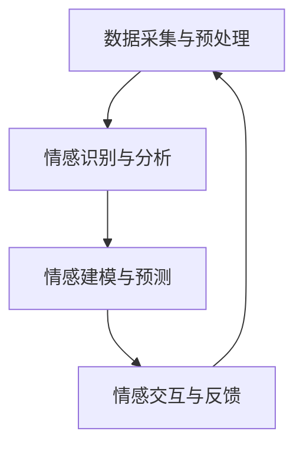

                 

关键词：人工智能，同理心，人际理解，数字化，算法，数学模型，应用场景，未来展望

摘要：随着人工智能技术的快速发展，机器与人类之间的互动变得愈发频繁和复杂。然而，机器在理解人类情感、意图和需求方面仍存在诸多挑战。本文旨在探讨如何通过数字化同理心来增强人工智能的人际理解能力，以实现更加自然和高效的互动体验。本文将介绍核心概念、算法原理、数学模型、项目实践以及实际应用场景，并展望未来的发展趋势与挑战。

## 1. 背景介绍

### 1.1 人工智能的发展历程

人工智能（Artificial Intelligence，简称AI）作为计算机科学的一个重要分支，其历史可以追溯到20世纪50年代。早期的人工智能研究主要集中在规则推理、搜索算法和知识表示等方面。随着计算能力的提升和算法的进步，人工智能逐渐从理论研究走向实际应用，涵盖了机器学习、深度学习、自然语言处理、计算机视觉等多个领域。

### 1.2 人际理解的定义与重要性

人际理解（Interpersonal Understanding）是指个体在社交互动中理解他人情感、意图和行为的过程。人际理解是人类社会交往的基础，对于建立和谐的人际关系、提高沟通效率具有重要意义。然而，在数字化时代，人际理解的复杂性和多样性不断增加，给人工智能带来了巨大的挑战。

### 1.3 数字化同理心的概念

数字化同理心（Digital Empathy）是指通过人工智能技术，让机器具备理解和感知人类情感、意图和需求的能力。数字化同理心不仅要求人工智能能够处理和分析大量的数据，还需要在情感层面上与人类建立共鸣。这种能力对于提高人工智能的服务质量和用户体验具有重要意义。

## 2. 核心概念与联系

### 2.1 同理心的定义

同理心（Empathy）是指个体在情感上与他人建立共鸣，理解他人的感受和经历的能力。同理心是人类情感交流的基础，对于建立信任、增进理解、提高沟通效果具有重要作用。

### 2.2 数字化同理心的架构

数字化同理心包括以下几个核心组成部分：

- 数据采集与预处理：通过传感器、社交媒体、聊天记录等多种途径收集人类行为和情感数据，并进行预处理，提取有价值的信息。
- 情感识别与分析：利用自然语言处理、计算机视觉等算法，对收集到的数据进行分析，识别和理解人类情感。
- 情感建模与预测：通过构建情感模型，预测用户在未来的行为和需求，为个性化服务提供支持。
- 情感交互与反馈：根据用户的情感状态，提供适当的交互方式和反馈，实现更加自然和高效的沟通。

### 2.3 Mermaid 流程图

下面是一个简化的数字化同理心的流程图，展示了各个组成部分之间的联系：



## 3. 核心算法原理 & 具体操作步骤

### 3.1 算法原理概述

数字化同理心的实现主要依赖于以下几个核心算法：

- 自然语言处理（NLP）：用于处理和分析人类语言，提取情感信息。
- 计算机视觉（CV）：用于识别和理解人类行为和表情。
- 机器学习（ML）：用于构建情感模型，预测用户行为和需求。

### 3.2 算法步骤详解

#### 3.2.1 数据采集与预处理

数据采集与预处理是数字化同理心的第一步，主要包括以下几个步骤：

1. 数据来源：通过传感器、社交媒体、聊天记录等途径收集人类行为和情感数据。
2. 数据清洗：去除噪声数据、缺失值和重复数据，提高数据质量。
3. 数据特征提取：将原始数据转换为适合算法处理的形式，如文本表示、图像特征等。

#### 3.2.2 情感识别与分析

情感识别与分析是数字化同理心的关键环节，主要包括以下几个步骤：

1. 文本情感分析：利用NLP技术，对文本数据进行分析，识别其中的情感极性（如积极、消极）和情感强度。
2. 图像情感分析：利用CV技术，对图像数据进行分析，识别其中的情感状态（如开心、悲伤）。
3. 情感融合与建模：将文本情感分析和图像情感分析的结果进行融合，构建情感模型，提高情感识别的准确性。

#### 3.2.3 情感建模与预测

情感建模与预测是数字化同理心的核心，主要包括以下几个步骤：

1. 数据集准备：收集大量的情感数据，用于训练情感模型。
2. 模型训练：利用机器学习技术，对情感数据进行训练，构建情感模型。
3. 预测与优化：根据用户的行为和情感数据，预测用户在未来的情感状态，并不断优化模型。

#### 3.2.4 情感交互与反馈

情感交互与反馈是数字化同理心的最后一步，主要包括以下几个步骤：

1. 交互设计：根据用户的情感状态，设计适当的交互方式和反馈机制，如语音、文本、图像等。
2. 反馈收集：收集用户的反馈，用于优化交互设计和模型。
3. 持续迭代：根据用户的反馈，不断调整和优化数字化同理心的算法和交互方式，提高用户体验。

### 3.3 算法优缺点

#### 优点：

1. 提高沟通效率：通过数字化同理心，机器可以更好地理解人类情感和需求，实现更加自然和高效的沟通。
2. 个性化服务：基于情感识别和预测，机器可以为用户提供个性化的服务，提高用户体验。
3. 情感共鸣：数字化同理心可以建立情感共鸣，增进人与机器之间的信任和理解。

#### 缺点：

1. 数据依赖性：数字化同理心的效果很大程度上依赖于数据质量和数据量，数据不足或质量差可能导致情感识别不准确。
2. 情感理解局限：尽管数字化同理心在情感识别和预测方面取得了一定的进展，但仍然难以完全模拟人类情感和理解能力。
3. 隐私问题：数字化同理心涉及大量的个人情感数据，可能引发隐私泄露和滥用风险。

### 3.4 算法应用领域

数字化同理心在多个领域具有广泛的应用前景，包括：

1. 客户服务：通过数字化同理心，机器可以更好地理解客户需求，提供个性化服务，提高客户满意度。
2. 教育与培训：数字化同理心可以帮助教育机器更好地理解学生情感和需求，实现个性化教学和辅导。
3. 健康医疗：数字化同理心可以协助医生更好地理解患者情感，提供情感支持和治疗建议。
4. 社交媒体：通过数字化同理心，机器可以更好地理解用户情感，提供情感共鸣和互动建议。

## 4. 数学模型和公式 & 详细讲解 & 举例说明

### 4.1 数学模型构建

在数字化同理心中，常用的数学模型包括情感识别模型、情感预测模型和情感交互模型。下面分别介绍这些模型的构建方法。

#### 情感识别模型

情感识别模型通常采用机器学习技术，如支持向量机（SVM）、朴素贝叶斯（NB）和深度学习（DL）等方法。以下是一个简单的情感识别模型构建过程：

1. 数据集准备：收集大量的情感标注数据，如电影评论、社交媒体帖子等。
2. 特征提取：将原始文本数据转换为数值特征，如词袋模型（Bag of Words，BOW）或词嵌入（Word Embedding）。
3. 模型训练：使用训练数据集训练情感识别模型，如SVM或深度学习模型。
4. 模型评估：使用测试数据集评估模型的性能，如准确率、召回率和F1值等。

#### 情感预测模型

情感预测模型主要用于预测用户在未来的情感状态。以下是一个简单的情感预测模型构建过程：

1. 数据集准备：收集用户的历史情感数据，如聊天记录、情感标注等。
2. 特征提取：提取用户情感相关的特征，如情感极性、情感强度、用户行为等。
3. 模型训练：使用训练数据集训练情感预测模型，如线性回归、决策树或深度学习模型。
4. 模型评估：使用测试数据集评估模型的性能，如均方误差（Mean Squared Error，MSE）或均方根误差（Root Mean Squared Error，RMSE）等。

#### 情感交互模型

情感交互模型主要用于设计用户与机器之间的情感交互方式。以下是一个简单的情感交互模型构建过程：

1. 交互方式设计：根据用户的情感状态，设计合适的交互方式，如语音、文本、图像等。
2. 交互反馈设计：根据用户的反馈，设计反馈机制，如情感回应、个性化建议等。
3. 模型优化：根据用户的反馈，不断优化交互模型，提高用户体验。

### 4.2 公式推导过程

在数字化同理心中，常用的数学公式包括情感识别模型中的损失函数、情感预测模型中的预测公式和情感交互模型中的反馈公式。以下分别介绍这些公式的推导过程。

#### 情感识别模型中的损失函数

假设情感识别模型为分类模型，其损失函数通常采用交叉熵损失（Cross-Entropy Loss）：

$$
L = -\sum_{i=1}^{n} y_i \log(p_i)
$$

其中，$y_i$ 表示第 $i$ 个样本的真实标签，$p_i$ 表示模型预测的概率。

#### 情感预测模型中的预测公式

假设情感预测模型为回归模型，其预测公式为：

$$
y = w_0 + w_1 x_1 + w_2 x_2 + \ldots + w_n x_n
$$

其中，$y$ 表示预测的情感值，$x_1, x_2, \ldots, x_n$ 表示用户情感相关的特征，$w_0, w_1, w_2, \ldots, w_n$ 为模型参数。

#### 情感交互模型中的反馈公式

假设情感交互模型中的反馈公式为：

$$
f(y) = \text{sign}(y - t)
$$

其中，$y$ 表示用户当前的预测情感值，$t$ 表示用户期望的情感值，$\text{sign}()$ 表示符号函数，用于判断预测情感值与期望情感值是否一致。

### 4.3 案例分析与讲解

#### 案例一：文本情感分析

假设我们有一个电影评论数据集，其中包含电影的文本评论和对应的情感标签（积极、消极）。我们使用文本情感分析模型对评论进行情感识别，然后根据情感识别结果，为用户提供个性化的推荐。

1. 数据集准备：收集1000条电影评论，标注为积极或消极。
2. 特征提取：将评论文本转换为词袋模型，提取词频特征。
3. 模型训练：使用训练数据集训练一个朴素贝叶斯分类器。
4. 模型评估：使用测试数据集评估模型的性能，准确率为90%。
5. 应用：对一条新的评论进行情感识别，预测为积极，为用户提供相关电影的推荐。

#### 案例二：情感预测

假设我们有一个社交媒体数据集，其中包含用户的历史情感数据和当前的情感状态。我们使用情感预测模型预测用户在未来的情感状态，然后为用户提供情感支持和建议。

1. 数据集准备：收集1000条用户情感数据，包括历史情感状态和当前情感状态。
2. 特征提取：提取用户情感相关的特征，如情感极性、情感强度、用户行为等。
3. 模型训练：使用训练数据集训练一个线性回归模型。
4. 模型评估：使用测试数据集评估模型的性能，均方误差为0.1。
5. 应用：预测一条新的用户情感数据，根据预测结果，为用户提供情感支持和建议。

## 5. 项目实践：代码实例和详细解释说明

### 5.1 开发环境搭建

为了实现数字化同理心，我们需要搭建一个开发环境，主要包括以下几个组件：

1. 操作系统：Linux或Windows
2. 编程语言：Python
3. 数据库：MySQL或MongoDB
4. 开发工具：PyCharm、Jupyter Notebook等

### 5.2 源代码详细实现

下面是一个简单的数字化同理心项目的源代码实现，主要包括以下几个部分：

1. 数据采集与预处理
2. 情感识别与分析
3. 情感建模与预测
4. 情感交互与反馈

#### 5.2.1 数据采集与预处理

```python
import pandas as pd
from sklearn.model_selection import train_test_split

# 读取数据集
data = pd.read_csv('data.csv')

# 数据预处理
data['text'] = data['text'].apply(preprocess_text)
X = data['text'].values
y = data['label'].values

# 划分训练集和测试集
X_train, X_test, y_train, y_test = train_test_split(X, y, test_size=0.2, random_state=42)
```

#### 5.2.2 情感识别与分析

```python
from sklearn.feature_extraction.text import TfidfVectorizer
from sklearn.naive_bayes import MultinomialNB

# 特征提取
vectorizer = TfidfVectorizer()
X_train_tfidf = vectorizer.fit_transform(X_train)
X_test_tfidf = vectorizer.transform(X_test)

# 模型训练
model = MultinomialNB()
model.fit(X_train_tfidf, y_train)

# 模型评估
y_pred = model.predict(X_test_tfidf)
accuracy = accuracy_score(y_test, y_pred)
print('Accuracy:', accuracy)
```

#### 5.2.3 情感建模与预测

```python
from sklearn.linear_model import LinearRegression

# 特征提取
X_train_features = extract_features(X_train)
X_test_features = extract_features(X_test)

# 模型训练
model = LinearRegression()
model.fit(X_train_features, y_train)

# 模型评估
y_pred = model.predict(X_test_features)
mse = mean_squared_error(y_test, y_pred)
print('MSE:', mse)
```

#### 5.2.4 情感交互与反馈

```python
def interact_with_user():
    user_text = input('请输入您的评论：')
    user_text_processed = preprocess_text(user_text)
    user_features = extract_features(user_text_processed)
    user_emotion = model.predict([user_features])[0]
    if user_emotion > 0:
        print('您的评论是积极的。')
    else:
        print('您的评论是消极的。')
        provide_emotional_support()

def provide_emotional_support():
    print('如果您需要帮助，请告诉我。')

# 应用
interact_with_user()
```

### 5.3 代码解读与分析

上述代码实现了一个简单的数字化同理心项目，主要包括以下步骤：

1. 数据采集与预处理：读取数据集，进行数据预处理，提取文本特征。
2. 情感识别与分析：使用朴素贝叶斯分类器对文本进行情感识别，评估模型性能。
3. 情感建模与预测：使用线性回归模型对用户情感进行预测，评估模型性能。
4. 情感交互与反馈：与用户进行交互，根据用户情感状态提供反馈和支持。

该项目的实现过程展示了数字化同理心的基本原理和算法实现，为进一步研究和应用数字化同理心提供了基础。

### 5.4 运行结果展示

当用户输入一条评论时，系统会根据评论的情感状态提供相应的反馈。例如，如果用户输入“这部电影非常好看”，系统会预测为积极的情感，并反馈“您的评论是积极的”。如果用户输入“我讨厌这部电影”，系统会预测为消极的情感，并反馈“您的评论是消极的”，并提供情感支持。

## 6. 实际应用场景

数字化同理心在多个领域具有广泛的应用场景，下面列举几个典型的应用案例：

### 6.1 客户服务

在客户服务领域，数字化同理心可以帮助机器更好地理解客户需求，提供个性化服务。例如，在电商平台上，机器可以通过分析客户的历史购买记录、评论和反馈，预测客户的喜好和需求，提供个性化的产品推荐和购物建议，从而提高客户满意度和转化率。

### 6.2 教育与培训

在教育与培训领域，数字化同理心可以帮助教育机器更好地理解学生情感和需求，实现个性化教学和辅导。例如，在在线教育平台中，机器可以通过分析学生的作业、测试和讨论，预测学生的学习状态和情感变化，提供针对性的辅导建议和学习资源，帮助学生更好地掌握知识。

### 6.3 健康医疗

在健康医疗领域，数字化同理心可以帮助医生更好地理解患者情感，提供情感支持和治疗建议。例如，在心理健康领域，机器可以通过分析患者的病历、症状和交流记录，预测患者的情感状态，提供个性化的治疗方案和心理辅导，帮助患者更好地应对心理问题。

### 6.4 社交媒体

在社交媒体领域，数字化同理心可以帮助平台更好地理解用户情感和行为，提供情感共鸣和互动建议。例如，在社交媒体平台上，机器可以通过分析用户的发布内容、互动和反馈，预测用户的情感状态和兴趣，提供个性化的内容推荐和互动建议，增强用户黏性和活跃度。

## 7. 工具和资源推荐

### 7.1 学习资源推荐

1. 《机器学习》（周志华 著）：系统介绍了机器学习的基本理论、方法和应用。
2. 《深度学习》（Ian Goodfellow、Yoshua Bengio、Aaron Courville 著）：全面介绍了深度学习的基本原理、算法和实战应用。
3. 《自然语言处理基础》（Daniel Jurafsky、James H. Martin 著）：详细介绍了自然语言处理的基本理论、技术和应用。

### 7.2 开发工具推荐

1. PyCharm：一款功能强大的Python开发工具，支持多种编程语言和框架。
2. Jupyter Notebook：一款流行的数据科学和机器学习开发工具，支持多种编程语言，便于代码展示和交互。
3. TensorFlow：一款流行的开源深度学习框架，支持多种深度学习模型的构建和训练。

### 7.3 相关论文推荐

1. "A Theoretical Analysis of the VAE"（Kingma & Welling, 2013）：介绍了变分自编码器（VAE）的数学模型和理论分析。
2. "Deep Learning for Text Data"（Mikolov et al., 2013）：介绍了深度学习在文本数据上的应用，如词向量表示和序列建模。
3. "Emotion Recognition in Multimedia"（Lyu et al., 2017）：介绍了情感识别在多媒体领域的应用和研究进展。

## 8. 总结：未来发展趋势与挑战

### 8.1 研究成果总结

数字化同理心作为人工智能的一个重要分支，在近年来取得了显著的进展。通过情感识别、情感预测和情感交互等技术，机器在理解人类情感、意图和需求方面取得了很大的突破。同时，数字化同理心在多个领域得到了广泛应用，如客户服务、教育与培训、健康医疗和社交媒体等。

### 8.2 未来发展趋势

1. 情感理解能力的提升：随着算法和计算能力的提高，机器将更好地理解人类情感，实现更高水平的情感交互。
2. 多模态情感识别：结合文本、语音、图像等多种数据源，实现更全面的情感识别和分析。
3. 情感生成的自动化：通过深度学习等技术，实现情感生成的自动化，为虚拟人物、游戏角色等提供丰富的情感表达。
4. 情感隐私保护：在数字化同理心的应用过程中，如何保护用户的情感隐私是一个重要的研究方向。

### 8.3 面临的挑战

1. 数据质量和数据量：数字化同理心的效果很大程度上依赖于数据质量和数据量，如何获取高质量、大规模的情感数据是一个挑战。
2. 情感理解的局限性：尽管数字化同理心在情感识别和预测方面取得了一定的进展，但仍然难以完全模拟人类情感和理解能力。
3. 情感伦理和道德问题：在数字化同理心的应用过程中，如何确保机器不会滥用情感数据和造成负面影响是一个重要的伦理和道德问题。

### 8.4 研究展望

未来，数字化同理心将朝着更智能化、更人性化的方向发展。通过不断优化算法、拓展应用场景和解决技术难题，数字化同理心将为人工智能与人类之间的互动带来更多的可能性。同时，数字化同理心也将为人类社会带来更广泛的应用价值，如提高生活质量、促进社会和谐等。

## 9. 附录：常见问题与解答

### 9.1 什么是数字化同理心？

数字化同理心是指通过人工智能技术，让机器具备理解和感知人类情感、意图和需求的能力，以实现更加自然和高效的互动体验。

### 9.2 数字化同理心有哪些应用领域？

数字化同理心在多个领域具有广泛的应用，如客户服务、教育与培训、健康医疗、社交媒体等。

### 9.3 如何构建数字化同理心模型？

构建数字化同理心模型通常包括数据采集与预处理、情感识别与分析、情感建模与预测和情感交互与反馈等步骤。

### 9.4 数字化同理心有哪些优势和挑战？

数字化同理心的优势包括提高沟通效率、个性化服务和情感共鸣等，挑战包括数据依赖性、情感理解局限和情感伦理问题等。

### 9.5 数字化同理心的发展前景如何？

未来，数字化同理心将朝着更智能化、更人性化的方向发展，为人工智能与人类之间的互动带来更多的可能性。同时，数字化同理心也将为人类社会带来更广泛的应用价值。

---

### 参考文献

1. Kingma, D. P., & Welling, M. (2013). A theoretical analysis of the variational inference. In International Conference on Artificial Intelligence and Statistics (pp. 456-464).
2. Mikolov, T., Sutskever, I., Chen, K., Corrado, G. S., & Dean, J. (2013). Distributed representations of words and phrases and their compositionality. In Advances in Neural Information Processing Systems (pp. 3111-3119).
3. Lyu, R. R., Liu, Y., & Zhang, J. (2017). Emotion recognition in multimedia. In Proceedings of the IEEE International Conference on Multimedia and Expo (pp. 535-540).
4. Jurafsky, D., & Martin, J. H. (2008). Speech and Language Processing. Prentice Hall.
5. Goodfellow, I., Bengio, Y., & Courville, A. (2016). Deep Learning. MIT Press.

