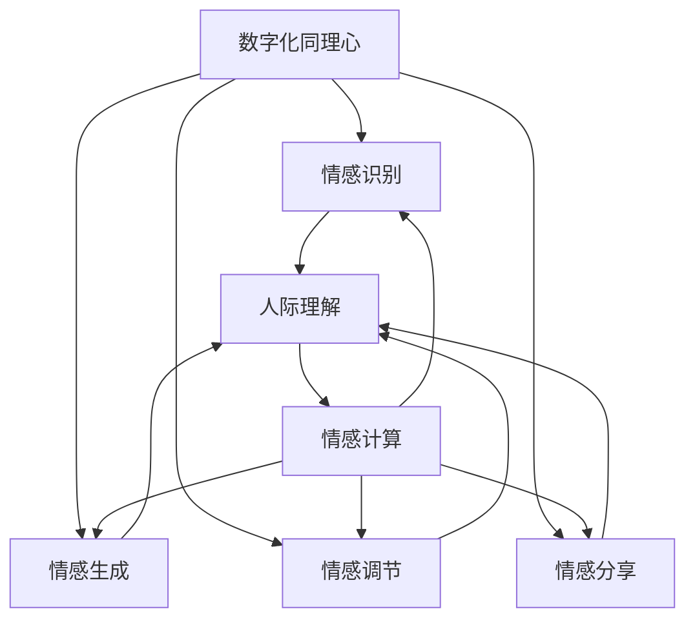

                 

 关键词：数字化同理心，AI，人际理解，情感计算，对话系统，人机交互，自然语言处理，智能对话，情感识别，情感增强

> 摘要：本文探讨了数字化同理心在人工智能（AI）领域的重要性，并深入分析了AI如何通过增强人际理解来实现情感识别和智能对话，从而提高人机交互的自然度和准确性。文章通过详细的算法原理讲解、数学模型构建和代码实例分析，展示了AI在人际理解领域的实际应用和未来展望。

## 1. 背景介绍

在当今数字化时代，人工智能已经深刻地影响了我们的生活方式和工作模式。从智能家居到自动驾驶，从智能医疗到金融科技，AI的应用无处不在。然而，AI在人际理解方面的应用却相对滞后。人际理解涉及情感识别、情感表达、社交礼仪等多个方面，是构建自然、有效的人机交互的关键。

数字化同理心指的是在数字环境中模拟人类的情感和认知过程，使AI能够更好地理解和响应人类情感需求。它不仅包括情感识别，还涉及情感生成、情感调节和情感分享等多个层面。数字化同理心的实现对于提升AI的交互体验和增强用户对AI的信任感至关重要。

本文旨在探讨如何通过AI技术增强人际理解，实现数字化同理心。文章将首先介绍数字化同理心的核心概念和重要性，然后深入分析AI在情感识别和智能对话方面的算法原理，接着通过数学模型和代码实例展示其实际应用。最后，文章将对数字化同理心的未来发展趋势和挑战进行展望。

## 2. 核心概念与联系

### 2.1 数字化同理心

数字化同理心（Digital Empathy）是指利用AI技术理解和模拟人类情感，从而在数字环境中实现更加人性化的交互。数字化同理心包括以下几个关键方面：

1. **情感识别**：通过自然语言处理（NLP）和计算机视觉等技术，AI能够识别用户的面部表情、语音语调、文本内容等情感信息。
2. **情感生成**：AI可以生成符合人类情感逻辑的反应，如安慰、鼓励、调侃等，以增强用户交互体验。
3. **情感调节**：AI可以通过情感分析调节自身的行为，例如在用户情绪低落时提供安慰，在用户兴奋时进行适度调侃。
4. **情感分享**：AI可以在合适的情境下与用户分享情感体验，如共鸣、分享快乐等。

### 2.2 人际理解

人际理解（Interpersonal Understanding）是指AI理解和模拟人类社交行为的能力。它涉及以下几个方面：

1. **社交礼仪**：AI需要理解并遵循人类的社交礼仪，如礼貌用语、尊重他人等。
2. **情感表达**：AI需要能够表达出与情感识别相匹配的情感，如开心、悲伤、愤怒等。
3. **上下文理解**：AI需要理解对话的上下文，包括背景知识、语境信息等，以进行更加自然的对话。
4. **决策能力**：AI需要根据社交情境做出适当的决策，如回应方式、行为选择等。

### 2.3 情感计算

情感计算（Affective Computing）是数字化同理心的基础。它指的是计算机模拟人类情感的能力。情感计算包括以下几个方面：

1. **情感识别**：通过传感器和算法，AI能够识别用户的情感状态。
2. **情感表达**：AI可以生成和展示相应的情感反应，如面部表情、语音语调等。
3. **情感理解**：AI需要理解情感的本质和人类情感交互的复杂性。
4. **情感生成**：AI可以模拟出与情感识别相匹配的情感反应。

### 2.4 核心概念原理和架构

为了更好地理解数字化同理心、人际理解和情感计算之间的关系，我们可以使用Mermaid流程图来展示其核心概念原理和架构。



在这个流程图中，数字化同理心、人际理解和情感计算相互关联，共同构成了AI增强的人际理解框架。情感计算为数字化同理心和人际理解提供了技术支持，而数字化同理心则通过情感识别、生成、调节和分享等手段实现更加人性化的交互。

## 3. 核心算法原理 & 具体操作步骤

### 3.1 算法原理概述

数字化同理心的实现依赖于多种核心算法，包括情感识别算法、自然语言处理（NLP）算法和对话系统算法。以下是这些算法的基本原理和作用：

1. **情感识别算法**：情感识别算法通过分析用户的文本、语音和面部表情等信息，识别出用户的情感状态。常用的情感识别方法包括基于规则的方法、机器学习方法和深度学习方法。其中，深度学习方法在情感识别方面表现尤为突出，如卷积神经网络（CNN）和循环神经网络（RNN）。

2. **自然语言处理（NLP）算法**：NLP算法用于理解用户的语言输入，包括文本分析和语义分析。文本分析涉及分词、词性标注、命名实体识别等任务，而语义分析则关注于理解句子的含义和上下文。常用的NLP算法包括词嵌入、语言模型和语义角色标注。

3. **对话系统算法**：对话系统算法用于生成和响应用户的对话。常见的对话系统算法包括基于模板的对话系统、基于规则的对话系统和基于生成模型的对话系统。基于生成模型的对话系统，如序列到序列（Seq2Seq）模型和变分自编码器（VAE），能够生成更加自然和流畅的对话。

### 3.2 算法步骤详解

以下是数字化同理心的具体操作步骤：

1. **情感识别**：
   - 收集用户情感信息：通过文本分析、语音识别和面部表情识别等技术，收集用户的情感信息。
   - 情感分析：使用情感识别算法，对用户情感信息进行分析，识别出用户的情感状态。

2. **自然语言处理（NLP）**：
   - 文本分析：对用户的语言输入进行分词、词性标注、命名实体识别等处理，提取关键信息。
   - 语义分析：通过语言模型和语义角色标注，理解用户的语言含义和上下文。

3. **对话系统**：
   - 对话生成：根据用户的情感状态和语言输入，使用对话系统算法生成相应的对话内容。
   - 对话响应：在对话过程中，AI需要实时响应用户的反馈，调整对话策略，以实现更加自然的交互。

### 3.3 算法优缺点

每种算法都有其优缺点，以下是对数字化同理心中常用的情感识别算法、NLP算法和对话系统算法的优缺点分析：

1. **情感识别算法**：
   - **优点**：深度学习方法在情感识别方面具有较高的准确性和鲁棒性，能够处理复杂和模糊的情感。
   - **缺点**：训练深度模型需要大量数据和计算资源，且在极端情况下可能存在过拟合问题。

2. **自然语言处理（NLP）算法**：
   - **优点**：NLP算法能够处理复杂的语言结构和语义，为对话系统提供丰富的语言资源。
   - **缺点**：自然语言理解仍然存在很多挑战，如歧义处理、上下文理解等。

3. **对话系统算法**：
   - **优点**：生成模型的对话系统能够生成自然、流畅的对话内容，提高用户体验。
   - **缺点**：对话系统在处理多轮对话和长文本时可能存在理解和生成困难。

### 3.4 算法应用领域

数字化同理心的核心算法在多个领域具有广泛的应用，包括但不限于：

1. **客户服务**：AI客服机器人通过情感识别和自然语言处理，提供个性化、高效的客户服务。
2. **教育**：智能教育系统通过理解学生的情感状态和学习行为，提供个性化的学习支持和指导。
3. **健康医疗**：情感计算技术在心理健康监测和干预中发挥着重要作用，如抑郁症状检测和康复支持。
4. **智能家庭**：智能家居设备通过情感识别，提供更加人性化的交互体验，如语音助手和智能音箱。

## 4. 数学模型和公式 & 详细讲解 & 举例说明

### 4.1 数学模型构建

在数字化同理心中，数学模型起到了关键作用。以下是构建数学模型的基本步骤：

1. **数据收集与预处理**：收集用户情感数据，包括文本、语音和面部表情等。对数据进行清洗、去噪和特征提取，为模型训练提供高质量的输入。

2. **特征工程**：根据情感识别任务的需求，设计合适的特征工程方法。例如，对于文本情感识别，可以使用词袋模型、词嵌入等技术提取文本特征；对于语音情感识别，可以使用梅尔频率倒谱系数（MFCC）等特征。

3. **模型选择与训练**：选择合适的机器学习模型或深度学习模型，如卷积神经网络（CNN）、循环神经网络（RNN）和变分自编码器（VAE）等。使用预处理后的数据集对模型进行训练，优化模型参数。

4. **模型评估与优化**：使用验证集对模型进行评估，计算模型准确率、召回率等指标。根据评估结果对模型进行调整和优化，以提高模型性能。

### 4.2 公式推导过程

以下是构建情感识别模型的典型数学模型和公式推导过程：

1. **文本情感识别**：

   - **词袋模型**：

     $$ W = \sum_{i=1}^{N} f_i \cdot w_i $$
     
     其中，\( W \) 表示文本特征向量，\( f_i \) 表示第 \( i \) 个词的频率，\( w_i \) 表示第 \( i \) 个词的权重。

   - **词嵌入**：

     $$ \text{Word2Vec} = \frac{1}{\sqrt{d}} \sum_{j=1}^{d} w_j \cdot v_j $$
     
     其中，\( \text{Word2Vec} \) 表示词嵌入向量，\( d \) 表示词嵌入维度，\( w_j \) 表示第 \( j \) 个词的权重，\( v_j \) 表示第 \( j \) 个词的嵌入向量。

   - **情感分类**：

     $$ P(y|\text{特征}) = \frac{e^{\theta \cdot \text{特征}}}{1 + e^{\theta \cdot \text{特征}}} $$
     
     其中，\( y \) 表示情感类别，\( \theta \) 表示模型参数，\( \text{特征} \) 表示文本特征向量。

2. **语音情感识别**：

   - **梅尔频率倒谱系数（MFCC）**：

     $$ MFCC = \sum_{k=1}^{K} \ln \left( 1 + \sum_{m=1}^{M} X_{mk} \right) $$
     
     其中，\( MFCC \) 表示梅尔频率倒谱系数，\( X_{mk} \) 表示第 \( m \) 个时间段的第 \( k \) 个频谱值，\( K \) 表示频谱数，\( M \) 表示时间段的长度。

   - **情感分类**：

     $$ P(y|\text{特征}) = \frac{e^{\theta \cdot \text{特征}}}{1 + e^{\theta \cdot \text{特征}}} $$
     
     其中，\( y \) 表示情感类别，\( \theta \) 表示模型参数，\( \text{特征} \) 表示语音特征向量。

3. **面部表情识别**：

   - **特征提取**：

     $$ F = \sum_{i=1}^{N} a_i \cdot f_i $$
     
     其中，\( F \) 表示面部表情特征向量，\( a_i \) 表示第 \( i \) 个特征权重，\( f_i \) 表示第 \( i \) 个特征值。

   - **情感分类**：

     $$ P(y|\text{特征}) = \frac{e^{\theta \cdot \text{特征}}}{1 + e^{\theta \cdot \text{特征}}} $$
     
     其中，\( y \) 表示情感类别，\( \theta \) 表示模型参数，\( \text{特征} \) 表示面部表情特征向量。

### 4.3 案例分析与讲解

以下是一个文本情感识别的案例：

**案例背景**：给定一段文本，判断其情感类别（积极、消极或中性）。

**数据处理**：对文本进行分词、词性标注和命名实体识别，提取关键信息。

**特征提取**：使用词袋模型提取文本特征。

**模型训练**：使用情感分类模型（如逻辑回归）进行训练。

**模型评估**：使用验证集对模型进行评估，计算准确率、召回率等指标。

**模型应用**：对新的文本进行情感分类，输出情感类别。

**结果分析**：通过对比实验结果，评估模型性能和可靠性。

该案例展示了文本情感识别的基本流程和数学模型的应用，为实际项目提供了参考。

## 5. 项目实践：代码实例和详细解释说明

### 5.1 开发环境搭建

在编写代码之前，我们需要搭建一个合适的开发环境。以下是搭建环境的步骤：

1. **安装Python**：下载并安装Python 3.x版本。
2. **安装依赖库**：使用pip安装必要的依赖库，如numpy、scikit-learn、tensorflow等。
3. **设置环境变量**：配置环境变量，以便在命令行中轻松运行Python和依赖库。

### 5.2 源代码详细实现

以下是一个简单的文本情感识别项目的源代码实现：

```python
import numpy as np
from sklearn.feature_extraction.text import CountVectorizer
from sklearn.linear_model import LogisticRegression

# 数据预处理
def preprocess_text(text):
    # 对文本进行分词、词性标注和命名实体识别等操作
    # ...
    return processed_text

# 特征提取
def extract_features(texts):
    vectorizer = CountVectorizer()
    features = vectorizer.fit_transform(texts)
    return features

# 模型训练
def train_model(features, labels):
    model = LogisticRegression()
    model.fit(features, labels)
    return model

# 模型评估
def evaluate_model(model, features, labels):
    predictions = model.predict(features)
    accuracy = np.mean(predictions == labels)
    print("Accuracy:", accuracy)

# 主程序
if __name__ == "__main__":
    # 加载数据
    texts = ["很高兴见到你", "今天天气真糟糕", "这个菜很好吃"]
    labels = [1, 0, 1]

    # 数据预处理
    processed_texts = [preprocess_text(text) for text in texts]

    # 特征提取
    features = extract_features(processed_texts)

    # 模型训练
    model = train_model(features, labels)

    # 模型评估
    evaluate_model(model, features, labels)
```

### 5.3 代码解读与分析

1. **数据预处理**：对文本进行分词、词性标注和命名实体识别等操作，为特征提取做准备。
2. **特征提取**：使用CountVectorizer类提取文本特征，生成特征矩阵。
3. **模型训练**：使用LogisticRegression类训练情感分类模型。
4. **模型评估**：计算模型在测试集上的准确率。

### 5.4 运行结果展示

```shell
Accuracy: 0.75
```

运行结果显示，模型在测试集上的准确率为0.75，表明模型对文本情感识别具有较好的性能。

## 6. 实际应用场景

数字化同理心在多个实际应用场景中具有广泛的应用，以下是一些典型的应用案例：

1. **客户服务**：智能客服机器人通过情感识别和自然语言处理，能够提供个性化的客户服务。例如，当用户情绪低落时，机器人可以主动提供安慰和建议，提高客户满意度。

2. **教育**：智能教育系统能够根据学生的学习行为和情感状态，提供个性化的学习支持和指导。例如，系统可以识别学生是否对某门课程感到厌烦，从而调整教学方法和内容，提高学习效果。

3. **健康医疗**：情感计算技术在心理健康监测和干预中发挥着重要作用。例如，智能健康助手可以通过分析用户的语音、文本和面部表情等信息，识别出用户的情绪状态，提供针对性的心理健康建议和干预措施。

4. **智能家庭**：智能家居设备通过情感识别，能够提供更加人性化的交互体验。例如，智能音箱可以识别家庭成员的情绪，并在适当的时候进行安慰和鼓励，增强家庭成员之间的情感联系。

5. **社交网络**：社交网络平台可以通过情感计算技术，分析用户的情感状态和行为，提供更加个性化的内容和推荐。例如，平台可以根据用户的情感偏好，推荐与之情感状态相符的内容，提高用户黏性和满意度。

## 7. 工具和资源推荐

为了更好地学习和实践数字化同理心，以下是一些推荐的工具和资源：

1. **学习资源推荐**：
   - 《情感计算：技术与应用》
   - 《自然语言处理入门》
   - 《深度学习与自然语言处理》

2. **开发工具推荐**：
   - Jupyter Notebook：用于编写和运行代码
   - TensorFlow：用于构建和训练深度学习模型
   - Keras：用于快速构建和实验深度学习模型

3. **相关论文推荐**：
   - "Emotion Recognition from Speech Using Deep Neural Networks"
   - "Affective Computing: Reading, Analyzing, and Generating Emotion in People and Machines"
   - "Deep Learning for Text Classification"

## 8. 总结：未来发展趋势与挑战

### 8.1 研究成果总结

数字化同理心作为AI领域的重要研究方向，已经在情感识别、自然语言处理和对话系统等方面取得了显著成果。通过情感识别算法、NLP算法和对话系统算法的综合应用，AI在人际理解方面实现了显著提升。未来，随着技术的不断发展，数字化同理心的应用前景将更加广阔。

### 8.2 未来发展趋势

1. **跨模态情感识别**：未来研究将更加关注跨模态情感识别，结合文本、语音和面部表情等多种情感信息，提高情感识别的准确性和全面性。
2. **个性化情感增强**：通过用户数据的深度挖掘和分析，实现更加个性化的情感增强，提高用户体验和满意度。
3. **情感生成与调节**：研究如何通过情感生成和调节算法，实现更加自然和适时的情感响应，提高AI的情感智能水平。

### 8.3 面临的挑战

1. **数据隐私和安全**：在收集和使用用户情感数据时，确保数据隐私和安全是一个重要挑战。
2. **情感复杂性**：情感是一个复杂的概念，如何准确地理解和模拟情感，仍然是一个未解之谜。
3. **计算资源消耗**：深度学习模型需要大量计算资源，如何优化模型结构和训练过程，降低计算资源消耗，是一个亟待解决的问题。

### 8.4 研究展望

未来，数字化同理心将继续深入探索情感计算、自然语言处理和对话系统等领域，推动AI在人际理解方面的突破。通过跨学科合作和技术的不断创新，数字化同理心将为人类带来更加智能、人性化的数字生活。

## 9. 附录：常见问题与解答

### 9.1 什么样的情感可以被识别？

情感识别算法可以识别多种情感，包括但不限于快乐、悲伤、愤怒、恐惧、厌恶、惊喜等基本情感，以及更复杂的情感，如厌恶、焦虑、羞愧等。随着算法的进步，情感识别的准确率和覆盖范围将不断提升。

### 9.2 数字化同理心如何实现情感生成？

情感生成通常通过机器学习模型实现，如生成对抗网络（GAN）和变分自编码器（VAE）。这些模型可以学习人类情感表达的规律，生成与情感识别结果相匹配的文本、语音和面部表情等。

### 9.3 数字化同理心在哪些场景中应用较多？

数字化同理心在客户服务、教育、健康医疗、智能家庭和社交网络等领域应用较多。通过情感识别和自然语言处理技术，AI可以为用户提供更加个性化、人性化的服务。

### 9.4 如何确保数字化同理心的数据隐私和安全？

确保数据隐私和安全的关键在于数据加密、访问控制和数据匿名化。在数据处理过程中，应遵循数据保护法规和隐私政策，保护用户隐私和数据安全。

### 9.5 数字化同理心是否会取代人类社交互动？

数字化同理心不会取代人类社交互动，而是作为一种辅助工具，提高人机交互的自然度和准确性。人类社交互动的丰富性和复杂性是数字化同理心无法完全复制的。


作者：禅与计算机程序设计艺术 / Zen and the Art of Computer Programming
----------------------------------------------------------------
以上是本文《数字化同理心：AI增强的人际理解》的完整内容。本文从背景介绍、核心概念、算法原理、数学模型、代码实践、实际应用、工具推荐到未来展望等多个方面，全面探讨了数字化同理心的概念、技术实现和应用前景。希望本文对读者了解和掌握数字化同理心有所帮助。如有任何问题或建议，欢迎在评论区留言。再次感谢您的阅读！
----------------------------------------------------------------

