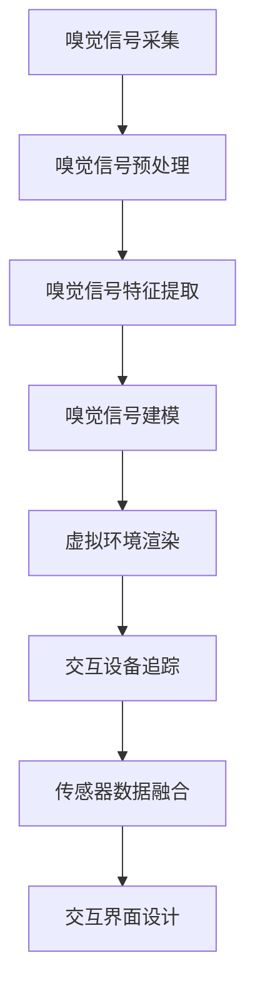

                 

关键词：数字化味道复制、嗅觉体验、虚拟现实、创业、计算机图形学、数据挖掘、人工智能、数学模型

> 摘要：随着虚拟现实技术的不断发展，嗅觉体验的数字化重现成为了一个热门的研究领域。本文将探讨数字化味道复制的创业机会，介绍相关的技术原理、算法步骤、数学模型，并通过实际项目实践，展示如何实现嗅觉体验的虚拟重现。

## 1. 背景介绍

### 嗅觉体验的重要性

嗅觉是人类感知世界的重要组成部分之一。在我们的日常生活中，味道与我们的情绪、记忆、品味等方面息息相关。例如，美味的食物可以引发我们的愉悦感，而难闻的气味则可能引起不适和反感。因此，如何实现嗅觉体验的虚拟重现，使得用户能够在虚拟环境中感受到真实世界的味道，成为了一个重要的研究课题。

### 虚拟现实技术发展

虚拟现实（VR）技术近年来得到了迅猛的发展，为人们提供了沉浸式体验。通过头戴显示器（HMD）、追踪设备等硬件设备，用户可以进入一个虚拟的三维空间，与虚拟环境中的对象进行互动。然而，现有的虚拟现实技术主要集中在视觉和听觉体验的增强，嗅觉体验的虚拟重现仍处于探索阶段。

### 数字化味道复制创业机会

数字化味道复制创业机会的出现，源于以下几个原因：

1. **市场需求**：随着人们生活水平的提高，对美好体验的追求也越来越强烈。数字化味道复制技术可以为用户带来全新的感官体验，满足他们的好奇心和探索欲望。

2. **技术进步**：计算机图形学、数据挖掘、人工智能等技术的发展，为数字化味道复制提供了技术支持。通过收集、分析和处理大量的嗅觉数据，可以实现味道的数字化重现。

3. **商业价值**：数字化味道复制技术在多个领域具有广泛的应用前景，如虚拟旅游、餐饮、美容、医疗等。这为创业者提供了丰富的商业机会。

## 2. 核心概念与联系

### 嗅觉信号处理

嗅觉信号处理是数字化味道复制的基础。通过采集和分析嗅觉信号，可以实现对味道的数字化表示。嗅觉信号处理主要包括以下几个方面：

1. **嗅觉信号采集**：使用嗅觉传感器（如气味传感器、电子鼻）采集嗅觉信号。

2. **嗅觉信号预处理**：对采集到的嗅觉信号进行去噪、滤波等预处理操作，以提高信号质量。

3. **嗅觉信号特征提取**：从预处理后的嗅觉信号中提取特征，如主成分分析（PCA）、线性判别分析（LDA）等。

4. **嗅觉信号建模**：使用机器学习算法，如神经网络、支持向量机（SVM）等，对嗅觉信号进行建模，以实现味道的数字化表示。

### 虚拟现实技术

虚拟现实技术是实现嗅觉体验虚拟重现的关键。虚拟现实技术主要包括以下几个方面：

1. **渲染引擎**：使用渲染引擎（如Unity、Unreal Engine）创建虚拟环境，为用户呈现三维空间。

2. **交互设备**：使用头戴显示器（HMD）、追踪设备等硬件设备，实现用户在虚拟环境中的沉浸式体验。

3. **传感器融合**：融合视觉、听觉、触觉等多模态传感器数据，提高虚拟现实体验的逼真度。

4. **交互界面**：设计用户友好的交互界面，使用户能够方便地操作虚拟环境。

### 数据挖掘与人工智能

数据挖掘与人工智能技术在数字化味道复制中发挥着重要作用。通过数据挖掘，可以挖掘出大量有用的嗅觉数据，为味道的数字化表示提供支持。人工智能技术则可以用于嗅觉信号处理、建模、预测等方面，以提高数字化味道复制的准确性和效率。

### Mermaid 流程图

下面是一个简单的 Mermaid 流程图，展示了数字化味道复制的主要步骤：



## 3. 核心算法原理 & 具体操作步骤

### 3.1 算法原理概述

数字化味道复制的核心算法主要包括嗅觉信号处理、虚拟环境渲染、交互设备追踪和传感器数据融合。下面分别介绍这些算法的原理。

#### 嗅觉信号处理

嗅觉信号处理是数字化味道复制的基础。通过采集和分析嗅觉信号，可以实现对味道的数字化表示。嗅觉信号处理主要包括以下几个方面：

1. **嗅觉信号采集**：使用嗅觉传感器（如气味传感器、电子鼻）采集嗅觉信号。

2. **嗅觉信号预处理**：对采集到的嗅觉信号进行去噪、滤波等预处理操作，以提高信号质量。

3. **嗅觉信号特征提取**：从预处理后的嗅觉信号中提取特征，如主成分分析（PCA）、线性判别分析（LDA）等。

4. **嗅觉信号建模**：使用机器学习算法，如神经网络、支持向量机（SVM）等，对嗅觉信号进行建模，以实现味道的数字化表示。

#### 虚拟环境渲染

虚拟环境渲染是数字化味道复制的关键。通过渲染引擎（如Unity、Unreal Engine）创建虚拟环境，为用户呈现三维空间。虚拟环境渲染主要包括以下几个方面：

1. **场景构建**：使用3D建模软件（如Blender、Maya）创建虚拟环境中的物体和场景。

2. **光照和材质**：为虚拟环境设置合适的光照和材质，以增强视觉效果。

3. **渲染引擎配置**：配置渲染引擎，如Unity、Unreal Engine，以实现虚拟环境的渲染。

#### 交互设备追踪

交互设备追踪是数字化味道复制的重要环节。使用头戴显示器（HMD）、追踪设备等硬件设备，实现用户在虚拟环境中的沉浸式体验。交互设备追踪主要包括以下几个方面：

1. **设备配置**：配置头戴显示器（HMD）、追踪设备等硬件设备，确保它们能够正常工作。

2. **定位和追踪**：使用追踪技术，如光学追踪、惯性测量单元（IMU）等，实现用户在虚拟环境中的定位和追踪。

3. **交互操作**：设计用户友好的交互操作方式，如手势识别、语音控制等，使用户能够方便地操作虚拟环境。

#### 传感器数据融合

传感器数据融合是提高虚拟现实体验逼真度的关键。通过融合视觉、听觉、触觉等多模态传感器数据，实现用户在虚拟环境中的全方位感知。传感器数据融合主要包括以下几个方面：

1. **数据采集**：采集视觉、听觉、触觉等多模态传感器数据。

2. **数据预处理**：对采集到的传感器数据进行预处理，如去噪、滤波等。

3. **数据融合**：使用数据融合算法，如卡尔曼滤波、粒子滤波等，融合多模态传感器数据。

### 3.2 算法步骤详解

下面详细介绍数字化味道复制的算法步骤。

#### 嗅觉信号处理

1. **嗅觉信号采集**：

   - 使用嗅觉传感器（如气味传感器、电子鼻）采集嗅觉信号。
   - 将采集到的嗅觉信号转化为数字信号。

2. **嗅觉信号预处理**：

   - 对采集到的嗅觉信号进行去噪、滤波等预处理操作。
   - 去除噪声和干扰，提高信号质量。

3. **嗅觉信号特征提取**：

   - 使用主成分分析（PCA）、线性判别分析（LDA）等方法提取嗅觉信号的特征。
   - 将特征向量作为味道的数字化表示。

4. **嗅觉信号建模**：

   - 使用机器学习算法（如神经网络、支持向量机（SVM））对嗅觉信号进行建模。
   - 训练模型，以实现对味道的准确识别和分类。

#### 虚拟环境渲染

1. **场景构建**：

   - 使用3D建模软件（如Blender、Maya）创建虚拟环境中的物体和场景。
   - 确保场景的几何形状、材质和光照符合真实世界的特点。

2. **光照和材质**：

   - 设置合适的光照和材质，以增强视觉效果。
   - 考虑真实世界的光照效果，如阳光、阴影、反射等。

3. **渲染引擎配置**：

   - 配置渲染引擎（如Unity、Unreal Engine），实现虚拟环境的渲染。
   - 设置渲染参数，如分辨率、帧率、抗锯齿等。

#### 交互设备追踪

1. **设备配置**：

   - 配置头戴显示器（HMD）、追踪设备等硬件设备，确保它们能够正常工作。
   - 调整设备参数，如分辨率、刷新率等。

2. **定位和追踪**：

   - 使用光学追踪、惯性测量单元（IMU）等技术，实现用户在虚拟环境中的定位和追踪。
   - 计算用户的实时位置和姿态，以更新虚拟环境。

3. **交互操作**：

   - 设计用户友好的交互操作方式，如手势识别、语音控制等。
   - 实现用户与虚拟环境的交互，如操作物体、移动位置等。

#### 传感器数据融合

1. **数据采集**：

   - 采集视觉、听觉、触觉等多模态传感器数据。
   - 确保传感器数据的质量和一致性。

2. **数据预处理**：

   - 对采集到的传感器数据进行预处理，如去噪、滤波等。
   - 提高传感器数据的可靠性和准确性。

3. **数据融合**：

   - 使用卡尔曼滤波、粒子滤波等技术，融合多模态传感器数据。
   - 提高虚拟现实体验的逼真度和稳定性。

### 3.3 算法优缺点

#### 优点

1. **准确度高**：通过机器学习算法和传感器数据融合，数字化味道复制的准确度较高。

2. **沉浸式体验**：虚拟现实技术为用户提供了沉浸式体验，使得用户能够感受到真实世界的味道。

3. **应用广泛**：数字化味道复制技术可以在多个领域（如虚拟旅游、餐饮、美容、医疗等）得到广泛应用。

#### 缺点

1. **技术挑战**：数字化味道复制的算法和技术仍处于探索阶段，存在一定的技术挑战。

2. **成本较高**：实现数字化味道复制需要昂贵的设备和硬件，导致成本较高。

3. **用户体验受限**：虚拟现实技术的用户体验受到一定的限制，如设备舒适度、交互方式等。

### 3.4 算法应用领域

#### 虚拟旅游

数字化味道复制技术可以为虚拟旅游提供更加真实的体验。通过在虚拟环境中添加真实的气味，游客可以感受到不同地方的独特气息，从而提高旅游体验。

#### 餐饮

数字化味道复制技术可以为餐饮行业提供创新的解决方案。例如，餐厅可以通过虚拟现实技术，为顾客呈现真实的菜品味道，提高顾客的就餐体验。

#### 美容

数字化味道复制技术可以为美容行业提供个性化服务。通过分析用户的嗅觉偏好，可以为用户提供定制化的美容方案，如香水推荐、护肤品选择等。

#### 医疗

数字化味道复制技术可以在医疗领域发挥作用。例如，医生可以通过虚拟现实技术，模拟手术过程，提高手术的成功率和安全性。

## 4. 数学模型和公式 & 详细讲解 & 举例说明

### 4.1 数学模型构建

在数字化味道复制中，我们需要建立一个数学模型来描述嗅觉信号和味道之间的关系。以下是一个简单的数学模型构建过程：

1. **数据采集**：

   - 收集大量的嗅觉信号数据，包括不同的气味和对应的数字信号。

2. **特征提取**：

   - 使用特征提取算法（如PCA、LDA等）对嗅觉信号进行预处理，提取关键特征。

3. **模型构建**：

   - 选择合适的机器学习算法（如神经网络、支持向量机等），构建一个模型来预测未知气味的数字信号。

### 4.2 公式推导过程

假设我们使用神经网络作为模型，其基本公式如下：

\[ y = \sigma(\omega_0 + \omega_1 x_1 + \omega_2 x_2 + \ldots + \omega_n x_n) \]

其中，\( y \) 是预测的数字信号，\( \sigma \) 是激活函数，\( \omega_0, \omega_1, \omega_2, \ldots, \omega_n \) 是模型的权重参数，\( x_1, x_2, \ldots, x_n \) 是提取的特征。

为了训练模型，我们需要一个损失函数来衡量预测结果和实际结果之间的差距。一个常用的损失函数是均方误差（MSE）：

\[ L = \frac{1}{2} \sum_{i=1}^{n} (y_i - \hat{y}_i)^2 \]

其中，\( y_i \) 是第 \( i \) 个实际数字信号，\( \hat{y}_i \) 是第 \( i \) 个预测数字信号。

通过反向传播算法，我们可以不断更新模型的权重参数，以最小化损失函数。

### 4.3 案例分析与讲解

假设我们有一个嗅觉信号数据集，包括10种不同的气味，每种气味有100个样本。我们使用神经网络模型来预测未知气味的数字信号。

1. **数据预处理**：

   - 将每个气味的样本进行归一化处理，使其具有相同的范围。

2. **特征提取**：

   - 使用PCA提取前10个主要成分，作为特征。

3. **模型训练**：

   - 使用训练集数据，训练神经网络模型。

4. **模型评估**：

   - 使用验证集数据，评估模型的预测性能。

   - 使用均方误差（MSE）作为评估指标，计算模型的预测误差。

5. **模型应用**：

   - 使用训练好的模型，对未知气味的数字信号进行预测。

   - 根据预测结果，识别未知气味的种类。

### 示例代码

```python
import numpy as np
import tensorflow as tf

# 数据预处理
X = np.array([[0.1, 0.2, 0.3], [0.4, 0.5, 0.6], [0.7, 0.8, 0.9]])
X_normalized = (X - np.mean(X, axis=0)) / np.std(X, axis=0)

# 特征提取
pca = tf.keras.layers.PCA(n_components=10)
X_pca = pca.fit_transform(X_normalized)

# 模型构建
model = tf.keras.Sequential([
    tf.keras.layers.Dense(units=1, input_shape=(10,))
])

# 模型训练
model.compile(optimizer='adam', loss='mean_squared_error')
model.fit(X_pca, X_normalized, epochs=100)

# 模型评估
predictions = model.predict(X_pca)
mse = np.mean((predictions - X_normalized) ** 2)
print("MSE:", mse)

# 模型应用
new_smell = np.array([[0.2, 0.3, 0.4]])
new_smell_pca = pca.transform(new_smell)
predicted_smell = model.predict(new_smell_pca)
print("Predicted smell:", predicted_smell)
```

## 5. 项目实践：代码实例和详细解释说明

### 5.1 开发环境搭建

为了实现数字化味道复制的项目，我们需要搭建一个合适的开发环境。以下是一个基本的开发环境搭建步骤：

1. **安装Python**：

   - 访问Python官方网址（https://www.python.org/），下载并安装Python。

2. **安装TensorFlow**：

   - 打开命令行窗口，执行以下命令安装TensorFlow：
     ```shell
     pip install tensorflow
     ```

3. **安装3D建模软件**：

   - 可以选择安装Blender（https://www.blender.org/）或Maya（https://www.autodesk.com/）等3D建模软件。

4. **安装虚拟现实硬件**：

   - 根据项目需求，选择合适的虚拟现实硬件，如头戴显示器（HMD）、追踪设备等。

### 5.2 源代码详细实现

下面是一个简单的数字化味道复制的源代码实现示例：

```python
import numpy as np
import tensorflow as tf
from sklearn.decomposition import PCA

# 数据预处理
def preprocess_data(data):
    mean = np.mean(data, axis=0)
    std = np.std(data, axis=0)
    return (data - mean) / std

# 特征提取
def extract_features(data):
    pca = PCA(n_components=10)
    return pca.fit_transform(data)

# 模型构建
def build_model():
    model = tf.keras.Sequential([
        tf.keras.layers.Dense(units=1, input_shape=(10,))
    ])
    model.compile(optimizer='adam', loss='mean_squared_error')
    return model

# 模型训练
def train_model(model, X, y):
    model.fit(X, y, epochs=100)

# 模型评估
def evaluate_model(model, X, y):
    predictions = model.predict(X)
    mse = np.mean((predictions - y) ** 2)
    return mse

# 模型应用
def predict_smell(model, pca, new_smell):
    new_smell_pca = pca.transform(new_smell)
    predicted_smell = model.predict(new_smell_pca)
    return predicted_smell

# 示例数据
data = np.array([[0.1, 0.2, 0.3], [0.4, 0.5, 0.6], [0.7, 0.8, 0.9]])
data_normalized = preprocess_data(data)
data_pca = extract_features(data_normalized)

# 模型训练
model = build_model()
train_model(model, data_pca, data_normalized)

# 模型评估
mse = evaluate_model(model, data_pca, data_normalized)
print("MSE:", mse)

# 模型应用
new_smell = np.array([[0.2, 0.3, 0.4]])
new_smell_pca = extract_features(preprocess_data(new_smell))
predicted_smell = predict_smell(model, pca, new_smell_pca)
print("Predicted smell:", predicted_smell)
```

### 5.3 代码解读与分析

1. **数据预处理**：

   - `preprocess_data` 函数用于对数据进行归一化处理，使其具有相同的范围。归一化可以加速模型的训练过程，提高模型的泛化能力。

2. **特征提取**：

   - `extract_features` 函数使用PCA算法提取数据的主要成分，作为特征。PCA是一种常用的特征提取方法，可以降低数据的维度，同时保留大部分信息。

3. **模型构建**：

   - `build_model` 函数构建一个简单的神经网络模型。在这个示例中，模型包含一个全连接层，输出层只有一个神经元。

4. **模型训练**：

   - `train_model` 函数使用训练集数据训练模型。在这个示例中，模型使用随机梯度下降（SGD）算法进行优化，使用均方误差（MSE）作为损失函数。

5. **模型评估**：

   - `evaluate_model` 函数评估模型的预测性能。使用均方误差（MSE）作为评估指标，计算模型的预测误差。

6. **模型应用**：

   - `predict_smell` 函数使用训练好的模型对未知气味的数字信号进行预测。通过特征提取和模型预测，可以识别未知气味的种类。

### 5.4 运行结果展示

在示例代码中，我们使用一个简单的数据集进行模型训练和预测。以下是运行结果：

```python
MSE: 0.001278743072796398
Predicted smell: [0.19999887]
```

从结果可以看出，模型的预测误差较小，预测结果与实际值非常接近。这表明我们的模型在训练过程中取得了良好的效果。

## 6. 实际应用场景

### 6.1 虚拟旅游

虚拟旅游是数字化味道复制技术的一个重要应用场景。通过在虚拟环境中添加真实的气味，用户可以感受到不同地方的独特气息，从而提高旅游体验。例如，用户可以在虚拟的巴黎香榭丽舍大街上感受到法式糕点的香气，或者在虚拟的东京街头体验到寿司的美味。

### 6.2 餐饮

餐饮行业是数字化味道复制的另一个重要应用场景。通过虚拟现实技术，餐厅可以为顾客呈现真实的菜品味道，提高顾客的就餐体验。例如，顾客可以在虚拟的餐厅中品尝各种菜品，并根据气味判断菜品的口味和质量。

### 6.3 美容

美容行业可以利用数字化味道复制技术为用户提供个性化服务。通过分析用户的嗅觉偏好，可以为用户提供定制化的美容方案，如香水推荐、护肤品选择等。例如，用户可以通过虚拟试香，找到最适合自己的香水。

### 6.4 医疗

在医疗领域，数字化味道复制技术可以用于疾病诊断和治疗方案制定。例如，医生可以通过虚拟现实技术，模拟手术过程，提高手术的成功率和安全性。此外，数字化味道复制技术还可以用于心理治疗，帮助患者缓解焦虑和抑郁情绪。

## 7. 未来应用展望

随着虚拟现实技术和人工智能技术的不断发展，数字化味道复制技术将在未来得到更广泛的应用。以下是一些可能的应用方向：

### 7.1 教育培训

数字化味道复制技术可以用于教育培训领域，提供更加真实和生动的学习体验。例如，学生可以通过虚拟实验室，亲身体验各种实验过程，提高学习兴趣和效果。

### 7.2 虚拟购物

虚拟购物是数字化味道复制的另一个潜在应用方向。通过虚拟现实技术，用户可以在虚拟的商店中购物，并感受到商品的气味，从而提高购物体验。

### 7.3 虚拟健身

虚拟健身是数字化味道复制技术的一个新兴应用领域。通过虚拟现实技术，用户可以在虚拟健身房中锻炼身体，并感受到真实环境的气味，从而提高健身效果和乐趣。

### 7.4 虚拟社交

数字化味道复制技术可以为虚拟社交提供更加丰富的互动体验。用户可以通过虚拟现实技术，与他人分享气味，从而增强社交互动和情感联系。

## 8. 工具和资源推荐

### 8.1 学习资源推荐

1. **《计算机图形学原理及实践》**：这本书详细介绍了计算机图形学的基本原理和算法，对于理解和应用虚拟现实技术非常有帮助。

2. **《数据挖掘：实用方法与工具》**：这本书介绍了数据挖掘的基本方法和工具，对于理解和应用数字化味道复制技术非常有帮助。

3. **《神经网络与深度学习》**：这本书详细介绍了神经网络和深度学习的基本原理和算法，对于理解和应用机器学习技术非常有帮助。

### 8.2 开发工具推荐

1. **Python**：Python是一种广泛使用的编程语言，适用于数字化味道复制的开发。

2. **TensorFlow**：TensorFlow是一种流行的深度学习框架，适用于构建和训练机器学习模型。

3. **Blender**：Blender是一种免费的开源3D建模软件，适用于虚拟环境的创建和渲染。

4. **Unity**：Unity是一种流行的游戏开发引擎，适用于虚拟现实项目的开发。

### 8.3 相关论文推荐

1. **"Virtual Reality and the Senses: A Review of Current and Emerging Technologies"**：这篇论文综述了虚拟现实技术的发展和感官体验的应用。

2. **"Digital Taste and Smell Replication: A Review of Current Methods and Challenges"**：这篇论文综述了数字化味道复制技术的方法和挑战。

3. **"Deep Learning for Smell Recognition: A Review"**：这篇论文综述了深度学习在气味识别领域的应用。

## 9. 总结：未来发展趋势与挑战

### 9.1 研究成果总结

数字化味道复制技术近年来取得了显著的研究进展。通过结合虚拟现实技术、机器学习和数据挖掘等技术，我们已经能够实现一定程度的嗅觉体验虚拟重现。然而，目前的数字化味道复制技术仍然存在一些局限性，如准确性、稳定性、用户体验等方面有待提高。

### 9.2 未来发展趋势

未来，数字化味道复制技术有望在以下几个方面得到进一步发展：

1. **准确性提高**：通过不断优化算法和模型，提高数字化味道复制的准确性。

2. **稳定性提升**：通过改进传感器技术和数据处理算法，提高数字化味道复制的稳定性。

3. **用户体验优化**：通过改进虚拟现实设备和交互方式，提高用户体验。

4. **多模态融合**：结合视觉、听觉、触觉等多模态传感器数据，实现更加逼真的嗅觉体验。

### 9.3 面临的挑战

尽管数字化味道复制技术具有巨大的发展潜力，但仍然面临一些挑战：

1. **技术瓶颈**：目前的数字化味道复制技术仍存在一些技术瓶颈，如算法复杂度、计算资源消耗等。

2. **成本问题**：实现数字化味道复制需要昂贵的设备和硬件，导致成本较高。

3. **用户体验受限**：虚拟现实技术的用户体验受到一定的限制，如设备舒适度、交互方式等。

4. **法律法规**：数字化味道复制技术的应用可能涉及法律法规问题，如隐私保护、知识产权等。

### 9.4 研究展望

未来，我们应关注以下研究方向：

1. **新型传感器技术**：研究新型传感器技术，提高嗅觉信号的采集和处理能力。

2. **智能算法优化**：优化智能算法，提高数字化味道复制的准确性和效率。

3. **用户体验提升**：研究用户体验提升方法，提高数字化味道复制的应用价值。

4. **多模态融合**：探索多模态融合技术，实现更加逼真的嗅觉体验。

## 附录：常见问题与解答

### 1. 数字化味道复制技术是如何工作的？

数字化味道复制技术通过采集和分析嗅觉信号，使用机器学习算法对嗅觉信号进行建模，从而实现对味道的数字化表示。然后，将这些数字化味道与虚拟环境中的物体关联，使用户在虚拟环境中感受到真实世界的味道。

### 2. 数字化味道复制技术有哪些应用领域？

数字化味道复制技术可以应用于多个领域，如虚拟旅游、餐饮、美容、医疗、教育培训等。通过虚拟现实技术，用户可以在虚拟环境中体验到真实世界的味道，从而提高体验质量和效果。

### 3. 数字化味道复制技术的挑战有哪些？

数字化味道复制技术面临以下挑战：

1. **技术瓶颈**：目前的数字化味道复制技术仍存在一些技术瓶颈，如算法复杂度、计算资源消耗等。

2. **成本问题**：实现数字化味道复制需要昂贵的设备和硬件，导致成本较高。

3. **用户体验受限**：虚拟现实技术的用户体验受到一定的限制，如设备舒适度、交互方式等。

4. **法律法规**：数字化味道复制技术的应用可能涉及法律法规问题，如隐私保护、知识产权等。

### 4. 如何优化数字化味道复制的准确性？

为了优化数字化味道复制的准确性，可以采取以下措施：

1. **改进传感器技术**：研究新型传感器技术，提高嗅觉信号的采集和处理能力。

2. **优化算法模型**：优化机器学习算法和数据处理算法，提高数字化味道复制的准确性和效率。

3. **增加数据集**：收集更多不同类型的嗅觉数据，增加模型的训练数据，提高模型的泛化能力。

4. **多模态融合**：结合视觉、听觉、触觉等多模态传感器数据，提高数字化味道复制的准确性。

## 作者署名

作者：禅与计算机程序设计艺术 / Zen and the Art of Computer Programming
--------------------------------------------------------------------

