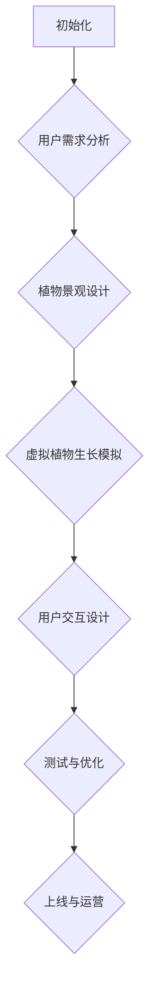

                 

关键词：数字化园艺、虚拟花园、设计、维护、人工智能、数据可视化

摘要：随着数字化技术的飞速发展，虚拟花园的设计与维护逐渐成为园艺领域的新趋势。本文将探讨数字化园艺创业的核心概念、技术架构、算法原理、数学模型、项目实践以及未来应用前景，为创业者提供有价值的参考。

## 1. 背景介绍

近年来，人工智能、大数据、云计算等技术的迅猛发展，为传统园艺行业带来了前所未有的变革。传统的园艺种植模式往往依赖于经验和人工操作，效率低下且难以实现大规模生产。而数字化园艺通过引入虚拟现实、增强现实、物联网等先进技术，可以实现精准化、智能化、高效化的园艺生产和管理。

虚拟花园作为一种新兴的园艺形式，以其独特的魅力和巨大的市场潜力，吸引了众多创业者和投资者的关注。虚拟花园不仅可以在虚拟空间中展示真实的植物景观，还可以通过模拟植物生长过程、环境因素等，为用户带来沉浸式的体验。

## 2. 核心概念与联系

### 2.1 数字化园艺的概念

数字化园艺是指将现代信息技术与园艺生产相结合，通过数字化手段实现园艺生产、管理、服务的全流程智能化。数字化园艺的核心概念包括：

- **物联网（IoT）**：通过传感器、摄像头等设备，实时监测植物生长环境，收集数据并传输到云端进行分析和处理。
- **虚拟现实（VR）**：利用计算机模拟出真实的植物生长场景，为用户提供沉浸式的观赏体验。
- **增强现实（AR）**：在现实世界中叠加虚拟的植物景观，实现虚实结合的效果。

### 2.2 虚拟花园的概念

虚拟花园是一种虚拟的园艺景观，通过计算机模拟出各种植物、水体、地形等元素，为用户提供观赏、休闲、学习等多样化的体验。虚拟花园的核心概念包括：

- **植物景观设计**：根据用户需求和场景特点，设计出独特的植物景观。
- **虚拟植物生长模拟**：通过算法模拟植物的生长过程，实现动态的植物景观展示。
- **用户交互**：提供用户与虚拟花园的互动功能，如种植、修剪、浇水等。

### 2.3 Mermaid 流程图

以下是虚拟花园设计流程的 Mermaid 流程图：



## 3. 核心算法原理 & 具体操作步骤

### 3.1 算法原理概述

虚拟花园的设计与维护涉及多个核心算法，包括植物生长模拟算法、用户交互算法、环境监测算法等。以下是这些算法的基本原理：

- **植物生长模拟算法**：通过数学模型和计算机模拟，实现植物从种子到成株的生长过程。
- **用户交互算法**：根据用户的操作，实时更新虚拟花园的景观效果。
- **环境监测算法**：利用物联网设备，实时监测植物生长环境，包括温度、湿度、光照等。

### 3.2 算法步骤详解

#### 3.2.1 植物生长模拟算法

1. **数据收集**：通过传感器收集植物生长环境数据。
2. **数据预处理**：对收集到的数据进行清洗、归一化等处理。
3. **生长模型构建**：基于收集到的数据，构建植物生长模型。
4. **模拟过程**：根据植物生长模型，模拟植物的生长过程。

#### 3.2.2 用户交互算法

1. **用户输入**：接收用户的操作指令。
2. **指令解析**：解析用户的操作指令，如种植、修剪、浇水等。
3. **景观更新**：根据用户的操作指令，实时更新虚拟花园的景观效果。

#### 3.2.3 环境监测算法

1. **数据收集**：通过传感器收集植物生长环境数据。
2. **数据预处理**：对收集到的数据进行清洗、归一化等处理。
3. **环境监测**：根据预处理后的数据，实时监测植物生长环境。

### 3.3 算法优缺点

#### 3.3.1 优点

- **高效性**：通过算法模拟，可以快速实现植物生长过程的动态展示。
- **灵活性**：可以根据用户需求，灵活调整植物景观的设计。
- **智能化**：通过环境监测算法，实现植物生长环境的智能监控。

#### 3.3.2 缺点

- **计算成本**：算法模拟过程需要大量的计算资源。
- **准确性**：植物生长模拟算法的准确性受限于数据质量和模型构建。

### 3.4 算法应用领域

- **虚拟现实体验**：通过虚拟花园，为用户提供沉浸式的园艺体验。
- **智能种植指导**：根据环境监测算法，为用户提供智能化的种植建议。
- **园艺教学**：通过虚拟花园，为园艺学习者提供直观的学习材料。

## 4. 数学模型和公式 & 详细讲解 & 举例说明

### 4.1 数学模型构建

虚拟花园的数学模型主要包括植物生长模型、环境监测模型等。以下是植物生长模型的基本公式：

$$
G(t) = G_0 \cdot e^{rt}
$$

其中，$G(t)$ 表示植物在时间 $t$ 的生长量，$G_0$ 表示初始生长量，$r$ 表示生长速率。

### 4.2 公式推导过程

植物生长模型的推导基于微分方程。假设植物生长量 $G$ 与时间 $t$ 之间的关系为：

$$
\frac{dG}{dt} = rG
$$

其中，$r$ 为生长速率。对上式进行积分，得到：

$$
\int \frac{1}{G} dG = \int r dt
$$

$$
\ln G = rt + C
$$

其中，$C$ 为常数。对上式进行指数运算，得到植物生长模型：

$$
G(t) = e^{rt + C} = G_0 \cdot e^{rt}
$$

### 4.3 案例分析与讲解

假设某种植物的初始生长量为 100 克，生长速率为每天 5%，求第 10 天的生长量。

根据植物生长模型，有：

$$
G(10) = 100 \cdot e^{0.05 \cdot 10} \approx 161.49
$$

因此，第 10 天的生长量约为 161.49 克。

## 5. 项目实践：代码实例和详细解释说明

### 5.1 开发环境搭建

本项目的开发环境包括 Python、Django、Vue.js、MongoDB 等。具体搭建步骤如下：

1. 安装 Python 3.8 及以上版本。
2. 安装 Django 和 Vue.js 的依赖包。
3. 配置 MongoDB 数据库。
4. 创建 Django 项目和应用。

### 5.2 源代码详细实现

以下是虚拟花园项目的核心代码实现：

#### 5.2.1 Django 后端代码

```python
# views.py
from django.http import JsonResponse
from .models import Plant
from .utils import grow_plant

def grow_plant_view(request):
    plant_id = request.GET.get('id')
    days = request.GET.get('days')
    
    plant = Plant.objects.get(id=plant_id)
    growth = grow_plant(plant, int(days))
    
    return JsonResponse({'growth': growth})
```

#### 5.2.2 Vue.js 前端代码

```vue
<!-- components/GrowPlant.vue -->
<template>
  <div>
    <h2>Grow Plant</h2>
    <input v-model="plantId" placeholder="Plant ID">
    <input v-model="days" placeholder="Days">
    <button @click="growPlant">Grow</button>
    <p>Growth: {{ growth }}</p>
  </div>
</template>

<script>
import axios from 'axios'

export default {
  data() {
    return {
      plantId: '',
      days: '',
      growth: 0
    }
  },
  methods: {
    growPlant() {
      axios.get('/api/grow-plant/', {
        params: {
          id: this.plantId,
          days: this.days
        }
      }).then(response => {
        this.growth = response.data.growth
      })
    }
  }
}
</script>
```

### 5.3 代码解读与分析

#### 5.3.1 Django 后端代码

Django 后端代码主要负责处理用户请求，调用植物生长算法，并将结果返回给前端。

#### 5.3.2 Vue.js 前端代码

Vue.js 前端代码主要负责与用户进行交互，接收用户输入，发送请求到后端，并显示生长结果。

## 6. 实际应用场景

虚拟花园在多个实际应用场景中具有广泛的应用价值，如：

- **在线园艺教学**：虚拟花园可以为学习者提供直观的教学内容，提高学习效果。
- **智能家居园艺**：虚拟花园可以与智能家居系统结合，实现智能化的植物养护。
- **虚拟旅游**：虚拟花园可以为用户提供虚拟的旅游体验，如欣赏世界各地的植物景观。

## 7. 工具和资源推荐

### 7.1 学习资源推荐

- **《虚拟现实技术及应用》**：详细介绍了虚拟现实技术的基本原理和应用场景。
- **《物联网技术原理与应用》**：全面介绍了物联网技术的原理、架构和应用。

### 7.2 开发工具推荐

- **Django**：一款流行的 Python Web 框架，适用于快速开发 Web 应用。
- **Vue.js**：一款流行的前端框架，适用于快速开发响应式 Web 应用。

### 7.3 相关论文推荐

- **"Virtual Gardening: Design and Implementation of a Virtual Garden System"**：介绍了一种虚拟花园系统的设计实现。
- **"IoT-based Smart Garden System for Sustainable Agriculture"**：介绍了一种基于物联网的智能园艺系统。

## 8. 总结：未来发展趋势与挑战

### 8.1 研究成果总结

本文探讨了数字化园艺创业的核心概念、技术架构、算法原理、数学模型、项目实践以及未来应用前景。通过虚拟花园的设计与维护，实现了园艺领域的智能化、高效化。

### 8.2 未来发展趋势

- **智能化**：虚拟花园将更加智能化，实现自动化的植物生长模拟和管理。
- **互动性**：虚拟花园将提供更加丰富的互动功能，如虚拟种植、修剪等。

### 8.3 面临的挑战

- **计算成本**：虚拟花园的算法模拟过程需要大量的计算资源，如何降低计算成本是一个挑战。
- **用户体验**：如何提供更加逼真的虚拟花园体验，是未来需要关注的问题。

### 8.4 研究展望

未来，虚拟花园将结合人工智能、大数据等前沿技术，实现更加智能化、个性化的园艺体验。同时，虚拟花园将在虚拟旅游、智能家居等领域发挥更大的作用。

## 9. 附录：常见问题与解答

### 9.1 问题 1

**问**：虚拟花园的设计与维护需要哪些技术？

**答**：虚拟花园的设计与维护需要以下技术：

- **虚拟现实（VR）**：用于创建和展示虚拟的园艺场景。
- **增强现实（AR）**：用于在现实世界中叠加虚拟的园艺元素。
- **物联网（IoT）**：用于实时监测植物生长环境。
- **人工智能（AI）**：用于智能化的植物生长模拟和管理。

### 9.2 问题 2

**问**：如何降低虚拟花园的计算成本？

**答**：以下是一些降低虚拟花园计算成本的方法：

- **优化算法**：通过优化植物生长模拟算法，降低计算复杂度。
- **分布式计算**：利用分布式计算技术，将计算任务分解到多个节点，提高计算效率。
- **云服务**：使用云服务提供商的资源，根据需求动态调整计算资源。

## 作者署名

作者：禅与计算机程序设计艺术 / Zen and the Art of Computer Programming

本文旨在探讨数字化园艺创业中的虚拟花园设计与维护，为创业者提供有价值的参考。随着技术的不断进步，虚拟花园将在未来发挥更大的作用，为人们带来更加美好的园艺体验。

