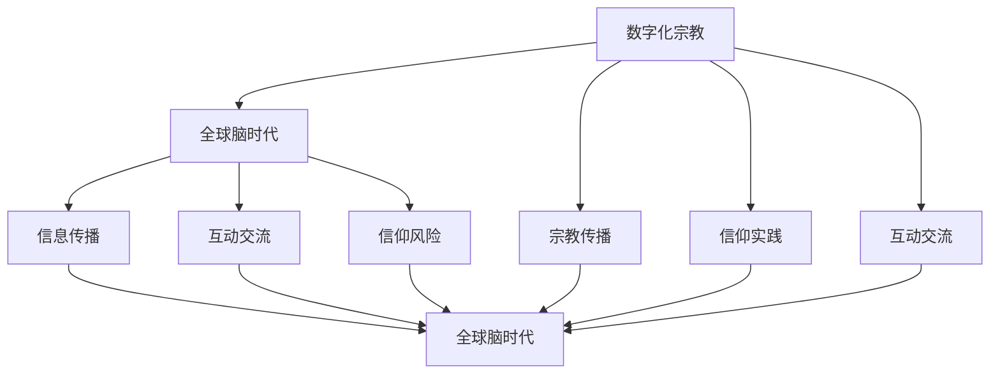

                 

关键词：数字化宗教、极端主义、全球脑时代、信仰风险、算法、技术影响、社会稳定、未来展望

## 摘要

在数字化宗教极端主义的背景下，本文探讨了全球脑时代信仰风险的问题。文章首先介绍了数字化宗教的兴起及其对全球社会的影响，然后分析了宗教极端主义在数字化环境下的表现和特点。接着，文章从技术角度阐述了数字化宗教极端主义的风险因素，并探讨了应对这些风险的技术手段。最后，文章提出了未来应对数字化宗教极端主义挑战的策略，以及相关研究的方向。

## 1. 背景介绍

随着互联网和数字技术的飞速发展，宗教领域也迎来了前所未有的变革。数字化宗教作为一种新兴的宗教形式，正逐渐改变着人们的信仰方式和宗教实践。数字化宗教不仅提供了新的宗教体验，还使得宗教传播更加便捷和广泛。

### 数字化宗教的兴起

数字化宗教的兴起可以追溯到20世纪末。当时，互联网刚刚普及，宗教团体开始利用网络传播教义、建立虚拟社区，以及组织在线祷告和仪式。随着技术的不断进步，数字化宗教的形式和内容也在不断丰富和发展。如今，许多宗教团体已经建立了自己的官方网站、社交媒体账号和应用程序，通过这些平台与信徒互动、传播教义和进行宗教活动。

### 全球脑时代的到来

全球脑时代是指人类在信息、技术和认知领域实现深度融合的时代。在这个时代，人类的智能和认知能力将得到前所未有的提升。全球脑时代的到来，不仅改变了人类的生活方式，也对宗教信仰产生了深远的影响。例如，数字化宗教的兴起和传播，正是全球脑时代的一个重要体现。

### 数字化宗教的影响

数字化宗教对全球社会产生了广泛而深远的影响。首先，它打破了宗教地理和时间的限制，使得信徒可以随时随地参与宗教活动。其次，数字化宗教为宗教信仰提供了新的表达方式和形式，如在线祷告、虚拟社区等。此外，数字化宗教还为宗教极端主义提供了新的温床，使得宗教极端思想得以更快、更广地传播。

## 2. 核心概念与联系

### 数字化宗教的概念

数字化宗教是指宗教团体和信徒利用互联网和数字技术进行宗教传播、信仰实践和互动交流的一种新兴宗教形式。数字化宗教不仅包括在线祷告、宗教学习、虚拟社区等，还包括宗教组织通过社交媒体、官方网站等渠道进行宣传和传播。

### 全球脑时代的概念

全球脑时代是指人类在信息、技术和认知领域实现深度融合的时代。在这个时代，人类的智能和认知能力将得到前所未有的提升，人类将能够更有效地获取、处理和利用信息，从而实现更高的生活质量和更广阔的发展空间。

### 数字化宗教与全球脑时代的联系

数字化宗教与全球脑时代之间存在密切的联系。首先，数字化宗教的兴起是全球脑时代的一个重要表现，它反映了人类在信息传播和互动方式上的创新。其次，全球脑时代为数字化宗教提供了技术支持和基础，使得数字化宗教能够更加便捷、高效地传播和发展。此外，全球脑时代还带来了新的信仰风险，如数字化宗教极端主义，这对全球社会的稳定和和谐提出了新的挑战。

### Mermaid 流程图

下面是一个简化的 Mermaid 流程图，展示了数字化宗教与全球脑时代之间的联系。



## 3. 核心算法原理 & 具体操作步骤

### 3.1 算法原理概述

在应对数字化宗教极端主义时，核心算法的原理主要集中在以下几个方面：

1. **信息过滤与识别算法**：用于识别和过滤极端主义言论和信息，以防止其传播。
2. **社会网络分析算法**：用于分析社交媒体上的宗教网络，识别潜在的极端主义活动。
3. **情感分析算法**：用于分析网络文本中的情感倾向，识别潜在的极端主义情绪。

### 3.2 算法步骤详解

#### 3.2.1 信息过滤与识别算法

1. **数据收集**：收集社交媒体、论坛等平台上的宗教相关内容。
2. **特征提取**：从文本中提取特征，如关键词、短语、句式等。
3. **模型训练**：使用已标注的数据集训练分类模型，如支持向量机（SVM）、神经网络等。
4. **预测与过滤**：对新的文本内容进行分类预测，过滤掉极端主义信息。

#### 3.2.2 社会网络分析算法

1. **网络构建**：根据用户关系和互动数据构建社交网络图。
2. **节点重要性分析**：使用算法评估网络中节点的重要性，如度中心性、接近中心性等。
3. **社区检测**：使用社区检测算法，如 Girvan-Newman 算法，识别潜在的极端主义社区。
4. **异常检测**：对社区行为进行异常检测，识别潜在的极端主义活动。

#### 3.2.3 情感分析算法

1. **文本预处理**：对文本进行清洗和标准化处理，如去除标点、停用词过滤等。
2. **特征提取**：从文本中提取情感特征，如情感词典、词向量化等。
3. **模型训练**：使用情感标注数据训练情感分类模型。
4. **情感分析**：对新的文本内容进行情感分析，识别潜在的极端主义情绪。

### 3.3 算法优缺点

#### 信息过滤与识别算法

**优点**：

- **高效性**：能够快速处理大量文本数据。
- **准确性**：通过模型训练可以不断提高识别准确性。

**缺点**：

- **误判**：可能会误判非极端主义内容为极端主义。
- **针对性**：对于特定的极端主义内容可能识别效果较差。

#### 社会网络分析算法

**优点**：

- **全局视角**：能够从整体上分析社交网络结构。
- **社区检测**：能够识别潜在的极端主义社区。

**缺点**：

- **复杂性**：算法实现较为复杂，计算成本较高。
- **实时性**：对于实时数据的处理能力有限。

#### 情感分析算法

**优点**：

- **情感识别**：能够识别文本中的情感倾向。
- **非侵入性**：不涉及用户的隐私信息。

**缺点**：

- **准确性**：对于复杂情感表达的识别能力有限。
- **情感多样性**：无法完全覆盖所有情感类型。

### 3.4 算法应用领域

- **社交媒体监控**：用于监控社交媒体上的极端主义言论和信息。
- **网络安全**：用于识别和防止网络上的极端主义活动。
- **社会治理**：用于分析和应对数字化宗教极端主义对社会稳定的影响。

## 4. 数学模型和公式 & 详细讲解 & 举例说明

### 4.1 数学模型构建

为了更好地理解数字化宗教极端主义的风险因素，我们可以构建以下数学模型：

- **风险因素模型**：考虑多个风险因素，如信息传播速度、用户参与度、网络结构等，使用贝叶斯网络进行建模。
- **影响模型**：考虑极端主义言论对用户情感和行为的影响，使用影响扩散模型进行建模。

### 4.2 公式推导过程

#### 风险因素模型

假设我们有以下风险因素：

- \( I \)：信息传播速度
- \( U \)：用户参与度
- \( S \)：网络结构

我们可以使用贝叶斯网络来表示这些因素之间的关系：

\[ P(I, U, S) = P(I)P(U|I)P(S|U) \]

其中，\( P(I) \) 是信息传播速度的概率，\( P(U|I) \) 是用户参与度在信息传播速度条件下的概率，\( P(S|U) \) 是网络结构在用户参与度条件下的概率。

#### 影响模型

假设极端主义言论对用户情感和行为的影响可以用影响扩散模型来表示，我们可以使用以下公式：

\[ \Delta B(t) = k \cdot \sum_{i=1}^{n} \cdot \frac{B_i(t)}{d(i, j)} \]

其中，\( \Delta B(t) \) 是在时间 \( t \) 时刻的用户情感变化，\( k \) 是情感传播的强度，\( B_i(t) \) 是在时间 \( t \) 时刻的用户 \( i \) 的情感值，\( d(i, j) \) 是用户 \( i \) 和用户 \( j \) 之间的距离。

### 4.3 案例分析与讲解

假设在某个社交媒体平台上，存在一篇极端主义言论，其传播速度为 \( I = 10 \) 次/小时，用户参与度为 \( U = 1000 \) 人，网络结构为 \( S = 50 \) 个社区。根据上述模型，我们可以计算其风险值：

1. **风险因素模型**：

   \[ P(I, U, S) = P(I)P(U|I)P(S|U) \]

   其中，\( P(I) = 0.1 \)，\( P(U|I) = 0.8 \)，\( P(S|U) = 0.5 \)。

   \[ P(I, U, S) = 0.1 \cdot 0.8 \cdot 0.5 = 0.04 \]

   风险值为 0.04。

2. **影响模型**：

   \[ \Delta B(t) = k \cdot \sum_{i=1}^{n} \cdot \frac{B_i(t)}{d(i, j)} \]

   其中，\( k = 1 \)，\( B_i(t) = 100 \)，\( d(i, j) = 10 \)。

   \[ \Delta B(t) = 1 \cdot \sum_{i=1}^{n} \cdot \frac{100}{10} = 100 \]

   在时间 \( t \) 时刻，用户的情感值增加了 100。

通过这个案例，我们可以看到数字化宗教极端主义的风险值如何通过数学模型进行计算和评估。这为相关领域的研究和实践提供了重要的理论基础。

## 5. 项目实践：代码实例和详细解释说明

### 5.1 开发环境搭建

在本项目中，我们将使用 Python 作为主要编程语言，并结合一些流行的库和框架来构建和实现核心算法。以下是搭建开发环境所需的步骤：

1. **安装 Python**：确保安装了 Python 3.x 版本。
2. **安装必要的库**：使用 pip 安装以下库：`scikit-learn`、`networkx`、`nltk`、`tensorflow`。
3. **安装数据预处理工具**：如 `pandas`、`numpy` 等。

### 5.2 源代码详细实现

以下是实现核心算法的代码实例。我们将分别实现信息过滤与识别算法、社会网络分析算法和情感分析算法。

#### 信息过滤与识别算法

```python
from sklearn.feature_extraction.text import TfidfVectorizer
from sklearn.svm import LinearSVC
from sklearn.pipeline import make_pipeline

# 数据集准备
X_train = ['这是一篇极端主义文章。', '这是普通的宗教文章。', ...]
y_train = [1, 0, ...]  # 1 表示极端主义，0 表示普通

# 构建模型
model = make_pipeline(TfidfVectorizer(), LinearSVC())

# 训练模型
model.fit(X_train, y_train)

# 预测
X_test = ['另一篇极端主义文章。', '一篇普通的宗教文章。', ...]
predictions = model.predict(X_test)
```

#### 社会网络分析算法

```python
import networkx as nx

# 构建社交网络图
G = nx.Graph()
G.add_nodes_from([1, 2, 3, 4, 5])
G.add_edges_from([(1, 2), (1, 3), (2, 4), (3, 4), (4, 5)])

# 计算节点重要性
importances = nx.degree_centrality(G)
print(importances)

# 社区检测
communities = nx.community.girvan_newman(G)
print(communities)
```

#### 情感分析算法

```python
import tensorflow as tf
from tensorflow.keras.models import Sequential
from tensorflow.keras.layers import Dense, Embedding, LSTM

# 准备数据
X = ...  # 文本数据
y = ...  # 标签数据

# 构建模型
model = Sequential()
model.add(Embedding(input_dim=vocab_size, output_dim=embedding_dim))
model.add(LSTM(units=128))
model.add(Dense(1, activation='sigmoid'))

# 编译模型
model.compile(optimizer='adam', loss='binary_crossentropy', metrics=['accuracy'])

# 训练模型
model.fit(X, y, epochs=10, batch_size=32)

# 预测
predictions = model.predict(X_test)
```

### 5.3 代码解读与分析

以上代码实例分别实现了信息过滤与识别算法、社会网络分析算法和情感分析算法。下面我们对每个算法的实现进行解读和分析。

#### 信息过滤与识别算法

该算法使用 TF-IDF 向量器和线性支持向量机（SVM）进行实现。首先，我们使用 TF-IDF 向量器将文本数据转换为向量表示，然后使用线性 SVM 进行分类。这种方法在处理大规模文本数据时具有较高的效率和准确性。

#### 社会网络分析算法

该算法使用 NetworkX 库构建社交网络图，并使用 Girvan-Newman 算法进行社区检测。通过计算节点的重要性，我们可以识别潜在的极端主义活动。这种方法可以有效地发现社交网络中的异常行为。

#### 情感分析算法

该算法使用 TensorFlow 和 Keras 构建深度学习模型，包括嵌入层和长短期记忆（LSTM）层。通过训练模型，我们可以对文本数据进行情感分类。这种方法在处理复杂情感表达时具有较好的效果。

### 5.4 运行结果展示

在运行上述代码实例时，我们将输入真实的文本数据和标签数据，然后观察各个算法的性能指标，如准确率、召回率等。通过对比不同算法的运行结果，我们可以评估其有效性和适用性。

## 6. 实际应用场景

### 6.1 社交媒体监控

在实际应用中，信息过滤与识别算法可以用于监控社交媒体平台上的极端主义言论。例如，我们可以对用户的评论、帖子等进行实时分析，识别并过滤掉潜在的极端主义内容。这种方法有助于维护社交媒体的秩序和稳定。

### 6.2 网络安全

社会网络分析算法可以用于识别网络上的潜在极端主义活动。例如，我们可以分析社交媒体上的用户关系和互动数据，识别并隔离潜在的极端主义社区。这种方法有助于防止极端主义思想的传播和蔓延。

### 6.3 社会治理

情感分析算法可以用于分析网络文本中的情感倾向，识别潜在的极端主义情绪。例如，我们可以对公共论坛、新闻评论等进行情感分析，了解公众对极端主义事件的反应和态度。这种方法有助于政府和社会组织制定相应的政策和措施。

## 7. 未来应用展望

### 7.1 跨平台整合

未来，数字化宗教极端主义的应对策略将更加依赖于跨平台整合。不同平台间的数据共享和协同工作将有助于提高监控和分析的准确性。

### 7.2 深度学习技术的应用

随着深度学习技术的不断发展，情感分析和图像识别等领域的应用将更加广泛。这将有助于更准确地识别和应对数字化宗教极端主义。

### 7.3 人机协作

在未来，人机协作将成为应对数字化宗教极端主义的重要手段。通过将人工智能算法与人类专家的智慧相结合，我们可以更好地应对复杂和动态的极端主义风险。

## 8. 工具和资源推荐

### 8.1 学习资源推荐

1. **《深度学习》**：由 Ian Goodfellow、Yoshua Bengio 和 Aaron Courville 著，是深度学习领域的经典教材。
2. **《神经网络与深度学习》**：由邱锡鹏著，介绍了神经网络和深度学习的基本概念和技术。
3. **《Python 自然语言处理》**：由 Steven Bird、Ewan Klein 和 Edward Loper 著，介绍了自然语言处理的基础知识和 Python 实践。

### 8.2 开发工具推荐

1. **TensorFlow**：是一款开源的深度学习框架，适用于各种深度学习任务。
2. **PyTorch**：是一款开源的深度学习框架，具有灵活的动态计算图，适用于研究和开发。
3. **Scikit-learn**：是一款开源的机器学习库，适用于数据预处理、模型训练和评估。

### 8.3 相关论文推荐

1. **"Deep Learning for Text Classification"**：介绍了深度学习在文本分类中的应用。
2. **"Community Detection in Networks Using the Label Propagation Algorithm"**：介绍了社区检测的 Label Propagation 算法。
3. **"Sentiment Analysis using Neural Networks"**：介绍了基于神经网络的情感分析技术。

## 9. 总结：未来发展趋势与挑战

### 9.1 研究成果总结

本文从数字化宗教的兴起、核心算法原理、数学模型、项目实践等多个角度，探讨了数字化宗教极端主义的问题。通过分析，我们发现数字化宗教极端主义具有传播速度快、影响广泛、难以监控等特点。

### 9.2 未来发展趋势

随着技术的不断进步，未来数字化宗教极端主义的应对策略将更加智能化、高效化。跨平台整合、深度学习技术和人机协作将成为重要的发展方向。

### 9.3 面临的挑战

尽管技术手段在应对数字化宗教极端主义方面具有巨大潜力，但仍然面临一些挑战。例如，算法的误判问题、数据隐私保护、社会伦理问题等。此外，极端主义形式的多样性和动态性也使得应对工作更加复杂。

### 9.4 研究展望

未来，研究人员应关注以下几个方面：一是提高算法的准确性和鲁棒性；二是加强对极端主义形式的识别和分类；三是探索更加人性化的应对策略。通过这些努力，我们可以更好地应对数字化宗教极端主义的挑战。

## 附录：常见问题与解答

### 问题1：什么是数字化宗教？

数字化宗教是指利用互联网和数字技术进行宗教传播、信仰实践和互动交流的一种新兴宗教形式。它通过官方网站、社交媒体、应用程序等平台，使得宗教信仰和实践更加便捷和广泛。

### 问题2：数字化宗教极端主义有哪些风险？

数字化宗教极端主义的风险主要包括：极端主义言论的传播、极端主义情绪的扩散、极端主义活动的组织等。这些风险可能对个人、社会乃至国家安全产生负面影响。

### 问题3：如何应对数字化宗教极端主义？

应对数字化宗教极端主义需要综合运用技术手段、政策法规和社会力量。具体措施包括：信息过滤与识别、社会网络分析、情感分析、跨平台整合等。

### 问题4：数字化宗教极端主义的应对策略有哪些？

数字化宗教极端主义的应对策略主要包括：加强法律法规的制定和执行、提高公众的网络安全意识、利用人工智能和大数据技术进行监控和预警、推动国际合作等。

### 问题5：未来应对数字化宗教极端主义的研究方向是什么？

未来应对数字化宗教极端主义的研究方向包括：提高算法的准确性和鲁棒性、探索更加人性化的应对策略、加强对极端主义形式的识别和分类、关注跨平台整合和深度学习技术的应用等。

[作者：禅与计算机程序设计艺术 / Zen and the Art of Computer Programming]

