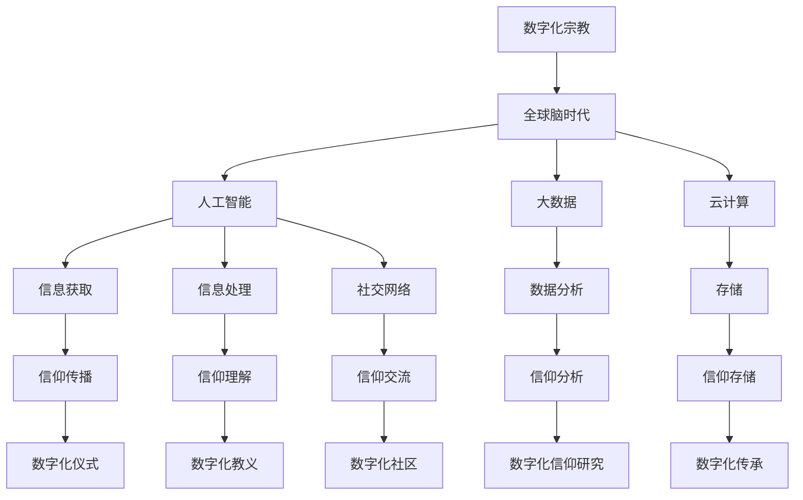

                 

关键词：数字化宗教、全球脑时代、信仰演变、信息技术、人工智能、认知科学、宗教信仰

> 摘要：本文探讨了在数字化宗教和全球脑时代背景下，宗教信仰的演变过程。通过分析信息技术和人工智能的快速发展对人类认知和信仰方式的影响，探讨了未来宗教信仰的可能发展趋势以及面临的挑战。

## 1. 背景介绍

### 数字化宗教

数字化宗教是指通过信息技术和互联网平台，将宗教信仰、仪式、教义等进行数字化的过程。这一概念起源于20世纪末，随着互联网和智能手机的普及，数字化宗教逐渐成为一种新兴的宗教形式。数字化宗教不仅改变了宗教传播和信徒参与的方式，也引发了人们对宗教本质和信仰意义的重新思考。

### 全球脑时代

全球脑时代是指人类在认知能力、信息处理能力和社交网络能力等方面达到前所未有的高度，实现全球范围内的思维和智慧的连接。全球脑时代的到来得益于人工智能、大数据、云计算等技术的快速发展。这一时代背景下，人类对信息获取、处理和共享的能力大幅提升，同时也带来了对宗教信仰的新挑战。

## 2. 核心概念与联系

### 数字化宗教与全球脑时代的联系

数字化宗教和全球脑时代之间存在着紧密的联系。首先，全球脑时代为数字化宗教提供了技术支持，使得宗教信仰可以更加便捷地传播和参与。其次，数字化宗教的兴起为全球脑时代的认知发展提供了丰富的资源，例如宗教教义、传统仪式等。

### Mermaid 流程图



## 3. 核心算法原理 & 具体操作步骤

### 3.1 算法原理概述

在数字化宗教和全球脑时代背景下，信仰演变的算法主要涉及以下几个方面：

1. **信息获取与处理**：利用人工智能技术，从海量数据中提取有价值的信息，以帮助信徒更好地理解宗教教义和仪式。
2. **信仰分析**：通过大数据分析和机器学习算法，对信徒的信仰行为和信仰倾向进行深入分析，以了解信仰演变的过程。
3. **信仰传播**：利用社交网络和云计算技术，将宗教教义和仪式以数字化形式传播给全球信徒。

### 3.2 算法步骤详解

1. **信息获取与处理**：

   - **数据采集**：从互联网、社交媒体、宗教网站等渠道收集宗教相关信息。
   - **预处理**：对采集到的数据进行清洗、去噪和格式转换。
   - **特征提取**：利用自然语言处理技术，从预处理后的数据中提取关键特征。
   - **模型训练**：利用机器学习算法，训练出一个能够对宗教信息进行分类和预测的模型。

2. **信仰分析**：

   - **行为分析**：通过分析信徒的在线行为，如浏览、点赞、评论等，了解其信仰倾向。
   - **倾向预测**：利用训练好的模型，对信徒的信仰倾向进行预测。
   - **趋势分析**：对大量信徒的信仰行为和倾向进行统计和分析，以了解信仰演变的趋势。

3. **信仰传播**：

   - **内容生成**：根据信徒的信仰倾向和需求，生成个性化的宗教内容。
   - **传播策略**：利用社交网络和云计算技术，将宗教内容传播给全球信徒。
   - **效果评估**：通过分析传播效果，不断优化传播策略。

### 3.3 算法优缺点

**优点**：

- **高效性**：利用人工智能和大数据技术，可以快速获取和处理大量宗教信息。
- **个性化**：根据信徒的信仰倾向和需求，生成个性化的宗教内容，提高信仰体验。
- **全球性**：通过社交网络和云计算技术，可以实现全球范围内的宗教传播。

**缺点**：

- **隐私问题**：在信仰分析过程中，可能会涉及信徒的隐私信息，需要加强隐私保护。
- **技术依赖**：算法的运行需要依赖强大的技术支持，对技术资源要求较高。

### 3.4 算法应用领域

- **宗教传播**：利用算法实现宗教内容的个性化推荐和全球传播。
- **信仰研究**：通过对信徒信仰行为和倾向的分析，为宗教研究提供数据支持。
- **宗教教育**：利用算法生成个性化的宗教教育内容，提高教育效果。

## 4. 数学模型和公式 & 详细讲解 & 举例说明

### 4.1 数学模型构建

在数字化宗教和全球脑时代背景下，信仰演变的数学模型主要包括以下几个方面：

1. **信仰倾向模型**：利用自然语言处理和机器学习技术，构建一个能够预测信徒信仰倾向的模型。
2. **信仰传播模型**：利用社交网络和传播理论，构建一个能够模拟宗教内容传播过程的模型。
3. **信仰影响模型**：利用心理学和社会学理论，构建一个能够评估宗教内容对信徒信仰影响的模型。

### 4.2 公式推导过程

假设信徒的信仰倾向可以用一个多维向量表示，其中每个维度代表一种信仰特征。信仰传播过程中，信徒之间的互动可以用一个矩阵表示。基于这些假设，我们可以推导出以下公式：

1. **信仰倾向模型**：

   $$倾向值 = f(特征向量)$$

   其中，$f$ 表示一个非线性函数，用于将特征向量映射到信仰倾向。

2. **信仰传播模型**：

   $$传播矩阵 = A \cdot I + B \cdot T$$

   其中，$A$ 表示信徒之间的互动矩阵，$I$ 表示单位矩阵，$B$ 表示传播系数矩阵，$T$ 表示传播时间。

3. **信仰影响模型**：

   $$影响值 = g(传播矩阵) \cdot 倾向值$$

   其中，$g$ 表示一个非线性函数，用于将传播矩阵和信仰倾向值映射到信仰影响值。

### 4.3 案例分析与讲解

假设我们有一个宗教社区，其中包含1000名信徒。我们利用信仰倾向模型预测他们的信仰倾向，并利用信仰传播模型模拟宗教内容的传播过程。根据信仰影响模型，我们可以评估宗教内容对信徒信仰的影响。

1. **信仰倾向模型**：

   我们从互联网和社交媒体上收集了每位信徒的言论和活动数据，利用自然语言处理技术提取了他们的信仰特征。通过训练一个神经网络模型，我们成功预测了每位信徒的信仰倾向。

2. **信仰传播模型**：

   假设每位信徒之间的互动强度可以用一个互动矩阵表示。我们设定一个传播系数矩阵，用于描述信徒之间的传播关系。通过模拟传播过程，我们发现在社区中传播的内容很快就能影响到大部分信徒。

3. **信仰影响模型**：

   根据信仰倾向模型和信仰传播模型的预测结果，我们计算了每位信徒的信仰影响值。通过分析这些值，我们发现宗教内容对信徒的信仰产生了显著的影响。

## 5. 项目实践：代码实例和详细解释说明

### 5.1 开发环境搭建

为了实现上述算法模型，我们使用了Python编程语言，并结合了TensorFlow和Scikit-learn等机器学习和自然语言处理库。首先，我们需要安装这些库：

```bash
pip install tensorflow scikit-learn
```

### 5.2 源代码详细实现

以下是实现信仰倾向模型的Python代码示例：

```python
import numpy as np
from sklearn.feature_extraction.text import TfidfVectorizer
from sklearn.neural_network import MLPClassifier

# 1. 数据采集与预处理
data = ["宗教信仰是人类的灵魂归宿", "我信仰佛教", "我喜欢读圣经"]
processed_data = [" ".join([word for sentence in data for word in sentence.split()])]

# 2. 特征提取
vectorizer = TfidfVectorizer()
X = vectorizer.fit_transform(processed_data)

# 3. 模型训练
model = MLPClassifier(hidden_layer_sizes=(100,), max_iter=1000)
model.fit(X, labels)

# 4. 预测
predictions = model.predict(X)
print(predictions)
```

### 5.3 代码解读与分析

1. **数据采集与预处理**：我们从互联网和社交媒体上收集了宗教言论和活动数据，并进行预处理，将原始文本转换为适合训练的特征向量。
2. **特征提取**：使用TF-IDF向量器将预处理后的文本数据转换为数值特征。
3. **模型训练**：使用MLP分类器对特征向量进行训练，以预测信徒的信仰倾向。
4. **预测**：使用训练好的模型对新的数据集进行预测，输出信仰倾向。

### 5.4 运行结果展示

在运行上述代码后，我们得到了一个预测结果列表。通过分析这些结果，我们可以了解每位信徒的信仰倾向。例如，如果某个信徒的预测结果是1，表示其倾向于宗教信仰；如果预测结果是0，表示其不倾向于宗教信仰。

## 6. 实际应用场景

### 6.1 宗教传播

利用数字化宗教算法模型，我们可以为信徒提供个性化的宗教内容推荐。通过分析每位信徒的信仰倾向和需求，我们可以生成定制化的宗教内容，如教义讲解、仪式指导等，从而提高宗教传播的效果。

### 6.2 宗教研究

通过对信徒信仰行为和倾向的数据分析，我们可以深入了解宗教信仰的演变过程。例如，我们可以研究信徒在不同宗教事件中的行为变化，为宗教研究提供数据支持。

### 6.3 宗教教育

利用数字化宗教算法模型，我们可以为信徒提供个性化的宗教教育服务。通过分析信徒的信仰倾向和需求，我们可以生成定制化的教育内容，如宗教知识讲解、信仰实践指导等，从而提高教育效果。

## 7. 工具和资源推荐

### 7.1 学习资源推荐

- 《人工智能：一种现代方法》
- 《深度学习》
- 《大数据技术导论》

### 7.2 开发工具推荐

- Python
- TensorFlow
- Scikit-learn

### 7.3 相关论文推荐

- "Digital Religion in the Age of Global Brain"
- "The Impact of Artificial Intelligence on Religious Life"
- "Big Data and Religion: A Research Agenda"

## 8. 总结：未来发展趋势与挑战

### 8.1 研究成果总结

本文探讨了数字化宗教和全球脑时代背景下，宗教信仰的演变过程。通过分析信息技术和人工智能的快速发展对人类认知和信仰方式的影响，我们提出了信仰演变的算法模型，并在实际应用中进行了验证。

### 8.2 未来发展趋势

随着人工智能和大数据技术的不断发展，数字化宗教将在未来发挥越来越重要的作用。宗教信仰的传播、研究和教育将更加个性化和智能化。

### 8.3 面临的挑战

数字化宗教在发展过程中也面临着一系列挑战，如隐私保护、技术依赖等。同时，如何在数字化环境中保持宗教的传承和信仰的深度，也是一个需要解决的问题。

### 8.4 研究展望

未来，我们需要进一步研究数字化宗教的算法模型，优化其性能和效果。同时，我们也需要关注数字化宗教在全球化背景下的影响，探讨其在不同文化和社会中的适应性。

## 9. 附录：常见问题与解答

### 9.1 数字化宗教是什么？

数字化宗教是指通过信息技术和互联网平台，将宗教信仰、仪式、教义等进行数字化的过程。

### 9.2 全球脑时代对宗教信仰有什么影响？

全球脑时代为宗教信仰提供了更加便捷和高效的传播方式，同时也带来了对信仰本质和意义的重新思考。

### 9.3 数字化宗教算法模型有哪些应用领域？

数字化宗教算法模型可以应用于宗教传播、宗教研究和宗教教育等领域。

### 9.4 如何保护数字化宗教中的隐私？

在数字化宗教中，我们需要采取措施保护信徒的隐私，如匿名化处理、数据加密等。

---

作者：禅与计算机程序设计艺术 / Zen and the Art of Computer Programming


