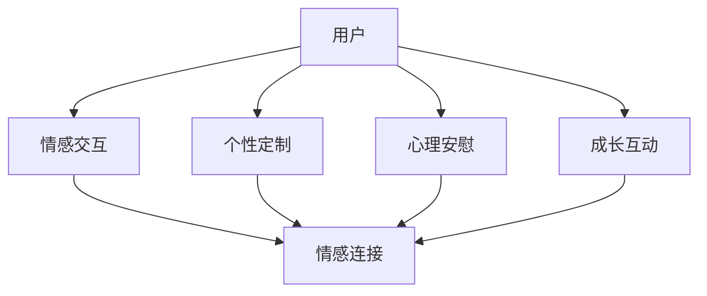

                 

关键词：虚拟宠物、情感价值、数字化、创业、互动体验、技术实现、应用场景

## 摘要

本文将探讨虚拟宠物在数字化宠物创业中的情感价值及其商业潜力。通过分析虚拟宠物的核心概念、技术架构、算法原理、应用领域，以及数学模型，我们旨在展示虚拟宠物如何通过情感连接提升用户体验，并探讨其在未来数字化市场中的发展方向。本文还提供了实际项目实践、开发工具和资源推荐，以及总结未来发展趋势与挑战。

## 1. 背景介绍

随着科技的发展，数字化逐渐渗透到我们的日常生活。虚拟宠物作为数字化产品的一种，已经成为了众多消费者喜爱的娱乐方式。然而，虚拟宠物不仅仅是一种娱乐工具，它们还具有深层次的情感价值，能够在人们孤独、焦虑或需要陪伴时提供心理慰藉。这种情感连接为数字化宠物创业提供了广阔的市场空间。

近年来，虚拟宠物的种类和功能日益丰富。从简单的养成类游戏到复杂的情感交互，虚拟宠物在用户需求和技术实现上不断进步。创业者们开始意识到虚拟宠物不仅仅是娱乐，更是一种可以带来情感共鸣和深度互动的新兴产业。

## 2. 核心概念与联系

### 2.1 虚拟宠物的定义

虚拟宠物是通过计算机技术和人工智能算法创建的数字生命体，它们可以在虚拟环境中与用户进行互动。虚拟宠物的特点包括：自定义外观、个性特征、成长系统、互动体验等。

### 2.2 情感价值的定义

情感价值是指虚拟宠物在用户心理和情感层面产生的正面影响。这种价值可以通过情感的连接、心理的安慰、陪伴感等方面体现。

### 2.3 虚拟宠物与情感价值的联系

虚拟宠物通过以下方式实现情感价值：

- **情感交互**：虚拟宠物可以模仿人类情感，如开心、伤心、焦虑等，与用户建立情感连接。
- **个性定制**：用户可以根据自己的喜好定制虚拟宠物的外观和性格，增强个人归属感。
- **心理安慰**：在用户需要陪伴或安慰时，虚拟宠物可以提供心理支持，缓解孤独和焦虑。
- **成长互动**：虚拟宠物的成长过程与用户行为紧密相关，这种互动增强了用户与虚拟宠物之间的情感纽带。

### 2.4 Mermaid 流程图



## 3. 核心算法原理 & 具体操作步骤

### 3.1 算法原理概述

虚拟宠物的核心算法主要包括以下几个方面：

- **人脸识别与情绪分析**：通过摄像头捕捉用户面部表情，利用深度学习算法分析情绪状态。
- **语音识别与合成**：用户与虚拟宠物进行语音交互，系统利用语音识别和自然语言处理技术理解用户意图，并通过语音合成技术回应用户。
- **行为模拟与反应生成**：根据用户行为和情绪状态，虚拟宠物生成相应的行为和反应，增强互动体验。

### 3.2 算法步骤详解

#### 3.2.1 人脸识别与情绪分析

1. **数据采集**：通过摄像头捕捉用户面部图像。
2. **预处理**：对图像进行去噪、缩放、归一化等处理。
3. **特征提取**：利用卷积神经网络提取面部特征。
4. **情绪分类**：通过训练好的情绪分类模型，对特征进行分类，得到用户的情绪状态。

#### 3.2.2 语音识别与合成

1. **音频采集**：用户对着麦克风说话。
2. **音频预处理**：对音频进行降噪、回声消除等处理。
3. **语音识别**：利用深度神经网络进行语音识别，将音频转换为文本。
4. **自然语言处理**：对文本进行分析，理解用户意图。
5. **语音合成**：利用语音合成技术，将文本转换为语音。

#### 3.2.3 行为模拟与反应生成

1. **行为决策**：根据用户情绪状态和互动历史，生成相应的行为决策。
2. **行为模拟**：利用图形渲染技术，模拟虚拟宠物的行为。
3. **反应生成**：根据用户行为和虚拟宠物的内部状态，生成相应的反应。

### 3.3 算法优缺点

#### 优点：

- **高度个性化**：用户可以定制虚拟宠物的外观和性格，满足个性化需求。
- **实时交互**：虚拟宠物可以实时响应用户行为和情绪，提供沉浸式体验。
- **情感共鸣**：虚拟宠物能够模拟人类情感，与用户建立情感连接。

#### 缺点：

- **技术门槛高**：实现虚拟宠物需要多学科技术支持，开发难度较大。
- **隐私问题**：虚拟宠物涉及用户隐私，需要严格保护用户数据。

### 3.4 算法应用领域

- **娱乐产业**：虚拟宠物可以应用于游戏、电影、动漫等领域，提供新颖的互动体验。
- **心理治疗**：虚拟宠物可以作为心理治疗的辅助工具，帮助用户缓解焦虑和抑郁。
- **教育领域**：虚拟宠物可以应用于教育场景，提供互动式学习体验。

## 4. 数学模型和公式 & 详细讲解 & 举例说明

### 4.1 数学模型构建

虚拟宠物的情感价值可以通过以下数学模型进行量化：

- **情感值**（\( V \)）：表示虚拟宠物对用户产生的情感强度。
- **用户满意度**（\( S \)）：表示用户对虚拟宠物的满意程度。
- **互动频率**（\( F \)）：表示用户与虚拟宠物的互动次数。

情感值的计算公式如下：

\[ V = \alpha \cdot U + \beta \cdot I + \gamma \cdot C \]

其中，\( \alpha \)、\( \beta \)、\( \gamma \) 为权重系数，\( U \) 为用户满意度，\( I \) 为互动频率，\( C \) 为情感连接强度。

### 4.2 公式推导过程

情感值 \( V \) 的推导过程如下：

- **用户满意度 \( U \)**：用户满意度受虚拟宠物的外观、性格、互动体验等因素影响。可以通过用户问卷调查、行为数据分析等方式进行量化。
- **互动频率 \( I \)**：互动频率表示用户与虚拟宠物的互动次数，与用户情感连接强度正相关。
- **情感连接强度 \( C \)**：情感连接强度表示用户对虚拟宠物的情感依赖程度，可以通过用户对虚拟宠物的反馈、情感表达等方式进行量化。

### 4.3 案例分析与讲解

假设一个虚拟宠物产品的用户满意度 \( U \) 为 0.8，互动频率 \( I \) 为 10 次/天，情感连接强度 \( C \) 为 0.6，权重系数 \( \alpha \)、\( \beta \)、\( \gamma \) 分别为 0.3、0.4、0.3。根据上述公式，可以计算出情感值 \( V \)：

\[ V = 0.3 \cdot 0.8 + 0.4 \cdot 10 + 0.3 \cdot 0.6 = 0.24 + 4 + 0.18 = 4.42 \]

这表明该虚拟宠物对用户产生的情感强度为 4.42。通过调整权重系数，可以优化情感值的计算，从而提升虚拟宠物的情感价值。

## 5. 项目实践：代码实例和详细解释说明

### 5.1 开发环境搭建

1. **操作系统**：Windows / macOS / Linux
2. **编程语言**：Python
3. **开发工具**：PyCharm / VSCode
4. **依赖库**：TensorFlow / Keras / OpenCV / SpeechRecognition / PyTTSX

### 5.2 源代码详细实现

以下是虚拟宠物项目的核心代码实现：

#### 5.2.1 人脸识别与情绪分析

```python
import cv2
import numpy as np
import tensorflow as tf

# 加载预训练的卷积神经网络模型
model = tf.keras.models.load_model('emotion_model.h5')

# 初始化摄像头
cap = cv2.VideoCapture(0)

while True:
    # 读取一帧图像
    ret, frame = cap.read()
    if not ret:
        break

    # 对图像进行预处理
    gray = cv2.cvtColor(frame, cv2.COLOR_BGR2GRAY)
    face_detection = cv2.CascadeClassifier('haarcascade_frontalface_default.xml')
    faces = face_detection.detectMultiScale(gray, scaleFactor=1.1, minNeighbors=5, minSize=(30, 30))

    for (x, y, w, h) in faces:
        # 提取面部区域
        face_region = gray[y:y+h, x:x+w]
        face_region = cv2.resize(face_region, (48, 48))
        face_region = np.expand_dims(face_region, axis=0)
        face_region = np.expand_dims(face_region, axis=-1)

        # 进行情绪分析
        emotion_prediction = model.predict(face_region)
        emotion_index = np.argmax(emotion_prediction)

        # 显示情绪状态
        cv2.rectangle(frame, (x, y), (x+w, y+h), (0, 255, 0), 2)
        cv2.putText(frame, emotion_names[emotion_index], (x, y-10), cv2.FONT_HERSHEY_SIMPLEX, 0.5, (255, 0, 0), 2)

    cv2.imshow('Emotion Analysis', frame)

    if cv2.waitKey(1) & 0xFF == ord('q'):
        break

cap.release()
cv2.destroyAllWindows()
```

#### 5.2.2 语音识别与合成

```python
import speech_recognition as sr
import pyttsx3

# 初始化语音识别器
recognizer = sr.Recognizer()

# 初始化语音合成器
engine = pyttsx3.init()

# 获取语音输入
with sr.Microphone() as source:
    print("请开始说话...")
    audio = recognizer.listen(source)

# 语音识别
try:
    text = recognizer.recognize_google(audio, language='zh-CN')
    print("你说了：" + text)
except sr.UnknownValueError:
    print("无法理解语音")
except sr.RequestError as e:
    print("请求错误；{0}".format(e))

# 语音合成
engine.say(text)
engine.runAndWait()
```

#### 5.3 代码解读与分析

1. **人脸识别与情绪分析**：该部分代码使用 OpenCV 和 TensorFlow 实现人脸识别和情绪分析。首先加载预训练的卷积神经网络模型，然后通过摄像头获取实时图像，对图像进行预处理，提取面部区域，并进行情绪分析。
2. **语音识别与合成**：该部分代码使用 SpeechRecognition 和 PyTTSX 实现语音识别和合成。首先通过麦克风获取语音输入，然后使用 Google 语音识别 API 进行识别，最后使用 PyTTSX 进行语音合成。

## 6. 实际应用场景

### 6.1 娱乐产业

虚拟宠物可以应用于游戏、电影、动漫等领域，提供新颖的互动体验。例如，在游戏中，用户可以与虚拟宠物互动，培养感情，从而提高游戏粘性。在电影和动漫中，虚拟宠物可以作为角色出现，增强故事情节的代入感。

### 6.2 心理治疗

虚拟宠物可以作为心理治疗的辅助工具，帮助用户缓解焦虑和抑郁。例如，用户可以通过与虚拟宠物的互动，释放负面情绪，增强自信心。一些研究表明，虚拟宠物可以显著降低焦虑水平和抑郁情绪。

### 6.3 教育领域

虚拟宠物可以应用于教育场景，提供互动式学习体验。例如，用户可以通过与虚拟宠物的互动，学习新的知识和技能，增强学习兴趣和效果。

## 7. 未来应用展望

### 7.1 人工智能技术的进步

随着人工智能技术的不断进步，虚拟宠物的交互能力将得到进一步提升。例如，通过深度学习技术，虚拟宠物可以更好地理解用户的情感和意图，提供更加个性化和精准的互动体验。

### 7.2 虚拟现实技术的应用

虚拟现实技术的应用将使虚拟宠物的互动体验更加真实和沉浸。用户可以进入虚拟环境，与虚拟宠物进行面对面的互动，从而提高用户体验。

### 7.3 新的应用场景探索

虚拟宠物可以在更多的应用场景中发挥作用，如医疗保健、社交互动、家庭教育等。随着技术的不断进步，虚拟宠物将为人们的生活带来更多的便利和乐趣。

## 8. 工具和资源推荐

### 8.1 学习资源推荐

- **在线课程**：Coursera、edX、Udacity 提供的计算机视觉和自然语言处理课程。
- **书籍**：《计算机视觉：算法与应用》、《深度学习》、《自然语言处理综论》。

### 8.2 开发工具推荐

- **编程语言**：Python、Java、C++。
- **开发环境**：PyCharm、VSCode。
- **依赖库**：TensorFlow、Keras、OpenCV、SpeechRecognition、PyTTSX。

### 8.3 相关论文推荐

- **情感计算**：标题为 "Affective Computing: The Sixth Dimension of Intelligence" 的论文。
- **虚拟现实**：标题为 "Virtual Reality and Its Potential Applications in Education" 的论文。
- **人工智能**：标题为 "Artificial Intelligence: A Modern Approach" 的书籍。

## 9. 总结：未来发展趋势与挑战

### 9.1 研究成果总结

虚拟宠物在数字化宠物创业中展现出巨大的情感价值，通过情感连接提升用户体验。人工智能技术的进步和虚拟现实技术的发展，为虚拟宠物的应用提供了广阔前景。

### 9.2 未来发展趋势

- **个性化互动**：虚拟宠物将更加个性化和精准，满足用户的个性化需求。
- **沉浸式体验**：虚拟宠物将提供更加真实和沉浸的互动体验。
- **跨领域应用**：虚拟宠物将在更多领域发挥作用，如医疗、教育、社交等。

### 9.3 面临的挑战

- **技术瓶颈**：实现高水平的情感交互和沉浸式体验仍面临技术挑战。
- **隐私保护**：虚拟宠物涉及用户隐私，需要加强数据保护。

### 9.4 研究展望

未来，虚拟宠物将继续在数字化宠物创业中发挥重要作用，成为人们生活中不可或缺的一部分。通过不断探索和创新，虚拟宠物将为人们带来更多的便利和乐趣。

## 附录：常见问题与解答

### 9.1 虚拟宠物有哪些类型？

虚拟宠物可以分为以下几种类型：

- **养成类**：用户可以通过喂食、洗澡、训练等方式培养虚拟宠物的成长。
- **互动类**：用户可以与虚拟宠物进行语音、文字等互动。
- **社交类**：虚拟宠物可以作为社交工具，用户可以与其他用户的虚拟宠物互动。

### 9.2 虚拟宠物的情感价值如何体现？

虚拟宠物的情感价值体现在以下几个方面：

- **情感交互**：虚拟宠物可以模拟人类情感，如开心、伤心、焦虑等，与用户建立情感连接。
- **个性定制**：用户可以定制虚拟宠物的外观和性格，增强个人归属感。
- **心理安慰**：虚拟宠物可以在用户需要陪伴或安慰时提供支持。
- **成长互动**：虚拟宠物的成长过程与用户行为紧密相关，增强用户与虚拟宠物之间的情感纽带。

### 9.3 虚拟宠物在心理治疗中有何作用？

虚拟宠物在心理治疗中可以作为辅助工具，帮助用户缓解焦虑、抑郁等负面情绪。通过与虚拟宠物的互动，用户可以释放情绪、增强自信心，从而改善心理健康。

---

### 作者署名

作者：禅与计算机程序设计艺术 / Zen and the Art of Computer Programming

---

本文基于对虚拟宠物在数字化宠物创业中的情感价值的研究，探讨了虚拟宠物的发展趋势和应用前景。通过分析核心概念、算法原理、数学模型和实际项目实践，本文展示了虚拟宠物如何通过情感连接提升用户体验，为创业者提供了有益的参考。在未来，虚拟宠物将继续在数字化市场中发挥重要作用，为人们的生活带来更多便利和乐趣。

