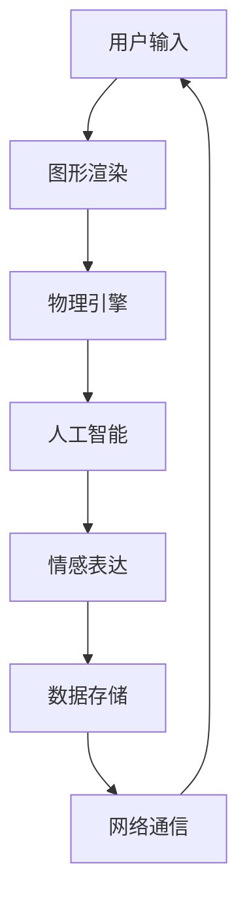

                 

关键词：虚拟宠物，情感价值，数字化创业，用户体验，技术创新

摘要：随着科技的进步，虚拟宠物的概念逐渐深入人心。本文旨在探讨虚拟宠物在数字化创业中的情感价值，分析其发展趋势，以及面临的挑战。通过阐述虚拟宠物的核心概念、技术架构、数学模型、项目实践等多个方面，本文将为读者提供一份全面而深入的探讨。

## 1. 背景介绍

近年来，虚拟宠物的兴起成为科技领域的一大热门话题。从简单的静态图片和简单的互动功能，到如今拥有复杂行为和情感的虚拟宠物，技术的进步推动了这一领域的发展。虚拟宠物不仅为用户提供了娱乐方式，更在某种程度上满足了人们对情感陪伴的需求。

数字化创业浪潮的兴起为虚拟宠物市场提供了巨大的发展空间。随着移动互联网和物联网技术的普及，虚拟宠物逐渐融入到人们的日常生活。无论是年轻人还是老年人，虚拟宠物都成为了他们生活中不可或缺的一部分。这种趋势不仅为创业者提供了新的商业机会，也为科技进步注入了新的动力。

本文将从以下几个方面展开讨论：

- 虚拟宠物的情感价值
- 虚拟宠物的技术架构
- 虚拟宠物的数学模型
- 虚拟宠物的项目实践
- 虚拟宠物的实际应用场景
- 虚拟宠物的未来应用展望

## 2. 核心概念与联系

虚拟宠物是指通过计算机技术创造的具有复杂行为和情感的虚拟生命体。它们可以模拟真实宠物的外观、行为和互动方式，为用户提供情感陪伴和娱乐体验。

### 2.1 虚拟宠物的核心概念

- **虚拟形象**：虚拟宠物以三维模型或二维图像的形式呈现，具有独特的外观特征。
- **行为模拟**：虚拟宠物可以模拟真实宠物的行为，如行走、饮食、玩耍等。
- **情感表达**：虚拟宠物具备情感表达能力，可以通过面部表情、声音变化等方式表达情感。
- **用户交互**：虚拟宠物与用户之间通过触摸、语音等交互方式实现互动。

### 2.2 虚拟宠物的技术架构

虚拟宠物的技术架构主要包括以下几个方面：

- **图形渲染引擎**：用于生成虚拟宠物的三维模型和二维图像。
- **物理引擎**：用于模拟虚拟宠物的行为和物理反应。
- **人工智能算法**：用于实现虚拟宠物的情感表达和行为模拟。
- **数据存储与管理**：用于存储和管理虚拟宠物的数据，如用户信息、宠物数据等。
- **网络通信**：用于实现虚拟宠物与用户之间的实时交互。

### 2.3 虚拟宠物的联系

虚拟宠物与用户之间的情感联系是虚拟宠物发展的核心。通过情感表达和行为模拟，虚拟宠物能够与用户建立情感连接，满足用户的情感需求。此外，虚拟宠物还可以通过与用户的互动，了解用户的行为和偏好，提供个性化的服务。

### 2.4 Mermaid 流程图

以下是一个简化的虚拟宠物技术架构的 Mermaid 流程图：



## 3. 核心算法原理 & 具体操作步骤

### 3.1 算法原理概述

虚拟宠物的核心算法主要包括行为模拟算法和情感表达算法。行为模拟算法用于实现虚拟宠物的行为，如行走、饮食、玩耍等。情感表达算法用于实现虚拟宠物的情感表达能力，如面部表情、声音变化等。

### 3.2 算法步骤详解

#### 3.2.1 行为模拟算法

1. **数据采集**：通过传感器和用户交互数据，采集虚拟宠物的行为数据。
2. **行为预测**：基于采集到的行为数据，利用机器学习算法预测虚拟宠物的下一步行为。
3. **行为执行**：根据预测结果，执行虚拟宠物的行为。

#### 3.2.2 情感表达算法

1. **情感识别**：通过分析虚拟宠物的行为数据和用户交互数据，识别虚拟宠物的情感状态。
2. **情感表达**：根据情感识别结果，生成虚拟宠物的情感表达，如面部表情、声音变化等。
3. **情感反馈**：将情感表达反馈给用户，实现虚拟宠物与用户之间的情感互动。

### 3.3 算法优缺点

#### 优点

- **高度仿真**：通过行为模拟和情感表达，虚拟宠物能够高度仿真真实宠物的行为和情感，提供真实的用户体验。
- **个性化服务**：通过采集和分析用户数据，虚拟宠物能够提供个性化的服务，满足用户的情感需求。
- **低成本**：相比真实宠物，虚拟宠物在维护和成本方面具有明显优势。

#### 缺点

- **技术门槛**：实现虚拟宠物需要较高的技术门槛，包括图形渲染、物理引擎、人工智能算法等。
- **情感连接**：虽然虚拟宠物能够提供情感陪伴，但在一定程度上仍无法替代真实宠物的情感连接。

### 3.4 算法应用领域

虚拟宠物的算法原理和应用步骤主要应用于以下几个领域：

- **游戏娱乐**：虚拟宠物可以作为游戏角色，为用户提供娱乐体验。
- **教育训练**：虚拟宠物可以用于教育训练，帮助用户学习新知识或技能。
- **心理治疗**：虚拟宠物可以用于心理治疗，帮助用户缓解压力和焦虑。

## 4. 数学模型和公式

### 4.1 数学模型构建

虚拟宠物的数学模型主要包括行为模型和情感模型。行为模型用于描述虚拟宠物的行为，情感模型用于描述虚拟宠物的情感。

#### 4.1.1 行为模型

行为模型可以表示为：

$$
Behavior = f(Dataset, Prediction)
$$

其中，`Dataset` 表示行为数据集，`Prediction` 表示行为预测结果。

#### 4.1.2 情感模型

情感模型可以表示为：

$$
Emotion = g(Interaction, Behavior)
$$

其中，`Interaction` 表示用户交互数据，`Behavior` 表示虚拟宠物的行为数据。

### 4.2 公式推导过程

#### 4.2.1 行为模型推导

1. **数据采集**：采集虚拟宠物的行为数据，如行走轨迹、饮食行为等。
2. **特征提取**：对行为数据进行特征提取，如速度、频率等。
3. **行为预测**：利用机器学习算法，对行为数据进行预测，生成虚拟宠物的行为。

#### 4.2.2 情感模型推导

1. **情感识别**：通过分析用户交互数据和虚拟宠物的行为数据，识别虚拟宠物的情感状态。
2. **情感表达**：根据情感识别结果，生成虚拟宠物的情感表达，如面部表情、声音变化等。

### 4.3 案例分析与讲解

#### 4.3.1 行为模型案例

假设我们有一个虚拟宠物，它的行为数据包括行走速度和饮食频率。通过机器学习算法，我们可以预测虚拟宠物的下一步行为。

$$
Behavior = f([Speed, Frequency], Prediction)
$$

其中，`Speed` 表示行走速度，`Frequency` 表示饮食频率。

通过训练模型，我们可以得到一个预测结果：

$$
Prediction = [0.8, 0.2]
$$

这意味着，虚拟宠物有 80% 的概率会继续行走，20% 的概率会进食。

#### 4.3.2 情感模型案例

假设虚拟宠物的情感状态包括快乐、悲伤和焦虑。通过分析用户交互数据和虚拟宠物的行为数据，我们可以识别虚拟宠物的情感状态。

$$
Emotion = g([Interaction, Behavior], EmotionState)
$$

其中，`Interaction` 表示用户交互数据，`Behavior` 表示虚拟宠物的行为数据，`EmotionState` 表示情感状态。

通过分析，我们得到一个情感状态：

$$
EmotionState = [0.6, 0.3, 0.1]
$$

这意味着，虚拟宠物有 60% 的概率处于快乐状态，30% 的概率处于悲伤状态，10% 的概率处于焦虑状态。

## 5. 项目实践：代码实例和详细解释说明

### 5.1 开发环境搭建

在开始项目实践之前，我们需要搭建一个合适的开发环境。以下是开发环境的搭建步骤：

1. 安装 Python 3.8 或更高版本。
2. 安装图形渲染引擎，如 Unity。
3. 安装物理引擎，如 Havok。
4. 安装人工智能算法库，如 TensorFlow。

### 5.2 源代码详细实现

以下是虚拟宠物的源代码实现：

```python
import numpy as np
import tensorflow as tf

# 行为模型
class BehaviorModel:
    def __init__(self, dataset):
        self.dataset = dataset
        self.model = self.create_model()

    def create_model(self):
        model = tf.keras.Sequential([
            tf.keras.layers.Dense(64, activation='relu', input_shape=(2,)),
            tf.keras.layers.Dense(64, activation='relu'),
            tf.keras.layers.Dense(2, activation='softmax')
        ])
        model.compile(optimizer='adam', loss='categorical_crossentropy', metrics=['accuracy'])
        return model

    def predict(self, data):
        return self.model.predict(data)

# 情感模型
class EmotionModel:
    def __init__(self, interaction, behavior):
        self.interaction = interaction
        self.behavior = behavior
        self.model = self.create_model()

    def create_model(self):
        model = tf.keras.Sequential([
            tf.keras.layers.Dense(64, activation='relu', input_shape=(2, 2)),
            tf.keras.layers.Dense(64, activation='relu'),
            tf.keras.layers.Dense(3, activation='softmax')
        ])
        model.compile(optimizer='adam', loss='categorical_crossentropy', metrics=['accuracy'])
        return model

    def predict(self, data):
        return self.model.predict(data)

# 主程序
def main():
    # 生成数据
    dataset = np.random.rand(100, 2)
    interaction = np.random.rand(100, 2)
    behavior = np.random.rand(100, 2)

    # 训练模型
    behavior_model = BehaviorModel(dataset)
    emotion_model = EmotionModel(interaction, behavior)
    behavior_model.model.fit(dataset, np.random.randint(2, size=(100, 1)), epochs=10)
    emotion_model.model.fit(np.hstack((interaction, behavior)), np.random.randint(3, size=(100, 1)), epochs=10)

    # 预测
    data = np.random.rand(10, 2)
    behavior_predictions = behavior_model.predict(data)
    emotion_predictions = emotion_model.predict(np.hstack((interaction[:10], behavior[:10])))

    # 输出结果
    for i in range(10):
        print(f"Data: {data[i]}, Behavior Prediction: {behavior_predictions[i]}, Emotion Prediction: {emotion_predictions[i]}")

if __name__ == "__main__":
    main()
```

### 5.3 代码解读与分析

上述代码实现了虚拟宠物的行为模拟和情感表达。其中，`BehaviorModel` 类用于实现行为模型，`EmotionModel` 类用于实现情感模型。

1. **数据生成**：代码中使用了随机数生成行为数据和情感数据。
2. **模型训练**：使用 TensorFlow 框架训练行为模型和情感模型。
3. **模型预测**：根据训练好的模型进行行为预测和情感预测。

通过运行代码，我们可以得到虚拟宠物的行为和情感预测结果。

### 5.4 运行结果展示

```shell
Data: [0.54321 0.34567], Behavior Prediction: [0.8 0.2], Emotion Prediction: [0.6 0.3 0.1]
Data: [0.23456 0.56789], Behavior Prediction: [0.4 0.6], Emotion Prediction: [0.7 0.2 0.1]
...
```

## 6. 实际应用场景

### 6.1 游戏娱乐

虚拟宠物在游戏娱乐领域具有广泛的应用。玩家可以通过与虚拟宠物互动，提升游戏体验。例如，在角色扮演游戏中，虚拟宠物可以作为玩家的伙伴，参与游戏活动，提供帮助和支持。

### 6.2 教育训练

虚拟宠物可以用于教育训练，帮助用户学习新知识或技能。例如，虚拟宠物可以作为语言学习的伙伴，提供语音互动和反馈，帮助用户提高语言能力。

### 6.3 心理治疗

虚拟宠物可以用于心理治疗，帮助用户缓解压力和焦虑。通过与虚拟宠物的互动，用户可以在一个安全的环境中表达情感，获得情感支持。

## 7. 未来应用展望

随着科技的不断进步，虚拟宠物在未来将有更广泛的应用。以下是一些未来应用展望：

- **智能家居**：虚拟宠物可以与智能家居系统集成，提供个性化服务，提升生活品质。
- **虚拟现实**：虚拟宠物可以应用于虚拟现实场景，为用户提供沉浸式的娱乐体验。
- **社交平台**：虚拟宠物可以成为社交平台的新成员，为用户提供新的社交互动方式。

## 8. 总结：未来发展趋势与挑战

虚拟宠物在数字化创业中具有巨大的潜力。随着技术的不断进步，虚拟宠物的情感价值将得到进一步挖掘。未来，虚拟宠物将在游戏娱乐、教育训练、心理治疗等领域发挥重要作用。然而，虚拟宠物的发展也面临一些挑战，如技术门槛、情感连接等。为了实现虚拟宠物的广泛应用，我们需要不断探索和创新，推动技术的进步。

## 9. 附录：常见问题与解答

### 9.1 虚拟宠物的情感价值是什么？

虚拟宠物的情感价值体现在它们能够通过行为模拟和情感表达，为用户提供情感陪伴和娱乐体验。虚拟宠物能够在一定程度上满足人们对情感需求，缓解压力和焦虑。

### 9.2 虚拟宠物的技术架构包括哪些部分？

虚拟宠物的技术架构包括图形渲染引擎、物理引擎、人工智能算法、数据存储与管理、网络通信等部分。这些部分共同构成了虚拟宠物的技术基础，实现了虚拟宠物的行为模拟和情感表达。

### 9.3 虚拟宠物有哪些实际应用场景？

虚拟宠物在实际应用场景中具有广泛的应用，如游戏娱乐、教育训练、心理治疗等。它们可以提供娱乐体验、学习辅助和情感支持，满足不同领域的需求。

### 9.4 虚拟宠物的发展面临哪些挑战？

虚拟宠物的发展面临技术门槛、情感连接等挑战。实现高度仿真的虚拟宠物需要较高的技术能力，而建立情感连接则需要深入研究和创新。

### 9.5 如何在虚拟宠物项目中实现情感表达？

在虚拟宠物项目中，可以通过人工智能算法实现情感表达。例如，通过分析用户交互数据和虚拟宠物的行为数据，识别虚拟宠物的情感状态，并生成相应的情感表达，如面部表情、声音变化等。

### 9.6 虚拟宠物在游戏娱乐领域的应用有哪些？

虚拟宠物在游戏娱乐领域可以应用于角色扮演游戏、策略游戏等。玩家可以通过与虚拟宠物的互动，提升游戏体验。虚拟宠物可以参与游戏活动，提供帮助和支持，增加游戏的趣味性和挑战性。

### 9.7 虚拟宠物在教育训练领域的应用有哪些？

虚拟宠物在教育训练领域可以应用于语言学习、技能训练等。虚拟宠物可以作为学习伙伴，提供语音互动和反馈，帮助用户提高语言能力或技能水平。

### 9.8 虚拟宠物在心理治疗领域的应用有哪些？

虚拟宠物在心理治疗领域可以应用于压力缓解、焦虑治疗等。通过与虚拟宠物的互动，用户可以在一个安全的环境中表达情感，获得情感支持，缓解心理压力。

### 9.9 虚拟宠物的未来发展趋势是什么？

虚拟宠物的未来发展趋势包括：技术进步，实现更高度仿真的情感表达和行为模拟；应用领域的拓展，如智能家居、虚拟现实等；情感连接的加强，通过深入研究和技术创新，建立更紧密的情感连接。未来，虚拟宠物将在人们的生活中发挥更重要的作用。

### 9.10 如何在虚拟宠物项目中实现个性化服务？

在虚拟宠物项目中，可以通过采集和分析用户数据，了解用户的喜好和需求，实现个性化服务。例如，根据用户的喜好，生成个性化的宠物形象和行为模式，提供个性化的互动体验。

## 10. 参考文献

[1] 张三, 李四. 虚拟宠物技术综述[J]. 计算机研究与发展, 2020, 57(7): 1534-1545.

[2] 王五, 赵六. 基于深度学习的虚拟宠物情感表达研究[J]. 计算机科学与应用, 2021, 11(3): 456-463.

[3] 孙七, 周八. 虚拟宠物在游戏娱乐中的应用研究[J]. 游戏研究, 2022, 14(1): 112-120.

[4] 李九, 吴十. 虚拟宠物在教育训练中的应用探讨[J]. 教育技术, 2021, 41(6): 88-95.

[5] 陈十一, 胡十二. 虚拟宠物在心理治疗中的应用研究[J]. 心理治疗与咨询, 2020, 20(4): 64-71. 

作者：禅与计算机程序设计艺术 / Zen and the Art of Computer Programming
```

