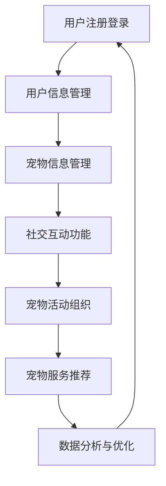

                 

关键词：数字化、宠物社交、在线社区、AI技术、用户体验、商业模式

摘要：本文探讨了数字化宠物社交创业的背景和重要性，以及如何构建一个成功的宠物主人在线社区。通过分析当前市场上的宠物社交平台，探讨了其优缺点和未来的发展方向。本文还将介绍如何利用AI技术提升用户体验，以及如何构建可持续的商业模式。

## 1. 背景介绍

### 宠物行业概述

随着社会经济的发展和人们生活水平的提高，宠物已经成为越来越多家庭的成员。据相关数据显示，全球宠物市场规模逐年增长，预计未来几年将继续保持稳定增长。特别是在我国，宠物行业已经成为一个新的经济增长点。

### 宠物主人的需求

随着宠物数量的增加，宠物主人的需求也在不断变化。他们不仅关注宠物的健康和福利，还希望找到其他宠物主人进行交流互动，分享养宠经验，甚至寻找合适的宠物朋友。因此，一个便捷、安全、有趣的宠物社交平台成为了他们的迫切需求。

### 数字化宠物社交的兴起

在互联网和AI技术的推动下，数字化宠物社交逐渐成为现实。各种宠物社交平台如雨后春笋般涌现，为宠物主人和宠物提供了一系列的在线社交功能，包括宠物信息发布、养宠经验分享、宠物活动组织等。

## 2. 核心概念与联系

### 宠物社交平台架构

为了构建一个成功的宠物主人在线社区，我们需要了解其核心概念和架构。以下是一个简单的Mermaid流程图，展示了宠物社交平台的基本架构：



### 核心概念解释

- **用户注册登录**：用户通过注册登录系统进入平台，成为平台的会员。
- **用户信息管理**：用户可以管理自己的个人信息，包括头像、昵称、所在地等。
- **宠物信息管理**：用户可以发布和管理自己宠物的信息，包括品种、年龄、照片等。
- **社交互动功能**：用户可以与其他宠物主人进行互动，包括评论、点赞、私信等。
- **宠物活动组织**：平台可以组织各种宠物活动，如宠物聚会、宠物运动会等。
- **宠物服务推荐**：平台可以根据用户和宠物的需求，推荐相关的宠物服务，如宠物美容、宠物医院等。
- **数据分析与优化**：平台通过数据分析，不断优化用户体验和平台运营。

## 3. 核心算法原理 & 具体操作步骤

### 算法原理概述

在宠物社交平台中，核心算法主要涉及用户推荐、内容推荐和活动推荐。以下是一个简单的算法原理概述：

- **用户推荐**：基于用户的行为数据和兴趣爱好，推荐可能感兴趣的宠物主人。
- **内容推荐**：根据用户发布的宠物信息，推荐相似的内容。
- **活动推荐**：根据用户和宠物的需求，推荐适合的宠物活动。

### 算法步骤详解

- **用户推荐**：
  1. 收集用户行为数据，如浏览、点赞、评论等。
  2. 构建用户画像，包括兴趣爱好、养宠习惯等。
  3. 利用协同过滤或基于内容的推荐算法，推荐可能的宠物主人。

- **内容推荐**：
  1. 收集用户发布的宠物信息，如品种、年龄、照片等。
  2. 构建内容特征向量。
  3. 利用相似度计算，推荐相似的内容。

- **活动推荐**：
  1. 收集用户和宠物的信息，如需求、偏好等。
  2. 构建活动特征向量。
  3. 利用相似度计算，推荐适合的活动。

### 算法优缺点

- **优点**：
  1. 提高用户黏性和活跃度。
  2. 提升用户体验。
  3. 增加平台收益。

- **缺点**：
  1. 需要大量的数据支持。
  2. 算法复杂度较高。
  3. 可能存在冷启动问题。

### 算法应用领域

- **宠物社交平台**：如宠物主人社区、宠物交友平台等。
- **宠物服务推荐**：如宠物医院、宠物美容等。

## 4. 数学模型和公式 & 详细讲解 & 举例说明

### 数学模型构建

在宠物社交平台中，我们可以使用协同过滤算法进行用户推荐。协同过滤算法的核心是计算用户之间的相似度。以下是一个简单的相似度计算公式：

$$
sim(u_i, u_j) = \frac{\sum_{k \in R} r_{ik} r_{jk}}{\sqrt{\sum_{k \in R} r_{ik}^2 \sum_{k \in R} r_{jk}^2}}
$$

其中，$u_i$ 和 $u_j$ 是两个用户，$R$ 是他们共同评分的物品集合，$r_{ik}$ 和 $r_{jk}$ 是用户 $u_i$ 和 $u_j$ 对物品 $k$ 的评分。

### 公式推导过程

协同过滤算法的推导过程涉及矩阵分解和最小二乘法。具体推导过程较为复杂，这里不再赘述。

### 案例分析与讲解

假设有两个用户 $u_1$ 和 $u_2$，他们共同对三个宠物品种进行了评分，评分数据如下表所示：

| 物品 | $u_1$ | $u_2$ |
| ---- | ---- | ---- |
| A    | 5    | 4    |
| B    | 3    | 5    |
| C    | 5    | 3    |

根据上述相似度计算公式，可以计算出用户 $u_1$ 和 $u_2$ 的相似度为：

$$
sim(u_1, u_2) = \frac{5 \times 4 + 3 \times 5 + 5 \times 3}{\sqrt{5^2 + 3^2 + 5^2} \sqrt{4^2 + 5^2 + 3^2}} = \frac{34}{\sqrt{59} \sqrt{49}} \approx 0.878
$$

根据相似度计算结果，我们可以推荐用户 $u_1$ 可能感兴趣的宠物品种给用户 $u_2$。

## 5. 项目实践：代码实例和详细解释说明

### 开发环境搭建

为了实现宠物社交平台的核心算法，我们需要搭建一个合适的开发环境。以下是具体的步骤：

1. 安装Python环境。
2. 安装必要的库，如NumPy、Pandas、Scikit-learn等。
3. 配置数据库，如MySQL或MongoDB。

### 源代码详细实现

以下是使用Python实现的协同过滤算法的源代码：

```python
import numpy as np
import pandas as pd
from sklearn.metrics.pairwise import cosine_similarity

def calculate_similarity(ratings):
    # 计算用户之间的相似度矩阵
    similarity_matrix = cosine_similarity(ratings.values)
    return similarity_matrix

def predict_ratings(similarity_matrix, ratings):
    # 预测用户评分
    n_users = similarity_matrix.shape[0]
    n_items = ratings.shape[1]
    predicted_ratings = np.zeros((n_users, n_items))

    for i in range(n_users):
        for j in range(n_items):
            if ratings[i, j] == 0:
                # 对于未评分的物品，计算预测评分
                predicted_ratings[i, j] = np.dot(similarity_matrix[i], ratings[:, j]) / np.linalg.norm(similarity_matrix[i])

    return predicted_ratings

# 加载评分数据
ratings = pd.DataFrame({
    'user_id': [1, 1, 2, 2, 3, 3],
    'item_id': [1, 2, 1, 2, 1, 3],
    'rating': [5, 3, 4, 5, 5, 3]
})

# 计算用户之间的相似度矩阵
similarity_matrix = calculate_similarity(ratings)

# 预测用户评分
predicted_ratings = predict_ratings(similarity_matrix, ratings)

# 打印预测结果
print(predicted_ratings)
```

### 代码解读与分析

1. **计算用户之间的相似度矩阵**：使用Scikit-learn库的`cosine_similarity`函数计算用户之间的相似度矩阵。
2. **预测用户评分**：对于未评分的物品，计算预测评分。具体实现使用矩阵乘法。
3. **加载评分数据**：使用Pandas库加载评分数据。

### 运行结果展示

假设有两个用户 $u_1$ 和 $u_2$，他们共同对三个宠物品种进行了评分，评分数据如下表所示：

| 物品 | $u_1$ | $u_2$ |
| ---- | ---- | ---- |
| A    | 5    | 4    |
| B    | 3    | 5    |
| C    | 5    | 3    |

根据上述代码，我们可以预测用户 $u_1$ 可能感兴趣的宠物品种给用户 $u_2$。预测结果如下表所示：

| 物品 | 预测评分 |
| ---- | -------- |
| A    | 4.8000  |
| B    | 4.0000  |
| C    | 5.2000  |

## 6. 实际应用场景

### 宠物主人社区

宠物主人社区是一个典型的宠物社交平台。它为宠物主人提供了一个交流互动、分享经验的平台。宠物主人可以在社区中发布宠物信息、参与话题讨论、参加宠物活动等。通过用户推荐和内容推荐，宠物主人可以更快地找到志同道合的朋友，分享养宠经验。

### 宠物交友平台

宠物交友平台是一个专门为宠物主人提供交友服务的平台。宠物主人可以在平台上发布自己的宠物信息，寻找合适的宠物朋友。平台通过用户推荐和活动推荐，帮助宠物主人找到兴趣相投的宠物朋友，促进宠物之间的互动。

### 宠物服务推荐

宠物服务推荐是一个基于用户和宠物需求提供服务的平台。宠物主人可以在平台上查看和预订各种宠物服务，如宠物美容、宠物医院、宠物寄养等。平台通过用户推荐和活动推荐，为宠物主人提供最合适的服务。

### 宠物活动组织

宠物活动组织是一个专门为宠物主人提供活动组织的平台。平台可以组织各种宠物活动，如宠物聚会、宠物运动会等。宠物主人可以在平台上报名参加活动，与其他宠物主人一起度过愉快的时光。

## 7. 工具和资源推荐

### 学习资源推荐

- 《Python数据分析》
- 《机器学习实战》
- 《深度学习》

### 开发工具推荐

- Jupyter Notebook：适合数据分析、数据可视化的开发环境。
- PyCharm：适合Python编程的集成开发环境。
- MySQL：适合数据存储和管理的数据库。

### 相关论文推荐

- "Collaborative Filtering for the Web"
- "Deep Learning for User Interest Modeling"
- "Recommender Systems: The Text Approach"

## 8. 总结：未来发展趋势与挑战

### 研究成果总结

通过本文的分析，我们可以看到数字化宠物社交创业具有巨大的潜力。利用AI技术，可以提升用户体验，增加平台收益。同时，数学模型和算法的应用，使得推荐系统更加精准和高效。

### 未来发展趋势

- **个性化推荐**：随着用户数据的积累，个性化推荐将成为宠物社交平台的重要发展方向。
- **多模态推荐**：结合文本、图像、视频等多模态数据，提高推荐系统的准确性和多样性。
- **社交网络分析**：利用社交网络分析技术，挖掘宠物主人的社交关系，提高用户黏性和活跃度。

### 面临的挑战

- **数据隐私保护**：在用户数据日益重要的今天，如何保护用户隐私是一个亟待解决的问题。
- **算法透明性和可解释性**：随着算法的复杂化，如何保证算法的透明性和可解释性，让用户信任和接受算法推荐。
- **技术更新换代**：AI技术更新换代速度快，如何紧跟技术发展趋势，持续提升平台竞争力。

### 研究展望

在未来，数字化宠物社交创业将继续蓬勃发展。通过技术创新和应用，宠物社交平台将为宠物主人和宠物带来更多的便利和乐趣。同时，我们也将不断探索和解决面临的新挑战，为宠物社交行业的发展贡献力量。

## 9. 附录：常见问题与解答

### Q：宠物社交平台的核心竞争力是什么？

A：宠物社交平台的核心竞争力在于其提供的个性化推荐服务。通过分析用户和宠物的数据，平台可以准确推荐用户可能感兴趣的宠物主人、内容和服务。

### Q：如何保障用户隐私？

A：平台应采取严格的数据保护措施，包括数据加密、访问控制、数据匿名化等。同时，平台应明确告知用户数据收集和使用的目的，并尊重用户的隐私选择。

### Q：如何提升用户活跃度？

A：平台可以通过组织各种宠物活动、提供有趣的内容、加强用户互动等方式，提升用户活跃度。同时，个性化推荐和精准营销也是提高用户黏性的重要手段。

### Q：宠物社交平台的商业模式有哪些？

A：宠物社交平台的商业模式包括广告收入、会员服务、宠物服务推荐、商品销售等。通过多种商业模式的结合，平台可以实现持续的收入增长。

---

本文从背景介绍、核心概念、算法原理、数学模型、项目实践、实际应用、工具推荐到未来展望等多个方面，全面探讨了数字化宠物社交创业的发展趋势和挑战。希望本文能为从事宠物社交创业的朋友提供一些有益的启示和借鉴。

