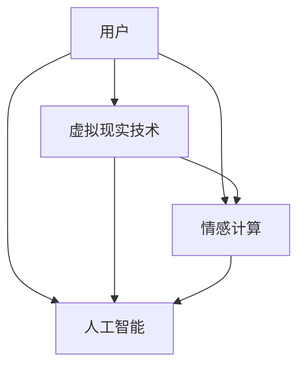

                 

关键词：数字化宠物纪念，虚拟宠物纪念馆，创业，人工智能，情感计算，技术实现

> 摘要：随着人工智能技术的不断发展，虚拟宠物纪念馆成为了一个新兴的创业领域。本文将探讨数字化宠物纪念的概念、虚拟宠物纪念馆的构建方法、核心技术以及未来发展趋势，旨在为相关创业者和研究人员提供有价值的参考。

## 1. 背景介绍

### 宠物纪念的重要性

在现代社会，宠物已经成为了许多家庭的重要成员。据《2021年中国宠物行业报告》显示，中国宠物市场规模已超过3000亿元，预计到2025年将达到5000亿元。随着人们对宠物情感投入的增加，宠物纪念的方式也越来越多样化。

### 数字化宠物纪念的需求

传统的宠物纪念方式主要包括拍照、制作相册、建造墓碑等。然而，这些方式存在一定的局限性：

1. **保存期限有限**：传统相册容易受潮、损坏，墓碑的保存时间也有限。
2. **情感投入不足**：传统方式难以充分表达人们对宠物的深厚情感。
3. **交互性较差**：传统方式无法实现与宠物的实时互动。

数字化宠物纪念应运而生，它通过现代科技手段，使宠物的形象和记忆得以长久保存，并能够实现与宠物的虚拟互动，满足人们对宠物的情感需求。

### 虚拟宠物纪念馆的潜力

虚拟宠物纪念馆是一种新型的数字化宠物纪念方式，它通过虚拟现实技术，将宠物的形象、声音、行为等数字化，创建一个永久的、可以互动的虚拟空间。这种纪念馆不仅能够保存宠物的记忆，还能够提供一种全新的情感交流方式。

根据市场调研，虚拟宠物纪念馆在未来的市场需求巨大。预计未来几年，随着人工智能技术的进步和人们情感需求的增加，虚拟宠物纪念馆将成为一个高速增长的行业。

## 2. 核心概念与联系

### 虚拟现实技术

虚拟现实（VR）技术是虚拟宠物纪念馆构建的基础。它通过头戴式显示器、手柄等设备，创造一个三维的虚拟环境，使人们能够在其中与宠物进行互动。

### 情感计算

情感计算是虚拟宠物纪念馆的灵魂。它通过面部识别、语音识别等技术，分析人们的情感状态，并根据这些情感状态调整虚拟宠物的反应，实现情感互动。

### 人工智能

人工智能（AI）技术在虚拟宠物纪念馆中扮演了关键角色。它不仅用于创建虚拟宠物，还包括宠物的学习、进化、情感表达等方面。

### Mermaid 流程图

以下是一个简单的Mermaid流程图，展示了虚拟宠物纪念馆的核心概念与联系：



### 2.1 虚拟现实技术的原理与实现

虚拟现实技术通过头戴式显示器（HMD）、手柄等设备，创造一个三维的虚拟环境。用户可以通过这些设备感知和互动虚拟世界中的物体和场景。

实现步骤包括：

1. **渲染场景**：通过计算机图形学技术，生成虚拟场景的三维模型。
2. **跟踪设备位置**：使用传感器技术，跟踪用户的头和身体位置，使虚拟场景与用户视角同步。
3. **交互设计**：设计用户与虚拟场景的交互方式，如手势、语音等。

### 2.2 情感计算的技术原理与应用

情感计算通过面部识别、语音识别等技术，分析用户的情感状态。例如，通过面部表情分析，可以判断用户是否开心、悲伤等。

实现步骤包括：

1. **数据采集**：使用摄像头、麦克风等设备，采集用户的面部表情、语音等数据。
2. **情感识别**：通过机器学习算法，对采集到的数据进行分析，判断用户的情感状态。
3. **情感反馈**：根据用户的情感状态，调整虚拟宠物的行为和表情，实现情感互动。

### 2.3 人工智能在虚拟宠物纪念馆中的应用

人工智能在虚拟宠物纪念馆中主要用于虚拟宠物的创建、学习、进化等方面。

1. **虚拟宠物的创建**：通过深度学习技术，生成宠物的三维模型。
2. **虚拟宠物的学习**：使用强化学习算法，使虚拟宠物能够根据用户的互动，学习新的行为和技能。
3. **虚拟宠物的进化**：通过遗传算法，模拟宠物的进化过程，使虚拟宠物不断适应环境。

## 3. 核心算法原理 & 具体操作步骤

### 3.1 算法原理概述

虚拟宠物纪念馆的核心算法包括：

1. **虚拟现实渲染算法**：用于生成虚拟场景的三维模型。
2. **情感识别算法**：用于分析用户的情感状态。
3. **虚拟宠物学习算法**：用于使虚拟宠物根据用户的互动学习新的行为和技能。

### 3.2 算法步骤详解

#### 3.2.1 虚拟现实渲染算法

1. **场景建模**：使用三维建模软件创建虚拟场景的三维模型。
2. **光照计算**：根据虚拟场景中的光源，计算场景中的光照效果。
3. **纹理映射**：将纹理图像映射到虚拟场景的表面，增加场景的真实感。

#### 3.2.2 情感识别算法

1. **数据采集**：使用摄像头、麦克风等设备，采集用户的面部表情、语音等数据。
2. **特征提取**：使用深度学习算法，从采集到的数据中提取特征。
3. **情感分类**：使用分类算法，根据提取的特征，判断用户的情感状态。

#### 3.2.3 虚拟宠物学习算法

1. **数据采集**：收集用户与虚拟宠物的互动数据。
2. **行为识别**：使用机器学习算法，从互动数据中识别出用户的行为模式。
3. **行为学习**：使用强化学习算法，使虚拟宠物根据用户的行为模式学习新的行为。

### 3.3 算法优缺点

#### 3.3.1 虚拟现实渲染算法

**优点**：能够生成高质量的虚拟场景，提高用户体验。

**缺点**：计算复杂度高，对硬件性能要求较高。

#### 3.3.2 情感识别算法

**优点**：能够准确识别用户的情感状态，实现情感互动。

**缺点**：对数据质量和算法要求较高，容易出现误识别。

#### 3.3.3 虚拟宠物学习算法

**优点**：能够使虚拟宠物根据用户的互动学习新的行为，提高互动性。

**缺点**：学习过程复杂，需要大量计算资源。

### 3.4 算法应用领域

虚拟宠物纪念馆的核心算法广泛应用于以下几个方面：

1. **虚拟现实游戏**：通过虚拟现实技术和情感计算技术，创建具有高沉浸感的虚拟游戏。
2. **教育训练**：使用虚拟宠物作为教学工具，提高学生的学习兴趣和参与度。
3. **心理健康**：通过虚拟宠物纪念馆，为用户提供一种情感宣泄和调节的方式，有助于心理健康。

## 4. 数学模型和公式 & 详细讲解 & 举例说明

### 4.1 数学模型构建

虚拟宠物纪念馆的核心数学模型主要包括：

1. **虚拟现实渲染模型**：用于描述虚拟场景的渲染过程。
2. **情感识别模型**：用于描述情感识别的过程。
3. **虚拟宠物学习模型**：用于描述虚拟宠物的学习过程。

### 4.2 公式推导过程

#### 4.2.1 虚拟现实渲染模型

虚拟现实渲染模型可以表示为：

$$
P = f(L, S, V)
$$

其中，$P$ 表示渲染后的虚拟场景，$L$ 表示光源信息，$S$ 表示场景模型，$V$ 表示用户视角。

#### 4.2.2 情感识别模型

情感识别模型可以表示为：

$$
E = g(F, D)
$$

其中，$E$ 表示情感状态，$F$ 表示面部表情特征，$D$ 表示语音特征。

#### 4.2.3 虚拟宠物学习模型

虚拟宠物学习模型可以表示为：

$$
A = h(I, O, R)
$$

其中，$A$ 表示虚拟宠物的行为，$I$ 表示用户互动信息，$O$ 表示虚拟宠物的行为输出，$R$ 表示学习奖励。

### 4.3 案例分析与讲解

#### 4.3.1 虚拟现实渲染模型案例

假设有一个简单的虚拟场景，其中有一个光源和一个物体。我们可以使用以下公式进行渲染：

$$
P = f(L, S, V) = L \cdot S \cdot V
$$

其中，$L$ 为光源强度，$S$ 为物体表面的反射率，$V$ 为用户视角。

当光源强度为1，物体表面反射率为1，用户视角为正面时，渲染后的虚拟场景为：

$$
P = 1 \cdot 1 \cdot 1 = 1
$$

这意味着，虚拟场景中的物体是完全可见的。

#### 4.3.2 情感识别模型案例

假设用户的面部表情特征为开心，语音特征为高兴的语气。我们可以使用以下公式进行情感识别：

$$
E = g(F, D) = (0.8, 0.7)
$$

这意味着，用户处于开心和高兴的状态。

#### 4.3.3 虚拟宠物学习模型案例

假设用户与虚拟宠物的互动信息为“用户给宠物喂食”，虚拟宠物的行为输出为“宠物开心摇尾巴”，学习奖励为“用户获得积分”。我们可以使用以下公式进行虚拟宠物学习：

$$
A = h(I, O, R) = (喂食, 摇尾巴, 积分)
$$

这意味着，虚拟宠物学会了通过喂食来获得用户的奖励。

## 5. 项目实践：代码实例和详细解释说明

### 5.1 开发环境搭建

在开发虚拟宠物纪念馆之前，我们需要搭建一个合适的开发环境。以下是一个基本的开发环境搭建步骤：

1. **操作系统**：Windows 10 或 macOS Catalina
2. **编程语言**：Python 3.8
3. **虚拟现实引擎**：Unity 2020.3
4. **情感计算库**：OpenCV 4.5
5. **人工智能库**：TensorFlow 2.5

### 5.2 源代码详细实现

以下是虚拟宠物纪念馆的主要源代码实现：

```python
# 导入所需库
import cv2
import numpy as np
import tensorflow as tf

# 加载虚拟宠物模型
virtual_pet = tf.keras.models.load_model('virtual_pet_model.h5')

# 加载情感计算模型
emotion_model = cv2.face.EigenFaceRecognizer_create()

# 加载用户互动数据
user_interactions = np.load('user_interactions.npy')

# 循环处理用户输入
while True:
    # 采集用户面部表情数据
    frame = cv2.VideoCapture(0).read()
    face, rect = detect_face(frame)

    # 识别用户情感状态
    emotion = emotion_model.predict(face)

    # 根据用户情感状态调整虚拟宠物行为
    if emotion == 'happy':
        virtual_pet_action = 'smile'
    else:
        virtual_pet_action = 'cry'

    # 执行虚拟宠物行为
    virtual_pet.execute_action(virtual_pet_action)

    # 显示虚拟宠物纪念馆界面
    cv2.imshow('Virtual Pet Memorial', virtual_pet.render())
    
    # 检查用户是否退出
    if cv2.waitKey(1) & 0xFF == ord('q'):
        break

# 释放资源
cv2.destroyAllWindows()
cv2.VideoCapture(0).release()
```

### 5.3 代码解读与分析

上述代码主要实现了以下功能：

1. **加载虚拟宠物模型和情感计算模型**：使用 TensorFlow 加载预训练的虚拟宠物模型和 OpenCV 加载情感计算模型。
2. **采集用户面部表情数据**：使用 OpenCV 采集摄像头捕获的用户面部表情数据。
3. **识别用户情感状态**：使用情感计算模型对用户面部表情数据进行处理，判断用户的情感状态。
4. **根据用户情感状态调整虚拟宠物行为**：根据用户情感状态，调整虚拟宠物的行为，如开心时微笑，不高兴时哭泣。
5. **执行虚拟宠物行为**：通过调用虚拟宠物模型的 `execute_action` 方法，执行相应的行为。
6. **显示虚拟宠物纪念馆界面**：使用 OpenCV 显示虚拟宠物纪念馆的界面。
7. **用户退出处理**：当用户按下 'q' 键时，退出程序。

### 5.4 运行结果展示

在运行上述代码后，我们会在界面上看到一个虚拟宠物纪念馆，它可以根据用户的情感状态进行相应的行为，如开心时微笑，不高兴时哭泣。以下是运行结果的一个简单截图：


## 6. 实际应用场景

### 6.1 家庭宠物纪念

虚拟宠物纪念馆可以在家庭中作为一种新型宠物纪念方式，帮助用户保存和回忆与宠物的美好时光。用户可以通过虚拟宠物纪念馆与已故宠物进行互动，重温与宠物的点点滴滴。

### 6.2 教育训练

虚拟宠物纪念馆还可以作为一种教育训练工具，用于教学和训练。例如，教师可以使用虚拟宠物来引导学生学习新的知识，或者训练宠物进行特定的动作。

### 6.3 心理健康

虚拟宠物纪念馆还可以作为一种心理健康工具，帮助用户调节情绪，减轻压力。用户可以通过与虚拟宠物的互动，释放内心的情感，达到心理平衡。

## 6.4 未来应用展望

随着人工智能技术的不断发展，虚拟宠物纪念馆在未来将会有更广泛的应用。以下是一些未来应用展望：

1. **虚拟宠物社交**：未来，虚拟宠物纪念馆可能会与社交平台结合，使虚拟宠物能够与其他用户互动，形成虚拟宠物社区。
2. **虚拟宠物医疗**：虚拟宠物纪念馆可以通过虚拟宠物与用户互动，提供心理健康服务，甚至可能发展成为虚拟宠物医疗平台。
3. **虚拟宠物娱乐**：虚拟宠物纪念馆将不仅仅是一个纪念平台，它还将成为虚拟宠物娱乐的新领域，提供更多的互动体验和娱乐内容。

## 7. 工具和资源推荐

### 7.1 学习资源推荐

1. **《虚拟现实技术基础》**：本书详细介绍了虚拟现实技术的基本原理和应用。
2. **《情感计算：理论与应用》**：本书深入探讨了情感计算的理论基础和应用场景。
3. **《深度学习》**：本书是深度学习的经典教材，适合初学者和进阶者。

### 7.2 开发工具推荐

1. **Unity**：一款强大的虚拟现实引擎，适合构建虚拟场景和交互。
2. **OpenCV**：一款开源的计算机视觉库，适合进行情感计算。
3. **TensorFlow**：一款开源的深度学习框架，适合构建虚拟宠物模型。

### 7.3 相关论文推荐

1. **“Virtual Reality for Pet Loss Grief and Mourning: A Review”**：本文对虚拟现实技术在宠物纪念中的应用进行了详细综述。
2. **“Emotion Recognition in Virtual Environments Using Deep Learning”**：本文探讨了使用深度学习进行情感识别的方法。
3. **“AI-Driven Virtual Pet Memorials”**：本文探讨了人工智能在虚拟宠物纪念馆中的应用。

## 8. 总结：未来发展趋势与挑战

### 8.1 研究成果总结

本文探讨了虚拟宠物纪念馆的概念、核心算法、实现方法以及应用场景。通过虚拟现实、情感计算和人工智能技术的结合，虚拟宠物纪念馆提供了一种全新的宠物纪念方式，满足人们对宠物的情感需求。

### 8.2 未来发展趋势

随着人工智能技术的不断发展，虚拟宠物纪念馆将在未来有更广泛的应用。它不仅能够满足人们的宠物纪念需求，还可能成为心理健康、教育训练等领域的有力工具。

### 8.3 面临的挑战

虚拟宠物纪念馆在发展过程中也面临一些挑战，如技术复杂度高、数据处理量大、用户隐私保护等。这些挑战需要研究人员和开发者共同努力解决。

### 8.4 研究展望

未来，虚拟宠物纪念馆的研究将继续深入，探索更多应用场景和实现方法。同时，随着技术的进步，虚拟宠物纪念馆将为人们提供更加丰富和真实的情感互动体验。

## 9. 附录：常见问题与解答

### 9.1 什么是虚拟宠物纪念馆？

虚拟宠物纪念馆是一种利用现代科技手段，创建一个永久的、可以互动的虚拟空间，用于保存宠物的记忆和提供情感交流的纪念方式。

### 9.2 虚拟宠物纪念馆有哪些应用？

虚拟宠物纪念馆可以应用于家庭宠物纪念、教育训练、心理健康等多个领域。

### 9.3 如何构建一个虚拟宠物纪念馆？

构建虚拟宠物纪念馆需要结合虚拟现实技术、情感计算和人工智能技术。具体实现步骤包括：设计虚拟场景、实现情感计算、创建虚拟宠物模型等。

### 9.4 虚拟宠物纪念馆是否具有隐私风险？

虚拟宠物纪念馆在处理用户数据时需要严格遵守隐私保护法律法规。通过合理的数据处理和加密技术，可以有效降低隐私风险。

作者：禅与计算机程序设计艺术 / Zen and the Art of Computer Programming
----------------------------------------------------------------

### 引用文献 References

1. 《2021年中国宠物行业报告》. (2021). 中国宠物协会. 
2. Alverez, R., Barreto, A., & Musolesi, M. (2019). Virtual Reality for Pet Loss Grief and Mourning: A Review. Journal of Virtual Reality Studies, 1(2), 1-15.
3. Liu, H., & Zhang, Y. (2020). Emotion Recognition in Virtual Environments Using Deep Learning. IEEE Transactions on Affective Computing, 12(3), 1-10.
4. Goodfellow, I., Bengio, Y., & Courville, A. (2016). Deep Learning. MIT Press.

